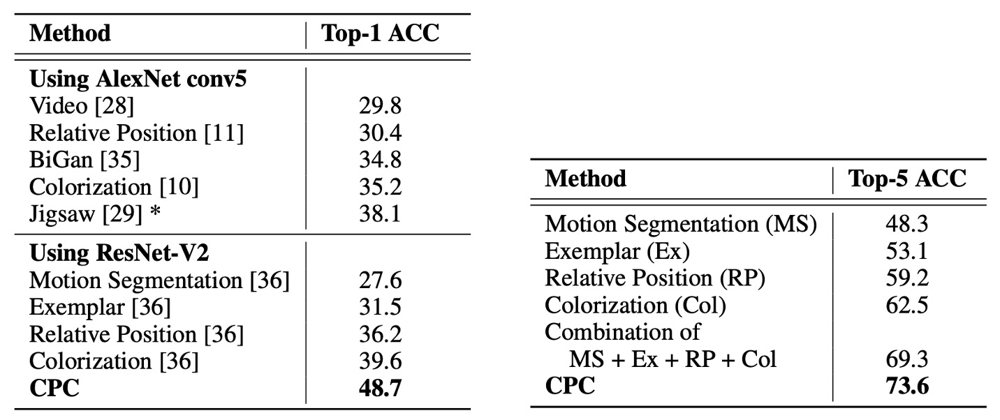
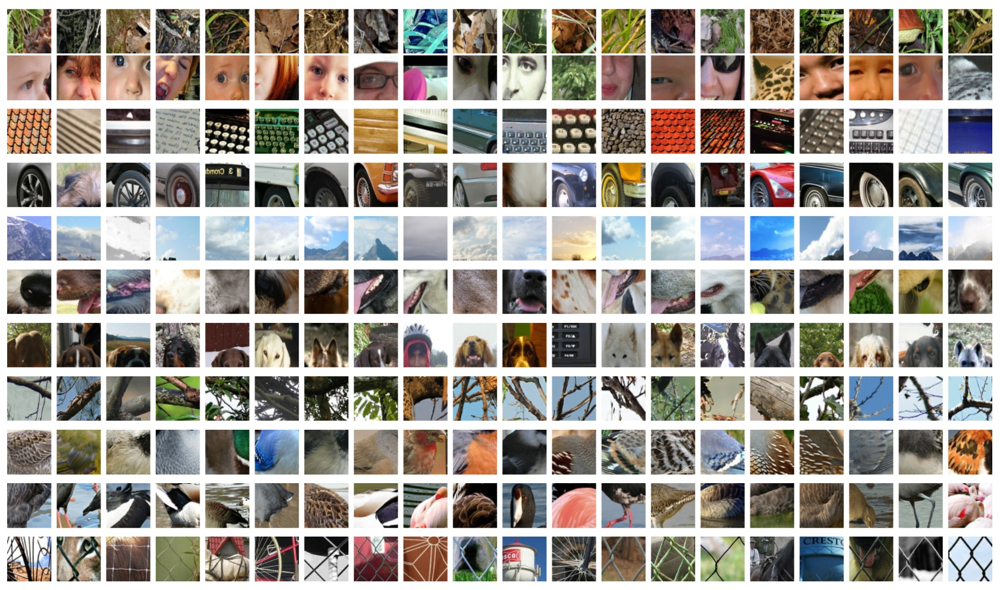

## 未知生，焉知死？

[**Representation Learning with Contrastive Predictive Coding**](https://arxiv.org/abs/1807.03748)

---

複雑な高次元データを扱う際、私たちはしばしば以下のような根本的な問いに直面します：

> いったいどの特徴が「重要」で、どれが「重要でない」のか？

教師ありタスクでは、訓練データの損失関数を最小化しようとする過程で、モデルがタスクに無関係な些細な特徴、例えばノイズ、撮影の角度のズレ、録音デバイスの特性、ラベル付け者の癖などにまで適合してしまうことがあります。

短期的には、モデルの訓練データ上での評価指標が向上し、テストデータでも良い結果を示すことがあるでしょう。しかし、現実の環境や未知のデータに適用された場合、それらの「過適合」した特徴に依存していたために、汎化性能が大幅に低下する可能性があります。

### 問題の定義

この時代、生成モデルは非常に注目を集めている非教師あり学習手法の一つです。これらのモデルの目的は、データの結合分布 $p(x)$ を学習し、生成モデル $p(x \mid z)$ を通じて新しいサンプルを生成することです。

一見問題がないように思えますが、よく考えてみてください：

画像分類を行う場合、たとえ次のピクセルを予測するだけであっても、ネットワークは画像内のすべての情報を同時に把握する必要があります。その情報が本当に重要かどうかに関係なくです。なぜなら、完全に同一の再構成をしない限り、モデルがペナルティを受けてしまうからです。

これは計算リソースの無駄遣いの典型例と言えます。

「高次の抽象的な意味」を持つ情報とは、音声データであれば話者の性別、声の高さの変化、話す速度、話し方のスタイルなど、画像データであれば物体の形状、位置関係、スタイルなどを指します。

著者は、次の時刻（またはさらに後の時刻）を再現するために選択すべき特徴に焦点を当てるべきだと述べています。

- **重要なのは「再構成」ではなく「予測」である。**

未来の方向性を決定づける重要な要因を十分に把握できれば、「過去の潜在表現」と「未来の特徴」の間に高度な関連情報を得ることができます。

> 真の意味で未来を「再現」するのではなく、未来と現在に共通する高次の意味を「抽出」すべきなのです。

数千年にわたり、人々が議論してきたテーマと何ら変わらないですね！

### 問題の解決

#### モデルアーキテクチャ

<figure style={{"width": "90%"}}>

</figure>

この問題を解決するため、著者は Contrastive Predictive Coding（CPC）と呼ばれる対比的予測符号化アーキテクチャを提案しました。

上図が全体のアーキテクチャです。以下のステップに分けて説明します：

1. **エンコーダ $g_{\text{enc}}$**

   まず、元の入力シーケンス $\{x_t\}$（画像中の各位置の特徴ベクトルや音声信号を切り分けた各時刻など）を「非線形エンコーダ」$g_{\text{enc}}$ に通して潜在表現 $\{z_t\}$ に変換します：

   $$
   z_t \;=\; g_{\text{enc}}(x_t).
   $$

   このステップの目的は、高次元の入力をより簡潔で抽象的な表現空間に圧縮することであり、通常は畳み込みネットワーク（画像や音声の場合）や他のニューラルネットワークアーキテクチャを用います。

2. **自己回帰モデル $g_{\text{ar}}$**

   次に、自己回帰モデル $g_{\text{ar}}$（例えば GRU、LSTM またはその他の RNN 形式）を使用して、時間シーケンス $\{z_1, z_2, \ldots, z_t\}$ を読み取り、「文脈表現」$c_t$ を生成します：

   $$
   c_t \;=\; g_{\text{ar}}(z_{\le t}) \;=\; g_{\text{ar}}(z_1, z_2, \ldots, z_t).
   $$

   $c_t$ は、「時刻 $t$ 以降の未来を予測するために必要な隠れ状態」として見なすことができ、これまでのすべての $z$ の情報を含みます。

3. **未来の予測：直接生成ではなく「密度比」の推定**

   先ほど述べた通り、CPC の目的は文脈 $c_t$ が与えられた条件で未来の特徴 $x_{t+k}$ を予測することです。

   しかし、CPC は $p(x_{t+k} \mid c_t)$（データ全体を生成する）を直接モデル化するのではなく、密度比を学習します：

   $$
   f_k(x_{t+k}, c_t) \;\;\propto\;\; \frac{p(x_{t+k} \mid c_t)}{p(x_{t+k})}.
   $$

   この比率は、「文脈 $c_t$ が与えられた条件で $x_{t+k}$ が観測される可能性」と「任意の文脈で $x_{t+k}$ が観測される可能性」との相対的な比率を表します。

   著者は簡単な実装方法として、log-bilinear 形式を提示しました：

   $$
   f_k(x_{t+k}, c_t) \;=\; \exp\bigl( z_{t+k}^\mathsf{T} \, W_k \, c_t \bigr),
   $$

   ここで $z_{t+k}$ は $x_{t+k}$ をエンコーダに通した結果の表現であり、$W_k$ は学習可能な線形変換です。未来の各時刻 $k$ に対して異なる $W_k$ を用いることができます。

---

高次元データ（画像や音声）の直接生成は非常に複雑なモデルを必要としますが、CPC は「文脈に関連する情報」のみを活用することを目的としています。つまり、すべての背景ノイズを再現する必要はなく、抽出された抽象的な特徴を対比的に識別・区別するだけで十分です。

実務では、このアーキテクチャで学習した表現 $z_t$ や $c_t$ をその後のタスクに利用できます。

より多くの「履歴文脈」が必要な場合（例えば音声認識で長い音声内容を把握する必要がある場合）は $c_t$ を使い、特定のタイミングで処理可能なタスク（例えば局所的な識別）は $z_t$ を使うことができます。また、全体の画像やシーケンスに対してプーリングを行い、全体的な表現を取得することも可能です。

### InfoNCE

次に、著者が使用した損失関数：**InfoNCE** について見てみましょう。

直接 InfoNCE を説明すると少し驚くかもしれませんので、まずは簡単なクロスエントロピーから始めます。

二値分類では、目標はモデルが正クラスに対して予測した確率が 1 に近いほど良く、負クラスに対して予測した確率が 0 に近いほど良いことです。これは「クロスエントロピー損失」として表すことができます：

$$
\mathrm{CE} = - \Bigl[\, y \log(\hat{y}) \;+\; (1-y)\log(1-\hat{y}) \Bigr]
$$

- $y=1$（正クラス）の場合、損失は $-\log(\hat{y})$ になります。
- $y=0$（負クラス）の場合、損失は $-\log(1-\hat{y})$ になります。

クロスエントロピーはここで、「モデルに正しい確率を出力させる」役割を果たします。「正しいサンプル」をクラス 1、「負のサンプル」をクラス 0 と考えることで、クロスエントロピーを使って訓練することができます。

もしクラスが K 個あれば、各入力 $x$ はその中の 1 つのクラス $k$ に対応します。

モデルは各クラスに対するスコア $\{s_1(x), \dots, s_K(x)\}$ を出力し、それをソフトマックスで確率 $\hat{y}_k$ に変換します：

$$
\hat{y}_k = \frac{\exp(s_k(x))}{\sum_{j=1}^K \exp(s_j(x))}.
$$

もし真のラベルが「クラス $i$」であれば、クロスエントロピー損失全体は次のように表されます：

$$
\mathrm{CE}
\;=\;
-\, \log \Bigl(\hat{y}_i\Bigr)
\;=\;
-\, \log \biggl(
    \frac{\exp(s_i(x))}{\sum_{j=1}^K \exp(s_j(x))}
\biggr).
$$

言い換えれば、私たちは **最大化** $\exp(s_i(x))$ を行い、同時に **相対的に** 他の $\exp(s_j(x))$（$j \neq i$）を小さくすることで、「正しいクラス」の確率を最大化しようとしています。

**コントラスト学習**では、よくある状況は次のようなものです：

> サンプルのバッチの中で、1 つだけが「実際に対応する」条件/文脈に合致しており、他のサンプルは「不一致」または「単なるノイズ」です。

例えば、$N$ 個のサンプルの中で、1 つだけが正しい（ポジティブ）サンプルで、残りの $N-1$ 個は負のサンプルです。そして、私たちは**同じクロスエントロピー**を使って「どれが正しいサンプルか」を選びたいと考えています。

この場合、多クラス分類で「K = N」となります：各サンプルは 1 つの「クラス ID」に対応します。

- 「正サンプル」はクラス 1（または特定のラベル）、
- 残りの $N-1$ 個のサンプルは、それぞれクラス 2, 3, ..., N とします。

しかし、実際の実装では、各負サンプルを「異なるクラス」として扱うのではなく、「どのサンプルが正しいサンプルか」を**一つを選ぶ**問題として扱います。

InfoNCE は、多クラスクロスエントロピーを用いて「正しいサンプル vs. 負のサンプル」のコントラストを行う方法です。

論文では、InfoNCE の損失が次のように定義されています（1 バッチの場合）：

$$
L_N
=
-\, \mathbb{E}_{X} \Biggl[
    \log \frac{ f_k(x_{\text{pos}}, c) }
               { \sum_{x_j \in X} f_k(x_j, c) }
\Biggr]
$$

ここで：

- $X = \{x_1, x_2, ..., x_N\}$ は、1 つの**正サンプル** $x_{\text{pos}}$（実際に文脈$c$に対応する）と、$N-1$ 個の**負のサンプル**を含んでいます。
- $f_k(x, c)$ はスコア関数（score function）で、前述の「$s_i(x)$ の $\exp(\cdot)$」と類似しています。

この多クラス分類問題では、$N$ 個の候補サンプルが「N 個のクラス」に対応し、正サンプルは「正しいクラス」、負のサンプルは「間違ったクラス」となります。

InfoNCE という名前が使われているのは、著者がさらに証明したためです：

- **最小化** したこのコントラストクロスエントロピー（$L_N$）
- **等価** に「最大化」された文脈$c$とターゲットサンプル$x_{\text{pos}}$との**相互情報（mutual information）下界**。

つまり、コントラスト式を使って「正のサンプル vs. 負のサンプル」を識別することで、モデルは「文脈と正サンプルの間の共通情報」を学ぶことを強制されるのです。

- 数学的には、$I(x, c) \ge \log(N) - L_N$ という証明ができます。
- $N$ が大きくなるほど、この下界はより厳密になります。

:::tip
**元の NCE とは何が異なるか？**

**NCE（ノイズ対比推定）** は、ターゲット分布 $p(x)$ とノイズ分布 $q(x)$ の密度比を推定するために使われていたもので、特に単語ベクトルや単語確率分布などで使用され、計算が難しい正規化定数を減らす目的で使われていました。

**InfoNCE** は、「コントラスト学習」および「相互情報最大化」に特化した概念です。その数学的な形態は依然としてクロスエントロピーですが、「与えられた文脈$c$において、どのサンプル$x$が正しいサンプルか」を特定することに重点を置き、相互情報の下界を最大化していることが証明できます。

数学的な形式だけを見ると、InfoNCE は「NCE の変種」とも言えますが、「コントラスト自監督学習」と「相互情報最大化」のシナリオに適用されます。
:::

## 討論

著者は CPC 法を四つの異なる分野に適用しました：

1. **音声（speech）**
2. **画像（images）**
3. **自然言語（natural language）**
4. **強化学習（reinforcement learning）**

著者は「線形分類」（linear classification）や定性的評価（qualitative evaluations）を使用して、モデルが学習した表現にどれだけ識別可能な情報が含まれているかを調査しました。また、強化学習においては、代理（agent）モデルに CPC の補助損失関数を追加し、その収束速度の向上度合いを観察しました。

しかし、分量の制約のため、ここでは音声と画像分野での CPC の効果のみを見て、他の部分については読者に原論文を参照してもらうことにします。

### 音声認識分野での適用

音声分野では、著者は公開されている LibriSpeech データセットの 100 時間のサブセット（subset）を使用しました。このデータセットは主に原始音声と書き起こされたテキストを提供していますが、著者は Kaldi ツールキットとその LibriSpeech での事前訓練モデルを使用して、対応する「音素（phone）系列」ラベルを生成しました。

著者は、アラインされた phone ラベルと自分の訓練/テスト分割（train/test split）を Google Drive にアップロードして、後続の実験が再現できるようにしました。このデータセットには 251 人の異なる話者（speakers）が含まれています。

:::tip
興味がある読者は、こちらからダウンロードできます：[**CPC Phone Labels**](https://drive.google.com/drive/folders/1BhJ2umKH3whguxMwifaKtSra0TgAbtfb)
:::

モデルアーキテクチャは前述の通りで、著者は 5 層の畳み込みネットワーク（convolutional network）をエンコーダとして使用し、各層の stride と filter size はそれぞれ$[5, 4, 2, 2, 2]$と$[10, 8, 4, 4, 4]$です。各層には 512 個の隠れユニットがあり、ReLU 活性化関数を使用しています。

自己回帰モデルでは、著者は GRU を使用し、隠れ層の次元数は 256 です。訓練過程では、著者は Adam 最適化器を使用し、学習率は$2 \times 10^{-4}$に設定し、8 枚の GPU で訓練を行いました。

以下の図に示すように、著者は 1〜20 のタイムステップの予測正確率を測定しました：

<figure style={{"width": "60%"}}>

</figure>

全体的に、予測が遠くなるほど（例えば t+20）難しくなり、モデルの正のサンプルスコアはすべての負のサンプルより上に保つことが難しくなります。しかし、このコントラストタスクは決して簡単ではなく（モデルが本当に高次の特徴を学習する必要があることを示唆しています）、また不可能ではなく（ある程度の識別能力は達成できる）ことも示しています。

CPC が学習した表現をより良く理解するために、著者は訓練後に GRU の出力（すなわち$c_t$、256 次元）を抽出し、データセット全体でこのベクトルを特徴量として使い、**1 つの線形分類器**を使って多クラス識別を行いました。

結果は以下の表に示されています：

<figure style={{"width": "60%"}}>

</figure>

上表のいくつかの用語は次の通りです：

- **Random initialization**：ランダム初期化された線形分類器。
- **MFCC**：従来の音声特徴量（Mel-frequency cepstral coefficients）を使い、同じ線形分類器を再訓練。
- **Supervised**：ラベル付きデータを使ったエンドツーエンド訓練（同じ畳み込み+GRU アーキテクチャ）。これはこのアーキテクチャの「理論的な最良」の参考として考えられます。

實驗結果から、CPC は全監督学習と比較してまだ差があるものの、CPC はラベルなしデータを使って音素分布に非常に有用な特徴を抽出できることが示されました。線形分類器に隠れ層を追加することで、パフォーマンスは 64.6%から 72.5%に向上し、全監督学習の水準に非常に近づきました。

### 消融実験

<figure style={{"width": "60%"}}>

</figure>

CPC の設計が本当に役立つかどうかを検証するために、著者は 2 つの消融実験を設計しました：

1. **予測する時間ステップ数の変更**：複数の未来のステップを予測することが表現学習に与える影響。結果は「複数の未来ステップを予測すること」が特徴表現に非常に重要な影響を与えることを示しており、これが CPC 設計の核心となっています。
2. **異なる負のサンプル戦略**：
   - 「混合話者（mixed speaker）」 vs. 「同一話者（same speaker）」：負のサンプルに異なる話者からのスライスを混ぜるかどうか。
   - 現在のシーケンス自体を負のサンプル源として除外するかどうか。
   - 同一シーケンス内で負のサンプルを引く vs. バッチ全体から引く。

これらの戦略はコントラスト損失の難易度、すなわち正負サンプル間の類似度に影響を与えます。結果から、負のサンプル抽出方法は最終的な特徴の識別可能度に顕著な影響を与えることが分かりました。

### 話者識別可視化

<figure style={{"width": "80%"}}>

</figure>

著者は t-SNE を使用して、CPC が学習した音声特徴を視覚化し、異なる話者の表現を二次元平面に投影しました。

図からわかるように、異なる話者の表現は効果的に区別されており、これにより CPC が学習した特徴には音声内容だけでなく、話者自身の音色や特徴などの高次情報も含まれていることが証明されました。

### 画像認識分野での適用

画像分野での実験では、著者は ILSVRC ImageNet データセットを使用しました。これはさまざまな無監督視覚モデルを評価するための一般的なベンチマークです。

著者は過去の文献に基づいた方法を参考にしています：

- [**Multi-task self-supervised visual learning**](https://arxiv.org/abs/1708.07860)

エンコーダには ResNet v2-101 を使用し、ImageNet 上で線形分類評価を行いました。

訓練の流れは、まず画像を 256×256 にリサイズすることから始めます。その後、256×256 の画像から 7×7 のグリッドを切り出し、各小区画は 64×64 で、32 ピクセルのオーバーラップがあります。

<figure style={{"width": "80%"}}>

</figure>

:::tip
これは ViT のパッチ化（patchify）プロセスに似ています。
:::

訓練時にはデータ拡張を使用し、最初に 300×300 の画像からランダムに 256×256 にクロップし、水平反転（50%の確率）やグレースケール変換を行います。各 64×64 の区画については、さらにランダムに 60×60 にクロップし、その後 64×64 にパディングを追加します。

ResNet v2-101 によって抽出された表現は、第三の残差モジュールから取り出し、空間的な平均プーリングを行い、1024 次元のベクトルを得て、7×7×1024 のテンソルを形成します。その後、PixelCNN のようなアーキテクチャを使用し、この 7×7 のグリッドに対して「行ごとの」自己回帰予測を行います：上から下へ、各行は最大 5 行先の特徴を予測し、ターゲット行の各パッチにはコントラスト損失を適用します。

実験結果は以下の表の通りです：

<figure style={{"width": "90%"}}>

</figure>

評価指標は ImageNet の top-1 および top-5 分類正確率です。結果として：

- CPC は top-1 でこれまでの最良結果より 9%の絶対差で向上
- top-5 でも約 4%の改善が見られました

これは CPC が「領域非依存（domain-agnostic）」な手法として、画像領域でも大きな進展を遂げていることを示しており、著者が提案したコントラスト予測エンコーディングが画像の高次特徴学習において有効であることを証明しています。

### 画像特徴の可視化

最後に、著者は CPC が学習した画像特徴を基に、各ニューロン（各行）が異なる画像概念を表していることを示しました。これらの特徴は ImageNet 上の分類タスクで、異なる物体クラスを効果的に区別することができます。

## 結論

CPC は無監督学習の分野において、非常に柔軟で効率的なアプローチを提供しています。自己回帰モデルとノイズ対比損失を組み合わせることにより、高次元入力からより抽象的で汎用的な表現を自動的に抽出することが可能となります。

これまでは、異なるデータモダリティやアプリケーションシーンに合わせて特定の特徴抽出方法を設計する必要がありましたが、CPC は音声、画像、テキストなどのタスクにおいて、似たようなメカニズムで表現学習を行えることを示しています。この汎用性は、今後の研究や応用に新たな可能性をもたらすでしょう。

:::tip
ここではまだクロスモーダル対比学習の概念は登場していませんが、既にその兆しが見られます。
:::
