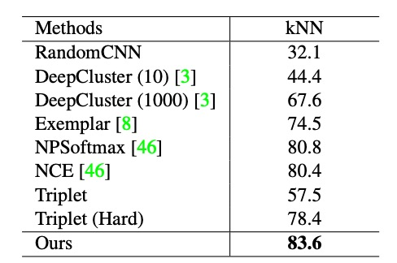
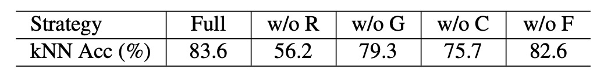
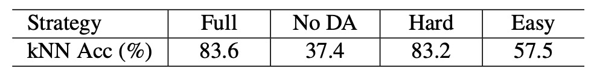

## 難題に潜む手がかり

[**Unsupervised Embedding Learning via Invariant and Spreading Instance Feature**](https://arxiv.org/abs/1904.03436)

---

この論文の主な比較対象は、Exemplar CNN と InstDisc の 2 つの論文です。

:::tip
もしこれら 2 つの論文について知らない場合、ぜひ先に以下の記事をご覧ください：

- [**[14.06] Exemplar CNN: 不変の特徴を探る**](../1406-examplar-cnn/index.md)
- [**[18.05] InstDisc: 多々益善**](../1805-instdisc/index.md)

この論文では、`InstDisc` の論文を NCE、`Exemplar CNN` の論文を Exemplar と呼びます。
:::

## 問題の定義

汎用的な特徴を見つけるためのアプローチの 1 つは、分類器の重みを使った Softmax 埋め込みです。これは Exemplar CNN が提案した方法であり、**各画像を独立したクラスとして扱う**ものです。

Exemplar CNN は行列 $W = [w_1, w_2, \dots, w_n]^T \in \mathbb{R}^{n \times d}$ を定義し、ここで $w_j$ は第 $j$ 実例に対応する分類器の重みです。

訓練時には Softmax 関数に基づき、サンプル $x_j$ が第 $i$ 実例として識別される確率は次のように計算されます：

$$
P(i|x_j) = \frac{\exp(w_i^T f_j)}{\sum_{k=1}^n \exp(w_k^T f_j)}
$$

各ステップで、ネットワークは特徴 $f_i$ を対応する分類器重み $w_i$ に近づけ、他の分類器重み $w_k$ から遠ざけるようにします。

しかし、この方法では分類器の重みによって特徴間の明示的な比較が制約され、最終的には効率と識別力が低下します。

次に、InstDisc は分類器の重みを廃止し、Memory Bank を提案しました。これにより前のステップで計算された実例特徴 $f_i$ を記憶し、これを $v_i$ と表します。

この記憶特徴は後続のステップで「直接」対応する実例の分類器重みとして使用されます。サンプル $x_j$ が第 $i$ 実例として識別される確率は次の通りです：

$$
P(i|x_j) = \frac{\exp(v_i^T f_j / \tau)}{\sum_{k=1}^n \exp(v_k^T f_j / \tau)}
$$

ここで、$\tau$ は分布の集中度を制御する温度パラメータです。また、$v_i^T f_j$ は特徴 $f_j$ と記憶特徴 $v_i$ のコサイン類似度を示します。

欠点として、記憶特徴の更新頻度が低いため、ネットワークのリアルタイム特徴 $f_i$ と古い記憶特徴 $v_i$ の比較が訓練効率を低下させることがあります。

パラメータ付きの Softmax がうまく機能しない場合や、Memory Bank の方法が効率的でない場合、分類器の重みや記憶特徴ではなく、特徴そのものを直接最適化する方法があるのではないでしょうか？

著者は、Memory Bank を捨てて、直接特徴そのものを最適化するべきだと考えています！

## 問題解決

### モデルアーキテクチャ

<figure style={{"width": "90%"}}>

</figure>

上図は、著者が提案した手法のフレームワークです。一見シンプルですが、まず一連の画像を入力し、これらの画像に対してランダムなデータ拡張操作を施します。

- **元画像：** ラベルのない画像群がデータソースとして使用されます。
- **データ拡張：** 各画像にランダムな拡張手法（回転、切り取り、色調変更など）が適用され、拡張画像が生成されます。この拡張画像は元画像と同じ意味情報を保持しています。

元画像と拡張画像の両方が CNN 主体ネットワークに入力され、対応する特徴ベクトルが抽出されます。ここで、元画像の特徴ベクトルは $f_i$、拡張画像の特徴ベクトルは $\hat{f}_i$ とします。

最後に特徴の整合性と分散性を強調します：

- **同一画像の特徴整合性 (Invariance)：** 同一実例（元画像とその拡張版）の場合、埋め込み特徴 $f_i$ と $\hat{f}_i$ を一致させる（近づける）ようにします。この設計により、モデルは画像の内在的な意味特徴を学習し、拡張操作の変化に影響されないようにします。
- **異なる画像の特徴分散性 (Spread-out)：** 異なる実例の埋め込み特徴は互いに分離されるべきであり、互いに近づかないようにします。この分散性により、モデルは画像実例間の類似性があったとしても、それらを区別できるようになります。

### 損失関数

本手法の最後に、設計された損失関数を見ていきます。

まず、正例の分類確率について、拡張サンプル $\hat{x}_i$ が実例 $i$ に正しく分類される確率は以下の通りです：

$$
P(i|\hat{x}_i) = \frac{\exp(f_i^T \hat{f}_i / \tau)}{\sum_{k=1}^m \exp(f_k^T \hat{f}_i / \tau)}
$$

ここで：

- $f_i$：元画像 $x_i$ の埋め込み特徴。
- $\hat{f}_i$：拡張画像 $\hat{x}_i$ の埋め込み特徴。
- $\tau$：温度パラメータで、確率分布の集中度を調整します。

次に、誤分類確率について、他の実例 $x_j, j \neq i$ が誤って実例 $i$ に分類される確率は以下の通りです：

$$
P(i|x_j) = \frac{\exp(f_i^T f_j / \tau)}{\sum_{k=1}^m \exp(f_k^T f_j / \tau)}
$$

そして、$x_j$ が実例 $i$ に誤分類されない確率は：

$$
1 - P(i|x_j)
$$

異なる実例が実例 $i$ に分類されることが互いに独立であると仮定すると、結合確率は以下のように表されます：

$$
P_i = P(i|\hat{x}_i) \prod_{j \neq i} (1 - P(i|x_j))
$$

ここで：

- $P(i|\hat{x}_i)$：拡張サンプル $\hat{x}_i$ が実例 $i$ に正しく分類される確率。
- $1 - P(i|x_j)$：他の実例 $x_j, j \neq i$ が実例 $i$ に誤分類されない確率。

最大尤度推定に基づき、結合確率の負の対数を取ることで、損失関数が得られます：

$$
J_i = -\log P(i|\hat{x}_i) - \sum_{j \neq i} \log(1 - P(i|x_j))
$$

ここで、損失関数は以下の 2 つの部分で構成されています：

1. 拡張サンプル $\hat{x}_i$ が正しく分類される損失（第一項）。
2. 他のサンプルが誤分類されない損失（第二項）。

バッチ内のすべての実例について合計し、最終的な総損失関数は以下のように定義されます：

$$
J = -\sum_i \log P(i|\hat{x}_i) - \sum_i \sum_{j \neq i} \log(1 - P(i|x_j))
$$

この損失関数の設計により、分類器の重みやメモリバンクの使用に伴う効率の問題を回避し、実例特徴を直接最適化することで、計算効率と識別能力を効果的に向上させています。

## 討論

### 他の手法との比較

<figure style={{"width": "50%"}}>

</figure>

著者はまず InstDisc の実験設計に従い、CIFAR-10 および STL-10 データセットで実験を行い、ResNet18 を主幹ネットワーク、埋め込み特徴の出力次元を 128 に設定しました。

上表は CIFAR-10 データセットを基にした実験結果を示しています。著者は本手法を DeepCluster、Exemplar CNN、NPSoftmax、NCE、Triplet loss と比較しました。その結果、本手法は kNN 分類器において最高性能（83.6%）を達成しました。

さらに、異なるエポックにおける他の手法の学習曲線を以下に示します：

<figure style={{"width": "70%"}}>

</figure>

結果から、本手法はわずか 2 エポックで kNN 分類の正確度 60% に達する一方で、NCE は 25 エポック、Exemplar は 45 エポックが必要であることが分かります。

明らかに、本手法の学習速度は他の競争手法よりもはるかに速いです。この効率性は、分類器の重みやメモリバンクに依存せず、直接実例特徴を最適化したことによるものです。

:::tip
また、STL-10 データセットでも SOTA 水準を達成していますが、ここでは省略します。
:::

### 未知クラスに対する実験

監督深層埋め込み学習の既存の研究に基づき、著者はテストセットの以下の指標を評価しました：

- **検索性能（R@K）：** テストセットで、指定されたクエリ画像に対し、上位 $k$ 個の検索結果が正しく一致（同じクラスラベル）する確率。
- **クラスタリング性能（NMI）：** 正規化相互情報量（NMI）を使用して、テストセットのクラスタリングの質を測定。

続いて、学習した埋め込み特徴が、訓練サンプルとテストサンプルで意味的なクラスが重ならない場合に区別能力を持つかを評価するために、CUB200、Product、Car196 の 3 つのデータセットで実験を行いました：

- **CUB200（鳥類データセット）：** 前半の 100 クラス（計 5,864 枚の画像）で訓練を行い、後半の 100 クラス（計 5,924 枚の画像）でテストを行います。
- **Product（製品データセット）：** 前半の 11,318 クラス（計 59,551 枚の画像）で訓練を行い、後半の 11,316 クラス（計 60,502 枚の画像）でテストを行います。
- **Car196（自動車データセット）：** 前半の 98 クラス（計 8,054 枚の画像）で訓練を行い、後半の 98 クラス（計 8,131 枚の画像）でテストを行います。

<figure style={{"width": "70%"}}>

</figure>

上表に示された結果から、CUB200 データセットにおける本手法の性能は、いくつかの監督学習手法と競合できるほど優れており、無監督学習の高い能力を示しています。

:::tip
ここでは CUB200 データセットの結果のみを抜粋しました。他の 2 つのデータセットの結果については、論文を参照してください。
:::

### アブレーションスタディ

本手法では、実例特徴学習において **データ拡張不変性** と **実例分散性** という 2 つの重要な性質を導入しています。

これらの性質が性能に与える影響を検証するため、CIFAR-10 データセットを用いてアブレーションスタディを行いました。

- **データ拡張不変性の影響**

    

    <figure style={{"width": "70%"}}>
    
    </figure>
    

  上表は結果を示しており：

  - **`w/o`**：特定の拡張操作を除去した場合を示します。
  - **`R`**：ランダムなリサイズクロップ（RandomResizedCrop）。
  - **`G`**：ランダムなグレースケール（RandomGrayscale）。
  - **`C`**：カラージッター（ColorJitter）。
  - **`F`**：ランダムな水平フリップ（RandomHorizontalFlip）。

  結果から、すべての拡張操作がモデル性能の向上に寄与していることが分かります。特にランダムなリサイズクロップが最大の貢献をしています。また、データ拡張を一切行わない場合（No DA）の実験結果は以下の通りです：

    

    <figure style={{"width": "70%"}}>
    
    </figure>
    

  この結果、分類精度は 83.6% から 37.4% に急落しました。これは非常に驚くべき結果です。

  データ拡張がない場合、ネットワークは正の集中性を生成できず、視覚的に類似した画像特徴が誤って分離される原因となります。このため、データ拡張不変性は有効な埋め込み特徴を学習するための重要な要素となります。

- **実例分散性の影響**

  実例分散性の効果を調べるため、以下の 2 つの負例サンプル選択戦略をテストしました：

  1. **Hard Negative（難しい負例）：** クエリ実例に最も類似した上位 50% の特徴を負例として選択。
  2. **Easy Negative（簡単な負例）：** クエリ実例に最も類似しない下位 50% の特徴を負例として選択。

    

    <figure style={{"width": "70%"}}>
    
    </figure>
    

  同じ表ですが、簡単な負例のみを使用した場合、精度は 83.6% から 57.5% に急落しました。一方、難しい負例のみを使用した場合、性能は完全なモデルとほぼ同等でした。

  つまり、難しい負例を分離することで、学習された埋め込み特徴の区別能力を向上させることができます。対照的に、簡単な負例はモデルにほとんど挑戦を与えないため、実例分散性の学習にはほとんど役立ちません。

## 結論

この論文は、「データ拡張不変性」と「実例分散性」という 2 つの重要なポイントを強調しています。

著者が提示した数々の実験によると、無監督学習を成功させるには、十分なデータ拡張操作を活用し、難しい負例を選択する必要があります。

これらの結論は後続の研究でも繰り返し確認されており、無監督学習分野における重要な知見と言えるでしょう。
