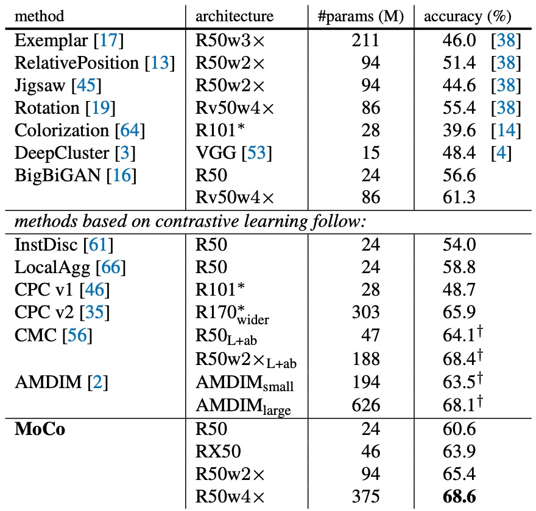

## モメンタム対比学習

[**Momentum Contrast for Unsupervised Visual Representation Learning**](https://arxiv.org/abs/1911.05722)

---

多くの組織が対比学習の分野で自分たちの見解を提案しており、Facebook AI Research（FAIR）もその例外ではありません。

彼らもこの議論に参加し、対比学習の鍵は「モメンタム」にあるかもしれないと考えています。

:::tip
現在の Meta AI は、かつて Facebook AI Research（FAIR）と呼ばれていました。
:::

## 問題の定義

NLP 分野では、テキスト空間の本質は離散的であり、単語やサブワードトークンを「辞書」として簡単に扱うことができます。これに対して、画像空間は連続的で高次元であり、テキストのような自然な分割はありません。画像に対してトークン化のようなプロセスを適用するには、どのように動的に「辞書」を構築し、その中から負のサンプル（negative）と正のサンプル（positive）を抽出するかを考慮する必要があります。

以前のいくつかの論文を読んだところ、効果は良好でしたが、依然としていくつかの問題が存在します：

1. **辞書のサイズは通常、バッチサイズや GPU メモリに制限される。**
2. **ネットワークパラメータが更新されるたびに、辞書内の「古い」特徴ベクトルと「新しい」特徴ベクトルが一致しない可能性がある。**

一つの解決策は、以前の論文で提案されたように非常に大きな辞書を使用することですが、ネットワークパラメータが継続的に更新されるため、メモリバンクに保存された特徴ベクトルは新しいパラメータと一致せず、対比の際に「一貫性」が欠如します。

「一貫性」がないので、辞書を現在のミニバッチに制限する方法はどうでしょうか？

それもまた、うまくいきません。

この方法は、取得した特徴が一貫性を保つことを保証しますが、視覚的にはバッチサイズが通常限られているため、利用可能な負のサンプルが非常に少なくなります。負のサンプルが不足しているため、対比学習の効果が低下します。

著者は、辞書の規模を拡大しつつ、辞書内の特徴ベクトルの一貫性を保つ方法を見つけたいと考え、Momentum Contrast（MoCo）を提案しました。

簡単に言うと、大量の負のサンプルを保存するためにキュー（queue）を使用し、モメンタム更新（momentum update）でキーデコーダーがゆっくり進化し、過去の負のサンプルとの一貫性を保つというものです。

本当にそれだけで簡単に解決できるのでしょうか？

では、この方法の詳細を見てみましょう。

## 問題解決

MoCo の核心的な仮定は、辞書の負のサンプルの数が多ければ多いほど（多様性をカバーできることを意味します）、訓練過程でエンコーディングの「一貫性」（consistency）が高ければ高いほど、より良い特徴表現を学習できるというものです。

設計コンセプトは以下の図の通りです：

<div align="center">
<figure style={{"width": "70%"}}>

</figure>
</div>

MoCo の設計では、クエリ（query）とキー（key）がそれぞれ異なるエンコーダーでエンコードされます。**クエリエンコーダー**は現在のバッチのサンプルをエンコードし、**キーデコーダー**はキュー内の負のサンプルをエンコードします。辞書内の負のサンプルの表現が最新のクエリ表現と一致するように、著者は**ゆっくりとしたモメンタム更新**を提案しました：

$$
\theta_k \leftarrow m \theta_k + (1 - m)\theta_q
$$

ここで、$\theta_q$ と $\theta_k$ はそれぞれクエリエンコーダーとキーデコーダーのパラメータを示し、$m$ はモメンタム係数（例えば 0.999）です。この方法により、キーデコーダーのパラメータは訓練過程でクエリエンコーダーの最新の状態にゆっくりと、平滑に追従し、エンコーダーの更新が急激すぎて辞書内の負のサンプルのベクトルが一致しなくなることを防ぎます。

また、著者はここで「キュー」を設計して、大量の負のサンプルを保存します。

このキューのサイズはバッチサイズよりも大きくすることができ、より多くの負のサンプルを保存できます。訓練中に新しいバッチが入力されると、それがエンコードされてキューの末尾に追加され、最も古いキーはキューから取り出されます。これにより、大量で多様な負のサンプルを維持しながら、毎回更新するのは新しいバッチのみで済み、計算量も相対的に管理可能です。

:::tip
この論文では、著者は「クエリ（query）」と「キー（key）」という言葉を多用しています。

これは、自己注意メカニズムのクエリ-キー-バリュー（query-key-value）とは関係ありません。ここでのクエリとキーは、対比学習における「正のサンプル」と「負のサンプル」の関係を表現するための比喩に過ぎません。

概念的には、**「クエリ（query）」** と **「キー（key）」** は「正のサンプル（positive）」と「負のサンプル（negative）」を直接置き換えているわけではなく、著者は**対比学習**において「辞書クエリ」の比喩を使って「正のサンプル」と「負のサンプル」の関係を新たに説明しています：

1. **Query（クエリ）**：このベクトルは「分類」または「識別」される対象で、一般的な対比学習における「アンカー（anchor）」に似ています。InfoNCE や他の対比損失では、クエリとその正のサンプルを近づけ、無関係な負のサンプルを遠ざけることが望まれます。
2. **Key（キー）**：辞書内の各要素はキーと呼ばれます；それは**正のサンプル**（クエリに一致するキー）または**負のサンプル**（クエリに一致しない他のキー）です。言い換えれば、特定のクエリに対して、1 つのキーが「正のサンプル（positive）」で、他のキーはすべて「負のサンプル（negative）」です。

著者は「辞書—クエリ」関係を強調するため、正のサンプルと負のサンプルをすべてキーと呼び、それに対応するサンプルをクエリと呼んでいます。
:::

### アルゴリズム設計

著者は、読者が論文をすべて読む時間がないことを理解しているかもしれませんので、完全なアルゴリズムのフローを提供しています。これを見れば、論文を読んだことと同じ効果があります。

<div align="center">
<figure style={{"width": "70%"}}>

</figure>
</div>

一行ずつ解説していきましょう：

---

```python
# f_q, f_k: queryとkeyのためのエンコーダーネットワーク
# queue: K個のkeyを持つ辞書（CxK）
# m: モメンタム
# t: 温度

f_k.params = f_q.params # 初期化
```

1. この行は **key encoder (f_k)** のパラメータを **query encoder (f_q)** のパラメータで初期化します。
   - 初めは 2 つのエンコーダーは一致しており、訓練中にモメンタム更新を使用して key encoder がゆっくりと進化します。

```python
for x in loader: # N個のサンプルを含むミニバッチxを読み込む
```

2. **データローダー (loader)** を使用して、**N 個のサンプル**を含むミニバッチを読み込みます。
   - 通常、`loader` は PyTorch の `DataLoader` であり、データセットからバッチを継続的に取り出します。

```python
x_q = aug(x) # ランダムに拡張されたバージョン
x_k = aug(x) # もう一つのランダムに拡張されたバージョン
```

3. 同じ画像 `x` に対してランダム拡張（augmentation）を行います。
   - `x_q` と `x_k` は同じ元画像から来ていますが、ランダムな切り取り、反転、色の揺れなどの操作によって 2 つの異なる「ビュー（views）」を形成します。
   - `x_q` は query encoder に、`x_k` は key encoder に渡され、「正例」ペアを形成します。

```python
q = f_q.forward(x_q) # クエリ: NxC
k = f_k.forward(x_k) # キー: NxC
```

4. **query encoder (f_q)** と **key encoder (f_k)** を使用して、拡張された画像をそれぞれ前向き伝播します。
   - `q` の形状は `N x C` で、N 個のサンプル、それぞれの特徴ベクトルの次元が C です。
   - `k` も同様に `N x C` です。

```python
k = k.detach() # キーに対しては勾配を追跡しない
```

5. `k.detach()` は `k` に対して勾配追跡を行わないことを示します。
   - なぜなら、key encoder の更新は逆伝播ではなく「モメンタム更新」によって行われるからです。
   - これにより、計算グラフが key encoder のパラメータに自動的に逆伝播しないようにします。

```python
# 正例のロジット: Nx1
l_pos = bmm(q.view(N,1,C), k.view(N,C,1))
```

6. **正例 (positive)** のロジットを計算します。
   - `q.view(N,1,C)` は `q` を (N, 1, C) にリシェイプし、`k.view(N,C,1)` は (N, C, 1) になります。これにより、バッチ行列積（batch matrix multiplication）を行います。
   - `bmm` はバッチ次元ごとに内積を計算し、結果は `(N,1,1)` で、これは `(N,1)` として解釈でき、各サンプルの正例類似度（内積）になります。

```python
# 負例のロジット: NxK
l_neg = mm(q.view(N,C), queue.view(C,K))
```

7. **負例 (negative)** のロジットを計算します。
   - ここで `queue` のサイズは `(C x K)` で、K 個の鍵ベクトルが含まれ、それぞれの次元が C です。
   - `q.view(N,C)` と `queue.view(C,K)` を行列乗算し、結果は `(N, K)` となり、各クエリがキュー内の K 個の鍵と内積を取ります。
   - これらの鍵は「負例」と見なされ、他の画像や異なるサンプルに対応します。

```python
# ロジット: Nx(1+K)
logits = cat([l_pos, l_neg], dim=1)
```

8. 正例のロジット (`l_pos`) と負例のロジット (`l_neg`) を結合します。
   - 最終的に `(N, 1+K)` のテンソルが得られ、各サンプルには 1 つの正例（位置 0）と K 個の負例（位置 1〜K）があります。

```python
# 対比損失, Eqn.(1)
labels = zeros(N) # 正例は0番目
loss = CrossEntropyLoss(logits/t, labels)
```

9. **対比損失 (contrastive loss)** を計算します。これは InfoNCE に似ています。
   - `labels = zeros(N)` は N 個のサンプルに対して、正例のラベルをすべて `0` に設定します。`logits` の結合結果では、正例のロジットは最初の列にあります。
   - `logits/t` はロジット全体を温度パラメータ `t` で割って、softmax の滑らかさを調整します。
   - `CrossEntropyLoss` はロジットに対して softmax を行い、各サンプルを正例の位置（0 番目）に分類する交差エントロピー損失を計算します。

```python
# SGD更新: クエリネットワーク
loss.backward()
update(f_q.params)
```

10. **逆伝播 (back-propagation)** を使用して **query encoder** のパラメータを更新します。
    - `loss.backward()` は勾配を計算し、`update(f_q.params)` は最適化器（例えば SGD）を使って重みを更新します。

```python
# モメンタム更新: キーネットワーク
f_k.params = m*f_k.params + (1-m)*f_q.params
```

11. **モメンタム更新（momentum update）** を使用して **key encoder** のパラメータを更新します：
    $$
    \theta_k \leftarrow m\,\theta_k \;+\;(1 - m)\,\theta_q
    $$
    - ここで `m` はモメンタム係数（通常は 1 に近い値、例えば 0.999）です。
    - そのため、key encoder のパラメータは query encoder のパラメータにゆっくりと追従し、古い key ベクトルと新しい query ベクトル間の「不一致性」を減らします。

```python
# 辞書の更新
enqueue(queue, k) # 現在のミニバッチをキューに追加
dequeue(queue) # 最も古いミニバッチをキューから削除
```

12. **辞書（キュー）の更新**：
    - `enqueue(queue, k)`：現在のバッチ `k`（形状は `N x C`）をキューの末尾に追加します。
    - `dequeue(queue)`：最も古いバッチの key をキューの先頭から削除し、キューのサイズを設定された K に保ちます。
    - これにより、キューは常に最近エンコードされた key を保持し、次の訓練ループで大量で多様な負例を提供します。

---

プログラムコードを読み終えた後、いくつかの重要なポイントをまとめましょう：

1. **二重エンコーダーアーキテクチャ (f_q, f_k)**：Query encoder (f_q) は現在のバッチの正例クエリを担当し、Key encoder (f_k) は負例を計算しますが、直接逆伝播の勾配を受けません。
2. **モメンタム更新 (Momentum Update)**：Key encoder はゆっくりと Query encoder のパラメータに追従し、ネットワークの急激な変動による「不一致性」を減らします。
3. **大規模辞書 (Queue) メカニズム**：毎回現在のバッチの key のみをエンコードし、それらをキューに追加します。最も古い key を削除することで、大量の負例（keys）を保持し、対比学習の効果を高め、memory bank のように全データセットを保持して巨量なメモリを消費することを避けます。
4. **対比損失 (Contrastive Loss)**：正例 $\ell_{\text{pos}}$ と負例 $\ell_{\text{neg}}$ の内積からロジットを得て、softmax + cross entropy を使って InfoNCE 損失を実現します。

このアルゴリズムの核心的な目的は、大規模で動的に更新されるキューを使って対比学習を行い、モメンタム更新によりエンコーダーの一貫性を保ち、最終的により良く、汎用性の高い画像表現を学習することです。

### 前置タスク

この論文の主な焦点は「新しい前置タスク」の設計ではなく、さまざまな対比学習に対応する「大きくて一貫した」辞書を構築するための汎用メカニズム MoCo の提案です。

著者は実験で、よく使われる単純な手法である **インスタンス識別 (instance discrimination)** を使用し、同一画像の異なる強化バージョンを正例として扱い、他の画像の強化バージョンを負例として扱いました。

特に注目すべきは、著者が実験中に「BN チート (Batch Normalization Cheating)」の問題に直面した点です。

BN チートとは、対比学習において、Batch Normalization が同一バッチ内で統計量を共有するため、モデルが正例と負例間で本来共有してはならない情報を「盗み見」できる状態を指し、それによってより「ずるい」解を見つけてしまい、学習した表現の品質が損なわれるという問題です。

この問題を回避するために、著者は「Shuffling BN」を導入し、複数 GPU での訓練時に正例と負例を異なる GPU に分散させ、サンプルの順序をシャッフルすることで、統計量が干渉しないようにし、BN による悪影響を解決しました。

:::tip
**なぜ以前の memory bank にはこの問題がなかったのか？**

memory bank の状況では、正例の key は実際には過去のバッチのサンプルであり、つまりそれらはもともと現在のバッチと同じ BN 統計量を共有しないため、特別にシャッフルを行う必要はありませんでした。しかし、MoCo では現在のバッチ内で即時にクエリと key の表現を計算するため、この問題が発生したのです。
:::

## 討論

いくつかの主要なグラフを取り上げて、MoCo の効果を見てみましょう。完全な実験結果については、読者が元の論文を参照してください。

### 特徴の頑健性

著者は **線形分類 (linear classification)** を使用して、MoCo が学習した特徴の良し悪しを評価しました。

- **自己教師あり事前訓練**：ImageNet-1M (IN-1M) 上で MoCo の自己教師あり訓練を実施し、特徴抽出ネットワークを得ました。
- **特徴の固定 (freeze)**：次に、そのネットワークの畳み込み層の重みを固定し、最後に全結合層（fully-connected layer + softmax）を追加して有監督の線形分類を行い、100 エポックで訓練しました。
- **評価**：ImageNet の検証セットで Top-1 分類精度（1-crop）を測定しました。

このプロセスは、コンピュータビジョンでよく使われる「自己教師あり特徴表現の検証方法」であり、微調整の影響を排除することができます。

比較対象は、以下の 3 つの一般的な対比損失機構です：

1. **End-to-end**：クエリエンコーダーとキーネコーダーを同時に逆伝播で更新します。
2. **Memory bank**：特徴ベクトルは事前にメモリーバンクに保存されますが、訓練中に更新されるため、新旧の特徴が一致しなくなりやすいです。
3. **MoCo**：モメンタム更新を使用した key encoder と、大規模なキューで負のサンプルを管理します。

実験結果は以下の通りです：

<div align="center">
<figure style={{"width": "70%"}}>

</figure>
</div>

- すべての方法で、辞書のサイズ $K$ が大きくなるにつれて精度が向上し、大きな辞書がより多くのサンプルの多様性をキャプチャできることが示されています。
- **End-to-end** 機構は、ミニバッチのサイズに制限されます（著者は 8 枚の Volta 32GB カードで、バッチサイズは約 1024 をサポート）。しかし、バッチサイズをさらに拡大しようとすると、大規模な訓練での課題が発生します。
- **Memory bank** はより大きな辞書を拡張できますが、一貫性の欠如（複数回の更新後の古い特徴）により、最終結果は MoCo よりも 2.6%低くなっています。
- **MoCo** は大きな辞書設定で最も良いパフォーマンスを示し、「大きな辞書」と「一貫性」を両立できることを証明しました。

### モメンタム係数の影響

著者はさらにモメンタム係数 $m$ が MoCo のパフォーマンスに与える影響を調査しました。

以下の表は、異なる $m$ の値が事前訓練 (K = 4096) のもとで ResNet-50 に与える影響を示しています：

| momentum $m$ | 0    | 0.9  | 0.99 | 0.999 | 0.9999 |
| ------------ | ---- | ---- | ---- | ----- | ------ |
| accuracy (%) | fail | 55.2 | 57.8 | 59.0  | 58.9   |

実験結果から、モメンタム係数 $m$ が MoCo のパフォーマンスに明確な影響を与えることが示されています：

- $m$ が小さすぎる（例えば 0.9）と、表現学習が不安定になり、精度が大幅に低下します。
- $m=0$ では収束すらしません。

逆に、**0.99〜0.9999 の範囲**では、良好な表現を学習することができ、その中でも 0.999 付近が最も効果的です。これは「遅い進化をする key encoder」が辞書の一貫性を保ち、訓練が安定して収束するのに役立つことを示しています。

### 他の方法との比較

<div align="center">
<figure style={{"width": "85%"}}>

</figure>
</div>

より包括的な比較のため、著者は ResNet-50（R50）とその拡張バージョン（2×, 4×）を使用して MoCo の事前訓練を行い、モデルサイズ（#params）と線形分類精度との関係を報告しました。

- **MoCo + R50**：**60.6%**の Top-1 精度を達成
- **MoCo + R50w4×**：さらに大きなモデルで**68.6%**の精度

詳細な比較データは以下の表に示されており、**標準的な ResNet-50**（パラメータ数約 24M）で MoCo が 60.6%の精度を達成しており、これが同等の他のモデルよりも「優れている」ことがわかります：

<div align="center">
<figure style={{"width": "70%"}}>

</figure>
</div>

:::tip
ここで著者は、パッチ化やカスタム受容野（receptive field）などの特別なネットワーク構造を使用していません。代わりに、ResNet の後に投影層を追加しただけで、モデルがさまざまな視覚タスクに移行できるようにしています。

これは、MoCo フレームワークが非常に柔軟で、他の戦略と組み合わせて精度を向上させることができることを示しています。
:::

## 結論

MoCo は、モメンタム更新とキュー管理を通じて、自己教師あり学習の設定で「大きな辞書」と「一貫性」を同時に実現するシンプルで効果的な対比学習メカニズムです。

全体的に、MoCo のコアメカニズムは非常に高い汎用性と拡張性を示し、効率とパフォーマンスの両方を兼ね備えた視覚的な表現学習の解決策を提供しています。

:::tip
このアーキテクチャは、その後いくつかのバージョンがリリースされ、改良が加えられています。後でその進化を見ていきましょう。
:::
