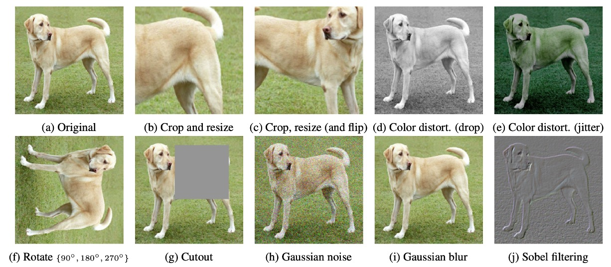
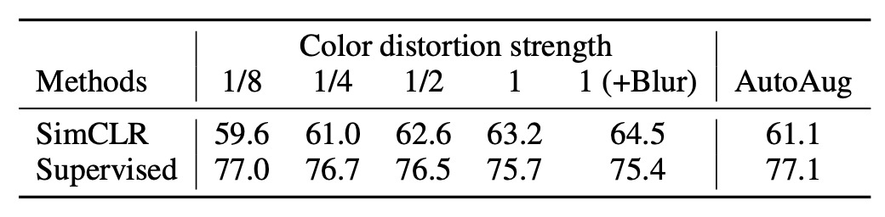
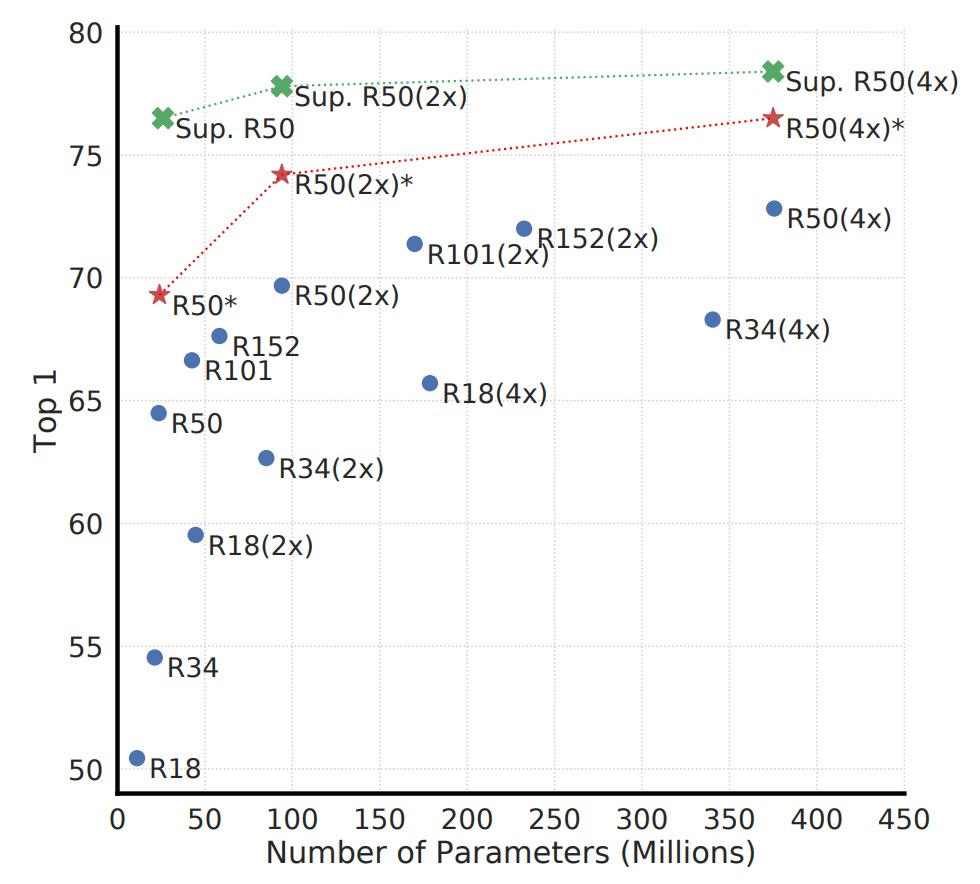
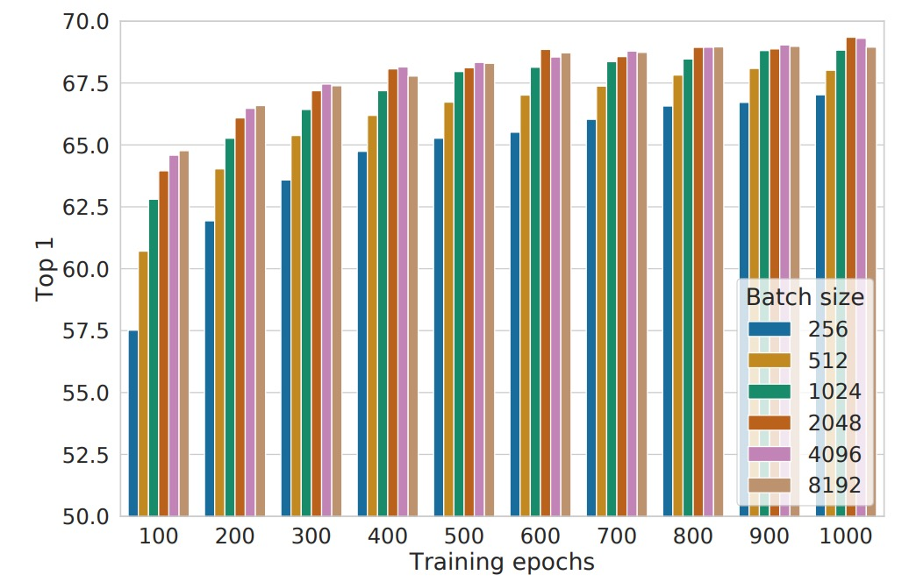

## 大バッチサイズ

[**A Simple Framework for Contrastive Learning of Visual Representations**](https://arxiv.org/abs/2002.05709)

---

対照学習の研究は約 5 年が経ち、全体の状況は非常に複雑で混沌としています。アーキテクチャ設計だけでなく、具体的なモデル訓練方法も多種多様です。

本論文の著者は、対照学習のコアはもっとシンプルであるべきだと考えています。

## 問題の定義

対照学習に必要な要素を思い出してみましょう：

- **良い結果を得るためには、メモリーバンクが必要？**

大量の負のサンプルがモデルにより良い表現を学ばせるために必要であり、メモリーバンクは確かにその機能を提供します。最初の InstDict はこのようにしていましたし、その後の MoCo もそうです。

しかし、面倒です！訓練中に追加でメモリーバンクを維持するのは明らかに非効率的な設計です。

著者はこの論文で、メモリーバンクの設計を放棄し、その代わりにより大きなバッチサイズを使用することを決定しました。十分な数の負のサンプルを与えれば、モデルは十分に良い表現を学べるのです！

:::tip
InstDict や MoCo をまだ読んでいない方は、以下の記事を参考にしてください：

- [**[18.05] InstDisc: 多々益善**](../1805-instdisc/index.md)
- [**[19.11] MoCo v1: モメンタム対比学習**](../1911-moco-v1/index.md)
  :::

## 問題解決

### モデルアーキテクチャ

<figure style={{"width": "70%"}}>

</figure>

このアーキテクチャは非常にシンプルで、複数のエンコーダやメモリーバンクはありません。

プロセスは、同じ画像に対して 2 種類のランダムな強化を行い、「異なるように見えるが実際は同一の」2 つの画像を得ることから始まります。

次に、この 2 つの画像を「同じ」エンコーダネットワークに通して、2 つの潜在ベクトルを取得します。

その後、小型のプロジェクションネットワークを使ってこれらの潜在ベクトルを対照学習の空間にマッピングし、最後に対照損失関数を使って「同一の」強化画像が表現空間で近くなるようにします。

え？それだけ？

はい！それだけです、また論文を読み終わりました！（~実際はそうではない~）

### 画像強化

<figure style={{"width": "90%"}}>

</figure>

SimCLR では、著者は強化方法が多様で強力であり、監視付き学習よりも重要だと考えています。

論文で使用された画像強化方法は上図の通りです。特に重要なのは以下の点です：

- **ランダムクロップ**（random crop）
- **カラー歪み**（color distortion）
- **ガウスぼかし**（Gaussian blur）

2 つの強化後の画像は「正のサンプルペア」と見なされ、なぜならそれらは実際には同じ元の画像から来ているからです。

### 詳細設計

最初はエンコーダの部分です。ここでは ResNet-50 を基礎エンコーダとして使用し、強化後の画像を入力し、ベクトル $h_i$ を得ます。このベクトルの次元は通常非常に大きいです。例えば、ResNet-50 の場合、平均プーリング層を通すと 2048 次元となります。

次はプロジェクションヘッドの部分です。著者は、$h_i$ の上で直接対照損失を計算するよりも、小型の MLP を追加する方が効果的であると発見しました。このプロジェクションネットワーク $g(·)$ は通常、1 つの隠れ層を持ち、ReLU を通して、最終的に 128 次元のベクトル $z_i$ にプロジェクションされ、対照損失を計算します。

最も重要なのは、対照損失をどのように定義するかです。

コアの概念は、同じペア $(i, j)$（同じ元の画像からの 2 回の強化）はベクトル空間でできるだけ近くなるべきであり、他の無関係なサンプルとはできるだけ遠ざけるべきだというものです。ここで著者は、NT-Xent（Normalized Temperature-scaled Cross Entropy Loss）という形式を引用しています。

### NT-Xent 損失関数

以下を定義します：

- $zᵢ$ は、$i$ 番目の強化画像がプロジェクションヘッドを通して得られる 128 次元ベクトルです。
- $\text{sim}(u, v) = \frac{u^\top v}{\|u\|\|v\|}$ はコサイン類似度を表します。
- $τ$（タウ）は温度（temperature）ハイパーパラメータで、類似度スコアの拡大度合いを制御します。

1 つのバッチ内で、$N$ 枚の元の画像があり、それぞれの画像は 2 回異なる強化を経て、合計で $2N$ 枚の強化画像が生成されます。正のサンプルペア $(i, j)$（すなわち同一画像の 2 回の異なる強化）に対して損失を計算する際、残りの $2(N - 1)$ 枚の強化画像は負のサンプルとして扱われます。

NT-Xent 損失関数の計算方法は以下の通りです：

$$
ℓ_{i,j}
= - \log \left( \frac{\exp(\text{sim}(z_i, z_j)/τ)}{\sum_{k=1}^{2N} \mathbf{1}[k \neq i] \exp(\text{sim}(z_i, z_k)/τ)} \right).
$$

ここで：

- 分子 $\exp(\text{sim}(z_i, z_j)/τ)$ は、$z_i$ と正のサンプル $z_j$ の類似度の指数化スコアを表します。
- 分母は、$z_i$ とバッチ内の他の全てのベクトル（自身を除く）との類似度の指数化合計です。

目標は、正のサンプル $(z_i, z_j)$ の間の類似度を最大化し、他の負のサンプルの類似度を低く保つことです。すなわち、$\text{sim}(z_i, z_j)$ が $\text{sim}(z_i, z_k)$ よりも大きくなるようにしたいのです（すべての $k \neq i$ に対して）。こうすることで、モデルはより識別力のある表現を学び、類似したサンプルが集まり、異質なサンプルが分離されます。

バッチ全体で、正のサンプルペア $(i, j)$ に対して、$(i, j)$ と $(j, i)$ の 2 つの損失を同時に計算し、その合計をバックプロパゲーションに使います。

:::tip
NT-Xent は**コサイン類似度**（ℓ₂ 正規化付き）と「温度」($\tau$) を使用して、負のサンプルの影響を適応的に調整します。

- **コサイン類似度**：モデルがベクトルの「方向」に注目し、「長さ」ではなく、表現間の相対的な類似度をより正確に比較します。
- **温度パラメータ $\tau$**：
  類似度の拡大や縮小を制御し、負のサンプルの損失内での重みを影響します：
  - **$\tau$ 小** → 類似度差を拡大 → 「難しい負のサンプル」を強調。
  - **$\tau$ 大** → 類似度差を平滑化 → 負のサンプルの影響が均等化。

従来の対照損失では、「易しい/難しい負のサンプル」が学習に与える影響を考慮するため、通常は手動で**semi-hard negative mining**を行う必要があります。この篩選を行わないと、大部分の負のサンプルが簡単に区別できる（コントラストが高すぎる）ため、学習効果が低下します。

しかし、NT-Xent は**コサイン類似度 + 温度調整**によって、負のサンプルの重みを類似度に基づいて動的に調整し、手動で負のサンプルを篩選する必要がありません。実験結果によると、semi-hard negative mining を使用しない場合、他の対照損失関数（例えば、ロジスティック損失、マージン損失）の性能は通常劣り、semi-hard negative mining を追加しても NT-Xent には勝てないことが多いです。
:::

## 討論

### 最も有用な強化の組み合わせ

<figure style={{"width": "90%"}}>

</figure>

「異なるデータ強化方法（単独または組み合わせ）がモデルの学習した表現の品質に与える影響」を観察するため、著者はここで**線形評価**の方法を使用しています。これは、自己訓練したエンコーダを凍結し、その上に線形分類器（通常は 1 層の線形全結合）を重ね、ImageNet でトップ 1 精度を評価するというものです。

実験では、モデルの入力端には 2 つの「並行する強化パイプライン」があります。ここで著者は「1 つのパイプライン」のみにテストする強化を適用し、もう 1 つの分岐はその強化を施さず（最も基本的なランダムクロップ + リサイズのみ）、個別の強化や異なる強化の組み合わせが「それ自体」に与える影響をより直接的に観察できるようにしています。

上図の表の解釈方法は以下の通りです：

- **対角線（diagonal entries）**：単一の変換（例えば、ガウスぼかし、カラー歪みなど）。これはその強化を 1 つの分岐にのみ適用した場合を意味します。
- **非対角線（off-diagonals）**：2 種類の強化の組み合わせ（例えば、最初にガウスぼかしを適用し、その後にカラー歪みを適用）。
- **最後の列（the last column）**：各行の平均値、つまりその行の強化の組み合わせにおける全設定の平均パフォーマンスです。

実験結果は以下のことを示しています：

- **単一の強化**（対角線）は通常、モデルが非常に強力な表現を学ぶには十分ではありません。なぜなら、この単一の変化だけに頼ると、モデルは他の不変な手がかりを使って「正のサンプルペア」を判断する可能性があるからです。
- **組み合わせ強化**（非対角線）は線形評価の結果を向上させる傾向があります。

これは、2 つ以上の強化が同時に行われると、対照学習のタスクの難易度が上がる一方で、モデルがより一般的で安定した特徴を学習できるようになることを意味します。

### 強化の強度の影響

<figure style={{"width": "70%"}}>

</figure>

強化の強度を調整することができます。例えば、明度、コントラスト、彩度、色相の変化幅を大きくしたり小さくしたりできます。そこで著者は、「強化強度」がモデルのパフォーマンスに与える影響をさらに探求しました。

ImageNet で監視付き分類モデルを訓練する際には、AutoAugment のような自動強化戦略をよく使用します。しかし、著者はここで、AutoAugment が「シンプルなクロップ + 強力なカラー歪み」よりも優れているわけではないことを発見しました。

実験結果は上の表に示されており、**監視なしの対照学習**において、カラー歪みの強度を大きくすることが、モデルが最終的に学習する特徴品質を顕著に向上させることが分かります。これは、監視なしの対照学習に必要な強化手段が監視付き学習とは異なることを示唆しています。監視付き学習の下で「非常に効果的」な強化戦略が、必ずしも対照学習の効果を同じように向上させるわけではないのです。

:::tip
異なる学習目標に対して、強化戦略の選択が異なる場合があることを忘れてはなりません。この問題を無視しがちですが、他に重要な事柄があるときでも、この点を考慮する価値があります。

著者の実験結果は、強化戦略の選択がモデルの学習効果に大きな影響を与える可能性があることを思い出させてくれます。したがって、この点を注意深く調整する時間を確保する価値があるということです。
:::

### モデル規模の拡大

<figure style={{"width": "70%"}}>

</figure>

上図は、異なるモデル規模での対照学習の結果を示しています。著者は、モデルの規模が大きくなるにつれて、対照学習の性能が徐々に向上することを発見しました。

この結果は、監視付き学習での経験と似ています：モデルの容量を増やすことで、通常はより豊富な特徴表現能力を持つことができます。また、モデル規模が大きくなると、無監督対照学習の効果がより顕著に向上するため、対照学習は大きなモデルに対して依存度が高いことを意味します。

:::tip
**なぜ無監督学習は小さなモデルでは監視付き学習に劣るが、モデルが大きくなると競争力を持つのか？**

無監督の状況では、モデルはデータの構造を自ら掘り起こさなければなりません。もしモデルが小さすぎると、表現空間に大きな制限がかかり、十分に豊かな特徴を学習することができません。しかし、モデル容量が十分であれば、ラベルなしでも観察できるさまざまなパターンを捉えることができ、そのパターンは監視付き学習で使用されるラベルよりも豊かである可能性があります。
:::

### バッチサイズの影響

<figure style={{"width": "70%"}}>

</figure>

上図は、異なるバッチサイズと訓練エポック数での性能を示しています。各棒グラフは、最初から訓練した単回実験の結果です。

従来、バッチサイズの選択は計算効率と勾配の安定性を主に考慮して行われますが、対照学習ではバッチサイズにはもう一つ重要な役割があります：**使用可能な負のサンプルの数に影響を与える**という点です。

- **バッチが大きいほど、1 回の訓練で利用できる負のサンプルが多くなり**、これによりモデルはより豊かな対照情報を学び、サンプルの区別能力が向上します。
- **収束速度の向上**：訓練エポック数が少ない場合でも、大きなバッチサイズはモデルに多くの負のサンプルを観察させることができ、収束を加速させ、最終的な性能を向上させます。

これは監視付き学習とは異なります。監視付き学習では、大きなバッチを使用する主な目的は「勾配推定を安定させ、訓練を効率化する」ことですが、対照学習においては「より多くの負のサンプル」が大きなバッチのコアの利点です。

もう一つの興味深い発見は、訓練時間を長くすることで、小さなバッチサイズの欠点をある程度補うことができる点です：

- 訓練ステップ数が十分に多ければ、バッチサイズが小さくてもモデルは時間をかけて十分な負のサンプルの視野を蓄積し、大きなバッチとの性能差を縮小できます。
- しかし、同じ訓練時間であれば、大きなバッチは通常より早く同様の結果を達成できるため、限られた計算資源の中では、大きなバッチを選択することが効率的な戦略です。

### 他の方法との比較

著者は、さまざまな自己教師あり学習法の線形評価結果を比較しました（つまり、バックボーンを凍結し、最後に線形分類器を 1 層追加）。

結果は、標準の ResNet アーキテクチャ（特別な設計なし）を使用しても、SimCLR は過去の特別に設計されたネットワーク構造を必要とする方法を上回るか、それに匹敵することを示しています。ResNet-50 を 4 倍に拡張すると、その線形評価結果は監視付きで事前学習された ResNet-50 と同等になり、無監督の対照学習が大きなモデルで非常に高い潜在能力を持っていることを示しています。

もし ImageNet のラベル数を 1%または 10%に圧縮し、カテゴリーバランスを考慮して微調整を行った場合、下記の表のように：

<figure style={{"width": "60%"}}>

</figure>

SimCLR の性能は依然として他の方法を上回っており、これにより対照学習が半教師あり学習でも大きな潜力を持つことが示されています。

## 結論

本研究では、著者はシンプルで効果的な対照学習フレームワークを提案し、さまざまな実験を通じて、異なる設計選択が学習効果に与える影響を深く分析しました。

結果として、データ強化戦略、非線形投影ヘッド、NT-Xent 損失関数を活用することで、SimCLR は自己教師あり学習、半教師あり学習、転送学習のタスクで先行技術を大きく上回る成果を上げました。

:::tip
SimCLR と MoCo は対照学習の分水嶺となり、この分野で明確な研究方向を確立し、将来の研究に重要な参考を提供しました。
:::
