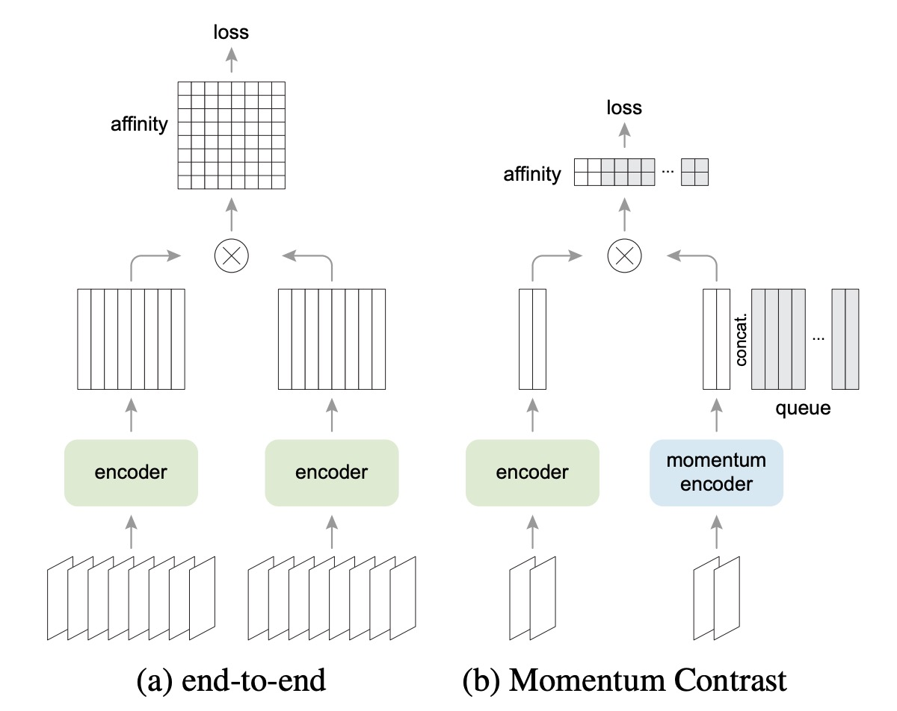

## 一矢を報いる

[**Improved Baselines with Momentum Contrastive Learning**](https://arxiv.org/pdf/2003.04297)

---

FAIR は MoCo v1 を発表しましたが、あまり長くは喜べませんでした。というのも、Google が提案した SimCLR が発表され、結果は大きく改善されたのです！

これはまさに FAIR にとっての痛手で、見過ごせません！そこで SimCLR が発表されてから 1 ヶ月後、FAIR は SimCLR のいくつかの利点を取り入れ、MoCo v2 を発表しました。

その意図は明確で、他の人々に MoCo アーキテクチャが依然として良い選択肢であることを示すことでした！

:::tip
本論文の主な比較対象は SimCLR です。興味のある読者は、以前の記事を参照できます：

- [**[20.02] SimCLR v1: 大バッチサイズ**](../2002-simclr-v1/index.md)
  :::

## 問題定義

SimCLR は実装において 3 つの改良を行いました：

1. **非常に大きなバッチサイズ**（4k または 8k）、これにより十分な数の負のサンプルが確保されます。
2. **MLP ヘッド**：エンコーダの出力特徴を 2 層の MLP（ReLU を含む）に接続し、その後にコントラスト損失を計算します。訓練後、下流タスクを行う際には通常、エンコーダの出力特徴のみを使用します（MLP 出力は使用しません）。
3. **より強力なデータ増強**：色のジッターやぼかしなどの強力な増強を含みます。

しかし、SimCLR は効果が高いものの、そのバッチサイズは非常に大きく、一般の人々には実行が難しいのです。

:::tip
資金力に優れた Google は TPU を持っているため、4k または 8k のバッチサイズを使用できるのです。
:::

そのため、著者はこの論文で SimCLR の 2 つの主要な設計改良を MoCo に統合しようと試みました：

1. **MLP プロジェクションヘッド**
2. **より強力なデータ増強**

そして、これらの改良が MoCo アーキテクチャでも有効であり、一般的な 8-GPU 環境でも SimCLR を超える結果が得られることを発見しました（超大規模なバッチは必要ありません）。

これは明らかに一般ユーザーにとってより親しみやすく、コントラスト学習の研究を再現しやすくしました。

## 問題解決

<figure style={{"width": "70%"}}>

</figure>

上図は SimCLR と MoCo のアーキテクチャの違いを示しています。

SimCLR は End-to-End 方式で、同じバッチ内に十分な数の負のサンプルが必要です。そのため、通常は 4k ～ 8k の大きなバッチサイズが必要です。

一方、MoCo は「モメンタムエンコーダ」を使用して負のサンプルの表現を保持します。負のサンプルのベクトルは「キュー」に格納され、バッチ間で共有されます。これにより、バッチが小さくても大きなキューを使用して多くの負のサンプルを提供できるのです。

したがって、MoCo は大きなバッチを必要とせず、多くの負のサンプルを保持でき、ハードウェアリソースの要求が比較的小さくなります。

### MLP ヘッドの強化

<figure style={{"width": "70%"}}>

</figure>

著者は MoCo の元々の最終層の全結合（fc）プロジェクションヘッドを 2 層の MLP（中間層 2048 次元、ReLU を含む）に置き換え、異なる温度パラメータ$\tau$を試しました。

結果は、上表のように、fc（MLP なし）のみの場合、ImageNet 線形分類の精度は約 60%~61%でしたが、MLP に変更すると約 66%（最適な$\tau = 0.2$の時）に向上し、非常に大きな改善が見られました。

しかし、物体検出の転送学習において、MLP ヘッドによる改善は小さかったです。これにより、次のような一般的な疑問が解消されました：

- **「線形分類の精度が高いほど良いのでしょうか？実際の下流タスクと直接関係があるのでしょうか？」**

実際、時には完全な正の相関は見られません。線形分類のスコアは参考指標ですが、すべての下流タスクで同じ程度の改善が得られるわけではありません。

### データ増強の強化

<figure style={{"width": "70%"}}>

</figure>

次に著者は MoCo の元々の増強戦略に SimCLR の「ぼかし増強」と若干強化された色の歪みを加えました。その結果、MLP ヘッドを追加しなくても、データ増強を強化するだけで、ImageNet の線形分類精度が 60.6%から 63.4%に向上しました。また、検出結果も MLP ヘッドを使用した場合と同等か、それ以上の改善が見られました。

最後に、MLP ヘッドと強化増強を同時に使用すると、ImageNet の線形分類精度は 67.3%に達し、検出にも顕著な改善が見られました。

## 議論

### SimCLR との比較

<figure style={{"width": "70%"}}>

</figure>

SimCLR は 4k または 8k のバッチサイズを使用し、1000 エポックで事前学習を行い、69.3%の ImageNet 線形分類精度を達成しました。

著者は、より実行可能なハードウェア環境（8-GPU、バッチサイズ = 256）で、上記の 2 つの改良（MLP + 増強）を MoCo に統合し、「MoCo v2」として評価しました。

結果は以下の通りです：

- 200 エポックの事前学習で、MoCo v2 は 67.5%に達し、同じ設定の SimCLR（61.9%）より 5.6%高く、さらに大きなバッチを使用した SimCLR（66.6%）よりも優れた結果を示しました。
- もし事前学習を 800 エポックまで延長すれば、MoCo v2 は 71.1%に達し、SimCLR の 69.3%を超えることができます。

つまり、MoCo は超大きなバッチを必要とせず、キュー機構を利用して大量の負のサンプルを処理し、SimCLR で紹介された MLP ヘッドと強化されたデータ増強を適用することで、SimCLR よりも優れた結果を達成できるのです。

### 計算量とリソース消費

<figure style={{"width": "70%"}}>

</figure>

著者は、8-GPU でのメモリと時間コストを比較しました。

End-to-End 方式でバッチサイズ 4k を使用すると、ほぼ 8-GPU では実行できません。バッチサイズ 256 の場合でも、End-to-End 方式は MoCo より多くのメモリと時間を消費します。なぜなら、クエリエンコーダとキーエンコーダの両方でバックプロパゲーションを行わなければならないからです。

一方、MoCo はクエリエンコーダだけを更新するため、全体的に効率が高いのです。

## 結論

要するに、SimCLR の概念は MoCo にも適用でき、MoCo のメモリキャッシュ機構により、訓練時に大量の GPU リソースを必要としません。どのように見ても、コストパフォーマンスが高く、優れた効果を得られる良い選択肢です。

FAIR と Google はこの競争で見事に巻き返しました。
