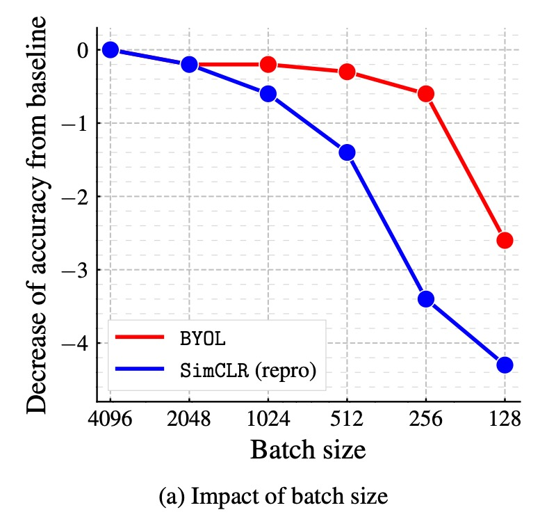
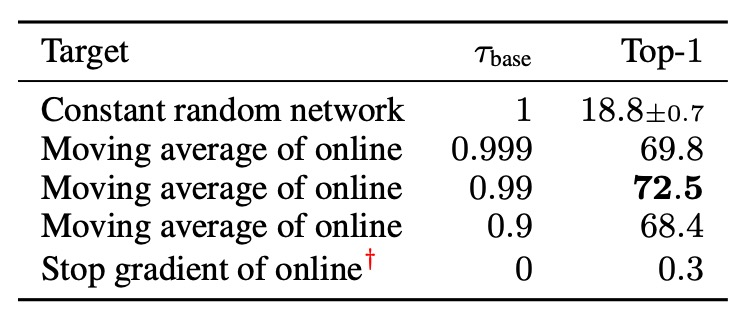
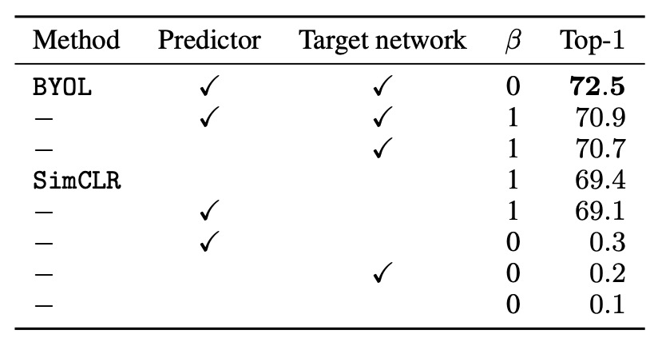

## 負のサンプルは不要

[**Bootstrap your own latent: A new approach to self-supervised Learning**](https://arxiv.org/abs/2006.07733)

---

負のサンプルをどのように設計するかについて議論が盛んに行われている中、この論文の著者は異なるアプローチを提案し、負のサンプルを必要としない方法を示しました。

著者は言っています：自分自身と学ぶことで、モデルは限界を超えることができる。

## 問題の定義

対比学習の核心概念は、同じ画像の異なる視点の表現（「正のサンプルペア」）を近づけ、異なる画像間の表現（「負のサンプルペア」）を遠ざけることで特徴表現を学ぶことです。

しかし、これらの方法は精巧に設計された負のサンプル処理戦略を必要とし、例えばこれまで見てきた大規模バッチトレーニング（SimCLR）やメモリーバンク（MoCo）の設計が効果的です。

さらに、これらの方法は画像の強化（image augmentation）の選択にも強く依存しています。例えば、ランダムクロッピングは実験で非常に効果的であることが証明されています。

負のサンプルの設計がこれほど面倒であれば、負のサンプルなしで学習できる可能性はないのでしょうか？

:::tip
もし SimCLR や MoCo についてまだ読んでいない場合、以前の記事を参照してください：

- [**[19.11] MoCo v1: モメンタム対比学習**](../1911-moco-v1/index.md)
- [**[20.02] SimCLR v1: 大バッチサイズ**](../2002-simclr-v1/index.md)
  :::

## 問題の解決

### モデルアーキテクチャ

<figure style={{"width": "90%"}}>

</figure>

著者は BYOL アーキテクチャを提案し、全体はオンラインネットワーク（online network）とターゲットネットワーク（target network）の 2 つの部分で構成されています：

- **オンラインネットワーク**：上図の上半分に示され、3 つの部分を含みます：

  1. **エンコーダー（encoder）** $f_{\theta}$：入力画像を特徴に変換します。
  2. **プロジェクター（projector）** $g_{\theta}$：特徴を高次元空間にマッピングします。この部分は SimCLR などの対比学習法と似ています。
  3. **予測器（predictor）** $q_{\theta}$：プロジェクション空間内で非線形のマッピングを学習し、ターゲットネットワークの出力を予測します。

- **ターゲットネットワーク**：

  構造はオンラインネットワークと同じですが、異なるパラメータ $\xi$ を使用し、これらのパラメータはオンラインネットワークのパラメータ $\theta$ の指数移動平均（exponential moving average, EMA）によって更新されます。更新式は次の通りです：

  $$
  \xi \leftarrow \tau \xi + (1 - \tau) \theta
  $$

  ここで、$\tau$ は減衰係数であり、ターゲットネットワークの更新速度を制御します。

### トレーニング方法

BYOL のトレーニング過程では、まず画像データセット $D$ が与えられ、ランダムに 1 枚の画像 $x \sim D$ が抽出され、2 つの異なる画像強化方法 $T$ と $T'$ が適用され、2 つの異なる視点が生成されます：

$$
v = t(x), \quad v' = t'(x)
$$

ここで、$t \sim T$、$t' \sim T'$ です。

最初の強化視点 $v$ に対して、オンラインネットワークは次を計算します：

$$
y_{\theta} = f_{\theta}(v), \quad z_{\theta} = g_{\theta}(y_{\theta})
$$

次に、2 番目の強化視点 $v'$ に対して、ターゲットネットワークは次を計算します：

$$
y'_{\xi} = f_{\xi}(v'), \quad z'_{\xi} = g_{\xi}(y'_{\xi})
$$

ここまでで、$z_{\theta}$ と $z'_{\xi}$ は非常に似ていることがわかります。なぜなら、モデルアーキテクチャは同じであり、パラメータも EMA で更新されているからです。この時点で、これら 2 つの出力を直接対比学習に使うと、モデルは通常崩壊します。

なぜなら、あまりにも似すぎているため、モデルは学習せずともこれらの 2 つの出力を近づけてしまうからです。この問題を解決するために、著者は新しいメカニズムを提案しました。それは、$z_{\theta}$ にさらに投影器 $q_{\theta}$ を通して予測出力を得るというものです：

$$
\hat{z}_{\theta} = q_{\theta}(z_{\theta})
$$

その後、$z'_{\xi}$ と $\hat{z}_{\theta}$ を比較して近づける、つまり「対比」ではなく「予測」の問題として全体構造を変更しました。

最後に、数値の安定性を確保するために、これらのベクトルを比較する際に **$L_2$ 正規化**（そのノルムを 1 にする）を行います：

$$
\hat{z}_{\theta} = \frac{q_{\theta}(z_{\theta})}{\|q_{\theta}(z_{\theta})\|_2}, \quad
z'_{\xi} = \frac{z'_{\xi}}{\|z'_{\xi}\|_2}
$$

### 損失関数

ここでは、著者は InfoNCE ではなく、単純に平均二乗誤差（Mean Squared Error, MSE）を損失関数として使用しています：

$$
L_{\theta, \xi} = \|\hat{z}_{\theta} - z'_{\xi}\|_2^2
$$

展開すると：

$$
L_{\theta, \xi} = 2 - 2 \cdot \langle \hat{z}_{\theta}, z'_{\xi} \rangle
$$

ここで、$\langle \hat{z}_{\theta}, z'_{\xi} \rangle$ は 2 つの単位ベクトルの内積で、これがそれらの余弦類似度を表しています。

さらに、学習を対称化（symmetrize）するため、トレーニング中に視点を逆転させ、$v'$ をオンラインネットワークに通し、$v$ をターゲットネットワークに通して、同じ損失を再度計算します：

$$
L'_{\theta, \xi} = \|\hat{z}'_{\theta} - z_{\xi}\|_2^2
$$

最終的な BYOL 総損失は次のようになります：

$$
L^{BYOL}_{\theta, \xi} = L_{\theta, \xi} + L'_{\theta, \xi}
$$

### 実装の詳細

BYOL は SimCLR と同様の画像強化戦略を採用しています：

1. ランダムクロッピングと解像度 224×224 へのリサイズ。
2. ランダム水平反転。
3. 色の歪み（ランダムに明度、コントラスト、彩度、色相を変更）。
4. グレースケール変換（オプション）。
5. ガウスブラー。
6. ソラリゼーション（solarization）。

---

ネットワークアーキテクチャの部分では、BYOL は ResNet-50 を基盤エンコーダー$f_{\theta}$と$f_{\xi}$として使用し、異なる実験でより深い ResNet（50、101、152、200 層）やより広いバリエーション（1× から 4×）をテストしました。

ネットワークの詳細構造は次の通りです：

- **出力特徴次元**：2048（幅の倍数が 1× の場合）。
- **プロジェクション層（MLP）**：
  - **第一層**：線形層、出力次元 4096。
  - **バッチ正規化（Batch Normalization）**。
  - **ReLU 活性化関数**。
  - **最終線形層**：出力次元 256。
- **予測器（Predictor）**：構造はプロジェクション層と同じ。

SimCLR とは異なり、BYOL はプロジェクション層の出力にバッチ正規化を行いません。負のサンプルペアがない場合、バッチ正規化が学習の安定性に影響を与える可能性があるためです。

---

最後に、BYOL は LARS オプティマイザーを使用し、余弦学習率減衰（cosine decay learning rate schedule）を採用しています：

- 1000 エポックのトレーニング、最初の 10 エポックは学習率のウォームアップ。
- 基本学習率は次のように設定されます：
  $$
  \eta = 0.2 \times \frac{\text{BatchSize}}{256}
  $$
- ウェイトデケイ：$1.5 \times 10^{-6}$。
- 指数移動平均パラメータ$\tau$：初期値は 0.996 で、トレーニング中に 1 に向かって徐々に増加します：
  $$
  \tau = 1 - (1 - \tau_{\text{base}}) \cdot \frac{\cos(\pi k/K) + 1}{2}
  $$
  ここで$k$は現在のステップ数、$K$は最大ステップ数です。

## 討論

### なぜ BYOL は崩壊しないのか？

:::tip
この部分は本論文の最も魅力的なところだと私たちは思います。
:::

対比学習において、負のサンプルペアの設計は、モデルが無情報の定常的な表現（constant representation）に収束するのを防ぐために行われます。

BYOL はトレーニング中に明示的な正則化項を使って崩壊解を避けるわけではありませんが、なぜ崩壊しないのでしょうか？

この問題について、著者は詳細に説明しています：

1. BYOL のターゲットネットワークのパラメータ $\xi$ は勾配降下法で更新されません。そのため、パラメータの更新方向は損失関数 $L_{\theta, \xi}$ の勾配方向を最小化するものではありません：

   $$
   \xi \leftarrow \tau \xi + (1 - \tau) \theta.
   $$

   この更新方法は生成対抗ネットワーク（GANs）における学習動力学に似ており、GAN は生成器と識別器の相互競争によって学習を行い、単に共通の損失関数を最小化するのではありません。したがって、BYOL の学習過程は単に 1 つの損失関数に対して勾配降下を行うものではなく、この動力学が崩壊解に収束する可能性を低減させます。

---

2. 更に分析を進め、著者は **予測器 $q_{\theta}$ が最適である（optimal predictor）** と仮定しました。すなわち：

   $$
   q^* = \arg \min_{q} \mathbb{E} \left[ \| q(z_{\theta}) - z'_{\xi} \|_2^2 \right],
   $$

   最適な $q^*$ は次を満たすべきです：

   $$
   q^*(z_{\theta}) = \mathbb{E}[z'_{\xi} | z_{\theta}].
   $$

   この場合、BYOL のパラメータ更新方向を導出でき、$\theta$ に対する勾配更新は条件付き分散（conditional variance）に関連しています：

   $$
   \nabla_{\theta} \mathbb{E} \left[ \| q^*(z_{\theta}) - z'_{\xi} \|_2^2 \right] = \nabla_{\theta} \mathbb{E} \left[ \sum_{i} \text{Var}(z'_{\xi, i} | z_{\theta}) \right],
   $$

   ここで $z'_{\xi, i}$ は $z'_{\xi}$ の第 $i$ の特徴成分を表します。

   これは、BYOL が実際には条件付き分散を最小化しており、すなわち目標表現 $z'_{\xi}$ と現在の表現 $z_{\theta}$ の変動を減少させていることを示しています。そして、分散の基本的な性質により、任意の確率変数 $X, Y, Z$ に対して次が成り立ちます：

   $$
   \text{Var}(X | Y, Z) \leq \text{Var}(X | Y).
   $$

   もし次のように設定すれば：

   - $X = z'_{\xi}$（ターゲットプロジェクション表現）
   - $Y = z_{\theta}$（現在のオンラインプロジェクション表現）
   - $Z$ はトレーニングダイナミクスにおける追加の変動性

   次が得られます：

   $$
   \text{Var}(z'_{\xi} | z_{\theta}, Z) \leq \text{Var}(z'_{\xi} | z_{\theta}).
   $$

   これは、BYOL が情報を単純に捨てることによって条件付き分散を減少させることはできないことを示しており、崩壊解（定常的表現）と矛盾します。なぜなら、崩壊解は BYOL では不安定だからです。

---

3. 最後にターゲットネットワークパラメータ $\xi$ の更新方法を再度分析します。

   もしオンラインネットワークパラメータ $\theta$ をターゲットネットワークに直接適用した場合：

   $$
   \xi \leftarrow \theta.
   $$

   これにより、オンラインネットワークの新しい変動性がターゲットネットワークに迅速に伝達されますが、予測器の最適性の仮定が破壊され、トレーニングが不安定になる可能性があります。したがって、BYOL は指数移動平均を使用してターゲットネットワークを更新します：

   $$
   \xi \leftarrow \tau \xi + (1 - \tau) \theta.
   $$

   この滑らかな更新戦略により、ターゲットネットワークの変化がゆっくりと進行し、予測器が最適な状態に近い状態を保つことができ、全体的な学習過程が安定します。

### ImageNet でのパフォーマンス

<figure style={{"width": "60%"}}>

</figure>

著者は、BYOL の事前学習後の固定表現上で線形分類器をトレーニングし、Top-1 および Top-5 精度を測定する標準的な線形評価プロトコルに基づいて実験を行いました。

ResNet-50（1×）アーキテクチャでは、BYOL は 74.3%の Top-1 精度（91.6%の Top-5 精度）を達成し、従来の最先端の自己教師あり学習法よりも 1.3%（Top-1）および 0.5%（Top-5）高い結果を示しました。

BYOL は監督付き学習のベースライン（76.5%）とのギャップを縮めましたが、さらに強力な監督付き学習ベースライン（78.9%）には及びませんでした。

より深く、より広い ResNet アーキテクチャ（例：ResNet-50(4×)）では、BYOL は他の自己教師あり学習法を超えて、最良の結果を 79.6%の Top-1 精度で達成し、監督付き学習のベースラインに非常に近づきました。

BYOL は負のサンプルなしで、対比学習法と同等またはそれ以上のパフォーマンスを達成し、監督付き学習の基準に近づいています。詳細な表は以下の通りです：

<figure style={{"width": "90%"}}>

</figure>

### 消融実験 - Part 1

著者は BYOL 設計の重要な要素が最終的なモデルの性能に与える影響を調査するため、いくつかの消融実験を行いました：

1. **バッチサイズが性能に与える影響**：

    

    <figure style={{"width": "50%"}}>
    
    </figure>
    

   対比学習方法では、トレーニングのバッチサイズが負のサンプルの数に直接影響します。バッチサイズを小さくすると、負のサンプル数が減少し、トレーニングの効果が低下します。しかし、BYOL は負のサンプルに依存しないため、理論的にはより堅牢であるはずです。

   著者は、BYOL と SimCLR のバッチサイズ 128 から 4096 の間での性能変化を比較しました。その結果、BYOL はバッチサイズ 256 から 4096 の範囲で安定しており、バッチサイズが非常に小さくなると性能が低下し始めました。一方、SimCLR はバッチサイズが小さくなると性能が急激に低下し、これは負のサンプル数の減少に関連しています。

---

2. **画像強化の影響**：

    

    <figure style={{"width": "50%"}}>
    
    </figure>
    

   対比学習方法は画像強化に強く依存しており、特に色の歪みが重要です。これは、ランダムクロッピングの視点が通常、色の情報を共有しますが、異なる画像からの視点は色の変化が大きいためです。色の強化を追加しないと、対比学習は色のヒストグラムに基づく区別を学習するだけで、より深い特徴は学習しない可能性があります。

   著者は、BYOL と SimCLR が異なる画像強化の組み合わせでの性能変化を比較しました。その結果、BYOL は画像強化への依存性が低く、色の強化を除去したり、ランダムクロッピングだけを使用しても高い精度を維持できることが示されました。

---

3. **ブートストラッピング（Bootstrapping）の影響**：

    

    <figure style={{"width": "70%"}}>
    
    </figure>
    

   BYOL の重要なメカニズムの 1 つは、目標ネットワークを使用して学習目標を提供することであり、目標ネットワークの重みはオンラインネットワークの重みの指数移動平均（EMA）によって決まります。減衰率が 1 の場合、目標ネットワークは更新されず、固定のランダムネットワークを使用することに相当します。減衰率が 0 の場合、目標ネットワークは毎ステップオンラインネットワークと同期して更新されます。

   著者は目標ネットワークの更新速度を異なる設定でテストしました。結果は次の通りです：

   - 目標ネットワークの更新が速すぎる場合、学習過程が不安定になり、学習目標が急激に変動するためです。
   - 目標ネットワークの更新が遅すぎる場合、学習が遅く進行し、最終的に得られる特徴の質が低下します。
   - 適切な指数移動平均戦略（例えば、$\tau = 0.99$）を使用することで、安定性と学習効率の間で最適なバランスを達成できることが示されました。

### 消融実験 - Part 2

著者はさらに、BYOL と他の対比学習方法との関係を探り、BYOL が SimCLR を超える理由を分析しました：

まず、InfoNCE から始めて、拡張された InfoNCE 損失関数を考えます：

$$
\text{InfoNCE}_{\alpha, \beta}^{\theta} =
$$

$$
\frac{2}{B} \sum_{i=1}^{B} S_{\theta}(v_i, v'_i) - \beta \cdot \frac{2\alpha}{B} \sum_{i=1}^{B} \ln \left( \sum_{j \neq i} \exp\left(\frac{S_{\theta}(v_i, v_j)}{\alpha}\right) + \sum_{j} \exp\left(\frac{S_{\theta}(v_i, v'_j)}{\alpha}\right) \right)
$$

ここで：

- **$\alpha > 0$**：温度パラメータ（temperature）。
- **$\beta \in [0,1]$**：負のサンプルの影響係数。
- **$B$**：バッチサイズ。
- **$v, v'$**：バッチ内の強化視点、任意のインデックス $i$ に対して、$v_i$ と $v'_i$ は同じ画像の異なる強化バージョンです。
- **$S_{\theta}(u_1, u_2)$**：視点間の類似度を測る関数で、次のように定義されます：

  $$
  S_{\theta}(u_1, u_2) = \frac{\langle \phi(u_1), \psi(u_2) \rangle}{\|\phi(u_1)\|_2 \cdot \|\psi(u_2)\|_2}
  $$

  ここで：

  - **SimCLR**：
    - **$\phi(u) = z_{\theta}(u)$**（予測器は使用しない）。
    - **$\psi(u) = z_{\theta}(u)$**（目標ネットワークは使用しない）。
    - **$\beta = 1$**（負のサンプルを使用）。
  - **BYOL**：
    - **$\phi(u) = p_{\theta}(z_{\theta}(u))$**（予測器を使用）。
    - **$\psi(u) = z_{\xi}(u)$**（目標ネットワークを使用）。
    - **$\beta = 0$**（負のサンプルは使用しない）。

---

上記の設定に基づいて、実験結果は次の表のようになります：

<figure style={{"width": "70%"}}>

</figure>

まず、異なる$\beta$の値をテストして、負のサンプルペアが必要かどうかを確認しました：

- **$\beta = 1$**（負のサンプルペアを使用）：SimCLR の損失関数を回復します。
- **$\beta = 0$**（負のサンプルペアを使用しない）：BYOL のみ（目標ネットワークと予測器を含む）でも効果的に学習できます。

結果として、BYOL は負のサンプルペアを使用しなくても良好な性能を維持できる唯一の方法であることが示されました。

次に、目標ネットワークを SimCLR に追加して、性能への影響を観察しました。結果として、目標ネットワークを追加すると SimCLR の精度が 1.6%向上し、目標ネットワークが対比学習方法において重要であることが示唆されました。

最後に、SimCLR に予測器のみを追加した場合、目標ネットワークを追加した場合に比べて性能の向上は限定的であることがわかりました。著者は、予測器と目標ネットワークの組み合わせが BYOL における崩壊解の回避の鍵であると考えています。

## 結論

BYOL の革新は、負のサンプルペアを完全に使用せず、目標ネットワークと予測器の組み合わせを通じて崩壊解の問題を回避する点にあります。ImageNet 上では、BYOL は最先端の自己教師あり学習の結果を達成し、監督学習のベースラインに近づきました。さらに、BYOL は多くの既存の対比学習方法を超える性能を発揮しました。

:::info
BYOL が本当に負のサンプルの制約を完全に克服できるかについて、論文発表後には多くの議論があり、いくつかの記事では「BN 作弊」問題について触れています。非常に興味深い議論が展開されています。関連するディスカッションは以下の通りです：

- **他の研究者からの疑問：**

  - [**Understanding self-supervised and contrastive learning with "Bootstrap Your Own Latent" (BYOL)**](https://imbue.com/research/2020-08-24-understanding-self-supervised-contrastive-learning/)

- **著者チームの回答と後続の実験：**

  - [**BYOL works _even_ without batch statistics**](https://arxiv.org/abs/2010.10241)

    :::

:::tip
「BN 作弊」問題は MoCo v1 でも言及されています。その論文では、著者は「Shuffle BN」方法を使用してこの問題を解決しています。

- [**[19.11] MoCo v1: モメンタム対比学習**](../1911-moco-v1/index.md)
  :::
