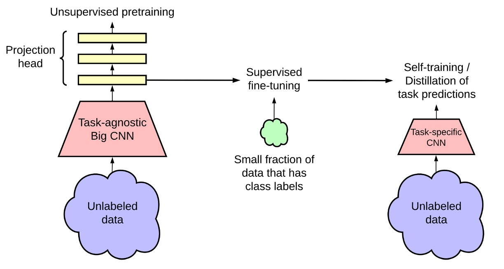
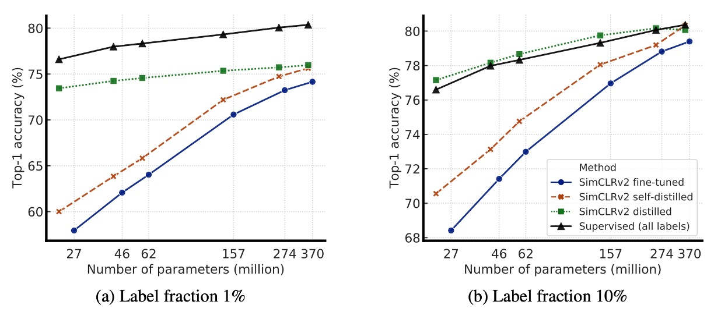

## モデルは大きく

[**Big Self-Supervised Models are Strong Semi-Supervised Learners**](https://arxiv.org/abs/2006.10029)

---

FAIR は MoCo v2 の論文で実力を見せつけました。その内容は、もし十分なトレーニングリソースがなければ、彼らの「モメンタムメモリバンク」の解決策を採用すれば、より良い結果が得られるというものです。

ただし、SimCLR の著者（つまり Google Research）は彼らとの議論を続ける意図はないようで、むしろ別の方向に目を向けました：

> **「計算資源の問題を一旦脇に置いて、無監督に基づくコントラスト学習アーキテクチャが、大きなモデルとどのように融合できるかを見てみよう。」**

:::tip
計算資源の問題を無視できる人はほとんどいませんが、振り返ると当時すでに人工知能の分野が最終的に計算力独占の寡占競争に向かうことを予示していました。
:::

:::info
もし MoCo v2 の論文に興味があれば、以前の記事を参照できます：

- [**[20.03] MoCo v2: 一矢を報いる**](../2003-moco-v2/index.md)
  :::

## 問題の定義

この時点で、誰もが知っている GPT-3 の論文はすでに arXiv に発表されていました。

つまり、NLP 分野では無ラベルデータを使って巨大な言語モデルを構築し、その後、少量のラベル付きデータで微調整を行う方法が大規模に応用され始めているということです。この「事前学習 -> 微調整」というクラシックなパラダイムは、すでに NLP 分野で確立されています。

しかし、CV 分野では、なぜかあまり流行していないようです。

そのため、著者は SimCLR のコントラスト学習アーキテクチャを基に、目標として「大規模」な無ラベルデータを使ってモデルの事前学習を行い、「少量」のデータで監督付き微調整を行うことを提案しました。

実験の結果は良好であり、SimCLR v2 という名前が付けられました。

## 解決問題

<figure style={{"width": "90%"}}>

</figure>

この図は SimCLR v2 のモデルアーキテクチャを示しており、全体のフレームワークは主に 3 つの段階に分かれています。

1. **無監督の事前学習（Unsupervised Pretraining）**：

   この段階では主にコントラスト学習（contrastive learning）を使用して、一般的な視覚的特徴を学習します。

   方法は以前発表された SimCLR と同様で、各画像を異なるデータ拡張を通して 2 つの異なるビューを生成し、NT-Xent 損失関数を使用して表現を学習します。

   この段階では、後続のタスクが何であるかは分かっていないため、モデルはラベル付きデータに触れることはなく、タスクに依存しない使い方となります。

   :::tip
   NT-Xent が何か忘れた方のために、ここで復習しましょう：

   $$
   \ell_{NT-Xent}^{i,j} = - \log \frac{\exp(\text{sim}(z_i, z_j)/\tau)}
   {\sum_{k=1}^{2N} \mathbb{1}[k \neq i] \exp(\text{sim}(z_i, z_k)/\tau)}
   $$

   ここで：

   - $\text{sim}(z_i, z_j) = \frac{z_i \cdot z_j}{\|z_i\|\|z_j\|}$ は余弦類似度です。
   - $\tau$ は温度パラメータで、コントラスト学習の分布の滑らかさを制御します。
     :::

2. **監督付き微調整（Supervised Fine-tuning）**：

   この段階では、著者は少量のラベル付きデータを使用して微調整を行い、モデルが特定の分類タスクに適応できるようにします。

   従来の監督学習とは異なり、SimCLR v2 は微調整時に MLP 投影ヘッド（projection head）を完全には破棄せず、その一部の層から微調整を開始し、モデルの性能を向上させます。

   :::tip
   3 層の予測ヘッドを使用し、最初の層から微調整を開始した場合、1%のラベル付きデータで微調整した際、精度が 14%向上しました（SimCLR の 2 層予測ヘッドと比較）。

   全体的な向上は非常に印象的です！
   :::

3. **知識蒸留（Knowledge Distillation）**：

   この段階では、著者は知識蒸留を使用して、学生モデルが教師モデルから学習し、パフォーマンスを向上させつつモデルのサイズを圧縮します。このプロセスは蒸留損失関数（Distillation Loss）を使用して、学生モデルと教師モデルの出力差を最小化します。

   数式で表すと次のようになります：

   $$
   L_{\text{distill}} = - \sum_{x_i \in D} \sum_{y} P_T(y | x_i; \tau) \log P_S(y | x_i; \tau)
   $$

   ここで：

   $$
   P(y | x_i) = \frac{\exp(f_{\text{task}}(x_i)[y] / \tau)}{\sum_{y'} \exp(f_{\text{task}}(x_i)[y'] / \tau)}
   $$

   - $\tau$ は温度パラメータで、教師モデルの出力確率分布を滑らかにし、学生モデルが学習しやすくします。

   ラベル付きデータが一部ある場合、実際のラベル付きデータの交差エントロピー損失と蒸留損失を加重で組み合わせることができます：

   $$
   L = -(1 - \alpha) \sum_{(x_i, y_i) \in D_L} \log P_S(y_i | x_i) - \alpha \sum_{x_i \in D} \sum_{y} P_T(y | x_i; \tau) \log P_S(y | x_i; \tau)
   $$

   ここで：

   - $D_L$ はラベル付きデータセットです。
   - $\alpha$ は加重係数で、実際のラベルと蒸留の比率を調整します。

   :::tip
   **知識蒸留の概念を簡単に復習**：

   知識蒸留は、小さな学生モデル（Student Model）が大きな教師モデル（Teacher Model）の出力分布を学習する方法です。

   - **教師モデル**：監督付き微調整で最適化された強力なモデルです。
   - **学生モデル**：教師モデルが無ラベルデータに対して生成した「ソフトラベル（Soft Labels）」を学習し、実際のラベル（Ground Truth）を直接使用しません。

   出力分布を合わせるための損失関数としては、標準的な蒸留損失が使われます：

   $$
   L_{\text{distill}} = - \sum_{x_i \in D} \sum_{y} P_T(y | x_i; \tau) \log P_S(y | x_i; \tau)
   $$

   これは交差エントロピー損失に似ていますが、教師モデルの出力確率を入力として、学生モデルの出力確率をターゲットにします。

   最後に、学生モデルと教師モデルが「同じアーキテクチャ」を持つ場合、これを「自己蒸留（Self-distillation）」と呼び、タスク特有のパフォーマンスをさらに向上させることができます。学生モデルが「小さい」場合、蒸留はモデル圧縮を助け、軽量でありながら高い精度を保つことができます。
   :::

## 討論

### 大規模モデルは効率的

<figure style={{"width": "90%"}}>

</figure>

著者は最初に、ResNet モデルの異なるサイズ（ネットワークの深さや幅を変更）が半監督学習に与える影響を探りました：

- **最小モデル**：標準的な ResNet-50。
- **最大モデル**：ResNet-152（3× + SK）。

実験結果は上の表に示されていますが、監督学習の部分では、最小モデルと最大モデルの間で精度の差はわずか 4%でした。しかし、自監督学習の部分では、線形分類器を使ったテストで精度の差が 8%に達し、1%のラベル付きデータでの微調整による精度向上は 17%に達しました。

最後に、ResNet-152（3× + SK）と ResNet-152（2× + SK）の比較では、モデルのパラメータ数がほぼ倍増しましたが、性能向上は顕著ではなく、モデルの幅の効果が限界に達している可能性を示しています。

下の図は、モデルサイズ（model size）とラベル付きデータの割合（label fraction）の変化がモデルの性能に与える影響を示し、より大きなモデルが限られたラベル付きデータをどれだけうまく活用できるかを探ったものです。

<figure style={{"width": "90%"}}>

</figure>

図から分かるように、モデルが大きくなるにつれて精度が向上しており、これは監督学習と半監督学習の両方において当てはまります。ただし、半監督学習においては、大規模モデルの性能向上がより顕著であり、これはラベル付きデータが少ない場合に大規模モデルの優位性がより強調されることを示しています。

さらに、ラベル付きデータが少ない場合、大規模モデルの優位性がさらに明確になります。ラベル付きデータが 1%または 10%しか利用できない場合、ResNet-152 3×+SK などの大規模な ResNet 変種は、微調整後の精度が小さな ResNet-50 を大きく上回りました。

大規模モデルは全体的により良い性能を発揮しますが、いくつかのアーキテクチャ（例えば Selective Kernel, SK）は、少ないパラメータで同等の性能を達成できることがあり、これはモデルのサイズを単に増加させるだけではなく、より優れたモデルアーキテクチャの探索が依然として価値のある方向であることを示しています。

### より深い予測ヘッドがより良い結果を生む

<figure style={{"width": "80%"}}>

</figure>

この部分では、SimCLR v2 の事前学習および微調整における MLP 投影ヘッド（Projection Head）の影響を主に研究しています。

- **上図 (a)**：異なる投影ヘッド層数が事前学習における表現学習に与える影響を比較しています。結果は、より深い投影ヘッドが事前学習段階でより良い結果を示すことを示しています。
- **上図 (b)**：異なる層から微調整を開始した場合の影響を比較しています。結果として、最適な微調整層は通常、投影ヘッドの最初の層であり、入力層ではないことが示されており、特にラベル付きデータが少ない場合に顕著です。

最後に、ResNet ネットワークが大きくなるにつれて、予測ヘッドの深さの影響が小さくなり、これは大規模モデルにおいて投影ヘッドの深さがモデルの性能に与える影響が減少することを示しています。

### 知識蒸留の効果

<figure style={{"width": "90%"}}>

</figure>

上の図は実験結果を示しており、知識蒸留には 2 つの主要な利点があります：

1. **学生モデルが教師モデルより小さい場合**：知識蒸留はモデルの圧縮を効果的に行い、より小さな学生モデルでも教師モデルの特徴学習能力を維持できます。これは、リソースが限られているアプリケーション（例えばモバイルデバイス）で特に有用です。
2. **学生モデルと教師モデルが同じ場合（自己蒸留）**：学生と教師モデルが同じアーキテクチャを持つ場合でも、蒸留は半監督学習の効果を向上させます。蒸留プロセスは、モデルがノイズをフィルタリングし、より堅牢な特徴を学習するのを助けるためです。

したがって、今日最適な ResNet-50 モデルを得るためには、次の戦略を取ることができます：

- **第一歩**：まず ResNet-152 を自己蒸留して、パフォーマンスをさらに向上させます。
- **第二歩**：この ResNet-152 をより小さな**ResNet-50**に蒸留し、小さなパラメータ規模で高精度を維持させます。

### 他の手法との比較

<figure style={{"width": "90%"}}>

</figure>

実験結果は上表に示されていますが、SimCLR v2 は ImageNet で過去の半監督学習手法を超え、特に小型モデル（ResNet-50）と大型モデル（ResNet-152）の両方で顕著な改善を示しました。

これは、知識蒸留と無ラベルデータを組み合わせた手法が有効な半監督学習戦略であり、モデルの精度を向上させるだけでなく、小さなモデルでも高いパフォーマンスを維持できることを示しています。

## 結論

SimCLR v2 の主な研究方向は、「少量のラベル付きデータに対するモデルのパフォーマンス」と「知識蒸留の効果」を探ることです。

著者が提案する半監督学習フレームワークは、以下の 3 つのステップに分かれています：

1. **無監督の事前学習**：自己監督学習を通じて一般的な画像特徴を学習します。
2. **監督付き微調整**：限られたラベル付きデータを使って特定の分類タスクに適応させます。
3. **知識蒸留**：無ラベルデータを利用し、教師モデルのソフトラベルを使って学生モデルのパフォーマンスをさらに向上させます。

この手法は、すでに NLP 分野で広く用いられていますが、CV 分野では十分に探求されていないベースライン手法です。著者の実験結果は、この方法が ImageNet で既存の最先端の手法を大きく上回ったことを示しています。

大規模モデルの力は、CV 分野においても今まさに現れつつあります。
