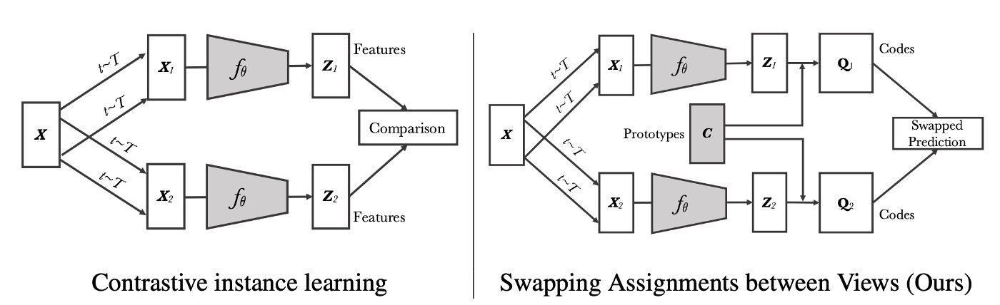
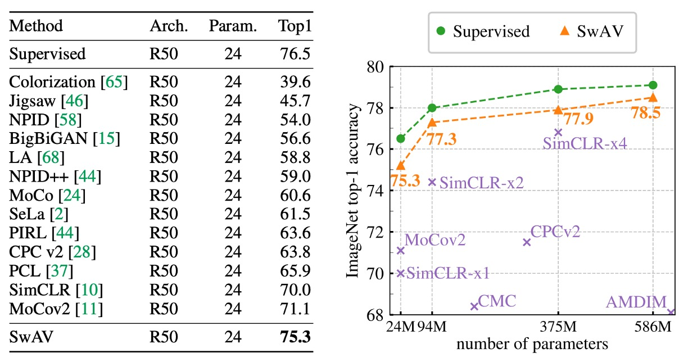

## クラスタリング予測

[**Unsupervised Learning of Visual Features by Contrasting Cluster Assignments**](https://arxiv.org/abs/2006.09882)

---

MoCo と SimCLP の二つのシリーズがしばらく議論されてきました。

これまで正負サンプルを使ってペアで比較していましたが、今回は少し異なるアプローチを見てみましょう：クラスタリングはどうでしょうか？

## 問題の定義

対比学習のフレームワークは大体確立されています。主要な手法としては以下のようなものがあります：

1. **対比損失の使用**：InfoNCE（または NT-Xent）は一般的な損失関数の一つです。
2. **画像の切り取り変換**：同じ画像の特徴を近づけ、異なる画像の特徴を遠ざけます。
3. **大量の負サンプル**：サンプル数が多いほど学習効果が向上します。

もちろん、細かい部分では動的エンコーダーやメモリーバンクなど、さまざまなアプローチが考えられます。

本論文の著者は「大量の計算資源は依然として無視できない問題だ！」と述べています。

もし問題を変えて、対比損失に固執せず、「予測」問題に転換できればどうでしょうか。

モデルに「別の視点のクラスタ割り当て」を予測させ、直接特徴を比較するのではなく、クラスタリングを通じて同じ効果を得ることができます。

:::tip
この「予測」のアイデアは、同時期に発表された別の論文 BYOL にも反映されていますが、予測の対象が異なります。BYOL は別の視点の特徴を予測するのに対し、SwAV は別の視点のクラスタ割り当てを予測します。

興味のある読者は、以前の記事を参考にしてください：[**[20.06] BYOL: 負のサンプルは不要**](../2006-byol/index.md)
:::

## 問題解決

### モデルアーキテクチャ

<figure style={{"width": "90%"}}>

</figure>

この図を見れば、この論文を読んだことになります。

まず、左半分は現在広く受け入れられている対比学習アーキテクチャです：

図の中で、画像$X$が異なる変換（変換$t \sim T$）を受けて、2 つの強化された視点（例えば$X_1, X_2$）を生成します。

これら 2 つの視点はそれぞれ畳み込みネットワーク（または任意の特徴抽出ネットワーク）$f_\theta$を通して、特徴ベクトル（$Z_1, Z_2$）を出力します。

対比的インスタンス学習では、方法は「これら 2 つの特徴ベクトルを直接比較」し、例えばそれらの類似度を計算します（SimCLR や MoCo などの方法に似ています）。モデルは同一画像からの特徴ベクトルを特徴空間で近づけ、異なる画像からの特徴ベクトルを遠ざけることを目指します。

---

<figure style={{"width": "85%"}}>

</figure>

右半分は本論文で提案された方法です。もう少し詳しく見てみましょう：

SwAV では、著者は各特徴（例えば$Z_1, Z_2$）を一組の学習可能な「プロトタイプベクトル（以下、すべてのプロトタイプ）」に割り当て、対応する「コード（コード）」$Q_1, Q_2$を得ます。

図中では「Prototypes C」と「Codes」でこのステップを示しています。

次に、SwAV の核心は「交換予測（Swapped Prediction）」です。つまり：

1. 視点 1 の特徴に対応するコード$Q_1$を使用して、視点 2 の特徴が学習すべき内容を指示します。
2. 視点 2 の特徴に対応するコード$Q_2$を使用して、視点 1 の特徴が学習すべき内容を指示します。

このようにして、SwAV は$Z_1$と$Z_2$を直接比較するのではなく、これらが「プロトタイプ」に割り当てられた結果を比較し、同じ画像から異なる視点が一貫した割り当てを持つように要求します。

プロトタイプは学習可能なベクトルのセットであり、ここでは「クラスタセンター」として扱われ、特徴ベクトルを「コード」の形式に対応させることでクラスタリング効果を生み出します。訓練過程でモデルはこれらのプロトタイプを学習し、それらが異なる画像をより良く区別できるような空間位置に対応するようになります。

### オンラインクラスタリング

SwAV の重要な特徴の 1 つは「オンラインクラスタリング（Online Clustering）」です。

著者がどのようにして各画像の「コード」をオンラインで計算し、プロトタイプを更新するのかを見てみましょう：

まず、各画像$x_n$に対して、変換集合$T$（例えばランダムクロップ、水平フリップ、色の揺らぎなど）からランダムに 1 つの変換$t$をサンプリングして、強化された画像$x_{nt}$を生成します。その後、畳み込みニューラルネットワークを使用して特徴ベクトルを取得し、その特徴ベクトルを単位球面に投影して、$z_{nt}$を得ます。これは出力ベクトルの長さを 1 に正規化したものです。

ここまでの部分は、以前の対比学習論文とほとんど変わりません。

最後に、$z_{nt}$を$K$個の学習可能な「プロトタイプ」$\{ c_1, \dots, c_K \}$にマッピングして、「コード」$q_{nt}$を得ます。

:::tip
ここでひらめきました！これが後の数年間でよく見ることになる「コードブック」の概念ではないですか！
:::

各画像専用のクラスタコードを得た後、次は交換予測を行います：

2 つの強化視点$(t, s)$が同一画像に対応します。$(z_t, q_t)$は視点$t$の特徴とコードを、$(z_s, q_s)$は視点$s$の特徴とコードを表します。

- 著者はここで$z_t$を使って$q_s$を「予測」し、同時に$z_s$を使って$q_t$を「予測」しようとしています。
- これは対比学習で特徴ベクトルを直接比較するのとは異なり、ここでは「コード」を比較します。

訓練時には交差エントロピー損失（Cross Entropy Loss）を使用して計算し、全データセットで「交換予測」の問題を進めます。

### 等分配約束

オンライン学習を実現するために、訓練中は「現在のバッチ」内の特徴を用いてコードを計算し、全体のデータセットを使わないようにします。これにより、モデルは異なるバッチのデータを受け取るたびにプロトタイプを更新し、これらのプロトタイプが多様な特徴分布に適応していきます。

しかし、プロトタイプに制限がないと、すべての特徴が同じベクトルにマッピングされ、モデルが崩壊（collapse）する恐れがあります。このような事態を避けるために、著者は「等分配約束」を導入し、各バッチ内でプロトタイプの割り当てができるだけ均等であることを要求します。これにより、各プロトタイプはできるだけ同じ数のサンプルを受け取ることが保証されます。

現在のバッチが $B$ 個の特徴ベクトルを含むとき、これらは次のように表されます：

$$
Z = [z_1, \dots, z_B],
$$

$K$ 個のプロトタイプは次のように表されます：

$$
C = [c_1, \dots, c_K].
$$

私たちは、割り当て行列 $Q$ を最適化することによって、特徴とプロトタイプの最適なマッチングを実現したいと考えています。目的関数は次のように表されます：

$$
\mathrm{Tr}(Q^\top C^\top Z)
$$

これはすべての特徴とプロトタイプの間の類似度の合計を表し、エントロピー正則項 $\epsilon\,H(Q)$（ここで$H(Q) = -\sum_{ij} Q_{ij} \log Q_{ij}$）は割り当てが過度に集中するのを防ぐために使われます。この設計により、モデルは識別能力を保ちつつ、すべての特徴が少数のプロトタイプに集まりすぎないようにします。

実際の最適化では、$Q$ を特定の集合 $\mathcal{Q}$ に制限します。この集合は次のように定義されます：

$$
\mathcal{Q} = \Bigl\{ Q \in \mathbb{R}_{+}^{K \times B} \;\Big|\;
Q\,\mathbf{1}_{B} = \tfrac{1}{K}\,\mathbf{1}_{K}, \quad
Q^\top \mathbf{1}_{K} = \tfrac{1}{B}\,\mathbf{1}_{B} \Bigr\},
$$

ここで、$\mathbf{1}_K$ と $\mathbf{1}_B$ はそれぞれ $K$ 次元および $B$ 次元の全て 1 のベクトルです。運用学の分野では、このような集合を「輸送多面体（transportation polytope）」と呼び、これは各行（各サンプル）と各列（各プロトタイプ）の合計が固定された定数であることを要求し、各プロトタイプが約 $\frac{B}{K}$ 個のサンプルに均等に割り当てられることを保証します。

エントロピー正則項の平滑化パラメータ $\epsilon$ は重要な役割を果たします。もし $\epsilon$ が大きすぎると、割り当てが過度に均等になり、識別能力を失います。一方、$\epsilon$ が小さすぎると、割り当てが集中しすぎて、モデルが崩壊する可能性があります。実験結果から、$\epsilon$ を小さくすることで良いバランスが得られることが示されています。

解法の過程では、最初に連続解 $Q^*$ を得ます。輸送多面体の制約と指数マッピング形式を同時に満たすために、著者は Sinkhorn-Knopp アルゴリズムを使用しています。このアルゴリズムは反復的に行列の正規化を行い、対応する対角行列 $\mathrm{Diag}(u)$ と $\mathrm{Diag}(v)$ を計算することで、最終的に得られる$Q^*$が行と列の和の条件を満たすことを保証します。式は次のようになります：

$$
Q^* = \mathrm{Diag}(u)\,\exp \Bigl(\tfrac{C^\top Z}{\epsilon}\Bigr)\,\mathrm{Diag}(v).
$$

実験では、通常約 3 回の反復で理想的な結果が得られ、計算は GPU に非常に軽い負荷をかけることがわかりました。

さらに、小さなバッチでは、バッチ内の特徴数$B$がプロトタイプ数$K$よりもずっと少ない場合、単一のバッチで各プロトタイプが十分なサンプルを得ることができない可能性があります。この問題を解決するために、著者は前のバッチの特徴を保持し、大きな特徴集合を累積してから、まとめて割り当て計算を行います。しかし、逆伝播時には現在のバッチのサンプルのみを更新します。

例えば、実際の操作では、約 $3K$ の特徴（例えば $K=3000$ の場合、9000 の特徴）をキャッシュに保存し、約 15 バッチ（各バッチのサイズが 256 の場合）に相当する特徴を保持します。これに比べて、MoCo のような他の対比学習法では、数万の特徴やサンプルを保持する必要があり、SwAV のストレージ要求はより経済的で効率的です。

:::tip
これは、100 個のボールを 10 個の箱に投げ入れる問題のようなものです。すべてのボールが同じ箱に入らないように、各箱に均等にボールが分配されるような仕組みが必要です。

上記のアルゴリズムは、この問題を解決し、「プロトタイプ」ベクトルが特徴ベクトルに「できるだけ均等に」分配されるようにします。
:::

### 多重裁切

以前の研究では、画像のさまざまな部分（シーンやオブジェクトなど）の関係を捉えるために、ランダムクロップ（random crops）が多く使われてきました。異なる領域のクロップを通じて、モデルは局所的特徴と全体構造の関係を学習できます。

理論的には、視点が多ければ多いほど、より堅牢な特徴表現を得られますが、クロップ（または視点）の数を増やすと、計算とメモリの要求が二次的に増加します。なぜなら、クロップを 1 つ追加するたびに、そのクロップの特徴と後続のコードの計算が必要になるからです。

計算量を大幅に増やさずに、より多くの視点を提供するために、著者は多重裁切の戦略を提案しました：

1. **2 つの標準解像度裁切**：これらの裁切は画像の完全な詳細を保持し、その後のコード計算に使用されます。
2. **追加の$V$個の低解像度裁切**：これらの低解像度裁切は画像の一部領域のみをカバーしますが、サイズが小さいため計算コストが低くなります。

低解像度のクロップを使用することで、追加の計算負担を大幅に削減できます。低解像度の画像処理は高解像度画像の処理に比べて必要な計算資源が少なくて済みます。これにより、同じ画像から多くの視点を得ることができ、全体的な計算時間とメモリに与える影響は最小限に抑えられます。

元々の損失関数は 2 つの視点間での交換予測損失に使用されていましたが、多重裁切戦略では損失関数は次のように一般化されます：

$$
L(z_{t_1}, z_{t_2}, \dots, z_{t_{V+2}}) = \sum_{i \in \{1,2\}} \sum_{\substack{v=1 \\ v\neq i}}^{V+2} \ell(z_{t_v}, q_{t_i})
$$

ここで、$z_{t_1}$ と $z_{t_2}$ は 2 つの標準解像度裁切の特徴を表し、残りの$z_{t_v}$（$v=3,\dots,V+2$）は低解像度裁切の特徴を表します。

著者はここで高解像度裁切のみを使って「コード」を計算し、これらのコードを使って他のすべての裁切（低解像度を含む）の特徴と比較します。

:::tip
**なぜ高解像度裁切のみでコードを計算するのか？**

すべての裁切のコードを計算すると計算コストが大幅に増加し、低解像度裁切は局所情報しか含まないため、コードの割り当て品質が低下します。実際のところ、全解像度裁切だけを使うことで、転送学習の効果がより良好に保たれることがわかっています。
:::

## 討論

著者は SwAV を利用して学習した特徴をいくつかのデータセットで転送学習を行い、これらの特徴の汎用性と実用性を検証しました。彼らは SimCLR で導入された技術のいくつかを改良して、次の方法を取り入れています：

- **LARS（Layer-wise Adaptive Rate Scaling）**：大規模バッチ学習時に学習率を安定させるために役立ちます。
- **Cosine Learning Rate**：余弦退火戦略を利用して学習率を調整し、トレーニング過程をよりスムーズにします。
- **MLP Projection Head**：追加の全結合層（MLP）を通じて特徴をプロジェクションし、特徴表現をさらに向上させます。

### 実験結果

ここでは、ImageNet で評価した無監督特徴に関する実験結果を主に見ていきます。

方法としては、SwAV で事前学習された ResNet-50 ネットワークから特徴を抽出し、それらの特徴を固定して微調整せずに、「凍結」された特徴で線形分類器をトレーニングします。

結果は次の表に示されています：

<figure style={{"width": "90%"}}>

</figure>

SwAV の線形分類精度は、当時最先端の手法に対して Top-1 で 4.2%高く、完全監督学習のモデルに対してはわずか 1.2%低い結果となりました。この実験では、SwAV は大規模バッチ（4096）を使用し、800 エポックでトレーニングしました。

右側の図では、異なる幅の ResNet-50 モデルが無監督特徴学習においてどのような性能を示すかを示しています。

結果から、モデルの幅が増すにつれて、SwAV の性能も向上することがわかります。大規模モデルでは、SwAV と完全監督学習モデルの間の差はわずか 0.6%となり、この結果は SwAV の有効性を確認するだけでなく、無監督学習が大規模画像分類やダウンストリームタスクにおける潜在能力を示しています。

### 消融実験：多重裁切

<figure style={{"width": "90%"}}>

</figure>

上の図は、ImageNet データセットを基にした多重裁切戦略の効果を示しており、ResNet-50 をベースネットワークとして使用しています。

左側の図では、クラスタリングベースの手法と対比的インスタンス学習手法を比較しています。

実験結果は次の通りです：

- **多重裁切なしの場合**：SwAV と DeepCluster-v2 は、それぞれ SimCLR より Top-1 精度が約 2%高かった。
- **多重裁切を使用した場合**：両者とも SimCLR に対してさらに大きな改善があり、3.5%の増加を達成しました。

この結果は、特に改良されたバージョンを使用したクラスタリング戦略が視覚特徴の学習において大きな潜力を持ち、インスタンス間の対比に依存する手法よりも効果的であることを示しています。

結果を見てみると、SwAV と DeepCluster-v2 は非常に似たパフォーマンスを示しますが、重要なのはそのトレーニングモードの違いです：

- DeepCluster-v2 は、クラスタセンターと割り当て結果を更新するためにデータセット全体を複数回反復する必要があり、オンライン学習には適していません。非常に大規模なデータセットでは通常 1 回の反復しか行えず、この場合 DeepCluster-v2 は正常に機能しません。
- 一方、SwAV はバッチレベルで直接交換割り当ての戦略を採用しており、これによりオンラインで更新できるため、データを 1 回しか反復しなくても理想的な結果を得ることができます。

別の視点から見ると、DeepCluster-v2 は SwAV が提案する交換メカニズムの特別なケースと見なすことができます。DeepCluster-v2 では交換が異なるトレーニングエポック間で行われ、前のエポックの割り当て結果を用いて現在のエポックのある増強視点を予測します。一方、SwAV では同一バッチ内で直接交換が行われ、これはオンライン学習環境により適しています。

## 結論

SwAV は学習可能なクラスタセンターを通じて、画像特徴を直接対比するのではなく、特徴をこのクラスタセンターにマッピングし、その後、異なる視点間で情報交換を行います。

このプロセスは、中介的な言語のように働き、モデルが無監督学習の中で一貫性を保ちながら、画像内部の構造と関係を捉えるのを助けます。最終的に、この設計はモデルが特徴学習において監督学習に近い、またはそれ以上の効果を達成することを可能にし、この設計方法が無監督学習の分野での可能性を示しています。
