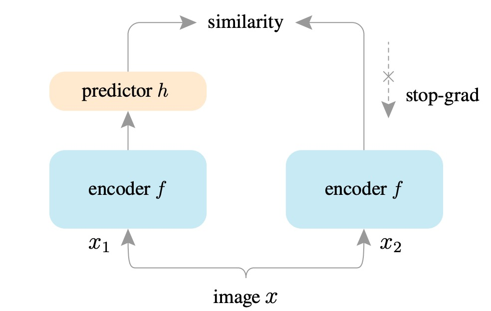
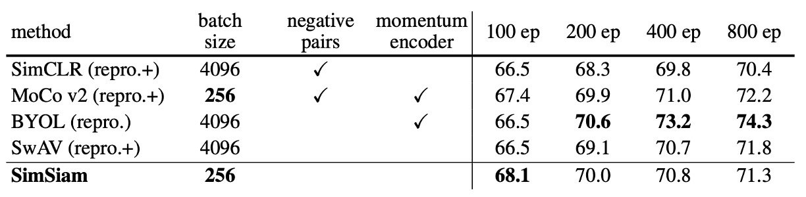
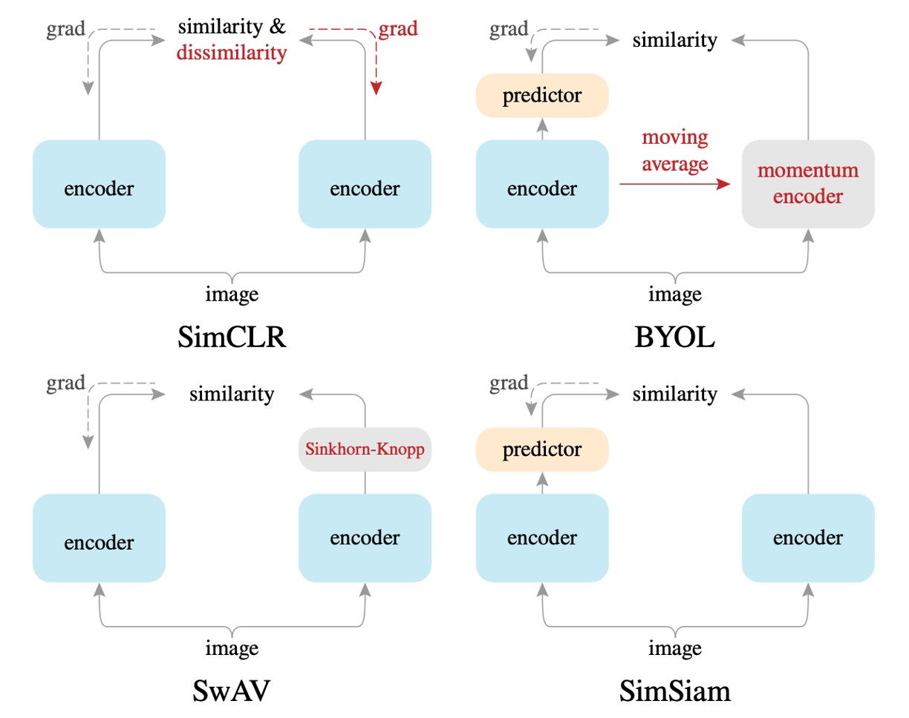

## You Can Not Pass!

[**Exploring Simple Siamese Representation Learning**](https://arxiv.org/abs/2011.10566)

---

私たちはよく「コントラスト学習」と言いますが、実際にはこの分野は「表現学習（Representation Learning）」と呼ばれるべきであり、「コントラスト学習」という方法はその中で広く使用されている手法の一つに過ぎません。

「コントラスト学習」の他にも、「自己予測」や「クラスタリング中心」など、さまざまな学習方法があり、それらは表現学習の性能を次々と更新しています。しかし、この分野にはまだ合意が不足しており、表現学習に影響を与える重要な要素は何なのかが明確ではありません。

この論文は非常に内容が豊富で、じっくりと見ていきましょう。

## 問題の定義

近年のいくつかの手法は、表現学習の問題を解決するために孿生（Siamese）ネットワークのアーキテクチャを採用しています。

しかし、孿生ネットワークは非常に崩れやすく、最終的にすべての出力が定数に収束してしまいます。

この崩壊問題を解決するために、過去の研究ではいくつかの方法が提案されています：

- **コントラスト学習（Contrastive Learning）**：負のサンプルを使って崩壊を防ぐ。
- **クラスタリング（Clustering）**：クラスタリングを通じて間接的に負のサンプルを導入する。
- **モーメンタムエンコーダ（Momentum Encoder）**：モーメンタム更新方式を使って分岐差異を維持し、崩壊を防ぐ。

それでは、これらの戦略（負のサンプル、クラスタリング、モーメンタムエンコーダ）を使わずに、効果的に崩壊を防ぐことができるのでしょうか？

:::tip
本論文は過去の関連研究を多く比較していますので、時間があれば以下もぜひご覧ください：

- [**[20.02] SimCLR v1: 大バッチサイズ**](../2002-simclr-v1/index.md)
- [**[20.03] MoCo v2: 一矢を報いる**](../2003-moco-v2/index.md)
- [**[20.06] BYOL: 負のサンプルは不要**](../2006-byol/index.md)
- [**[20.06] SwAV: クラスタリング予測**](../2006-swav/index.md)
  :::

## 問題の解決

<figure style={{"width": "90%"}}>

</figure>

本論文で提案された方法は **SimSiam** と呼ばれ、これはシンプルな孿生ネットワーク（Simple Siamese）の略です。

その目的は、最もシンプルな孿生ネットワークアーキテクチャを使用して、教師なしの表現学習を行うことです。

まず、入力画像 $ x $ に対してランダムに 2 種類のデータ増強を行い、2 つの異なるビュー：$ x_1, x_2 $ を得ます。

これらの 2 つのビューを、それぞれ共有重みのエンコーダ $f$ に入力します。このエンコーダ $f$ は 2 つのサブネットワークで構成されています：

1. **バックボーンネットワーク（backbone）**：例えば、ResNet-50。
2. **投影ネットワーク（projection MLP）**：多層パーセプトロン（MLP）で、バックボーンの出力を潜在空間にマッピングします。

その後、一方のビューの出力は、もう一方の**予測ネットワーク（prediction MLP）** $h$ を通して、2 つのビューがお互いを予測し合います。

評価方法は負の余弦類似度を使用します：

- $ p_1 = h(f(x_1)) $ を、予測ネットワーク $h$ を通した後の出力ベクトルとします。
- $ z_2 = f(x_2) $ を、エンコーダ $f$ を通した後の別のビューの出力ベクトルとします。

損失関数 $D$ は次のように定義されます：

$$
D(p_1, z_2) = -\frac{p_1}{\|p_1\|_2} \cdot \frac{z_2}{\|z_2\|_2}
$$

- $\|\cdot\|_2$ はベクトルの $L_2$ ノルム（ユークリッド長）を示します。

余弦類似度が大きいほど 2 つのベクトルは似ているため、ここでは負の余弦類似度を最小化すること（つまり、余弦類似度を最大化すること）を目指しています。この式は正規化されたベクトル間の平均二乗誤差（MSE）と等価であり（スケール係数が異なるだけです）。

2 つのビューが対称的に予測できるように、最終的な損失関数 $ L $ は 2 つの方向の余弦類似度の平均として定義されます：

$$
L = \frac{1}{2} D(p_1, z_2) + \frac{1}{2} D(p_2, z_1)
$$

この損失関数の理論的最小値は -1 であり、つまり 2 つのベクトルが完全に一致していることを意味します。

ここまでの部分は、以前の研究と大きな違いはありませんが、次が本論文の核心的な概念です。

### 停止勾配

モデルのトレーニング中の崩壊を防ぐために、著者は重要なテクニックを提案しています：

- **停止勾配操作！**

実装では、この式は次のように書き換えられます：

$$
D(p_1, \text{stopgrad}(z_2))
$$

$\text{stopgrad}(z_2)$ は、式の中でベクトル $ z_2 $ が定数として扱われ、エンコーダ $ f $ に勾配が伝播されないことを意味します。

反対方向も同様の方法で処理され、最終的に損失関数は次のように書かれます：

$$
L = \frac{1}{2} D(p_1, \text{stopgrad}(z_2)) + \frac{1}{2} D(p_2, \text{stopgrad}(z_1))
$$

この方法により、各分岐のエンコーダは予測ベクトル（$p_1$ や $p_2$）からの勾配のみを受け取り、自己ベクトルの影響を受けないため、モデルの崩壊問題を避けることができます。

実装の詳細は論文に記載されていますので、参考にしてください：

<figure style={{"width": "70%"}}>

</figure>

## 討論

なぜ？なぜこのシンプルな方法でモデルは収束するのでしょうか？

まずは結果を簡単に見てみましょう。その後、著者は広範な導出と証明を提供しています。

### 他の方法との比較

<figure style={{"width": "90%"}}>

</figure>

著者は SimSiam を他の主要な教師なし表現学習方法（SimCLR、MoCo v2、SwAV、BYOL）と比較しています。比較条件は以下の通りです：

- 標準の ResNet-50 アーキテクチャを使用。
- すべての方法は ImageNet で事前学習し、画像サイズは $224\times224$ 、各方法は 2 つの異なるビューを使用。
- 線形分類を使用して表現学習の品質を評価。

著者は特に強調しており、公平な比較のために：

- すべての結果は著者自身が**再現**した結果です。
- SimCLR、SwAV、MoCo v2 は著者によって適度に改善されており（例えば、投影 MLP の層数を増やす、対称的な損失関数を採用）、その結果は元の論文よりも良好であり、これらの改善点は「+」として示されています。

実験結果から、SimSiam は負のサンプル（negative samples）やモーメンタムエンコーダを使用しなくても、全体的に非常に競争力のある性能を示しています。特に短期間のトレーニング（例えば 100 エポック）では、**SimSiam はすべての方法で最良のパフォーマンスを発揮**（精度は 67.7%に達し、SimCLR、MoCo v2、SwAV などを超えました）。訓練エポックが増える（例えば 200、400 エポック）と、SimSiam の性能の向上幅は小さくなりますが、依然として非常に競争力のある水準を維持しています。

SimSiam は非常にシンプルでありながら、中短期のトレーニング効率が非常に優れています。

### 基盤となるアーキテクチャ設計の探討

<figure style={{"width": "70%"}}>

</figure>

さまざまなアーキテクチャをさらに詳細に比較するために、著者は複数のモデルアーキテクチャを示しています：

- **SimCLR 法との比較**

  SimSiam は、すべての実験条件下で SimCLR よりも明らかに優れた結果を示しました。

  本論文では、**SimSiam は「負のサンプルなしの SimCLR」と見なすことができる**という結果が示されています。この結果は、SimSiam が有効であることを確認するもので、コントラスト学習（負のサンプル）を使用せずとも、モデルの崩壊を効果的に防ぎ、より良い性能を達成できることを示しています。

  したがって、負のサンプルは必ずしも表現学習で良好な結果を得るために必要な設計ではありません。

- **BYOL 法との比較**

  BYOL はモーメンタムエンコーダ（MoCo シリーズから継承）を使用しますが、SimSiam はこれを使用しません。

  実験では、BYOL は長期トレーニング（例えば 200 エポック以上）で SimSiam よりわずかに優れたパフォーマンスを示しましたが、SimSiam はモーメンタムエンコーダなしでも近い性能を発揮しており、特に短期間のエポックではその効果が顕著です。

  本論文では、**SimSiam は「モーメンタムエンコーダなしの BYOL」と見なすことができる**ということが示されています。これは、モーメンタムエンコーダがモデルの崩壊を防ぐために必須ではないことを意味しています。

  したがって、モーメンタムエンコーダは性能を向上させることができますが、モデルの崩壊を防ぐためには必ずしも必要な設計ではありません。

- **SwAV 法との比較**

  SwAV は本質的にオンラインクラスタリング（online clustering）と Sinkhorn-Knopp（SK）変換を使用します。

  本論文では、**SimSiam は「オンラインクラスタリングなしの SwAV」と見なすことができる**とされています。SwAV はこれらの追加のコンポーネントを組み込んでいますが、長期トレーニング（200 エポック）ではその効果がやや優れているものの、短期トレーニング（100 エポック）では SimSiam と比較して明確な優位性は見られませんでした。

  したがって、SwAV のオンラインクラスタリングは一定の効果があるものの、短期間で崩壊を防ぐために必須ではない要素であると言えます。

### 消融実験

- **Stop-gradient の必要性**

  

  完全に同じモデルアーキテクチャとハイパーパラメータ設定の下で、1 つのグループは stop-gradient を使用し、もう 1 つのグループは完全に stop-gradient を削除しました。

  実験結果は、stop-gradient を使用しない場合、モデルはすぐに崩壊し、トレーニング損失は理論的最小値 -1 に達し、出力ベクトルの標準偏差がほぼゼロに近く、モデルが定数ベクトルに収束していることを示しています。

  stop-gradient を追加した後、特徴量分布は正常で、標準偏差は $\sqrt{\frac{1}{d}}$ に近く、ベクトルが単位超球面上に均等に分布し、崩壊を効果的に避けられることが確認されました。

  したがって、単純なネットワークアーキテクチャ設計（predictor、BN、$L_2$ 正規化）だけでは崩壊を避けることができず、stop-gradient は必須の重要な設計要素であることが示されました。

- **Predictor ($h$) の役割分析**

   

   <figure style={{"width": "70%"}}>
   
   </figure>
   

  著者はさらに、predictor ネットワーク $h$ がモデル内で果たす役割を分析しました。

  実験では、predictor $h$ を削除した場合（つまり $h$ を恒等写像に設定）に、モデルはすぐに崩壊しました。これは、対称損失関数が恒等写像と組み合わせると、stop-gradient の効果が失われるためです。

  もし predictor $h$ をランダムに初期化して更新しない場合、モデルは崩壊しませんが収束せず、損失は非常に高くなります。これは、predictor $h$ がモデルの特徴学習に合わせて更新される必要があることを示しています。

  したがって、predictor ネットワーク $h$ は SimSiam の重要な要素であり、エンコーダとともにトレーニングされなければならないことが確認されました。

- **Batch Size の影響分析**

  

  著者は異なるバッチサイズ（64 から 4096）の下でのモデルのパフォーマンスを調べました。すべての実験では線形学習率の調整を使用し、SGD（LARS オプティマイザーは使用しない）を統一して使用しました。

  実験結果は、SimSiam はバッチサイズに対して感度が低く、SimCLR や SwAV が大きなバッチを要求するのとは異なることを示しています。

- **Batch Normalization の影響分析**

    

   <figure style={{"width": "80%"}}>
   
   </figure>
   

  著者は BN がモデルに与える影響をテストしました。

  実験結果は次の通りです：

  - (a) MLP の BN を完全に削除：崩壊はしないが、パフォーマンスは非常に悪い（34.6%）、最適化が困難。
  - (b) 隠れ層にのみ BN を追加：パフォーマンスが大幅に改善し、67.4% に達する。
  - (c) projection MLP 出力層に BN を追加：さらに改善し、68.1%（最適設定）。
  - (d) prediction MLP 出力層に BN を追加：トレーニングが不安定で振動する。

  したがって、BN はモデルのトレーニングの安定性と収束に役立ちますが、崩壊を防ぐ直接的な関連はありません。

- **類似度関数の置き換え分析**

  著者はコサイン類似度をクロスエントロピー類似度に置き換えて、モデルの安定性を検証しました。

  実験結果：

  - コサイン類似度：68.1%
  - クロスエントロピー類似度：63.2%
  - 両者は崩壊を防ぐことができますが、コサイン類似度の方が優れたパフォーマンスを示しました。

  結論として、特定の類似度関数とモデルの崩壊には直接的な関連はなく、モデル設計自体がより重要であることが示されました。

- **損失関数の対称性分析**

  著者は損失関数が対称である必要があるかどうかを探りました。

  実験結果：

  - 対称バージョン (sym)：68.1%
  - 非対称バージョン (asym)：64.8%
  - 非対称バージョンの倍のサンプリング (asym 2×)：67.3%

  結論として、対称損失関数はモデルのパフォーマンスに正の影響を与えますが、モデルの崩壊を防ぐために必須の条件ではないことが示されました。

## 最大期待仮説

:::tip
数学警告！以下の内容は最適化および数学的導出に関わります。
:::

著者は実験を通じて、SimSiam のコア設計である「stop-gradient」が、モデルの崩壊を効果的に防ぎ、優れた表現学習の成果をもたらすことを発見しました。しかし、この単純な操作がなぜこれほど効果的なのか？背後にはどんな原理が隠れているのでしょうか？

このメカニズムを説明するために、著者は重要な仮説を提案しました：

> **SimSiam は実際には「期待最大化（Expectation-Maximization, EM）」の最適化問題を暗黙のうちに解決している。**

### 数学的表現

著者は、SimSiam が次の最適化問題を解くことと数学的に等価であると考えています。損失関数を次のように定義します：

$$
L(\theta, \eta) = \mathbb{E}_{x, T}\left[\|F_{\theta}(T(x)) - \eta_x\|^2_2\right]
$$

ここで：

- $F_{\theta}$：パラメータ $\theta$ によって決定されるエンコーダネットワーク。
- $T(x)$：画像 $x$ がランダムデータ拡張を受けた結果。
- $\eta$：追加で導入された最適化変数で、各画像 $x$ には対応する表現ベクトル $\eta_x$ が存在。
- $\eta_x$：直感的に画像 $x$ の「特徴表現」と理解できますが、神経ネットワークから直接出力されるのではなく、最適化によって求められる変数です。

したがって、SimSiam が暗黙的に解決している最適化問題は次のようになります：

$$
\min_{\theta,\eta} L(\theta,\eta)
$$

この最適化問題は、古典的な「K-means クラスタリング」に似た形式です：

- $\theta$：学習された画像の共通特徴を通じてクラスタ中心に相当。
- $\eta_x$：各サンプルのクラスタへの割り当て結果。

この問題は「交互最適化」の方法で解くことができます：

1. **$\eta$ を固定して $\theta$ を最適化する**：

$$
\theta^t \leftarrow \arg\min_{\theta}L(\theta,\eta^{t-1})
$$

このステップでは、$\eta^{t-1}$ は固定された定数であるため、勾配は $\eta^{t-1}$ に伝播しません。これにより、自然に stop-gradient 操作が引き出されます。

---

2. **$\theta$ を固定して $\eta$ を最適化する**：

$$
\eta^t \leftarrow \arg\min_{\eta}L(\theta^t,\eta)
$$

このステップは、各画像 $x$ に対して独立して行われ、最適解は各画像の表現 $\eta_x$ がその画像がすべての画像拡張後に得られる平均特徴に等しくなることです：

$$
\eta_x^t \leftarrow \mathbb{E}_T\left[F_{\theta^t}(T(x))\right]
$$

### SimSiam の EM 近似

SimSiam は実際には、上記の EM アルゴリズムの交互最適化を近似的に実行しています。ただし、単純ですが重要な近似が行われています：

- 平均を取るべき期待値を、単一の画像拡張 $T'$ を使用することで近似します：

$$
\eta_x^t \leftarrow F_{\theta^t}(T'(x))
$$

- この近似された表現 $\eta_x^t$ を元の $\theta$ の最適化問題に戻すと、SimSiam が実際に使用する損失関数が得られます：

$$
\theta^{t+1}\leftarrow\arg\min_{\theta}\mathbb{E}_{x,T}\left[\|F_\theta(T(x))-F_{\theta^t}(T'(x))\|^2_2\right]
$$

この形式は、孿生ネットワーク（Siamese networks）の構造にぴったりと一致し、自然に stop-gradient 操作を導入します。

### Predictor の真の役割

前述の EM 仮説では predictor $h$ の存在の必要性を説明していません。したがって、著者は次のように推測します：

- Predictor ネットワーク $h$ の機能は、実際にはもう一つの画像拡張の期待値を近似することです：

$$
h(z_1) \approx \mathbb{E}_T[F_\theta(T(x))]
$$

実際にはすべての画像拡張の期待値を計算することはできないため、predictor ネットワーク $h$ をトレーニングしてこの期待値を学習し、近似します。したがって、predictor は期待値計算の不足を補う近似ツールとして機能します。

### 対称損失関数の効果

著者はまた、上記の EM 仮説が対称損失関数（symmetrized loss）を必ずしも必要としないことを指摘しています。対称化の効果は、各最適化時に追加の画像拡張ペア $(T_1, T_2)$ を取ることのようなもので、期待値をより正確に近似するのに役立ち、モデルの精度を向上させますが、崩壊を防ぐために必要な条件ではないということです。

### 仮説検証実験

著者は、上記の EM 仮説を支持するために、2 つの概念検証実験を実施しました：

1.  **多段交互更新（Multi-step alternation）**

        実験では、交互最適化のステップ数を増加させる（例えば、10 ステップ、100 ステップ）ことで、良い結果が得られ、元の SimSiam よりも優れた結果が得られることが示されました：

        - 1-step (SimSiam): 68.1%
        - 10-step: 68.7%
        - 100-step: 68.9%
        - 1-epoch: 67.0%

        これは、EM 交互最適化の有効性を支持しています。

2.  **画像拡張期待値の近似検証**

        移動平均を使って期待値を近似した場合、predictor ネットワーク $h$ を削除しても一定の効果（55.0%）を得ることができました。移動平均を使わず、predictor を削除すると完全に崩壊しました（0.1%）。

        これにより、predictor の存在が期待値計算の不足を補うために重要であることが証明されました。

---

著者は上記の合理的な EM 仮説を提案しましたが、モデル崩壊がどのようにして避けられるのかを完全には説明していません。著者は、交互最適化の初期化と経路が関係している可能性があると推測していますが、それは直感的なレベルにとどまっており、今後の理論的研究においてさらに深く探求する必要があります。

## 結論

著者は本論文で、「極簡設計の孿生ネットワーク（Siamese networks）」を深く探求しました。SimSiam のアーキテクチャは非常にシンプル（負のサンプルなし、クラスタリングなし、モーメンタムエンコーダなし）でありながら、各種実験において非常に競争力のある性能を示しました。

これは、最近の主要な自己監視型手法（SimCLR、MoCo、SwAV、BYOL）の成功が、さまざまな追加の複雑な設計によるものではなく、基本的には「共有された孿生ネットワークアーキテクチャ自体」に起因している可能性が高いことを示唆しています！

極簡な孿生ネットワークアーキテクチャは、近年の表現学習の成功の真の核心原因である可能性があり、さらなる深い探索と研究が求められます。
