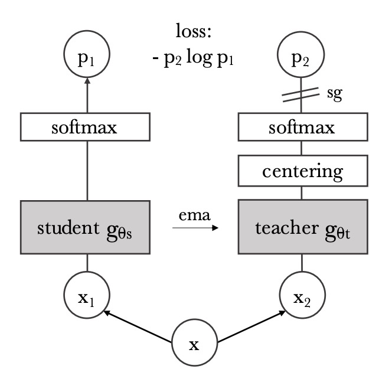

## ラベルなしでの自己蒸留

[**Emerging Properties in Self-Supervised Vision Transformers**](https://arxiv.org/abs/2104.14294)

---

この論文は、MoCo v3 と同時期に発表された論文ですが、効果ははるかに優れています。

論文のタイトルの略称は「self-**di**stillation with **no** labels」から来ており、DINO（ディーノ）ですが、発音は恐竜の英語の発音に従って「DI-NO」と読みます。つまり「Dee-No」ではなく、「ディーノ」です。

:::tip
このように判断する理由は、彼らの GitHub には恐竜のイラストが多く載っているからです...

- [**https://github.com/facebookresearch/dino**](https://github.com/facebookresearch/dino)
  :::

## 問題の定義

BYOL を覚えていますか？

覚えていなくても大丈夫です。簡単に紹介すると、BYOL のアーキテクチャは以下のようになります：

<figure style={{"width": "80%"}}>

</figure>

BYOL は、表現学習の訓練過程で、負のサンプルが「必須ではない」という概念を提案した有名な論文です。

その核心的な要素は 3 つです：

1. **双子ネットワーク**：オンラインネットワークとターゲットネットワーク、ターゲットネットワークは指数移動平均（exponential moving average, EMA）を用いてパラメータ更新を行います。
2. **勾配の停止**：ターゲットネットワークは訓練中に勾配を返しません。
3. **追加の MLP 層**：オンラインネットワークとターゲットネットワークのアーキテクチャの違いは、オンラインネットワークに 1 層の追加の MLP 予測があることだけです。

:::tip
もし BYOL の詳細に興味があれば、以前読んだ論文を参照できます：

- [**[20.06] BYOL: 負のサンプルは不要**](../2006-byol/index.md)
  :::

この論文では、作者は BYOL に触発され、このアーキテクチャを少し修正することに決めました。

変更点は 2 つだけです：

1. **損失関数の変更**：BYOL では MSE が使用されていましたが、ここでは類似性マッチング損失を使用します。
2. **追加の MLP 層の削除**：つまり、ここでの双子ネットワークのアーキテクチャは全く同じニューラルネットワークです。

一見すると大した変更はないように見えますが、この形式は無根拠ではなく、作者は以下の論文を参考にしています：

- [**[17.03] Mean teachers are better role models**](https://arxiv.org/abs/1703.01780)

この論文では、Teacher-Student のネットワーク構造において、教師ネットワークが移動平均を使用することで、固定されたネットワークパラメータを使用するよりも効果的であることが証明されています。

:::info
知識蒸留とは、学生ネットワークが教師ネットワークの出力を模倣するように学習させる訓練方法です。
:::

## 問題の解決

<figure style={{"width": "50%"}}>

</figure>

先ほどの BYOL アーキテクチャを修正したものが上の図です。

入力画像$x$が与えられたとき、2 つのネットワークはそれぞれ$K$次元の特徴ベクトルを出力し、softmax 関数を通じて確率分布に変換します。学生ネットワーク（図左）の第$i$次元の確率$P_s(x)(i)$は次のように定義されます：

$$
P_s(x)^{(i)} = \frac{\exp\left(\frac{g_{\theta_s}(x)^{(i)}}{\tau_s}\right)}{\sum_{k=1}^{K} \exp\left(\frac{g_{\theta_s}(x)^{(k)}}{\tau_s}\right)}
$$

ここで、$\tau_s > 0$は温度パラメータで、出力分布の鋭さを制御します。同様に、教師ネットワーク（図右）$g_{\theta_t}$の確率分布$P_t$も類似の式で定義され、温度は$\tau_t$です。

教師ネットワーク$g_{\theta_t}$を固定した状態で、学生ネットワークの出力分布$P_s(x)$が教師ネットワークの出力分布$P_t(x)$とできるだけ一致するようにしたいと考え、これを交差エントロピー損失を最小化することで実現します。式は次の通りです：

$$
\min_{\theta_s} H(P_t(x), P_s(x))
$$

ここで、交差エントロピー$H(a, b) = -\sum a \log b$は 2 つの分布の違いを測るために使われます。

自己教師あり学習はラベルを使用しないため、ここでもよく使われる対比学習の方法が採用されます。すなわち、同じ画像に対して異なる画像強調を適用して、異なる「視点」を生成します。

このアーキテクチャでは、**すべての視点は学生ネットワークに入力され、グローバル視点のみが教師ネットワークに入力されます**。このような設計により「局所から全体への」対応関係が奨励されます。

各グローバル視点$x \in \{x^g_1, x^g_2\}$について、学生ネットワークが処理する他の視点$x'$（$x' \neq x$）とともに交差エントロピー損失を計算し、総損失を最小化します：

$$
\min_{\theta_s} \sum_{x \in \{x^g_1, x^g_2\}} \sum_{\substack{x' \in V \\ x' \neq x}} H(P_t(x), P_s(x'))
$$

この損失関数は視点数に依存せず、2 つの視点だけでも使用できます。本論文の標準設定では、2 つのグローバル視点と複数のローカル視点が基本のパラメータ設定として使用されます。

学生ネットワークのパラメータ$\theta_s$は、確率的勾配降下法（SGD）を通じて、上記の損失関数を最小化するように最適化されます。

教師ネットワークのパラメータ$\theta_t$は、学生ネットワークのパラメータ$\theta_s$の EMA（指数移動平均）を使用して更新されます。更新のルールは次の通りです：

$$
\theta_t \leftarrow \lambda \theta_t + (1 - \lambda) \theta_s
$$

この更新方法はモーメンタムエンコーダー（momentum encoder）に似ており、係数$\lambda$は訓練過程でコサインスケジュールに従って 0.996 から 1 へと変化します。

### モデルの崩壊を防ぐ

このような双子ネットワークを用いた自己監督学習の問題は、モデルが突然崩壊してしまうことです。以前の研究では、コントラスト損失やクラスタリングなどの方法を使用して、モデルが定数解に収束するのを防いでいました。しかし、ここでは著者はセンタリングとシャープニングという戦略を採用しています。

- **センタリング（Centering）：**

  センタリング操作は、教師ネットワークの出力にバイアス項$c$を加えることで行われます。式は次のようになります：

  $$
  g_t(x) \leftarrow g_t(x) + c
  $$

  これにより、特定の次元が出力を支配するのを防ぎますが、同時に出力が均等な分布に近づくことを促進します。さらに、センタリング操作が異なるバッチサイズで安定して機能するように、センター$c$は指数移動平均を用いて更新されます：

  $$
  c \leftarrow m c + (1 - m) \frac{1}{B} \sum_{i=1}^{B} g_{\theta_t}(x_i)
  $$

  ここで、$m > 0$は学習率パラメータ、$B$はバッチサイズです。このように更新されたセンター$c$は、バッチの 1 次統計量のみに依存します。

- **シャープニング（Sharpening）：**

  シャープニング操作は、教師の softmax 正規化に低い温度$\tau_t$を使用することで実現され、教師の出力確率分布を鋭くします。これによりセンタリングによる均等傾向とバランスが取れ、モデルの崩壊を防ぎます。

## 討論

### 他の方法との比較

<figure style={{"width": "60%"}}>

</figure>

実験結果に基づき、著者は「同一アーキテクチャ内での比較」と「アーキテクチャ間比較」に分けて結果を示しています：

1. **同一アーキテクチャ内での比較：**

   - **ResNet-50 アーキテクチャ：**
     DINO は ResNet-50 で現行の最良の自己監督学習手法と同等の性能を示し、DINO が標準設定で現行手法と同等のパフォーマンスを達成できることを確認しました。
   - **ViT-S アーキテクチャ：**
     ViT-S（DeiT-S を参考にした設計）を使用した場合、DINO は BYOL、MoCov2、SwAV を明らかに上回る性能を示しました。
     - 線形分類タスクで 3.5%の向上
     - k-NN 評価で 7.9%の向上
       さらに、単純な k-NN 分類器で得られたスコア（74.5%）は線形分類器（77.0%）との差がほとんどなく、この現象は ViT アーキテクチャでのみ見られ、他の自己監督手法や ResNet-50 では確認されませんでした。

2. **アーキテクチャ間の比較：**

   この部分では、DINO で訓練された ViT モデルが異なるスケールのアーキテクチャでどれだけ限界性能を発揮できるかを探っています。

   実験結果から、ViT モデルのスケールを拡大することで性能が向上することがわかりましたが、patch サイズを小さくする（「/8」バリエーション）影響がより顕著であることが示されました。また、patch サイズを小さくすることでパラメータ数は増えませんが、実行時間が大幅に短縮され（1.4 倍向上）、性能も顕著に向上しますが、同時にメモリ使用量は増加します。

   基本的な ViT モデルは、8×8 の patch を使用し DINO で訓練した後、線形分類の top-1 精度が 80.1%、k-NN 分類精度が 77.4%に達し、パラメータ数は前の最良手法の 10 分の 1 しかありません。

総じて、DINO は標準的な ResNet-50 アーキテクチャで優れた性能を発揮するだけでなく、ViT アーキテクチャでも顕著な性能向上を示し、特に patch サイズを小さくすることで効果的に性能を向上させ、運用効率も大幅に改善されました。

:::tip
論文の原文を初めて読んだ時、少し混乱しました。

表のデータを見ると、im/s の数値が大きいほどモデルの推論速度が速いことを意味します。例えば、標準的な ViT-S モデル（patch サイズが大きい）は 1007 im/s ですが、ViT-S/8（patch サイズが 8×8）のスループットは 180 im/s に減少しています。これは同一のアーキテクチャ内で、patch サイズを小さくすると計算負荷が増え、推論速度が遅くなることを意味します。

論文中の次の記述：

> "While reducing the patch size do not add parameters, it still leads to a significant reduction of running time, and larger memory usage."

この説明は、「patch サイズを小さくすることで推論が著しく加速される」と誤解されがちです。しかし実際には、patch サイズを小さくすると、パラメータ数は増えませんが、入力シーケンスが長くなり、im/s（すなわち実行速度）が低下しますが、同時にメモリ使用量は増加します。

著者はおそらく、モデルパラメータを増やさずに patch サイズを小さくすることで性能（top-1 精度など）が顕著に向上し、大規模なモデルと比較しても運用効率（以前の SOTA 手法と比較して）で優れている点を強調したかったのでしょう。

もし私たちの理解が間違っている場合、読者の指摘を歓迎します。
:::

### 異なるコンポーネントの重要性

<figure style={{"width": "60%"}}>

</figure>

著者は、さまざまなコンポーネントの重要性を調べるために一連の実験を行いました：

- **モーメンタム（Momentum）を使用しない場合（表 2 行目）：**
  モーメンタムエンコーダを使用しない場合、フレームワークは収束せず、モデルは有用な表現を学習することができません。
- **崩壊を防ぐ操作（例えば SK）：**
  モデルの崩壊を防ぐためには、いくつかの高度な操作（例えば SK）が必要です。しかし、実験結果は、モーメンタムを追加した場合、SK を追加する効果が顕著でないことを示しており（表 3 行目と 9 行目の比較）、モーメンタムエンコーダが崩壊防止と性能向上において重要な役割を果たすことが浮き彫りになっています。
- **複数の視点（multi-crop）と交差エントロピー損失：**
  実験（表 4 行目と 5 行目）は、複数の視点を用いた訓練と DINO が使用する交差エントロピー損失が良い特徴を得るために重要であることを示しています。
- **予測器（Predictor）の影響：**
  学生ネットワークに予測器を追加することは性能に対する影響が限られており、BYOL では崩壊を防ぐための重要なコンポーネントでした。

### モデルの崩壊テスト

<figure style={{"width": "80%"}}>

</figure>

一般的に、モデルの崩壊には 2 種類の形式があります：

- 1 つ目は、モデルが異なる入力に対して同じ出力を返すようになり、均一分布に収束することです。
- 2 つ目は、特定の次元が過度に支配することによって、出力が不均衡になることです。

センタリング（Centering）の操作は、教師ネットワークの出力にバイアス項$c$を加えること（つまり$g_t(x) \leftarrow g_t(x) + c$）で、特定の次元が支配的になるのを防ぎますが、同時に出力を均一に近づける可能性もあります。そのため、シャープニング（Sharpening）操作を組み合わせることで、教師の softmax 正規化において低い温度$\tau_t$を使用し、出力分布を鋭くし、センタリングによる均一化傾向に対抗します。

数学的には、交差エントロピー$H(P_t, P_s)$を教師の出力エントロピー$h(P_t)$と KL ダイバージェンス$D_{KL}(P_t \| P_s)$に分解できます：

$$
H(P_t, P_s) = h(P_t) + D_{KL}(P_t \| P_s)
$$

$D_{KL}$が 0 に収束すると、教師の出力が入力に依存しなくなる（すなわち崩壊する）ことを意味します。

上の実験結果は、もし 1 つの操作だけを使用すると、KL が 0 に収束し、エントロピー$h(P_t)$が異なる極限値に達することを示しています（センタリングなしでは 0 に、シャープニングなしでは$-\log(1/K)$に収束）。これは、両者が崩壊を防ぐために補完的であることを強調しています。これら 2 つの操作を組み合わせることでバランスが取れ、モデルの崩壊を防ぐことができます。

## 結論

<figure style={{"width": "80%"}}>

</figure>

多くの実験を通じて、著者は ViT アーキテクチャにおいて自己監督学習を使用して訓練することで、下流タスクで優れた性能を示し、視覚タスク専用に設計された畳み込みニューラルネットワーク（CNN）と競り合うことができることを発見しました。

この結果は、自己監督学習が ViT の汎化能力を効果的に向上させ、さまざまなシナリオで安定したパフォーマンスを達成できることを示唆しています。対照的に、従来の監督学習で訓練された ViT は、下流タスクでのパフォーマンスが一般的に悪く、CNN と同等の水準に達することが難しいことがわかりました。

上の図は、ViT が画像分割タスクにおいて示した可視化結果であり、赤い点はモデルのマルチヘッドアテンション（Multi-Head Attention）が注目した位置を示しています。自己監督学習で訓練された ViT は、アテンション分布がより合理的で、強力な意味的アライメント能力を持っており、画像内の重要な領域により正確に注目していることが明確に観察できます。これにより、下流タスクのパフォーマンスが向上します。

この発見は、自己監督学習が ViT アーキテクチャにとって最適な解法である可能性が高いことを強く示唆しています。それは Transformer の潜在能力を十分に引き出し、大量のラベル付きデータへの依存から解放し、視覚領域で新たな可能性を切り開くことができると考えられます。
