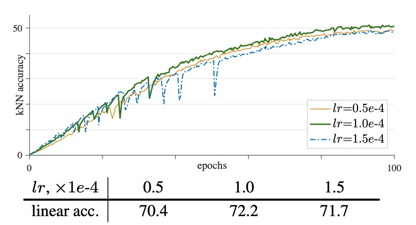

## ViT 探索隊

[**An Empirical Study of Training Self-Supervised Vision Transformers**](https://arxiv.org/abs/2104.02057)

---

表現学習の波は 5 年間続き、大体収束したと言えるでしょう。

その時、コンピュータビジョンの分野で再び大きな更新がありました：ViT が発表されたのです。（2020 年 10 月）

MoCo の研究チームは、喜びを抑えきれず、この新しいアーキテクチャに対して早速大規模な探索を始めました。

## 問題の定義

ViT アーキテクチャが発表された後、原論文の著者は、このアーキテクチャで BERT のような MASK 機構を使って事前学習を行った場合、効果は思わしくなかったと述べています。

画像の特徴は散漫であり、単純に MASK を導入してモデルに再構築させるだけでは期待した結果を得ることはできませんでした。むしろ、監督付きの学習方法を用い、超大規模なデータセットでモデルを事前学習させることによって、他の CNN アーキテクチャを超えて、SoTA の性能を達成できました。

ViT 論文のこの結論は、多くの研究者が次々と挑戦し始めるきっかけとなりました：

> **無監督学習は本当にうまくいかないのか？それとも単にあなたのアプローチが間違っていたのか？**

そのため、MoCo 論文の著者たちも ViT アーキテクチャへの探索を決定し、もしここに双子ネットワーク構造を導入し、表現学習を使ってモデルを事前学習させると、良い結果が得られる可能性があるか試してみることにしました。

## 解決方法

この論文では新しい方法やアーキテクチャは導入されていません。

単純に MoCo のアーキテクチャを ViT に適用して実験を行っただけです。

具体的なプロセスは論文に記載されているアルゴリズムのアーキテクチャ説明を見れば理解できます。この部分を見れば論文全体を理解したことになります：

<figure style={{"width": "70%"}}>

</figure>

上図に沿って見ていきましょう：

1. 最初に 2 つのエンコーダを準備します：

   - 最初のエンコーダの構造は：バックボーン + proj mlp + pred mlp
   - 2 番目のエンコーダの構造は：バックボーン + proj mlp （モメンタム更新）

2. データから 1 つのバッチ $x$（合計 $N$ 枚の画像）を取り出し、それぞれの画像にデータ拡張を適用して $x_1, x_2$ を生成します。
3. $f_q$ を使用して $x_1, x_2$ に対してクエリベクトル $q_1, q_2$ を得る；$f_k$ を使用してキーべクトル $k_1, k_2$ を得る。
4. 関数 $ctr(q, k)$ を呼び出してコントラスト損失を計算します：
   - 正例のインデックスは対角線上にあります（`labels = range(N)` を使用）；
   - ロジットを $\tau$ で割り、クロスエントロピー損失関数を用いて損失を計算；
   - 最後に損失に $2\tau$ を掛けて出力します。
   - 最終的な総損失は $ctr(q_1, k_2) + ctr(q_2, k_1)$ となります。

ここで言う損失関数は以前に触れた InfoNCE で、その式は次の通りです：

$$
L_q = -\log \frac{\exp\left(\frac{q\cdot k^+}{\tau}\right)}{\exp\left(\frac{q\cdot k^+}{\tau}\right)+\sum_{k^-}\exp\left(\frac{q\cdot k^-}{\tau}\right)}.
$$

ここで：

- $q$ はクエリベクトル；
- $k^+$ は正例ベクトル、つまり $q$ と同じ画像から別のエンコーダ $f_k$ で得られた出力；
- $\{k^-\}$ は負例の集合で、同じバッチ内の他の画像から得られたキーべクトル；
- $\tau$ は温度パラメータで、分布の平滑化の程度を調整します。

この損失の目的は、$q$ と $k^+$ を近づけ、$q$ とすべての $k^-$ を遠ざけることです。

バックプロパゲーション後、オプティマイザを用いて $f_q$ を更新し、その後モメンタム更新を使用して $f_k$ を更新し、キーエンコーダを安定させます。

---

ここまでで、新しい方法は確かにありません。

したがって、この記事の主なポイントは実験部分にあります。細かく見ていきましょう。

## 討論

この論文では、著者が kNN 曲線を監視してトレーニングの進行状況を観察しています。

kNN 曲線とは、モデルが学習した特徴表現の質をリアルタイムで監視するための評価ツールです。具体的な手順は以下の通りです：

1. **特徴抽出：**
   トレーニング中、モデルは入力画像から特徴を抽出します。これらの特徴は、追加の調整なしでモデルの現在の表現能力を反映します。

2. **kNN 分類：**
   評価する各サンプルについて、k 最近傍法を用いて分類します。すなわち、ある距離測定（例えばユークリッド距離やコサイン類似度）を基に、あらかじめ保存された特徴データベースから最も近い k 個の隣接サンプルを見つけ、それらのラベルを元に多数決で予測ラベルを決定します。

3. **曲線生成：**
   検証セットで行った kNN 分類の精度を記録し、トレーニングが進むにつれてこの精度がどのように変化するかを観察します。この精度の変化が一つの曲線を形成します。これにより、モデルの特徴表現の質を異なるトレーニング段階で評価することができます。

4. **訓練の安定性の把握：**
   kNN 曲線を観察することで、表面上は損失関数が低下し、最終的な精度も良さそうに見える場合でも、モデルの特徴表現の質（例えば kNN 分類の精度）が「ダイブ」したり、波打ったりすることが分かります。このような波動は、トレーニング過程における不安定性を示唆しています。この不安定性はモデルの発散を引き起こすわけではありませんが、最終的な性能の潜在的な低下を引き起こす可能性があります。

まとめると、kNN 曲線は k 最近傍分類法に基づく評価手法であり、モデルがトレーニング中に学習した特徴表現の安定性と質を追跡し、潜在的なトレーニングの不安定性を明らかにするためのツールです。

### ViT の不安定性

理論的には、ViT を ResNet のバックボーンとして孿生ネットワークの自己教師あり学習フレームワークに置き換えるのは難しくありません。しかし実際には、ViT のトレーニングは明らかな不安定性の問題に直面します。この不安定性は、最終的な精度からは明確には分かりません。なぜなら、トレーニング結果が「表面的に正常」に見えても、その過程では局所的な失敗や「部分的成功」が隠れている可能性があるからです。

- **バッチサイズの影響**

    

    <figure style={{"width": "70%"}}>
    
    </figure>
    

  ViT モデル自体は計算量が大きいため、大きなバッチサイズでのトレーニングはより多くの負のサンプルを提供し、対比学習に有利です。しかし、バッチサイズが大きすぎると（例えば 4k や 6k）、トレーニング曲線に明らかな「波動」や「落ち込み」が現れることがあります。

  上の図から分かるように：

  - バッチ 1k：線形探査精度は約 71.5%、曲線は平滑。
  - バッチ 2k：精度は約 72.6%に上昇し、安定したまま。
  - バッチ 4k：曲線に「ディップ」が現れ、精度は 72.2%に若干低下。
  - バッチ 6k：波動がさらに明確になり、急激な下降があり、精度は 69.7%に低下。

  大きなバッチサイズは確かに多くの負サンプルを提供し、理論的には学習に有利ですが、あまりにも大きすぎるバッチは、モデルがトレーニング中に「部分的な再起動」を引き起こす可能性があります。つまり、モデルが現在の局所的な最適解から脱却して新しい解を探し始め、これが隠れた性能劣化を引き起こすのです。この劣化はすぐには極端な発散として現れることはありませんが、精度の微細な（1 ～ 3%）低下を引き起こし、実験の再現性や対比分析に影響を与えます。

- **学習率の影響**

    

    <figure style={{"width": "70%"}}>
    
    </figure>
    

  大きなバッチサイズでのトレーニングには、通常、線形学習率調整ルールが使用され、その式は以下のようになります：

      $$
      \text{Effective LR} = \text{base lr} \times \frac{\text{BatchSize}}{256}.
      $$

  実験結果からは以下のことが分かりました：

  - 小さな学習率を使用した場合（例えば lr = 0.5e-4）、トレーニングは安定しますが、過学習の兆候が現れ、精度が低く（70.4%）なります。
  - 中程度の学習率（例えば lr = 1.0e-4）で、モデルは最適なフィッティングを達成し、精度は 72.2%に達します。
  - 学習率がさらに高く（例えば lr = 1.5e-4）なると、トレーニングは不安定になり、曲線に「ディップ」が多く現れ、最終的な性能が低下します。

  著者は、学習率は安定性と適切なフィッティングのバランスを取る必要があると考えています。学習率が低すぎるとモデルは学習不足になり、高すぎるとトレーニング中の不安定性が増し、勾配の変動が激しくなり、モデルの性能に波動を引き起こすことになります。

- **最適化器の影響**

    

    <figure style={{"width": "70%"}}>
    
    </figure>
    

  最近の一部の自己教師あり学習法では、大きなバッチに対応した LARS 最適化器を使用しています。また、LAMB は AdamW の LARS バージョンと見ることができます。

  そのため、著者は LAMB 最適化器を使用してトレーニングを行った結果を試しました：

  - 適切な学習率（例えば lr = 5e-4）で、LAMB の最終精度（72.5%）は AdamW よりわずかに優れていました。
  - 学習率が最適値を超えると（例えば lr = 6e-4 や 8e-4）、LAMB の性能は急激に低下し、それぞれ 1.6%と 6.0%低下しました。

  著者は、LAMB は勾配の変動が比較的平滑であるものの、この平滑性が不安定な勾配問題を次第に累積させ、最終的にモデルの性能に影響を与える可能性があると指摘しています。LAMB は学習率に敏感で、異なる設定で異なる結果を生じることがあり、追加の学習率検索なしでは異なるアーキテクチャ設計の比較が難しいことが分かりました。

  これを踏まえて、著者は他の実験では比較的安定した AdamW 最適化器を選択しました。

### ViT の不安定性問題の解決

:::tip
この内容は別の論文として発表できるかもしれませんが、著者は大盤振る舞いで一つの論文で全てを提供してくれました。
:::

著者はトレーニング過程で、勾配の急激な変動がトレーニング曲線に明らかな「ディップ」を引き起こすことに気付きました。以下の図を参照してください：

各層の勾配を比較したところ、このような勾配のスパイクは最初の層（patch projection 層）で最も早く現れ、後続の層では数回のイテレーションを経て遅れて現れることが分かりました。

この現象は、浅い層で最初に不安定性が現れ、その後の層のパフォーマンスに影響を与える可能性があることを示唆しています。これに基づいて、著者は不安定性が主に第一層から始まると仮定しました。

この層による勾配の激しい波動を避けるために、トレーニング過程で patch projection 層を凍結する戦略を提案しました。この実装方法は stop-gradient 操作を利用し、その層の重みを固定して更新を停止し、代わりにランダムな投影を使用して画像のパッチを埋め込むというものです。

実験結果は以下の通りです：

<figure style={{"width": "70%"}}>

</figure>

学習可能な patch projection と比較して、ランダム（凍結された）patch projection を使用することで、トレーニング曲線がより平滑になり、安定性が向上しました。

学習率 lr = 1.5e-4 の条件下で、安定性の向上により最終的な線形探査精度が 1.7%向上し、73.4%に達しました。学習率が増加すると、この安定性の改善効果はさらに明確になります（それぞれ 0.4%、0.6%、1.7%の向上）。

ランダムな重みを固定するだけでなく、著者は patch projection 層で BatchNorm や WeightNorm を使用した場合も試しましたが、安定性の改善には繋がりませんでした。結果は元の設定とほぼ同じでした。この層で勾配クリッピング（gradient clipping）を行うと、十分に小さな閾値の下で凍結と似た効果が得られることが分かりました。

アーキテクチャの観点から、標準 ViT の patch projection 層の出力次元は通常完全または過剰なものです。これにより、ランダムな投影だけで元の情報を保持するのに十分で、必ずしもその層の重みを学習する必要はありません。第一層を固定することは、実際には解決策の範囲を縮小し、問題の根本的な原因は最適化過程にあることを示しています。

この技法は不安定性を緩和することができますが、学習率が大きすぎると、全体のモデルが不安定になる可能性があるため、これは根本的に問題を解決する方法ではなく、部分的な解決策に過ぎません。

### 自己教師あり学習フレームワークの比較

<figure style={{"width": "70%"}}>

</figure>

著者は MoCo v3、SimCLR、BYOL、SwAV の 4 つのフレームワークでテストを行い、すべての実験で同じランダム投影技法を使用して公平性を確保し、学習率（lr）と重み減衰（wd）のパラメータ検索を行いました。

表は、ViT-S/16 と ViT-B/16 のパフォーマンスを示しており、MoCo v3 が ViT で最良の精度を得ました。さらに、ResNet-50（R50）とは異なり、MoCo v3 と SimCLR は ViT-B に対して有利であり、同じ自己教師ありフレームワーク内でも、ViT と畳み込みネットワークの間で性能に差があることが分かります。

### 消融実験

:::tip
この段落の表のデータは本文中に散らばっているため、ここではデータのみを記載します。

元の表を確認したい読者は、論文を直接ご覧ください。
:::

- **位置埋め込み（Position Embedding）：**

  ここでは、sin-cos（デフォルト）、学習可能な位置埋め込み、および位置埋め込みなしの 3 つのオプションを比較しました。

  結果は次のようになりました：sin-cos は 76.5%の線形探査精度を達成；学習可能な埋め込みは若干低く（76.1%）；位置埋め込みを完全に使用しない場合、精度は 74.9%に低下しました。これは、モデルが位置情報が欠けていても強力な特徴を学習できることを示しています。（もしそうでなければ、モデルは崩壊するはずです）

- **Class Token の役割：**

  消融実験では、`[CLS]` を使用する場合と使用しない場合の比較が行われました。

  `[CLS]` を除去し、最後の層の LayerNorm（LN）を保持したままプーリングを行うと、性能が大幅に低下（69.7%）；LN を除去し、グローバル平均プーリングを使用した場合、性能は 76.3%に戻りました。

  結果は、`[CLS]` は絶対に必要ではないが、LN の使用方法が最終的な結果に顕著な影響を与えることを示しています。

- **MLP ヘッド内の BatchNorm（BN）：**

  ViT モデル自体には BN は含まれておらず、MLP ヘッド内でのみ使用されています。

  消融結果によると、BN を使用すると 76.5%に達し、BN を除去した場合はより大きなバッチサイズ（2048）が必要になり、精度は 74.4%に低下し、約 2.1%の低下が見られました。

- **予測ヘッド（Prediction Head）：**

  MoCo v3 では、予測 MLP ヘッドがデフォルトで含まれています。消融実験では、予測ヘッドを除去すると、精度は 76.5%から 75.5%に低下しました。これにより、予測ヘッドが性能を向上させるが、必須ではないことが示されました。

- **モメンタムエンコーダ（Momentum Encoder）：**

  モメンタム係数$m$（それぞれ 0、0.9、0.99、0.999）で比較しました。

  $m = 0.99$（デフォルト設定）の場合が最良の結果（76.5%）を達成しました。一方、$m = 0$（SimCLR に似る）では 74.3%にとどまり、モメンタムエンコーダを使用すると約 2.2%の精度向上が見られることがわかりました。

- **トレーニング期間の影響：**

  300 エポックと 600 エポックのトレーニング結果を比較しました。

  小型 ViT-S/16 は 300 エポックの 72.5%から 600 エポックで 73.4%に改善；ViT-B/16 は 76.5%から 76.7%にわずかに向上しました。これにより、より小さなモデルは長期間のトレーニングから顕著な改善を得られ、より大きなモデルでは増加が飽和することが示されました。

### 他の方法との比較

<figure style={{"width": "70%"}}>

</figure>

上の表は、MoCo v3 と iGPT、マスクされたパッチ予測法との比較を示しています。

MoCo v3 は同じ線形探査プロトコルとトレーニングデータの下で、より高い精度を達成し、モデルサイズも小さいことがわかります。ViT-L の場合、自己教師ありの事前学習（77.6%）は監督付き学習の結果（76.53%）を上回りました。

以下の図は、パラメータ数と線形探査精度の間のトレードオフ比較を示しており、大規模な ResNet モデルと自己教師ありの ViT モデルの性能を比較しています：

<figure style={{"width": "70%"}}>

</figure>

横軸は通常、モデルのパラメータ数（つまりモデルの規模）を示し、縦軸は線形探査精度を示します。このような表示により、モデル規模（パラメータ数）を増やすと性能がどう変化するかを直感的に見ることができます。この比較は、異なるアーキテクチャのリソース消費（パラメータ数）と最終的な性能（精度）とのバランス、および異なるモデル規模での自己教師あり学習方法の効果を理解するのに役立ちます。

図からわかるように、自己教師あり ViT モデルは、特定のパラメータ範囲内で大きな ResNet モデルと同等、またはそれ以上の性能を発揮することができ、ViT アーキテクチャが自己教師あり学習における潜在的な力を持っていることを強調しています。同時に、SimCLR v2、BYOL などの異なる方法が、同じパラメータ規模で異なる結果を示すことから、それぞれのアーキテクチャやトレーニング方法が性能向上に与える影響を反映しています。

## 結論

さて、論文全体を見終わったわけですが、特に新しい方法を提案していないのに、この論文がなぜ「MoCo v3」と呼ばれるのでしょうか？

実際、結果は非常に明確です。なぜなら、同じ熟知したレシピを使用しても、ViT に適用すると全く異なる利点を示すからです！他の競合する方法（SimCLR, BYOL, SwAV）では、モデルアーキテクチャが CNN から ViT に変わると、全体的な性能の向上はほとんど見られず、むしろ低下する場合もあります。

これこそが、MoCo アーキテクチャが最も優れていることを再確認させる証拠ではないでしょうか！

バージョン番号を上げるだけでも過言ではないでしょう！
