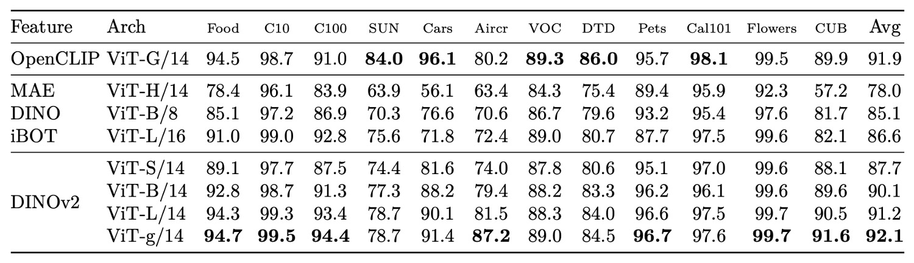

## 汎用特徴鍛錬法

[**DINOv2: Learning Robust Visual Features without Supervision**](https://arxiv.org/pdf/2304.07193)

---

第一世代の DINO は既に確認済みです。

2 年の時を経て、Meta AI Research がこのアーキテクチャにどのような改良を加えたのか見てみましょう。

:::tip
本論文は約 20 ページにわたり、時間つぶしにも最適です。
:::

## 問題定義

近年、視覚モデルの主流の発展傾向は二極化しています。

一方で、CLIP や ALIGN などの手法は画像と言語の整合を通じて、言語を意味の監督軸として利用し、意味理解能力を持つ基盤モデルを成功裏に訓練しました。分類、検索、多モーダルタスクにおいて、これらの手法は確かな強さを示しています。

しかし、もう一方の路線は言語に依存せず、さらには外部のラベル付けを一切拒否します。これはより純粋な自己教師あり学習の視点であり、画像自身に語らせ、モデルが無音の中で識別、記憶、抽象、帰納を学ぶことを目指します。

この路線は、より根本的な問いに挑みます：

> **言語なき世界で、画像は自身を理解できるのか？**

これが自己教師あり学習（Self-Supervised Learning, SSL）技術の核心的追求です。

これらの手法は大きく二つに分類されます：

1. **画像内部の予測タスク（intra-image pretext task）**
   　マスクされた領域の予測、原画像の再構築、色の修復、パッチの順序判定など、言語モデルの「穴埋めタスク」に似た形式であり、代表的な手法に MAE や BEiT があります。

2. **識別的学習（discriminative self-supervision）**
   　異なる画像間の識別性を強調する訓練法で、対比学習、インスタンス分類、クラスタリング学習などが含まれ、SimCLR、MoCo、BYOL、DINO などが代表例です。

これらの手法は ImageNet-1k などの標準データセットにおいて、汎用性のある frozen 特徴を獲得可能であり、監督学習と肩を並べる性能を示します。しかし、モデル規模の拡大や訓練期間の延長、未選別データセットの使用では、性能の劣化や訓練の不安定化、特徴の退化といった課題に直面します。

もしかすると、データの質と多様性こそが鍵かもしれません。

自己教師あり学習は人工的なラベルに依存しませんが、入力データの広がりと構造的バランスに強く依存します。データセットにトピックの偏りやロングテールの不均衡、過剰な重複がある場合、モデルは偏った移植困難な表現を学習しがちです。

これらの手法は学術的・産業的に多くの成果を積み重ねてきましたが、安定的かつ実用的な視覚基盤モデルとして展開するには、いくつかの重要課題が未解決です：

- **大規模化の環境下で、既存の自己教師あり技術は十分な安定性と拡張性を持つか？**
- **言語やラベル信号を一切使わずに、下流タスクに直接使える汎用特徴を学習できるか？**
- **巨大で未選別の画像集合に対して、効果的かつ自動的にデータ選別や分布バランスを取るにはどうすればよいか？**

これらの問いは今も明確な答えを持ちません。

DINOv2 の出発点は、第 1 世代を基にデータ戦略の調整、アーキテクチャの安定化強化、そして自己教師あり学習のシステム的設計の再考を目指します。もしデータが良質で、構造が堅牢ならば、言語非依存のモデルも現代視覚システムの汎用的基盤となり得るかもしれません。

## データ収集

モデルが堅牢かつ汎用的な視覚特徴を学ぶために、データ品質は最優先事項です。

「ラベルなし・完全自己教師あり」を目指す場合、データ選択の責任はラベルから離れ、**画像そのものの多様性と代表性**にかかります。

著者らが設計したデータ処理の流れは大まかに 3 段階で示され、下図のようになっています：

<figure style={{"width": "90%"}}>

</figure>

### 1. データプールの準備

対象データセット LVD-142M は二つの部分から構成されます：

- **curated 部分**：ImageNet-1k / 22k、Google Landmarks、複数の細粒度データセットを基準とし、「代表的サンプル」の源泉とする。
- **uncurated 部分**：ウェブクローラーにより収集した生画像で、違法 URL、NSFW、ぼやけた顔など安全性のフィルタリングを経て、合計 12 億枚に達する。

この uncurated 画像はラベルなし、説明なし、選別なしの状態で、「野生のネットワーク」データに最も近いものです。

:::info
本論文では「curated」という用語が頻出するため、読者の理解のために補足します。

- **curated data**：人工的に選別・洗浄・整理された高品質データ。
- **uncurated data**：ネットや他のソースから原始的に取得され、選別やクリーニングをしていないデータ。
  :::

### 2. 重複除去

訓練データの重複によるバイアスを避けるため、著者らはコピー検出専用の処理を導入し、高類似度画像を除去します。これは uncurated 集合内だけでなく、テストデータセットと似たサンプルも一緒に除外し、データリークを防ぎます。

この処理は Pizzi ら（2022）のアルゴリズムを参考にしており、データセットの多様性とクリーンさを確保しています。

:::tip
Pizzi 参考文献：[**[22.02] A self-supervised descriptor for image copy detection**](https://arxiv.org/abs/2202.10261)
:::

### 3. 自己教師あり検索

本当に巧妙な設計はここにあります。

著者はまず、ImageNet-22k 上で自己教師あり訓練された ViT-H/16 モデルを用い、すべての画像に対して埋め込み表現を計算し、コサイン類似度を距離指標として、「curated データに似ている」uncurated 画像を抽出しました。

これは人工のラベル付けでもキーワードフィルタリングでもなく、完全に画像特徴に基づく視覚的類似性検索です。

続いて、著者は uncurated 画像を K-means クラスタリングし、状況に応じて（クエリデータセットが大きいか小さいかで）基準画像ごとに上位 N 個（N=4）の近傍画像、または対応クラスタの M 枚の画像を選択しました。

この選択は、データ間の重複と検索多様性のバランスをとるものです。

### エンジニアリング規模と効率

このような大規模データ処理と検索には強力な計算資源が必要です。

全体のプロセスは FAISS フレームワークを基盤とし、GPU アクセラレーションされた倒立索引と量子化符号化を用い、20 台の計算ノード（各 8 基の V100 GPU 搭載）に分散処理されました。約 2 日未満で 1.42 億枚の高品質訓練データの整備を完了しました。

総じて、DINOv2 のデータ準備過程は「既存の高品質データ」と「視覚的意味が近いウェブ画像」を巧みに結合し、自己教師ありで訓練サンプルを自動選別することで、モデル学習の基盤を築いています。

## 解決策

DINOv2 が採用する訓練戦略は、識別的自己教師あり学習（Discriminative Self-Supervised Learning）に属し、DINO と iBOT に SwAV のセンタリング機構を組み合わせたハイブリッド設計であり、そこに正則化項と高解像度訓練戦略を追加しています。

:::tip
突然これらの専門用語が出てきて戸惑うかもしれません。

上記の用語に馴染みのない方は、以下の論文を参照してください：

- [**[20.06] SwAV: クラスタリング予測**](../2006-swav/index.md)
- [**[21.04] DINO: ラベルなしでの自己蒸留**](../2104-dino/index.md)
- [**[21.11] iBOT: Image BERT Pre-Training with Online Tokenizer**](https://arxiv.org/abs/2111.07832)
  :::

### 画像レベルの特徴アライメント

<figure style={{"width": "50%"}}>

</figure>

この部分は DINO 手法の核心思想に基づいています。上図の通りです。

DINO 損失関数を用い、異なる視点（augmentation）による画像が、student/teacher ネットワークを通した後、意味表現が一致することを目的とします。

具体的な手順は以下の通りです：

- 同一画像から異なる 2 つのクロップ（view）を取り、それぞれ**student モデルと teacher モデル**に入力する；

- 両モデルは Vision Transformer で、class token を画像全体の意味ベクトルとして使用；

- class token はそれぞれ MLP ヘッドに通し、「prototype scores」と呼ばれるベクトルを出力、softmax を適用：

  $$
  \mathbf{p}_s = \mathrm{softmax}(h_s(z_s)), \quad \mathbf{p}_t = \mathrm{softmax}(h_t(z_t))
  $$

- teacher の予測が過度に鋭くならないよう、teacher の softmax 結果には**centering**処理（スライディング平均や Sinkhorn-Knopp 法など）が施される；

- 最終的な損失は両者間の交差エントロピー：

  $$
  \mathcal{L}_{\text{DINO}} = - \sum_{k} p_t^{(k)} \log p_s^{(k)}
  $$

ここで student が訓練対象、teacher は student の重みの指数移動平均（EMA）であり、逆伝播には参加しません。

### パッチレベルの予測タスク

<figure style={{"width": "90%"}}>

</figure>

モデルに細部や局所的意味の学習を促すため、著者は iBOT の「ピクセルレベル予測タスク」を導入しています。構造は以下の通りです：

- student の入力でランダムにいくつかのパッチをマスクし、masked token を形成；
- teacher の入力ではこれらのパッチは完全に表示される；
- マスクされた各パッチについて、student の予測分布 $\mathbf{p}_{s}^{(i)}$ と teacher の目標分布 $\mathbf{p}_{t}^{(i)}$ を softmax と centering を経て計算し、

  $$
  \mathcal{L}_{\text{iBOT}} = - \sum_{i \in \mathcal{M}} \sum_{k} p_t^{(i, k)} \log p_s^{(i, k)}
  $$

ここで $\mathcal{M}$ はマスクされたパッチのインデックス集合です。このタスクは空間レベルでより細かい監督を提供し、後続のセグメンテーション等ピクセルレベルタスクに貢献します。

### ヘッド設計

DINOv2 と iBOT は共に、Transformer の出力をロジットにマッピングする追加の MLP プロジェクションヘッドを必要とします。

iBOT 論文では共有ヘッドが良好とされていますが、DINOv2 の大規模実験では**二組のヘッドを独立使用した方が性能良好**と判明し、常に分離して処理しています。

### Sinkhorn-Knopp Centering

teacher の予測分布を安定化させるため、DINOv2 は SwAV 由来の Sinkhorn-Knopp 正規化（SK）を用いてバッチ分布を均衡化します。

この手法は行・列の正規化を繰り返す反復アルゴリズムで、出力を二重確率分布に近づけます。実装では 3 回の正規化を行います。

SK の利用によりモデルの collapse リスクが低減し、すべての出力が単一プロトタイプに集中することを防ぎます。

### KoLeo 正則化

DINOv2 はあまり見られない正則化技術 KoLeo 正則化（Kozachenko-Leonenko Regularizer）を導入し、特徴が embedding 空間で均一かつ分散的になるよう促します。

これは微分エントロピーの推定量に基づき、以下の形で表されます：

$$
\mathcal{L}_{\text{KoLeo}} = -\frac{1}{n} \sum_{i=1}^{n} \log d_{n,i}
$$

ここで：

- $d_{n,i} = \min_{j \ne i} | \mathbf{x}_i - \mathbf{x}_j |$ は $i$ 番目ベクトルと他サンプル間の最近接距離；
- 全ベクトル $\mathbf{x}_i$ は $\ell_2$ 正規化済み。

この正則化により特徴の過度な集中が防がれ、特徴表現のカバレッジと多様性向上に寄与します。

### 高解像度訓練フェーズ

高解像度画像はセグメンテーションや検出タスクで重要ですが、事前学習段階で直接使うと計算コストが高いため、著者は折衷案として**事前学習の後期に一時的に 518×518 の高解像度画像に切り替え**ています。

これは UniViT や FlexiViT の解像度ランプアップに類似した考え方で、実験によりピクセルレベル性能を向上させつつ、追加の学習時間をほとんど要しません。

全体として DINOv2 の訓練目標は、意味的一致性、パッチ予測、分布バランス、空間正則化を複合し、効率と汎化力の安定したバランスを実現しています。

## エンジニアリング実装

論文中、著者は訓練速度の向上とメモリ使用圧縮の方法を詳細に説明しています。iBOT と比較し、同じハードウェアで約 2 倍の速度向上、1/3 のメモリ使用量を達成しています。

### FlashAttention

ViT アーキテクチャで最大の計算ボトルネックは自己注意層です。

著者チームは改良版 FlashAttention を自作し、メモリ使用と速度両面で元実装を上回り、多くのハードウェアと変種構造に対応可能としました。

embedding 次元が GPU 操作に最適（例えば各 head が 64 の倍数、全体が 256 の倍数）になるよう調整するとさらに効率化可能です。

そのため ViT-g 設計では 1536 次元・24head（各 head64 次元）を採用し、従来の 1408 次元・16head 構成に替えました。

実験では精度差は僅少で、新設計がより高性能です。

### Sequence Packing

ViT の入力は patch tokens であり、DINO 系手法は大きなクロップ（解像度 224）と小さなクロップ（解像度 98）を同時処理します。

従来は別々に forward していましたが、これにより batch size 不一致や計算資源浪費が生じていました。

DINOv2 は NLP 由来の**Sequence Packing**を導入し、異なる長さの token 列を連結し、block-diagonal attention mask で互いの注意を遮断しつつ、一度に処理しています。

これにより計算効率が大幅に改善されます。

この設計は低レベルサポートを必要とし、`xFormers`ライブラリで実装されています。

### Stochastic Depth

Stochastic Depth は訓練時に一部 residual block を確率的にスキップする正則化手法です。

従来は計算結果に 0 を掛けて出力を遮断していましたが、DINOv2 はドロップされた block の計算自体を飛ばし、メモリと計算を節約します。

これは特殊カーネル設計に依存し、バッチ内サンプルをランダムに並べ替え、前$(1-d) \cdot B$個のみ計算する方式です。論文中のドロップ率$d=40\%$なら、各層で約 4 割の計算を削減しています。

### 分散訓練

億規模パラメータ（例：ViT-g 約 11 億）のモデル訓練ではメモリが主要制約です。

DINOv2 は Fully-Sharded Data Parallel (FSDP) を使い、GPU 間でモデル複製を分割管理します。対象は：

- Student ネットワーク
- Teacher ネットワーク
- AdamW オプティマイザの 1 次・2 次モーメントパラメータ

これら計 4 組の float32 パラメータは約 16GB を占め、FSDP により GPU に分散可能で単一カードの制限を解放し、より大きなモデルを支援します。

また、GPU 間の通信負荷軽減のためモデル重み・勾配は float16 で送受信（MLP ヘッド除く）。これは Distributed Data Parallel（DDP）の float32 全 reduce と比べて通信量を半減以上します。

実験では PyTorch FSDP ＋混合精度が DDP ＋ autocast をほぼ全面的に上回っています。

### モデル蒸留

大型モデル（ViT-g）訓練後、DINOv2 は直接小型モデル（ViT-B や ViT-L）を訓練せず、知識蒸留で大モデルの出力を模倣させます。

訓練は teacher-student フレームワークを踏襲しつつ、

- 訓練済み ViT-g を固定 teacher とする；
- マスキングや stochastic depth は使わず、訓練を簡素化；
- iBOT 損失を 2 つの global crop に適用；
- 学習中に student の EMA を保持し最終モデルとする。

この設計は Duval らの手法に近いですが、DINOv2 は損失関数の構造を変更せず、既存パイプラインを再利用しシンプルにまとめています。

実験により、ViT-L でもスクラッチ学習より蒸留モデルの方が明確に優れることが示されています。

## アブレーション実験

各構成要素の有効性を検証するために、著者は訓練戦略、データソース、モデルサイズ、損失項目、解像度など複数の観点で実験を行いました。

### モデル訓練フロー

<figure style={{"width": "70%"}}>

</figure>

iBOT をベースラインとして、DINOv2 の技術要素（双ヘッド、Sinkhorn センタリング、KoLeo 正則化など）を順次追加し、ImageNet-1k 上の k-NN と linear probe での性能を観察しました。

結果は、**ほとんどの技術要素がいずれかの評価指標で性能向上をもたらし**、LayerScale や Stochastic Depth は linear probe 精度を下げることもありましたが、訓練の安定性を大幅に改善しており、実務上重要な指標とされています。

### 事前学習データ

<figure style={{"width": "90%"}}>

</figure>

データ品質が特徴学習に与える影響を検証するため、著者は以下 3 種のデータを比較しました：

- LVD-142M（視覚検索で選別された curated データ集合）
- ImageNet-22k（従来の大規模有ラベルデータセット）
- Uncurated-142M（同一ソースからランダム抽出した未選別ネットワーク画像）

いずれも ViT-g/14 で同条件で訓練。

実験結果：

- **curated データは uncurated に比べて顕著に優れる**（同量でも）
- LVD-142M は多くのベンチマーク（ImageNet-1k を除く）で ImageNet-22k を上回る
- データ選別を参照しないドメイン（INaturalist、Places205）でも LVD-142M は優れた転移性能を示す

この実験は自己教師あり学習において「データ設計」が極めて重要なパラメータであることを裏付けます。

### 損失項の重要性

各損失項の最終性能への寄与を検証。以下の 2 点をアブレーションしました：

- **KoLeo 正則化の効果**
  　 Oxford-M 画像検索タスクで**KoLeo 有効時に約 8%の精度向上**を達成。ImageNet 分類や ADE セグメンテーションでは副作用なし。特徴分布の拡散を促し、細かな特徴識別が求められる retrieval 系タスクに有効。

- **iBOT 式マスク予測（Masked Image Modeling）**
  　 ADE-20k セグメンテーションタスクでこの損失を外すと**約 3%の精度低下**。パッチレベルの監督がピクセルレベルタスクに非常に重要。

### 知識蒸留の効果

<figure style={{"width": "90%"}}>

</figure>

小型モデルの訓練コスト削減のため、DINOv2 は ViT-g を固定 teacher として ViT-L/14 へ蒸留を実施し、スクラッチ学習モデルと比較。

結果、**蒸留 ViT-L は 12 ベンチマーク全てでスクラッチ学習を上回り**、小モデルの訓練簡素化と「大から小への知識移転能力」の高さを証明。

### 高解像度訓練

<figure style={{"width": "90%"}}>

</figure>

「最初から高解像度で訓練すべきか」検証：

- 解像度 224、416、最後の 1 万イテレーションのみ 416 使用の 3 設定を比較
- 評価は ImageNet 分類と ADE セグメンテーション
- **終始 416 は最高性能だが計算コストは 224 の 3 倍**
- 「最後の 1 万イテレーションで高解像度切替」はほぼ同等の性能で追加コストはわずか

このため DINOv2 は後者を採用し、解像度効果を保ちつつ計算負担を抑える折衷策を選択しています。

## 討論

### ImageNet 分類

<figure style={{"width": "90%"}}>

</figure>

ImageNet-1k の線形分類タスクにおいて、DINOv2 は非常に強力な特徴表現能力を示しています。

Frozen backbone に単純な線形分類器を組み合わせるだけで、既存の自己教師あり手法を全般的に上回り、同条件で複数の弱教師ありモデルと肩を並べ、さらに一部のモデル構造条件下では先行しています。

また、大規模なテキストアライメントや追加監督を用いなくても、DINOv2 の特徴表現は優れた線形分離性と堅牢なカテゴリ一般化能力を発揮し、kNN 評価においても高い識別性と近傍一貫性を示します。

異なるモデル構造・解像度における結果から、DINOv2 は訓練解像度を変えずとも拡張性が高く、中型 ViT から大規模 G 級モデルまで安定的に性能を維持しています。

総じて、本実験は DINOv2 が過去の自己教師あり性能限界を超え、弱教師あり特徴学習の実用段階へ一歩進んだことを明確に示し、現実のタスクでの frozen 特徴の有用性と展開柔軟性を裏付け、微調整不要で十分な転移能力を有することを証明しています。

### 動画分類

<figure style={{"width": "90%"}}>

</figure>

より広範な画像・動画分類下流タスクにて、DINOv2 の特徴はモーダル間・ドメイン間の汎化力を示します。自然分類（iNaturalist 系列）、シーン認識（Places205）、SimCLR の多様な分類ベンチマークいずれにおいても競争力のある性能を発揮。

自然種識別で弱教師あり手法を大きく上回り、細粒度視覚変化に強い識別力を持つことが示されました。室内シーン（Places205）など一部テキストアライメントモデルに及ばない領域でも、依然として高い実用性があり、テキスト監督を用いません。

動画分類タスクにおいては、動画データを一切用いない事前学習条件下でも、DINOv2 の frozen features は有意義な動作認識基盤を提供し、時間情報要求が高いデータセットでは同条件の CLIP 類モデルを凌駕、空間特徴の時間統合後も十分な意味を保持しています。

<figure style={{"width": "90%"}}>

</figure>

最後に、物体・シーン・材質を含む 12 の画像分類タスクで、DINOv2 は自己教師ありモデルに対し顕著な優位性を保ち、弱教師あり手法と多くのデータセットで競り合い、言語事前知識寄りのデータセット（SUN など）でのみやや劣る結果に。特に車両・飛行機など細粒度分類で強みを示し、言語なしでも識別の核心情報を内在化し高効率な区別が可能であることを示しています。

### インスタンス認識

<figure style={{"width": "90%"}}>

</figure>

インスタンスレベル認識タスクでも DINOv2 は強力な識別能力を発揮。

非パラメトリック検索によりクエリとデータベース画像間のコサイン類似度でランク付けし、自己教師あり・弱教師ありモデルと比較。

ランドマーク認識（Oxford、Paris）、美術品検索（Met）、歴史的街並み比較（AmsterTime）など多様なドメインで既存モデルを大幅に上回り、特に難易度高い設定では平均精度向上が顕著。微細差異や詳細保持に高感度な特徴を示します。

DINOv2 の特徴はカテゴリレベル分類のみならず、インスタンスレベル認識でも優れた一貫性と性能を持つことを示しています。

### セマンティックセグメンテーション

<figure style={{"width": "70%"}}>

</figure>

セマンティックセグメンテーションや単眼深度推定といったデンスレベルタスクで、DINOv2 は強力なパッチレベル特徴を示し、Frozen 設定でも実用的な予測を提供。

単純な線形予測器による低解像度マップのアップサンプリングでも複数データセットで安定した性能。簡易な多層特徴結合・マルチスケール推論（+ms 設定）により、全モデル微調整版 MAE に迫る性能を示し、一部データセットでは最先端手法に近接、シンプルな予測構造ながら高性能を実現。

さらに Frozen backbone を SOTA セグメンテーションパイプライン（ViT-Adapter + Mask2Former）に接続すると、エンドツーエンド訓練なしでも現行手法に匹敵する精度を達成し、バックボーンの特徴の高い転移性と再利用性を証明。

### 質的評価

構造的な定量評価に加え、多数の質的分析を通じて DINOv2 の特徴が持つ意味感度、構造一貫性、ドメイン間転移能力を検証。

まず深度推定の視覚比較：

<figure style={{"width": "90%"}}>

</figure>

セグメンテーション・深度推定の視覚比較では、Frozen backbone ＋線形予測器でも DINOv2 は意味的に明瞭で境界が連続する分割図を生成し、同条件の OpenCLIP を大きく凌駕。

深度予測も類似傾向で、DINOv2 の出力はより滑らかで空間的整合性が高く、特に室内シーンの椅子など細部物体認識に優れる。

次に未知ドメイン画像を入力した一般化評価：

<figure style={{"width": "90%"}}>

</figure>

未知データ種（動物、絵画など）でも DINOv2 特徴はセグメンテーション・深度モジュールを適切に駆動し、単一ドメイン過学習しておらず、実用的な転移力を有することを示す。

最後に特徴空間構造解析：

<figure style={{"width": "90%"}}>

</figure>

PCA 投影によりパッチレベル特徴が前景・背景を自然に区別し、無監督でも物体内部の意味領域（構造区画やパーツの連続性）を捉えることが可能。

異なる画像の同一意味クラスパーツ（動物の頭部、翼など）も高度に整合し、モデルが空間一貫した視覚分解能力を習得していることを示唆。

## 結論

エンジニア視点での最大の価値は、「高品質で汎用性の高い視覚特徴が微調整なしに多様なタスクへ直接応用可能」と言えます。

これは、従来は微調整や追加監督が必要だった分類・分割・深度推定・インスタンス検索といった問題を、より低コストかつシンプルな下流モジュール（線形ヘッドなど）で解決可能にし、展開や保守の複雑さを大幅に削減します。

さらに DINOv2 はドメイン横断的な性能や細部構造識別に強靭性を示し、データ稀少かつ変動大ながら正確な意味識別が求められる領域での骨幹ネットワークに最適です。

またブラックボックスではなく、PCA やパッチマッチング分析を通じて特徴に内包される意味構造や物体区分能力を具体的に理解でき、モデル解釈性や誤り解析に寄与します。

医療画像、衛星画像、リテール商品認識、自動運転の知覚モジュールなど、多様な応用で DINOv2 は有望な汎用基盤となるでしょう。
