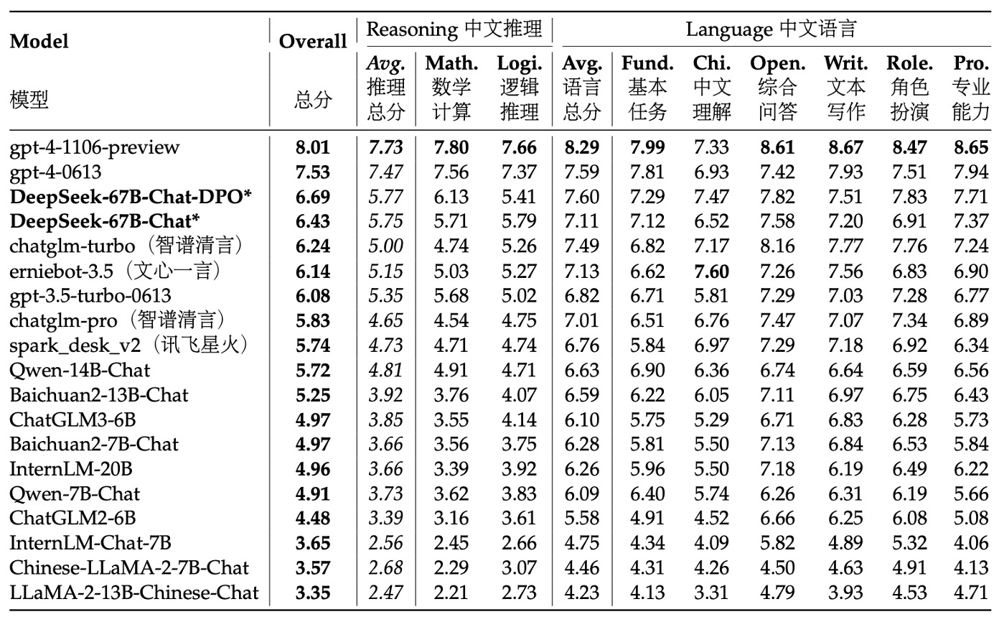

## 新しいモデルスケーリング法則

[**DeepSeek LLM: Scaling Open-Source Language Models with Longtermism**](https://arxiv.org/abs/2401.02954)

---

最近、DeepSeekに関するニュースが大きな話題となり、OpenAIさえもその反響に対して言及せざるを得ない状況です。

彼らがこれほど注目を集めたので、私たちはこの数年間に発表された論文を一通り読んでみました。

この論文は48ページにわたるもので、多くの実験データや技術的詳細が含まれていますので、ここでは重要なポイントに絞って見ていきます。

## 問題の定義

オープンソースモデルとクローズドソースモデルのパフォーマンス差は、常に注目のテーマでした。過去の研究によると、オープンソースモデルはほとんどのベンチマークテストで明らかにクローズドソースモデルに劣っており、その主な原因はオープンソースモデルの規模とリソースの制約にあるとされています。

この差を縮めるために、研究チームはDeepSeek LLMシリーズモデルを提案しました。これは、7Bから67Bまでのスケールを持つオープンソース言語モデルのシリーズです。これらのモデルをトレーニングするために、研究チームは既存のスケーリング法則に疑問を呈し、過去の研究結果が必ずしも正しいとは限らないと考え、独自のスケーリング法則を提案しました。この論文では、モデルの規模、データ規模、計算予算との関係を探ることを主軸にしています。

ここでは、スケーリング法則に関する議論に焦点を当て、DeepSeek LLMの設計と実験結果について簡単に紹介します。

## 問題の解決

### データ処理戦略

研究チームは「重複排除 → フィルタリング → 混合」の3段階の戦略を採用しました：

- **重複排除 (Deduplication)**：

    

    <figure style={{"width": "80%"}}>
    
    </figure>
    

    Common Crawlデータセット全体を重複排除の範囲として使用しました。上記の表からもわかるように、複数のダンプにまたがる重複排除の方が単一ダンプに対するものより徹底され、モデルにとってより多くのユニークな学習サンプルが提供されます。

- **フィルタリング (Filtering)**：言語的および意味的な観点から設計された厳密な文書品質評価基準を使用し、局所的およびグローバルな視点でデータの品質を保証します。
- **混合 (Remixing)**：データ分布の不均衡を解決するために、特に代表性の低い分野のデータを強化し、データセットがよりバランスが取れ、多様な情報を包含するようにしました。

Tokenizerの設計において、研究チームはByte-level Byte-Pair Encoding（BBPE）を採用し、異なる文字クラス（例えば改行、句読点、CJK記号）の混合を避けるために事前に分割を行いました。また、数字は単一の数字に分割されました。語彙は初期設定で100000に設定され、さらに15個の特殊トークンが追加され、102400まで拡張されました。これにより、モデルのトレーニング計算効率と将来の拡張ニーズに対応しています。

### モデルアーキテクチャ設計

モデルは基本的にLLaMAアーキテクチャを踏襲し、Pre-Norm構造にRMSNormを組み合わせ、SwiGLUをFFNの活性化関数として使用しています。位置エンコーディングはRotary Embedding手法を採用しており、シーケンス処理能力が強化されています。

推論コストを削減するため、67Bモデルでは従来のMulti-Head AttentionをGroup-Query Attention（GQA）に置き換えています。

サイズが異なる2つのモデル（7Bと67B）の層数はそれぞれ30層と95層であり、この調整により他のオープンソースモデルとのパラメータ一致を保ちながら、モデルのパイプライン分割を最適化し、トレーニングと推論のフローを改善しています。従来のFFN幅を拡大するだけのアプローチとは異なり、研究チームはネットワークの深さを増やすことで67Bモデルのパラメータを拡張し、モデル全体のパフォーマンス向上を目指しています。

:::tip
ここでいくつかの重要なキーワードが出てきますので、他の論文を読む必要があります：

1. Rotary Embedding: 回転位置エンコーディングについては、以前読んだ記事を参考にできます
    - [**[21.04] RoFormer: 回転位置エンコーディング**](../../transformers/2104-roformer/index.md)
2. Grouped-Query Attention: グループ化されたマルチヘッドアテンションについては、GQA論文を参考にしてください
    - [**[23.05] GQA: Training Generalized Multi-Query Transformer Models from Multi-Head Checkpoints**](https://arxiv.org/abs/2305.13245)

これらの論文を読んだ後、関連するノートを補足します。
:::

### パラメータ設定

モデルの初期化標準偏差は0.006に設定され、AdamWオプティマイザーを使用します：

- $\beta_1=0.9$
- $\beta_2=0.95$
- weight_decay=0.1

学習率スケジューラは段階的に設定され、2000ステップのウォームアップ後にピークに達し、その後、80%と90%のトークンでそれぞれ最大値の31.6%と10%に低下します。この戦略は、固定されたモデルサイズでトレーニング規模を調整し、前のステージのトレーニング結果を再利用できるようにして、継続的なトレーニングを便利にします。全体の実験では、損失の下降曲線は異なりますが、最終的なパフォーマンスはコサインスケジューラーとほぼ一致しました。

勾配クリッピング値は1.0に設定され、勾配爆発を防ぎ、トレーニングの安定性を確保しています。

トレーニングはHAI-LLMフレームワークを使用して行われ、このフレームワークはデータ、テンソル、シーケンス、およびパイプライン並列技術を統合しており、Megatronの設計に似ていて、大規模モデルの計算負担を効果的に分散させます。

また、フラッシュアテンション技術を導入してハードウェア利用率を向上させ、ZeRO-1技術を使用してオプティマイザーステートを分割し、メモリ消費をさらに削減しています。部分的な層（LayerNorm、GEMM、およびAdam更新）の統合により、トレーニングを加速させています。混合精度（bf16トレーニング、fp32勾配蓄積）とインプレース交差エントロピー計算を利用して、メモリ使用量を最適化しています。

モデルの重みとオプティマイザーステートは5分ごとに自動保存され、ハードウェアまたはネットワークの障害が発生した場合でも、最大5分のトレーニングデータを失うだけで済みます。同時に、異なる3D並列構成からトレーニングを再開することができ、計算リソースの動的な変化に対応できます。

評価戦略の一部として、生成タスクではvLLMを使用し、非生成タスクではバッチ処理を連続して行い、手動でバッチサイズやトークンパディングを調整する問題を減らしています。

## スケーリング法則

:::tip
過去の有名なスケーリング法則について、まだ見ていない読者は以下の以前書いたノートを参考にしてください：

- [**[20.01] Scaling Laws: モデルのスケーリング法則**](../../transformers/2001-scaling_laws/index.md)
- [**[22.03] Chinchilla: チンチラの瞳**](../../transformers/2203-chinchilla/index.md)
:::

### ハイパーパラメータ設定

<figure style={{"width": "90%"}}>

</figure>

研究チームは、計算予算 $C = 1\mathrm{e}17$ の下で、特定のモデル規模（177M FLOPs/token）に対してグリッドサーチを行い、異なるバッチサイズ $B$ と学習率 $\eta$ の組み合わせを探索しました。

上図の実験結果に基づき、研究チームは広い範囲の $B$ と $\eta$ において、モデルの汎化誤差が安定していることを観察しました。これは、この広いパラメータ空間内で最適に近い性能を持つハイパーパラメータの組み合わせが見つかること、すなわち「近似最適」なパラメータ領域が存在することを意味します。

さらに大きな計算予算範囲（$1\mathrm{e}17$ から $2\mathrm{e}19$）を探索するために、研究チームは多段階学習率スケジューラを採用しました。このスケジューラは、最初の段階のトレーニングが完了した後、既存のトレーニング成果を再利用して、複数のハイパーパラメータ設定のモデルを効率的にトレーニングすることを可能にします。パラメータ空間には冗長性があるため、汎化誤差が最小値から0.25％を超えない場合、そのハイパーパラメータは「近似最適」と見なされます。

多くの実験とデータフィッティングの結果、以下のことが示されました：
  - **最適バッチサイズ $B_{opt}$：** 計算予算 $C$ の増加に伴い、徐々に増加します。これは直感的に理解でき、より多くの計算リソースがあれば、より大きなバッチを使用できるためです。
  - **最適学習率 $\eta_{opt}$：** $C$ の増加に伴い、徐々に減少します。つまり、モデルの規模が大きくなり、計算予算が増加すると、安定性を保つために学習率は低くする必要があるということです。

最終的に、研究チームは以下の2つの式を用いてこの関係を説明しました：

$$
\eta_{opt} = 0.3118 \cdot C^{-0.1250}
$$

$$
B_{opt} = 0.2920 \cdot C^{0.3271}
$$

これらの式は、それぞれ最適学習率と最適バッチサイズと計算予算 $C$ とのべき乗関係を定量化したものです。

これらの式の有効性を検証するために、研究チームはさらに大きな計算予算 $C = 1\mathrm{e}20$ の下で、モデル規模が2.94B FLOPs/tokenのモデルを使用して検証を行いました。実験結果は上図（右）に示されており、フィッティングされたハイパーパラメータが最適パラメータ空間の中心に位置していることが確認され、式の精度がさらに検証されました。

### 最適モデルとデータのスケーリング推定

近似最適ハイパーパラメータ公式のフィッティングを完了した後、研究チームはモデル規模とデータ規模をどのように最適に配分するかの研究を開始しました：

> **つまり、与えられた計算予算 $C$ の下で、最適なモデル規模とデータ規模を選択し、最小の誤差を達成する方法を決定することです。**

核心目標は、2つのべき乗関係を見つけることです。ここで、モデルの最適規模 $N_{opt}$ は計算予算に対して次のように満たします：

$$
N_{opt} \propto C^{a}
$$

そして、データの最適規模 $D_{opt}$（データ中のトークン数で表現）は次のように満たします：

$$
D_{opt} \propto C^{b}
$$

ここで、$a$ と $b$ はそれぞれモデルとデータのスケーリング指数です。

初期の研究では通常、モデル規模をモデルのパラメータ数で表現し、計算予算とモデルおよびデータの規模との関係は次のように近似されます：

$$
C = 6N \cdot D
$$

この場合、$6N_1$ または $6N_2$ を使用してモデル規模を近似できます。しかし、これらの2つの表現方法は、注意力計算がもたらす計算負担を十分に反映していません。この方法では、異なるモデル規模において最大で50％の誤差が生じることがあり、特に小規模モデルにおいて顕著です。これらは、後続のスケーリング曲線のフィッティングに顕著な統計的誤差をもたらします。

これらの問題を克服するために、研究チームは新しいモデル規模の表現方法 $M$ を提案しました。$M$ には、注意力計算の計算負担が含まれますが、語彙計算は含まれていません。公式は次のようになります：

$$
M = 72\, n_{layer}\, d_{model}^2 + 12\, n_{layer}\, d_{model}\, l_{seq}
$$

ここで：

  - $n_{layer}$：層数
  - $d_{model}$：モデルの幅
  - $l_{seq}$：シーケンスの長さ

$M$ を使用すると、計算予算は次のように簡略化して表すことができます：

$$
C = M \cdot D
$$

これにより、異なる設定でのモデルとデータの最適配分の推定が容易になります。

$M$ を導入した後、研究チームは目標を明確にしました：

> **計算予算 $C = M \cdot D$ の条件の下で、最適なモデル規模 $M_{opt}$ と最適なデータ規模 $D_{opt}$ を求め、モデルの汎化誤差 $L(N, D)$ を最小化すること。**

これは次のように表現できます：

$$
M_{opt}(C),\, D_{opt}(C) = \arg\min_{M,D \, \text{s.t.} \, C = M \cdot D} L(N,D)
$$

実験コストとフィッティングの難易度を下げるために、研究チームはChinchillaで提案された **IsoFLOPプロファイル** 方法を採用しました：

- 8つの異なる計算予算を選定し、その範囲は $1\mathrm{e}17$ から $3\mathrm{e}20$ までです。
- 各予算に対して、約10種類の異なるモデルとデータ規模設定を設計しました。
- 各設定のハイパーパラメータは前述の式で決定され、独立した検証セット（100Mトークンを含む）で汎化誤差を計算しました。

上記のデータを使用して、研究チームはIsoFLOP曲線とモデル/データのスケーリング曲線を描きました：

最終的に得られた最適モデルとデータのスケーリング式は次のようになります：

$$
M_{opt} = M_{base} \cdot C^{a}
$$

- ここで $M_{base} = 0.1715,\; a = 0.5243$。

$$
D_{opt} = D_{base} \cdot C^{b}
$$

- ここで $D_{base} = 5.8316,\; b = 0.4757$。

これらのフィッティング結果に基づき、研究チームはDeepSeek LLM 7Bおよび67Bモデルの汎化誤差を成功裏に予測しました。結果は以下の通りです：

<figure style={{"width": "90%"}}>

</figure>

実験結果は、小規模な実験結果が1000倍の計算予算下でのモデル性能を正確に予測できることを示しており、これが大規模モデルのトレーニングに対する強力なサポートとなっています。

### データ品質の影響

研究チームは、以下の3つのデータセットを用いて比較分析を行いました：

- **Early Data:** 初期の内部データ。
- **Current Data:** 現在の内部データ。
- **OpenWebText2:** 以前のスケーリング法則の研究で使用されたデータセット。

比較を通じて評価した結果、現在の内部データの品質が初期のデータよりも優れていることが示されました。また、OpenWebText2は規模が小さいため、より詳細な処理が可能で、そのデータ品質は現在の内部データを超えることが分かりました。

前節のスケーリング法則の式を利用して、研究チームは異なるデータセットに対するスケーリング指数を計算しました。結果は以下の表に示されています：

<figure style={{"width": "80%"}}>

</figure>

具体的には、OpenAI（OpenWebText2を使用）の係数は $a=0.73$ と $b=0.27$、Chinchilla（MassiveText）の係数は $a=0.49$ と $b=0.51$ でした。一方、彼ら自身のデータにおいて、初期の内部データの係数は $a=0.450$ と $b=0.476$ で、OpenWebText2で処理されたデータは $a=0.578$ と $b=0.422$ でした。

これらの結果から、データ品質が向上するにつれて、モデルのスケーリング指数 $a$ が増加し、データのスケーリング指数 $b$ が減少することが分かります。つまり、「**同じ計算予算の下では、データ品質が高いほど、モデルのスケーリングに多くのリソースを割り当て、単純にデータ量を増やすことなく、より多くのリソースをモデルの拡張に使うべき**」ことが示されています。これにより、初期の研究において異なるデータセットで最適なモデルとデータの配分戦略に大きな違いがある理由も説明されます。

:::tip
直感的には、品質の高いデータは論理が明確でノイズが少ないため、小さなモデルでも良い結果が得られると考えがちです。つまり、品質の高いデータを使えば「モデルの容量を節約できる」と思われるかもしれません。

しかし、研究チームはこう言っています：違うよ！

**高品質なデータは予測の難易度を下げるため、データの信号が強く安定します。その結果、モデルは追加の容量を使ってより細かいパターンを捉え、さらにパフォーマンスを向上させることができます**。

言い換えれば、データ品質が高いと、モデルは「ノイズ」を学習することに制限されなくなり、そのスケール効果を最大限に活用できるようになり、モデルのパラメータを増やすことでさらに大きな改善を得ることができます。
:::

## モデルアライメント

モデルアライメント（Alignment）のプロセスの主要な目標は、モデルが生成する応答が有益な情報を提供するだけでなく、有害な内容を避けることです。

データに関して、研究チームは約150万件の中英指示データを収集しました。これには幅広いテーマが含まれています。その中で、120万件が有益なデータで、内訳は次の通りです：一般的な言語タスク31.2%、数学問題46.6%、プログラム作成練習22.2%。また、30万件は安全性に関する問題に焦点を当てており、各種センシティブなテーマが含まれています。

アライメントプロセスは2つの段階に分かれています：
- 第一段階は監視付き微調整（Supervised Fine-Tuning, SFT）
- 第二段階は直接的な好ましさ最適化（Direct Preference Optimization, DPO）を使用します。

監視付き微調整段階では、異なるモデルサイズに応じて異なるトレーニングエポックを使用しました。後者は過学習が発生しやすいためです。実験ではGSM8KやHumanEvalなどのベンチマークが使用され、7Bモデルはパフォーマンスが向上し続けましたが、67Bモデルは比較的早く性能の上限に達しました。

第二段階、すなわちDPO部分では、研究チームは直接的な好ましさ最適化アルゴリズムを利用してモデルのアライメント効果をさらに強化しました。DPOはシンプルで効果的な方法であり、その核となるのは好ましさデータを使用してモデルの生成応答の方向を調整することです。

この段階では、有益さと無害性に関する偏好データを構築しました。具体的には、創造的な執筆、質問応答、指示の遵守などの多様なカテゴリーを網羅する多言語のプロンプトを収集し、DeepSeek Chatモデルを用いて候補応答を生成し、それを基に有益な偏好データを構築しました。無害性に関しても同様のプロセスが採用されました。

## 討論

DeepSeek LLMの実験結果は非常に多く、ここでは主にモデルの開放的な生成能力、特にオープンドメインやオープンエンドの問題に焦点を当てます。これらは実際の使用シナリオに近いため、モデルが多回合対話やクロスランゲージタスク、非構造化アプリケーションでどのように実際に機能するかを理解するための重要な指標となります。

その他の部分については、興味がある読者は原論文を参照してください。

### 中国語オープンエンド評価

<figure style={{"width": "90%"}}>

</figure>

研究チームは、中国語と英語のタスクに対してモデルのオープンエンド生成能力をテストしました。

中国語の評価部分では、AlignBenchテストセットを使用しました。このテストセットは、8つの主要カテゴリ、36のサブカテゴリ、合計683の質問をカバーしており、各質問にはプロンプト、専門的な参照回答、評価テンプレートが付いています。評価にはGPT-4を使用して応答品質を採点し、評価の客観性と専門性を保証しています。

評価プロセスでは、研究チームはAlignBenchの公式GitHubコードベースを使用してモデル評価を実施し、生成温度パラメータを原設定に基づいて厳格に調整しました。具体的には、役割演技、執筆能力、オープンエンド問題のタスクに対して生成温度は0.7に設定し、他のタスクは0.1に設定して、生成結果が多様でありながら安定するようにしました。

AlignBenchのランキングから、DeepSeek 67B Chatモデルは複数の中国語タスクでChatGPTや他の基準モデルを上回り、GPT-4の2つのバージョンに次ぐパフォーマンスを示しました。これは、中国語のオープンエンド問題に対する優れたパフォーマンスを示しています。さらに、DPO（直接的な好ましさ最適化）トレーニングを受けた後、モデルはほとんどすべての評価指標で顕著に改善し、DPOがモデルのアライメントを改善する正の効果を証明しました。

中国語の言語タスクでは、その基本的な能力が最新のGPT-4を超えており、より複雑な中国語論理推論や数学計算タスクでも、他の中国語大型言語モデルを明確にリードしています。

### 英語オープンエンド評価

<figure style={{"width": "90%"}}>

</figure>

英語のオープンエンド評価では、研究チームはMT-Benchという基準を使用しました。この基準は8つの異なるカテゴリの多回合対話問題を含んでおり、モデルの持続的な対話生成能力をテストするために設計されています。この基準は、モデルが多回合のインタラクションで一貫性と整合性を維持できるかを評価するために、さまざまなオープンエンドのシナリオでのパフォーマンスを包括的に評価します。

実験結果は、DeepSeek LLM 67B ChatがLLaMA-2-Chat 70B、Xwin 70b v0.1、TÜLU 2+DPO 70Bなどの他の多くのオープンソースモデルを上回り、その得点は8.35に達し、GPT-3.5-turboと同等のパフォーマンスを示しました。これは、DeepSeek LLMが多回合英語対話生成において商用モデルの水準に近づいていることを意味しています。

さらに、DPOトレーニング後、DeepSeek LLM 67B Chatの平均得点は8.76に向上し、GPT-4のパフォーマンスに次いでいます。これは、DPOがモデル生成の好ましさをさらに調整するだけでなく、オープンエンドの多回合対話におけるモデルのパフォーマンスを強化できることを示しています。

### その他の興味深い発見

評価プロセス全体を実施した後、研究チームは以下のいくつかの興味深い発見を提案しました：

- **（1）モデルの安全性評価：**

  

  <figure style={{"width": "60%"}}>
  
  </figure>
  

  まず、研究チームは「Do-Not-Answer Score」を使用して、モデルが敏感または回答するのが不適切な質問に対して適切に回答を拒否できるかどうかを評価しました。スコアが高いほど、モデルの安全性が高いことを意味します。

  データを見ると、DeepSeek-67B-Chatは安全性において優れたパフォーマンスを発揮しており、非常に安全なモデルの1つに位置しています。

- **（2）段階的微調整戦略：**

  微調整の過程で、研究チームは、特に小型モデル（例えば7B）の場合、数学やプログラミングのデータで長時間微調整を行うと、専門的な能力が向上する一方で、会話のパフォーマンスが低下し、回答に繰り返しが生じることを発見しました。

  そのため、彼らは段階的微調整戦略を提案しました：第一段階では、利用可能なすべてのデータを使って微調整を行い、第二段階では会話データに集中して微調整を行います。実験結果は、この段階的微調整が専門的なタスクと会話の流暢さのバランスをうまく取れることを証明しました。

- **（3）多項選択問題データの影響：**

  アライメント段階では、研究チームは2000万件の中国語の多項選択問題データを追加し、多項選択問題タスクでのパフォーマンス向上を図りました。

  多項選択問題データを追加した結果、MMLU、C-Eval、CMMLUなどの多項選択問題基準で得点が顕著に向上しましたが、この向上はTriviaQAや中国語の質問応答などの生成型評価には延びませんでした。つまり、多項選択問題データはモデルの問題解決能力を向上させるものの、実際の対話生成にはモデルが「賢く」感じられるわけではないことが分かりました。

  そのため、モデルが多項選択問題形式に過度に適応して全体的な知能表現が損なわれるのを避けるため、最終的に彼らは事前学習および微調整段階では多項選択問題データを使用しないことに決めました。

- **（4）事前学習段階の指示データ：**

  さらに、研究チームは事前学習後期（最後の10％）に500万件の主に多項選択問題に基づいた指示データを追加し、その基礎モデルへの影響を観察しました。

  結果、これによりモデルの基準タスクにおけるパフォーマンスは確かに向上しましたが、最終的な効果は監視付き微調整段階で同じデータを追加した場合とほぼ変わらないことが分かりました。

  したがって、指示データが非常に大きい場合、事前学習段階に追加することも可能ですが、研究チームは多項選択問題データを排除する傾向にあり、非多項選択問題データは比較的限られていたため、最終的には事前学習段階で指示データを追加しないことに決めました。

- **（5）システムプロンプトの影響：**

  システムプロンプトは、モデルが有益で礼儀正しく前向きな応答を生成するようにガイドするために使用されます。

  研究チームは、LLaMA-2に似たシステムプロンプトを採用し、例えば「あなたはDeepSeek Chat、親切で尊重し、誠実なAIアシスタントです」とモデルに明示的に伝え、知識のカットオフ日などを説明しました。

  興味深いことに、7Bモデルの場合、システムプロンプトを追加すると、評価スコアがわずかに低下（7.15から7.11に）した一方、67Bモデルではシステムプロンプトがパフォーマンスを大幅に向上させることが分かりました（8.35から8.58に）。これは、大きなモデルはシステムプロンプトが伝えようとする意図をよりよく理解し従うことができる一方、より小さなモデルは理解不足から訓練とテストの間の不一致の影響を受ける可能性があるためです。

## 結論

DeepSeek LLMは、ゼロからトレーニングされた大規模言語モデルで、2兆トークンを超える中英のコーパスに基づいて構築されています。この論文は、モデルのトレーニング過程でのハイパーパラメータ選択とスケーリング法則の調整について詳細に記録しており、複数の微調整戦略を比較し、トレーニング効率とリソース配分に関する方法論を提案しています。

これはモデル自体の公開にとどまらず、DeepSeek-AIがオープンソースLLMの分野に本格的に進出するための重要なマイルストーンを意味します。

現在、DeepSeekシリーズは多くの核心的な論文を公開しており、後続の研究を順次読み進め、その技術的な展開と進化の軌跡をさらに探求していく予定です。