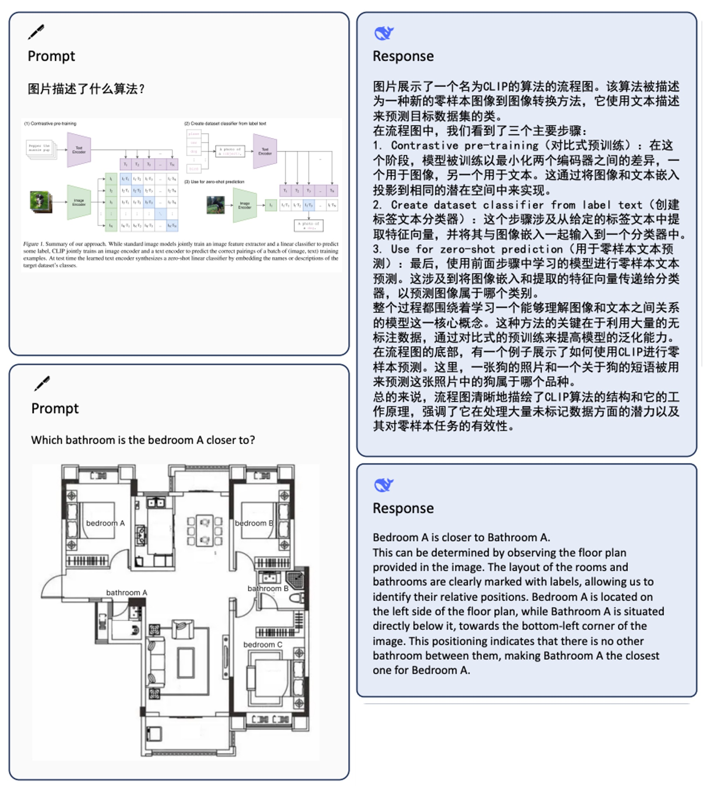
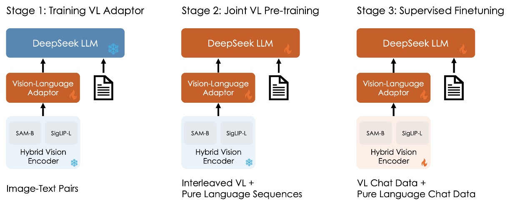
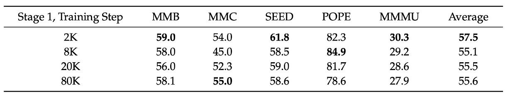

## マルチモーダル学習のレシピ

[**DeepSeek-VL: Towards Real-World Vision-Language Understanding**](https://arxiv.org/abs/2403.05525)

---

この論文はマルチモーダルに関するものです。

DeepSeek LLM が発表されてから2ヶ月後、DeepSeek チームはマルチモーダル領域における研究成果を発表しました。

## 問題の定義

現在のマルチモーダルモデルは、低解像度の入力（例えば336×336または448×448）を使用することが多く、OCRタスクや小さな物体の認識など、複雑なシナリオではパフォーマンスが低下します。さらに、オープンソースモデルとクローズドソースモデルの間には依然として顕著な性能差があります。

過去にうまくいかなかったことは、未来にとって最大の動機です。

著者は論文の中で、画像問答を例に挙げ、マルチモーダルモデルの典型的な適用シナリオを簡潔に示しました。

<figure style={{"width": "90%"}}>

</figure>

## 解決策

著者は、この論文でマルチモーダルモデルのトレーニングの問題を3つの次元で分解しています。

### トレーニングデータ

本研究では、データセットを2つの主要なカテゴリに分けています：

- **事前学習データ**：モデルのクロスモーダルな基礎的理解力を向上させるために使用され、異なるソースとタイプに分かれ、トレーニングの初期段階でウォームアップと共同事前学習が行われます。
- **教師あり微調整データ**：規模が小さく、モデルに特定の下流タスクを完了させることを教えるために使用され、トレーニング後期の教師あり微調整にあたります。

まずは **事前学習データ** です。その構成内容は以下の表に示されています：

<figure style={{"width": "70%"}}>

</figure>

- **クロスモーダル画像－テキストデータ**：MMC4、Wiki、Wikihow、Epub 教科書などの公開データを利用し、モデルが文脈内でマルチモーダル入力を学習できるようにします。
- **画像キャプションデータ**：高品質な Capsfusion、TaiSu、Detailed Caption データセットから取得し、モデルの画像内容に対する意味的な記述能力を高めます。
- **テーブルおよびグラフデータ**：Chart2text、Geo170K、Unichart、Ureader、M-paper、ScienceQA、ScreenQA、SciGraphQA-295K、Paper2figure100k、Widget Captioning、Screen2words、Refexp などの複数のソースを含み、モデルが一般的なテーブルおよびグラフ画像を理解できるようにします。
- **Webコードデータ**：UI Inverse Rendering技術を使用し（HuggingFaceM4およびMATCHAメソッドを参考に）、約146万個のJupyter notebookを処理し、フィルタリング後、1.1百万件の代表的なサンプル（各サンプルに少なくとも5行のコードを含む）を選出して、約200万ペアの画像とコードのデータを作成します。
- **文書OCRデータ**：文書レベルの光学式文字認識に対応するため、2つの主要なソースを統合：
  1. **arXiv論文**：140万篇のarXiv論文からソースコードとPDFを抽出し、Nougatツールを使用して画像－テキストペアに変換します。
  2. **電子書籍および教材**：86万冊の英語および18万冊の中国語電子書籍を処理し、数百万の小中学校の試験問題とともにHTMLレンダリングツールを使ってペア形式に変換します。
- **シーン文字OCRデータ**：複雑な環境で画像に組み込まれた文字を認識する能力を強化するために使用します。
- **純粋なテキストコーパス**：DeepSeek-LLMと同じコーパスを使用し、言語タスクにおける専門的な能力を維持します。

---

次に **教師あり微調整データ** です。ここでは、モデルの特定のタスクにおけるパフォーマンスに焦点を当て、マルチモーダルおよび言語データが含まれます：

<figure style={{"width": "70%"}}>

</figure>

- **公開されたGPT-4Vデータセット**：ShareGPT4V、LAION-GPTV、LVIS-Instruct4V、textOCR-GPT4V、LLaVA1.6-GPT4V、IconQAが含まれます。
- **一部のテーブルおよびグラフデータ**：事前学習データからUreader、ScreenQA、Geo170K、ScienceQAなどのソースを抽出しています。
- **UIコードデータ**：Screen-to-codeタスクから取得し、グラフィカルインターフェースや視覚的なグラフからコードを再構築する支援を行います。
- **内部高品質マルチモーダルSFTデータ**：一部のデータは中国語で表現され、実際のアプリケーションシナリオに基づいて慎重に設計されています。これには認知、変換、分析、推論、評価、セキュリティなどのカテゴリが含まれ、各テスト画像に対する代表的なヒントの選択とバランスの取れた評価データセットの構築に使用されます。
- **純粋なテキストSFTデータ**：DeepSeek-LLMで使用されているテキストデータと一致し、視覚と言語のSFTデータの一部として使用されます。

### モデルアーキテクチャ

<figure style={{"width": "50%"}}>

</figure>

:::tip
画像の氷塊と炎については、次の段落で説明しますので、今は気にしないでください。
:::

全体のモデルアーキテクチャは比較的シンプルで、3つのモジュールで構成されています：

1. **ハイブリッド視覚エンコーダ (Hybrid Vision Encoder)**

    上の図を参照し、主なコンポーネントは2つあります：

      - **SigLIP-L 視覚エンコーダ**：低解像度の入力（384×384）を受け取り、高レベルの意味情報を抽出することに集中します。
      - **SAM-B 視覚エンコーダ**：視覚専用の自己教師ありエンコーダで、ViTDetに基づき、高解像度の入力（1024×1024）を受け取り、低レベルの詳細情報を捉えるのが得意です。

    この設計は、画像内の詳細情報と意味情報を異なる解像度で抽出する必要があることを考慮しています。

    両モデルの接続フローは以下の通りです：

     - 高解像度画像がSAM-Bエンコードを経て `64×64×256` の特徴マップを生成します。
     - この特徴マップはまずVLアダプタによって `96×96×256` に補間され、その後、ストライド2の畳み込み層を2層通して、`24×24×1024` の特徴マップを生成し、`576×1024` にリシェイプされます。
     - SigLIP-Lの出力である `576×1024` の特徴マップと接続され、最終的に576個の視覚トークンが生成され、各トークンの次元は2048になります。
     - GeLUで活性化された後、埋め込み層を通じて言語モデルと接続されます。

    ---

    :::tip
    画像内のすべての情報は、この576個のトークンに凝縮されています。

    その半分は高次の意味情報、もう半分は低レベルの詳細情報です。
    :::

2. **視覚－言語アダプタ (Vision-Language Adaptor)**

    ここでは2層のハイブリッド型MLPを使用しています。初めに独立した単一層のMLPで高解像度と低解像度の特徴をそれぞれ処理し、その後両者を次元で接続し、もう一層のMLPを通して言語モデルの入力空間に変換します。

    :::info
    ちょっとした話ですが、この部分では論文で選ばれた技術ラインがわかります。

    視覚と言語を橋渡しするためには、いくつかの技術的アプローチがあります。これまでに見てきたものも多いです：

    1. **対照学習法**：例えばCLIPやALIGNなど、これらのアーキテクチャは通常、視覚と言語の特徴を同じ空間にマッピングし、対照学習を通じてモデルを訓練します。

        - [**[21.03] CLIP: 次元の壁を打破する**](../../multimodality/2103-clip/index.md)

        ---

    2. **融合型方法**：例えばFlamingoやBLIPなど、これらのアーキテクチャはクロスモーダルの注意機構を導入し、特徴を融合します。

        - [**[22.01] BLIP: 合成テキスト技術**](../../multimodality/2201-blip/index.md)
        - [**[22.04] Flamingo: 図文並び**](../../multimodality/2204-flamingo/index.md)

        ---

    3. **アダプターベースの方法**：これは本論文DeepSeek-VLが採用しているアプローチで、視覚と語学の特徴間に変換器を挿入して、両者を橋渡しします。正確には、視覚的特徴を「翻訳」して言語的特徴に変換し、その後言語モデルの方法でトレーニングを行います。

        ---
    4. **マスク型方法**：例えばBEiT-3では、マスクタスクを使用した自己教師あり学習を行い、マスクされた部分を予測することで画像とテキストの統合表現を学習します。

        - [**[22.08] BEiT-3: 英雄见るところ略同じ**](../../multimodality/2208-beit-v3/index.md)
    :::

3. **言語モデル (Language Model)**

    この部分は以前見たDeepSeek LLMに戻ります。設計はLLaMAアーキテクチャを参考にしており、Pre-Norm構造とRMSNormを採用しています。

    Feed-Forward Network（FFN）部分では、活性化関数にSwiGLUを使用し、言語モデルにはRotary Embeddingを位置エンコーディングとして採用しています。また、DeepSeek-LLMと同じトークナイザーを使用しています。

    モデルはDeepSeek-VL-1B（約5000億のテキストトークンで事前学習）とDeepSeek-VL-7B（約2兆トークンで事前学習）の2種類に分かれています。

### トレーニングプロセス

<figure style={{"width": "90%"}}>

</figure>

全体のトレーニングプロセスは3つのステージに分かれています。上の図の通りです：

1. **Stage 1: 視覚－言語アダプタの訓練**

    視覚特徴と語学特徴が埋め込み空間で対応する関係を確立するために、LLMが画像内に表示された実体を理解できるように、第一段階ではアダプタのパラメータのみを訓練し、視覚エンコーダと語学モデルは凍結します。

    使用されるデータは、ShareGPT4Vからの125万枚の画像－テキストキャプション、および250万枚のDocument OCRレンダリングペアです。

    実験により、データ規模を拡大するだけでは顕著な効果がなく、むしろ性能が低下する可能性があることが分かり、次のステージに進む際にLLMを解凍することにしました。

2. **Stage 2: 視覚－言語の共同事前学習**

    第二段階では、DeepSeek LLMの一部を解凍して訓練に追加します。

    ここでの課題は、マルチモーダルデータの訓練を行いながら、語学モデルの性能に影響を与えないようにすることです。実験結果に基づき、著者は直接的なマルチモーダルデータでの訓練がマルチモーダル性能を向上させるものの、語学モデルの言語性能を著しく低下させることが分かりました。

    最終的に、著者は言語データとマルチモーダルデータの訓練比率を約7:3に決定しました。また、1.3Bモデルで容量不足とSFTデータの欠如による不安定な訓練を解決するために、Multi-choice PPL法を採用しました。この方法では、問題とすべての回答を一緒に入力し、各選択肢のperplexityを計算して、最も低いperplexityを持つものを最終的な答えとして選びます。そして、少量のSFTデータを事前学習に組み込み、モデルの指示遵守能力を向上させます。

3. **Stage 3: 教師あり微調整**

    最後の段階では、すべてのモデルを解凍し、教師あり微調整を行います。

    この段階では、著者は事前学習モデルに指示調整を行い、モデルの対話能力とインタラクション能力をさらに強化し、最終的にDeepSeek-VL-Chatモデルを完成させます。

    訓練では、マルチモーダルデータと純粋なテキスト対話データを混合して使用し、モデルが様々な対話シナリオで全体的な性能を発揮できるようにします。

## 討論

論文には多くの図表が含まれていますが、ここではHuman Evaluationの評価結果を見ていきます。その他の部分に興味があれば、原文を参照してください。

<figure style={{"width": "90%"}}>

</figure>

上の図で緑色の部分はDeepSeek-VL-7Bの性能を示し、灰色の部分はGPT4Vです。

評価データセットは100の質問を含み、これらの質問は7つのカテゴリに分類されています。この7つのカテゴリは、内部の教師あり微調整（SFT）データで使用される分類法と一致しており、テストされるタスクは広範囲にわたるマルチモーダルモデルの適用シナリオをカバーすることが保証されています。

データセットの包括性と代表性を保証するために、研究チームは無料でライセンスされている画像コミュニティと研究者自身が撮影した写真から類似の画像素材を収集し、既存のレポートで記述されたタスクカテゴリと要件に基づいて相応しいプロンプト（提示）を設計しました。このようなデータ収集とプロンプト作成の過程により、人工評価のデータセットは現実世界でのマルチモーダルアプリケーションシナリオを十分に反映することができます。

評価では、DeepSeek-VL-7BはInternLM-XComposer2-VL、CogVLM、およびGPT-4Vと比較されました。結果を見ると、GPT-4Vはほとんどの次元で優れたパフォーマンスを示しており、すべてのオープンソースモデルは論理推論においてGPT-4Vに大きく劣ることがわかります。これはLLM規模の拡張の必要性を反映しています。

DeepSeek-VL-7Bは全体的なパフォーマンスでGPT-4Vに近い水準を達成し、特に「認識」「変換」「常識推論」の3つのタスクで優れたパフォーマンスを示しました。

また、著者は追加の比較評価を行い、GPT-4Vを審査員としてDeepSeek-VLと他のモデルの回答品質を比較しました。

具体的には、99の人工評価されたテストサンプルについて、質問と2つのモデルの回答をGPT-4Vに示し、どちらの回答が良いか、または両者が同等であるかを判定してもらいました。

結果は以下の通りです：

<figure style={{"width": "90%"}}>

</figure>

GPT-4Vはほとんどの場合、DeepSeek-VLの回答に高い評価を与えています。

DeepSeek-VLは60%以上のケースで他のオープンソースマルチモーダルモデル（例えばFuyu-8B、CogVLM-17B、InternLM-XComposer2-VL）を上回ると認識されています。他の専有モデルと比較しても、DeepSeek-VLは非常に優れた性能を示し、GPT-4Vに匹敵するパフォーマンスを発揮しています。

### 消融実験

1. **モジュール容量とデータ規模**

    

    <figure style={{"width": "90%"}}>
    
    </figure>
    

    著者はトレーニングの第一段階（プロジェクターワームアップ段階）で、トレーニングデータセットの規模を拡大し、その後教師あり微調整を行ってプロジェクターの性能が向上するかを検証しました。

    上の表からわかるように、データ量を増加させても第一段階の性能は改善されませんでした。これは、プロジェクターの容量には限界があり、マルチモーダルタスクに必要な大量の知識を捉えることができず、単にデータ量を増加させてもこのボトルネックを突破することはないことを示唆しています。

2. **段階的なトレーニングの重要性**

    

    <figure style={{"width": "90%"}}>
    
    </figure>
    

    著者は異なるトレーニング段階の組み合わせが最終的なモデルの性能に与える影響を比較しました。上の表に示されています：

    - 組み合わせ「Stage 1 + Stage 2 + Stage 3」
    - 組み合わせ「Stage 1 + Stage 3」
    - 組み合わせ「Stage 2 + Stage 3」

    すべての3段階（Stage 1、Stage 2、Stage 3）を組み合わせた結果は、Stage 1とStage 3だけを組み合わせた場合よりも明らかに優れており、マルチモーダル事前学習（Stage 2）の重要性を示しています。

    さらに、Stage 2とStage 3だけを使用しても、その効果は全段階の組み合わせには及ばず、視覚－言語アダプタのウォームアップ段階（Stage 1）が最終的な効果に正の影響を与えることが示唆されています。

---

また、著者は論文内でモダリティのグルーピングとウォームアップ戦略の重要性についても議論しています。モダリティごとにグループ化されたトレーニング戦略により、異なるモダリティの処理速度が異なるために発生する効率的なボトルネックを解決でき、また、純粋な言語データから徐々にマルチモーダルデータを組み込む（モダリティウォームアップ）ことで、初期段階での言語能力の急激な低下を防ぐことができ、実践で大きな応用価値を持つことがわかります。

この部分の表は細かいため、ここでは詳細に記載しませんが、興味のある読者は原文を参照してください。

## 結論

著者はこの論文で、マルチモーダルモデルのトレーニング方法を提案しました。最後に、その要点を振り返りましょう：

1. **2つの視覚エンコーダを使用し、異なる解像度の情報を処理します。**
2. **Adapter-based方法を使用し、視覚特徴を言語特徴に変換します。**
3. **3段階の「事前学習－微調整」戦略を使用して、モデルのマルチモーダルタスクのパフォーマンスを確保します。**

以前にも触れたように、事前学習方法にはさまざまなものがありますが、計算量を節約する別の技術としてMoE（Mixture of Experts）もあり、著者は今後DeepSeek-VLを大規模に拡張し、MoE技術を導入して、モデルの効率と効果をさらに高めることを計画しています。

私たちはその進展を見守ることにしましょう。