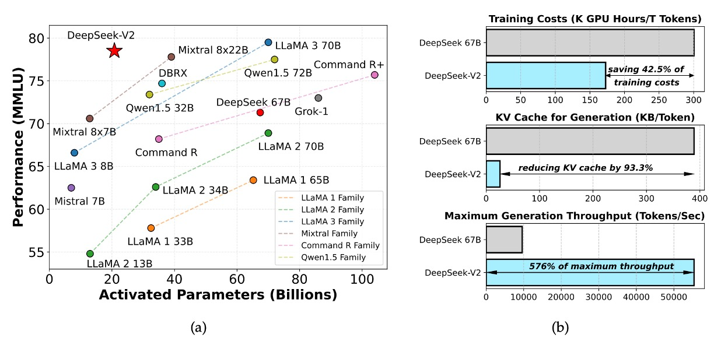

## 開源節流

[**DeepSeek-V2: A Strong, Economical, and Efficient Mixture-of-Experts Language Model**](https://arxiv.org/abs/2405.04434)

---

以前の論文ではMoEの効果を試す予定が述べられており、3ヶ月も経たないうちにこの論文が登場しました。

この論文は52ページに及び、大量の実験データと技術的詳細が含まれていますので、いつも通り重要なポイントを取り上げます。

:::info
以前はノート内で著者を「著者」と呼んでいましたが、この論文には多くの研究者が関与しており、異なる小さなチームが異なる機能と章を担当しているため、このノートでは著者を「研究チーム」と呼びます。
:::

:::warning
数学警告：本論文の主な焦点はモデルモジュールの最適化にあり、その中には大量の数学が含まれていますので、慎重に読んでください。
:::

## 問題の定義

近年、大規模な言語モデルの急速な発展に伴い、パラメータ数の増加は確かにモデルの能力を著しく向上させ、いくつかの「出現能力」を示し、汎用人工知能に向けての希望を見出しました。

しかし、この向上には膨大な計算資源の消費が伴い、トレーニングコストが非常に高く、推論時にも計算とメモリのボトルネックによって効率が低下し、これらのモデルの実際のアプリケーションへの普及と展開が影響を受けています。

そのため、DeepSeek研究チームは計算ボトルネックと効率性の問題に焦点を当て、DeepSeek-V2モデルを提案しました。このモデルは、強力なパフォーマンスを維持しながら、計算効率を向上させ、トレーニングと推論コストを削減することを目指しています。

## 問題の解決

DeepSeek-V2は引き続き標準のTransformer構造を採用しており、各Transformerブロックには注意機構と前向きネットワーク（FFN）が含まれています。
- **注意機構**：研究チームはMLA（Multi-head Latent Attention）を提案し、低ランクのキー・バリュー結合圧縮を用いて、従来のMHAが生成時に直面するKVキャッシュのボトルネック問題を解決しました。
- **前向きネットワーク**：DeepSeekMoE構造を採用しており、コストを抑えつつ強力なモデルをトレーニングする高性能なMixture-of-Expertsモデルです。

その他の詳細（Layer Normalizationや活性化関数など）は、DeepSeek 67Bの設定を踏襲しており、全体の構造設計は以下の図の通りです：

<figure style={{"width": "90%"}}>

</figure>

### Multi-head Latent Attention

<figure style={{"width": "80%"}}>

</figure>

標準の多頭注意機構（MHA）では、以下のように仮定します：
- $d$：埋め込み次元
- $n_h$：注意ヘッド数
- $d_h$：各ヘッドの次元
- $h_t \in \mathbb{R}^{d}$：t番目のトークンの入力表現

3つの投影行列$W_Q$、$W_K$、$W_V$を使って、それぞれクエリ（query）、キー（key）、値（value）を計算します：

$$
\begin{aligned}
q_t &= W_Q h_t\\[1mm]
k_t &= W_K h_t\\[1mm]
v_t &= W_V h_t
\end{aligned}
$$

次に、これらのベクトルは$n_h$個のヘッドに分割され、次のように表されます：
$$
[q_{t,1};\, q_{t,2};\, \dots; \, q_{t,n_h}] = q_t
$$
$$
[k_{t,1};\, k_{t,2};\, \dots; \, k_{t,n_h}] = k_t
$$
$$
[v_{t,1};\, v_{t,2};\, \dots; \, v_{t,n_h}] = v_t
$$

各ヘッドで注意計算を行います：

$$
o_{t,i} = \sum_{j=1}^{t} \text{Softmax}_j\!\left(\frac{q_{t,i}^\top k_{j,i}}{\sqrt{d_h}}\right) v_{j,i}
$$

最終的に出力投影行列$W_O \in \mathbb{R}^{d \times d_h n_h}$を使って、各ヘッドの出力を組み合わせます：

$$
u_t = W_O [o_{t,1};\, o_{t,2};\, \dots; \, o_{t,n_h}]
$$

ここまでが標準的なMHAの計算プロセスです。

しかし、問題は推論段階で、計算を高速化するためにすべてのキーと値をキャッシュする必要があり、これにより各トークンは$2 n_h d_h$個の要素を保存しなければならなくなります。シーケンス長が大きくなると、メモリ消費が二乗的に増加し、深刻なボトルネックとなります。

したがって、MLAの核心は「低ランク圧縮」技術を利用してKVキャッシュを削減することにあります。

具体的な手順は以下の通りです：

1. **キー・バリュー圧縮**：各トークンについて、その圧縮後の潜在表現を計算します：

   $$
   c_{KV,t} = W_{DKV} h_t
   $$

   ここで、$c_{KV,t} \in \mathbb{R}^{d_c}$、$d_c \ll d_h n_h$であり、$W_{DKV} \in \mathbb{R}^{d_c \times d}$は下方向の投影行列です。

2. **上方向投影によるキーと値の復元**：圧縮された表現からキーと値を復元します：

   $$
   k_C,t = W_{UK} c_{KV,t}
   $$

   $$
   v_C,t = W_{UV} c_{KV,t}
   $$

   ここで、$W_{UK}$と$W_{UV}$はキーと値の上方向の投影行列で、そのサイズは$\mathbb{R}^{d_h n_h \times d_c}$です。

推論時には、$c_{KV,t}$のみをキャッシュすればよく、各トークンは$d_c$個の要素のみを保存することで、メモリ消費を大幅に削減できます。

また、$W_{UK}$は$W_Q$と統合して吸収でき、$W_{UV}$は$W_O$と統合して吸収できるため、実際の注意計算ではキーと値を別途計算する必要はありません。

最後に、トレーニング時の活性化メモリを削減するために、研究チームはクエリベクトルにも同様の低ランク圧縮を実施しました：

$$
c_{Q,t} = W_{DQ} h_t
$$

$$
q_C,t = W_{UQ} c_{Q,t}
$$

ここで、$c_{Q,t} \in \mathbb{R}^{d'_c}$はクエリの圧縮表現で、$d'_c \ll d_h n_h$です。

### 解耦旋回位置埋め込み

Rotary Position Embedding（RoPE）は、Transformerに位置情報を導入する方法の一つであり、キーとクエリの両方が位置に敏感であるという特徴があります。低ランク圧縮の場合、もし圧縮後のキー$k_C,t$にRoPEを直接適用すると、上投影行列$W_{UK}$と位置情報が結びつき、前に行った吸収合併最適化を破壊してしまいます。その結果、推論時には前のトークンに対してキーを再計算しなければならなくなります。

:::tip
ちょっと、これどういう意味か分からない？

大丈夫、簡単にしましょう。例えば、10人の名前を1つの名前に圧縮する場合を考えてみてください。

最初、10人の名前（例えば「小明、阿華、小美、阿強……」）にはそれぞれ順番がありました。スペースを節約するために、これら10人の名前を1つにまとめて「明華美強……」という名前に圧縮することにしました。これをすることで、メモリの使用を減らし、管理が簡単になります。

しかし、もしこの圧縮後の名前に元々の順番の情報を付け加えると、その名前と位置情報が密接に結びついてしまいます。

結果として、もし新しい名前を追加したり、前の名前の順番を確認したりするたびに、圧縮された名前を一度分解して、元の順番を再計算しなければならなくなります。これでは、最初に圧縮したメリットが失われ、後の処理が煩雑になってしまいます。

TransformerでRoPEを使うのは、このような状況に似ています。RoPEはキーとクエリに位置情報を追加するための方法ですが、もし既に圧縮された（低ランク圧縮された）キーにRoPEを適用すると、圧縮された名前に位置情報を加えるようなものです。こうなると、上投影行列（後続処理ツール）は位置情報と絡み合ってしまい、推論時に新しいトークンが追加されるたびに、前のすべてのトークンのキーを再計算しなければならなくなります。これでは効率が低下し、最初の圧縮による利便性が損なわれます。
:::

研究チームはここで、RoPEの位置情報を解耦する戦略を提案しています。具体的な方法は次の通りです：

RoPEの位置情報を持つために、追加の多頭クエリ$q_{R,t,i} \in \mathbb{R}^{d^R_h}$と共有のキー$k_{R,t} \in \mathbb{R}^{d^R_h}$を導入します。

次に、それぞれを計算します：

$$
[q_{R,t,1};\, q_{R,t,2};\, \dots; \, q_{R,t,n_h}] = q_{R,t} = \text{RoPE}(W_{QR} c_{Q,t})
$$

$$
k_{R,t} = \text{RoPE}(W_{KR} h_t)
$$

ここで、$W_{QR} \in \mathbb{R}^{d^R_h n_h \times d'_c}$と$W_{KR} \in \mathbb{R}^{d^R_h \times d}$は、解耦されたクエリとキーを生成するための行列です。

最終的に、圧縮部分と解耦部分を接続します：

$$
q_{t,i} = [q_{C,t,i};\, q_{R,t,i}]
$$

$$
k_{t,i} = [k_{C,t,i};\, k_{R,t}]
$$

そして、注意計算を行います：

$$
o_{t,i} = \sum_{j=1}^{t} \text{Softmax}_j\!\left(\frac{q_{t,i}^\top k_{j,i}}{\sqrt{d_h + d^R_h}}\right) v_{C,j,i}
$$

最後に、$W_O$を使って各ヘッドの出力を組み合わせます：

$$
u_t = W_O [o_{t,1};\, o_{t,2};\, \dots; \, o_{t,n_h}]
$$

この設計により、RoPEの位置情報と低ランク圧縮部分が解耦され、位置埋め込みの利点を保持しつつ、前の吸収行列の最適化を損なうことなく、推論プロセスで前のトークンのキーを再計算する必要がなくなります。

### DeepSeekMoE

<figure style={{"width": "80%"}}>

</figure>

従来のMoEモデルとは異なり、DeepSeekMoEは専門家をより細かく分割します：FFNモジュールを2つの部分に分けます。

- **共有専門家（Shared Experts）**：固定数の専門家で、各トークンはこの部分の知識を利用します。
- **ルーティング専門家（Routed Experts）**：動的に一部の専門家を選択して計算に参加させます。

$t$番目のトークンに対して、そのFFN入力は$u_t$であり、最終的なFFN出力$h'_t$は以下のように定義されます：

$$
h'_t = u_t + \sum_{i=1}^{N_s} \text{FFN}^{(s)}_i(u_t) + \sum_{i=1}^{N_r} g_{i,t} \,\text{FFN}^{(r)}_i(u_t)
$$

ここで：
- $N_s$は共有専門家の数、
- $N_r$はルーティング専門家の数、
- $\text{FFN}^{(s)}_i(\cdot)$と$\text{FFN}^{(r)}_i(\cdot)$は、それぞれ第$i$個の共有専門家とルーティング専門家の前向き計算を表します。

ルーティング専門家の選択は、以下のようなゲーティング機構に依存します：

$$
g_{i,t} =
\begin{cases}
s_{i,t}, & \text{もし} \, s_{i,t} \in \text{Topk}(\{ s_{j,t} \mid 1 \le j \le N_r\}, K_r),\\[1mm]
0, & \text{それ以外の場合},
\end{cases}
$$

ここで$K_r$は活性化されたルーティング専門家の数、$s_{i,t}$はトークンと第$i$個のルーティング専門家との親和スコアで、計算方法は以下の通りです：

$$
s_{i,t} = \text{Softmax}_i\bigl(u_t^\top e_i\bigr)
$$

ここで$e_i$は第$i$個のルーティング専門家の「中心」ベクトルを示し、その専門家の特徴の中心を表します。

MoEモデルでは、専門家が複数のデバイスに分散されている場合、各トークンのルーティング決定にはデバイス間通信が必要になることがあります。もし活性化された専門家が多い場合、追加の通信コストが発生します。このコストを管理するために、DeepSeekMoEは**デバイス制限付きルーティング**メカニズムを採用しています：

1. 各トークンについて、まず全てのデバイスから$M$個の最も高い親和スコアを持つデバイスを選びます。
2. 次に、その$M$個のデバイス内でTop-K専門家を選択します。

実験結果によると、$M \ge 3$の場合、この制限はデバイス間通信を大幅に削減し、制限なしのTop-K選択と同等のパフォーマンスを達成できることが確認されました。

この戦略の核心は、モデルのルーティング品質とデバイス間の通信負担をバランスよく調整することで、大規模分散環境において高い計算効率を実現することにあります。

:::tip
Mixture-of-Experts（MoE）にあまり馴染みがない方は、以前のノートを参考にしてください：

- [**[21.01] Switch Transformer: 専門家に話をさせる**](../../transformers/2101-switch-transformer/index.md)
:::

### 補助バランス損失

MoEモデルでは、特定の専門家が過剰に活性化される（または完全に使用されない）問題が発生しやすく、これが「ルーティング崩壊」を引き起こすだけでなく、計算効率も低下させます。これに対処するために、DeepSeekMoEは負荷均衡を促進するための3つの補助的な損失関数を設計しました：

1. **専門家レベルのバランス損失（Expert-Level Balance Loss）**

    $$
    L_{ExpBal} = \alpha_1 \sum_{i=1}^{N_r} f_i\, P_i
    $$

    ここで、

    $$
    f_i = \frac{1}{K_r\,T} \sum_{t=1}^{T} 1(\text{Token } t \text{ が Expert } i を選択した場合)
    $$

    $$
    P_i = \frac{1}{T} \sum_{t=1}^{T} s_{i,t}
    $$

    - $T$ はシーケンス内のトークンの総数、
    - $1(\cdot)$ は指示関数、
    - $\alpha_1$ は損失の重みを調整するためのハイパーパラメータです。

    この損失関数は、各ルーティング専門家の活性化頻度と平均親和スコアがバランスを保つように設計されています。

---

2. **デバイスレベルのバランス損失（Device-Level Balance Loss）**

    すべてのルーティング専門家を$D$組（各$E_i$は同じデバイス上に配置）に分け、損失を次のように定義します：

    $$
    L_{DevBal} = \alpha_2 \sum_{i=1}^{D} f'_i\, P'_i
    $$

    ここで、

    $$
    f'_i = \frac{1}{|E_i|} \sum_{j \in E_i} f_j
    $$

    $$
    P'_i = \sum_{j \in E_i} P_j
    $$

    - $\alpha_2$ はデバイスレベルのバランスのためのハイパーパラメータです。

    これは、異なるデバイス間で計算負荷のバランスを取るために役立ち、特定のデバイスが過負荷になりボトルネックになるのを防ぎます。

---

3. **通信バランス損失（Communication Balance Loss）**

    デバイス制限付きルーティングを採用しても、特定のデバイスが他のデバイスよりも多くのトークンを受信する場合、通信効率に影響を与える可能性があるため、次の損失関数を導入します：

    $$
    L_{CommBal} = \alpha_3 \sum_{i=1}^{D} f''_i\, P''_i
    $$

    ここで、

    $$
    f''_i = \frac{D}{M\,T} \sum_{t=1}^{T} 1(\text{Token } t \text{ がデバイス } i \text{ に送信された場合})
    $$

    $$
    P''_i = \sum_{j \in E_i} P_j
    $$

    - $\alpha_3$ は通信バランスのためのハイパーパラメータです。

    この設計は、各デバイス間の通信量が近くなるように促し、デバイス間での計算調整効率を向上させます。

---

最後に、バランス損失に加えて、研究チームは**デバイスレベルのトークン廃棄戦略**を導入し、負荷不均衡による計算浪費をさらに軽減しました。具体的な方法は次の通りです：

1. 各デバイスの平均計算予算を計算し、各デバイスの容量係数が1.0になるようにします。
2. 各デバイス上で親和スコアが最も低いトークンを廃棄し、計算予算に達するまで続けます。
3. トレーニングシーケンスの約10％に該当するトークンは、決して廃棄されないようにします。

これにより、推論過程でトークンを廃棄するかどうかを効率要件に応じて柔軟に決定でき、トレーニングと推論の一貫性を常に保つことができます。

### 訓練戦略

論文では、DeepSeek 67Bと同じデータ処理フローが保持されていますが、以下の改善が行われました：

- **データ量の拡大：** データクリーンアッププロセスを最適化し、以前に誤って削除された大量のデータを復元しました。
- **データ品質の向上：** より多くの高品質なデータ、特に中国語のデータ（中国語のトークンは英語より約12%多い）を追加しました。同時に、品質に基づくフィルタリングアルゴリズムも改善され、大量の無駄な情報を除去し、価値のあるコンテンツを保持しました。
- **論争的なコンテンツのフィルタリング：** この戦略は、特定の地域文化からの偏見を減らすことを目的としています。

TokenizerはDeepSeek 67Bと同じByte-level Byte-Pair Encoding（BBPE）アルゴリズムを使用し、語彙サイズは100Kに設定され、最終的な事前学習コーパスは8.1Tトークンを含んでいます。

モデルのハイパーパラメータ設定は次の通りです：

- Transformer層数：60層
- 隠れ層の次元：5120
- すべての学習可能なパラメータのランダム初期化時の標準偏差は0.006に設定
- **MLA関連：**
    - 注意ヘッド数$n_h$は128に設定
    - 各ヘッドの次元$d_h$は128
    - KV圧縮次元$d_c$は512
    - クエリ圧縮次元$d'_c$は1536
    - 解耦されたクエリとキーの各ヘッド次元$d^R_h$は64

MoE層の設定は次の通りです：最初の層を除き、残りのFFN層はすべてMoE層に置き換えられています。

- 各MoE層には2つの共有専門家と160のルーティング専門家が含まれています
- 各専門家の中間隠れ次元は1536
- 各トークンは6つのルーティング専門家を活性化
- 低ランク圧縮と細粒度な専門家分割が層出力に与える影響に対応するため、論文ではRMS Norm層と追加のスケーリングファクターを導入し、訓練の安定性を確保

最終的に、DeepSeek-V2の総パラメータ数は236Bに達しますが、各トークンで活性化されるパラメータは21Bにとどまります。

訓練のハイパーパラメータは次の通りです：

- オプティマイザ：AdamW、ハイパーパラメータ$\beta_1=0.9$、$\beta_2=0.95$、weight_decay=0.1
- 学習率スケジューリング：最初の2000ステップで線形増加、その後、予め定めた割合（約60％と90％のトークン数）でそれぞれ0.316を掛ける、最大学習率2.4×10⁻⁴
- 勾配クリッピングは1.0に設定
- バッチサイズは段階的に調整され、2304から9216に増加、その後は9216を維持
- 最大シーケンス長は4Kに設定し、8.1Tトークンで訓練
- その他の並列化設定：
    - パイプライン並列化を利用して異なる層を異なるデバイスにデプロイ
    - ルーティング専門家は8つのデバイスに均等にデプロイ（$D=8$）
    - デバイス制限付きルーティングは各トークンが最大3台のデバイスに送信されるように設定（$M=3$）
    - 補助バランス損失のハイパーパラメータはそれぞれ$\alpha_1=0.003$、$\alpha_2=0.05$、$\alpha_3=0.02$に設定
    - 訓練中にトークン廃棄戦略を使用して加速し、評価時にはトークンを廃棄しない

---

初期事前学習が完了した後、研究チームはYaRNメソッドを使用して、モデルのデフォルトのコンテキストウィンドウを4Kから128Kに拡張しました。

特に、RoPEを運ぶための解耦共有キー$k^R_t$に対して拡張を行い、パラメータを次のように設定しました：スケール$s=40$、$\alpha=1$、$\beta=32$、最大コンテキスト長は160Kに設定されました。

ユニークな注意機構に適応するため、長さスケーリングファクターを調整し、$\sqrt{t}$の計算式は次のように設定しました：

$$
\sqrt{t} = 0.0707 \ln s + 1
$$

これにより、perplexityの最小化を目指しました。

長いコンテキストの拡張段階では、追加で1000ステップ訓練し、シーケンス長を32Kに設定、バッチサイズを576シーケンスに設定しました。訓練時は32Kの長さを使用しましたが、評価時には128Kのコンテキスト長で強力な性能を発揮しました。「Needle In A Haystack」（NIAH）テストによると、モデルはさまざまなコンテキスト長で良好なパフォーマンスを示しました。

## モデルのアライメント

モデルが人間の好みにより適合し、回答の正確性と満足度を向上させるために、著者は強化学習を用いた調整を行いました。ここで使用されているのは、Group Relative Policy Optimization（GRPO）アルゴリズムであり、その主な利点はトレーニングコストの節約です。なぜなら、このアルゴリズムでは、戦略モデルと同じ規模の批評家モデルを必要とせず、代わりにグループスコアを用いてベースラインを推定します。

強化学習のトレーニング戦略は2つの段階に分かれています：

- **第一段階：推論アライメント（Reasoning Alignment）**

    この段階では、著者はプログラミングや数学などの推論タスクに特化した報酬モデル $R_{\text{Mreasoning}}$ をトレーニングします：

    $$
    r_i = R_{\text{Mreasoning}}(o_i)
    $$

    これにより、モデルはこの種のタスクにおいて問題解決能力を向上させ続けることができます。

- **第二段階：人間の好みアライメント（Human Preference Alignment）**

    この段階では、複数の報酬フレームワークが使用され、3つの側面から報酬を得ます：
    - 助けとなる報酬モデル $R_{\text{Mhelpful}}$
    - 安全性報酬モデル $R_{\text{Msafety}}$
    - 規則ベース報酬モデル $R_{\text{Mrule}}$

    最終的に、ある応答 $o_i$ に対する報酬値は次のように計算されます：

    $$
    r_i = c_1 \cdot R_{\text{Mhelpful}}(o_i) + c_2 \cdot R_{\text{Msafety}}(o_i) + c_3 \cdot R_{\text{Mrule}}(o_i)
    $$

    ここで $c_1, c_2, c_3$ はそれぞれの係数です。この多報酬設計により、モデルは応答を生成する際に複数の品質指標を同時に考慮することができます。

信頼性のある報酬信号を得るために、研究チームは大量の好みデータを収集しました：
- プログラミングタスクの好みデータはコンパイラのフィードバックに基づいています。
- 数学タスクのデータは実際のラベルに基づいています。

報酬モデルの初期化には、DeepSeek-V2 Chat (SFT) の結果が使用され、ペアワイズ損失またはポイントツーポイント損失を用いて訓練されました。

## 討論

篇幅の関係で、ここではAlignBenchの結果を見てみましょう。その他の実験結果に興味がある方は、元の論文を参照してください。

<figure style={{"width": "90%"}}>

</figure>

表は、AlignBenchでの各モデルの総合的なパフォーマンスに基づいた得点順に並べられています。得点が高いモデルほど上位にランクインしており、これが中国語での対話生成や理解などのタスクにおける総合的な能力を反映しています。評価はGPT-4‑0613によって行われ、この強力なモデルが基準として使用され、各モデルの生成結果の品質とコンテキストの関連性が測定されました。

実験結果によると、中国語生成タスクにおいて、DeepSeek‑V2 Chat (RL)は(SFT)よりわずかに優れており、すべての他のオープンソースの中国語モデルを大きく上回っています。特に中国語の推論と語学能力においては、2位のQwen1.5 72B Chatを大きく凌駕しています。

中国語理解能力においては、DeepSeek‑V2 Chat (RL)はGPT‑4‑Turbo‑1106‑Previewを超える性能を発揮しています。しかし、推論能力においては、DeepSeek‑V2 Chat (RL)は一部の巨大モデル（例：Erniebot‑4.0やGPT‑4）に対して劣っています。

これらの評価結果は、DeepSeek‑V2 Chatモデルが異なる調整戦略において優れたパフォーマンスを示すことを示しています。RL微調整を通じて、英語対話生成において顕著な優位性を発揮し、中国語理解においても非常に高い水準を示していますが、いくつかの推論タスクにはまだ改善の余地があります。これにより、このモデルは高品質で指示的な対話生成において強い競争力を持つことが確認され、今後の改善方向も明確になりました。

## 結論

<figure style={{"width": "90%"}}>

</figure>

DeepSeek‑V2はMoEアーキテクチャに基づいた大規模言語モデルで、最大128Kのコンテキスト長をサポートします。

このモデルは次の2つの革新的な技術を活用しています：

  - **Multi-head Latent Attention：** 低ランクのキー・バリュー結合圧縮を通じて、推論時のKVキャッシュの要求を大幅に削減し、推論効率を向上させました。
  - **DeepSeekMoE：** 細粒度な専門家分割と共有専門家の設計を通じて、低コストで強力なモデルを訓練する目標を達成しました。

前のバージョンDeepSeek LLM 67Bと比較して、DeepSeek‑V2は以下の点で優れています：
  - **トレーニングコスト**は42.5％削減
  - **KVキャッシュ**は93.3％削減
  - **生成スループット**は5.76倍向上

全体のパラメータ数は236Bに達しますが、各トークンで活性化されるパラメータは21Bにとどまり、モデルは経済性とパフォーマンスの間で優れたバランスを達成しています。これにより、現在のオープンソースMoEモデルの中で最強のパフォーマンスを持つモデルの1つとなっています。