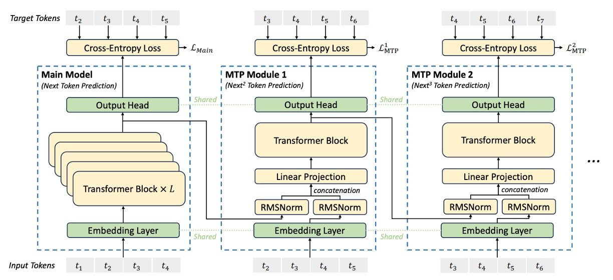
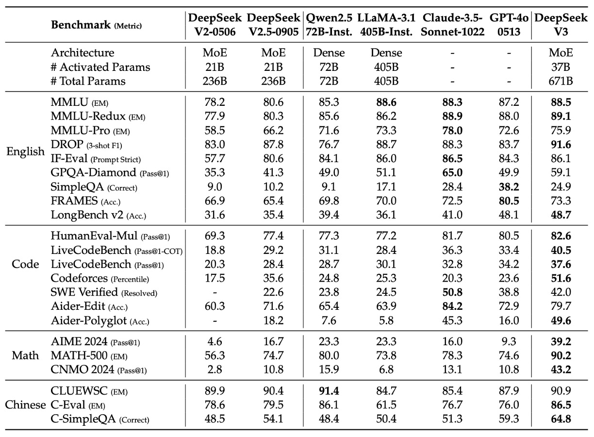
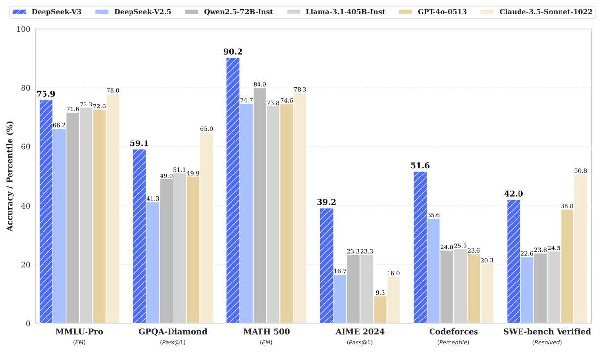

## 専門家の遠見

[**DeepSeek-V3 Technical Report**](https://arxiv.org/abs/2412.19437)

---

あっという間に第三世代に達しました。

以前の研究チームが行ってきたことを簡単に振り返ってみましょう。

## 問題の定義

第一世代、つまり DeepSeek LLM は LLaMA アーキテクチャを採用し、独自のスケーリング法則を提案しました。何度かのテストを経て、最適な式をフィッティングしました。

第二世代、つまり DeepSeek-V2 は前世代の成果を基に、DeepSeekMoE アーキテクチャとマルチヘッド潜在注意機構（MLA）を導入し、素晴らしい結果を得ました。

今、もちろん過去の成功を継承する必要があります。

研究チームは第三世代のアーキテクチャでモデルの規模を約 1 倍大きくし、さらに大きなモデルを作ることを計画しています。

ただし、単に規模を拡大するだけでは論文としての新しい価値はありません。もっと何かを加えなければなりません。

そのため、この論文ではいくつかの新しい改善点が提案されています。

1. 専門家システムをより安定させるために、補助的な損失関数戦略を調整する。
2. 各トークンの情報密度を圧縮するために、より多くの予測ターゲットを提供する。
3. 訓練に FP8 混合精度を導入し、より効率的な並列化アルゴリズムを実現する。

以前と同様の部分については繰り返しませんので、これらの改善点に関する詳細を見ていきましょう。

:::tip
前世代のモデル技術の詳細について知りたい方は、以下のノートを参考にしてください：

- [**[24.01] DeepSeek LLM: 新しいモデルスケーリング法則**](../2401-deepseek-llm/index.md)
- [**[24.05] DeepSeek-V2: 開源節流**](../2405-deepseek-v2/index.md)
  :::

## 問題の解決

DeepSeek-V3 の全体アーキテクチャは引き続き Transformer を基盤にしていますが、訓練コストと推論効率を最適化するために、主に MLA と DeepSeekMoE の 2 つのモジュールにおいて改良が加えられています。

1. **マルチヘッド潜在注意（MLA）**：低ランク圧縮を用いて、キー・バリュー（KV）キャッシュのメモリ消費を削減します。
2. **DeepSeekMoE と補助損失なしの戦略**：細粒度な専門家分岐アーキテクチャを利用し、動的調整メカニズムを設計して各専門家の負荷バランスを維持します。追加の補助損失は必要ありません。

MLA は推論効率を向上させ、DeepSeekMoE は訓練コストを削減します。

これらの 2 つの部分は DeepSeek-V2 で既に見たことがあるので、ここでは触れません。

---

今回注目したいのは、補助損失なしの戦略です。

DeepSeek-V2 では、「補助損失戦略」について詳しく説明されていました。伝統的な MoE モデルは、ルーティングの不均衡（routing collapse）を避けるために補助損失を使用しますが、過度な補助損失はモデルのパフォーマンスに悪影響を与え、調整には経験が必要です。

半年後、この論文では研究チームが「これ、もう使わない！」と言っています。

### 補助損失なしの戦略

原文では Auxiliary-Loss-Free Load Balancing と呼ばれています。

補助損失なしの戦略では、各専門家にバイアス項 $b_i$ を追加し、それを対応する親和性（affinity）スコアに加えて、Top-$K_r$ ルーティングを決定します：

$$
g'_{i,t} =
\begin{cases}
s_{i,t}, & s_{i,t} + b_i \in \text{Topk}(\{ s_{j,t} + b_j \,|\, 1 \le j \le N_r \}, K_r), \\
0, & \text{それ以外}。
\end{cases}
$$

このバイアス項はルーティング決定にのみ使用され、ゲート値の計算には元の $s_{i,t}$ が基準となります。

各訓練ステップ終了時に、各専門家の負荷状況に応じて、もし専門家が過負荷の場合は $b_i$ を $\gamma$ 減少させ、不足している場合は $\gamma$ 増加させます（$\gamma$ はバイアス更新速度の超パラメータ）。

このようにして、補助損失を追加することなく負荷バランスを維持し、過剰な補助損失がモデルのパフォーマンスに与える負の影響を回避します。

極端な不均衡を防ぐために、研究チームはシーケンスレベルでの補助損失も導入しました：

$$
L_{Bal} = \alpha \sum_{i=1}^{N_r} f_i P_i
$$

ここで：

$$
f_i = \frac{1}{K_r T} \sum_{t=1}^{T} 1\{ s_{i,t} \in \text{Topk}(\{ s_{j,t} \,|\, 1 \le j \le N_r \}, K_r) \}
$$

$$
s'_{i,t} = \frac{s_{i,t}}{\sum_{j=1}^{N_r} s_{j,t}}
$$

$$
P_i = \frac{1}{T} \sum_{t=1}^{T} s'_{i,t}
$$

- $T$ はシーケンス中のトークンの数、
- $1(\cdot)$ は指示関数、
- $\alpha$ は非常に小さな超パラメータ。
  この損失は、各シーケンス内で専門家のルーティング分布がバランスを保つことを促進します。

ノード間通信コストを削減するために、システムは各トークンが最大で $M$ 個のノードにのみルーティングされるよう制限します（各ノードで最も高い $K_r^M$ の親和性スコアに基づいて決定）。

最終的に、負荷バランス戦略が有効であるため、DeepSeek-V3 は訓練および推論時にトークンを捨てることなく動作します。

:::tip
**従来の方法**：専門家レベル、デバイスレベル、通信バランス損失を通じて、各専門家間の活性化頻度と親和性スコアのバランスを維持しますが、これらの損失には追加の超パラメータ調整が必要です。

**本論文の方法**：各訓練ステップ終了時に、専門家の負荷状況に応じて動的にバイアス項 $b_i$ を更新します。過負荷の専門家には $b_i$ を減少させ、不足している専門家には $b_i$ を増加させます。この調整により、ルーティングがより均衡を取ることができ、追加の損失による「罰」を使う必要はありません。
:::

### Multi‑Token Prediction

<div align="center">
<figure style={{"width": "90%"}}>

</figure>
</div>

DeepSeek-V3 は、新しい訓練目標を導入し、モデルが各位置で順番に複数の未来のトークンを予測できるようにしました。

この戦略には 2 つの主な利点があります：

- **訓練信号がより密集している：** 各位置で複数の予測目標が同時に生成されるため、データの利用効率が向上します。
- **未来のトークンを見越した表現：** モデルは層ごとに予測を行い、その内部表現を調整することで、未来のトークン生成をより予測的で正確にします。

従来の文献で使用されている並列独立出力ヘッドとは異なり、MTP は逐次予測の方法を採用し、各予測深度で完全な因果関係を維持します。

MTP の全体目標は、$D$個の順序モジュールで構成され、各モジュールは 1 つの追加トークンを予測し、主モデルと埋め込み層および出力ヘッドを共有します。各 MTP モジュールは以下のコンポーネントを含みます：

- **共有埋め込み層 Emb(·)：**
  主モデルと共有され、トークンの埋め込み表現を取得します。

- **共有出力ヘッド OutHead(·)：**
  Transformer モジュールの出力を logits にマッピングし、Softmax で予測確率に変換します。

- **Transformer ブロック $TRM_k(\cdot)$：**
  第$k$予測深度で情報をさらに処理します。

- **投影行列 $M_k \in \mathbb{R}^{d \times 2d}$：**
  前の層の表現と未来のトークンの埋め込みを線形に組み合わせて、$d$次元空間に戻します。

第$i$個の入力トークン$t_i$について、第$k$予測深度では、まず前の層からの表現$h^{(k-1)}_i \in \mathbb{R}^d$（$k=1$の場合、$h^{(0)}_i$は主モデルの出力）とトークン$t_{i+k}$の埋め込み$Emb(t_{i+k}) \in \mathbb{R}^d$を取得し、これら 2 つのベクトルに対して RMSNorm で正規化後、連結し、投影行列$M_k$で線形変換します：

$$
h'^{(k)}_i = M_k\,[\text{RMSNorm}(h^{(k-1)}_i);\, \text{RMSNorm}(Emb(t_{i+k}))]
$$

このステップは、前の層からの表現と未来のトークンの情報を統合し、第$k$層の予測により豊かな入力特徴を提供します。

上記の統合された表現$h'^{(k)}_i$を専用の Transformer ブロック$TRM_k(\cdot)$に入力し、更新された表現を生成します：

$$
h^{(k)}_{1:T-k} = TRM_k(h'^{(k)}_{1:T-k})
$$

ここで$T$は入力シーケンスの長さです。予測深度が 1 つ増えるごとに処理範囲が$k$個のトークン分短縮され、各予測には対応する正解ラベルが用意されることを確保します。

共有出力ヘッドを使用して、Transformer ブロックの出力表現を予測分布にマッピングし、第$i+k+1$個目のトークンの予測を生成します：

$$
P^{(k)}_{i+k+1} = \text{OutHead}(h^{(k)}_i)
$$

ここで$P^{(k)}_{i+k+1} \in \mathbb{R}^{V}$は予測確率分布（$V$は語彙サイズ）で、logits に線形マッピングされ、Softmax を通して得られます。

マルチレベル予測を指導するために、各予測深度$k$には交差エントロピー損失が定義されます。第$k$層の予測における損失は以下のように計算されます：

$$
L^{(k)}_{MTP} = \text{CrossEntropy}(P^{(k)}_{2+k:T+1},\, t_{2+k:T+1})
= -\frac{1}{T}\sum_{i=2+k}^{T+1} \log P^{(k)}_i[t_i]
$$

ここで$t_i$は第$i$個のトークンの正解ラベルで、$P^{(k)}_i[t_i]$はそのトークンに対する第$k$層の予測確率です。損失は$i=2+k$から計算を開始し、各予測層がその後の正解トークンに対応することを確保します。

すべての$D$個の予測深度の損失を平均し、重み係数$\lambda$を掛け合わせて、全体の MTP 損失を得ます：

$$
L_{MTP} = \frac{\lambda}{D}\sum_{k=1}^{D} L^{(k)}_{MTP}
$$

この総損失は追加の訓練目標として、主モデルの損失と共に逆伝播され、モデルが生成過程でより前向きな表現を学習するよう促します。

MTP モジュールは、訓練時のデータ利用率と予測能力を向上させることを主な目的としており、複数の損失を通じてモデルに未来のトークンを「計画」させます。

推論段階では MTP モジュールを省略して、主モデルを独立して運用することもできます。また、MTP モジュールを再利用して、生成遅延を減らすために speculative decoding を行うことも可能です。

:::tip
論文には多くの数学的な記述がありますが、もし Transformer に不慣れだと、少し難しく感じるかもしれません。

実際、これはモデルを使って文字リレーションのような方法で訓練するというコンセプトから外れていません。

例えば、もし元々モデルに与える問題が：

> 「私は今日、\_\_を食べました。」
>
> ここで「夕食」と答えればよいだけです。

このような訓練方法では、モデルは毎回「次の単語を予測する」練習だけをするので、試験の問題が 1 つしかなく、学習効率が限られます。

しかし、DeepSeek-V3 の**マルチトークン予測（MTP）**では、次のように問題の出題方法が変わります：

> 同じ文章「私は今日、\_\_を食べました。」を与えて、今度は次の 3 つの単語を予測してください：「夕食」、「とても美味しい」、「でもお腹いっぱい」。

ここでは 3 つの単語を一度に予測するのではなく、**第一層が最初の単語を予測し、第二層が二番目の単語を予測し、第三層が三番目の単語を予測する**というように、各層は前の層の答えを考慮して予測を修正していきます。

この訓練方法には 2 つの大きな利点があります：

1. **練習できる問題が増える：** 1 つの文中の各単語が連続した予測タスクを引き起こすので、モデルは同じテキスト内で何度も練習します。
2. **計画を学べる：** モデルは現在の単語だけでなく、次のいくつかの単語をどう繋げるかを考慮するため、「脳内で文章全体を並べる」ような内部の思考ができるようになります。

この方法により、モデルは訓練段階で「前もって計画し修正する方法」を学ぶことができ、生成過程でエラーが出るまで後悔することがなくなります。生成の品質と効率に実質的な効果があります。
:::

## Infrastructures

:::info
**本節は論文の中で多くのページを占め、主に訓練環境のソフトウェアとハードウェア設置方法を教えています。ただし、論文の読み方としてはソフトウェア面に重点を置いているため、ここではこの章を簡単に紹介します。もし、手元に少しの予算（おそらく 1 億ドル？）があり、この環境を構築する意向があれば、原論文を直接読んでください。**
:::

DeepSeek‑V3 が成功裏に訓練される背景には、先進的なハードウェアプラットフォームと効率的な訓練フレームワークがあります。

本節では、計算クラスタ、訓練フレームワーク、低精度 FP8 訓練、推論とデプロイ、そして今後のハードウェア設計提案の 5 つの部分に分けて紹介します：

- **計算クラスタ：**

  DeepSeek‑V3 の訓練プラットフォームは、超大規模な GPU クラスタに依存しています：

  - **ハードウェア規模：**
    クラスタには 2048 個の NVIDIA H800 GPU が配置され、各ノードには 8 つの GPU が搭載されています。
  - **内部インターコネクト：**
    ノード内の GPU は NVLink および NVSwitch を使って高速接続され、内部データ交換の遅延が非常に低く保たれています。
  - **ノード間通信：**
    ノード間は InfiniBand (IB) インターコネクトを使用し、高帯域幅かつ低遅延の特性を提供します。これにより、大規模並列計算環境下でもノード間でリアルタイムにデータを共有できます。

    ***

- **訓練フレームワーク：**

  これほどのハードウェアリソースを最大限に活用するために、研究チームは独自に開発した HAI-LLM 訓練フレームワークを採用しました。このフレームワークは、いくつかの先進的な並列戦略を組み合わせています：

  - **パイプライン並列（Pipeline Parallelism, PP）：**
    モデルを複数の段階に分解し、16 路のパイプライン並列で実行します。パイプライン内の空白（pipeline bubbles）を埋めるため、研究チームは革新的な DualPipe アルゴリズムを提案し、前向き計算と逆伝播計算を通信と効果的に重ね合わせました。
  - **専門家並列（Expert Parallelism, EP）：**
    MoE モデル内の専門家モジュールに対して、DeepSeek‑V3 は 64 路、あるいはそれ以上の規模で専門家並列を採用し、各専門家に十分なバッチサイズを確保して計算効率を高めました。
  - **データ並列（Data Parallelism, DP）：**
    ZeRO-1 技術を導入し、大規模データの処理負荷を分散し、モデルパラメータを異なる計算ノードに分配することでメモリ負荷を効果的に削減しました。

  また、DualPipe アルゴリズムの核心は、各計算チャンクを attention、all-to-all dispatch、MLP および combine の 4 つの部分に分割し、前向きおよび逆伝播の過程で通信と計算を巧妙に重ね合わせることで、ノード間の通信遅延をほぼ完全に隠蔽しました。

  ***

- **低精度 FP8 訓練：**

  大規模なモデル訓練において、計算速度とメモリ占有は常に矛盾する課題です。研究チームは、FP8 混合精度訓練技術を導入することで、コア計算の高速化を実現しました：

  - **コア思想：**
    主な計算（例えば行列積加算 GEMM 操作）は FP8 で実行され、数値の安定性が求められる操作は BF16 または FP32 に保持されます。この方法により計算速度が大幅に向上し、モデル訓練の安定性が保たれます。
  - **細粒度量子化戦略：**
    FP8 の動的範囲の制限に対して、研究者は tile-wise（1×128）および block-wise（128×128）の量子化方法を提案し、活性化値、重み、および勾配における異常値に対応しました。
  - **累積精度の向上：**
    Tensor Cores 上での制限付き累積と CUDA Cores 上での FP32 累積を組み合わせることにより、FP8 GEMM 累積精度不足の問題を効果的に解決し、相対的な損失誤差を 0.25%以下に抑えました。
  - **低精度ストレージと通信：**
    メモリと通信のコストをさらに削減するために、活性化値とオプティマイザ状態も低精度形式で保存および転送され、特に大規模 MoE モデルの訓練には重要です。

  この混合精度ソリューションは、理論的に計算速度を約 2 倍に向上させ、メモリ占有を大幅に削減することで、大規模モデル訓練をより経済的かつ効率的にしました。

  ***

- **推論とデプロイ戦略：**

  DeepSeek‑V3 の推論とデプロイも効率的なハードウェア環境に依存しており、異なるニーズに応じてプロセスは 2 段階に分けられています：

  - **Prefilling 段階：**
    - 配置単位：最小配置単位は 4 ノード（32GPU）。
    - この段階では、Attention 部分は 4 路 TP を組み合わせて Sequence Parallelism と 8 路 DP を使用し、MoE 部分は 32 路 EP を利用します。
    - 各 GPU の負荷を均等化するために冗長な専門家メカニズムを採用し、各 GPU には元の専門家に加えて冗長な専門家を追加で配置します。また、マイクロバッチの重ね合わせ戦略を使用して通信遅延を隠蔽し、スループットを向上させます。
  - **Decoding 段階：**
    - 配置単位：最小配置単位は 40 ノード（320GPU）。
    - この段階の焦点は、低遅延のオンライン推論を実現することにあります。Attention 部分と MoE 部分はそれぞれ TP4、SP、DP80 および EP320 を使用し、冗長な専門家の配置と点対点 IB 通信（IBGDA 技術を組み合わせた）が推論プロセスの効率性を保証します。

  この 2 段階の分担と最適化により、システムは高スループットを維持しつつ、厳格なオンラインサービスの遅延要件も満たすことができます。

  ***

- **今後のハードウェア設計提案：**

  DeepSeek‑V3 の実践経験を基に、研究チームはハードウェア供給業者に以下の改良提案を行いました：

  - **通信ハードウェア：**
    - 今後、通信処理を専用の通信協処理器にオフロードし、IB と NVLink のインターフェースを統一することで、計算リソースを解放し、通信遅延を低減することを提案します。
  - **計算ハードウェア：**
    - FP8 GEMM の累積精度を向上させ、現在 Tensor Cores で発生する 14 ビット累積精度の誤差を解決します。
    - 細粒度量子化（tile-/block-wise 量子化）をネイティブでサポートし、Tensor Cores がスケーリング係数を直接処理できるようにし、Tensor Cores と CUDA Cores 間のデータ移動を減少させます。
    - FP8 キャストと TMA アクセスを統合し、オンライン量子化を実現して、メモリ読み書き回数をさらに削減します。
    - GEMM 操作の転置を直接サポートし、バックプロパゲーション中の活性化値の量子化解除と転置処理を簡素化します。

## 事前訓練

DeepSeek‑V3 は、事前訓練段階において、訓練データの規模をさらに拡大し、データ構築、損失戦略、ハイパーパラメータ設定、そして長いコンテキスト処理においていくつかの革新を行いました。

順番に見ていきましょう：

- **データ構築**

  - **コーパス最適化：**
    DeepSeek‑V2 と比較して、DeepSeek‑V3 は事前訓練コーパスに数学やプログラミングのサンプルの比率を増加させ、さらに多言語対応を拡大し、英語や中国語だけに依存する制限を超えました。
  - **データ処理パイプライン：**
    データ処理の流れが改善され、冗長性が最大限に減少し、コーパスの多様性が確保されました。
  - **ファイルパッケージングと FIM 戦略：**
    過去の文献の方法を参考にし、ファイルパッケージングを使用してデータの完全性を保持しますが、サンプル間の注意機構マスキングは行いません。その上で、Fill-in-Middle（FIM）戦略を導入し、Prefix-Suffix-Middle（PSM）フレームワークを通じてデータを構造化します。形式は以下のようになります：

    ```
    <|fim_begin|> fpre <|fim_hole|> fsuf <|fim_end|> fmiddle <|eos_token|>
    ```

    FIM 戦略は全体コーパスの 0.1 の割合で適用され、モデルに中間テキストの予測を学ばせ、生成能力を向上させます。

  - **Tokenizer 最適化：**
    Byte-level BPE を使用し、語彙数を 128K に拡張して多言語に対応し、句読点や改行符を含んだトークンを追加しました。トークンの境界偏差を解決するため、特定のトークンをランダムに分割し、モデルが特殊なケースに対応できるようにしました。

    ***

- **ハイパーパラメータ設定**

  - **モデル構造：**

    - Transformer 層数は 61 層、隠れ層の次元は 7168、パラメータの標準偏差は 0.006 に初期化。
    - MLA（Multi-Headed Attention）の注意ヘッド数は 128、各ヘッドの次元は 128、KV 圧縮次元は 512、クエリ圧縮次元は 1536、RoPE（Rotary Positional Encoding）の各ヘッド次元は 64。
    - 最初の 3 層 FFN（Feed-Forward Network）以外は、MoE（Mixture of Experts）層に置き換えられます。各 MoE 層は 1 つの共有専門家と 256 のルーティング専門家を含み、各専門家の中間次元は 2048、8 つのルーティング専門家を活性化し、各トークンは最大 4 つのノードに分配されます。
    - マルチトークン予測深度$D$は 1 に設定され、各トークンは次の単語を予測するだけでなく、さらに 1 つの追加トークンを予測します。

  - **訓練パラメータ：**

    - AdamW オプティマイザーを使用し、ハイパーパラメータは$\beta_1=0.9$、$\beta_2=0.95$、weight_decay=0.1 に設定。
    - 事前訓練の最大シーケンス長は 4K、総コーパスは 14.8T トークン。
    - 学習率は段階的にスケジュールされます。最初の 2000 ステップで線形に$2.2 \times 10^{-4}$まで増加し、その後は 10T トークンまで定常を保ち、次に cosine 曲線で$2.2 \times 10^{-5}$に減衰し、最終的に微調整段階に入ります。
    - バッチサイズは訓練が進むにつれて段階的に増加し、初期は 3072 から 15360 に増加、その後は不変です。
    - MoE の負荷分散のため、バイアス更新速度$\gamma$やシーケンスレベルのバランス損失のハイパーパラメータ$\alpha$などが設定され、各トークンは最大 4 つのノードにルーティングされるように確保されます。

    全体設定において、DeepSeek‑V3 の総パラメータ数は 671B であり、各トークンで 37B のパラメータが活性化されます。

    ***

- **長いコンテキストの拡張**

  事前訓練終了後、DeepSeek‑V2 の方法を参考にし、YaRN を使って 2 段階でコンテキストを拡張しました：第一段階ではシーケンス長を 4K から 32K に拡張し、第二段階で 128K にさらに拡張しました。この 2 段階で、バッチサイズと学習率は長いコンテキストの計算ニーズに合わせて調整されました。

  拡張後のモデルは、「Needle In A Haystack」（NIAH）などのテストで顕著な長コンテキスト処理能力を示し、長文の処理時にも安定した優れた性能を保つことが証明されました。

## 事後訓練

事前訓練が完了した後、研究チームは次の微調整および強化学習の段階を通じて、モデルの人間の偏りへの整合能力と生成品質をさらに向上させました。

この段階では、主に監督付き微調整（Supervised Fine-Tuning, SFT）と強化学習（Reinforcement Learning, RL）が行われ、詳細な評価が補助的に行われ、最終的なモデルが多分野で優れた性能を発揮できるように確保されます。

この「事前訓練-整合」アプローチは、現在主流の LLM（大規模言語モデル）の生成フローとなっています。

### 監督付き微調整（SFT）

SFT 段階では、チームは 1.5M のサンプルからなる指示調整データセットを精密に構築し、複数の分野をカバーしています。各分野には特定のデータ生成方法が採用されています：

- **推論データ：**
  数学、プログラミング競技、論理推論などの分野でモデルの能力を高めるために、内部の DeepSeek-R1 モデルを使って推論データを生成しました。しかし、直接生成されたデータには「過度な考慮」や冗長な形式が含まれている可能性があり、そのため、二重データ生成戦略を採用しました：

  - 第一形式は：`<problem, original response>`、元の回答を保持；
  - 第二形式はシステムプロンプト（system prompt）を追加し、形式は：`<system prompt, problem, R1 response>`、プロンプトには反省と検証を促す指示が含まれています。

  その後、専門家モデル（SFT と RL で訓練されたもの）を使って最終的な SFT データを生成し、拒絶サンプリングを用いて高品質サンプルを選定しました。

- **非推論データ：**
  創作、ロールプレイ、簡単な QA などの非推論タスクに関しては、DeepSeek-V2.5 を用いて回答を生成し、その正確性を人工的に確認してデータの品質を保証しました。

- **SFT 訓練設定：**
  微調整過程で、DeepSeek‑V3‑Base は 2 エポックの微調整を行い、学習率は cosine decay を用いて、$5 \times 10^{-6}$から$1 \times 10^{-6}$に減衰させました。また、1 つのシーケンス内で複数のサンプルをパッケージングしますが、サンプル間の干渉を避けるためにサンプルマスキング戦略を使用しました。

### 強化学習（RL）

強化学習部分は、モデルの出力を人間の偏好に合わせることを目的としており、主に 2 種類の報酬モデルと 1 つのグループ相対戦略最適化アルゴリズムを通じて実現されます：

- **報酬モデル（Reward Model, RM）：**
  研究チームは 2 つの報酬モデルを採用しました：

  - **ルールベースの RM：**
    数学や LeetCode などの明確な答えがあるタスクに対して、特定のフォーマット（例えば、答えのボックスに表示）やコンパイラでテストケースを検証し、報酬を与えます。
  - **モデルベースの RM：**
    明確な正しい答えがないタスク（例えば創作）に対して、RM は入力問題と生成された回答を評価し、chain-of-thought 情報を組み合わせて評価を行います。これにより、報酬の不正取得のリスクが減少します。

- **グループ相対戦略最適化（Group Relative Policy Optimization, GRPO）：**

  戦略モデルを更新するために、GRPO は伝統的な critic モデルを使用せず、古い戦略から生成された出力群の中で優位性を計算し、これに基づいて現在の戦略を更新します。

  この方法は戦略の更新をより安定させ、多様な生成結果を十分に活用できるようにします。

  公式として、GRPO の目標関数では、各出力$o_i$の比率調整と clip 操作が行われ、更新プロセスが古い戦略から大きく外れないようにし、KL 散乱ペナルティを導入して一定の制約を維持します。

- **RL 全体フロー：**
  RL 過程では、チームはプログラミング、数学、創作、ロールプレイなどの異なる分野から提示を使用し、モデルが多様な出力を生成します。その後、RM を通じて報酬が与えられます。この過程により、モデルは R1 モデルの生成パターンを統合し、人間の偏好をよりよく満たし、最終的に限られた SFT データで性能を大幅に向上させました。

## 討論

:::tip
さまざまな比較表が多くありますが、興味のある読者は元の論文を参照してください。ここでは重要な図表を取り上げます。
:::

<div align="center">
<figure style={{"width": "90%"}}>

</figure>
</div>

上の表は、複数の標準的なベンチマークにおける各モデルの性能を示しています。このデータから、DeepSeek‑V3 は GPT‑4o と比較して以下のいくつかの顕著な優位性を持っていることがわかります。

1. **英語の知識と長いコンテキストの処理能力：**

   - MMLU および MMLU‑Redux において、DeepSeek‑V3 の性能は GPT‑4o とほぼ同等か若干優れています。
   - DROP（3-shot F1）および LongBench v2 などの長文コンテキストのテストでは、DeepSeek‑V3 のスコアはそれぞれ 91.6 および 48.7 に達し、GPT‑4o はそれぞれ 83.7 および 48.1 に過ぎません。これにより、長文の処理能力において DeepSeek‑V3 が優れていることが示されています。

2. **コード生成とプログラミング能力：**

   - HumanEval‑Mul、LiveCodeBench、Codeforces の指標では、DeepSeek‑V3 はそれぞれ 82.6、40.5、51.6 を獲得し、GPT‑4o（それぞれ 80.5、36.3、23.6）を大きく上回っています。特に Codeforces のパーセンタイルでは、DeepSeek‑V3 が顕著な優位性を持ち、プログラミングアルゴリズムの問題解決においてより競争力があることが示されています。

3. **数学的推論能力：**

   - AIME 2024、MATH‑500、CNMO 2024 において、DeepSeek‑V3 は GPT‑4o を大きく上回る成績を収めています。例えば、AIME 2024 では、DeepSeek‑V3 は 39.2（Pass@1）を達成し、GPT‑4o は 9.3 に過ぎません；MATH‑500 では、DeepSeek‑V3 は 90.2 EM を記録し、GPT‑4o は 74.6 でした。これにより、DeepSeek‑V3 が複雑な数学的推論タスクにおいて優れた能力を示していることがわかります。

4. **中国語能力：**

   - 中国語の標準テスト（例：CLUEWSC、C-Eval、C-SimpleQA）において、DeepSeek‑V3 はそれぞれ 90.9、86.5、64.8 を記録し、GPT‑4o はそれぞれ 87.9、76.0、59.3 でした。これにより、中国語の知識と推論タスクにおいて DeepSeek‑V3 がより優れた性能を発揮していることが示されています。

これらの結果から、DeepSeek‑V3 は最良のオープンソースモデルとしてリードしているだけでなく、GPT‑4o などの最先端のクローズドソースモデルと競争力を示しており、特にコード生成、数学的推論、中国語理解の分野において、その優位性が明らかです。下図は、各重要な評価項目におけるリードの数値を示しています：

<div align="center">
<figure style={{"width": "90%"}}>

</figure>
</div>

## 結論

最後に、DeepSeek‑V3 の重要なパラメータを復習します。

**総パラメータ数は 671B ですが、各回で活性化されるパラメータは 37B に過ぎず、14.8T トークンで訓練されています。**

前世代の MLA および DeepSeekMoE アーキテクチャを継承するだけでなく、本モデルはさらに 2 つの革新的な技術を導入しています：

1. **補助損失なし戦略**：従来の MoE モデルにおける補助損失の副作用を根本的に解決し、エキスパートの負荷をより安定的かつ効率的にしました。
2. **複数トークン予測戦略（MTP）**：複数の未来のトークンを同時に予測することで、訓練信号と予測計画能力を強化しました。

これらの技術革新により、DeepSeek‑V3 は、トップクラスのクローズドソースモデル（GPT‑4o や Claude‑3.5-Sonnet など）と同等、あるいはそれを上回る性能を達成し、非常に競争力のある訓練コスト（全体で 2.788M H800 GPU 時間）を維持しています。

DeepSeek‑V3 は、ハードウェア、データ、アルゴリズムの効率的なバランスを追求した結果であり、今後の大規模モデルの発展に向けた方向性を示しています：

- **高精度で、なおかつ安価であること**
