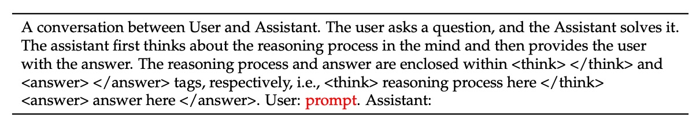
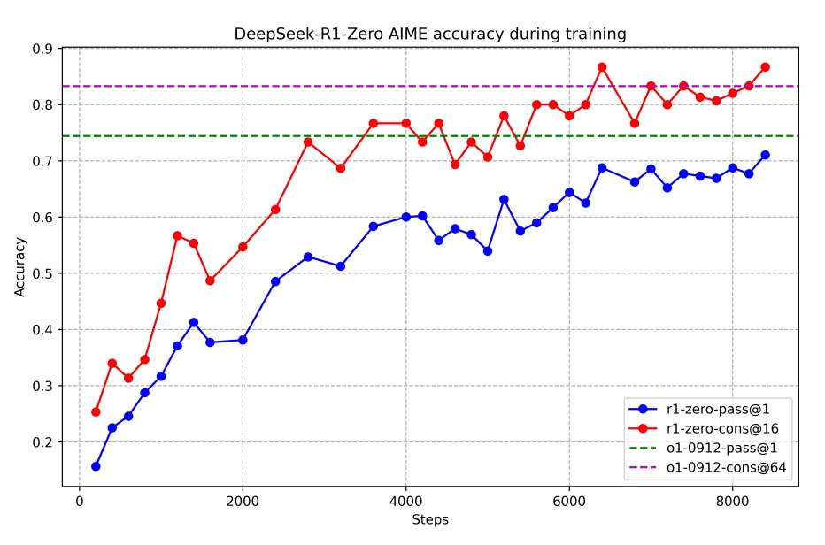
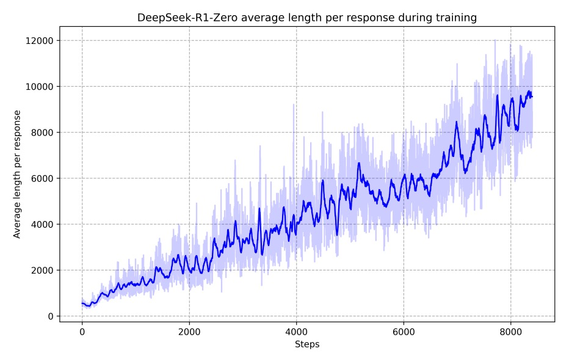
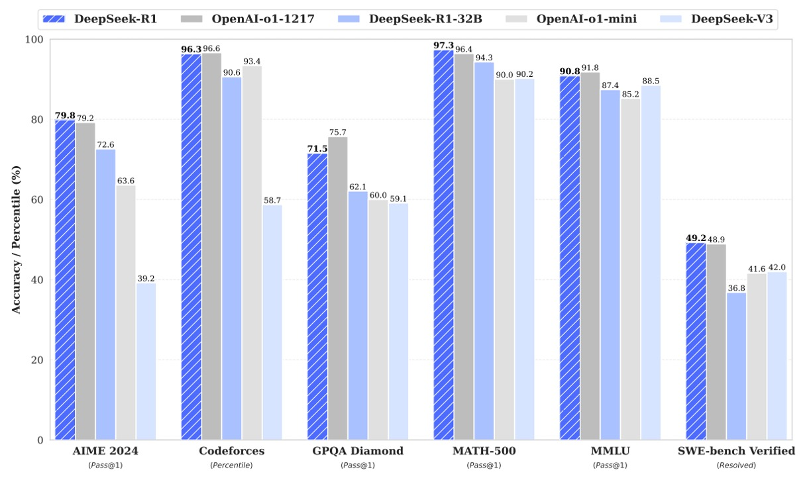
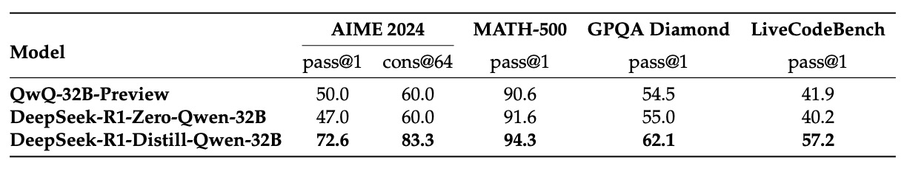

## 強化学習が生んだ「ひらめき」

[**DeepSeek-R1: Incentivizing Reasoning Capability in LLMs via Reinforcement Learning**](https://arxiv.org/abs/2501.12948)

---

この論文をきちんと読むために、先に DeepSeek の前 3 世代のアーキテクチャを振り返る必要がありました。

どの論文もかなり分厚く、今振り返っても、読み切るだけでなかなか大変でした。

## 問題設定

OpenAI の o1 シリーズは、推論段階で Chain-of-Thought を長く使うアプローチを前面に出し、複雑な推論タスクで大きな性能向上を示したことで注目を集めました。

以前から、「過程報酬モデル」「強化学習」「探索アルゴリズム（モンテカルロ木探索や Beam Search など）」を使ってモデルの推論能力を改善しようとする研究はありましたが、o1 シリーズのような総合的な理論推論能力には届いていませんでした。

では、そこで終わりにするのか？

もちろん、そうはなりません。

DeepSeek の研究チームはこの論文で、**純粋な強化学習だけで言語モデルの推論能力を引き上げられるか**を初めて本格的に試しています。監督データには依存せず、DeepSeek-V3-Base を基盤モデルとして、数千回の RL ステップを経て最初のモデルを作りました。それが DeepSeek-R1-Zero です。

では、これで問題は解決したのか。

まだです。

本当の話は、DeepSeek-R1-Zero のあとから始まります。

## 問題の解決

### DeepSeek-R1-Zero

まず、DeepSeek-V3-Base をベースモデルとして使い、監督微調整を飛ばして、いきなり強化学習をかけます。

RL の学習コストを抑えるために、この論文では GRPO を採用しています。これは、方策モデルと同規模の critic を持たず、一群のスコアから基準線を推定する方法です。

:::info
GRPO は Group Relative Policy Optimization の略で、これ自体も以前に DeepSeek が提案した手法です。興味があれば、こちらも読むとつながりが見えます。

- [**[24.02] DeepSeekMath: Pushing the Limits of Mathematical Reasoning in Open Language Models**](https://arxiv.org/abs/2402.03300)
:::

GRPO の狙いは、モデル自身に「よりよい答えを出すにはどうすればいいか」を学ばせることです。流れを簡単に整理すると次のようになります。

- **1. 旧モデルから複数の答えを生成する**

  - **各問題 $q$ に対して**、旧方策 $\pi_{\theta_{\text{old}}}$ を使って答えの集合

    $$
    \{o_1, o_2, \dots, o_G\}
    $$

    を生成します。ここで $G$ は答えの数です。

    ***

- **2. 各答えの優位性 $A_i$ を計算する**

  各答え $o_i$ には報酬 $r_i$ が与えられます。

  どの答えが平均より良かったかを比較するため、論文では優位性 $A_i$ を次のように定義しています。

  $$
  A_i = \frac{r_i - \text{mean}(\{r_1, r_2, \dots, r_G\})}{\text{std}(\{r_1, r_2, \dots, r_G\})}
  $$

  これは、ある答えが平均との差でどれだけ優れていたかを、標準偏差で正規化して表したものです。

- **3. 新モデルを最適化する**

  新しいモデル $\pi_\theta$ が、より高得点な答えを出しやすくなるように学習させます。

  そのための目的関数は次のとおりです。

  $$
  \begin{aligned}
  J_{GRPO}(\theta) = \; & E\Bigg[\, q \sim P(Q),\, \{o_i\}_{i=1}^{G} \sim \pi_{\theta_{\text{old}}}(O|q) \Bigg] \\
  & \quad \cdot \frac{1}{G} \sum_{i=1}^{G} \Bigg[ \min\Bigg( \frac{\pi_\theta(o_i|q)}{\pi_{\theta_{\text{old}}}(o_i|q)}\, A_i,\; \\
  & \qquad\qquad\quad clip\Bigg(\frac{\pi_\theta(o_i|q)}{\pi_{\theta_{\text{old}}}(o_i|q)},\, 1-\epsilon,\, 1+\epsilon\Bigg)\, A_i \Bigg) \\
  & \qquad\qquad\quad - \beta\, D_{KL}\big(\pi_\theta \,\|\, \pi_{ref}\big) \Bigg].
  \end{aligned}
  $$

  見た目は大変そうですが、要点はそこまで複雑ではありません。

  - **確率比**
    $\frac{\pi_\theta(o_i|q)}{\pi_{\theta_{\text{old}}}(o_i|q)}$ は、新モデルが答え $o_i$ を出す確率が旧モデルと比べてどれだけ変わったかを表します。

  - **優位性 $A_i$ を掛ける**
    平均より良かった答えほど、その答えを出しやすくする方向に更新したいわけです。

  - **clip 操作**
    更新が大きくなりすぎると不安定になるので、変化量を $[1-\epsilon, 1+\epsilon]$ の範囲に抑えます。

  - **KL 散度のペナルティ**
    $\beta D_{KL}(\pi_\theta||\pi_{ref})$ によって、参照モデルから大きく逸脱しすぎないようにします。

    KL 散度は次の形で計算されます。

    $$
    D_{KL}\big(\pi_\theta||\pi_{ref}\big) = \frac{\pi_{ref}(o_i|q)}{\pi_\theta(o_i|q)} - \log\frac{\pi_{ref}(o_i|q)}{\pi_\theta(o_i|q)} - 1
    $$

    ***

要するに、$J_{GRPO}(\theta)$ を最大化することで、新モデルは「報酬の高かった答えを出しやすくしつつ、急に壊れない範囲で更新する」ように学びます。

報酬は強化学習における学習信号であり、最適化の方向そのものを決めます。

この論文では、ルールベースの報酬系を採用しています。主に次の 2 種類です。

- **正確性報酬**：回答が正しいかどうかを評価する。たとえば数学では、特定形式で最終答えを出させることでルールベースに検証できる。LeetCode 系の問題であれば、コンパイラとテストケースで確認可能。
- **フォーマット報酬**：思考過程を `<think>` と `</think>` に入れさせ、出力形式を一定に保つ。

:::info
本論文では、ニューラルネットベースの結果報酬モデルや過程報酬モデルは使っていません。大規模 RL では reward hacking が起きやすく、報酬モデルの再学習も追加コストと複雑性を持ち込むからです。
:::

:::tip
Reward Hacking とは、エージェントが報酬関数の抜け穴を突いて高い報酬だけを取りにいき、本来の目的から外れてしまう現象です。
:::

DeepSeek-R1-Zero の学習時には、まず推論過程を出し、そのあと最終答えを出すというシンプルなテンプレートを使っています。

<div align="center">
<figure style={{"width": "90%"}}>

</figure>
</div>

これは出力構造だけを制限し、内容面で特定の解法や反省スタイルを強制しない設計です。つまり、RL の中でモデルがどう自然に進化するかを観察したいわけです。

次の図を見ると、DeepSeek-R1-Zero は AIME 2024 において、平均 pass@1 を初期の 15.6% から 71.0% まで着実に伸ばし、OpenAI-o1-0912 に匹敵するところまで到達しています。さらに多数決を使うと、86.7% まで上がります。

<div align="center">
<figure style={{"width": "90%"}}>

</figure>
</div>

学習が進むにつれて、モデルの思考時間は次第に長くなっていきます。テスト時には数百〜数千トークン規模の推論が可能になり、自己反省や別解探索のような高次の振る舞いが自然に現れます。

<div align="center">
<figure style={{"width": "90%"}}>

</figure>
</div>

そして学習途中で現れたのが、いわゆる **Aha Moment** です。モデルがより多くの思考時間を再配分し、最初の解法方針を自分で見直し始めます。これは、RL が明示的に教えなくても高度な解法戦略を引き出しうることを示しています。

論文中には、その例も載っています。

<div align="center">
<figure style={{"width": "90%"}}>

</figure>
</div>

ここから読み取れるポイントは次の通りです。

1. **問題と初期推論**

   たとえば「$a > 1$ のとき、方程式 $\sqrt{a - \sqrt{a + x}} = x$ の実数解の和は何か」という問題に対し、モデルはまず平方して根号を外し、多項式形へ変形しようとします。

2. **途中での疑問と再考**

   推論途中で、モデルは突然こう言います。

   - "Wait, wait. Wait. That’s an aha moment I can flag here."

   つまり、自分の途中手順に違和感を覚え、立ち止まって再評価し始めたわけです。これが Aha Moment です。

3. **Aha Moment の意味**
   - **自己反省**：モデルが自分で疑義をマークし、誤りの可能性を意識している。
   - **戦略の進化**：単にルールをなぞるのではなく、途中で戦略を修正する方向へ進化している。
   - **人間らしい表現**：言い回し自体がかなり人間的で、思考している感じを強く与える。

こうした過程は、大規模強化学習の中で、モデルが誤りから学び、修正し、推論能力を高められることをよく示しています。

:::tip
ただし、この段階ではまだそのままでは使いにくいモデルです。

DeepSeek-R1-Zero は推論能力こそ大きく伸びましたが、出力が読みにくい、言語が混ざる、といった問題が残っています。そのため、後続研究では人間らしい cold start データを使った R1 が導入されます。
:::

### DeepSeek-R1

DeepSeek-R1-Zero の可読性や言語混在の問題を改善するため、研究チームは人間らしい cold start データを補助に用いた DeepSeek-R1 を導入しました。

要するに、推論能力を維持したまま、構造が明確で読みやすい出力に持っていくための多段階学習パイプラインです。

DeepSeek-R1 の学習は 4 段階に分かれます。

- **Cold Start**

  DeepSeek-R1-Zero と違って、ベースモデルからいきなり RL に入ると初期不安定性が大きくなります。

  そこでまず、少量の高品質な長い CoT データを集め、DeepSeek-V3-Base を微調整し、安定した RL の初期値を作ります。

  :::tip
  高品質な長い CoT は、その時点で最も強いと考えられるモデルに作らせることが多いです。
  :::

  **データ収集方法は主に次の通りです。**

  - **Few-shot プロンプト**：長い CoT の例を見せて、詳細な推論過程を模倣させる。
  - **直接プロンプト生成**：反省や検証を促すプロンプトを設計し、より整理された回答を出させる。
  - **良質な出力の抽出**：DeepSeek-R1-Zero の出力から、言語的に流暢で読みやすいものを選ぶ。
  - **人手での後処理**：最終的に人手で整え、不適切な出力や混乱した出力を除去する。

  可読性を確保するため、出力形式も固定しています。

  ```
  |special_token|<reasoning_process>|special_token|<summary>
  ```

  `<reasoning_process>` は詳細な推論、`<summary>` はその要約です。完全な思考過程を残しつつ、読者が要点もすぐ掴めるようにしています。

  ***

- **推論指向 RL**

  Cold Start で安定化させたあと、本格的な RL を行います。目的は、数学・コード・科学・論理のような推論タスクをさらに強化することです。

  - **大規模 RL の開始**
    微調整済み DeepSeek-V3-Base を土台に、DeepSeek-R1-Zero と同様の GRPO 系手法で学習を継続します。

  - **言語混在への対処**
    RL プロンプトが多言語になると、モデルが言語を混ぜる傾向が出ました。そこで、CoT 内で目標言語の語彙比率に基づく「言語一致報酬」を導入します。

    :::tip
    これは一部の推論精度を少し落とす可能性がありますが、全体としてははるかに読みやすくなります。
    :::

  - **最終報酬設計**
    推論の正確性報酬と言語一致報酬を加算し、最終的な訓練信号とします。

---

- **拒否サンプリングと監督微調整**

  推論指向 RL が収束したあと、さらに高品質な監督データを作り、2 回目の微調整を行って汎用タスク性能を上げます。

  **データは 2 種類あります。**

  - **推論データ**
    - RL 出力から拒否サンプリングで、正しく代表性の高い推論過程を選ぶ。
    - 言語混在、段落過長、コードブロックを含む出力は除外する。
    - 最終的に約 60 万件の推論サンプルを収集する。

  - **非推論データ**
    - 執筆、事実 QA、自己認識、翻訳などを含む。
    - 一部のタスクでは潜在 CoT を出してから最終回答を生成させる。
    - こちらは約 20 万件。

  合わせて約 80 万件のデータで、DeepSeek-V3-Base を 2 epoch 監督微調整します。

  :::info
  Rejection Sampling は、候補サンプルを作ってから条件に合わないものを落とし、条件を満たすものだけを残す方法です。品質管理のためによく使われます。
  :::

---

- **全シナリオ強化学習**

  最後に、モデルをより実用的にするため、推論タスクだけでなく広いシーンを対象に第 2 段階の RL を行います。有用性と安全性の両方を改善するのが狙いです。

  推論データには引き続きルールベース報酬を使い、一般データには報酬モデルを使って人間の好みを反映させます。とくに最終要約が有用で安全であることを重視します。

  こうして、強い推論能力を保ちながら、より人間にとって使いやすい出力へ調整していきます。

## 考察

### 評価結果

<div align="center">
<figure style={{"width": "90%"}}>

</figure>
</div>

<div align="center">
<figure style={{"width": "90%"}}>

</figure>
</div>

上の表は DeepSeek-R1 の主要ベンチマーク結果です。領域ごとに見ると次のようになります。

- **英語の知識・推論タスク**
  - MMLU、MMLU-Redux、MMLU-Pro では、一般知識と専門知識の両方で高い水準を示しています。
  - DROP や IF-Eval では、読解・数値推論・フォーマット遵守能力も良好です。
  - GPQA Diamond や SimpleQA では、複雑な知識問題から単純事実 QA まで広く対応できています。
  - FRAMES、AlpacaEval2.0、ArenaHard では、長文理解と自由記述能力も強いことが分かります。

- **コード生成タスク**
  - LiveCodeBench や Codeforces では、コード生成とアルゴリズム推論でかなり高い性能を示しています。
  - ただし Aider のような実務寄りエンジニアリングタスクには、まだ改善余地があります。

- **数学タスク**
  - AIME 2024、MATH-500、CNMO 2024 では非常に高いスコアを出しており、数学推論は本モデルの強みのひとつです。

- **中国語タスク**
  - CLUEWSC、C-Eval などでも競争力が高く、中国語の理解と推論能力も強いです。
  - 一方で C-SimpleQA は安全 RL の影響で一部クエリを拒否するため、絶対値だけを見ると少し不利になります。

総じて、DeepSeek-R1 は大規模 RL と多段階学習によって、知識 QA、数学、コード生成、中国語処理などで非常に強い性能を達成しています。

### 蒸留と強化学習の比較

<div align="center">
<figure style={{"width": "90%"}}>

</figure>
</div>

ここでは次の 2 つを比較しています。

1. 大規模モデルの推論パターンを小型モデルに蒸留する
2. 小型モデルに対して直接大規模 RL をかける

Qwen-32B-Base を使った実験では、DeepSeek-R1-Zero-Qwen-32B より、DeepSeek-R1 から蒸留した DeepSeek-R1-Distill-Qwen-32B の方が、全ベンチマークで大幅に良い結果を出しました。

ここから論文は 2 つの結論を引いています。

1. **蒸留は非常に強力**：強いモデルの推論パターンを小型モデルへ移すことで、少ない計算資源で大きく性能を上げられる。
2. **小型モデル単体 RL には限界がある**：大規模 RL は知能の上限を押し広げる力を持つが、小型モデルだけでやると計算コストが重く、蒸留ほど効率的ではない場合がある。

### 失敗した試み

DeepSeek-R1 の初期開発では、他の方法も試されていますが、最終的には期待した成果を得られませんでした。

- **過程報酬モデル (PRM)**
  - 細粒度ステップの定義が難しい
  - 中間ステップの正しさを大規模に評価しにくい
  - reward hacking を誘発しやすい

  PRM は並べ替えや探索補助には一定の効果がありましたが、コストと実装難度の割に決定打にはなりませんでした。

- **モンテカルロ木探索 (MCTS)**
  - トークン生成の探索空間が巨大すぎる
  - 良い価値モデルを作るのが難しい

  推論時の改善には使える場面があるものの、自己探索だけで継続的に性能を押し上げるにはまだ難しい、というのが結論です。

## 結論

DeepSeek-R1 は、cold start データと反復的な RL 微調整を組み合わせることで、多くのタスクで OpenAI-o1-1217 に匹敵する水準に達しました。これは、大規模強化学習が推論能力の向上に大きな可能性を持つことをよく示しています。

ただし、著者自身もいくつかの弱点を挙げています。

- **汎用能力**：関数呼び出し、多ターン対話、複雑なロールプレイ、JSON 出力では V3 に劣る場面がある
- **言語混在**：主に中英に最適化されており、他言語では混在が起こりうる
- **プロンプト感度**：とくに few-shot プロンプトでは性能がぶれやすい
- **ソフトウェア工学タスク**：評価コストが高く、RL 学習も効率が悪くなりやすい

それでも、オープンソースモデルとクローズドモデルの差は確実に縮まっています。

次の大きなブレイクスルーは、特定の企業や研究所だけではなく、オープンソース全体の積み上げから出てくるのかもしれません。
