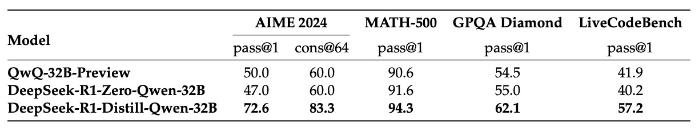

## 強化学習によるひらめき

[**DeepSeek-R1: Incentivizing Reasoning Capability in LLMs via Reinforcement Learning**](https://arxiv.org/abs/2501.12948)

---

この論文を読むために、前の 3 世代の DeepSeek アーキテクチャを振り返る必要がありました。

どの論文もレンガのように分厚いもので、今思い返すと、本当に簡単ではなかったと感じます。

## 問題の定義

OpenAI の o1 シリーズは最近、推論段階で推論チェーン（Chain-of-Thought）を延長する方法を最初に導入し、モデルの複雑な推論タスクにおけるパフォーマンスを大幅に向上させたことで話題になりました。

過去にも「プロセス報酬モデル」「強化学習」「探索アルゴリズム（モンテカルロ木探索やビームサーチなど）」を使用して、モデルの推論能力を改善しようとする研究がありましたが、o1 シリーズのような総合的な理論推論能力には達していませんでした。

それで、これで終わりにしてしまうのでしょうか？

それではだめです！研究者たちの頑固な性格は無駄ではありません。

DeepSeek 研究チームは、この論文で初めて「単純な強化学習」を使って、言語モデルの推論能力を駆動することを試みました。監視データには全く依存しません。こうして、著者は DeepSeek-V3-Base をベースモデルとして、数千回の RL ステップを経て、最初のモデルを作り上げました。これが DeepSeek-R1-Zero と呼ばれるものです。

では、問題は解決したのでしょうか？

まだです。

DeepSeek-R1-Zero の後が、本当のスタートだったのです。

## 問題の解決

### DeepSeek-R1-Zero

まず、DeepSeek-V3-Base をベースモデルとして使用し、監視付きの微調整段階を省略し、直接強化学習アルゴリズムを使って訓練します。

RL の訓練コストを下げるために、本文では GRPO 法を採用しています。この方法は、戦略モデルと同じ規模のクリティックモデルを使用せず、スコアセットに基づいて基準を推定します。

:::info
GRPO アルゴリズム、元々は Group Relative Policy Optimization という名前で、これも DeepSeek が以前発表した論文です。時間があれば、こちらも確認できます：

- [**[24.02] DeepSeekMath: Pushing the Limits of Mathematical Reasoning in Open Language Models**](https://arxiv.org/abs/2402.03300)
  :::

GRPO アルゴリズムでは、モデルが自分で「より良い回答」を生成する方法を「学ぶ」ことを期待しています。その核心的なプロセスは以下のステップで構成されています：

- **1. 旧モデルから複数の答えを生成**

  - **各問題 $q$ に対して**： 旧戦略 $\pi_{\theta_{\text{old}}}$ を使って答えのセットを生成します

    $$
    \{o_1, o_2, \dots, o_G\}
    $$

    ここで、$G$ は答えの数です。

    ***

- **2. 答えの評価：優位性 $A_i$ の計算**

  答えの良し悪しを測るために、各答え $o_i$ は報酬 $r_i$ を得ます。

  どの答えが良いかを比較するために、著者は優位性 $A_i$ を以下のように定義しています：

  $$
  A_i = \frac{r_i - \text{mean}(\{r_1, r_2, \dots, r_G\})}{\text{std}(\{r_1, r_2, \dots, r_G\})}
  $$

  この式は、ある答えが平均のパフォーマンスをどれだけ超えているか（標準偏差を使って標準化）を示しています。

- **3. 新しいモデルの最適化：目的関数の最大化**

  新しいモデル $\pi_\theta$ が、より高得点の答えを生成することを学ぶことを望んでいます。

  そのために、著者は次のような目的関数を設計しました：

  $$
  \begin{aligned}
  J_{GRPO}(\theta) = \; & E\Bigg[\, q \sim P(Q),\, \{o_i\}_{i=1}^{G} \sim \pi_{\theta_{\text{old}}}(O|q) \Bigg] \\
  & \quad \cdot \frac{1}{G} \sum_{i=1}^{G} \Bigg[ \min\Bigg( \frac{\pi_\theta(o_i|q)}{\pi_{\theta_{\text{old}}}(o_i|q)}\, A_i,\; \\
  & \qquad\qquad\quad clip\Bigg(\frac{\pi_\theta(o_i|q)}{\pi_{\theta_{\text{old}}}(o_i|q)},\, 1-\epsilon,\, 1+\epsilon\Bigg)\, A_i \Bigg) \\
  & \qquad\qquad\quad - \beta\, D_{KL}\big(\pi_\theta \,\|\, \pi_{ref}\big) \Bigg].
  \end{aligned}
  $$

  この式を見ると、ついスクロールしたくなりますが、心配しないで、ひとつずつ見ていきましょう：

  - **確率比率**
    $\frac{\pi_\theta(o_i|q)}{\pi_{\theta_{\text{old}}}(o_i|q)}$ は、新しいモデルが答え $o_i$ を生成する確率が旧モデルと比較してどのように変化したかを示しています。

  - **優位性 $A_i$ を掛ける**
    もし答えが平均より良ければ（$A_i$ が高ければ）、新しいモデルはその答えを生成する確率を増加させたいと考えます。

  - **clip 操作**
    確率比率の変動が大きくなりすぎないように、これを制限し、$[1-\epsilon,\, 1+\epsilon]$ の範囲内に収めます。ここで$\epsilon$は超パラメータで、モデルの変動に「安全帯」を設定するようなものです。

  - **KL 散度ペナルティ**
    $\beta D_{KL}\big(\pi_\theta||\pi_{ref}\big)$ はペナルティ項で、新しいモデルと参照モデル $\pi_{ref}$ の違いを測り、モデルが元の安定した戦略から逸脱しないようにします。

    KL 散度の計算方法は次の通りです：

    $$
    D_{KL}\big(\pi_\theta||\pi_{ref}\big) = \frac{\pi_{ref}(o_i|q)}{\pi_\theta(o_i|q)} - \log\frac{\pi_{ref}(o_i|q)}{\pi_\theta(o_i|q)} - 1
    $$

    ***

どうですか？実際、そんなに難しくはないでしょう？

モデルは $J_{GRPO}(\theta)$ の最大化を通じて、パラメータを調整します。これは、新しいモデルが、より高い報酬（高い $A_i$）を得た答えを生成する傾向が強くなり、同時に変化の安定性を保つことを意味します。

報酬は強化学習の訓練信号であり、最適化の方向を決定します。

研究チームは、本論文でルールベースの報酬システムを採用しており、主に次の 2 種類の報酬が含まれています：

- **正確性報酬**：回答が正しいかどうかを評価します。例えば、数学の問題では、モデルが特定の形式（例えば、答えを囲む）で最終的な答えを出すことを要求し、その結果、規則に基づいて検証可能です。LeetCode の問題においては、コンパイラと予め設定したテストケースを使って検証できます。
- **フォーマット報酬**：モデルが思考過程を `<think>` と `</think>` タグ内に配置するように要求し、出力が予め設定された形式に従うことを確保します。

:::info
本論文では、ニューラルネットワークベースの結果やプロセス報酬モデルは採用していません。その理由は、大規模な RL プロセスにおいて「報酬ハッキング」の問題が発生しやすく、報酬モデルを再訓練することが追加のリソースを必要とし、全体のプロセスが複雑になるためです。
:::

:::tip
報酬ハッキング（Reward Hacking）は、強化学習の過程でエージェントが報酬関数の予期しない欠陥や弱点を利用し、報酬値を迅速に増加させる戦略を見つけることを指しますが、これらの戦略は必ずしも設計者の本来の目標に沿っていない場合があります。
:::

DeepSeek-R1-Zero の訓練時、著者はモデルにまず推論過程を生成させ、最終的な答えを提供させる簡単で明確なテンプレートを設計しました。以下の表に示します：

<div align="center">
<figure style={{"width": "90%"}}>

</figure>
</div>

この設計は、出力構造のみを制限し、内容面での偏見（例えば、反省的推論や特定の解法戦略を強制するなど）を避け、モデルが RL プロセス内で自然に進化する様子を観察することを目的としています。

次の図は訓練過程を示しており、DeepSeek-R1-Zero が AIME 2024 ベンチマークテストで、初期の 15.6%から安定的に 71.0%まで平均 pass@1 スコアを向上させ、OpenAI-o1-0912 モデルに匹敵する結果を示しています。さらに多数決機構（赤線）を用いることで、性能は 86.7%にまで向上しました。

<div align="center">
<figure style={{"width": "90%"}}>

</figure>
</div>

訓練が進むにつれて、モデルの思考時間は次第に長くなり、以下の図に示すように、テスト段階で数百から数千個の推論トークンを生成できるようになり、自己反省や他の解法の探索などの高度な行動が自然に発展するようになりました。これらは全て、RL 環境内でモデルが自発的に進化した結果です。

<div align="center">
<figure style={{"width": "90%"}}>

</figure>
</div>

訓練過程中、モデルはある中間バージョンで「Aha Moment」を迎え、より多くの思考時間を再配分し、初期の解法戦略を再評価することを学び始めました。これはモデルの推論能力の顕著な向上を示すだけでなく、RL が明示的な指導なしで高度な解法戦略を引き出す潜在能力を持っていることに驚かされる瞬間でした。

著者は論文内で「Aha Moment」の例を示しています：

<div align="center">
<figure style={{"width": "90%"}}>

</figure>
</div>

この例から、いくつかの重要な点が分かります：

1. **問題と初期推論：**

   表には数学的な問題が示されています。例えば「もし $a > 1$ ならば、方程式 $\sqrt{a - \sqrt{a + x}} = x$ の実数解の和は何か？」という問題です。

   モデルはまず平方を使って根号を消去し、方程式を多項式の形に変換しようとします。

2. **途中の疑問と反省：**

   推論の過程で、モデルは突然立ち止まり、こう言います：

   - 「Wait, wait. Wait. That’s an aha moment I can flag here.」

   これは、あるステップに問題があるか不合理だと感じ、推論過程を再評価することを決定した瞬間を意味します。この突然の「ひらめき」が「Aha Moment」です。

3. **Aha Moment の意義：**
   - **自己反省：** モデルが自ら疑念を示し、解答の過程でエラーや修正が必要な部分を自覚している様子が見て取れます。
   - **進化的学習：** このような行動は、モデルが強化学習の過程で単に規則を機械的に実行するのではなく、戦略を調整し、推論過程を改善する方法を学びつつあることを示しています。
   - **人間らしい表現：** モデルが人間のような言い回しを使って「Aha Moment」を表現しており、思考・反省しているように感じられます。これは強化学習における自己進化能力の美しい表れです。

モデルの思考過程と自己チェックは、私たちに、強化学習の大規模プロセス内で、モデルがいかにして誤りから学び、修正する能力を高め、解題能力を向上させることができるかを証明しています。これこそが、強化学習が推論タスクにおいて示す強力な潜在能力と柔軟性です。

:::tip
ここまでで、このモデルはまだ使えません。

DeepSeek-R1-Zero は推論能力において顕著な成果を上げましたが、出力の可読性が低い、言語が混在しているなどの問題が依然としてあります。これらの欠点を改善するために、後続の研究では人間らしい冷起動データを補助として使用した R1 モデルが導入されました。
:::

### DeepSeek-R1

DeepSeek-R1-Zero の可読性や言語の混合問題を克服するために、研究チームはさらに人間らしい冷起動データを補助とした DeepSeek-R1 モデルを導入しました。

この部分の核心は、精密に設計された多段階の訓練パイプラインを通じて、モデルが推論能力を維持しつつ、構造が明確で理解しやすい回答を生成できるようにすることです。

DeepSeek-R1 の訓練プロセスは四つの段階に分かれており、順を追って見ていきましょう：

- **冷起動 (Cold Start)**

  DeepSeek-R1-Zero と異なり、基盤モデルから直接 RL に入ると初期の不安定性が生じる可能性があります。

  そのため、研究チームはまず少量の高品質な長チェーン思考（CoT）データを収集し、DeepSeek-V3-Base を微調整して、安定した RL 初期値を作り上げました。

  :::tip
  高品質な長チェーン思考データは、一般的に現在最強と認められているモデルを用いて生成されます。
  :::

  **データ収集方法には以下が含まれます：**

  - **Few-shot ヒント：** 長い CoT の例を使って解法の手順を示し、モデルに詳細な推論過程を模倣させる。
  - **直接ヒント生成：** 反省と検証を促進するヒントを設計し、モデルに体系的な回答を生成させる。
  - **優れた出力の抽出：** DeepSeek-R1-Zero から言語的に流暢で読みやすい回答を選出。
  - **人工後処理：** 最後に人間によって精練され、不適切または混乱した出力を排除。

  データの可読性を確保するために、著者は固定の出力フォーマットを定義しました：

  ```
  |special_token|<reasoning_process>|special_token|<summary>
  ```

  ここで、`<reasoning_process>` は詳細な推論過程、`<summary>` はその推論過程の概要です。このフォーマットにより、完全な推論内容を保持しつつ、ユーザーが要点を迅速に把握できるようになっています。

  ***

- **推論指向の RL**

  冷起動データの助けを借りて、まずモデルを安定状態にしてから RL 訓練を開始します。この段階の主な目的は、数学、プログラミング、科学、論理などの推論タスクにおけるモデルの能力をさらに強化することです。具体的な手順は以下の通りです：

  - **大規模な RL 訓練の開始：**
    微調整後の DeepSeek-V3-Base を基盤として、DeepSeek-R1-Zero と同様の RL 方法（例えば GRPO アルゴリズム）で訓練を続けます。

  - **言語混合問題の処理：**
    RL ヒントが複数の言語を含むとき、モデルが言語混合の現象を示すことが分かりました。この問題を解決するために、著者は「言語一致報酬」を導入し、その計算は CoT 内のターゲット言語の語彙比率に基づいて行われます。

    :::tip
    この部分は一部の推論精度に若干影響を与えるかもしれませんが、全体の出力が人間の読解習慣により合致するようになりました。
    :::

  - **最終的な報酬設計：**
    推論精度報酬と語言一致報酬を加算し、モデル更新の最終的な訓練信号として使用します。これにより、新しいモデルは推論能力を向上させるとともに、出力の構造と可読性にも注意を払うようになります。

---

- **拒否サンプリングと監視微調整**

  推論指向の RL 訓練が収束した後、研究チームはさらに高品質な監視データを生成し、第二ラウンドの微調整を行ってモデルの汎用タスクでのパフォーマンスを向上させました。

  **データ生成は二つの大きなカテゴリーに分かれます：**

  - **推論データ：**

    - 拒否サンプリング法を用いて、RL 訓練から得られた答えの中から正確で代表的な推論過程を選びます。
    - 品質を保証するため、著者は言語混合、段落が長すぎる、コードブロックを含む出力をフィルタリングします。
    - 最終的に約 600,000 件の推論関連サンプルを収集します。

  - **非推論データ：**
    - 書き込み、事実に基づく質問応答、自己認識、翻訳などのタスクが含まれ、これらのデータは DeepSeek-V3 の監視データから得られます。
    - いくつかのタスクでは、モデルに潜在的な CoT を生成させ、その後最終的な回答を生成させます。単純なクエリには CoT を生成しません。
    - この部分は約 200,000 件のサンプルです。

  これらのデータを統合すると、約 800,000 件のサンプルが収集され、DeepSeek-V3-Base に対して 2 回のエポックで監視微調整が行われ、モデルは推論と汎用タスクの両方で向上しました。

  :::info
  拒否サンプリング（Rejection Sampling）は統計的サンプリング手法の一つで、候補サンプルを生成した後、事前に定義した基準や評価指標に基づいて、条件に合わないサンプルを排除し、条件に合致するサンプルのみを保持する方法です。

  この方法を使うことで、複雑で直接的にサンプリングが難しい分布から、高品質で特定の条件を満たすサンプルを得ることができます。
  :::

---

- **全場面強化学習**

  モデルがユーザーのニーズにより適応できるよう、研究チームは第二段階の RL 訓練を実施しました。この訓練では、すべてのシーン（推論タスクに限らず）を最適化し、モデルの有用性（helpfulness）と安全性（harmlessness）を向上させました。

  推論データについては、前述の規則に基づく報酬法を引き続き使用し、数学、プログラミング、論理などのタスクの推論精度を確保します。一般的なデータには、報酬モデルを用いて人間の好みを捉え、最終的な要約が有用で安全基準を満たすことを重視します。

  これにより、モデルは優れた推論能力を維持しつつ、人間らしさとリスク管理にも配慮して回答を生成できるようになりました。

  この訓練段階を通じて、モデルは多くのタスクとシーンにおいて、バランスの取れた優れたパフォーマンスを達成することができました。

## 討論

### 評価結果

<div align="center">
<figure style={{"width": "90%"}}>

</figure>
</div>

<div align="center">
<figure style={{"width": "90%"}}>

</figure>
</div>

上記の表は、DeepSeek-R1 が複数のベンチマークテストで示した評価結果です。グラフの領域別に説明します：

- **英語の知識と推論タスク**

  - **MMLU、MMLU-Redux、MMLU-Pro**
    これらの指標は、モデルの学術的および一般的な知識を評価するために使用されます：

    - **MMLU (Pass@1)：** モデルが最初の回答で正解を出す割合を示し、DeepSeek-R1 は 90.8 を記録しており、一部の競合と比較して高いスコアを達成しています。
    - **MMLU-Redux (EM)：** 精度一致（Exact Match）で評価し、DeepSeek-R1 は 92.9 のスコアを記録。これは精度の高い回答を提供する能力を示しています。
    - **MMLU-Pro (EM)：** 専門的な分野の問題に焦点を当て、DeepSeek-R1 は 84.0 を記録しており、DeepSeek-V3 よりも顕著に向上しており、特に STEM の問題での進展が反映されています。

  - **DROP (3-shot F1) と IF-Eval (Prompt Strict)**

    - **DROP**：読解と数値推論能力をテストする指標で、DeepSeek-R1 は 92.2 の F1 スコアを達成しました。
    - **IF-Eval**：フォーマット遵守を評価する指標で、DeepSeek-R1 は 83.3 であり、他のモデルに若干劣りますが、全体的には優れた結果を出しています。

  - **GPQA Diamond と SimpleQA**

    - **GPQA Diamond (Pass@1)**：複雑な知識問答におけるモデルのパフォーマンスを評価し、DeepSeek-R1 は 71.5 を記録。
    - **SimpleQA (Correct)**：簡単な事実に基づく問答の正確さを測定し、DeepSeek-R1 は 30.1 を達成しました。事実問答においては DeepSeek-V3 よりも明確に改善が見られますが、中文 SimpleQA では少し劣る結果となり、これは安全な RL 戦略による影響です。

  - **FRAMES、AlpacaEval2.0、ArenaHard**
    長文、オープンドメイン問答、ライティングタスクに関連する指標です：
    - **FRAMES (Acc.)**：DeepSeek-R1 は 82.5 を記録し、長文問答タスクにおける強力なドキュメント解析能力を示しています。
    - **AlpacaEval2.0 (LC-winrate)** と **ArenaHard (GPT-4-1106)**：ライティングとオープンドメイン問答におけるパフォーマンスを評価し、DeepSeek-R1 はそれぞれ 87.6% と 92.3% の勝率を達成しました。これにより、汎用性と実用性が強調されます。

---

- **コード生成タスク**

  - **LiveCodeBench (Pass@1-COT) と Codeforces**
    コード生成とアルゴリズム推論のパフォーマンスを評価する指標です：

    - **LiveCodeBench**：DeepSeek-R1 は 65.9 を記録し、Chain-of-Thought を使用してコードを生成する優れた能力を示しました。
    - **Codeforces (Percentile と Rating)**：Codeforces のコンテストで DeepSeek-R1 は高い評価を受け、Rating は 2029 で、トップレベルに位置しています。これにより、競技プログラミングにおける優れた能力を示しています。

  - **その他のエンジニアリング関連指標**
    - **SWE Verified (Resolved)**：エンジニアリングタスクに関連し、DeepSeek-R1 は 49.2 を記録し、いくつかの競合モデルと同等のパフォーマンスを示しました。
    - **Aider-Polyglot (Acc.)**：多言語プログラミングタスクにおいて DeepSeek-R1 は 53.3 を記録しました。若干のモデルには劣りますが、推論に基づくモデルの有利性が示されています。

---

- **数学タスク**

  - **AIME 2024、MATH-500、CNMO 2024**
    数学的な推論と問題解決を評価する基準です：
    - **AIME 2024 (Pass@1)**：DeepSeek-R1 は 79.8 を記録し、OpenAI-o1-1217 と並ぶレベルのパフォーマンスを示しています。
    - **MATH-500 (Pass@1)**：DeepSeek-R1 は 97.3 を達成しており、複雑な数学問題の解決において優れた能力を示しています。
    - **CNMO 2024 (Pass@1)**：DeepSeek-R1 は 78.8 を記録し、中文の数学推論においても優れたパフォーマンスを示しています。

---

- **中国語タスク**

  - **CLUEWSC、C-Eval、C-SimpleQA**
    中国語タスクにおいて、DeepSeek-R1 は非常に良いパフォーマンスを示しています：
    - **CLUEWSC (EM)**：DeepSeek-R1 は 92.8 を記録し、中国語の理解と推論能力が強いことを示しました。
    - **C-Eval (EM)**：スコアは 91.8 で、再度、中国語の言語評価における競争力を証明しました。
    - **C-SimpleQA (Correct)**：DeepSeek-R1 は 63.7 を記録しましたが、DeepSeek-V3 よりも優れた結果が得られており、安全な RL 戦略の影響で一部のクエリが拒否されたことが原因です。安全 RL を解除すれば、正確性は 70% を超えると考えられます。

---

DeepSeek-R1 は MMLU、MMLU-Pro、GPQA Diamond など、教育主導の知識評価で素晴らしい結果を出し、特に STEM 領域の問題で大規模 RL トレーニングによる精度の大幅な向上が確認されました。

FRAMES、AlpacaEval2.0、ArenaHard の結果は、DeepSeek-R1 が長文ドキュメント、クリアな要約の生成、ライティングタスクにおいて優れた能力を示しており、これらの改善は最終段階の監視微調整と RL トレーニングにおける指示追従データの導入によるものです。

DeepSeek-R1 は数学的推論において OpenAI-o1-1217 と並ぶ結果を出し、コード生成やアルゴリズム競技でも優れたパフォーマンスを発揮しています。しかし、エンジニアリング関連のコードタスク（Aider など）では、さらなる改善が求められます。今後のバージョンでは、関連する RL データを追加することで、さらに改善されることが期待されます。

モデルが生成する要約の平均長さは、ArenaHard で 689 トークン、AlpacaEval2.0 で 2,218 文字であり、DeepSeek-R1 は GPT ベースの評価で長さの偏差を避け、安定性と多領域適応性をさらに証明しています。

全体として、DeepSeek-R1 は大規模強化学習と精密に設計された多段階訓練プロセスを通じて、複数のベンチマークで印象的なパフォーマンスを達成しました。これにより、知識問答、数学的推論、コード生成、中国語処理などの多方面での強力な能力が示され、今後のより強力で汎用的な言語モデル構築に向けた有力なサポートが提供されました。

### 蒸留と強化学習の比較

<div align="center">
<figure style={{"width": "90%"}}>

</figure>
</div>

ここでの議題は、二つのシナリオを仮定して比較することです：

1. 大規模モデルの推論パターンを小型モデルに蒸留する。
2. 小型モデルで直接大規模 RL を行う。

同じ小型モデルにおいて、実験結果は上記の表に示されており、Qwen-32B-Base モデルで 10,000 ステップ以上の RL 訓練を行い、DeepSeek-R1-Zero-Qwen-32B が得られました。もう一つは、DeepSeek-R1 から蒸留された DeepSeek-R1-Distill-Qwen-32B です。

その蒸留版の結果は、すべてのベンチマークにおいて RL を行ったバージョンを大きく上回っています。

ここで著者は二つの結論を導き出しました：

1. **蒸留の効果は優れている**：強力なモデルの推論パターンを小型モデルに蒸留することで、パフォーマンスを大幅に向上させ、計算リソースの要求が大規模 RL を小型モデルで行うよりもはるかに少ないことが示されています。
2. **RL の限界**：大規模 RL は知能の限界を突破するのに有効ですが、もし小型モデルだけで RL を行うと、計算リソースが非常に多く要求され、性能も蒸留方法に劣る可能性があります。そのため、今後既存の知能レベルを超えるためには、さらに強力な基盤モデルと大規模 RL の訓練が必要です。

### 失敗した試み

DeepSeek-R1 の開発初期段階で、研究チームは他の方法も試みましたが、最終的に期待した結果を得られませんでした。

この部分では二つの方法について説明します：

- **プロセス報酬モデル (Process Reward Model, PRM)**：PRM は理論的には、モデルが推論問題を解決する際により良い戦略を取るように導くことができますが、実際の応用では以下の三つの課題に直面しました：

  - **細かいステップの定義が難しい**：一般的な推論タスクで、どの細かいステップを明確に定義するかは非常に困難です。
  - **中間ステップの正確性の判定**：自動化されたアノテーションは理想的な結果を得ることが難しく、手動アノテーションではスケールアップが難しいです。
  - **報酬ハッキング問題**：モデルベースの PRM を導入することは、報酬ハッキングを引き起こしやすく、報酬モデルの再訓練は追加のリソースを要し、訓練プロセス全体の複雑さを増します。

  PRM は、上位 N 個の出力を並べ替えたり、検索を補助することには一定の効果がありましたが、計算コストと適用難易度のため、その利点は限られていました。

- **モンテカルロ木探索 (Monte Carlo Tree Search, MCTS)**

  AlphaGo や AlphaZero に触発されて、研究チームは MCTS を使ってテスト時の計算規模と探索能力を改善しようとしました。方法としては、回答をより小さな部分に分け、モデルに各推論ステップに対応するラベルを生成させ、その後、事前に訓練された価値モデルを使って誘導するというアプローチです。しかし、この方法は二つの大きな課題に直面しました：

  - **探索空間が巨大**：チェスのようなゲームと比べて、トークン生成の探索空間は指数的に増加します。ノードの拡張上限を設定しても、モデルが局所最適解に陥りやすくなります。
  - **価値モデルの訓練が難しい**：価値モデルは各ステップの探索品質に決定的な影響を与えるのですが、精密な価値モデルを訓練すること自体が非常に難しく、そのため全体の探索プロセスの改良に影響を与えます。

  そのため、MCTS は推論段階で事前訓練された価値モデルを使用してパフォーマンスを改善できましたが、自己探索によってモデルのパフォーマンスを持続的に向上させることは依然として大きな課題です。

## 結論

DeepSeek-R1 は冷起動データと反復的な強化学習微調整を組み合わせることで、最終的に多くのタスクにおいて OpenAI-o1-1217 と並ぶパフォーマンスを達成しました。これは、大規模強化学習が推論能力の向上に大きな潜在能力を持っていることを証明しています。

現在、DeepSeek-R1 にはいくつかの既知の欠点が残っています。著者は論文の最後でこれらを明確に指摘しています：

- **汎用能力**：R1 は一部のタスク（関数呼び出し、複数ターン対話、複雑なロールプレイングや JSON 出力）で V3 よりも若干劣っています。
- **言語混合問題**：R1 は主に中英語に最適化されており、他の言語のクエリには言語混合が発生する可能性があります。
- **プロンプティング（Prompting）**：R1 はプロンプトに敏感で、特に少数ショットプロンプトではパフォーマンスに影響を受けやすいです。著者はゼロショット設定で問題を直接説明し、出力形式を明確に指定することを推奨しています。
- **ソフトウェアエンジニアリングタスク**：この種のタスクは評価時間が長いため、RL 訓練の効率に影響を与え、R1 はこの分野で顕著な優位性を示していません。

全体として、オープンソースモデルとクローズドソースモデルとの間には依然として差があるものの、DeepSeek-R1 の進展は両者のギャップを大幅に縮め、将来のオープンソースモデルの発展に新たな可能性を開きました。

おそらく、次の突破口は、もはや特定の実験室や企業だけのものではなく、オープンソースコミュニティ全体の集団的努力から生まれるでしょう。
