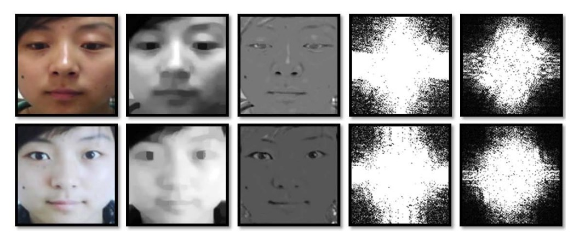
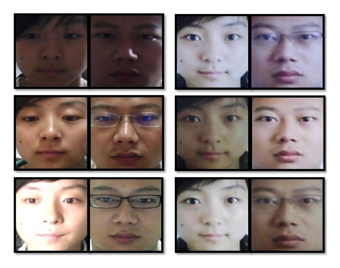
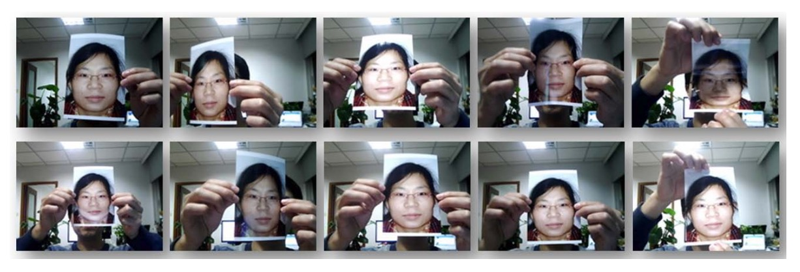
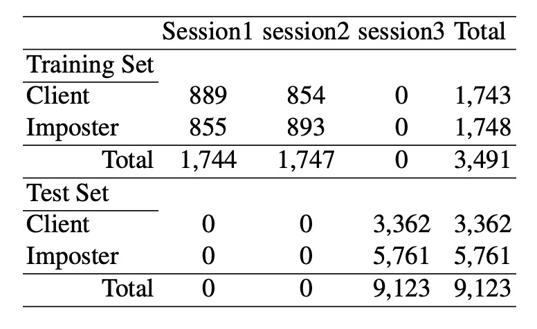

## 静かな反射光

[**Face Liveness Detection from A Single Image with Sparse Low Rank Bilinear Discriminative Model**](https://parnec.nuaa.edu.cn/_upload/article/files/4d/43/8a227f2c46bda4c20da97715f010/db1eef47-b25f-4af9-88d4-a8afeccda889.pdf)

---

今回は、活体認識技術のコンテキストを深く掘り下げていきます。

最初に、この分野の初期の重要な研究としていくつかの論文を選びました。

## 問題の定義

活体認識の問題は、2010 年以前から多くの研究が行われており、その当時の方法は、顔の動き（例えばまばたきや微細な顔の変化）や皮膚の質感、深度情報などの特徴を使って活体を識別していました。

しかし、相手が使用しているアルゴリズムを知っていれば、それをターゲットにして簡単に破られてしまいます。例えば、顔の動きを検出する方法は、短い動画を再生したり、写真を揺らしたり、二枚の写真を使って偽装することができます。

では、3D カメラやサーモグラフィーを導入した場合はどうでしょう？

それでも効果はありません。

私たちは出かける際にスマートフォンを持ち歩くことはありますが、サーモグラフィーを持ち歩いて、いつ使うかもわからないために活体証明をするために持ち歩くことは絶対にありません。

**そのため、本論文の著者は「一枚の画像」で相手が生きているかどうかを判別する方法を提案しています。外部の力は必要ありません。**

例えば、以下の図を参考にしてください。どれが実際に撮影された顔写真（再撮影）で、どれが本物の顔ですか？

<figure style={{"width": "90%"}}>

</figure>

答えは、右から数えて最初のカラムが本物で、他はすべて写真の再撮影です。

えっ！肉眼では全くわからないと言いますか？

その通り、それが問題です。

## 解決する問題

当時、最も人気のある画像特徴抽出方法は主成分分析（PCA）でしたが、著者は PCA で得られた活体と偽造画像の特徴分布が大量に重なり、両者を効果的に区別できないことを発見しました。

:::tip
PCA の概念は、画像から最も代表的な特徴を抽出することです。つまり、顔画像で最も顕著な特徴は何か？そう、顔そのものです。

しかし、これこそが問題の所在です。PCA で抽出された特徴は、顔全体の構造に焦点を当てがちであり、細部の反射や照明の違いには注目しないため、活体と偽造画像を効果的に区別できません。
:::

この問題を解決するために、著者は「ランバート反射モデル」を分析の基盤として採用し、光照射と表面の相互作用の観点から識別基準を探り、問題を「二値分類」の問題として捉えました。簡単に言うと、画像を「活体」または「偽造」の 2 つのカテゴリに分けることです。

ランバート反射モデルは、表面が入射光をどのように散乱させるかを記述する数学的なモデルであり、表面が理想的な漫反射体であると仮定します。これにより、表面は光を均等に全方向に散乱し、観察の明るさは観察角度に依存しません。

この特性はランバートの余弦法則に由来し、その基本的な式は以下の通りです：

$$
I(x,y) = f_c(x,y) \, \rho(x,y) \, A_{\text{light}} \cos\theta
$$

ここで：

- $I(x,y)$：画像中の位置 $(x,y)$ の明るさ；
- $f_c(x,y)$：カメラの光応答因子、通常は定数として扱われる；
- $\rho(x,y)$：反射係数、表面の漫反射特性を表す；
- $A_{\text{light}}$：光源の強度；
- $\cos\theta$：光線と表面法線ベクトルの角度の余弦値、$n \cdot s$ として書ける。

このモデルに基づき、光線と表面法線との角度が小さいほど（$\cos\theta$が 1 に近づく）、反射強度が高くなり、逆に角度が大きいほど（$\cos\theta$が 0 に近づく）、反射強度が低くなります。この光照反射の変化は、人体の皮膚や紙などの非鏡面反射物体を記述するのに非常に適しています。

さらに、著者はこのモデルを活体認識のシーンに適用し、同じ照明条件下で取得された 2 枚の画像を扱います：

- 活体画像 $I_t(x,y)$
- 偽造画像 $I_f(x,y)$

ランバートモデルによれば、両者は次のように表現できます：

$$
I(x,y) = f_c(x,y) \rho(x,y) A_{\text{light}} \cos\theta
$$

仮に $f_c(x,y)$ が定数であるとすれば：

$$
I_t(x,y) = \rho_t(x,y) A_{\text{light}} (n_t \cdot s)
$$

$$
I_f(x,y) = \rho_f(x,y) A_{\text{light}} (n_f \cdot s)
$$

さらにこれを分解すると：

$$
I_t(x,y) = \rho_t(x,y) \mu_t(x,y)
$$

$$
I_f(x,y) = \rho_f(x,y) \mu_f(x,y)
$$

ここで $\mu(x,y) = A_{\text{light}} (n \cdot s)$ とし、画像を反射成分 $\rho(x,y)$ と照明成分 $\mu(x,y)$ に分解することで、活体と偽造の区別の潜在的な可能性を浮き彫りにしています。

照明成分 $\mu$ を推定するために、著者は対数的全変動（LTV）平滑化法を使用しました：

$$
\mu = \arg \min \| \nabla \mu \|_1 + \lambda | I - \mu |
$$

ここで、$\lambda$ はデフォルトで 0.5 です。

次に、ランドのレチネックス式を使って反射成分を計算します：

$$
\log(\rho(x,y)) = \log(I(x,y)+1) - \log(\mu(x,y)+1)
$$

このような分解により、活体画像の $\mu$ はより多くの表面法線情報を含んでいるのに対し、偽造画像の $\mu$ は相対的に滑らかで、光照と構造の詳細が単一であることが示されます。これは、偽造画像がカメラ撮影や印刷過程を経て、画像の品質や細部が損なわれるためです。

これらの違いを強調するために、著者はさらに DoG フィルター（差分ガウス）を使用して画像中の高周波および中周波領域の変動を抽出しました：

- 内部ガウス標準偏差 $\sigma_0$ は 0.5
- 外部ガウス標準偏差 $\sigma_1$ は 1.0

DoG 処理後、活体画像の高周波成分（特に水平方向）がより顕著になり、偽造画像の中周波部分は歪んでぼやけているのがわかります。

さらに、同じ照明条件下で、照明成分比率 $\mu_f/\mu_t$ は主に表面法線 $n_f$ と $n_t$ の影響を受けます。これにより、「実際のユーザーの参照画像」を使って偽造攻撃を識別することが可能になります。

異なる照明条件に対応するために、著者は次の処理戦略を提案しました：

- 特異値分解（SVD）を使用して、訓練データから $K$ 個の一般的な照明方向を学び、照明行列 $S \in \mathbb{R}^{3\times K}$ を構成；
- 任意の照明画像 $\mu$ をその照明空間に射影し、再構成係数 $v$ を求め、これを分類器の入力特徴量とする。

しかし、LTV 分解は部分的なテクスチャ詳細を $\mu$ に滲ませる可能性があるため、分布が非線形になることがあり、誤差の蓄積を避けるために、著者は潜在サンプルから直接分類器を学習することを選択し、手作りの特徴設計を避けました。

分類器設計について：

- **稀疏ロジスティック回帰：** 標準的なロジスティック回帰に $\ell_1$ 正則化を加え、高次元サンプルでの過学習問題を制御します。
- **稀疏低秩二重線形ロジスティック回帰：** 二次元画像構造を直接操作し、低秩射影行列 $W = LR$ を学習します。$L$ と $R$ に $\ell_{2,1}$ 正則化を施し、部分的に列ベクトルをゼロにし、稀疏性と低秩性を実現します。交互座標降下法を使って最適化し、収束するまで繰り返します。

最終的に、核変換 $\phi$ を使って元のサンプルを高次元特徴空間に変換し、上述の稀疏分類モデルを適用して活体認識を行います。

この方法は非パラメトリック確率モデルの一種であり、サンプルが増えるにつれてパラメータの数が増えますが、$\ell_1$ 正則化を使ってその複雑さを制御でき、計算効率は pSVM、RVM、IVM などの他の一般的なモデルより優れています。

:::info
「非パラメトリック確率モデル」（non-parametric probabilistic model）は、モデルのパラメータ数に固定の仮定を行わない機械学習手法の一つです。

これらのモデルには「パラメータがない」というわけではなく、モデルの複雑さ（パラメータ数）はデータ量の増加に応じて自動的に調整され、事前に固定された構造やサイズを決定することはありません。
:::

<figure style={{"width": "90%"}}>

</figure>

公式をたくさん見た後、著者は親切にモデル構造全体を説明するためにサンプル画像を提供しています。

上の画像は、「実際のユーザー画像」（上段）と「偽造画像」（下段）に基づいて導き出された潜在サンプルを示しており、さまざまな画像処理および周波数解析技術を通じて、両者を区別するための重要な特徴が抽出されています。

各列が示す意味を一つずつ説明します：

- **Column 1**：これは元の画像で、上段が実際のユーザー画像、下段が偽造画像（写真の再撮影）です。
- **Column 2**：これは LTV 推定された照明画像（µ 画像）で、LTV 法で推定された照明分布を示しています。実際の画像では、µ は通常、より多くの曲面と法線の変化情報を含みますが、偽造画像は滑らかで立体感が欠けています。
- **Column 3**：これは LTV 推定された反射画像（ρ 画像）で、物体自体の材質とテクスチャを捉え、光照変化とは無関係です。実際の顔と偽造画像の反射画像には、細部とテクスチャに顕著な差が見られます。
- **Column 4**：これは元の画像のフーリエスペクトルで、中心化されたスペクトルが全体の空間周波数分布を明示し、画像の細部とテクスチャの豊富さを反映しています。
- **Column 5**：これは DoG フィルタ処理後の画像の中心化フーリエスペクトルで、高周波および中周波情報を強調し、立体構造と材質の違いによって生じる空間的細部を際立たせ、分類に関する重要な根拠を提供します。

## 訓練と検証データセット

<figure style={{"width": "60%"}}>

</figure>

<figure style={{"width": "90%"}}>

</figure>

通常の低価格なネットワークカメラを使用して、3 回の異なる撮影セッションでデータを収集しました。各セッションの間隔は約 2 週間で、環境や照明条件は異なります。15 人の被験者が参加し、毎回活体画像（500 枚、20fps）とそれに対応する偽造画像を収集しました。

偽造画像は、まず高画質なカメラで撮影され、異なるサイズと印刷方法（写真用紙および A4 カラー印刷）で作成され、さまざまな攻撃シナリオを模倣しました。訓練セットは最初の 2 回の撮影（活体および偽造画像がそれぞれ約 1743 枚と 1748 枚）、テストセットは 3 回目の撮影から（活体画像 3362 枚、偽造画像 5761 枚）で、部分的に一部の被験者はテストセットのみの画像に登場します。

すべての画像は顔検出、目の位置特定、幾何学的標準化、64×64 ピクセルへのクロップおよびグレースケール画像への変換が行われ、詳細なデータ構成は以下の表に示されています：

<figure style={{"width": "60%"}}>

</figure>

## 討論

### SLR の性能評価

<figure style={{"width": "90%"}}>

</figure>

前述の特徴量とモデルが実際のアプリケーションでどのように機能するかを検証するために、著者はまず稀疏線形ロジスティック回帰（SLR）を使用して、さまざまな画像特徴に対する識別実験を行いました。上の図の左側には、各特徴タイプの識別タスクでのパフォーマンスが示されており、各線は 1 つの特徴入力に対応しています。結果は以下の通りです：

- **RAW（原始グレースケール画像）：** 最もパフォーマンスが悪く、元のピクセル値をそのまま入力として使用すると、活体画像と偽造画像を効果的に識別できないことを示しています。
- **LTVu（LTV 分解により得られた照明画像）：** 同様に、パフォーマンスは良くありません。光照情報は含まれているものの、その非線形特性は線形分類器による効果的な識別を妨げます。
- **LTVp（LTV 分解により得られた反射画像）：** パフォーマンスが大幅に改善され、AUC は約 0.78 に達しました。反射特徴は物体の材質やテクスチャの違いをより効果的に捉えることができることを示しています。
- **DoG（差分ガウスフィルター処理された画像）：** 良好な結果を示し、AUC は約 0.75 でした。中周波特徴の強調により、画像の特徴空間での分離能力が向上します。
- **HF（高周波成分の一部）：** パフォーマンスは比較的低く、AUC は約 0.69 に過ぎません。高周波成分は細部を抽出できますが、ノイズや歪みに影響されやすいため、安定性に欠けることが分かります。

以上の結果から、LTVp および DoG 特徴は活体画像と偽造画像の識別において RAW および LTVu を上回っており、反射特徴および中周波特徴がこのタスクでの識別能力を高める可能性を示しています。それに対して、高周波情報のみを用いると、エッジ特徴を捉えることはできますが、その不安定性のために LTVp および DoG には劣ることがわかります。そのため、後続の実験では元の画像を特徴入力として使用しません。

さらに、著者は同じ特徴（この場合は DoG フィルター処理された画像）を使用して、異なる稀疏線形分類モデルのパフォーマンスの違いを分析しました。右側の図にはその結果が示されています：

- **標準的な稀疏線形ロジスティック回帰（SLR）：** DoG 画像において AUC は約 0.75 であり、基準となるモデルです。
- **稀疏低秩双線形ロジスティック回帰（SLRBLR）：** 画像空間の構造と低秩の仮定を導入したことで、AUC は大幅に改善され、約 0.92 に達しました。
- **SLRBLR の特例である SLRBLRr1（rank=1）：** 投影行列のランクを 1 に制限すると、AUC は 0.95 に達し、極めて低秩の投影であっても最も重要な識別情報を保持できることが示され、最高のパフォーマンスを発揮しました。

これらの結果は、従来の SLR を双線形形式に拡張し、稀疏性と低秩正則化を組み合わせることで、画像に潜在する空間構造を効果的に抽出し、分類能力を大幅に向上させることができることを示しています。特に、SLRBLRr1 は、非常に簡素化された低秩投影行列を通じて、最も代表的な変動方向に焦点を当て、強力な識別能力を発揮しています。

特徴設計の観点から見ると、反射特徴（LTVp）と中周波特徴（DoG）はサンプル間の区別度を大きく向上させます。一方で、分類モデルの観点からは、**低秩双線形モデルの導入**により、線形分類器のパフォーマンスの限界を超えることができました。

このような設計により、モデルのパフォーマンスは AUC 0.75 から最大 0.95 にまで向上し、この方法が活体識別タスクにおいて強力な実用性を持っていることを証明しました。

### 分類器性能評価

<figure style={{"width": "90%"}}>

</figure>

識別能力をさらに向上させるために、著者は元の線形分類モデルを**非線形稀疏ロジスティック回帰（SNLR）**に拡張しました。上の図左側は、異なる入力特徴における SNLR の検出能力を示しています。非線形の決定境界を導入することで、全体の検出能力が顕著に向上しました。

LTV 分解により得られた照明成分（LTVu）を例にとると、従来の線形分類器ではその AUC は約 0.22 であり、ほとんど識別能力を持ちませんでしたが、SNLR 処理後には AUC が 0.92 に大幅に向上し、この特徴が潜在的な分類価値を持っていることが示されました。非線形モデルがその可能性を引き出す必要があることを十分に示しています。

さらに、反射成分（LTVp）と照明成分（LTVu）を組み合わせて入力すると、分類性能はさらに向上し、AUC は 0.94 に達しました。これらの特徴は情報的に補完関係にあり、組み合わせることでモデルの識別能力が強化されます。

すべての特徴の中で、DoG フィルター処理後の画像は ROC 曲線上で最も優れたパフォーマンスを示し、その曲線は急速に上昇し、モデルが非常に低い偽陽性率を維持しながらも、高い真正率を達成できることを示しています。これは実際のアプリケーションシナリオ（例えば顔認証システム）にとって非常に重要です。

---

右側の図では、異なる特徴入力に対する 3 つの分類器モデルの**全体分類精度**が比較されています。これには、稀疏線形ロジスティック回帰（SLR）、稀疏非線形ロジスティック回帰（SNLR）、および確率型支持ベクターマシン（SVM）が含まれます。分類結果は 9,123 枚のテスト画像に基づき、適切な閾値設定を行い、正確に分類された割合を計算しています。

結果は、**DoG 特徴が各モデルで安定して優れたパフォーマンスを発揮した**ことを示しています。高周波のノイズや低周波の干渉を効果的に除去し、中周波の構造情報を保持し、活体と偽造画像を区別する効果が非常に顕著です。これに対して、高周波特徴（HF）だけを使用すると、ノイズやエッジアーチファクトの影響を受けやすく、分類精度が相対的に低くなります。

従来のフーリエスペクトル分析は全体的な周波数情報を抽出できますが、その分類精度は約 76.7%で、DoG 特徴よりも約 10%低く、安定性と区別能力に欠けていることがわかります。一方、LTV 分解により得られた反射（LTVp）および照明（LTVu）画像は、非線形モデルと組み合わせることで良好な補助効果を示し、全体のシステム識別性能をさらに向上させました。

これらの分析を総合すると、特徴抽出やモデル設計の両方において、**DoG 特徴と非線形稀疏分類器の組み合わせ**が活体識別タスクに対して顕著な性能向上を提供し、非常に高い実用性と拡張性を示しています。

## 結論

本論文は物理的な反射モデルを使用して画像に固有の表面特性を解析し、画像から本質的な情報を抽出してリアルな人物と写真を区別する重要性を強調しています。また、後続の多モーダル融合やクロスドメイン学習法に向けた理論的基盤を築きました。

技術的な実装面では、著者は「非侵入、即時、追加のハードウェアなしでの活体検出方法」を提案しており、実用性があり、既存のシステムに直接展開できる解決策を提供しています。

今日、活体検出技術は性能や堅牢性の面で初期の方法を大きく超えていますが、この論文が提案した画像分解戦略と特徴学習の視点は、活体検出システムを理解し、最適化するための重要な指針として、現在も多モーダル融合や照明条件適応などの最前線の課題において深い影響とインスピレーションを与え続けています。
