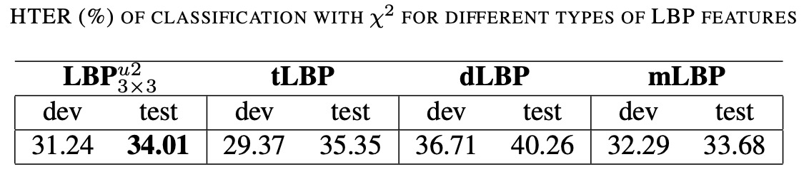

## 軽快な微細構造

[**On the Effectiveness of Local Binary Patterns in Face Anti-spoofing**](https://infoscience.epfl.ch/server/api/core/bitstreams/70fcdacd-de76-46e2-8b91-e338039bd09b/content)

---

ここではいくつかの重要な用語を定義できます：

1. **アクティブライヴネス**：ユーザーが指定された動作や指示に従って操作を行う（例えば、まばたき、顔を回すなど）。これらの動作はシステムによって要求され、その後システムが動作が期待通りであるかどうかを検出し、ユーザーの身元を確認します。
2. **パッシブライヴネス**：ユーザーが意識せずに自然な動作を行う（例えば、カメラを自然に見つめたり、微笑んだり）。システムはこれらの動作を自動的に検出し、ユーザーの身元を確認します。

簡単に言えば、パッシブライヴネス技術は、ユーザーが積極的に協力することなく、自然な行動を通じて身元を認証することを目指しています。この技術はユーザーの利便性を高め、認証プロセスでの負担を減らすことができます。

言い換えれば、負担を減らすことができますが、よく考えると「アクティブライヴネス」の技術は攻撃者に利用されやすいという問題があります。例えば、攻撃者がユーザーの動作を録画し、その映像を認証システムに再生することで、身元確認を回避することができてしまいます。

:::tip
**いくつかの動作をランダムに組み合わせることはできませんか？**

可能ですが、動作が増えることでユーザーは不快に感じる可能性があります。

ユーザーに対する要求は、全体の体験を低下させます。最終的には技術部門がマーケティング部門に要求され、ユーザーの負担を減らす方向へと進むことになるでしょう。これで元の問題に戻ってしまいます。
:::

## 問題の定義

著者は、過去の文献において攻撃シナリオやデータセット構築時に多くの単純化された仮定があり、現実のアプリケーションにおける多様性や複雑さを完全には反映していないと考えています。したがって、著者は実用的な価値のある改良方向を提案しようとしています。

この論文では、いくつかの重要な攻撃方法が定義されています：

1. **Print Attack**：攻撃者が印刷した写真でシステムを欺く。
2. **Mobile Attack**：攻撃者が携帯電話の画面で写真やビデオを再生する。
3. **Highdef Attack**：攻撃者が高解像度の画面で写真やビデオを再生する。

以下の図では、最左列が実際のユーザー、2 列目が Print Attack、3 列目が Mobile Attack、4 列目が Highdef Attack です。

<figure style={{"width": "90%"}}>

</figure>

これらの攻撃シナリオをよりリアルにシミュレーションするために、著者は新しい公開データセット REPLAY-ATTACK を作成し、文献で提案された多尺度 LBP 手法に基づき、特徴抽出の設計を再考しました：

- **シンプルな Local Binary Patterns（LBP）バリアントを採用し、画像のテクスチャにおける重要な情報に焦点を当て、検出効率を向上させました。**

この方向性は、以下の研究に触発されたものです：

- [**[11.10] Face spoofing detection from single images using micro-texture analysis**](https://ieeexplore.ieee.org/document/6117510)

後の比較を容易にするため、著者はこれを文献[7]と略し、本論文と対比しています。

著者は、文献[7]と比較して、以下の点で具体的な改善を行ったと考えています：

- **攻撃シナリオとデータが実際のアプリケーションにより近い**：文献[7]は NUAA データセットのみを使用しており、静止画像の印刷された写真攻撃しか含まれていません。現実世界の攻撃手法を模倣するには依然として単純すぎます。
- **特徴設計を簡素化し、効率性と実装性を向上**：文献[7]の多尺度 LBP 特徴は分類精度において良好な結果を示していますが、その 833 次元の高次元特徴ベクトルは計算負荷が大きいという問題があります。

:::tip
その当時は論文の手法に名前を付けることがあまり流行っていなかったので、「ある文献のある手法」というような表現がよく見られます。冗長であったり、極端に簡潔だったり、どちらにしても判別が難しいことが多いです。
:::

## 解決策

<figure style={{"width": "90%"}}>

</figure>

上記の図は、LBP に基づくフェイスアンチスプーフィングアルゴリズムのフローを示しています。

入力端はまず原画像を受け取ります。顔検出技術を使用して画像内の顔領域を特定し、その領域を固定サイズ（例えば 64×64 ピクセル）にリサイズします。このステップは、その後の特徴抽出が統一されたスケールで行われることを保証します。

次に、特徴抽出には 2 つの異なる戦略が使用されます：

1. **オプション 1**：画像全体に対して LBP 特徴を計算し、59 次元のヒストグラムを生成します。このヒストグラムがその画像のテクスチャ特徴ベクトルです。
2. **オプション 2**：画像を 3×3 のブロックに分割し、各ブロックに対して独立して LBP 特徴を計算し、すべてのブロックのヒストグラムを結合して、531 次元の特徴ベクトルを形成します。

最後に、これらの特徴ベクトルを分類器に入力し、二項分類を行って、真偽を判定します。

後ほど、各ステップの詳細を見ていきます。

### Local Binary Patterns

灰度画像 $I(x,y)$ の任意のピクセルに対して、その LBP 演算子は 3×3 の近傍を基にします。

中央のピクセル値を $I(x,y)$ とし、その周囲の 8 つの近傍ピクセルを $\{I(x_p,y_p)\}_{p=0}^{7}$ とします。

各近傍ピクセルに対して、比較関数を定義します：

$$
s(z)=
\begin{cases}
1, & \text{if } z \geq 0, \\
0, & \text{if } z < 0.
\end{cases}
$$

したがって、中央ピクセルの LBP 値の計算式は次のようになります：

$$
LBP(x,y) = \sum_{p=0}^{7} s\big(I(x_p,y_p) - I(x,y)\big) \cdot 2^p.
$$

この式は 8 つの比較結果（各結果は 0 または 1）を 8 ビットの二進数に変換し、その対応する数値範囲は $0$ から $2^8-1 = 255$ となります。

### ユニフォーム LBP

この論文では、ユニフォーム LBP を $LBP^{u2}$ として記載しています。

可能な 8 ビットの二進数パターンの中には、いわゆる「ユニフォーム」なパターンがあり、これは循環的にチェックした際に、0 から 1 あるいは 1 から 0 への変換が最大でも 2 回にとどまるパターンです。

形式的には、二進数列 $b_0b_1\ldots b_{P-1}$（ここで $P=8$）に対して、その変換回数 $U$ が次の条件を満たす場合

$$
U(b_0,\ldots,b_{P-1}) \leq 2,
$$

このパターンはユニフォームと呼ばれます。

非ユニフォームのパターンは通常、単一のクラスに統合されます。これにより、ヒストグラムの次元を大幅に削減できます。3×3 の近傍では、よく得られるユニフォームパターンの総数は 59 個であり、したがって全体の特徴ベクトルの次元は 59 になります。

### 特徴ベクトルの生成

- **(1) 画像単位の特徴**

  - **全画像ヒストグラム**：顔領域全体（通常は顔の境界ボックスを 64×64 ピクセルに正規化）内の各ピクセルに対して LBP$^{u2}_{3\times3}$ を計算し、各ユニフォームパターンの出現回数を統計して 59 次元のヒストグラムを作成します。正規化後、このヒストグラムがその画像のテクスチャ特徴ベクトルとして使用されます。

- **(2) ブロック単位の特徴**

  - **ブロックヒストグラム**：正規化された顔画像を $3\times3$ のブロックに分割し、各ブロックについて 59 次元の LBP ヒストグラムを計算します。その後、すべての 9 つのヒストグラムを接続して、$59\times9 = 531$ 次元の特徴ベクトルを形成します。この方法は、額や頬などの顔の局所領域のテクスチャ差異をより細かく捉えることができます。

:::tip
ここまで来ると、畳み込みニューラルネットワーク（CNN）の感覚が少し感じられると思います。ただし、この時点では手動で特徴抽出を行っており、次元爆発を避けるために特別な方法で次元削減を行っています。
:::

### LBP の拡張バリエーション

基本的な LBP$^{u2}_{3\times3}$ の他にも、以下のようなバリエーションが実験されています：

- **tLBP（Transitional LBP）**：この方法では、中央ピクセルに隣接する 2 つの近傍ピクセルを循環的に比較して二値パターンを形成します。この方法は隣接ピクセル間の遷移特性を強調します。
- **dLBP（Direction-coded LBP）**：dLBP は、中央ピクセルを通過する 4 つの基本的な方向に沿って強度変化を符号化し、各方向を 2 ビットで表現します。これにより、より多くの方向性情報を捕えることができます。
- **mLBP（Modified LBP）**：mLBP は Modified Census Transform (MCT) の概念に似ており、中央ピクセルと各近傍ピクセルを直接比較するのではなく、近傍ピクセルを 3×3 の領域の平均値と比較し、中央ピクセルと平均値の比較結果は除外します。これにより、中央ピクセルによるノイズの影響を減らすことができます。

### 分類器

LBP 演算子によって得られる特徴ベクトルは本質的に正規化されたヒストグラムであるため、初歩的な分類器には通常、$\chi^2$ ヒストグラム比較法が用いられます。具体的な方法は次の通りです：

- 訓練段階では、すべての真のアクセス画像に対してヒストグラムを計算し、その平均値を算出して参照ヒストグラムを得ます；
- 測定画像に対しては、その LBP ヒストグラムを計算し、$\chi^2$ 距離を用いて参照ヒストグラムとの類似度を測定し、分類スコアを得ます。

さらに、論文ではより複雑な分類器（例えば線形判別分析（LDA）やサポートベクターマシン（SVM））も検討されていますが、基本的な LBP 特徴と $\chi^2$ 分析だけで、真実と偽造画像間のテクスチャの違いを効果的に捉えることができます。

:::info
$\chi^2$ ヒストグラム比較法は、2 つのヒストグラム間の差異を測定する統計的距離で、画像特徴の分布を比較する際に主に使用されます。

2 つのヒストグラム $H$ と $G$ があり、それぞれの bin の値が $H_i$ と $G_i$（ここで $i=1,2,\ldots,N$）とします。$\chi^2$ 距離は次のように定義されます：

$$
\chi^2(H, G) = \sum_{i=1}^{N} \frac{(H_i - G_i)^2}{H_i + G_i + \epsilon},
$$

ここで $\epsilon$ は非常に小さな値で、除算によるゼロ除算を防ぎます。

実際の応用では、$\chi^2$ 距離が小さいほど、2 つのヒストグラムの分布が似ていることを示します。LBP によって画像のテクスチャ特徴を抽出した後、得られた特徴ベクトルは実際にはヒストグラムであり、この場合、$\chi^2$ ヒストグラム比較を用いて、測定画像と参照ヒストグラム（例えば、すべての真のアクセス画像の平均ヒストグラム）との類似性を測定し、画像が真のアクセスか偽造攻撃かを判断します。
:::

## データセットの概要

本論文では、顔認識システムのフェイク対策技術を研究するために、**REPLAY-ATTACK** という公開データセットを提案しています。以下はデータセットの主要な構成です：

- **データセット名**：REPLAY-ATTACK
- **データセットのサイズ**：50 名の被験者を含み、合計 1,200 本のビデオ（各被験者 24 本のビデオ）。
- **ビデオの長さとフォーマット**：各ビデオは 15 秒間、解像度は 320×240（QVGA）、フレームレートは 25 フレーム/秒。
- **撮影シーン**：ビデオは 2 つの静的シーンで撮影されました：
  1. **Controlled 条件**：背景は均一で、照明は蛍光灯によるもの。
  2. **Adverse 条件**：背景は不均一で、照明は自然光によるもの。
- **撮影機器**：Apple 13 インチの MacBook でビデオを録画し、被験者はカメラの前に座って撮影されます。
- **攻撃方法**：データセットでは、3 つの一般的な偽造攻撃手法を設計しています：
  1. **Print 攻撃**：レーザープリンター（Triumph-Adler DCC 2520）を使用して、高解像度の写真を A4 用紙に印刷。
  2. **Mobile 攻撃**：iPhone 3GS で写真やビデオを撮影し、デバイスのスクリーンで再生。
  3. **Highdef 攻撃**：Canon PowerShot SX150 IS で高解像度のコンテンツを撮影し、iPad（1024×768）のスクリーンで再生。
- **攻撃の実行モード**：各攻撃には 2 つの実行方法があります：
  1. **Hand-based**：操作員がデバイスを手に持って攻撃し、画面にわずかな揺れが生じることがあり、時にはまばたき検出器を欺くことがあります。
  2. **Fixed-support**：デバイスは固定スタンドに置かれ、揺れはありません。
- **ビデオの分類**：データセットは被験者をランダムに 3 つのサブセットに分けて分類されます：訓練セット、開発セット、テストセット。攻撃ビデオも攻撃方法に基づいて分類されます（手持ち／固定）。
- **訓練の推奨**：訓練セットと開発セットを使用してモデルの訓練とパラメータ調整を行い、テストセットは最終評価のみに使用することを推奨します。
- **追加データ**：同じ照明条件で録画された 100 本の「登録ビデオ」が提供され、基礎的な顔認識モデルを訓練し、攻撃品質を評価します。
- **データセットの公開性**：データセットとソースコードはすべて無料で公開されており、完全なライセンスと使用ガイドラインが提供されています。
- **データセットの URL**：[**REPLAY-ATTACK**](https://www.idiap.ch/en/dataset/replayattack)

---

<figure style={{"width": "80%"}}>

</figure>

上記の表は、REPLAY-ATTACK データセットの異なるサブセットにおけるビデオの数の分布を示しています。

## 実験評価方法

:::tip
この評価方法は現在でも非常に一般的な手法であるため、見逃さないでください！
:::

検出システムには 2 種類の誤りが発生する可能性があります：

- **False Rejection Rate (FRR)**：正当なアクセスが誤って拒否される割合（正当なものが攻撃として誤判定される）。
- **False Acceptance Rate (FAR)**：攻撃サンプルが誤って受け入れられる割合（攻撃者が正当なアクセスとして誤判定される）。

これらの誤りの総合指標が **Half Total Error Rate (HTER)** で、計算式は次のようになります：

$$
\text{HTER} = \frac{\text{FAR} + \text{FRR}}{2}
$$

FAR と FRR はともに閾値に影響されるため、ROC 曲線を使用して異なる閾値でのパフォーマンスを表示し、EER（Equal Error Rate、FAR と FRR が等しい点）を開発セットで選択し、その後テストセットで HTER を報告します。

- **HTER のスコアが低いほど、分類器は正しい顔認証の判別がより正確であることを示します。**

実験では、著者は 3 つのデータセットを評価に使用しました：REPLAY-ATTACK、NUAA、CASIA-FASD。

NUAA と CASIA-FASD データセットには独立した開発セットがないため、5 分割交差検証を行い、平均 HTER を報告します。

## 討論

### 異なる LBP 特徴の比較

<figure style={{"width": "80%"}}>

</figure>

上記の表は、$\chi^2$ ヒストグラム比較法を分類器として使用し、異なる LBP 特徴の変種を分類した場合の REPLAY-ATTACK データセットでの HTER 結果を示しています。

- **LBP$^{u2}_{3\times3}$**：これは一般的な「ユニフォーム LBP」で、3×3 の近傍で LBP 値を計算し、変換回数が 2 回以下のパターンのみを保持して最終的に 59 次元のヒストグラムを生成します。
- **mLBP（修正された LBP）**：計算時に、二値比較に加えて、3×3 の近傍内のピクセル強度の平均値を先に計算し、それを各近傍ピクセルと比較します（中央ピクセルと平均値の比較は除外）。これにより、少し改善されたテクスチャ記述が得られます。

他の拡張された LBP 変種（例えば tLBP、dLBP）も実験で評価されている可能性がありますが、上表の焦点は mLBP と従来の LBP$^{u2}_{3\times3}$ の効果を比較することです。

mLBP は、真のアクセスと攻撃を区別する点でわずかに優れた効果を持っていますが、計算コストと方法の普及性を考慮すると、LBP$^{u2}_{3\times3}$ が後続の比較の主要な特徴として選ばれました。これは、防偽タスクにおいて、方法は高精度を達成するだけでなく、計算効率と実装の複雑さも考慮する必要があることを示しています。

### 異なるデータセットの比較

<figure style={{"width": "90%"}}>

</figure>

- **∗（アスタリスク）**：この行の結果は、Bob ツールボックスを使用して文献 [7] の方法を再現したもので、特徴抽出と分類を含みます。
- **‡（ダブルクロス）**：これは文献 [7] から報告された元の数値を示しており、その結果は Matlab で LBP 特徴を実装し、LibSVM で分類を行ったものです。
- **§（段落記号）**：これは文献 [7] の著者が提供した特徴を使用し、Bob ツールボックスで分類した結果を示しています。

  :::info
  すでに前述しましたが、念のため再確認しておきます。

  文献 [7] を参照する場合、この論文を参照してください：[**[11.10] Face spoofing detection from single images using micro-texture analysis**](https://ieeexplore.ieee.org/document/6117510)
  :::

---

異なる方法のパフォーマンスを比較するために、著者は 3 つの公開データセットで実験を行い、それぞれの HTER を指標として LBP 特徴を計算しました。これらの結果はすべて 5 分割交差検証の平均値です。

特徴抽出の戦略として、**REPLAY-ATTACK は全画像特徴を使用し、NUAA と CASIA-FASD はブロック特徴を使用**しています。

結果は、異なるデータセットにおいて、特徴の選択が分類性能に顕著な影響を与えることを示しています：

- **REPLAY-ATTACK** データセットでは、全画像特徴が最良の結果を得ました。これは画像品質が高く、撮影環境が安定しているため、全体的なテクスチャ分布が代表的であることに起因する可能性があります。
- 対照的に、**NUAA** と **CASIA-FASD** データセットでは、ブロック特徴が優れたパフォーマンスを示しました。これらのデータセットは画像品質が低く、環境が複雑であるため、局所的なテクスチャの違いがより明確に現れる可能性があります。

さらに、表には NUAA データセットでの分類器の**過学習の現象**も示されています。訓練／開発セットで良好なパフォーマンスを発揮したものの、テストセットでは大きく成績が低下しました。

:::tip
これは防偽データセットを設計する際、訓練、開発、テストセットを厳密に区別する必要があることを強調しています。モデルの一般化能力を確保するために重要です。
:::

モデル設計の観点から見ると、文献 [7] で使用された 833 次元の拡張特徴ベクトルは、約 1.3% の精度向上をもたらしましたが、その代償として多くのサポートベクターが必要です。例えば 59 次元の特徴を使用した場合、SVM のサポートベクターは 25,717 個に達し、性能とリソース消費に関して慎重にバランスを取る必要があることが示されています。

:::info
**豆知識：**

著者は文献 [7] の結果を再現した際、データに問題があることを発見しました！

NUAA データセットで、著者が再現した方法の HTER は 13.17% で、元の文献に記載された 2.5% と大きく異なります。

詳細な比較の結果、差異の一部は LBP 特徴の実装の違いに起因していることがわかりました。元の著者は Matlab で特徴を実装しており、約 4% のエンコードが双線形補間処理で異常を示し、結果に影響を与えました。

その後、元の特徴を使用し、Bob ツールボックスで分類した場合、HTER は 4.23% に低下しました。これは元の報告値に近いですが、それでも差異があり、交差検証の戦略の不一致が原因である可能性があります。
:::

## 結論

深層学習が主流となる前の時代に、著者はすでに明確に指摘していました：顔認識モデルがどれだけ優れていても、効果的な防偽検出がなければ、システムの信頼性を確保することはできません。この視点は今日でも有効であり、「Face Anti-Spoofing」は生体認証システムにおいて不可欠なコアモジュールの一つとなっています。

次に、REPLAY-ATTACK データセットは、当時数少ないビデオ攻撃に特化し、さまざまな偽造タイプをカバーする公開リソースの一つでした。Print、Mobile、Highdef の 3 つの攻撃だけでなく、異なるデバイスや録画条件も考慮し、完全な訓練とテストのプロトコルを設計しました。これにより、後続の多くの FAS 研究の基準が確立され、データセットの標準化のトレンドを促進しました。

今日の視点から見ると、LBP 特徴は CNN や Transformer などの深層モデルに対して競争力がなくなったものの、その「計算効率が高く、再現性が強い」という特長は、リソースが限られたシナリオにおいて今でも実用的な価値を持ち、全体の分野の発展方向を築きました。
