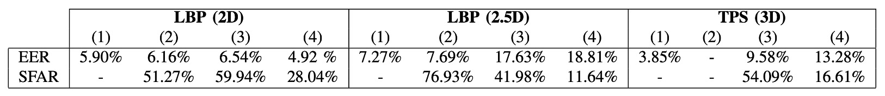

## 現実の仮面

[**Spoofing Face Recognition with 3D Masks**](https://infoscience.epfl.ch/server/api/core/bitstreams/1694cd6d-ff27-4323-8993-c76232d5aa14/content)

---

以前、私たちはどんな悪意のある攻撃を見てきましたか？

- **印刷攻撃**：攻撃者はターゲットユーザーの写真を印刷し、それを顔認識システムのセキュリティを突破するために使用します。
- **リプレイ攻撃**：攻撃者はターゲットユーザーのビデオを録画し、それを再生して顔認識システムを欺きます。

解像度が低いと言っていますか？それなら、4K ディスプレイで再生すればいいだけです。

## 問題の定義

私たちがこれらの 2D 攻撃に注目している間に、3D 攻撃がすでに登場しました。

この論文の著者は、3D 再構築と印刷技術の進展に伴い、過去の研究が攻撃のタイプを 2D 攻撃の仮定に基づいていたことを指摘しています。この仮定はもはや成り立ちません。

なぜなら、私たちは簡単に 2D 写真から 3D モデルを再構築し、それを印刷してターゲットユーザーの顔の構造に非常に似たマスクを作ることができるからです。

このマスクは簡単に次のことを可能にします：

1. **深度効果**：深度検出システムを突破することができます。
2. **表情**：能動的なライブ検出システムを突破することができます。

これは印刷でも録画でもありません。すべての 2D 攻撃に基づく防御システムを直接突破することができます。

あれ！大変だ。

## 問題の解決

3D マスク攻撃の課題に対して、著者は直接的な解決策を提案しています：

- **まず、代表的な 3D マスク攻撃のデータセットを構築し、それに基づいて新しい防御システムを訓練する**。

この戦略はデータ実装から始まり、実際のシナリオにおける攻撃のパターンと認識モデルの弱点を明確にするのに役立ちます。

### Morpho データセット

Morpho は、MORPHO 社が TABULA RASA プロジェクトで収集した非公開のデータセットです。公開されていませんが、3D マスク攻撃のサンプルを高精度で含んでいる数少ないデータセットの 1 つであり、初期の FAS 研究にとって重要な意味を持っています。

データセットには次のものが含まれています：

- 207 件の実際のアクセスサンプル
- 199 件の 3D マスク攻撃サンプル
- 2D カラー画像と 3D 顔モデルの両方が提供されている

これらのマスクは 16 人の特定のユーザーに対して作成され、まず構造光 3D スキャナーで顔のモデルを構築し、次に 3D 印刷技術でグレースケールの素材を使用してリアルな外観のマスクを作成しました。録画過程では、各ユーザーは 9 回から 15 回撮影され、合計で 20 人の被験者データが含まれ、各フレームには 2 つの目の角と鼻の先端の座標が注釈されています。

**特徴と制限は次の通りです：**

- マスクは非常に高い形状精度を持ち、実際の顔を正確に再現しています。
- すべてのサンプルは単一の撮影セッションで完了しており、環境の変動を避けています。
- 被録画者は静止している必要があり、攻撃者がスキャンデータを取得する難易度を高めています。
- データセットは非公開リソースであり、公開研究基準としては使用できません。

データセットサンプルは以下のようになっています。最左側がターゲットユーザーのグレースケール顔画像、中央が深度画像、最右側が 3D マスクのグレースケール画像です。これらのサンプルはすべて Morpho データセットから取得されたものです。

<figure style={{"width": "60%"}}>

</figure>

### 3D Mask Attack Database（3DMAD）

従来、製作方法は 3D スキャナーに依存し、**近距離でユーザーの協力を得る必要があり**、実際の攻撃シナリオでは実現が難しいものでした。スキャン精度は向上しましたが、「高品質な 3D 顔データ」を許可なしで取得することは依然として非常に困難です。そのため、初期の研究では 3D マスク攻撃の普及が制限されていました。

しかし、近年、**3D プリントと顔のモデリング技術の商業化サービスが急速に発展**し、マスク製作の技術的な敷居と取得難易度が大幅に低下しました。私たちはユーザーの 2D 顔写真（例えば、ソーシャルメディアのプロフィール写真）を取得するだけで、ほとんどリスクを感じることなく、より現実的な脅威となります。

この**低コスト、高い取得可能性**の攻撃パターンを模擬するために、著者は**[ThatsMyFace.com](https://www.thatsmyface.com/)**という第三者サービスを選択して、マスクの製作を行いました。

製作手順は以下の通りです：

- **画像収集：** 各被験者は**正面写真**と**左右の側面写真**（左と右）を各 1 枚、計 3 枚の高品質な 2D 顔画像を提供する必要があります。これらの画像が 3D 顔再構築の入力として使用されます。
- **モデル再構築とマスク印刷：** ThatsMyFace にアップロード後、プラットフォームはこの 3 枚の写真を基に 3D 顔モデルを再構築します。ユーザーはウェブサイト上でモデルをプレビューし、外観を確認後、注文して製作を依頼します。

著者は各ユーザーに対して 2 種類のマスクを作成しました：

- **着用可能なフルサイズマスク：** 硬質樹脂製で、目と鼻の穴があり、実際の攻撃を模倣しています。

  

  <figure style={{"width": "80%"}}>
  
  </figure>
  

- **ペーパークラフト組み立てマスク：** より低コストで、展示用や将来の参照用に使用されます。

  

  <figure style={{"width": "70%"}}>
  
  </figure>
  

データセットには、各ユーザーがアップロードした画像（正面および側面写真）、ペーパークラフトマスクのファイル、印刷用の STL モデルファイルが含まれており、今後の研究に使用できるようになっています。

---

3D マスクが完成した後、著者は実際のアクセスと攻撃の動作を模倣し、モデル訓練に必要なカラー画像と深度画像を収集するための厳密なデータ収集プロセスを設計しました。

収録作業は Microsoft Kinect for Xbox 360 を使用して行い、このデバイスは RGB および深度画像を同期してキャプチャすることができ、3D マスク攻撃の検出と分析において重要な価値を持ちます。

Kinect の特徴は以下の通りです：

- **1 秒間に 30 フレーム**：RGB と深度画像を同期してキャプチャ
- **画像解像度**：
  - カラー画像：640 × 480 ピクセル、24 ビット（3 × 8 ビット）
  - 深度画像：640 × 480 ピクセル、11 ビット（1 × 11 ビット）
- **手動アノテーション対応**：カラー画像に対して目の位置を手動でアノテーションすることが可能

この設計により、研究者は攻撃サンプルを多モーダルな視点から分析でき、より堅牢な防御アルゴリズムの開発に役立つだけでなく、2D と 3D モデルが異なるシナリオでどのように認識能力を発揮するかを比較することができます。

---

異なる状況での実際の行動を模倣するために、3DMAD の収録作業は 3 つの異なる撮影セッションで行われました。このデザインは、時間、役割、攻撃要因の影響を考慮し、データの多様性を効果的に確立することができます。

各ユーザーの撮影スケジュールは以下の通りです：

- **セッション 1、セッション 2**（実際のアクセス）：

  - 2 週間の間隔で撮影し、生体認証における「時間差」の課題を反映
  - 各セッションで 5 本の動画を撮影、各動画は 10 秒の長さ
  - ユーザーはカメラを直視し、通常の顔のインタラクション

- **セッション 3**（マスク攻撃）：

  - **単一の攻撃者**が事前に作成された 3D マスクを装着し、攻撃を模倣
  - 各マスクについて 5 本の動画を撮影し、異なる攻撃動作と角度を模擬

- **全体規模**：
  - 17 人のユーザー × 3 つのセッション × 5 本の動画 = **合計 255 本の動画**
  - 各動画は 10 秒間で、合計 300 フレーム、総計約**76,500 フレーム**の RGB と深度データ

実際の撮影サンプルは以下の画像のようになっています。左から右に順番に、上述の 3 つのセッションに対応しています：

<figure style={{"width": "90%"}}>

</figure>

---

後続のモデル訓練の品質と一貫性を確保するために、著者はデータのアノテーションと撮影環境を厳格に制御しました：

- **目の位置アノテーション**：

  - 各動画の 60 フレームごとに目の位置を手動でアノテーション
  - 残りのフレームは線形補間を使用して自動的に補完し、すべてのフレームにアノテーション座標を提供

- **撮影環境設計**：
  - ユーザーはカメラに正面を向けている
  - 背景は統一され、干渉するパターンはない
  - 照明が十分で、顔の影や過曝を避ける

この環境設定により、背景と光の干渉を最大限に排除し、マスクと本物の顔の違いに焦点を当てることができます。

## 討論

:::tip
まずはこの 2 つの指標の定義を覚えておいてください、そうしないと後のグラフが理解できませんよ！
:::

顔認識システムのマスク攻撃に対する脆弱性を体系的に評価するために、著者は本研究で複数のベンチマーク実験を提案し、**Equal Error Rate（EER）** と **Spoofing False Acceptance Rate（SFAR）** を主要な評価指標として使用しました：

- **EER** は、システムが認証タスクにおいて誤認識と誤拒否の発生確率が等しくなる閾値誤差率を示し、「低いほど」認証システムが正確であることを意味します。
- **SFAR** は、偽造攻撃専用の指標であり、「攻撃サンプルが認証閾値を通過する率」を定量化し、システムがマスク攻撃に対してどれだけ耐性があるかを反映します。「低いほど」システムが安全であることを示します。

### 3D マスク攻撃のセキュリティ分析

:::info
**本論文での参考文献 [22] は以下を指しています：**

- [**[13.03] On the vulnerability of face recognition systems to spoofing mask attacks**](https://ieeexplore.ieee.org/abstract/document/6638076)
  :::

上表は、3 つのアルゴリズム（LBP-2D、LBP-2.5D、TPS-3D）が異なるデータセットと前処理戦略において示す認証誤差率（EER）とマスク攻撃成功率（SFAR）を、4 つの設定に分けて示したものです：

- (1): 文献 [22] で報告された結果（Morpho データセットに限る、SFAR は提供なし）
- (2): 文献 [22] が提供する前処理画像を使用し、著者実装のアルゴリズムでテスト（Morpho）
- (3): 著者による独自の前処理プロセスとアルゴリズムを用いた完全な再構築実験（Morpho）
- (4): 独自の前処理とアルゴリズムを用い、3DMAD データセットでテスト（認証と攻撃両方を含む）

---

表のデータから、著者は(2)で文献 [22] の EER 結果をほぼ再現できたことがわかり、アルゴリズムの実装と設定が一致しており、良好な再現性と参考価値を持っていることが示されました。

2D モードでは、前処理方法（(2)から(3)へ）を変更しても EER のパフォーマンスには顕著な変化はなく、切り取りや幾何学的標準化のプロセスが一致していることが確認されました。しかし、SFAR は明らかに上昇しており、マスクのエッジが画像に現れるかどうかが攻撃成功率に重要な影響を与えていることを示しています。

2.5D および 3D モードでは、文献[22]のスムージングや補間処理を省略すると、EER と SFAR が同時に悪化します。これにより、前処理の品質がモデルの安定性と攻撃耐性に深刻な影響を与えることがわかります。

異なるデータセットを比較した結果、同じアルゴリズムを使用した場合でも、3DMAD の全体的なパフォーマンスは Morpho に劣ることが示されました。原因としては以下が考えられます：

- Kinect で取得した深度情報は、Morpho で使用されたレーザースキャナーよりも品質が劣る
- 3DMAD のマスクは 2D 画像から再構築されたため、形状精度が低く、スプーフィング効果に影響を与える

---

著者はさらに、3DMAD の 17 個のマスクを一つ一つ分析し、4 つのアルゴリズム（LBP、TPS、ISV、ICP）が 2D、2.5D、3D モードにおける EER と SFAR を比較した結果を示しました。以下の図にその結果を示します：

<figure style={{"width": "90%"}}>

</figure>

分析の結果、異なるマスク間で SFAR に大きな差があり、0%から 98.4%に及びます。この差は主に以下の要因によるものです：

- マスクの形状精度
- 顔のテクスチャのリアルさと再現度

これにより、単一の平均値では全体的な攻撃リスクを反映できないことが示され、各マスクごとの分析がスプーフィング能力を評価するために必要であることがわかります。

著者はさらに観察を続け、同じマスクでも異なるモードでの攻撃パフォーマンスに顕著な違いがあることを発見しました。例えば：

- Mask #11 は ISV-2D モードで SFAR が 96.68%に達しましたが、2.5D モードではわずか 7.52%にとどまりました。

これは次のことを示しています：

- テクスチャ情報が強いマスクは 2D モードでは高い攻撃性を示す可能性がある。
- しかし、3D 構造が不十分だと、2.5D または 3D モードで効果的な攻撃を行うのが難しい。

同様に、同じマスクとモードであっても、異なるアルゴリズムが攻撃に対して異なる感度を示すことがあります。例えば：

- Mask #17 は ISV-2D で SFAR が 76.32%でしたが、LBP-2D に切り替えると 4.44%に減少しました。

これは、アルゴリズム自体の特性（識別能力や汎用性）が、マスク攻撃に対する耐性に直接的な影響を与えることを示しています。

---

これらの観察結果は、次の重要な事実を浮き彫りにしています：

> **顔認識の認証精度（EER）と攻撃耐性（SFAR）には非線形の関係があり、場合によっては逆相関することさえある。**

特に ISV や ICP のような高性能モデルでは、この現象がより顕著に見られます。

その背景にある理由は、高性能モデルが強力な汎用性を持ち、実際のユーザーの多様な外見の変化（表情、角度、光の具合など）を許容できるからだと考えられます。しかし、この汎用性が「外見が似ているマスクを真のユーザーとして誤認識してしまう」原因となり、結果的にセキュリティが低下することがあります。

実務においてこれは非常に重要であり、認識システムを設計する際には、EER を低くするだけでなく、SFAR も評価して、システムが偽造攻撃に対して耐性を持つようにする必要があることを示しています。そうでなければ、テストセットでは優れたパフォーマンスを発揮していても、実際に導入すると高リスクな環境にさらされる可能性があります。

:::tip
この討論章の他に、論文には当時のアルゴリズムに基づくパフォーマンス分析がありますが、これらは現代の深層学習モデルにとって参考価値が少ないため、ここでは省略します。
:::

## 結論

3DMAD は「3D マスクが顔認識システムに対して脅威となる」というテーマについて系統的に探求した初期の研究の 1 つです。

著者は Morpho と 3DMAD の 2 つのデータセットを用いて、さまざまな認証と防止実験を設計し、異なるモダリティ（2D / 2.5D / 3D）、特徴量（LBP バリエーション）、および分類器（SVM、LDA、$\chi^2$）のパフォーマンスの違いを分析しました。

全体的に、この研究はデータ構築、実験設計、指標評価において完全性を持ち、当時普及していなかった 3D スプーフィング領域において参考となる価値があります。特に、マスク製作精度とモデルの安定性の関係に関する分析は示唆に富んでいます。

しかし、2025 年の視点から振り返ると、この研究にはいくつか顕著な限界もあります：

- 評価が主に閉じたデータセットに基づいており、クロスデータセットや未知の攻撃に対する汎用テストが不足しています。
- モデル訓練は既知の攻撃サンプルに依存しており、実際の適用において予測不可能な攻撃タイプには対応できていない可能性があります。
- データ分布が変動すると、一部の結果のパフォーマンスが不安定であり、モデルのマスク多様性への適応能力が限られていることが示唆されています。

それにもかかわらず、この研究は方法設計と分析観点において依然として参考価値があり、後続の 3D マスク攻撃防止研究に基礎を築いたと言えます。深層学習とセンサー技術の進展に伴い、このテーマは今後さらに探求され、拡大されるべきです。
