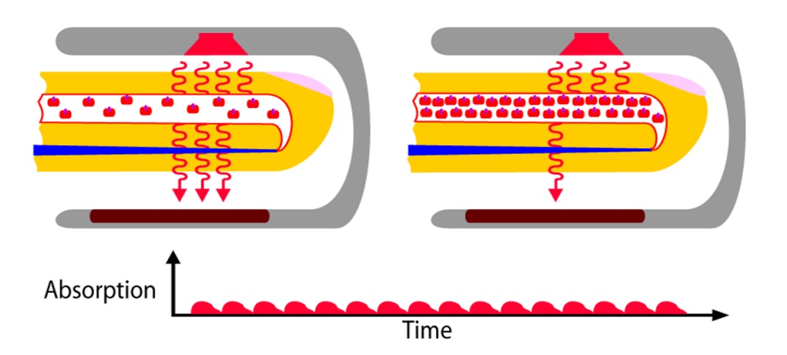
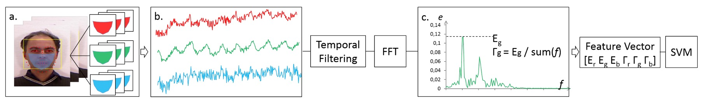
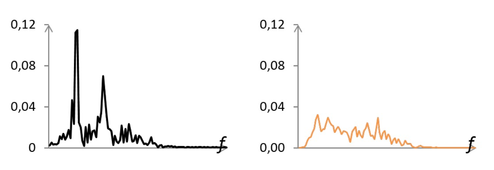

## 生命の光斑

[**Generalized face anti-spoofing by detecting pulse from face videos**](https://projet.liris.cnrs.fr/imagine/pub/proceedings/ICPR-2016/media/files/1223.pdf)

---

心拍信号（rPPG）は以前から多くの研究が行われてきましたが、主に生理学的モニタリングの用途に焦点を当てていました。

この 2016 年の研究は、初めて「心拍信号」が顔認証における不正防止（Face Anti-Spoofing）の分野に登場しました。

この研究は、テクスチャや表面を解析するのではなく、より根本的な存在証明を追求します：**命のリズムが実際に存在しているかどうか。**

## 問題の定義

<figure style={{"width": "80%"}}>

</figure>

**Photoplethysmography（PPG）**、上の図のように、これは非接触型の生理学的信号を取得する技術で、針やセンサーに依存するのではなく、光に依存しています。より正確には、光と血液の相互作用に依存しています。

光が露出した皮膚（耳たぶ、手首、頬など）に当たると、表面の血管内のヘモグロビンは心拍リズムに合わせて密度が変化し、その結果、異なる量の光を吸収します。これらの変化は肉眼では認識できませんが、光の反射強度に微弱な手がかりが残ります。PPG は、この輝度の変化を捉え、心拍の存在を間接的に測定します。

この技術は、もともとは赤外線センサーと生命徴候のモニタリングに使用されていましたが、近年、研究者たちは以下のことを発見しました：**一般的な RGB カメラでも、顔の画像から同じ脈拍信号（rPPG）を復元できる**。

心拍ごとに顔色は非常に微細な変化を遂げます。この信号は目視では認識できませんが、ROI を正確に選び、ノイズを適切に除去すれば、周波数帯域内でその信号が浮かび上がってきます。

FAS は長年「目に見える違い」に依存してきました：テクスチャの欠陥、色の歪み、深度の不備、微表情の遅延など、これらの外観に基づく戦略は、写真や動画攻撃に対しては多くの成果を上げてきました。しかし、3D マスクの素材やディテールがますますリアルになってきたため、この防御線にひびが入ってきました：

- **外観の違いは次第に消失**：シリコン型、3D 印刷、カラーペイントの成熟により、偽顔はほとんど本物と見分けがつかなくなり、従来の LBP やテクスチャモデルは信頼できなくなっています。
- **シーンや機器の変異**：異なるカメラや圧縮条件は画像の周波数構造を歪め、モデルが実際の使用環境で一般化できなくなります。
- **攻撃の進化**：ハードウェアの敷居が低くなると、新しい攻撃手段が次々と現れます。スクリーン再生からフルフェイスマスクまで、各変化は防御線崩壊の可能性を秘めています。

これにより、次第に問題が浮かび上がります：

> **もし顔の外観全てが模倣できるなら、私たちは画像から「生きている」と識別することができるのでしょうか？**

この論文は、すべての視覚的手がかりを省き、より根本的な信号に問いかけます：**この顔には心拍があるのか？**

しかし、この道は簡単ではありません。

rPPG 信号は微弱で脆弱であり、環境光の変動、頭の動き、エンコードノイズに飲み込まれやすいのです。

モデルがこれを認識するには、何層もの干渉を通り抜け、ようやく生者の脈動にたどり着かなければなりません。

## 解決問題

顔の画像から心拍を抽出することは、まるでサイエンスフィクションのように聞こえますが、これは実際に存在する技術です。

しかし、この研究では、それを追跡可能な信号処理のプロセスとして分解しています。

全体の構成は、単純な 3 つの部分に分かれています：ROI の抽出、信号変換、分類判断。

### 顔検出と ROI 追跡

最初に、モデルの入力は$n$フレームを含む顔の動画です。

著者はここで、顔全体を使用するのではなく、目の部分を選択するのでもなく、顔の下半分（両頬、鼻、口、顎）に焦点を当て、額と目を避けて髪の毛や眼鏡の遮蔽リスクを減らします。

具体的なプロセスは以下の通りです：

- **Viola-Jones**検出器を使用して、最初のフレームの顔領域を抽出；
- **DRMF**モデルを適用して、66 個の顔のランドマークをラベル付け；
- その中から 9 つのポイントを選んで ROI を構成し、安定した裸肌の領域を固定選択；
- **KLT 光流追跡**技術を使用して、各フレームで ROI の座標を動的に更新；
- 各フレームで ROI 内のピクセルの RGB 平均値を計算し、3 つの元のタイムシリーズ信号 $r_{\text{raw}}, g_{\text{raw}}, b_{\text{raw}}$ を構成。

その中でも、赤色チャネルを例に取ると、その原信号は次のようになります：

$$
r_{\text{raw}} = [r_1, r_2, \dots, r_n]
$$

この 3 つの信号が、まだクリーンアップされていない「心拍サンプル」であり、その中にはリズムが含まれている場合もあれば、完全にノイズである場合もあります。

### フィルタリング処理と周波数領域変換

ノイズからリズムを抽出するために、著者は 3 段階の信号クリーニングプロセスを設計しました：

- **トレンド除去（detrending）**：*smoothness priors*を使用して、遅い変動や非定常トレンドを除去；
- **移動平均（moving average）**：隣接するフレーム値を平滑化し、突発的なノイズを抑制；
- **バンドパスフィルタリング（bandpass filtering）**：Hamming ウィンドウを基にした FIR フィルタを使用し、0.7Hz から 4.0Hz の周波数範囲を保持、これは 42bpm から 240bpm の一般的な心拍数範囲に対応します。

フィルタリングが完了した後、3 つの信号は**高速フーリエ変換（FFT）**に送られ、周波数領域で表現されます：

<figure style={{"width": "80%"}}>

</figure>

上図に示すように、**本物の顔**の PSD（パワースペクトル密度）には主なピークが現れ（これが心拍に対応）、時には副次的な高調波も伴います。一方、**攻撃サンプル**（マスク/写真）には分散したノイズピークが多く、エネルギーが低く集中していません。

### 特徴設計

PSD を分類入力に変換するために、著者は 2 つの特徴を定義しました：

- **$E$**：心拍周波数範囲（0.7 \~ 4.0 Hz）内の最大パワー値；
- **$\Gamma$**：主ピークエネルギーと総エネルギーの比率で、周波数スペクトルの集中度を測定：

$$
\Gamma = \frac{E}{\sum_{f \in [0.7, 4]} e(f)}
$$

各チャンネルで$E$と$\Gamma$を計算し、6 次元ベクトルを構成します：

$$
\left[ E_r, E_g, E_b, \Gamma_r, \Gamma_g, \Gamma_b \right]
$$

### 分類器設計

最終的な分類は**サポートベクターマシン（SVM）**を使用し、2 クラス分類形式でモデルを訓練します：本物の顔と攻撃サンプル。

SVM は、小さいサンプル数と低次元特徴の分類問題を効果的に処理でき、これは本研究の「精緻な特徴設計」の理念と一致します。

## 討論

6 次元の生理信号特徴量が、異なる攻撃シナリオでどこまで通用するか？

著者は 3 種類の異なる攻撃をテストし、3 つの公開または独自に構築されたデータセットを使用しました：

- **3DMAD**：伝統的な 3D マスク攻撃データセット；
- **REAL-F**：より高品質なマスクを含む新しいデータセット（著者による自作）；
- **MFSD**：写真および動画再生攻撃を含むモバイルデバイス用データセット。

### 3DMAD データセット

3DMAD は最初に登場した、現在では唯一公開されている 3D マスク攻撃データセットの 1 つです。

このデータセットは、17 人の被験者、255 本のビデオを収録しており、3 つのセッションに分かれています：

- `s1` と `s2`：実際の顔、異なる日付で各 5 本ずつ撮影；
- `s3`：攻撃サンプル、**ThatsMyFace**によって作成された 3D マスクを使用し、第三者が被験者を模倣。

サンプルの独立性を確保するため、実験では**leave-one-subject-out**（LOOCV）設計を採用しました：毎回 1 人をテスト用に残し、残りの 16 人を訓練および開発用データに分け、合計 17 回のローテーションを行います。

特徴量と分類設定は以下の通りです：

- **Pulse 特徴**：各ビデオの最初の 10 秒間から、6 次元ベクトル $[E_r, E_g, E_b, \Gamma_r, \Gamma_g, \Gamma_b]$ を抽出；
- **分類器**：線形 SVM を固定使用、$C = 1000$、パラメータ調整なし；
- **ベースライン対照**：4 つのクラシックな LBP 設定を使用：

  - `LBP-blk`（グレースケールブロックヒストグラム、531 次元）
  - `LBP-blk-color`（RGB ブロックヒストグラム、1593 次元）
  - `LBP-ms`（マルチスケールグレースケールヒストグラム、479 次元）
  - `LBP-ms-color`（マルチスケール RGB、1437 次元）

最終評価指標として**HTER（Half Total Error Rate）**を使用し、その計算式は次の通りです：

$$
\text{HTER} = \frac{\text{FPR}(\tau^*) + \text{FNR}(\tau^*)}{2}
$$

ここで、$\tau^*$は開発データセットを使用して計算された最適閾値です。

実験結果は以下の表の通りです：

<figure style={{"width": "60%"}}>

</figure>

**Pulse 特徴は 3DMAD で HTER < 8%**を達成し、安定したパフォーマンスを示しています。簡単な特徴量と線形分類器を用いても 3D マスク攻撃に対抗できることが確認されました。

しかし、4 つの**LBP 対照群はこのデータセットで 0%の誤差率を記録**しており、一見完璧に見えます。しかし、その背後にはエンジニアリング現実が隠れています：

> **このデータセットでは、訓練とテストで同じマスクを使用しており、マスクには明らかな印刷されたテクスチャが存在します。**

つまり、LBP は「この皮膚に粒状のテクスチャがあるかどうか」を識別できますが、それが「生きている皮膚」かどうかは識別できないということです。

### REAL-F データセット

<figure style={{"width": "50%"}}>

<figcaption> 左側が3DMADの3Dマスク、右側がREAL-Fの高品質模擬マスク</figcaption>
</figure>

もし 3DMAD が訓練の場であれば、REAL-F はより実戦に近い場所です。

REAL-F のマスクは精緻に加工された高品質な模擬皮膚で、素材、テクスチャ、色合いにおいて人間の顔の外観に極限まで迫っています。現在利用可能な他の高品質な 3D マスクデータセットが存在しないため、著者は 2 つの REAL-F マスクを自ら購入し、対照データを録画して小型のテストセットを構築しました：

- **データ構成**：

  - 12 本の実際のサンプル（2 人の被験者から）；
  - 12 本の攻撃サンプル（第三者がマスクを着用して模倣）；
  - すべてのビデオは 10 秒間で、解像度は 1280 × 760、FPS は 30。

- **訓練データ**：

  - 3DMAD からランダムに 8 人を訓練セットとして抽出し、残りの 8 人を開発セットとして使用；
  - REAL-F はすべて**未見のテストデータ**として使用し、100 回のランダムな分割テストを行いました。

- **評価指標**：

  - 平均して 3 つの指標を報告：**EER**、**HTER**、および FNR = 0.1 と FNR = 0.01 での FPR。

実験結果は以下の表の通りです：

<figure style={{"width": "70%"}}>

</figure>

すべての**LBP 特徴の組み合わせは REAL-F で大きくパフォーマンスが低下**し、EER が明らかに上昇しました。最も良いパフォーマンスを示した`LBP-blk-color`でさえ、FNR = 0.01 の時点で攻撃サンプルの半分近くが真実のサンプルとして誤認識されました。

一方で、**Pulse 特徴は満点には達しませんでしたが、明確なマスク間の安定性を示し**、多くの実験で低い誤差率を維持しました。

この結果は次のことを示しています：

> **外観モデルはマスクの見た目を覚えているが、生理信号は覚えない。**

LBP のようなテクスチャに依存する方法には、2 つの明確な弱点があります：

1. 非常にリアルな皮膚テクスチャを持つ偽顔に対して、識別的な差異を抽出できない；
2. 訓練データが固定されると、新しいマスクタイプに対してモデルが一般化できなくなる。

これに対して、**脈拍信号は明確な意味を持つ定義（本物の脈動があるかどうか）**を持ち、マスクの種類を仮定する必要はなく、テクスチャの類似性にも影響されません。マスクが透明でなく、脈動がなければ、それは最終的に誤判定されます。

著者は誤判定ケースをさらに分析し、3DMAD と REAL-F のすべてのサンプルにおける$E_g$の分布を視覚化しました：

<figure style={{"width": "80%"}}>

<figcaption>脈拍特徴における \(E_g\) の分布。オレンジ色はマスク攻撃、低値領域に集中している</figcaption>
</figure>

ここでわかることは：

- 多くの攻撃サンプル（オレンジ色の × 印）の$E_g$値は非常に低く、PSD に主周波数がないノイズパターンに対応；
- 実際のサンプルの$E_g$値は一般的に高めですが、変動が大きく、肌の色、顔のサイズ、光源条件に密接に関連しています；
- 主な誤判定は、肌色が比較的暗く、顔の面積が小さい被験者に集中しており、これらの条件は rPPG 信号を弱めるか、ノイズ強度を増加させます。

ここから、この方法の限界が見えてきます：顔が暗すぎるか、画面の解像度が低すぎると、rPPG 信号は環境ノイズに埋もれ、正しく識別できなくなることです。

### 写真とビデオ攻撃

現実の世界では、最も簡単に手に入る攻撃手段は**1 枚の写真と 1 台のスマートフォン**です。

本実験では MSU MFSD データセットを選択し、35 人の被験者と合計 280 本のビデオを使用し、2 つの典型的な攻撃をカバーしています：

- **写真攻撃**（print attack）：高画質な紙の写真を使用；
- **ビデオ攻撃**（video replay）：iPad または iPhone で顔のビデオを再生；
- 各被験者には 2 本の実際のサンプル、2 本の写真攻撃、4 本のビデオ攻撃；
- 録画デバイスは MacBook Air と Nexus 5 の前面カメラ、解像度は 640×480 および 720×480。

モデルが異なる攻撃タイプでどのように機能するかを調査するため、著者はデータセットを 3 つのグループに分けました：

| テストグループ | 実際のサンプル | 攻撃サンプル | 説明                 |
| -------------- | -------------- | ------------ | -------------------- |
| MSU-photo      | 70             | 70           | 紙の写真攻撃         |
| MSU-video      | 70             | 140          | ビデオ再生攻撃       |
| MSU-all        | 140            | 210          | すべての攻撃サンプル |

- 15 人の被験者を訓練データ、20 人をテストデータとして使用；
- Pulse 特徴は前述と同様、各ビデオから 6 次元特徴ベクトルを抽出；
- 比較基準として、最も安定した性能を示す`LBP-ms-color`のみを選択し、テクスチャ特徴として使用。

実験結果は以下の通りです：

<figure style={{"width": "80%"}}>

<figcaption>PulseとLBP特徴が異なる攻撃シナリオでのEER性能</figcaption>
</figure>

- Pulse 特徴は写真攻撃（print attack）で最良の結果を示し、EER は**約 5%**；
- ビデオ攻撃では完全に失敗し、再生されたのは**実際の顔の録画で、脈拍信号は依然として存在**；
- LBP 特徴は正反対で、ビデオ攻撃では安定した認識力を示し、写真攻撃では比較的弱い。

これは Pulse 特徴の制限を証明しています：

> **それは「脈拍があるかどうか」を区別できるが、その脈拍が「現場のものか」「録画されたものか」を区別できない。**

ビデオ再生には脈拍信号が残っているため、Pulse にとっては実際の顔とほぼ同じです；
しかし、写真は静的な物体であり、生理的なリズムはないため、Pulse にとっては「偽の信号」に過ぎません。

## 結論

この論文は単に新しい方法を提案するだけでなく、FAS 技術の地図に新たな分岐点を開きました。

当時、rPPG は生理学的モニタリングの分野でのニッチな技術であり、偽装攻撃に対抗する主力技術とは見なされていませんでした。しかし、この論文はそれに明確な位置を与えました：**顔の外観に頼ることなく、「生きているかどうか」を識別することに焦点を当てた**。

この考え方は当時、かなり革新的でした。

当時の主流の見解では、「顔」の定義はテクスチャ、光と影、深度に基づいており、画面背後の生理信号に注目する人はほとんどいませんでした。この論文は、その微弱なリズムを舞台に引き上げ、それを証明しました：6 次元の心拍特徴は、クロスデータ一般化において千次元のテクスチャ記述子を凌駕することができると。

残念ながら、この方法は完璧ではなく、むしろ欠陥だらけと言えます：

- ビデオ攻撃にはほとんど無力；
- 光源、画質、肌の色に非常に敏感；

最も重要なことは：**データ拡張や大規模なモデルスタックで問題を解決できない**ことです。これは深層学習の時代にはほとんど耐え難い問題です！

しかし、それだからこそ、別の設計方向の可能性を明らかにしました：

> **モデルを拡大するよりも、次元を切り替えることで現行の方法の盲点を突破できることがある。**

この論文以降、rPPG 系の方法はさまざまなバリエーションを発展させました：CFrPPG、MCCFrPPG、MSTCT など、信号の安定性を改善する者、周波数領域での識別を結びつける者、赤外線信号との融合を試みる者など。FAS 技術は何度もスタイルを変更してきましたが、「**生体信号**」は高精度な攻撃に対抗するために最も取って代わりにくい手がかりの 1 つであり続けています。

現在、rPPG を FAS に使用していなくても、その精神はすべての開発者の心の中に根付いています。
