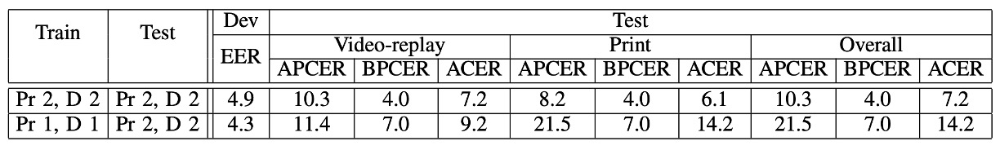

## 四つの試練

[**OULU-NPU: A Mobile Face Presentation Attack Database with Real-World Variations**](https://ieeexplore.ieee.org/document/7961798)

---

顔認識システムは、ユーザーと直接対面する生体認証システムです。

現在ではあらゆる場所に存在しており、通常は携帯電話に FaceID が搭載されています。

## 問題の定義

しかし、顔認識システムは非常に脆弱です。

過去の研究では、ソーシャルメディアからターゲットの写真をダウンロードするだけで、当時の 6 つの主流システム（Face Unlock、Facelock Pro、Visidon など）が簡単に一枚の写真で突破されることがわかりました。さらに、目をパチパチさせたり、頭を動かしたりするような活体認証設計も、ビデオ撮影を通じて突破されることがありました。

現在、市場にはいくつかの公開データセットがあり、PAD（Presentation Attack Detection）方法のベンチマークテストに使用できますが、これらのデータセットの評価方法は「理想化されすぎている」と言えます。すべてのテストは、訓練データとテストデータの条件が完全に一致する状況下で行われ、結果として非常に良い数値が出ますが、実際の世界ではすぐにその精度が崩れ、惨憺たる結果となります。

また、これらのデータセットの撮影条件も、携帯電話の使用シーンに適していません。多くの場合、静止したウェブカメラや DSLR カメラが使用されており、画質が低すぎたり高すぎたりして、日常的に使用される携帯電話とは全く異なります。

著者は、この「汎化能力の欠如」の問題を解決するために新しいデータセットを作成すべきだと考えています。

:::tip
PAD は、Presentation Attack Detection の略です。

Presentation Attack とは、ユーザーが生体認証システムに対して行う干渉的なリクエストのことで、以下の目的が考えられます：

- 他のターゲットの ID を偽装する（Impersonation Attack）
- 自身の ID を隠す（Obfuscation Attack）

これらはすべて Presentation Attack（PA）として分類されます。
:::

## 問題の解決

この論文は、データセットの問題を解決するために作成されました。

著者は、「データセットが理想化されすぎており、携帯電話の実際の使用シーンに汎化できない」という問題を解決するために、このデータセット設計で 3 つの変動要因（covariates）に焦点を当てました：

1. **未知の環境条件**（光照と背景）
2. **異なる撮影機器**
3. **攻撃ツール PAI（印刷および再生タイプ）**

---

著者は、55 人の被験者（女性 15 人、男性 40 人）から、3 つの異なるシーンで録画を行い、データ量は 5940 本のビデオに達しました。

これらの 3 つのシーンでは、光と背景が異なり、日常的な「さまざまな光条件」の下での携帯電話使用シーンをシミュレートしています：

- **Session 1**：オープンオフィス、背後に窓、照明があり、自然光もある。
- **Session 2**：会議室、室内照明のみ、自然光なし。
- **Session 3**：小さなオフィス、窓が正面にあり、室内照明と自然光がある。

以下の図のように：

<figure style={{"width": "70%"}}>

</figure>

各被験者は、各セッションで 2 本のビデオを撮影します（登録 + 認証）。携帯電話を使って自撮りを行い、録画時間は 5 秒以内に制限され、実際のロック解除プロセスをシミュレートします。

今回の録画では、6 機種の前面カメラで「まずまずの画質」の携帯電話が使用されました：

- Samsung Galaxy S6 edge（5MP）
- HTC Desire EYE（13MP）
- MEIZU X5（5MP）
- ASUS Zenfone Selfie（13MP）
- Sony XPERIA C5 Ultra Dual（13MP）
- OPPO N3（16MP 回転カメラ）

すべてのビデオはフル HD（1920×1080）で録画され、統一バージョンのカメラアプリを使用しました。たとえ同じ 13MP でも、録画されたビデオの画質には顕著な差異がありました（はい、スペックだけでは信じてはいけません）。

各種携帯電話の撮影画質は以下のようになります：

<figure style={{"width": "90%"}}>

</figure>

---

攻撃サンプルは十分に難易度が高くなければ意味がないため、著者は後ろのカメラで被験者の高解像度の静止画とビデオを撮影し、それらを印刷または再生して、以下の 2 種類の攻撃を作成しました：

- **Print 攻撃**：A3 の光沢紙、2 種類のプリンター（Canon C6011 & PIXMA iX6550）
- **Replay 攻撃**：2 種類のスクリーン（19 インチ Dell UltraSharp + MacBook Retina）で再生

攻撃形式は以下の図のようになります：

<figure style={{"width": "80%"}}>

</figure>

録画時の注意点：

- Print 攻撃は、手で写真を持ちながら微妙に揺らして、実際の動作に近づけるようにします。
- Replay 攻撃は、画面の枠を隠すように固定して、騙しやすい特徴を避けるようにします。

こうして作られた偽のビデオは、アルゴリズムにとっては悪夢のような相手であり、背景や枠でスコアを稼ぐことはできません。

---

最後に、著者は 4 つの体系的なプロトコルを設計して、汎化能力をテストしました：

1. **Protocol I – 環境汎化能力テスト**：異なる光条件と背景で顔の真偽を判別できるかをテストします。
2. **Protocol II – 攻撃ツール汎化能力テスト**：訓練には特定のプリンターやディスプレイを使用し、テスト時に新しい機器に変えて、モデルがすぐに壊れるかどうかを確認します。
3. **Protocol III – 機器汎化能力テスト（Leave-One-Camera-Out）**：毎回、1 台の携帯電話をモデルに見せず、他の携帯電話で撮影されたビデオの真偽を区別できるかをテストします。
4. **Protocol IV – 地獄級挑戦**：環境、攻撃ツール、機器をすべて変更し、実際の世界のすべての変動条件を模擬して、一度に全てのテストを挑戦します。

すべてのプロトコルで、55 人の被験者は訓練、検証、テストの 3 つのグループ（20/15/20 人）に分けられ、モデルがテストデータを見ないようにします。

データセットの具体的な構成は以下の表の通りです：

<figure style={{"width": "90%"}}>

</figure>

## 討論

著者は基準モデルを使って四つのプロトコルをテストし、現在の主流の PAD 方法が実際の世界でどのように機能するかを調べました。

ここで使用されている指標は、ISO/IEC 30107-3 の三つの一般的な指標です：

- **APCER**：攻撃サンプルが正当なサンプルとして誤認される割合。
- **BPCER**：正当なサンプルが攻撃として誤認される割合。
- **ACER**：APCER と BPCER の平均値。

  $$
  \text{ACER} = \frac{\text{APCER} + \text{BPCER}}{2}
  $$

モデルの部分について、著者は LBP をベースラインとして使用しましたが、ここで使用する入力はグレースケール画像ではなく、HSV および YCbCr 色空間から特徴を抽出しています。

プロセスは以下の通りです：

1. 顔を検出 → 切り抜き → 64×64 の小さな画像に正規化。
2. 各色チャネルに対して$LBP^{u2}_{(8,1)}$を使ってテクスチャ特徴を抽出。
3. Softmax 分類器に入力し、トレーニングと予測を行う。

次に、このベースライン方法の各シナリオでの汎化能力を見ていきましょう。

:::tip
**なぜ RGB を使わないのか？**

著者は、RGB は安定性に欠けると考えており、HSV と YCbCr の方が、地域的な明るさの差異や色の特性を保持し、顔の真偽の識別に敏感であるとしています。
:::

### Protocol I：光の変化の影響

:::tip
グラフの最後の列「ACER」を見てください。数字が小さいほど良い結果です。以降のグラフもこのように解釈します。
:::

これは最も簡単なプロトコルです。

まず、Session 3 のデータを使ってモデルをトレーニングし、同じ Session 3 のデータを使ってテストします：

> **ACER は 2.7％、非常に良い結果です。**

次に、Session 1 と Session 2 でトレーニングし、Session 3 のデータを使ってテストします：

> **ACER は 2.7％から 13.5％に急上昇します。**

これは、光が変わると認識精度が一気に崩れることを意味します。

LBP のテクスチャ特徴は、もともと明るさに非常に敏感であり、照明の角度や強さ、背景色調が変わるだけで、モデルはすぐに識別できなくなります。

### Protocol II：攻撃ツールの変化の影響

次は、プリンター 1 + ディスプレイ 1 でモデルをトレーニングし、プリンター 2 + ディスプレイ 2 でテストします。

今回の結果は以下の通りです：

- 攻撃ツールを変更しない場合、ACER は**7.2％**
- ツールを変更すると、ACER は**14.2％**に変化します。

特に、Print 攻撃は最も難しく、プリンターを変えると、色彩やテクスチャが全く異なります。そのため、Replay 攻撃（7.2％から 9.2％）には少し対応できますが、Print 攻撃が変わると、パフォーマンスは一気に落ちてしまいます。

### Protocol III：撮影機器の変化の影響

次は、よく聞く**LOCO Protocol（Leave-One-Camera-Out）**です。

つまり、各ラウンドで 5 台の携帯電話を使ってトレーニングし、6 台目の携帯電話で認識能力をテストします。

実験結果は、平均 ACER が高く、ラウンドごとの差異も大きいことが示されています。

言い換えれば：

> **携帯電話を変えると、まるで別世界のようです。**

画像の色、鮮明度、レンズの特性が異なり、「色のテクスチャ」に基づくモデルには大きな挑戦となります。

### Protocol IV：地獄モードの三合一

最後は最も難しいラウンドです：**光、攻撃ツール、撮影機器**のすべてが変わります！

結果は、モデルがすべて壊れてしまうことを示しました。

前のラウンドでは希望がありましたが、このラウンドではすぐに元の状態に戻され、一部の携帯電話は顔を認識すらしませんでした。

これも、単一の変数での汎化能力が実際の世界の汎化能力とは異なることを証明しています。

## 結論

この論文では、著者は 3 つの主要な変動要因（環境、機器、攻撃方法）に基づいてプロトコルを構造化し、その結果、私たちはようやく「汎化能力」を評価するためのツールを手に入れることができました。

このデータセットは攻撃の種類に関しては初歩的なものであり（Print と Replay のみ）、FAS コミュニティにおける「ドメインシフト」や「クロスシナリオのロバスト性」への関心を呼び起こし、後続の大規模データセットの評価設計の考え方に影響を与えました。

著者の論文の最後の一文：

> We invite the research community to consider this new database.

今日の私たちにとっては、ただの招待ではなく、必須の教科書的な道筋となっています。
