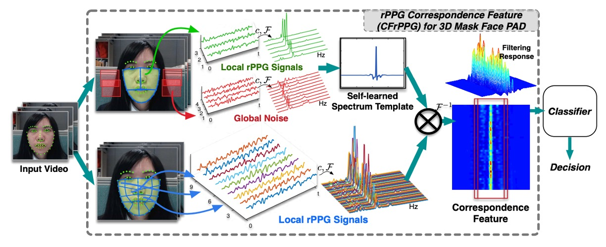
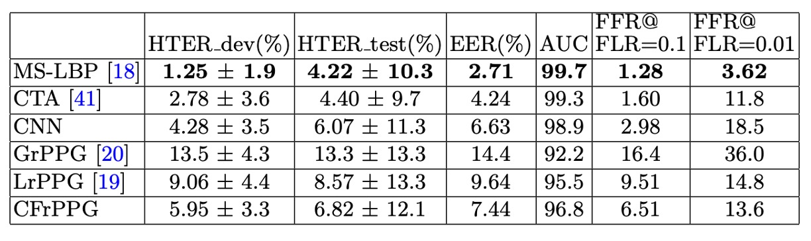

## 心拍の残響

[**Remote Photoplethysmography Correspondence Feature for 3D Mask Face Presentation Attack Detection**](https://openaccess.thecvf.com/content_ECCV_2018/papers/Siqi_Liu_Remote_Photoplethysmography_Correspondence_ECCV_2018_paper.pdf)

---

rPPG は、本質的には PPG（Photoplethysmography）から進化した非接触型の心拍測定技術です。

センサーを取り付けることなく、RGB カメラを使用することで、自然光のもとで皮膚の心拍により引き起こされる色の変化を観測し、そこから生理的信号を復元できます。

FAS（Face Anti-Spoofing）タスクでは、このメカニズムによって、画像の外観を回避し、生命の兆候を直接観察する手段が提供されます。

理論的には、画像から安定した rPPG 信号を抽出できれば、真顔と 3D マスクを効果的に区別でき、さらには画面再生や紙面攻撃なども検出できるはずです。

## 問題の定義

現実の状況では、rPPG 信号は必ずしも純粋ではありません。

下図は、理想的な条件下での真顔、干渉を受けた真顔、周期的なノイズを含むマスクに対応する、3 つの一般的な rPPG 信号パターンを示しています。

<figure style={{"width": "90%"}}>

</figure>

- **第一のパターン（左）：理想的な状況。**
  真顔の rPPG 信号は周波数領域で明確な主成分を示し、心拍のリズムを表しています。背景ノイズは顕著に弱く、これはモデルが抽出すべき生命証拠です。

- **第二のパターン（中央）：信号の減衰。**
  低光源、遠距離撮影、または顔の解像度が不足している場合、真の顔であっても、周波数スペクトルにはぼんやりとした主ピークしか残らず、場合によってはノイズに埋もれてしまうこともあります。これにより、モデルは真顔を攻撃サンプルとして誤認識する可能性があります。

- **第三のパターン（右）：ノイズの増幅。**
  マスクが外部の安定した振動（手持ち機器の揺れや環境光のちらつき）に影響されると、周波数領域にも似たような主ピークが現れることがあります。モデルが最大周波数強度のみで判断する場合、誤判定を引き起こす可能性があります。

これらの 3 つのパターンは、厳しい事実を示しています：

> **rPPG 信号は脆弱であり、最大周波数強度だけでは唯一の生体証拠にはなりません。**

従来の周波数ピーク法は、最強の信号に焦点を当てる一方で、全体の周波数スペクトルの構造や一貫性を無視しています。心拍信号は本来、皮膚の微細な色変化に安定して潜んでおり、それを抽出して増幅し解析するべきです。

しかし、問題は次の通りです： **実際の顔の微細な動きはその一部に過ぎません。多くの場合、ノイズが主旋律となります。**

rPPG 法の中核的な仮定は、「心拍の主成分は周波数領域で明確なピークを形成する」というものです。

そのため、既存の多くの方法（CHROM、POS など）は、主成分に対応する周波数強度を生体特徴として利用しています。

しかし、環境でカメラの揺れ、明るさのちらつき、顔の移動などが発生すると、マスクであっても顕著な周期的信号を示すことがあります。また、低解像度や低光源の条件では、実際の顔の信号が環境背景に隠れ、周波数の主ピークが消失することもあります。

従来の相互相関（cross-correlation）操作は、共有される周波数を強調することはできますが、「共有されているのが心拍なのか、それとも同期した背景ノイズなのか」を識別することはできません。

そこで、私たちは次のように問いかけざるを得ません：

> **もしノイズと信号が同じ周波数で共鳴している場合、私たちはどちらを信じるべきなのでしょうか？**

## 問題解決

<figure style={{"width": "90%"}}>

</figure>

既存の rPPG 手法は、通常「周波数ピーク」を心拍強度の指標として扱います。

理想的な状況ではこれは機能しますが、前述の分析からもわかるように、ノイズと実際の信号が同じ周波数で共鳴すると、強度だけでは誤判定を引き起こす可能性があります。CFrPPG（rPPG Correspondence Feature）は、まさにこの脆弱な仮定を解決するために提案された新しい手法です。

### 周波数テンプレートの学習

CFrPPG の核心的なアイデアは次の通りです：

- **もし顔が本物であれば、顔の各部位は同じ周波数で一致した心拍信号を示すべきである。**

この「部位間の一致」を捉えるために、著者は学習可能な**周波数テンプレート**$w$を設計しました。このテンプレートは単一の信号からではなく、顔全体の複数の局所的な rPPG 周波数から導出されます。

まず顔を複数のブロックに分け、各ブロックから rPPG 信号を抽出し、cross-correlation で前処理を行った後、周波数領域に変換して${s_1, s_2, \dots, s_N}$を得ます。

これらの周波数スペクトルは、異なる周波数における各部位のエネルギー分布を示しますが、ノイズや変動も混ざっています。そこで、テンプレート$w$を学習することにより、「一貫した心拍周波数」を強化し、ノイズによる多様性を無視することを目指します。

この目標は次の式で達成できます：

$$
\min_w \sum_{i=1}^N \| S_i w - y \|_2^2 + \lambda \| w \|_2^2
$$

ここで、$S_i$は$s_i$から展開された循環行列、$y$は心拍周波数にピークを持つ一様ガウス関数で、テンプレートが「どの周波数で強く反応すべきか」を導く役割を果たします。

この設計により、顔全体の一致した周波数成分を単一のフィルタ$w$に統合することができます。

計算を加速するために、著者は周波数領域で対角化可能な循環行列の特性を利用し、上記の最適化問題を周波数領域での要素単位の計算に変換しました：

$$
\hat{w} = \frac{\sum_{i=1}^N \hat{s}_i^{*} \odot \hat{y}}{\sum_{i=1}^N \hat{s}_i^{*} \odot \hat{s}_i + \lambda}
$$

ここで$\hat{s}_i$は第$i$部位の周波数スペクトルが DFT（離散フーリエ変換）処理された形式、$^\*$は共役転置、$\odot$は対応する要素間の積です。このようにして、大規模な行列乗算ではなく、周波数領域での加算と除算のみでフィルタの学習を行います。

このステップは、多くのノイズを含む観測の中で「理想的な心拍メロディ」を学習し、その後、このテンプレートを用いて各信号が同じ拍子を持っているかどうかを比較する過程に似ています。

### 対応特徴の構築

テンプレート$w$を学習した後のタスクは、次のように進みます：

- **顔の各部位の rPPG 信号がこのテンプレートに「反応しているか」を確認すること。**

まず、各部位の周波数スペクトル$s_i$を周波数領域$\hat{s}_i$に変換し、その後テンプレート$\hat{w}$と要素単位で乗算（周波数領域で時系列畳み込みに対応）します：

$$
\hat{r}_i = \hat{s}_i \odot \hat{w}
$$

これにより、対応する周波数で鋭いピークが現れる場合、その信号がテンプレートと一致していることが分かります。つまり、信号がテンプレートに類似した心拍周波数を含んでいれば、その畳み込み結果は対応する周波数で鋭いピークを示します。

この共鳴の程度を具体的に定量化するために、著者はピーク対側葉比（PSR）を採用しています。これは、フィルタ応答の鋭さを示す一般的な指標です：

$$
\text{PSR}_i = (\text{peak}_{\hat{r}_i} - \mu_{\hat{r}_i})\sigma_{\hat{r}_i}
$$

ここで：

- $\text{peak}_{\hat{r}_i}$は応答系列の最大値
- $\mu_{\hat{r}*i}$、$\sigma*{\hat{r}_i}$は主ピーク以外の領域の平均と標準偏差です。

言い換えれば、PSR が高いほど、応答が鋭く、集中しており、本物の心拍信号を示す可能性が高いことを意味します。逆に、ノイズや不連続な信号は平坦でぼやけ、または多峰性の応答を生み出し、PSR が低くなります。

最後に、全ての部位の PSR 値を並べて、最終的な CFrPPG 表現を作成します：

$$
x = [\text{PSR}_1, \text{PSR}_2, \dots, \text{PSR}_N]
$$

このベクトルが最終的な CFrPPG 表現となり、単一の周波数強度に依存せず、**顔全体の各部位とテンプレート間の対応関係**から、その顔が一致した本物の心拍リズムを持っているかを判断します。

この「全体的な一致性」に基づく設計により、モデルは局所的なノイズや誤信号の干渉に対して、より強い耐性を持つことができます。

### 背景ノイズの抑制

現実のアプリケーションでは、rPPG 信号は全体的な干渉により汚染されやすいです。たとえば、カメラの微小な揺れや手持ち撮影による振動、または室内照明のちらつきなどです。これらの干渉は通常、**顔全体の同期**と**安定した周期**を特徴としており、周波数領域で心拍信号と区別が難しく、モデルに誤った応答を引き起こしやすいです。

つまり、生理的な信号がまったく存在しない顔のマスクでも、背景ノイズが安定していると、周波数領域で疑似的な心拍痕跡を生み出してしまう可能性があります。

この問題を解決するために、CFrPPG は周波数テンプレートを学習する過程で、**背景領域の rPPG 周波数**を負のサンプルとして追加しています。これらの領域は顔の外部に位置し、顔と同じ方法で rPPG 信号を抽出しますが、理論的には**血流による生理的リズムが現れるべきではない**はずです。

これらの背景周波数は「反応を生成すべきでない」例と見なされ、テンプレート訓練の目的関数にペナルティ項として追加されます。設計は次のようにします：

$$
\min_w \sum_{i=1}^M \| S_i^t w - y \|^2_2 + \lambda \|w\|^2_2 + \gamma \sum_{k=1}^K \| S_k^n w \|^2_2
$$

ここで：

- $S_i^t$：顔部位からの rPPG 周波数、心拍一致性を捕えるために使用
- $S_k^n$：背景からの周波数、全体的な干渉を抑制するために使用
- $y$：目標応答（一維ガウス関数）、心拍周波数に鋭い応答を生成することを期待
- $\gamma$：ペナルティ強度を調整する係数、心拍学習と背景抑制のバランスを取る

これにより、学習されたテンプレート$w$は次の 2 つの条件を満たすことになります：

- 本物の心拍周波数に強く集中した反応を生成
- 背景でよく見られる周期的なノイズには非常に低い反応を維持

この設計は、背景周波数を「排除する」のではなく、モデルが訓練時にそれらの周期的なパターンを無視する方法を学ぶことを意味します。

言い換えれば、私たちはモデルに「心拍をどこで見たか」だけでなく、「**心拍を見てはいけない場所**はどこか」を問うているのです。

このようにして、実際にデプロイされた環境において避けられない同期的な揺れや背景光源の変化が存在しても、CFrPPG は**人の顔に属する、生理的なリズム**に焦点を合わせ、映像装置が引き起こす共周波数の錯覚に対して、より強靭に対応することができます。

## 討論

### 他の手法との比較

<figure style={{"width": "90%"}}>

</figure>

上記の表に示すように、3DMAD データセットでは、すべての手法の総合的なパフォーマンスが高く、これはこのデータセットが制御された光源環境で撮影され、使用されている Thatsmyface マスクが実際の顔と素材的に明確な差があることを反映しています。外観に基づく手法（特に MS-LBP）は、このシナリオで最良の結果を得ることができました。

ただし、他の rPPG 手法（LrPPG、GrPPG など）と比較して、CFrPPG は AUC や HTER などの指標でやや優れており、顔の心拍特性の一貫性をモデリングする能力が高く、識別の安定性が向上しています。特に注目すべきは、「外観に基づく手法が最も効果的な設定」においても、深層特徴（CNN）のパフォーマンスが依然として若干不足しており、外観データの転送には限界があることが浮き彫りになっています。

さらに、今回の実験では、ランダムな被験者インデックスを使用した leave-one-out クロスバリデーション（LOOCV）設計を採用し、20 回のテストで、各回に 17 回のテストを行い、データの分割における偶然性を減らしています。CFrPPG は多回の評価で安定したパフォーマンスを維持し、そのアーキテクチャがサンプル間で一貫した特性を持つことを示しています。

### クロスデータセットテスト

<figure style={{"width": "90%"}}>

</figure>

著者はさらに、未知の環境でのモデルの一般化能力を評価するために、クロスデータセット実験を設計しました。

具体的には、実験は 2 つの方向で分かれています：

- **3DMAD → HKBU-MARsV2**：クリーンで制御されたデータセットで訓練し、実際のシーンでテスト
- **HKBU-MARsV2 → 3DMAD**：高ノイズで非制御条件下で訓練し、標準的な環境でテスト

各設定で 20 回のランダムグループテストを実施し、被験者の構成に偏りがないようにしています。

結果として、**CFrPPG は両方の実験で他の手法よりも顕著に優れたパフォーマンスを発揮し**、また、単一データセットテストでの性能よりも大きなリードを示しました。これは以下のことを意味します：

> **CFrPPG は、慣れた環境で安定した識別を行うだけでなく、クロスデータセット転送でも識別能力を維持できる。**

この能力の鍵は、単に「ある種の信号の強度分布を記憶する」のではなく、「顔の複数の部位が共有する心拍周波数パターン」を学習することにあります。このような周波数の一貫性は、異なる撮影条件やマスクタイプでも成立するため、特徴はクロスデータセットでより良い整合性を持つことができます。

それに対して、外観に基づく手法（MS-LBP、CNN など）は、このような実験で大幅にパフォーマンスが低下し、これらの手法が「特定の視覚的表現に過剰に適合する弱点」を示していることが明らかになりました。

## 結論

rPPG は一時期、非接触型の生体認証技術として期待されていました。

その時期、研究者たちは画像から微小な光の変化を読み取り、血流のリズムを再現しようとしていました。まるで、十分に精密にすれば、生理学的な真実が見えるかのようでした。しかし現実はすぐに答えを出しました：

> **光源がコントロールしづらく、ノイズは取り除けず、周波数特性は脆弱である。**

rPPG は、工学的に実用化が難しいロマンでありました。

CFrPPG は、この短命な技術を当時もっと安定して、賢く使えるようにしようと試みました。テンプレートマッチング、周波数対応、ノイズモデルを活用し、環境の不確実性に立ち向かおうとしました。それは「単一のピーク」を「複数部位の一致性」に昇華させ、さらに背景抑制を加えることで、ノイズの多い環境でも安定した特徴は協調から来ることを証明しました。

FAS の視点から見ると、rPPG は熱狂的に登場し、急速に消え去った支流のようなものです。CFrPPG はその支流の終わりに立ち、この技術の躁動を見事に収束させました。

私たちはもはや画像から心拍を探しませんが、この忘れ去られた支流の中で、私たちはその音を聞いたのです。
