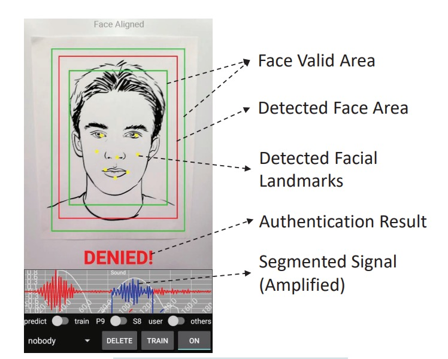

## 音波の中の顔

[**Multi-Modal Face Authentication using Deep Visual and Acoustic Features**](https://par.nsf.gov/servlets/purl/10095811)

---

この論文では、著者が自分の方法に簡潔な名前を付けていなかったので、視覚（Visual）と音響（Acoustic）の特徴を取り入れて、**VA-FAS** と名付けました。

## 問題の定義

スマートフォンはすでに「顔認証」を日常的な起動シーケンスに組み込んでいます。

写真がカメラを騙さないように、主流の方法では、映像の中でまばたき、口の形、頭部の微細な動きなどの時間的な手がかりをキャッチしたり、映像内の異常な空間的な手がかりを検出したりして、ユーザーが本物かどうかを判断します。

一見、問題はなさそうですが、実際には、攻撃者が高解像度のビデオを使用すると、これらの時間的および空間的な手がかりは効果を失ってしまいます。

単純な RGB の手がかりでは安全境界を支えることができなくなり、業界は第二の道へと進みました：カメラの横にさらに多くのセンサーを追加することです。

例えば、iPhone の Face ID は近赤外線の構造光を使って 3D ジオメトリを再構築し、確かに攻撃のしきい値を上げました。いくつかの高性能な Android スマートフォンも ToF（Time-of-Flight）センサーや双眼モジュールを搭載し始めています。

しかし、この「ハードウェア強化」戦略には三つの困難があります：

- **コスト**：専用モジュールが BOM（部品表）を高くし、ミッドレンジやエントリーレベルのデバイスには普及しにくい。
- **スペース**：前面カメラのエリアは非常に限られており、センサーが一つ増えると画面が一つ減ります。
- **エコシステム依存**：センサーの仕様とアルゴリズムが密接に結びついており、クロスプラットフォームでの複製が難しい。

多くのスマートフォンが依然として単一の前面カメラとマイクを搭載している世界に戻ると、RGB 活体認証の脆弱性は依然として開かれています。

我々は、**ハードウェアを追加せずに顔認識に立体感を与える第三の道**が必要です。

そこで著者は音波に目を向けました：

> **常に存在していたが、決して正面から注視されなかった反射信号。**

音が二次元の画像に深さを加えることができるのか？画像と音波の組み合わせは、ビデオ攻撃の隙間を本当に塞ぐことができるのでしょうか？

## 問題解決

<figure style={{"width": "90%"}}>

</figure>

著者は**音響と視覚を融合させた顔認証システム**を提案しており、追加のハードウェアなしでスマートフォン上の活体認証強度を向上させます。

システム全体は以下の 3 つのモジュールに分かれています：

1. 音波特徴の抽出
2. 画像特徴の抽出
3. マルチモーダル特徴の融合と分類

音響と画像の特徴はそれぞれ CNN で抽出され、結合されたベクトルが One-Class SVM で判定されます。

全体的なアーキテクチャは非常にシンプルで、各モジュールの詳細を見ていきましょう。

### 音波特徴の抽出

著者はスマートフォンに内蔵されている「スピーカー + 上部マイク」を音波通信対として選択しました。この構成はほとんどのスマートフォンに広く存在し、前面カメラと共に配置されているため、音波と画像のセンサー間の位置ずれ誤差を減少させることができます。

送信される音波は**16–22 kHz の線形周波数変調 chirp**で、ほぼ聴覚範囲外です。これは\*\*FMCW（周波数変調連続波）\*\*タイプで、周波数差を利用して反射経路の長さを推定します。

信号品質を向上させるために、システムは以下の設計を行っています：

- 短いパルスを使用してスピーカーの自己干渉を避ける。
- ハニング窓を適用し、信号のエッジを滑らかにして時周波数安定性を向上させる。

音波処理のフローは以下の通りです：

録音された信号は最初にバタワースバンドパスフィルター（16–22 kHz）を通して背景ノイズを除去します。

処理後の波形は以下のように観察できます：

<figure style={{"width": "60%"}}>

</figure>

- **直達径**：スピーカーからマイクに直接送信される信号で、通常は最大振幅を持っています。
- **顔の反射**：額、鼻梁、頬などから反射された主な信号。
- **ノイズと干渉反射**：デスクトップや衣服の襟などから来る反射で、除去する必要があります。

セグメンテーション戦略は以下の通りです：

- ピーク検出法を使用して直達径を特定します。
- 次にクロス相関（cross-correlation）を使用し、登録段階でのテンプレート信号を基に主回波のセグメントを特定します。

複数の類似したピークが原因で位置決定が不安定な場合、前面カメラで推定された顔の距離情報を導入し、検索範囲を狭めます。例えば、画像で目の間隔が広がっている場合、顔が近づいていることを示し、回波位置を補正することができます。

最終的に抽出されたセグメントは、左右それぞれ 10 サンプルポイントを追加し、約 7 cm の深度範囲を保持します。

反射信号は再度**FMCW 距離変換**を経て処理されます。以下の図に示すように：

<figure style={{"width": "60%"}}>

</figure>

FMCW 技術は時間遅延を周波数偏移に変換し、反射距離は次の式で決まります：

$$
d = \frac{c \cdot \Delta f \cdot T}{2B}
$$

ここで：

- $d$：距離；
- $c$：音速；
- $\Delta f$：受信と発信信号の周波数差；
- $T$：chirp の時間；
- $B$：帯域幅（6 kHz）。

「信号混合」後に得られる周波数差は、時周波数図（スペクトログラム）に変換されます。

この時周波数図を事前に訓練された CNN（EchoPrint アーキテクチャに基づく）に入力し、最終的な分類層を除去して、128 次元のベクトルとして出力します。これにより、顔が音波空間で構造的な反響スペクトログラムとして表されます。

### 画像特徴の抽出

<figure style={{"width": "80%"}}>

</figure>

音波特徴の抽出が完了した後、次は画像特徴の抽出で、以下の 4 つのステップがあります：

1. **顔の検出**：HOG + 事前訓練モデルを使用して顔の枠と顔のパーツを検出；
2. **アフィン変換**：顔のパーツ座標を標準テンプレートに合わせます。
3. **クロッピングとスケーリング**：定長の入力画像を取得；
4. **データ拡張**：輝度正規化と角度修正を含む。

特徴抽出の部分では、簡略版 OpenFace（FaceNet の nn4 を基に）を使用し、**classification loss + triplet loss**で訓練を行い、最終的に 128 次元の画像特徴ベクトルを出力します。

### 特徴の結合

二つの特徴ベクトルを単純に結合し、最終的な 256 次元の統合特徴を構成します：

$$
\mathbf{z} = [\mathbf{a} \,\|\, \mathbf{v}] \in \mathbb{R}^{256}
$$

分類器として One-Class SVM を使用し、登録サンプルのみを使って高次元の境界を作成し、他の人を異常データとして扱います。このアプローチの利点は、攻撃サンプルを集める必要がなく、計算が軽量であり、エッジデバイスに適していることです。

最終的なシステムは以下の図のようになります。顔を赤枠に合わせるだけで、システムは chirp を再生し、画像をキャプチャし、300 ミリ秒以内に判定を完了します。

<figure style={{"width": "80%"}}>

</figure>

## 討論

### データと実験設計

- **被験者**：10 名のボランティア（音波モデルのトレーニングデータには含まれていない）；
- **音波サンプル**：各人約 2 分間の録音、合計で 13,806 件を収集；
- **画像サンプル**：各人 20 枚の顔写真、近接画像を補間して数を合わせ；
- **攻撃サンプル**：5 種類の偽顔タイプを使用、以下を含む：

  - 紙の写真、スクリーン表示、紙箱の表面、壁のポスター、彫像

データは**非制御環境**から取得され、さまざまな光源や背景ノイズを含んでおり、システムの実用性をテストします。

モデルの性能は 4 つの指標で測定されます：

$$
\text{Precision} = \frac{TP}{TP + FP}, \quad
\text{Recall} = \frac{TP}{TP + FN}
$$

$$
\text{F1} = \frac{2PR}{P + R}, \quad
\text{BAC} = \frac{1}{2} \left( \frac{TP}{TP + FN} + \frac{TN}{TN + FP} \right)
$$

ここで：

- **Precision 高** → 誤って通過させるケースが少ないこと；
- **Recall 高** → 真のユーザーが拒否されることが少ないこと；
- **F1 と BAC** は全体的なパフォーマンスを総合的に評価するために使用されます。

データは 8:2 の割合でトレーニングとテストデータに分割されます。
モデルは**One-Class SVM**を使用し、各ユーザーは自分のサンプルのみでトレーニングされ、テストには「他の人 + 攻撃サンプル」が負のサンプルとして使用されます；各モダリティ（音波、画像、統合）はすべて同じ手順で繰り返しテストされ、公平な比較が保証されます。

### 双モーダル認証性能

<figure style={{"width": "80%"}}>

</figure>

双モーダルのアーキテクチャに基づいた実験結果は上表の通りです。左側の数値は平均値、右側は中央値です。

すべてのテストにおいて、**統合特徴（音響 + 視覚）は単一モダリティよりも常に安定した認証性能を示しました**。

これは主に、視覚モジュールがトリプレット損失でトレーニングされた深層埋め込み特徴を使用しており、同一クラスと異なるクラスとの分布境界を効果的に引き離しているためです。この視覚認識の強度は、写真やビデオなどの画像攻撃に直面した場合、すぐに無効になることがあります。その場合、音波特徴が視覚の盲点を補い、統合モダリティが攻撃を防ぐ唯一の選択肢となります。

すべてのテストにおいて、同卵双生児のサンプルを含むテストでも、統合モダリティモデルは 2 人を正しく区別し、誤判定を行いませんでした。現在のところ、単一の双生児サンプルのみでテストされていますが、この結果は初期的な指標となり、たとえ生理的外観が極めて似ていても、音波反射の微細な差異がモデルによってキャッチできることを示しています。

### 背景ノイズの影響

音波モジュールの実用性は、実際の環境で安定して機能するかどうかに依存します。これを検証するために、著者は騒がしい実験室や会話が行われている教室で、データ収集と認識テストを繰り返しました。

その結果、これらの一般的な背景ノイズ条件下でも、モデルの認識性能は顕著に低下することはありませんでした。これは、システムが設計した chirp 周波数帯（16–22kHz）とフィルタリングメカニズムが、音声や環境ノイズの干渉を避けるのに十分であり、実際のアプリケーションでも安定性を持っていることを示しています。

## 結論

この論文は、「音波を活体の手がかりとして使用する」実装探索の初期段階の 1 つにあたります。そして、当時のハードウェア条件において、実行可能な解決策を提案しています。

著者が提案したのは、単なるアイデアではなく、展開可能で評価可能なシステムの全体像です：chirp 設計、回波のセグメンテーション、CNN 特徴抽出、双モーダルの統合、さらにスマートフォンでの実装戦略や遅延制御、最終的には静止画や動画攻撃に対抗する実際のテストシナリオまで。

新しいハードウェアに過度に依存せず、理想的なデータ条件を前提にせず、ただエンジニアリングの現実に基づき、リソースの限界を問い直しています：

> **もしスマートフォンにマイク、スピーカー、前面カメラしかなければ、どれだけ防御の余地が残されているのか？**

当時のハードウェア条件、アルゴリズム設計、攻撃形態を考慮した場合、このシステムはすでに実際の偽顔と本物の顔、活体と再生を効果的に区別することができました。

本研究が提供する答えは：**十分に使える**。
