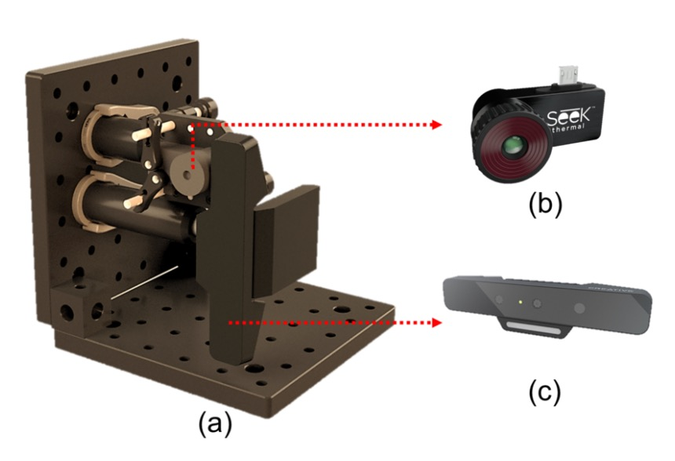
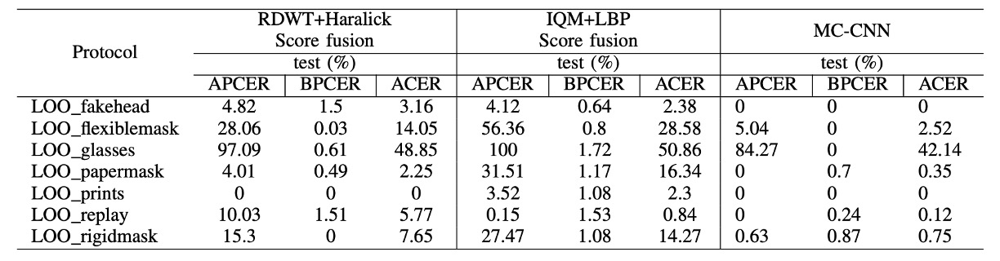

## 見えない顔

[**Biometric Face Presentation Attack Detection with Multi-Channel Convolutional Neural Network**](https://arxiv.org/abs/1909.08848)

---

ある分野の発展過程において、新たな用語が定義されることがあります。これらの用語は技術の説明にとどまらず、後続の研究の方向性にも影響を与えます。

この論文では、偽造攻撃を「Presentation Attack (PA)」と呼び、その定義は次のようになっています：

> **ユーザーが生体認証データ取得システムに対して発信する干渉的なリクエストは、以下の目的を持つ可能性があります：**
>
> 1. **他のターゲットの身分を偽装する（Impersonation Attack）**
> 2. **自分の身分を隠す（Obfuscation Attack）**
>
> **これらのすべてが Presentation Attack (PA) として分類されます。**

## 問題の定義

畳み込みニューラルネットワーク（CNN）が FAS（Face Anti-Spoofing）分野に登場して以来、従来の手作業による特徴量抽出手法は急速に取って代わられました。しかし、CNN を使っても、多くの方法は依然として RGB 画像のみを使用して判定を行っており、これは一般的な可視光で撮影された顔写真です。

問題は、偽造手段が「Print」のようなレベルにとどまらなくなっていることです。現在ではシリコンマスクや 3D モデルがますます精緻になっており、RGB だけでは十分な情報を得ることができません。

そのため、いくつかの研究では深度情報を導入して支援しています。例えば、TOF、構造光、またはデュアルカメラを使用して立体的な視覚を作り、顔の距離や輪郭の変化を検出する手法です。

問題を解決するために、なぜもっと徹底的に次元を増やさないのでしょうか？

> **RGB 画像に加えて、深度、温度など、無限の情報が他にもあります。**

この論文はその視点から出発し、著者はカラー画像と深度情報だけでなく、近赤外線（NIR）と熱画像（Thermal）も加え、より多くの「見えない顔の手がかり」をモデルに組み込もうとしています。

しかし、これにも現実的な問題があります。それは、データセットが追いついていないことです。公開されているデータセットの多くは RGB のみで、少数のデータセットには深度情報がありますが、その数は十分でなく、安定したモデルの訓練には不十分であり、汎化テストを行うには更に問題があります。

そのため、この論文のもう一つの重要なポイントは、新しいデータセットが提案されていることです：

> **WMCA（Wide Multi-Channel Presentation Attack）**。

このデータセットには、さまざまな 2D および 3D の偽造手法（紙マスク、シリコンマスク、剛性材料、透明マスクなど）が収められており、RGB、深度、NIR、熱画像という 4 つのチャンネルの同期データが提供されています。

モデルがより多くの次元の情報を視覚的に把握できるようになると、攻撃者がシステムを同時に欺くことがより難しくなります。

## 問題解決

### モデルアーキテクチャ

<figure style={{"width": "90%"}}>

</figure>

モデル設計において、著者は複数のセンサー通道の情報を統合し、偽造攻撃の識別能力を向上させることを目指した多通道畳み込みニューラルネットワーク（Multi-Channel CNN, MC-CNN）アーキテクチャを提案しています。

FAS 分野では、データセットの不足が常に問題です。そのため、ほとんどの研究は CNN をゼロから訓練するのではなく、事前に訓練されたネットワークを使って転送学習（Transfer Learning）を行います。

この論文も例外ではなく、著者たちは事前に訓練された顔認識モデルをバックボーンとして選択し、ここではパラメータが比較的軽量な[**LightCNN**](https://arxiv.org/abs/1511.02683)を使って各通道の顔の特徴を抽出しています。

ネットワークに入力する前に、各通道の画像はまず整列と標準化の処理を受けます。顔検出には MTCNN を使用し、特徴点検出には SDM を使用します。その後、目と口を統一座標に合わせ、128×128 のグレースケール画像に統一調整します。

RGB 通道が基準として使用され、深度、近赤外線、熱画像などの非 RGB 通道は、RGB の特徴点結果に基づいて同期整列され、複数の通道の入力が空間と時間の一貫性を保つようにします。非 RGB 画像は MAD 標準化により 8 ビット形式に変換され、その後モデルに入力されます。

各通道はそれぞれ、LightCNN の共有アーキテクチャを通じて顔の特徴を抽出します。これらの特徴の次元は 256 であり、最終的には四つの通道の特徴ベクトルが連結されて、統合された表現を得ます。その後、2 層の全結合層に入力され、分類が行われます：

- 最初の全結合層は 10 個のノードを持つ
- 2 層目は sigmoid 出力（1 ノード）で、偽造攻撃かどうかを判定

全体の訓練には二元交差エントロピー（Binary Cross Entropy, BCE）を損失関数として使用します：

$$
L = −(y \log(p) + (1 − y) \log(1 − p))
$$

ここで、$y$ は実際のラベル（1 は `REAL`、0 は `SPOOF`）、$p$ はモデルの予測確率です。

### WMCA データセット

:::tip
もし自分のデータセットを作成したい場合、このセクションの設計詳細は多くのインスピレーションを与えてくれるでしょう。

詳細については、[**IDIAP/data**](https://www.idiap.ch/en/scientific-research/data/wmca) を参照してください。
:::

多通道モデルの偽造検出タスクにおける実際の効果を検証するために、著者は新たに以下のデータセットを作成しました：

- **WMCA（Wide Multi-Channel Presentation Attack）**。

このデータセットは非常に優れた設計であり、既存の PAD（Presentation Attack Detection）データセットにおける通道数の不足を補うだけでなく、さらに豊富で挑戦的な攻撃手法をカバーしています。

このデータセットには **72 人の被験者** のビデオデータが収められており、各人に対して、bonafide（本物のサンプル）およびさまざまなプレゼンテーション攻撃（偽造攻撃）のシナリオが撮影されています。各ビデオの長さは約 10 秒です。録画は複数のセンサーを使用して同期撮影され、総データ量は約 **5.1 TB** の未圧縮データに達し、稀有な高品質の FAS データセットの一つとなっています。

<figure style={{"width": "60%"}}>

</figure>

WMCA は 2 組のセンサーを使用して同期撮影を行い、異なる光学帯域と深度情報をカバーしています。機器は上記の図の通りです：

- **(b) Seek Thermal Compact PRO**：熱画像通道（Thermal）を提供
- **(c) Intel RealSense SR300**：RGB、深度、近赤外（NIR）通道を提供

これらのセンサーはモジュール式で同じ光学機構に取り付けられており、撮影の視点と距離を一致させています。RGB 通道は 30fps で録画され、熱画像は 15fps で録画され、各ビデオの各通道には約 **300 フレーム**（熱画像は 150 フレーム）が保存されています。データはすべて未圧縮形式で保存され、高品質な後処理分析を可能にしています。以下の図は、データの最終的な画像成果物です：

<figure style={{"width": "80%"}}>

</figure>

多通道データの空間的および時間的な一貫性を確保するために、著者は熱的対比特性を持つ自作のチェッカーボードキャリブレーションターゲットを作成し、高出力の照明を使用して同期撮影を行い、特製のソフトウェアで対応する点を自動抽出して補正しました。

データ収集には 5 ヶ月を要し、7 つの異なる撮影ステージを跨いで行われました。各ステージでは照明、背景、装置設定に変化があり、実世界の多様なシーンをシミュレートしています。シーンには以下が含まれます：

- **照明**：日光、LED サイドライト、オフィスの照明など
- **背景**：単一背景 vs 複雑な背景
- **眼鏡**：bonafide 部分では「眼鏡有り」と「眼鏡無し」の 2 バージョンを特別に撮影
- **マスクとフェイクヘッド**：撮影前に熱風を当てて熱通道の擬似性を強化

すべての参加者は中立的な表情でカメラに向かって録画され、距離は約 40cm で維持され、撮影プロセスは操作員が統一して制御し、各データの一貫性と比較可能性が保証されました。

### 7 種類の攻撃タイプ

<figure style={{"width": "50%"}}>

</figure>

WMCA の詳細な攻撃サンプル数は上表に示されています。これには **1332 組の偽造攻撃データ** が含まれており、7 つの大きなカテゴリに分類されています。それぞれのカテゴリには異なるレベルの挑戦性があります：

1. **眼鏡類（Glasses）**：面白いフェイク眼鏡、紙製眼鏡など（部分的な隠蔽攻撃に該当）
2. **フェイクヘッド（Fake Head）**：様々なモデルヘッド、一部は体温を模擬した加熱処理が施されています
3. **写真攻撃（Print）**：高解像度のインクジェットプリンタやオフィス用レーザープリンタで顔写真を印刷
4. **リプレイ攻撃（Replay）**：iPad やスマートフォンで録画した顔のビデオを再生
5. **硬質マスク（Rigid Mask）**：高い精度を持つ硬質のマスク、装飾用のプラスチックマスク
6. **柔軟マスク（Flexible Mask）**：自作のシリコンマスク、リアルな顔の特徴を模擬
7. **紙マスク（Paper Mask）**：実際の身元を基に作られた紙製のマスク

これらの攻撃タイプは、最も簡単な 2D 攻撃から高度に模倣された 3D 攻撃までをカバーし、多光学帯域のデータと組み合わせることで、このデータセットはモデルの訓練およびテストの際の汎化能力を高める実用的価値を大幅に向上させています。

<figure style={{"width": "80%"}}>

</figure>

### 評価プロトコルと実験設定

WMCA は 2 つの実験プロトコルをサポートしており、「既知の攻撃」と「未知の攻撃」という 2 つのシナリオに対応しています：

- **grandtest プロトコル**：攻撃タイプが既知のシナリオをシミュレートします。データは train/dev/eval の 3 つのセットに分割され、各被験者は重複しませんが、すべての攻撃タイプは 3 つのセットに分布しています。

- **unseen attack プロトコル（LOO）**：汎化能力をテストするための厳格なテストです。7 つの leave-one-out（LOO）プロトコルが定義されており、毎回 1 種類の攻撃タイプを削除し、「未知の攻撃」として扱います。この攻撃タイプはテストセットでのみ評価されます。例えば、「LOO fakehead」プロトコルでは、フェイクヘッド攻撃は訓練および検証セットに現れず、テスト段階でのみモデルの識別能力が評価されます。

各ビデオからは 50 フレーム（平均サンプリング）が抽出され、それぞれの時間点における 4 つの通道の画像が 1 つの訓練サンプルを構成し、独立したサンプルとして訓練および推論が行われます。

### 評価指標

性能評価には [ISO/IEC 30107-3] で定義された 3 つの標準指標が使用されます：

- **APCER**（攻撃サンプルが本物として誤認される率）
- **BPCER**（本物サンプルが攻撃として誤認される率）
- **ACER**（上記 2 つの平均値）

また、ROC 曲線を描画して、各手法の全体的な識別能力を比較します。

:::tip
以前論文で似たような指標が登場したことがあるかもしれません：

- **False Rejection Rate (FRR)**：本物のアクセスが誤って拒否される割合（正当なものが攻撃と誤認される）
- **False Acceptance Rate (FAR)**：攻撃サンプルが誤って受け入れられる割合（攻撃者が正当なものと誤認される）

これら 2 つの誤差の総合指標は **Half Total Error Rate (HTER)** と呼ばれ、計算式は次の通りです：

$$
\text{HTER} = \frac{\text{FAR} + \text{FRR}}{2}
$$

---

概念的には同じですが、時間と共に研究者はより完璧な定義と標準化された名称を提供し、議論時に誤解がないようにしています。

:::

## 討論

### Baseline システムの grandtest における性能

<figure style={{"width": "90%"}}>

</figure>

上記の図は、grandtest プロトコルにおける baseline システムの性能を示しています。使用される閾値はすべて dev セットで BPCER = 1%に設定されています。表からいくつかの重要なポイントが観察できます：

- 単一通道では、**Infrared 通道と RDWT-Haralick 特徴の組み合わせ**が最も良い性能を示し、IR 情報が活体認証において高い識別力を持つことを示しています。
- **FASNet は RGB 通道のみを使用していますが、その構造設計と ImageNet の事前訓練済み重みを活用することで、IQM-LBP シリーズを上回る性能を示しました**。これは、深層学習アーキテクチャが単一通道でも特徴学習を最適化できることを示しています。
- **score-level fusion を用いて多通道結果を統合することで、認識性能が向上しますが、改善幅は限られており（ACER は依然として数%）、従来の方法ではクロスチャネル特徴を効果的に統合するのは難しく、高安全性領域への適用には十分ではない**ことが示されています。

### MC-CNN vs 最適 baseline（grandtest）

<figure style={{"width": "70%"}}>

</figure>

上記の図は、MC-CNN と最適 baseline システムの dev セットおよび test セットでの最終的な性能を比較したものです：

- **MC-CNN は test セットで ACER = 0.3%を達成し、baseline（通常は 2%以上）を大きく上回りました**。

MC-CNN は RGB、Depth、IR、Thermal などの異なる通道からの補完的な情報を効果的に統合して学習しています。この結果は、score fusion だけでは効果が限られており、共同埋め込み能力を持つ多通道アーキテクチャの設計が重要であることを示しています。

### Unseen 攻撃シナリオでの認識性能

<figure style={{"width": "90%"}}>

</figure>

未知の攻撃に対するモデルの汎化能力を評価するために、著者は WMCA 内の 7 つの LOO プロトコルを設計し、各プロトコルで 1 種類の攻撃タイプを訓練および検証セットから除外し、テストセットでのみ登場させました：

ほとんどの**unseen 攻撃において、MC-CNN は従来の baseline を上回り、攻撃タイプ間での良好な汎化能力を示しました**。例えば、silicone 攻撃や replay 攻撃を除外した後でも、システムは未見の攻撃を効果的に識別でき（ACER は baseline より明らかに低い）、高い汎化性能を示しました。

しかし、**glasses 攻撃においては、baseline と MC-CNN の両方のシステムで良好な性能が得られませんでした**。その理由は、眼鏡をかけた bonafide の特徴と非常に似ているため、特に depth および thermal 通道における識別性が低く、モデルが誤って本物のサンプルとして判定したことによるものです。

## 結論

この論文の欠点は非常に明確です。実際のアプリケーションシナリオでは、ほとんどの場合、RGB 画像しか取得できないため、多通道センサーデバイスのハードウェアコストと同期要求により、この方法を直接的に実用化するのは難しいです。

しかし、データセットの観点から見ると、この論文は「unseen attack」という従来の単一分類基準とは異なる評価設定を定義しました。これは今日の open-set や anomaly detection に関する議論が増える中で、依然として参考になる価値があります。さらに、著者が提示した問題（例えば、部分的な攻撃の検出の難しさ、異なる攻撃タイプ間の曖昧な境界）は、今でも研究者にとって重要な課題です。

最後に、「多通道」という概念は、もしかすると「多モーダル」へとさらに拡張できるかもしれません：

> **異なる光学帯域や深度次元の画像入力にとどまらず、音声、行動、コンテキスト情報などの異質な感知源を組み合わせ、真のクロス感知領域の防御システムを開発することができます**。

この観点から見ると、この論文は多モーダル AI の先駆者ではありませんが、初期の共同センサー融合の実装の雛形を提供しており、その後の発展に対して重要な示唆を与えています。
