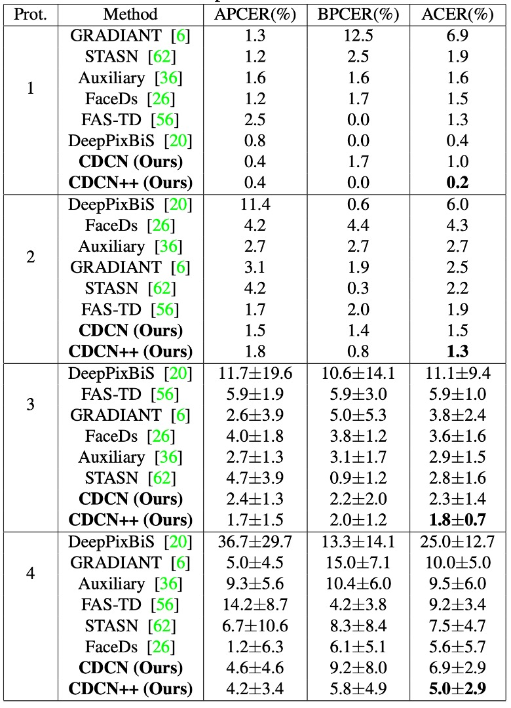
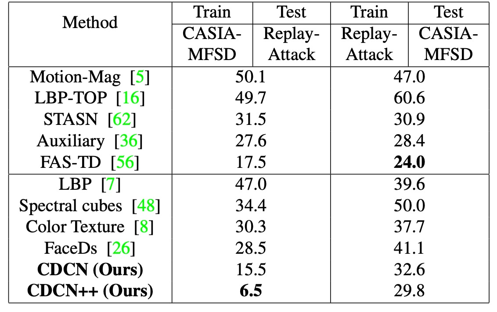

## 真と偽の入り混じる境界

[**Searching Central Difference Convolutional Networks for Face Anti-Spoofing**](https://arxiv.org/abs/2003.04092)

---

人は、モデルが十分に深く、データが豊富であれば、システムは自然と「本物」と「偽物」を見分けられると考えがちだ。

しかし、私たちはもっと根本的な問題を見逃しているかもしれない。

今回は非常に有名な古典的論文「CDCN」を見てみよう。

## 問題の定義

顔認証が標準となった時代において、顔の生体検出（Face Anti-Spoofing, FAS）は認証プロセスの重要な関門となっている。攻撃手法は高解像度印刷、映像再生、リアルな 3D マスクなど多様化している。

このような相手に対し、技術コミュニティはかつて手工特徴の繊細さに期待を寄せた。LBP、DoG、HOG、SIFT などの局所記述子は、人間の目では識別困難な微細な模様やノイズ、印刷の残像を捉えようとしてきた。

だが、これらの手法はシーン変化に弱く、ノイズ耐性が低いため、現代の応用要求には適合しなかった。

そこで深層学習へと舵を切り、畳み込みニューラルネットワーク（CNN）に真偽の境界を判別させることとなった。

しかし CNN の強みは、同時に盲点でもある。

深層構造は抽象的な意味情報の抽出に優れるが、低レベルの細部情報を徐々に忘れていく。特に特定の光や角度でのみ顕在化する格子模様、モアレ模様や反射エッジなどは捉えにくい。環境が少し変わったり撮影装置が異なると、これらモデルは一般化できず、背景のテクスチャや画面の枠を誤って生体特徴と認識することもある。

深層の意味情報の穴埋めとして、深度マップを補助監督信号に導入し、より細かい空間認識を学習させようとする試みもあった。しかしこれらの構造は多くが専門家の手設計であり、ResNet や VGG、DenseNet のような分類タスク向けのバックボーンはもともと FAS 用ではなく、一般化能力には限界があった。

問題は根本に立ち返る：もし畳み込み自体が細部に鈍感ならば、上位層の設計で視覚基盤の歪みを補うことは難しい。

> **では畳み込み自体こそが、未だ開かれていない扉ではないか？**

## 解決策

まず畳み込みの計算方法を復習しよう。

標準的な 2D 畳み込みは次のように書ける：

$$
y(p_0) = \sum_{p_n \in R} w(p_n)\cdot x(p_0 + p_n)
$$

ここで、$p_0$ は出力特徴マップの位置、$R$ は受容野（例えば 3×3）である。

この「局所的加重和」の考え方は視覚タスクの基盤となっているが、攻撃検知には十分ではない。なぜなら極めて微細な偽装の痕跡は、ピクセル強度自体ではなく、ピクセル間の差分に隠れているからだ。

### Central Difference Convolution (CDC)

<div align="center">
<figure style={{"width": "80%"}}>

</figure>
</div>

LBP に着想を得て、著者らは「中心差分」を畳み込みに導入し、計算ごとに「変化量」を含めることを試みた：

$$
y(p_0) = \sum_{p_n \in R} w(p_n)\cdot \bigl(x(p_0 + p_n) - x(p_0)\bigr)
$$

従来の畳み込みと比べ、この方法は「値の大きさ」ではなく「中心との差異」に注目する。

細かいシワや突起を検出するとき、私たちが注目すべきは「全体の明るさ」より「エッジ」かもしれない。

:::tip
これはエッジ検出の意味です。
:::

しかし純粋な中心差分では画像自体の絶対情報が失われることもある。

そこで著者は混合形態を提案した：

$$
y(p_0) =
\theta \sum_{p_n \in R} w(p_n)\cdot \bigl(x(p_0 + p_n) - x(p_0)\bigr)
\;+\; (1 - \theta) \sum_{p_n \in R} w(p_n)\cdot x(p_0 + p_n)
$$

ここで $\theta \in \[0,1]$ はバランス係数である：

- $\theta=0$ のときは従来の畳み込みに戻り、
- $\theta=1$ のときは完全に差分量に注力する。

この混合操作を **CDC**（Central Difference Convolution）と名付け、「強度」と「差分」という二つの情報源を同時に保持する。

実装を容易にするため、最終的に以下の形に整理できる：

$$
y(p_0) =
\sum_{p_n \in R} w(p_n) \cdot x(p_0 + p_n)
\;-\;\theta \cdot x(p_0) \sum_{p_n \in R} w(p_n)
$$

こうして、一般的な深層学習フレームワーク（PyTorch、TensorFlow）では数行のコードで CDC をネットワークに無理なく組み込め、パラメータの増加もない。

以下に簡単な CDC 畳み込み層の実装例を示す：

```python
class Conv2dCD(nn.Module):

    def __init__(self, *, theta=0.7, bias=False, **conv_kwargs):
        super().__init__()
        self.theta = theta
        self.conv = nn.Conv2d(bias=bias, **conv_kwargs)

    def forward(self, x):
        out = self.conv(x) # 通常の畳み込み

        if self.theta == 0:
            return out

        # 中心差分項の計算

        # (C_out, C_in, 1, 1)
        k_sum = self.conv.weight.sum(dim=(2, 3), keepdim=True)
        out_diff = F.conv2d(x, k_sum, bias=None,
                            stride=self.conv.stride,
                            padding=0,
                            groups=self.conv.groups)

        return out - self.theta * out_diff
```

### CDC ネットワーク

過去の研究では、多くが「深度マップ」を補助監督信号として利用し、ピクセルレベルの対比を通じて活体判定を強化している。

著者もこの考え方を参考に、**DepthNet** をベースとしたネットワーク骨格を構築し、すべての畳み込みを CDC に置き換えることで、**Central Difference Convolutional Networks (CDCN)** を形成した。

- **ネットワークの入力/出力**：

  - 入力：単一フレームの RGB 顔画像（3×256×256）
  - 出力：予測されるグレースケール深度マップ（32×32）

- **特徴融合**：低レベル、中レベル、高レベルの特徴を連結して統合し、顔のテクスチャや空間構造の捉えやすさを向上。

- **ハイパーパラメータ**：実験では $\theta=0.7$ をデフォルト設定とし、差分信号を重視しつつ原画像の強度情報も保持。

損失関数は、偽装痕跡をより精密に監督するため以下の 2 種類を導入：

1. **MSE 損失 $L_\text{MSE}$**：予測深度マップと真実の深度マップ間の平均二乗誤差を測定。
2. **対比深度損失 $L_\text{CDL}$**：より微細な深度差異を捉え、顔の境界の真の凹凸と印刷による偽模様を区別するのに寄与。

全体の損失は次の通り：

$$
L_{\text{overall}} = L_{\text{MSE}} + L_{\text{CDL}}.
$$

### CDCN++


ただし CDC の全体構造は手作業で設計されており、最適とは限らない。

そこで著者は **Neural Architecture Search (NAS)** を組み合わせ、FAS に最適な構造を自動探索する手法を導入し、結果として進化版の **CDCN++** を実現した（上図参照）。

従来 NAS は画像分類や検出に多用されるが、本研究は深度監督を伴う FAS タスクへ応用。二層最適化（bi-level optimization）により訓練セットと検証セットを往復し、重みと構造パラメータを調整する（下図参照）。

<div align="center">
<figure style={{"width": "80%"}}>

</figure>
</div>

検索空間は複数のセルに分割され、各セルは skip-connect、CDC、none などの候補演算を含み、**ノードアテンション**によって中間ノードの重要度を自動判断する。

最終的に FAS に最適なバックボーン構造を出力する。

### 多尺度注意力融合モジュール

<div align="center">
<figure style={{"width": "80%"}}>

</figure>
</div>

NAS によるバックボーンを得ても、低・中・高レベル特徴を単純連結するだけでは、注目すべき空間領域を見落とす恐れがある。

この問題を解決するため、著者は **多尺度注意力融合モジュール (MAFM)** を導入した：

$$
F'_i = F_i \;\odot\; \Bigl[\sigma\Bigl(C_i\bigl(\bigl[\mathrm{A}(F_i),\,\mathrm{M}(F_i)\bigr]\bigr)\Bigr)\Bigr]
,\quad i \in \{\text{low},\,\text{mid},\,\text{high}\},
$$

ここで $\odot$ はハダマード積（要素ごとの掛け算）、$\mathrm{A}$ と $\mathrm{M}$ は入力特徴マップの平均プーリングと最大プーリング、$\sigma$ はシグモイド関数、$C_i$ は畳み込み演算を示す。

最終的に、CDCN++ は **「差分畳み込み」＋「NAS 探索バックボーン」＋「多尺度注意力融合」** を組み合わせ、深度監督により駆動されて、高精度かつ高い一般化性能を実現している。

## 討論

著者は 6 つの公開データセットで評価を行い、高解像度の OULU-NPU、SiW、低解像度の CASIA-MFSD、Replay-Attack、MSU-MFSD に加え、SiW-M を用いて未知の攻撃タイプに対するクロステストも実施した。

データセットやシーンに応じて、ACER、HTER、AUC、EER などの指標でモデルの識別性能および未知環境での一般化能力を評価している。

訓練段階では PyTorch を用い、Adam を最適化器とし、PRNet で生成した顔の深度マップを監督信号として使用。モデルは単一フレームの顔の深度予測を出力し、その平均値を最終分類スコアとする。特に断りがない限り、すべての実験で CDC のパラメータは$\theta=0.7$に固定されている。

### CDC パラメータの影響

<div align="center">
<figure style={{"width": "80%"}}>

</figure>
</div>

1. **$\theta$の重要性**

   図(a)に示されるように、$\theta$とモデル性能は非線形の関係にある。$\theta > 0.3$の範囲で、CDCN は OULU-NPU Protocol-1 にて$\theta=0$（通常畳み込み、ACER=3.8%）より明確に優れる。

   特に$\theta=0.7$が最良で、ACER はわずか 1.0%。これは**適度に重み付けされた中心差分**が細かなテクスチャを抽出し、異なる照明やデバイス条件での特徴の偏りを抑制していることを示す。

2. **他の畳み込み手法との比較**

   図(b)では本研究の CDC が Local Binary Convolution や Gabor Convolution よりも顕著に優れていることを示す。LBConv も一定の効果はあるが CDC に及ばず、「勾配情報＋強度情報」の混合形態が顔認識における高感度要求に適していることが分かる。

### NAS と MAFM の貢献

<div align="center">
<figure style={{"width": "70%"}}>

</figure>
</div>

実験結果より、NAS 訓練時に varied cells と node attention を同時に有効化すると、探索の品質が明確に向上。

これは FAS タスクが low・mid・high 各レベルで最適な細部抽出と意味融合を必要とし、各セルに設計の自由度を与え、出力側で node attention により最も識別力の高いノードを選択することで、人間の視覚の階層処理に近づいているためと著者は説明する。

探索で得られたバックボーンを多層融合すると、NAS なしのベースラインより優れるが、まだ最適化余地は存在し、下表に示される。

<div align="center">
<figure style={{"width": "70%"}}>

</figure>
</div>

MAFM を加えることで ACER はさらに 0.5%低減。空間領域で差別化された注意を適用し、特に 7×7 や 3×3 の適切なカーネルサイズを使うことで、顔のどこをより注視すべきかの識別能力が大幅に向上した。

### OULU-NPU での性能

<div align="center">
<figure style={{"width": "70%"}}>

</figure>
</div>

OULU-NPU において CDCN++は 4 つの Protocol 全てで最低 ACER（最低 0.2%、最高 5.0%）を記録し、SiW の 3 つの Protocol でも優れた成績を示した。

多フレーム動的特徴を必要とする最先端法（STASN、Auxiliary 等）と比較し、CDCN++は単一フレームのみで同等以上の性能を示し、リアルタイム展開の可能性を高めている。

### クロスデータセットの一般化能力

<div align="center">
<figure style={{"width": "70%"}}>

</figure>
</div>

未知の攻撃タイプ（SiW-M の 13 種攻撃）やデータセット間で、CDC 構造は依然として優れた一般化能力を発揮。

CASIA-MFSD → Replay-Attack（CR）クロステストでは CDCN++の HTER が 6.5%と、従来最先端法より約 11%の改善を示し、「局所勾配差分」が未知環境・未知偽装への強靭性に寄与することを裏付けた。

### 分析と可視化

<div align="center">
<figure style={{"width": "80%"}}>

</figure>
</div>

図は OULU-NPU Protocol-1 での実験結果。従来の畳み込みは訓練データで過学習しやすく、テスト性能が伸び悩む。一方 CDC モデルは訓練・テスト曲線がほぼ並行し、異なる照明や環境変化に対する耐干渉性を示す。

<div align="center">
<figure style={{"width": "80%"}}>

</figure>
</div>

t-SNE 可視化では、CDC 適用後の特徴分布が本物と偽物をより明確にクラスタリング。顔の真偽識別に有効な特徴の分離を反映している。

MAFM の熱マップは、低レベル特徴が輪郭や明るさの広域領域に関心を持ち、高レベル特徴が鼻翼や目元など重要な顔部位に集中し、双方が補完し合い最終的な識別力を強化していることを示す。

## 結論

本論文の核となる仮説は象徴的な手作り解離にある：

> **偽装は局所勾配に異常を残すべきである。**

これは設計上の単純化かつ直感的観察だ。

真の顔は連続的かつ繊細で立体的な深度を持つが、偽装は必ずどこかのエッジ・テクスチャ・反射に「差異」を生む。

CDC はその差異を抽出し、制御可能かつ解釈可能な形で畳み込みに組み込み、**spoof trace の人工定義的特徴解離**を行う。後続の潜在変数自動分離手法よりも原始的だが、方法論的には識別強化ではなく構文解離に重きを置く。

「先に解離し、次に識別する」という技術姿勢は、その後スタイル変換、特徴分離、ドメイン一般化などで繰り返され、言葉や形式を変えながらも初志は同じままだ。

CDC はまさに「差異の形状」を描こうとした初期のツールの一つである。
