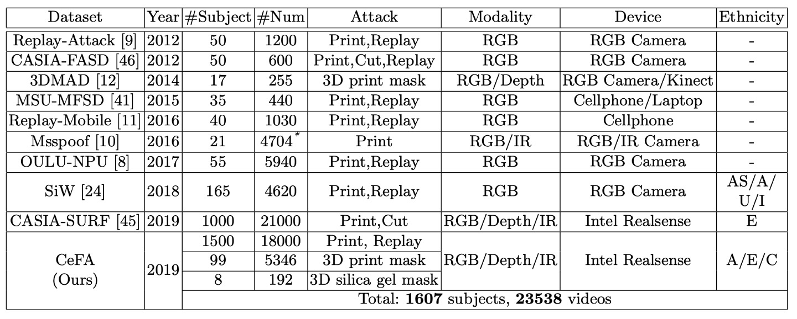

## モデルの偏見

[**CASIA-SURF CeFA: A Benchmark for Multi-modal Cross-ethnicity Face Anti-spoofing**](https://arxiv.org/abs/2003.05136)

---

論文のタイトルにある CASIA-SURF とは、中国科学院自動化研究所（Chinese Academy of Sciences, Institute of Automation、略して CASIA）が作成した顔認識偽造防止のためのデータセット、**CASIA-SURF: A Large-Scale Multi-Modal Benchmark for Face Anti-Spoofing**を指しています。

このデータセットは 2019 年に公開され、多モーダル顔認識偽造防止（multi-modal face anti-spoofing）に関する重要なデータセットの一つとして位置付けられています。

この論文は、種族バイアスに関して提案された拡張版データセットで、その名称は CASIA-SURF CeFA です。

## 問題の定義

FAS（顔認識偽造防止）の分野では、「より正確で、より速く、より汎用的な」モデルを追求することが一般的です。

しかし、未だに解決されていない古くからの問題があり、それは誰も触れたがらないものです。それが、**民族的偏見（Ethnic Bias）**です。

それでは、なぜこの問題が無視されてきたのでしょうか？それとも、誰も認めたくないのでしょうか？

---

顔認識を行ったことがある人なら、この問題に馴染みがあるはずです。

現在の顔認識用大規模公開データセットの多くが「白人」の顔に偏っているため、他の民族に対する認識精度が低く、ひどい場合はシステムが誤った応答をすることさえあります。

そのため、この問題を解決しようとする場合、目標とする民族のデータセットを自分で収集し、モデルが安定した正しい特徴を学習できるようにする必要があります。

この問題は FAS にも当てはまります。

著者たちは、現在の最先端（SoTA）モデルが民族間で異なると、パフォーマンスが急激に低下することを発見しました。実験によると：

> **同じ FAS モデルが中央アジア民族での ACER は、東アジア民族より少なくとも 8%高い。**

想像してみてください、もし今日、あなたが展開したモデルが特定の民族に遭遇するたびに、大量に「Fake！Fake！Fake！」と表示されるとしたら…。

クライアントは、すぐにそのシステムと一緒にあなたを川に投げ捨てることになるのではないでしょうか？

## 問題の解決

:::tip
本論文の重点はデータセットの内容と設計にあり、モデル構造については簡単に触れられています。
:::

### CeFA データセット

CeFA と他のデータセットを比較したものは以下の表の通りです：

<figure style={{"width": "90%"}}>

</figure>

---

CeFA は Intel RealSense カメラを使用して三つのモーダルデータを取得します。これには RGB（カラー）、Depth（深度）、IR（赤外線）が含まれます。各ビデオの解像度は 1280 × 720、フレームレートは 30 fps です。

撮影時、被験者は自然に頭を回転させるように指示され、最大偏向角度は約 30 度で、実際のシーンでの顔の自然な動きをシミュレートしています。

データの前処理フローは以下の通りです：

- 顔認識には**3DFFA**モデルを使用（PRNet の代替）
- 整列された顔領域を抽出し、三モーダル対応サンプルを保持
- モーダル顔サンプルは以下の図の通りです：

  

---

CeFA データセットは二つのサブセットから構成されています：**2D 攻撃サブセット**と**3D 攻撃サブセット**。これらは三つの民族（アフリカ系、東アジア系、中アジア系）をカバーし、さまざまな攻撃方法と照明条件を設計しています。

- **2D 攻撃サブセット（印刷＆再生）**

  - **民族の人数**：
    - 各民族 500 人、計 1500 人
  - **各被験者が提供するサンプル**：
    - 1 つの真実のサンプル
    - 2 つの印刷攻撃（屋内、屋外それぞれ 1 つ）
    - 1 つのビデオ再生攻撃
  - **モーダルデータ**：
    - 各サンプルは RGB、Depth、IR の三つのモーダルを同期して取得
  - **総サンプル数**：
    - 1500 人 × 4 本のビデオ = 6000 本 × 3 モーダル = **18000 本のビデオ**

  論文では 2D サブセットの被験者の年齢と性別に関する統計情報も提供しており、後の公平性分析に役立ちます。

---

- **3D 攻撃サブセット（3D マスクとシリコンマスク）**

  このサブセットはより現実的な攻撃シーンをシミュレートしており、二つのタイプの攻撃が含まれます：

  - **3D プリントマスク攻撃**

    - 被験者数：99 人
    - 各人のサンプル：
      - 3 種類の攻撃スタイル：
        - 素のマスク
        - ウィッグ＋眼鏡
        - ウィッグ＋眼鏡なし
      - 6 種類の照明条件：
        - 屋外の太陽光、屋外の影
        - 屋内側光、正面光、逆光、通常光
      - 合計 18 本のビデオ × 3 モーダル

  - **総サンプル数**：99 × 18 × 3 = **5346 本のビデオ**

  - **シリコンマスク攻撃**
    - 被験者数：8 人
    - 各人のサンプル：
      - 2 種類の攻撃スタイル：
        - ウィッグ＋眼鏡
        - ウィッグ＋眼鏡なし
      - 4 種類の照明条件：
        - 屋内側光、正面光、逆光、通常光
      - 合計 8 本のビデオ × 3 モーダル
  - **総サンプル数**：8 × 8 × 3 = **196 本のビデオ**

  3D サブセットは数量的には比較的小さいものの、攻撃スタイルが現実的で変数が複雑であり、モデルの汎化能力をテストする重要なセットとなっています。

## 評価プロトコル

:::tip
この 4 つのプロトコルの詳細な概念については、以前の論文で何度も紹介しているため、ここでは簡単に触れます。
:::

CeFA データセットは、モデルが異なるシーンでの汎化能力を体系的に評価するために、4 種類の評価プロトコルを設計しました。これらは、民族間、攻撃タイプ間、モーダル間、およびそれらの組み合わせなどの課題をカバーしています。

以下の表は、それぞれのプロトコルの具体的な設定です：

<figure style={{"width": "90%"}}>

</figure>

- **プロトコル 1: 跨民族（Cross-ethnicity）**

  このプロトコルは、既存の PAD データセットが一般的に民族ラベルや民族間テスト設定が不足している問題に対処するために設計され、モデルが見たことのない民族に対して汎化能力を持つかを評価します。

  方法としては、1 つの民族の被験者でトレーニングと検証を行い、残りの 2 つの民族のデータをテストセットとして使用します。これにより、3 種類の異なる実験設定が構成されます。

  この設定は、特定の民族で開発されたモデルが他の民族環境に展開された際の実際のシナリオをシミュレートしています。

  ***

- **プロトコル 2: 跨 PAI（Cross-PAI）**

  このプロトコルは、プレゼンテーション攻撃ツール（PAI）の攻撃形式の多様性と予測不可能性に対応し、未知の攻撃スタイルに対してモデルの堅牢性を評価します。

  トレーニングと検証段階では一部の攻撃タイプのみを使用し、テスト段階では未見の攻撃手法を使用して、モデルが異なる種類の偽顔行動を識別できるかを観察します。

  ***

- **プロトコル 3: 跨モーダル（Cross-modality）**

  このプロトコルは、モーダルが変化した場合のモデルの汎化能力を探索するために設計されています。トレーニング段階では 1 つのモーダル（RGB、Depth、または IR）のみを使用し、テスト段階では残りの 2 つのモーダルを使用して評価します。

  この設定は、現実のアプリケーションにおいてセンサーデバイスが制限されているか、モーダル情報が不完全である場合において、モデルがクロスモーダル特徴の整合性が欠如していても識別性能を維持できるかを検証します。

  ***

- **プロトコル 4: 跨民族 & 跨 PAI（Cross-ethnicity & Cross-PAI）**

  最も挑戦的なプロトコルで、プロトコル 1 とプロトコル 2 の条件を組み合わせたものです。テストセットは、未知の民族と未知の攻撃タイプを同時に含んでいます。

  この設定は、実際のデプロイメントで最も困難なシナリオをシミュレートします。すなわち、モデルが見たことのない民族の外観や攻撃手法に直面した場合でも、基本的な識別能力を維持できるかどうかをテストします。このプロトコルは、モデルの実際の汎化能力とバイアス感度を効果的に明らかにします。

## モデル構造

CeFA データセットに対して、本論文で提案されたモデルは二つの主要なモジュールに分かれています：

1. **SD-Net**：単一モーダルの静的および動的特徴抽出ネットワークで、単一モーダル下での空間と時間の情報を捕えることに焦点を当てています。
2. **PSMM-Net**：部分的に共有された多モーダルネットワークで、異なるモーダル間の特徴融合と相互学習のために設計されています。

---

### SD-Net

SD-Net は、RGB、Depth、または IR の単一モーダル入力を処理し、静的画像と動的シーケンス情報を同時に抽出することを目的としています。全体は三つの特徴分岐から構成されます：

- **Static Branch（赤い矢印）**：静的な画像を処理し、空間的特徴を抽出します。
- **Dynamic Branch（青い矢印）**：Rank Pooling を使用して、K フレームのシーケンスを要約し、動的特徴マップに変換します。
- **Static-Dynamic Branch（緑の矢印）**：上記の二つの特徴を融合させ、空間と時間の相互理解を強化します。

三つの分岐はすべて ResNet-18 をバックボーンとして使用し、五層の残差モジュールと一つの全体平均プーリング（GAP）層を含んでいます。**Static-Dynamic Branch の入力**は、Static および Dynamic Branch の**res1 層の出力の合計**です。

各層のモジュールは$M_t^\kappa$として表され、次のように定義されます：

- $\kappa \in \{color, depth, ir\}$：モーダルタイプ；
- $t = 1 \sim 4$：特徴層のレベルを示します。

各分岐は各層で独立した特徴ベクトルを出力し、これを以下のように記録します：

- $X_t^{s,\kappa}$（Static）
- $X_t^{d,\kappa}$（Dynamic）
- $X_t^{f,\kappa}$（Fusion）

三つの分岐が補完的な情報を学習できるように、著者は各分岐に**独立した損失関数（BCE を使用）**を設計し、さらに統合特徴の損失を追加しました：

$$
L_\kappa = L_\kappa^s + L_\kappa^d + L_\kappa^f + L_\kappa^{sdf}
$$

---

### PSMM-Net

次に PSMM-Net の部分を見ていきましょう。

PSMM-Net の目的は、モーダル間の共通の意味と補完的な情報をキャプチャすることです。これには二つの部分が構成されています：

1. **Modality-specific Networks**：三つの SD-Net がそれぞれ RGB、Depth、IR の三モーダルに対応し、各モーダルごとに静的および動的特徴を独立して抽出します。
2. **Shared Branch**：ResNet-18 構造に基づき（conv 層と res1 層を除去）、モーダル間の共通意味をモデル化します。

効果的なモーダル間の相互作用を実現するために、PSMM-Net は**双方向の融合戦略**を採用しています：

- **Forward Feeding（shared branch に伝送）**

  三つのモーダルの静的および動的特徴を各層で合計し、shared branch に入力します：

  $$
  \tilde{S}_t = \sum_{\kappa} X_t^{s,\kappa} + \sum_{\kappa} X_t^{d,\kappa} + S_t
  $$

  ここで$S_t$は shared branch の$t$層の出力（$S_1 = 0$、ゼロから開始）です。

  ***

- **Backward Feeding（shared branch から戻す）**

  $S_t$を各モーダルの SD-Net にフィードバックし、元の特徴と加算して出力特徴を修正します：

  $$
  \hat{X}_t^{s,\kappa} = X_t^{s,\kappa} + S_t,\quad \hat{X}_t^{d,\kappa} = X_t^{d,\kappa} + S_t
  $$

  このステップは static および dynamic 分岐にのみ作用し、fusion 分岐がモーダル間の意味的干渉を受けないようにします。

---

全体のアーキテクチャは、SD-Net を使用して静的および動的特徴を明確に切り離し、PSMM-Net の双方向モーダル相互作用設計を通じて、モデルの異なる民族や攻撃スタイルに対する汎化能力を強化します。

最終的な損失関数は次のように定義されます：

$$
L = L_{whole} + L_{color} + L_{depth} + L_{ir}
$$

ここで$L_{whole}$は、すべてのモーダルおよび shared branch の特徴を合計した全体的な損失です。

## 討論

### 民族多様性におけるモデルの偏見分析

<figure style={{"width": "90%"}}>

</figure>

著者は、CeFA データセットにおける三つの異なる民族（東アジア、中アジア、アフリカ系）に対して、性能の偏差分析を行い、現在の主流モデルが民族の違いに直面したときの識別性能の差異を観察しました。

実験は、二つの公開データセットでトレーニングされた最先端（SoTA）モデルを使用し、これらはそれぞれ多モーダルおよび単一モーダルの防偽手法を代表しています：

- **MS-SEF**：多モーダル手法、CASIA-SURF でトレーニング（主に東アジアのサンプル）
- **FAS-BAS**：単一モーダル RGB 手法、OULU-NPU でトレーニング（こちらも東アジアが主）

トレーニング後、二つのモデルは CeFA データセットの三つの民族に対してテストを行い、主な評価指標として ACER を使用しました。

結果は、**中央アジアの識別性能が最も低い**ことを示しました。二つのモデルは、この民族に対して顕著に性能が低下し、ACER が約 7–10%増加しました。**東アジアの識別性能が最も優れており**、これは CASIA-SURF や OULU-NPU のトレーニングデータセットの多くが東アジア人の顔であることに起因しており、モデルに明らかな民族的偏見（ethnic bias）が存在するためです。

この実験は、現在の単一民族データセットがモデルの汎化能力に与える制限を浮き彫りにしました。モデルが見たことのない民族の特徴に直面したとき、その識別性能は顕著に低下します。この結果は、CeFA が設計した跨民族プロトコル（Protocol 1）の必要性を証明し、公平性と汎化能力が優れた顔認識偽造防止研究を進めるために重要なステップとなります。

### ベースラインモデル評価結果

<figure style={{"width": "70%"}}>

</figure>

著者は、SD-Net と PSMM-Net モデルを CeFA で設計された四つの評価プロトコルで広範囲に実験しました：

- **プロトコル 1：Cross-ethnicity**

  - サブプロトコル 1-1、1-2、1-3 の ACER はそれぞれ**0.6%、4.4%、1.5%**でした。
  - 異なる民族間でのモデルの性能差は、民族的偏見が確かに存在することを示しています。この結果は、跨民族評価プロトコルの設計動機を支持し、トレーニング時に民族的多様性を取り入れる重要性を示しています。

  ***

- **プロトコル 2：Cross-PAI（異なる攻撃ツールの汎化）**

  - サブプロトコル 2-1（print でトレーニングし、video-replay + 3D でテスト）の ACER は**0.4%**でした。
  - サブプロトコル 2-2（video-replay でトレーニングし、print + 3D でテスト）の ACER は**7.5%**でした。
  - 結果は、異なる攻撃ツールの物理的特性の違い（例えば、画面表示と印刷素材）が顕著な性能差を引き起こし、現在の PAD モデルが攻撃スタイルに対して顕著な感度を持っていることを示しています。

    ***

- **プロトコル 3：Cross-modality（モーダル間汎化）**

  - 最良の結果はサブプロトコル 3-1 で、ACER は**4.9%**でした。
  - モデルは一定のモーダルトランスファー能力を持っていますが、トレーニングモーダルとテストモーダル間の意味的整合性に制限されているため、性能が制限されることがわかります。このプロトコルは、多モーダルデータの重要性を強調し、PSMM-Net の融合戦略の効果を証明しました。

    ***

- **プロトコル 4：Cross-ethnicity & Cross-PAI（ダブル汎化テスト）**

  - サブプロトコル 4-1、4-2、4-3 の ACER はそれぞれ**24.5%、43.2%、27.7%**でした。
  - これは最も困難なシナリオであり、未知の民族と未知の攻撃スタイルの両方に直面する必要があります。モデル全体の性能が大きく低下し、実際の展開時に直面する多重汎化の課題を浮き彫りにし、CeFA 設計の価値と難易度を証明しました。

## 結論

本論文は、当時最大規模の多モーダル顔認識攻撃検出データセットであり、RGB、Depth、IR の三種類のモーダルをカバーしているだけでなく、初めて民族ラベルを導入し、「跨民族汎化」を討議の核心に据えました。

モデル設計において、PSMM-Net の「部分共有 + 双方向融合」戦略と、SD-Net による静的および動的特徴の解耦は、当時の多モーダル学習の中でも非常に体系的な試みの一つでした。後に、より簡素化されたり、より強化されたクロスモーダル整合性を持つアーキテクチャが登場しましたが、PSMM の設計理念は多くの変種アーキテクチャに影響を与えました。

振り返ってみると、CeFA が提案した貢献は、「跨モーダル、跨民族、跨攻撃タイプ」という研究課題を明確に定義し、合理的な出発点を提供したことです。今日の私たちにとって、これは単なるデータセットではなく、今なお継続的に発展し続ける問題の領域です。
