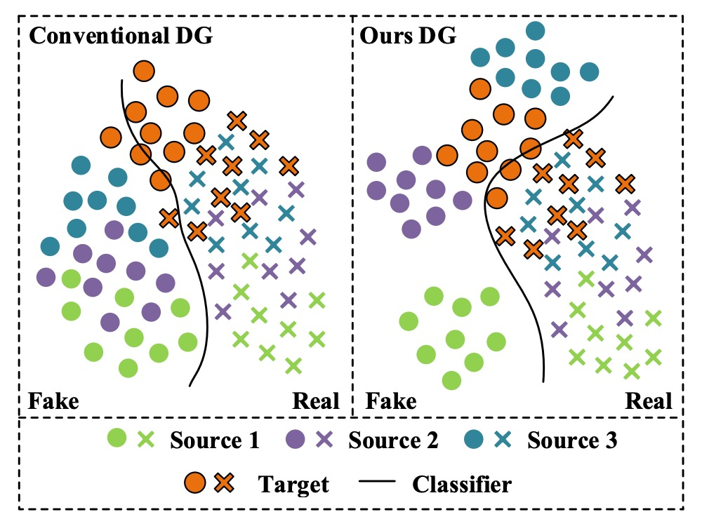
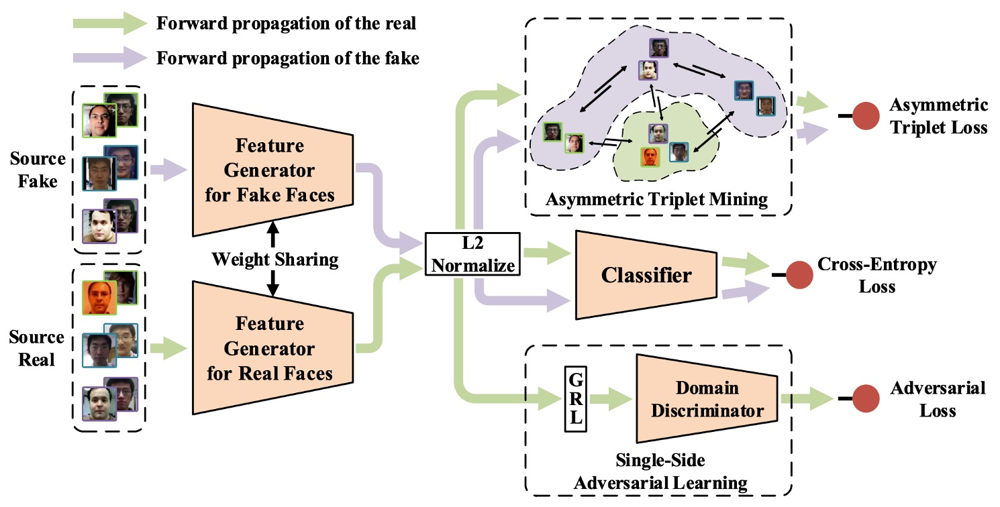

## 安定した真実

[**Single-Side Domain Generalization for Face Anti-Spoofing**](https://arxiv.org/abs/2004.14043)

---

顔認識システムへの攻撃手法は多岐に渡り、その解決方法も負けじと豊富です。

この記事では、Domain Generalization（DG）技術に基づいた FAS 研究を見ていきましょう。

## 問題の定義

FAS の問題に関して、研究者たちは主に二つの技術的アプローチを開発しました：

- **テクスチャ指向**：
  画像の細部の違いを用いて、偽の顔を識別する方法です。例えば、色の歪みや材質のテクスチャ異常などです。この方法には、手作りの特徴量（例：LBP、HOG、SIFT）や、最近の CNN 特徴学習があります。

- **時系列指向**：
  複数のフレームにおける変化を分析します。例えば、目の瞬き、口の動き、rPPG 脈拍信号などです。これらを CNN-LSTM や RNN 構造で活用し、活体の兆候を捕える方法です。

これらの方法は特定のデータセット内（intra-database）では非常に優れたパフォーマンスを示しますが、モデルが別のデータセットに適用されると（cross-database）、精度は急激に低下します。

一例を挙げてみましょう：

<div align="center">
<figure style={{"width": "70%"}}>

</figure>
</div>

まず左側の図を見てみましょう。

実務上の経験に基づけば、各色は「特定のスマートフォンモデル」を表しています：

- **緑色**：iPhone XX
- **紫色**：Samsung OO
- **青色**：Pixel YY

次に：

- **オレンジ色**：撮影品質が他のものと大きく異なるスマートフォンですが、トレーニングデータセットには含まれていません。

---

最初に 3 つのデータセットで FAS モデルを訓練した後、「オレンジ色」のスマートフォンの通過率が特に低いことに気づきました。しかし、オレンジ色のスマートフォンのユーザーは非常に多いため、このモデルを提供すると大量のクレームが届きました。

期待していたのは右側の図のような状況で、モデルは訓練段階で一定の汎化能力を持ち、異なるデータソースに対しても良いパフォーマンスを発揮するはずでしたが、現実は痛烈に打たれました。

異なるデータソースに対して効果的に汎化できない問題は繰り返し発生し、その原因はさまざまです：

- **分布の差異**：訓練データセットとテストデータセットの出所が異なること、例えば背景、解像度、光の条件、撮影機器、人種の構成など。
- **偽の顔の多様性は真の顔よりもはるかに高い**：攻撃手法や製造プロセスが大きく異なり、偽の顔特徴を統一するのが難しく、それが分類の境界をぼかす原因となります。

従来の方法はデータセット固有の特徴に過度に依存しており、その結果、モデルは「データセットのバイアス」を学習してしまいます。

そのため、この論文の著者は FAS の課題はこうあるべきだと考えています：

> **ターゲットデータを一切使用できない前提で、高い汎化能力を持つモデルを設計すること。**

それができなければ、たとえ多くのデータセットを集めても、異なるソースや攻撃タイプの偽の顔には対応できません。

## 問題の解決

<div align="center">
<figure style={{"width": "90%"}}>

</figure>
</div>

「偽の顔特徴の高度な異質性」と「真の顔の相対的一貫性」によって生じる汎化の困難さを解決するため、著者は新しい偽造防止訓練戦略として**Single-Side Domain Generalization（SSDG）**を提案しています。

上記の図のように、このアーキテクチャの設計理念は一言でまとめることができます：

> **真の顔の特徴はできるだけ一致させ、偽の顔にはそのままにしておく。**

つまり、SSDG は真偽顔のために共通の汎化空間を構築することを要求せず、非対称戦略を採用しています。真の顔に対してはクロスドメイン対抗訓練を行い、その分布を一致させるようにし、偽の顔に対しては分布の差異を意図的に保持し、その特異性を強化します。

このような対照的な学習設計により、分類境界はより堅牢になり、未知のターゲットデータセットにも効果的に汎化できるようになります。

全体のモデルは以下の重要なモジュールを含んでいます：

- 特徴生成器（Feature Generator, G）
- ドメイン分類器（Domain Discriminator, D）
- 偽造防止分類器（Face Anti-Spoofing Classifier）
- 非対称 Triplet Loss 訓練
- 特徴と重みの正規化モジュール

これらを順番に見ていきましょう。

### 一辺対抗学習

DG 領域では、モデルがクロスドメインの課題を克服するために、一般的に対抗訓練（Adversarial Training）を追加します。この方法では、モデルがサンプルがどのドメインから来たかを識別できないようにして、ドメイン不変（domain-invariant）の特徴を学習させます。

方法は簡単で、モデルに「ドメイン分類器」を追加し、サンプルを「ソース A」または「ソース B」に分類するよう学習させます。

通常、分類器は分類精度の向上に伴ってその損失が減少しますが、対抗訓練の状況ではその逆です。分類精度が良くなるほど損失が増加し、モデルがドメイン固有の特徴を学習しないように強制します。

この論文では、新しい対抗学習方法を提案しています：

- **一辺対抗学習（Single-Side Adversarial Learning）**。

モデル化は以下のようになります：

$N$個のソースデータセットを定義し、$D = \{D_1, D_2, ..., D_N\}$ と記述します。それぞれには以下が含まれます：

- 真顔サンプル $X_r$
- 偽顔サンプル $X_f$

これらを特徴生成器に入力し、特徴表現を得ます：

$$
Z_r = G_r(X_r), \quad Z_f = G_f(X_f)
$$

パラメータが共有されているため、実際には$G_r$と$G_f$は同じモデル$G$であり、概念的には入力ソースで区別しています。

次に、$Z_r$をドメイン分類器$D$に入力し、どのデータセットに属するかを判定します。モデルがクロスドメインで一致する真顔特徴を学習できるように、ここでは特徴生成器 G がこの分類器を「欺く」ことを試み、対抗学習のプロセスを形成します。

全体の損失関数は次のようになります：

$$
\min_D \max_G \ \mathcal{L}_{\text{Ada}}(G, D) = - \mathbb{E}_{(x,y) \sim X_r, Y_D} \sum_{n=1}^{N} \mathbf{1}[n = y] \log D(G(x))
$$

ここで$Y_D$はドメインラベル、$\mathbf{1}[n = y]$は指示関数で、サンプルが$n$番目のデータセットに属するかどうかを示します。

この対抗プロセスでは、**偽顔は一切参加しません**。その高い変動性が対抗訓練の安定性を汚染するのを避けます。

この「一辺で訓練し、互いに対抗する」メカニズムを実装するために、著者は**Gradient Reversal Layer（GRL）**を採用しました。これは DG モデルでよく使われるトリックで、後で説明します。

### 非対称三元組学習

ここでは偽顔を共通の特徴空間に圧縮することを放棄したので、偽顔同士を分離し、真顔から距離を置く方法を考える必要があります。これが非対称三元組損失（Asymmetric Triplet Loss）が解決しようとする問題です。

実装方法は次の通りです：

3 つのソースデータセットがあると仮定し、サンプルを 4 つのカテゴリに再分けします：

- すべての真顔 → 1 カテゴリ（Cross）
- 3 つの偽顔 → 各カテゴリ（Circle / Square / Triangle）

目標は以下の条件を満たすことです：

1. 偽顔同士を分離する（inter-domain separation）
2. 真顔同士を集約する（intra-class compactness）
3. 真顔と偽顔の間で距離を開ける（inter-class separation）

次の図に示すように：

<div align="center">
<figure style={{"width": "80%"}}>

</figure>
</div>

各組み合わせ（anchor / positive / negative）$(x_a^i, x_p^i, x_n^i)$に対して、非対称三元組損失は次のように定義されます：

$$
\mathcal{L}_{\text{AsTrip}}(G) = \sum_i \left( \|f(x_a^i) - f(x_p^i)\|_2^2 - \|f(x_a^i) - f(x_n^i)\|_2^2 + \alpha \right)
$$

ここで$\alpha$はマージンのハイパーパラメータで、分類境界の幅を制御します。

この設計により、モデルは特徴空間内で自然に真顔と偽顔を区別できるようになり、真顔の安定した集中的な分布を維持できます。

### 特徴と重みの正規化

著者は特徴の一貫性と分類境界の安定性を高めるために、二重の正規化設計を導入しました：

- **特徴の正規化**：
  出力されたすべての特徴に L2 正規化を適用し、それらが単位球面上に位置するようにし、画像品質（光、レンズなど）によるノルム差異を排除します。

- **重みの正規化**：
  分類器の重みベクトル$W_i$を単位長さに正規化し、バイアスを 0 に設定します。これにより、分類決定は次のように簡略化されます：

$$
\cos(\theta_1) - \cos(\theta_0) = 0
$$

これにより、モデルは**方向性による区別**に焦点を合わせ、特徴の大きさに頼ることなく、分類結果の安定性をさらに高めます。

上記のモジュールを統合した後、SSDG フレームワークの訓練損失は次のようになります：

$$
\mathcal{L}_{\text{SSDG}} = \mathcal{L}_{\text{Cls}} + \lambda_1 \mathcal{L}_{\text{Ada}} + \lambda_2 \mathcal{L}_{\text{AsTrip}}
$$

ここで：

- $\mathcal{L}_{\text{Cls}}$：通常の分類器のクロスエントロピー損失
- $\lambda_1, \lambda_2$：バランス係数で、対抗損失と三元組損失の重みを制御します

従来の「先にプレトレーニングしてからファインチューニングする」方法とは異なり、SSDG は**エンドツーエンドの訓練戦略**を採用し、すべてのモジュールを同時に最適化します。これにより、プロセスが簡略化され、全体の安定性が向上します。

:::info
ここまで読んだら、人顔認識領域のさまざまなマージンベースの損失を思い浮かべるかもしれません。実装の際にこれらも試してみることができます。
:::

## 延伸補充

:::tip
DG に触れたことがない読者や GRL の概念にまだ馴染みがない読者向けに、GRL の概念と実装方法を簡単に理解できる技術ノートを補足しておきます。
:::

**GRL とは何か？なぜ DG でそれが重要なのか？**

Domain Generalization（DG）と Domain Adaptation（DA）で非常に有名なテクニックに**Gradient Reversal Layer（GRL）**があります。これは 2015 年の DANN 論文（Domain-Adversarial Neural Network）に由来し、その核心的な役割はモデルが「対抗的な特徴学習」を行うことを可能にすることです。

:::info
DANN は引用数が数万に達する非常に影響力のある論文です。時間があれば、その内容についても話しましょう。
:::

GRL を一言で説明すると、次のようになります：

> **Forward 時は何もしない、Backward 時に梯度に-1 を掛ける。**

これにより、2 つの訓練目標が引っ張り合う効果を作り出します：**特徴抽出器は「データのソースを識別できないように」努力し、ドメイン分類器は「データのソースを識別する」ように努力する**。これがまさに対抗学習の精神です。

DG の目標は、モデルが「データのソース」に依存しないように学習させること、つまり特徴が**domain-invariant（ドメイン不変性）**を持つようにすることです。しかし、このような特徴は直接「教える」ことができません。代わりに、逆方向の信号を通じてモデルに「強制的に」学習させます：

- データが異なるドメインから来る場合、特徴抽出器はドメイン分類器を欺いて、その識別を困難にする
- ドメイン分類器が強すぎると、特徴抽出器はさらにドメインを混乱させ、これらの引っ張り合いによってすべてのドメインに対して有効な特徴空間が収束します

そして GRL は、この引っ張り合いメカニズムを実装するための強力なツールであり、プロセス全体を標準的なバックプロパゲーションを通じて自動的に最適化します。

GRL の forward と backward プロセスを簡単に実装してみましょう：

```python
import torch
from torch.autograd import Function

class GradientReversalFunction(Function):

    @staticmethod
    def forward(ctx, x, lambd):
        ctx.lambd = lambd
        return x.view_as(x)

    @staticmethod
    def backward(ctx, grad_output):
        return grad_output.neg() * ctx.lambd, None

def grad_reverse(x, lambd=1.0):
    return GradientReversalFunction.apply(x, lambd)
```

使い方は、このようにモデルの forward に挿入します：

```python
class DomainAdversarialNetwork(torch.nn.Module):

    def __init__(self):
        super().__init__()
        self.feature_extractor = ...
        self.classifier = ...
        self.domain_discriminator = ...

    def forward(self, x, lambd=1.0):
        feat = self.feature_extractor(x)
        class_out = self.classifier(feat)
        # GRLを挿入：バックプロパゲーション時に自動で逆方向の勾配を反転
        reversed_feat = grad_reverse(feat, lambd)
        domain_out = self.domain_discriminator(reversed_feat)
        return class_out, domain_out
```

ここで`lambd`は逆方向の強度を制御するハイパーパラメータで、SSDG 論文では時間動的調整式が使われています：

$$
\lambda = \frac{2}{1 + \exp(-10k)} - 1
\quad \text{with} \quad k = \frac{\text{current\_iters}}{\text{total\_iters}}
$$

この設計により、モデルは訓練初期に分類タスクに集中し、訓練が進むにつれて対抗学習の強度が徐々に高まり、最終的にバランスが取れます。

## 討論

### データセットテスト設定

:::info
このテスト方法は現在（2025 年）でも使用されていますので、読者の皆さんは覚えておいても良いかもしれません。
:::

著者は 4 つの公開データセットを使用して実験を行いました。データセットの出典は以下の通りです：

- **O：OULU-NPU**
- **C：CASIA-FASD**
- **I：Replay-Attack**
- **M：MSU-MFSD**

テスト方法は、毎回ランダムに 1 つのデータセットをテストデータセットとして選び、残りの 3 つを訓練データセットとして使用するものです。このような設計は、実際の応用において、モデルが全く新しいデータソースに直面する状況をシミュレートできます。合計で 4 つのテストタスクがあります：

- **O & C & I → M**
- **O & M & I → C**
- **O & C & M → I**
- **I & C & M → O**

この交差設計は、デプロイ時によく遭遇する問題を正確にシミュレートします：**システムが直面するデータは、訓練データセットには存在しない場合が多い**という問題です。

### 他の方法との比較

<div align="center">
<figure style={{"width": "90%"}}>

</figure>
</div>

著者は、現在最も代表的な FAS 方法を集約し、4 つの cross-database テストタスクにおけるパフォーマンスを示しました：

- **CNN ベースの方法（Yang et al., Atoum et al.）**
- **時系列および生理信号方法（Liu et al. rPPG）**
- **伝統的特徴派（LBP、SURF）**
- **MADDG 方法（現存する唯一の DG 競合）**

上記の表で、SSDG が MADDG ベースのアーキテクチャを使用している場合、SSDG-M と呼ばれ、ResNet18 ベースの場合は SSDG-R と呼ばれます。

実験結果は SSDG の圧倒的な勝利を示しており、すべてのタスクで明らかな差をつけています：

- HTER の低下
- AUC の向上
- 全体的な結果が一貫して安定しており、「運が良くて勝った一戦」ではない

この結果に基づき、著者は以下の重要な観察を行いました：

- **ほとんどの現存する方法は cross-database の分布問題を処理していない**：

  - それらは intra-database ではうまくいくが、環境が変わると効果がなくなる
  - 本質的には、dataset-specific な特徴を学んでおり、汎化可能な表現を学んでいない

- **MADDG は少数の例外だが、DG を使用しているものの戦略的には盲点がある**：

  - それでも真顔と偽顔のために共通の一般化特徴空間を構築しようとしている
  - 偽顔の変動が大きく、ソースが非常に多様であるため、こうした整列は収束しにくく、しばしば劣った結果を引き起こす

対照的に、SSDG が採用した非対称学習戦略は、むしろより実践的です：

- 真顔：クロスドメインの整列、安定した特徴を学習
- 偽顔：積極的に分離し、無理に整列させない

この「集まるべきものは集め、散るべきものは散らす」戦略こそが、SSDG が勝利した本当の理由です。

### アブレーション実験

<div align="center">
<figure style={{"width": "90%"}}>

</figure>
</div>

この表では、著者が SSDG の 3 つの主要なモジュールを分解して、単独でモジュールを除外した場合にどのような影響が出るかを観察しています：

- **ssad**：単辺対抗学習（Single-side adversarial）
- **triplet**：非対称三元組損失（Asymmetric triplet loss）
- **norm**：特徴および重みの正規化

分析結果は、MADDG ベースまたは ResNet18 ベースのアーキテクチャでも、いずれかのモジュールが欠けると HTER が上昇し、AUC が低下することを示しています。一方、3 つのモジュールをすべて組み合わせた SSDG が最良かつ最も安定したパフォーマンスを発揮しました。

これは、SSDG のパフォーマンスが単一の重要なテクニックによって支えられているわけではなく、全体の設計が協力し合い、互いに密接に関連していることを示しています。

## 結論

この論文で提案された**SSDG フレームワーク**は、より大きなネットワークや大量のデータに頼るのではなく、戦略的設計によって無視されがちな事実に対応しています：

> **真顔は安定した信号であり、偽顔は混乱した信号であり、両者は一緒に扱うべきではない。**

この戦略により、SSDG は 4 つの公開データセットで全面的に勝利を収め、データが制限され、アーキテクチャが簡素化された状況でも場面をしっかりと支えることができました。この差別化学習戦略は、その後の防偽タスクの標準的な思考モデルとなり、すべての異常サンプルに対して共通の偽顔概念を使用することはなくなりました。

これにより、SSDG は FAS 分野における重要なマイルストーンとなり、以後の多くの DG ベースの研究の道を開きました。
