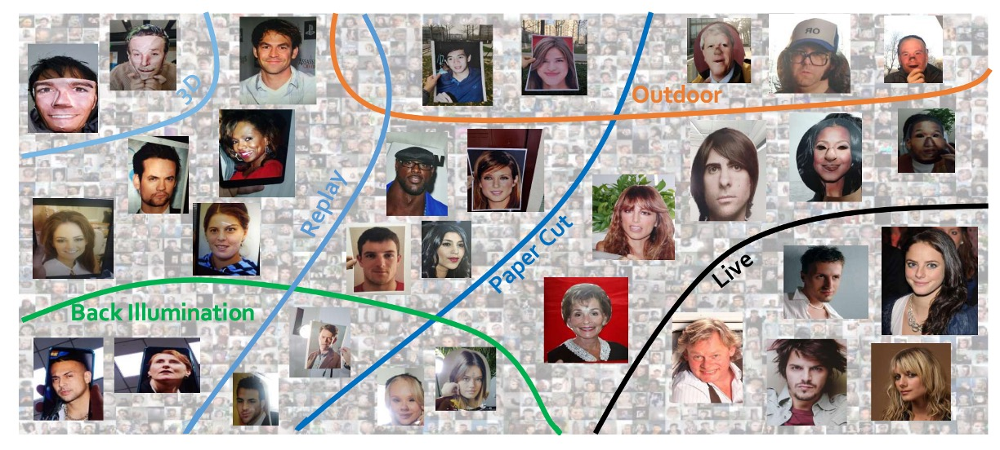
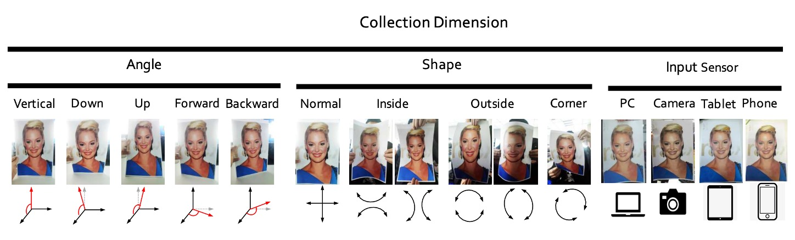

## 大規模な偽造防止の試練

[**CelebA-Spoof: Large-Scale Face Anti-Spoofing Dataset with Rich Annotations**](https://arxiv.org/abs/2007.12342)

---

Face Anti-Spoofing（FAS）は、ここ数年でコンピュータビジョンの分野で広く知られる技術となり、スマートフォンのロック解除、顔認証によるアクセス管理、モバイル決済など、ほぼすべての顔認識システムは「この顔が本物かどうか」という根本的な疑問を避けて通れなくなっています。

しかし、技術が次々と進展する中で、ひとつの重要な問題が静かに浮かび上がってきました：

> **データセットが不足している。**

---

## 問題の定義

現在の FAS データセットには、次の 3 つの明らかな問題があります：

1. **多様性の欠如（Lack of Diversity）**：顔画像が不十分で、シーンが単一、センサー数が少なく、一般的なデータセットは通常 2000 人未満、4 つのシーン、10 台以下のデバイスしかありません。こんなデータでは異なるシーンでの展開には耐えられません。
2. **注釈が不十分（Lack of Annotations）**：ほとんどが「Live」または「Spoof」のラベルのみで、場合によってはスプーフィングの種類が示されることがありますが、光照条件や背景環境については全く言及されていません。これではモデルが「顔ではないが密接に関連する」リアルな手がかりを学ぶことはできません。
3. **性能が限界に達している（Performance Saturation）**：いくつかのデータセット（例えば SiW、OULU-NPU）では、ResNet-18 のリコール率が FPR=0.5%で 100.0%や 99.0%に達しており、これらのデータセットでは**良いモデルと悪いモデルの違いを区別できなくなっている**ということです。

現在のデータセット規模では、深層学習のモデルを訓練するには限界があり、小学校の数学の問題で大学生をテストしているようなものです。問題がいくら多くても結果は同じです。

この論文の著者たちは、この問題に取り組みました：私たちが解決します。

## 解決策

この問題を解決するために、著者たちは**CelebA-Spoof**を提案しました。

当時、「史上最大、最も詳細な注釈、最も多様なシーン」を誇る顔認証詐欺防止データセットとされていました。

まず、その仕様を見てみましょう：

- **データ規模が非常に大きい**：10,177 人の異なる個人、625,537 枚の画像を収録。
- **シーンとデバイスが豊富**：10 種類以上の異なる入力デバイス（スマホ、タブレット、PC など）から、8 つのセッション（2 種類の環境 × 4 種類の光照条件）で撮影された画像。
- **豊富な注釈属性**：各画像には「Live/Spoof」のラベルに加えて、以下の属性も注釈されています：
  - スプーフィングの種類（例えば、印刷物、画面表示など）
  - 光照条件（例えば、室内照明、直射日光など）
  - 背景環境（例えば、オフィス、屋外の街並みなど）
  - さらに、CelebA に基づく 40 種類の顔属性（前髪、メガネ、笑顔の有無など）

合計で**43 種類の属性**。これにより、FAS の問題を多角的に探求できるのです。

### CelebA-Spoof Dataset

<figure style={{"width": "90%"}}>

</figure>

CelebA-Spoof は、当時の FAS データセットの中で最大かつ最も詳細な注釈がつけられたものです。そのデータ構築の過程は、単に数量を追求するのではなく、多様性と意味的な側面にも十分に配慮されています。

著者たちは、既存のデータをそのまま使用するのではなく、Live と Spoof のデータを基に、現実的な応用シーンに合った高品質なデータセットを一から構築しました。

CelebA-Spoof の Live 画像は、顔属性予測を目的に作られた大規模な顔認識データセット「CelebA」から選ばれました。著者たちは、そこから 202,599 枚の画像を精選しましたが、それは単に「そのまま使う」のではなく、広告ポスターや漫画スタイルのイラスト、その他の自然顔ではない画像を除外して、スプーフィング画像と誤認されることのないように配慮しました。

スプーフィング画像の作成には、選ばれた Live 画像から、各人物の顔のサイズに基づいて順位をつけ、最大 20 枚をスプーフィング撮影の素材として選定しました。これにより、サンプルの多様性を保ちながら、異なる人物間でスプーフィング画像の均等な分布を維持できました。最終的には 87,926 枚の画像がスプーフィング素材として選ばれました。

次に、著者たちは 8 人のデータ収集者と 2 人のアノテーターを動員し、スプーフィング画像が角度、形状、撮影デバイスにおいて十分な変異を持つようにするための厳密な収集プロセスを確立しました。

収集の 3 つの軸は、以下の図のように設定されました：

- **角度**：垂直、下向き、上向き、正面、斜めの 5 つの頭部傾斜範囲（-30° ～+30°）をカバー。
- **形状**：物理的またはデジタルメディアの再生方法をシミュレートし、通常の平面表示、内折、外折、角度付き表示などのシナリオを含む。
- **装置**：24 種類の異なるセンサーを使用し、PC、タブレット、スマートフォン、カメラなど 4 つのカテゴリに跨り、解像度は 12MP から 40MP まで多様。

画像そのものに加えて、CelebA-Spoof は各画像の意味的情報も整理しました。

Live 画像は CelebA の元々の 40 種類の顔属性（性別、髪型、眼鏡の有無、笑顔など）を引き継いでおり、これらの属性は防止詐欺タスクのために設計されたものではありませんが、FAS 分野に初めて導入され、モデルに「顔の自然さ」を理解するための追加の手がかりを提供します。

スプーフィング画像には次の 3 つの意味的属性が加えられています：

- **Spoof Type（攻撃メディアタイプ）**
- **Illumination（光照条件）**
- **Environment（撮影環境）**。

これら 3 つの軸により、CelebA-Spoof の 8 つのセッション（光照 × 環境の組み合わせ）が定義されました。特に屋外シーンは画期的で、これまでのデータセットにはない屋外でのスプーフィング攻撃画像が初めて体系的に収録されています。

最後に、著者は CelebA-Spoof の統計的特性も計画しました：

- **総画像数**：625,537 枚で、Live と Spoof の比率は約 1:3。
- **顔の枠サイズ**：主に 0.01M から 0.1M ピクセルに集中し、スマートフォン撮影条件に近い。
- **訓練／検証／テスト**：8:1:1 に分割し、3 つのデータセットにおいて同一人物が重複しないよう厳密に管理。
- **光照条件の分布**：通常の照明に加え、12%が暗い（dark）、11%が逆光（back light）、19%が強光（strong）。
- **攻撃タイプの分布バランス**：さまざまなスプーフィングタイプに対応した一貫した特徴を学習できるように設計。

以下は CelebA-Spoof と他のデータセットとの比較表です：

### モデルアーキテクチャ

<figure style={{"width": "90%"}}>

</figure>

データセットに加えて、著者はこのデータセットをテストするために次のようなモデルアーキテクチャを提案しました：

- **AENet（Auxiliary Information Embedding Network）**。

上記の図からわかるように、AENet は典型的な深層ネットワークに見られる積み重ね式設計ではなく、**メインの特徴を共有し、2 つのサブタスクをデカップリング**する形で、CelebA-Spoof データセットが提供する多層次元の注釈情報を統合しています。

その構造を分解してみましょう：

AENet の主体は、入力画像から中・高レベルの意味的特徴を抽出するための事前学習済みの CNN バックボーンで構成されています。この基盤の上に、モデルは 3 つの機能モジュールを拡張します：

1. **メイン分類サブネット（緑色）**：画像が Live か Spoof かを予測する部分で、従来の softmax 分類器を使用します。
2. **意味的予測サブネット（オレンジ色）**：3 層の全結合層で構成され、次の 3 つの意味的情報を予測します：

   - **$S_f$**：顔属性（face attributes、Live 画像に適用）
   - **$S_s$**：スプーフィングタイプ（例えば、印刷物や画面再生）
   - **$S_i$**：光照条件（例えば、暗い光、逆光）

   意味的論理に基づき、モデルは次のような動作を学習すべきです：

   - スプーフィング画像に対して、$S_f$の予測は 0 に近くなるべきです（これらは顔の自然属性ではないため）。
   - Live 画像に対して、$S_s$と$S_i$の予測は「攻撃なし」と「照明なし」、すなわち分類ベクトルの最初のクラスに一致するべきです。

3. **幾何学的予測サブネット（青色）**：2 層の$3 \times 3$畳み込みの後、アップサンプルを使用して、出力サイズ$14 \times 14$を生成し、次の 2 つを出力します：

   - **$G^d$**：深度マップ（Depth Map）
   - **$G^r$**：反射マップ（Reflection Map）

   幾何学的信号は、特にスプーフィング特徴のモデリングに特化しています。例えば：

   - 偽の顔は通常平面であるため、深度マップは全て 0 に近くなるべきです。
   - 平面反射は異常を引き起こすため、反射マップは重要な補足信号を提供します。

---

上記の 3 つのサブネット設計に対して、著者は 2 つの損失関数を定義しており、これらは意味的および幾何学的なマルチタスク学習シナリオに対応しています。

- **意味的学習損失（$\text{AENet}_{C,S}$）**：

  $$
  L_{c,s} = L_C + \lambda_f L_{S_f} + \lambda_s L_{S_s} + \lambda_i L_{S_i}
  $$

  - $L_C$：2 クラス分類タスクの損失（softmax）
  - $L_{S_f}$：顔属性予測（binary cross entropy）
  - $L_{S_s}, L_{S_i}$：スプーフィングタイプと光照条件（softmax）
  - ハイパーパラメータの設定：$\lambda_f = 1$、$\lambda_s = 0.1$、$\lambda_i = 0.01$

  ここでの重み設定は、モデルがどの情報を信頼するかを反映しています：顔属性情報は最も安定しているため、重みが最も高く設定されています。スプーフィングと照明属性は補助的な手がかりとして扱われ、主導的ではありません。

- **幾何学的学習損失（$\text{AENet}_{C,G}$）**：

  $$
  L_{c,g} = L_C + \lambda_d L_{G^d} + \lambda_r L_{G^r}
  $$

  - $L_{G^d}$, $L_{G^r}$：それぞれ深度および反射の MSE（mean squared error）
  - 重みは$\lambda_d = \lambda_r = 0.1$に設定されています。

  グラウンドトゥルースの生成に関して、著者は厳格に監視論理を定義しています：

  - Live 画像の深度マップは PRNet によって予測されます（以下の補足情報 1 参照）。
  - スプーフィング画像の反射マップは、過去の文献に基づく方法から取得されます（以下の補足情報 2 参照）。
  - 構造的特徴を持たない画像（例えば、スプーフィング画像の深度や Live 画像の反射）は全て 0 に設定され、誤った監視を避けます。

    ***

  :::tip
  **参考文献：**

  1. [**[18.03] Joint 3D Face Reconstruction and Dense Alignment with Position Map Regression Network**](https://arxiv.org/abs/1803.07835)
  2. [**[18.06] Single Image Reflection Separation with Perceptual Losses**](https://arxiv.org/abs/1806.05376)
     :::

### 評価指標

異なる論文では異なる指標が使用されており、読者にとっては混乱することがあります。

そこで、著者は以下の評価指標を統一して使用しています：

- **APCER**：スプーフィングが Live として誤分類される割合
- **BPCER**：Live がスプーフィングとして誤分類される割合
- **ACER**：APCER と BPCER の平均値
- **EER**：等誤差率（誤分類率が等しい時の交差点）
- **HTER**：半総誤差率（クロスデータセットテストでよく使用されます）
- **FPR@Recall**：特定の再現率での誤分類率（極端な条件でのパフォーマンスを観察）
- **AUC**：ROC 曲線下の面積（全体的な分類能力指標）

著者は**intra-dataset**（CelebA-Spoof 内）では前の 6 つの指標を使用し、**cross-dataset**実験では HTER を使用しています。これにより、異なる設定でも一貫した比較基準が提供されます。

## 討論

### 消融実験

上の表に示すように、著者は 3 つのモデルを比較する実験を行いました：

1. **Baseline**：Live/Spoof のバイナリ監視のみを使用
2. **$\text{AENet}_S$**：意味的な監視のみを使用（分類タスクなし）
3. **$\text{AENet}_{C,S}$**：分類と意味情報の両方を学習

- **問題 1：意味情報は単独で分類できるか？**

  実験結果は次の通りです：

  - $\text{AENet}_S$は Baseline より性能が劣る → 意味情報は「単独で大きな役割を果たさない」
  - $\text{AENet}_{C,S}$は明らかに Baseline を上回る → 意味情報が補助的に使われると、性能が大幅に向上

- **問題 2：どの意味情報が最も重要か？**

  著者は単一の意味的次元の影響をさらに分析しました：

  - Spoof Type（$S^s$）を外す → **APCER が爆発的に悪化**（= スプーフィング判定精度の低下）
  - Face Attribute（$S^f$）を外す → **BPCER が上昇**（= Live 判定精度の低下）

  **したがって、$S_s$はスプーフィング分類において重要で、$S_f$は Live 分類において重要です。この 2 つは実際、外観から学びにくい「文脈情報」を補完しています。**

---

意味情報に加えて、著者は幾何情報に対しても消融実験を行い、次の結果を得ました：

この部分の結論は、意味情報と同様に、幾何情報自体は分類監視を置き換えることはできませんが、幾何監視を追加することで、モデルの分類精度が安定して向上することがわかりました。

最後に、著者は幾何情報が分類に与える影響についても探求しました：

上の図（a）では、Replay spoof において、深度マップ（$\text{w/o } G^d$）を外すと逆に精度が向上することが示されています。これは、このタイプの攻撃が反射マップに依存していることを意味しています。画面には反射異常が発生しやすく、反射マップはこれらの光学的特徴を捉えるのに役立ちます。

逆に、Print spoof では、反射マップ（$\text{w/o } G^r$）を外すと精度が向上し、深度マップがより重要な手がかりを提供していることが示されています。平面の印刷画像は立体構造を欠いているため、この点は深度情報で簡単に検出できます。

:::tip
異なるスプーフィングタイプは異なる幾何情報を好みます。すべての偽顔が一つの方法で解決できるわけではなく、モデルは攻撃タイプに応じて「選択的に注意を払う」ことを学ぶべきです。
:::

次に、図（b）では、深度マップが照明に非常に敏感であるという重要な観察が示されています。

A4 攻撃の場合、実験を正常光、強光、逆光の 3 つの状況に制限した場合、深度マップ（$\text{w/o } G^r$）を使用したモデルの性能が明らかに向上しました。つまり、光源が安定している環境では、深度マップがスプーフィング画像の構造的異常を正確に捉えることができるということです。

しかし、暗いシーンに入ると、この空間構造情報は歪んでしまい、モデルの精度も低下しました。

:::tip
深度マップは強力でありながら、光や暗闇に敏感な信号です。屋外や低光環境での展開には特に注意が必要です。
:::

全体として、意味情報や幾何情報は分類監視を完全に置き換えることはできませんが、両者の「補助的効果」は異なるシナリオにおいて高い相補性を示します。

## 結論

CelebA-Spoof は、規模の面でのブレークスルーだけでなく、「意味情報 + 幾何情報 + 文脈注釈」の 3 軸設計により、FAS タスクを「純粋な二値分類」から「文脈理解 + 構造認識」を含む多次元監視タスクへと進化させました。

今日においても、CelebA-Spoof は多くの FAS システムの事前学習の依存元およびベンチマークテストの基礎となっており、急速に進化する技術の中で、引き続き引用され、実際に使用される堅固な基盤となっています。
