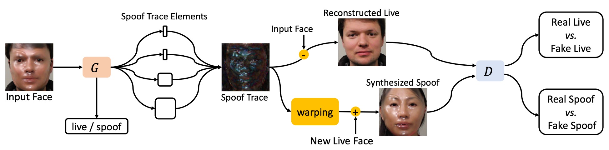
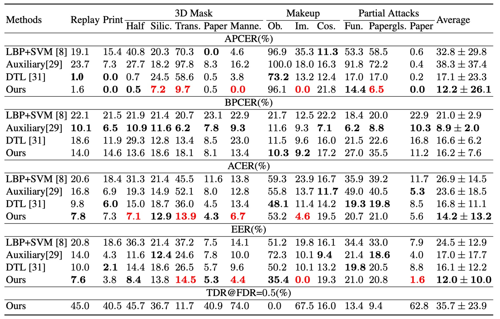
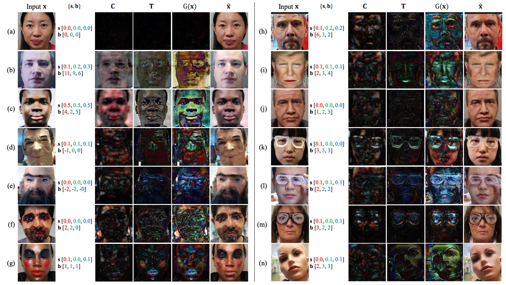
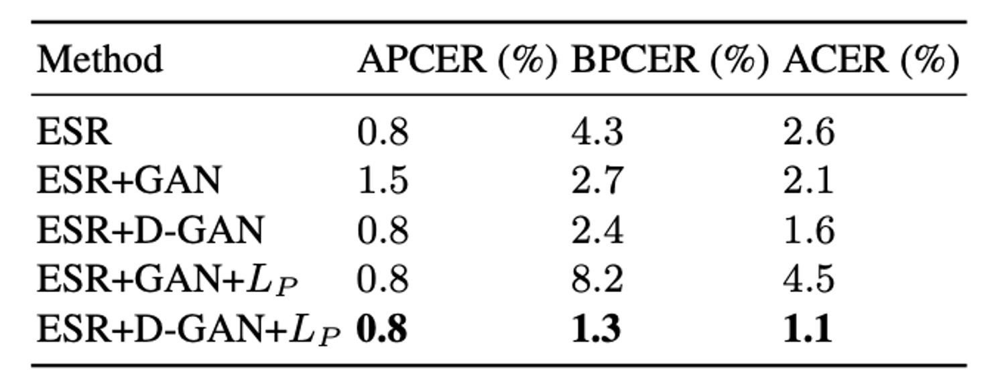

## 偽装の痕跡

[**On Disentangling Spoof Trace for Generic Face Anti-Spoofing**](https://arxiv.org/abs/2007.09273)

---

モデルは「これは偽物だ」と教えてくれる。しかし、その理由は語らない。

そんなモデルをあなたは信じられるだろうか？

## 問題の定義

顔認証におけるアンチスプーフィング（FAS）は、生体認証システムの最初の防衛線として、研究はすでに十年以上の歴史がある。

初期の視線検出や頭部の微細な動きから、近年では CNN 判別器や深層監督学習に至るまで、モデルの精度は向上しているように見える。しかし、未知の攻撃手法や異なる機器・照明条件に対しては、依然として汎化性能が壁となっている。

問題はモデルが「真偽を見分けることを学べるか」ではなく、モデルが実際に何を学んでいるのか、である。

モデルは本当に偽装そのものの痕跡を見ているのだろうか？

それとも、解像度や色の飽和度、トリミング位置の違いなど、特定のデータセット上の差異だけを学んでいるのか？

特に、写真、スクリーン、マスク、化粧など異なる攻撃手法を一括りにし、汎用的な FAS システムを構築しようとするとき、私たちは初めて気づく。

**既存の多くの手法は「ブラックボックス判定」に依存している：ある顔画像を入力し、スコアを出力するだけだ。**

しかし、そのスコアが何に基づいて決定されたかは説明できない。実際、モデルに「これは偽物だ」と判断した理由を語らせることすらできていない。

だからこそ、人々はモデルの判断を信用できず、訓練戦略の進展も難しい。

モデルの判断根拠を観察できなければ、その境界を理解することはできないのだ。

この論文の著者はこう言う。

モデルに真偽を問うのをやめ、私たちが問うべきは、

> **この顔のどこに、これが生きていないと感じさせる何かがあるのか？**

## 問題の解決

<figure style={{"width": "90%"}}>

</figure>

従来の二分類タスクでは、モデルは「真偽のスコア」を出すだけで、**「何を見てそう判断したのか？」**を説明できない。

著者はここで別のアプローチ、**Spoof Trace Disentanglement Network（STDN）**を提案した。

上図の設計概念に示されるように、モデルは入力された顔画像から潜在する「偽装の痕跡（spoof trace）」を抽出し、以下の処理を行う：

- **再構築（Reconstructed Live）**：偽装顔を活体の状態に復元する。
- **合成（Synthesized Spoof）**：抽出した偽装痕跡を別の活体顔に移植し、新たな攻撃サンプルを生成する。

この方法により、spoof trace は隠れた判断根拠ではなく、明示的かつ操作可能な可視変数となり、システム全体の中核的な信号となる。

:::tip
本論文の方法論は複数のモジュールとステップを含み、やや複雑であるため、読者は著者の設計思想を理解するために根気が必要となるだろう。
:::

### Spoof Trace

入力画像を $I \in \mathbb{R}^{N \times N \times 3}$ とし、これはスプーフ領域 $\mathcal{S}$ またはライブ領域 $\mathcal{L}$ に属するとする。

目標はライブ領域に属する画像 $\hat{I} \in \mathcal{L}$ を見つけ、元画像との差異を最小化すること：

$$
\hat{I} = \arg\min_{\hat{I} \in \mathcal{L}} \| I - \hat{I} \|_F
$$

ここで $\|\cdot\|_F$ はフロベニウスノルムを示す。

定義に基づき、スプーフトレースは以下のように表される：

$$
G(I) = I - \hat{I}
$$

$I$ がライブ領域の画像であれば理論上 $G(I) = 0$ となり、スプーフ画像の場合は視覚的な偽造残差を表す。

スプーフトレースの説明力と合成能力を高めるために、著者は過去研究を踏まえ以下の 4 つの階層的成分に分解した：

- **Color range bias**：$s \in \mathbb{R}^{1 \times 1 \times 3}$、画素強度範囲の調整；
- **Color balance bias**：$b \in \mathbb{R}^{1 \times 1 \times 3}$、チャンネル間の色バランス調整；
- **Smooth content pattern**：$C \in \mathbb{R}^{L \times L \times 3}$、滑らかなテクスチャ（アップサンプリングを要する）；
- **High-frequency texture**：$T \in \mathbb{R}^{N \times N \times 3}$、モアレ模様やエッジ輪郭などの高周波ディテール。

これらの要素が合わさってスプーフトレースの構築関数となる：

$$
G(I) = sI + b + \lfloor C \rceil_N + T
$$

ここで $\lfloor C \rceil_N$ は $C$ を $I$ と同じ空間解像度にアップサンプリングする操作を示す。

この定義により、STDN はスプーフトレースを隠れた分類根拠から顕在化した媒介変数へと変換し、モデルは真偽の区別だけでなく「どこが偽物か」を示せるようになる。

このモデリングは以下の 3 つのコアな利点をもたらす：

1. **可視化と説明性**：モデル出力としてスプーフトレースを提示し、判断の視覚的根拠とすることが可能；
2. **合成とデータ拡張能力**：トレースを他画像に適用し、新たなスプーフサンプルを生成可能；
3. **汎化性能の向上**：照明や背景などスプーフ本質でない要素への依存を抑制。

:::tip
最も重要な目的は、スプーフトレースを GAN モデルに入力して合成し、モデルにスプーフ画像の生成を学習させることである。
:::

### 解離生成

<figure style={{"width": "90%"}}>

</figure>

STDN における spoof trace の解離は、Encoder–Decoder 構造に基づく生成器によって実現されており、その役割は入力画像から spoof trace の構成要素 $\{s, b, C, T\}$ を層別に抽出することである。

上図のアーキテクチャに示されるように、入力画像 $I \in \mathbb{R}^{256 \times 256 \times 3}$ はまず Encoder に入り、一連の畳み込み層を通じて段階的にダウンサンプリングされ、最終的に潜在表現テンソル

$$
F \in \mathbb{R}^{32 \times 32 \times 96}
$$

を生成する。この潜在特徴が Decoder による spoof trace 解離の基盤となる。

Decoder は転置畳み込み層（Transpose Conv）を用いて段階的にアップサンプリングを行い、異なる空間解像度に応じて spoof trace の各要素を生成する：

- **色補正項 $s, b$**：全画像に対する単一値テンソルであり、解像度が最も低いため Decoder の初期段階で解離される。
- **低周波テクスチャ $C$**：中間層で生成され、解像度は約 $64 \times 64$、アップサンプリング後に合成に用いられる。
- **高周波テクスチャ $T$**：Decoder の最終層から出力され、入力画像と同解像度の $256 \times 256$ を維持する。

この coarse-to-fine の解離設計は、各層の spoof 特徴の空間的性質と組み合わさり、spoof trace 表現の明確な意味的分離と生成対応性を実現する。

さらに、高周波ディテールの保持と合成品質の向上のため、生成器は U-Net 構造を参考に Encoder と Decoder の対応層間にスキップコネクションを設け、局所テクスチャ情報の直接伝達を可能にしている。

### 双域入力戦略

一般的な GAN がソースドメイン（例：spoof）に対してのみ生成訓練を行うのに対し、本手法の生成器は 2 つのドメインからの入力画像を受け入れる：

- spoof ドメイン：正のトレースを提供；
- live ドメイン：対照として、spoof trace がほぼゼロとなることを期待。

この設計により、モデルは生体と偽装画像の双方から判別力が高く意味の明確な spoof trace を学習し、trace 自体が分類バイアスを起こすことを回避できる。

しかし、spoof trace の強度やパターンは攻撃タイプ（写真、マスク、化粧）によって異なるため、trace だけでは完全な分類根拠とはならない。そこで著者は追加で**Early Spoof Regressor（ESR）**を導入し、潜在空間における判別能力を強化している。

### Early Spoof Regressor

ESR モジュールは以下の通り設計される：

- 入力はボトルネック特徴テンソル $F \in \mathbb{R}^{32 \times 32 \times 96}$；
- 出力は空間解像度 $16 \times 16$ の spoof 確率マップ $M \in \mathbb{R}^{16 \times 16}$、値域は $\{0,1\}$ でライブと spoof を表す。

この spoof マップは入力画像に対する「空間的判定」とみなされ、生成器は trace の生成に加え初期分類も行う。

この設計に伴い、生成器は「重い Encoder、軽い Decoder」構成を採用。Encoder には多チャネルかつ深いブロックを用い、ESR が十分な spoof 特徴を活用できるようにしている。

### テスト段階の分類戦略

テスト時の最終 spoof スコアは以下 2 つの指標の組み合わせ：

1. ESR 出力マップ $M$ の L1 強度平均；
2. Spoof trace $G(I)$ の全体 L1 強度平均。

計算式は：

$$
\text{score} = \frac{1}{2K^2} \| M \|_1 + \frac{\alpha_0}{2N^2} \| G(I) \|_1
$$

ここで

- $K = 16$：ESR 出力マップの空間解像度；
- $N = 256$：入力画像の空間解像度；
- $\alpha_0$：spoof trace の最終スコアへの寄与度を調整するハイパーパラメータ。

この 2 指標融合の分類戦略は spoof の強弱に対する感度を高め、trace と ESR の判定差に緩衝領域を提供する。

### 再構築と合成

spoof trace の解離後、STDN は分類判定だけでなく trace を構造的信号として以下 2 つのタスクに活用する：

1. **再構築（Reconstruction）**：spoof 画像から trace を差し引き、対応するライブ画像を復元。
2. **合成（Synthesis）**：ある spoof 画像から抽出した trace を任意のライブ顔に移植し、合成 spoof サンプルを生成。

ライブ画像再構築タスクでは、

入力画像 $I \in \mathcal{S} \cup \mathcal{L}$、対応する spoof trace $G(I)$ を用い、

$$
\hat{I} = I - G(I)
$$

と計算され、$\hat{I}$ は入力画像のライブドメイン $\mathcal{L}$ における最小変化対応版とみなされる。

この操作は trace 解離品質の視覚評価基準となるだけでなく、訓練過程で trace の可逆性と意味的一致性強化にも寄与する。

合成タスクでは、

- $I_i$：ソース spoof 画像（trace は $G(I_i)$）、
- $I_j$：ターゲットライブ画像

を用い、

$$
\tilde{I}_{i \rightarrow j} = I_j + G(I_i)
$$

と合成 spoof 画像を生成する。

:::tip
この点は近年の LLM 領域で流行の Model Merging 技術を想起させる。これは異なる機能を原モデル上の「ベクトル」パラメータとして捉え、加減算によってモデル拡張を行う手法である。

同様に、特定攻撃タイプの spoof trace もベクトルパラメータとみなし加減算すれば、これらの組み合わせで異なる攻撃タイプに対応可能となるかもしれない。
:::

しかし課題として、spoof trace は元顔の幾何構造に強く関連する局所テクスチャ（マスクの縁やシワなど）を含む場合があり、異なる顔型・姿勢画像に直接適用すると明確な幾何歪みや視覚的不整合を招く。

この問題を解決するため、著者は微分可能なオンライン 3D 変形層（Online 3D Warping Layer）を提案し、spoof trace の位置合わせ調整を行う。

### 幾何歪み層

<figure style={{"width": "90%"}}>

</figure>

本モジュールは 3D Morphable Model（3DMM）に基づき顔の対応点セットを構築し、Delaunay 三角分割を用いて疎な点群から密な場への幾何変換を行う。

**手順は以下の通り：**

1. **spoof trace の抽出**
   ソース画像 $I_i$ に対する spoof trace を

   $$
   G_i = G(I_i)[p_0]
   $$

   と定義する。ここで $p_0 = \{(x,y) \mid 0 \leq x,y < 256\} \in \mathbb{R}^{256 \times 256 \times 2}$ は元のピクセル座標グリッド。

2. **dense offset の計算**
   spoof trace をターゲット画像 $I_j$ に適用するには、密なオフセット場 $\Delta p_{i \rightarrow j} \in \mathbb{R}^{256 \times 256 \times 2}$ を計算し、

   $$
   G_{i \rightarrow j} = G(I_i)[p_0 + \Delta p_{i \rightarrow j}]
   $$

   と warp 後の trace を得る。非整数値のため、位置対応は双線形補間で実装。

3. **疎点から密点への変換**
   各顔の 3DMM をフィッティングし、代表的な頂点 $Q=140$ 個の 2D 射影位置

   $$
   s = \{(x_0,y_0), (x_1,y_1), \ldots, (x_Q,y_Q)\} \in \mathbb{R}^{Q \times 2}
   $$

   を抽出。ソースとターゲット間の疎なオフセットは

   $$
   \Delta s_{i \rightarrow j} = s_j - s_i
   $$

4. **三角形補間による dense offset 生成**
   Delaunay 三角分割補間を適用し、

   $$
   \Delta p_{i \rightarrow j} = \mathrm{Tri}(p_0, s_i, \Delta s_{i \rightarrow j})
   $$

   と計算。各ピクセルが属する三角形を基に、3 頂点のオフセットを線形重み付けで合成。高効率かつ微分可能な dense offset 構築を実現し、全体のワーピング処理はエンドツーエンド学習に組み込める。

### Spoof Trace の操作

spoof trace の構造的性質により操作が可能。

著者は訓練データ強化として、合成 spoof 画像作成時に

**spoof trace の要素 $s, b, C, T$ のいずれかをランダムに除去し、偽装強度の弱い harder example を模擬し学習に利用する**手法を提案。

この戦略は、実運用で微弱または隠蔽された spoof 特徴にモデルが依存して過学習するのを防ぎ、多様かつ包括的な spoof 表現の学習を促す。

従来の明度やぼかし、人工的歪み操作よりも、意味的に明確な spoof 要素を直接操作でき、よりリアルで構造的な合成データ生成が可能。実験でも伝統的データ増強を上回る効果を示している。

### マルチスケール識別器

STDN 設計では、生成器は spoof trace の妥当性だけでなく、それに基づく合成サンプル（再構築ライブや合成 spoof）が視覚的・意味的に信頼できることを保証する必要がある。

そのため、著者は

**異なる解像度の PatchGAN 判別器を 3 つ配置し、低～高周波からグローバル構造まで多尺度情報をカバーする設計を採用。**

具体的には：

- $D_1$：元解像度（$256 \times 256$）画像を入力し、高周波テクスチャ（spoof trace の $T$）を重視。
- $D_2$：1/2 にダウンサンプリングした画像（$128 \times 128$）を用い、中周波構造・滑らかなテクスチャ（$C$）を評価。
- $D_3$：1/4 にダウンサンプリング（$64 \times 64$）画像で低周波・全体的な偏移や色バランス（$s, b$）を検証。

この階層的識別により、spoof trace の 4 成分の整合性と相互検証を強化し、「解離 → 再構築 → 合成 → 識別」の一連のループを完成させる。

判別器の詳細は PatchGAN 構造で、純粋な畳み込み層 FCN からなる。FAS や画像生成での優れた性能が実証済み。

各判別器は以下を含む：

- 7 層の畳み込み層（活性化関数と BatchNorm 含む）
- 3 回のダウンサンプリング（stride=2）
- 出力は 2 チャネルのレスポンスマップ（サイズ $H' \times W' \times 2$）、各位置が 1 パッチの判別結果を示す。2 チャネルは各ドメインの信頼度スコア。

2 チャネル出力の意味は：

- チャンネル 1：再構築ライブ画像と実ライブ画像の比較による真実性評価。
- チャンネル 2：合成 spoof 画像と実 spoof 画像の比較による攻撃性評価。

双方向監督により生成器は「復元」と「偽装」の両面で品質を向上させ、spoof trace の意味的一貫性と再構築の可逆性を強化する。

### 損失関数

STDN の訓練はマルチタスク学習の枠組みを採用しており、**5 種類の損失関数**と**3 つの訓練ステップ**で構成されている。これにより、生成器とマルチスケール判別器が協調して spoof trace の分離、可逆性、および可視性を学習する。

- **1. ESR 損失（Early Spoof Regressor Loss）**

  ESR が出力する spoof map $M \in \mathbb{R}^{16 \times 16}$ に対して、生体画像には全て 0、spoof 画像（合成された spoof を含む）には全て 1 を出力することを期待する。これを L1 損失で次のように定義する：

  $$
  \mathcal{L}_{\text{ESR}} = \frac{1}{K^2} \left( \mathbb{E}_{i \sim \mathcal{L}} \left[ \| M_i \|_1 \right] + \mathbb{E}_{i \sim \mathcal{S} \cup \hat{\mathcal{S}}} \left[ \| M_i - \mathbf{1} \|_1 \right] \right)
  $$

  ここで：

  - $K = 16$：spoof map の解像度
  - $\hat{\mathcal{S}}$：生成器が合成した spoof ドメイン
  - $\| \cdot \|_1$：L1 ベクトルノルム

---

- **2. 生成器の敵対損失（Generator Adversarial Loss）**

  生成器が再構成した生体画像と合成した spoof 画像をそれぞれ所属する実ドメインに近づけるため、Least Squares GAN（LSGAN）損失を用いる。3 つのスケールの判別器 $D_n$ に対し損失は以下の通り：

  $$
  \mathcal{L}_G = \sum_{n=1}^3 \left\{
  \mathbb{E}_{i \sim \mathcal{S}} \left[ \left( D_n^{(1)}(I_i - G_i) - 1 \right)^2 \right] +
  \mathbb{E}_{i \sim \mathcal{L}, j \sim \mathcal{S}} \left[ \left( D_n^{(2)}(I_i + G_{j \rightarrow i}) - 1 \right)^2 \right]
  \right\}
  $$

  ここで：

  - $D_n^{(1)}$：第 $n$ 判別器の生体ドメイン出力チャネル
  - $D_n^{(2)}$：第 $n$ 判別器の spoof ドメイン出力チャネル

---

- **3. 判別器の敵対損失（Discriminator Adversarial Loss）**

  判別器は実サンプルと生成器が合成したサンプルを正しく識別する必要があり、損失関数は以下のように定義される：

  $$
  \mathcal{L}_D = \sum_{n=1}^3 \Big\{
  \mathbb{E}_{i \sim \mathcal{L}} \left[ \left( D_n^{(1)}(I_i) - 1 \right)^2 \right] +
  $$

  $$
  \mathbb{E}_{i \sim \mathcal{S}} \left[ \left( D_n^{(2)}(I_i) - 1 \right)^2 \right] +
  \mathbb{E}_{i \sim \mathcal{S}} \left[ \left( D_n^{(1)}(I_i - G_i) \right)^2 \right] +
  $$

  $$
  \mathbb{E}_{i \sim \mathcal{L}, j \sim \mathcal{S}} \left[ \left( D_n^{(2)}(I_i + G_{j \rightarrow i}) \right)^2 \right]
  \Big\}
  $$

- **4. Trace 正則化損失（Trace Regularizer Loss）**

  spoof trace の意味的な一貫性を強化し、生体サンプルに残る不要な trace を抑制するために L2 正則化項を追加する：

  $$
  \mathcal{L}_R = \beta \cdot \mathbb{E}_{i \sim \mathcal{L}} \left[ \| G(I_i) \|_2^2 \right] + \mathbb{E}_{i \sim \mathcal{S}} \left[ \| G(I_i) \|_2^2 \right]
  $$

  ここで $\beta > 1$ は生体 trace 圧縮の強さを制御する。

- **5. ピクセルレベル監督損失（Supervised Pixel Loss）**

  合成 spoof は明確な spoof trace の参照があるため、生成器に対してピクセルレベルでの監督学習が可能である。誤った勾配伝播を防ぐため、stop-gradient 操作を用いて参照 trace を固定する：

  $$
  \mathcal{L}_P = \mathbb{E}_{i \sim \mathcal{L}, j \sim \mathcal{S}} \left[ \left\| G\left( I_i + \text{stop\_grad}(G_{j \rightarrow i}) \right) - \text{stop\_grad}(G_{j \rightarrow i}) \right\|_1 \right]
  $$

  この損失により、生成器は spoof trace の構造を正しく抽出することを学習し、入力内容の単純な再現を防ぐ。

### 訓練プロセス設計

<figure style={{"width": "90%"}}>

</figure>

上図のように、STDN の訓練はマルチタスク協調最適化機構を採用し、各ミニバッチは生成器、判別器、trace 解離監督の 3 つの補完的なサブステップからなる。各段階の詳細は以下の通り：

- **1. 生成器ステップ（Generator Step）**

  このステップでは、生体顔 $I_{\text{live}}$ と spoof 攻撃サンプル $I_{\text{spoof}}$ を生成器に入力し、spoof trace の解離を行う。モデルは以下の 2 つの生成タスクを実施する：

  - **生体画像の再構成**：$G(I_{\text{spoof}})$ を用いて対応する生体バージョン $\hat{I}_{\text{live}} = I_{\text{spoof}} - G(I_{\text{spoof}})$ を復元する；
  - **spoof 画像の合成**：spoof trace $G(I_{\text{spoof}})$ を別の生体顔 $I_{\text{live}}$ に適用し、合成 spoof 画像 $\hat{I}_{\text{spoof}} = I_{\text{live}} + G_{i \rightarrow j}$ を生成する。

  生成器の更新目標は以下 3 つの損失から構成される：

  - $\mathcal{L}_G$：敵対損失（合成サンプルを実ドメインに近づける）；
  - $\mathcal{L}_{\text{ESR}}$：初期 spoof 判別監督；
  - $\mathcal{L}_R$：trace 強度正則化。

  合計損失は次のように表される：

  $$
  \mathcal{L}_{\text{G-step}} = \alpha_1 \mathcal{L}_G + \alpha_2 \mathcal{L}_{\text{ESR}} + \alpha_3 \mathcal{L}_R
  $$

- **2. 判別器ステップ（Discriminator Step）**

  同一バッチのサンプルを使い、以下の画像を 3 つのマルチスケール判別器 $D_n$ に入力し、実ドメインと合成ドメインの識別を学習する：

  - 元の生体サンプル $I_{\text{live}}$
  - 元の spoof サンプル $I_{\text{spoof}}$
  - 再構成サンプル $\hat{I}_{\text{live}}$
  - 合成 spoof $\hat{I}_{\text{spoof}}$

  各スケールの判別器は以下を学習する：

  - 第一チャネル $D_n^{(1)}$ で実生体 vs. 再構成生体を識別；
  - 第二チャネル $D_n^{(2)}$ で実 spoof vs. 合成 spoof を識別。

  判別器の敵対損失は以下の通り：

  $$
  \mathcal{L}_{\text{D-step}} = \mathcal{L}_D
  $$

  敵対訓練は不安定になりやすいため、このステップの学習率は他のステップの半分に設定し、勾配強度と訓練の安定性をバランスさせる。

- **3. 追加監督ステップ（Extra Supervision Step）**

  この段階では spoof trace の「合成監督性」を導入し、生成器が spoof trace 構造を正確に識別し解離する能力を強化する。

  入力データは以下：

  - 元の生体顔 $I_{\text{live}}$
  - 対応する spoof trace 合成画像 $\hat{I}_{\text{spoof}}$
  - 参照 spoof trace の「ground-truth trace」$G_{j \rightarrow i}$

  このステップでは生成器のパラメータのみ更新し、目標損失は以下：

  - $\mathcal{L}_{\text{ESR}}$：spoof 判別精度のさらなる監督；
  - $\mathcal{L}_P$：ピクセルレベル spoof trace 解離誤差（stop-gradient により参照 trace を固定）。

  総合損失は次の通り：

  $$
  \mathcal{L}_{\text{sup-step}} = \alpha_4 \mathcal{L}_{\text{ESR}} + \alpha_5 \mathcal{L}_P
  $$

  :::tip
  Batch Normalization の統計的安定性を保つため、このステップでは $I_{\text{live}}$ と $\hat{I}_{\text{spoof}}$ をペアで入力し、バッチデータ分布の均衡を維持する。
  :::

## 討論

方法論が大部分を占めたため、最後にいくつかの重要なポイントに絞って議論する。

### 既知攻撃の検出

表 (a)(b)(c) より、STDN は OULU-NPU と SiW の複数プロトコルにおいて、既存手法と同等以上の検出性能を示している。特に OULU-NPU のプロトコル 1、4 では、ACER がそれぞれ 30%、32%の大幅な改善（従来最高手法比）を記録した。

多様な印刷およびリプレイ攻撃に対し、STDN の生体再構成と spoof trace 抽出機構は安定した判定根拠を提供している。SiW-M の 13 種類の攻撃タイプに対しても、多くの spoof 種類で先行研究を上回る性能を示し、多様な攻撃環境での汎用性を実証した。

### 未知攻撃（Unknown Spoof）の検出

上表の通り、STDN は未知攻撃に対し、全体の EER と ACER の両指標で既存最高モデルを超える性能を達成している。

透明マスクや紙マスクなど一部攻撃は依然として課題を残すが、少量サンプル取得後は、明示的に分離された spoof trace を用い重要領域を迅速に特定し、識別精度を向上させられる。

これは trace モデリングにより、未知攻撃環境でも一定の適応性を維持できることを示す。

### Spoof Trace の可視化と評価

1. **Spoof Medium Classification**

   

   分離した spoof trace のみを用いて異なる偽造素材を検出する実験で、元画像を直接用いるより高精度を示した。これは trace に偽造素材を区別可能な重要なテクスチャや色彩情報が含まれていることを意味する。

2. **視覚的分解**

   

   図より、異なる攻撃種別（印刷、メイク、3D マスク、紙製攻撃等）が $s, b, C, T$ の 4 要素層で異なる歪みやテクスチャ残留を示すことが分かる。モデルはこれら残留を他の顔に移植し、説得力ある合成偽顔を生成できるため、3D 幾何歪み層の有効性と trace の移植可能性を裏付ける。

### モジュール貢献とアブレーション実験

<figure style={{"width": "70%"}}>

</figure>

実験結果によると、マルチスケール判別器と ESR（Early Spoof Regressor）の統合設計により、再構成品質と敵対的性能が同時に最適化され、ACER は 2.6% から 1.6% に改善した。

さらに ESR + D-GAN + $L_P$ の最終構成では、合成サンプルが強力な監督信号を提供し、不適切な spoof 生成による誤差蓄積を防ぎ、最終的に ACER は安定して 1.1% を達成した。

## 結論

真偽を問う前に、まず問うべきは：**偽りはどこから漏れているのか？**

STDN は生体検出を「ブラックボックス分類」から「痕跡の解離—再構成—合成」のサイクルへと書き換え、初期の _de-spoofing_ と顕著性マップ手法を拡張し、可視化証拠をモデルの一次生成物とした。

これは単なるネットワーク構造の調整ではなく、思考の転換である。偽りを理解した上で真偽を語るのである。

もちろん、STDN にも弱点はある：

- 偽痕跡は画像領域に限定され、高精度な 3D マスクやクロスモーダル攻撃には未検証。
- 合成サンプルの幾何および質感の一貫性は生成器性能と監督信号に依存。
- trace の他感覚的次元（音響、深度、血流信号）への拡張機構は未開拓。

それでも、STDN は辿るべき明確な未来の道を示す：

> **偽りが明示的に示されれば合成でき、合成できれば対抗の可能性がある。**

真偽の判定が難しい技術の波中で、価値あるものは単なる判定ではなく、偽りの文法と構造を解きほぐすことだ。

この道は分類より困難だが、多攻撃「痕跡解離」フレームワークの先駆けとして、STDN は後続研究の土台を築いた。
