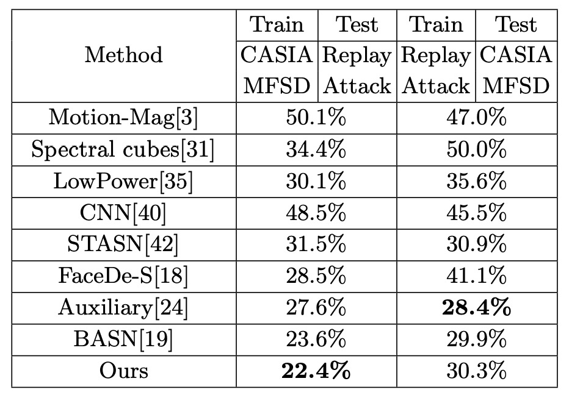

## 魂の結び目を解く

[**Face Anti-Spoofing via Disentangled Representation Learning**](https://arxiv.org/abs/2008.08250)

---

この論文はわかりやすい名前をつけていません。

そこで、論文タイトルそのままに**Disentangle-FAS**と呼びます。

## 問題の定義

顔偽装検知（Face Anti-Spoofing、FAS）は常に認識システムの最前線にいます。

スマホのロック解除、入退室管理、金融の本人認証、そしてさまざまな eKYC シーンまで、このタスクに頼り、「この顔は本物か、それとも何らかの偽装か？」を見分けています。

アルゴリズムの進歩、データセットの拡充、モデル精度の向上とともに、問題は解決されつつあると思われました。

しかし実際は、より多様な偽装パターンでモデルに多くの答えを記憶させているだけです。

よく見ると、この分野は以下の古い問題に引っかかっています：

- **真偽分類がブラックボックスで、判断根拠が説明できない；**
- **汎化能力が非常に低く、データセットを変えるとすぐに性能が落ちる；**
- **データは常に不足し、攻撃パターンはより早く変化する。**

さらに深刻なのは、「活体の特徴」が何なのか明確に説明できないことです。

これはモデル構造の問題でも、データ量の問題でもありません。

> **顔に対する我々の理解自体があまりにも混沌としているのです。**

顔には「身元、姿勢、照明、背景、機器特性、肌の質感」など多くの意味情報が同時に存在し、モデルにはそれらが混ざった文法の中で、一度に「真か偽か」の判定をさせているのです。

このやり方は初めから間違っているのではないでしょうか？我々には可能でしょうか：

> **モデルに雑音や意味情報の絡まりから、「活体」に属する独立した手がかりだけをまず抽出させることが？**

## 解決策

<figure style={{"width": "90%"}}>

</figure>

「顔の意味が混ざる」問題を解くために、著者は**二つの主要コンポーネント**を提案しました：

1. 活体と内容を分離する **Disentanglement Process（分離処理）**。
2. LBP、Depth、識別器などの複数の補助的監督（Auxiliary Supervision）で分離を強化。

### Disentanglement Process

まず、著者は「交換・再構成」の流れを設計し、顔画像の潜在特徴ベクトルを２つに分けます：

- **活体特徴 (Liveness Features, $L$)** ：「この顔が本物か偽物か」を表す重要因子
- **内容特徴 (Content Features, $C$)** ：身元、背景、照明、姿勢など真偽に無関係な属性

上図のフローに従うと：

1. 一枚の本物の顔 $A$ と一枚の偽物の顔 $B$ をエンコーダー (Encoder) に入力し、それぞれ $(L_A, C_A)$ と $(L_B, C_B)$ に分解。
2. 次に、**活体特徴を交換**し、新たな画像 $\hat{A}_b$ と $\hat{B}_a$ を合成。具体的には：

   - 偽の活体特徴と本物の内容特徴で再構成した画像 $\hat{A}_b$
   - 本物の活体特徴と偽の内容特徴で再構成した画像 $\hat{B}_a$

こうすることで、本物の $L$ と偽の $C$ を組み合わせた「見た目は A に似ているが偽物の属性を持つ」新画像を生成でき、逆もまた同様です。

この交換は、モデルに「真偽」と「顔の内容」を完全に切り離すことを強制しなければ、合成画像が歪んだり誤った痕跡が現れることになるための仕組みです。

### 再構成損失

**Encoder + Decoder** の組み合わせは、「入力画像を正しく再構成する」ことを保証する必要があります。

著者は以下２種類の再構成損失で制約をかけています：

1. **画像再構成損失 (Image Reconstruction Loss)**

   $\mathrm{D(E}(x_i))$ が元画像 $x_i$ に近くなることを期待し、以下のように定義：

   $$
   \mathcal{L}_{rec}^{x_i} \;=\; \mathbb{E}_{x_i \sim p(x_i)} \Bigl\|\,D\bigl(E(x_i)\bigr) \;-\; x_i\Bigr\|_1
   $$

   ここで、$E$ はエンコーダー、$D$ はデコーダー、$p(x_i)$ は実際の画像分布。

2. **潜在変数再構成損失 (Latent Reconstruction Loss)**

   交換後の潜在変数 $\hat{z}_i$ をデコード・再エンコードして元の $z_i$ を再構成することを期待し、

   $$
   \mathcal{L}_{rec}^{z_i} \;=\; \mathbb{E}_{z_i \sim q(z_i)} \Bigl\|\,
   E\bigl(D(z_i)\bigr) \;-\; z_i
   \Bigr\|_1
   $$

こうすることで、活体特徴と内容特徴が**確実に分離**され、学習過程で再び混ざってしまうことを防ぎます。

### Auxiliary Supervision

活体特徴をより「明確に」捉えるために、著者は分離プロセスに以下 3 つの補助的な監督を加えています：

1. **LBP マップ（Local Binary Pattern）**
2. **深度マップ（Depth Map）**
3. **識別的監督（Discriminative Supervision）**（識別器）

以下に、著者が用いた各補助ネットワークの構造詳細を示します：

<figure style={{"width": "80%"}}>

</figure>

各ネットワークは複数の畳み込み層、バッチ正規化（BN）、ReLU で構成されており、異なるレベルの特徴を用いて補正や識別を行います。

- **LBP マップ**

  偽顔はしばしばテクスチャに破綻（印刷の点、スクリーンのモアレなど）が現れることを踏まえ、活体特徴に対し LBP 監督を課しています：

  - **本物の顔**：LBP ネットワークの出力が実際の LBP マップに近づくことを期待
  - **偽顔**：全てゼロのマップに対応させ、「テクスチャは無効または偽のテクスチャであるべき」という意味を持たせる

  数式は以下の通りです：

  $$
  \mathcal{L}_{lbp}
  =\;
  \mathbb{E}_{l_i \sim P(l_i),\, x_i \sim P(x_i)} \Bigl\|\,
  LBP(l_i) - lbp_{x_i}
  \Bigr\|_1
  \;+\;
  \mathbb{E}_{l_i \sim N(l_i),\, x_i \sim N(x_i)} \Bigl\|\,
  LBP(l_i) - 0
  \Bigr\|_1
  $$

  ここで、$P(\cdot)$ は本物の顔の分布、$N(\cdot)$ は偽顔の分布、$lbp_{x_i}$ は本物顔の LBP 画像、$0$ は全てゼロのマップを示します。

- **深度マップ**

  本物の顔の 3D 形状情報に対し、深度監督を導入しています。

  - 本物の顔は 3D アライメント手法で生成された疑似深度マップに対応
  - 偽顔は全ゼロマップに対応

  数式は以下：

  $$
  \mathcal{L}_{dep}
  =\;
  \mathbb{E}_{x_i \sim N(x_i)} \Bigl\|\,
  Dep(x_i) - 0
  \Bigr\|_1
  \;+\;
  \mathbb{E}_{x_i \sim P(x_i)} \Bigl\|\,
  Dep(x_i) - dep_{x_i}
  \Bigr\|_1
  $$

  ここで、$Dep(\cdot)$ は深度ネットワークの出力です。

  本物・偽顔双方の再構成は対応する深度マップまたはゼロマップを出力すべきで、活体情報が$L$枝に確実に集約されるように強化しています。

- **識別的監督**

  最後に、著者は多スケールの識別器（Discriminator）を設計し、生成された画像が本物にどれほど近いかを判定します。

  これは GAN の敵対的学習に類似しており、

  - **識別器損失 ($L_{Dis}^D$)**：生成器を固定して識別器を更新し、本物(R)と生成(G)を判別する能力を学習
  - **生成器損失 ($L_{Gen}^D$)**：識別器を固定し、Disentanglement ネットワーク全体を逆伝播で更新し、よりリアルな画像生成を促す

  数式は以下：

  $$
  \mathcal{L}_{Gen}^{D}
  = - \;
  \mathbb{E}_{I \in G}\,\log\bigl(D_1(I)\bigr)
  \;-\;
  \mathbb{E}_{I \in G}\,\log\bigl(D_2(I)\bigr).
  $$

  ここで、$D_1$ と $D_2$ は異なるスケールの識別器で、局所的なディテールと全体構造の両方を捉えます。

### 最終目的関数

著者はこれらすべての損失を加算し、最終的な訓練目的関数を形成しました：

$$
\mathcal{L}
=\;
\mathcal{L}_{Gen}^{D}
\;+\;
\lambda_1\,\mathcal{L}_{rec}^{x_i}
\;+\;
\lambda_2\,\mathcal{L}_{rec}^{z_i}
\;+\;
\lambda_3\,\mathcal{L}_{dep}
\;+\;
\lambda_4\,\mathcal{L}_{lbp}
$$

ここで、$\lambda_1, \lambda_2, \lambda_3, \lambda_4$ は各損失の重要度を調整するハイパーパラメータです。

訓練は典型的な**敵対的反復**で行われ、まず識別器を最適化し、その後ネットワーク全体を更新します。

このやり取りにより、最終的に以下を達成します：

- 交換後の画像が**十分リアル**であること
- 活体特徴と内容特徴が**確実に分離**され再構成可能であること
- **LBP と深度監督が活体特徴に真偽情報を強固に付与**していること

この結果、推論時は「$L$ のベクトル」だけを見れば真偽判定ができ、データドメインの変動や装置差異、照明変化などのノイズから解放されます。

## 議論

論文著者は 4 つの代表的な FAS データセットで評価を行いました：

- Oulu-NPU、SiW（**インテラルテスト**用）
- CASIA-MFSD と Replay-Attack（**クロステスト**用）

評価指標には一般的な **APCER / BPCER / ACER / HTER** を用いています。

### インテラルテスト：Oulu-NPU

<figure style={{"width": "60%"}}>

</figure>

表の通り、**Oulu-NPU**上での Disentangle-FAS は 4 つのテストプロトコル中、p2 を除き従来手法を上回りました。特に p4（全ての変動を含む）で最高の結果を示し、**強力な汎化能力**を証明しています。単一データベース環境においても、**活体特徴の分離により**真偽の手がかりをより正確に捉えています。

:::tip
SiW の実験結果については、読者の皆様は論文本文をご参照ください。
:::

### クロステスト：CASIA-MFSD ↔ Replay-Attack

<figure style={{"width": "60%"}}>

</figure>

CASIA で学習し Replay でテスト、またはその逆という FAS における典型的な「クロスドメイン」実験です。

表の通り、Disentangle-FAS は(CASIA → Replay)にて HTER を 1.2%改善し、従来を上回りました。また(Replay → CASIA)でも同等の性能を維持しています。

これは「活体特徴」を独立させることで、照明・被写体 ID・撮影機器などの条件が変わってもモデルが真偽を正確に区別でき、性能が大きく崩壊しないことを示します。

### 翻訳結果と可視化

<figure style={{"width": "80%"}}>

</figure>

論文では「真顔 ↔ 偽顔」「真顔 ↔ 真顔」「偽顔 ↔ 偽顔」の 3 つの翻訳結果を示しています。

- 「真顔 ↔ 偽顔」の交換時には対応する深度マップも同期的に変わり、活体特徴に真偽の核心情報が含まれることを示します。
- 一方「真顔 ↔ 真顔」や「偽顔 ↔ 偽顔」の内部交換では深度はほとんど変化しません。
- これは ID・照明・背景が content features に留まり、活体特徴は持ち去られないことを示しています。

さらに印刷テクスチャやスクリーンモアレなど局所的な偽装パターンにも注目し、交換後の画像が様々な「偽」の細かなテクスチャを反映していることを示しています：

<figure style={{"width": "80%"}}>

</figure>

つまり、活体サブスペースは真偽を区別するだけでなく、異なる偽装種別の特徴を内包しています。

### アブレーションスタディ

多くの検証も行われ、主要な結論は：

- **分離の有無**：t-SNE 可視化で活体・内容が分離されている場合は真偽がより明確にクラスタ化される。分離しないと特徴分布が混ざる。

  

  <figure style={{"width": "80%"}}>
  
  </figure>
  

- **LBP + Depth 監督**：低レベルテクスチャ（LBP）と高レベルジオメトリ（Depth）を組み合わせた監督が単独や単純な二値分類より効果的。

- **スコア融合**：LBP と Depth のスコアを平均融合することで最良の性能を達成し、互いに補完し合う。

  

  <figure style={{"width": "50%"}}>
  
  </figure>
  

本手法は多様な実験で優れた汎化性能と可視化・解釈可能性を示しました。活体特徴空間は単に真偽判定をするだけでなく、偽装形態に応じたテクスチャも反映し、モデルが学んだ攻撃の違いを「見る」ことができます。

## 結論

Disentangle-FAS はより複雑な分類器を作ることを試みませんでした。代わりにタスクを再定義し、「顔」の潜在的文法を二つの世界に切り分けました：

**一つは活体、もう一つは内容。**

この枠組みでは真偽は単なる出力スコアでなく、交換・生成・可視化可能な意味空間になります。

モデルは単に識別するだけでなく、分解し、説明まで学びました：**どこが偽物で、なぜ偽物か。**

活体特徴の視覚的翻訳、深度・テクスチャの補助監督、そしてクロスドメイン評価結果から、この論文は教えます：

> **「真偽を判定する」よりも、「偽装がどこから来るかを見抜く」ことをモデルに学ばせよ。**

未来の混沌と変化に満ちた攻撃世界で、この道は容易ではありませんが、防御を文法的・推論可能・説明可能なものにできる可能性を与えます。

これはブラックボックスから脱却し、より意識的な視覚認識への一歩です。
