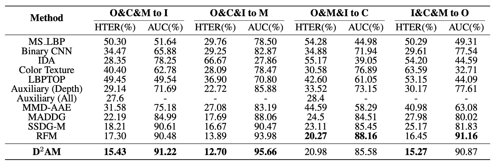

## 千界鍛魂術

[**Generalizable Representation Learning for Mixture Domain Face Anti-Spoofing**](https://arxiv.org/abs/2105.02453)

---

先ほど、SSDG について見てきました。それは単一ドメイン一般化技術を使用して FAS の問題に取り組んでいました。

今回は、かつて一世を風靡した Meta Learning がこの戦場に加わりました。

## 問題の定義

DG 技術が FAS で初期の成功を収めたことを受けて、この論文の著者は次のような疑問を提起しました：

> **「ドメイン」とは一体何か？**

それは異なる撮影シーンですか？それとも異なる攻撃方法ですか？それとも、データセットの名前をドメインラベルとして使うのでしょうか？

これらの方法は過去の DG タスクで実際に採用されてきましたが、問題はこれらの「ドメイン」の分類方法が実際には科学的ではないということです。

著者は三つの問題点を指摘しています：

1. **ドメインラベルの手動マークは時間がかかる。**

   > もし一枚の画像に対して「これは黄みがかった照明の領域に属する」と言わせる必要があれば、標準化の問題が発生します。

2. **ドメイン自体が複雑な要因で構成されており、単一の次元で分類することはできない。**

   > あるドメインはカメラが悪いため、別のものはモデルが不自然なため、これら二枚の画像が同じカテゴリに属するとは誰が言えるでしょうか？

3. **データセットを基に分類しても、それはサブ最適に過ぎない。**

   > A データセットと B データセットの間には実際に多くの重複があり、モデルは既にそれらを混同しているかもしれません。

---

この困難に直面し、著者は以下の解決策を提案しています：

> **モデルに自分でクラスタリングを学ばせることはできないか？**

モデルに擬似ドメインを生成させ、それらの擬似ドメインから一般化能力を訓練させるのです。

これが D²AM の核心的な考え方です。

## 問題解決

<figure style={{"width": "90%"}}>

</figure>

著者が提供するモデルアーキテクチャの図は非常に複雑に見え、少し怖くなるかもしれません。

したがって、論文内の他のセクションを参照して、このアーキテクチャを理解する必要があります。以下のアルゴリズムのロジックを参照してください：

<figure style={{"width": "50%"}}>

</figure>

### 第一段階：クラスタリング

この段階のタスクは非常に明確です：

> **「これらの画像がどのドメインに属するのかは分からないが、問題ない、私は自分でクラスタリングする。」**

方法は概ね次の通りです：

1. **CNN のスタイル統計量（平均、標準偏差）を抽出**
2. **DRLM モジュールを通して、特徴を$F^+$と$F^-$に分割**
3. **タスク情報を排除し、エントロピー損失で$F^-$を清掃**
4. **$F^-$に対して K-means クラスタリングを行い、擬似ドメインラベルを生成**

では、詳細な手順を見ていきましょう：

- **Step 1：前処理**

  アルゴリズム 1：行 2–5、初めに著者は ResNet-50（ImageNet で事前学習）を使用してすべての画像を一度通します。

  これは分類のためではなく、スタイル特徴を抽出するためです。こうして生成されたベクトルは次のようになります：

  $$
  df(x) = \{\mu(F_1), \sigma(F_1), ..., \mu(F_M), \sigma(F_M)\}
  $$

  事前学習モデルから得られる特徴は、**ドメイン分類における過度なタスク情報の汚染を回避**することができます。その後、最初のラウンドが終了すると、D²AM 独自の特徴抽出器$E$を使用してこの処理を行います（アルゴリズム 1：行 6–7）。

  ***

- **Step 2：DRLM でドメイン特徴を強化**

  DRLM は SE ブロックのような小さなモジュールで、CNN 特徴にチャネルアテンションを追加します：

  $$
  a = \sigma(W_2 \cdot ReLU(W_1 \cdot pool(F)))
  $$

  その後、元の特徴を 2 つに分けます：

  - $F^+ = a \cdot F$：タスクに関連する特徴。
  - $F^- = (1 - a) \cdot F$：我々が関心を持っているドメイン特徴。

  ***

- **Step 3：余分なタスク情報を排除し、エントロピー損失でクリーニング**

  著者は「反エントロピー」正則化を加えました：

  $$
  \mathcal{L}_p = P(F^-) \log P(F^-)
  $$

  ここで、$P(F^-) = \text{Sigmoid}(W_p \cdot pool(F^-))$

  その目的は、モデルが正/負のサンプルのタスクラベルに対して**極度の混乱を引き起こす**（つまり、タスク関連の情報を学習させないように強制し）、ドメイン特徴に集中させることです。

  ***

- **Step 4：K-means クラスタリングを行い、擬似ドメインラベルを生成（アルゴリズム 1：行 8）**

  すべてのサンプルの$F^-$特徴を抽出し、K-means クラスタリングを行います。**正のサンプルと負のサンプルは分けてクラスタリング**します（タスク情報が残っているため）。次に、それらをペアリングして結合し、正と負のサンプルが同じ擬似ドメインを構成するようにします。

  クラスタが不安定にならないように、著者は**Kuhn-Munkres（ハンガリアンアルゴリズム）**を使用してエポックごとにペアリングを整列させました。

### 第二段階：Meta-learning

擬似ドメインが分かれたら、次にモデルは「模擬実戦トレーニング」に進みます。

この段階の精神は Meta-learning と同じです：

> **「私はデータを自分で異なる小さな国（ドメイン）に分け、そして『A 国で学んだことは B 国で使えるか？』を繰り返しシミュレートする。」**

つまり、各エポックは次のようになります：

- **Meta-train：K−1 個のドメインでトレーニング**
- **Meta-test：残りのドメインで一般化の検証**
- **Meta-optimize：トレーニングとテストの結果に基づいてパラメータを更新**

---

この部分は、毎回のトレーニングで 2 つの作業を行うことに似ています：Meta-train と Meta-test。

- **Step 5：ランダムに K−1 個の擬似ドメインを選んで Meta-train（アルゴリズム 1：行 10–12）**

  各ドメイン$D_i$からバッチ$B_i$を抽出し、次の 3 つの作業を行います：

  1. 分類損失：

  $$
  \mathcal{L}_{Cls}(B_i) = \sum_{(x,y) \in B_i} y \log M(E(x)) + (1 - y) \log(1 - M(E(x)))
  $$

  2. MMD 正則化：

  $$
  \mathcal{L}_{MMD}(B_i) = \left\| \frac{1}{b} \sum \phi(h^s) - \frac{1}{b} \sum \phi(h^t) \right\|^2_{\mathcal{H}}
  $$

  その目的は：外れ値が全体の分布を歪めないようにし、特徴空間を安定させることです。

  3. 深度回帰（PRNet を使用して真の顔の深度を推定）：

  $$
  \mathcal{L}_{Dep}(B_i) = \| D(E(x)) - I \|^2
  $$

  ***

- **Step 6：Meta-test を実行（アルゴリズム 1：行 15–16）**

  ここでは、未見のテストドメインとして 1 つのドメインを選び、バッチ$B_t$を取り、各インナーアップデートされたメタラーナーに対して次を実行させます：

  $$
  \mathcal{L}_{Cls}(B_t, \theta_{M_i}'), \quad \mathcal{L}_{MMD}(B_t, \theta_{M_i}')
  $$

  最後に、深度損失も追加されます。

  ***

- **Step 7：Meta-Optimization（アルゴリズム 1：行 17）**

  ここでは、3 つのモジュールパラメータが一緒に更新され、それぞれが Eq.11–13 に対応します：

  - **$θ_E$**：特徴抽出器
  - **$θ_M$**：メタラーナー
  - **$θ_D$**：深度推定器

  毎回の更新では、DRLM からのエントロピー損失も含まれます：

  $$
  \sum_{j=1}^3 \lambda_p \mathcal{L}_p^j
  $$

  これにより、ネットワーク全体が「一般化のためのドメイン分類能力」を学ぶことに集中します。

---

最後に、このパイプラインがどのように動作するかをまとめてみましょう：

1. CNN 特徴 → DRLM：$F^+$ と $F^-$ を分ける
2. $F^-$ を抽出 → クラスタリングして擬似ドメインラベルを生成
3. これらのラベルを Meta-learning のトレーニング基盤として使用
4. トレーニング後、再度特徴を抽出 → 再クラスタリング → 再トレーニング
5. このプロセスを繰り返し、モデルが一般化されるまで行う

全体的に見ると、これは「自分で分類し、自分でトレーニングし、より厳しく自分に対してトレーニングを行う」自己規律型アルゴリズムです。

## 討論

### 他の方法との比較

<figure style={{"width": "90%"}}>

</figure>

これまで説明したように、D²AM は本当に他の方法と比べて優れているのでしょうか？

著者は上の表で一連の実験結果を示し、4 つの主要な FAS データセットを交互に「未知のテストセット」として使用し、モデルが 3 つのソースドメインだけで汎化能力を試すという設定を行いました。

実験結果は、すべての実験設定において D²AM がほぼ全ての方法を超えていることを示しています。従来の FAS モデルだけでなく、ドメインラベルを使用した DG 方法も負けています。

特に OULU、CASIA、REPLAYATTACK では、D²AM は AUC が高く、HTER が低いだけでなく、安定性も良好でした。そして最も重要なのは、すべてこれを達成するために人工的なドメインラベルを必要とせず、完全に自己生成したドメインで実現したことです。

### t-SNE 可視化

著者は t-SNE を使って理解を助けるためにいくつかの図を描いています：

- **$F^+$（タスク特徴）**：分布はやや散らばっており、分類は明確。
- **$F^-$（ドメイン特徴）**：クラスタリングは明確で、分類には干渉しない。

つまり、$F^-$は「どの世界から来たか」を特定するのを助け、$F^+$は「本物か偽物か」を担当しているということです。

これは DRLM モジュールとエントロピー損失の設計目的が無駄ではなかったことを確認するものです。

### クラスタリング可視化

<figure style={{"width": "70%"}}>

</figure>

著者はさらに擬似ドメインの挙動を観察し、いくつかの興味深い発見をしました：

- エポックが進むにつれて、D²AM がクラスタリングに使う基準が変わります：

  - Epoch 3 では光の条件に焦点を当てる
  - Epoch 6 では背景に焦点を当てる

- 各クラスタリング結果は変化し（NMI は約 0.6 ～ 0.8）、これは第一ラウンドでの分類法を単に覚えるのではなく、モデルの適応に応じてドメインの分類を調整していることを示しています。

最も驚くべきことは、**D²AM が生成した擬似ドメインは、実際のドメインとの重なりが 60%〜70%程度であることです**。

以前はドメインラベルが標準的な出発点だと思われていましたが、実際にはそれが最適な分け方ではないかもしれません。

## 結論

D²AM は DG の分野において、全く異なるアプローチを提案しています。

> **「ドメインのラベルを手伝わなくても、自分でクラスタリングし、自分でトレーニングし、自分で強くなる。」**

その核心的な考え方は非常にシンプルです：**「汎化能力は、各ドメインが何であるかを事前に知っていることに基づくべきではない。」**

DRLM モジュール、エントロピー損失、MMD 正則化を活用することで、D²AM はドメインラベルなしで「より挑戦的な」ドメイン分類方法を学び、さらに安定した FAS モデルを訓練することができます。

これは単なる FAS の事例に留まらず、より汎用的な機械学習の考え方です。

データソースが混在しており、ドメインが不明なシナリオにおいて、D²AM は非常に有益な出発点を示しています。
