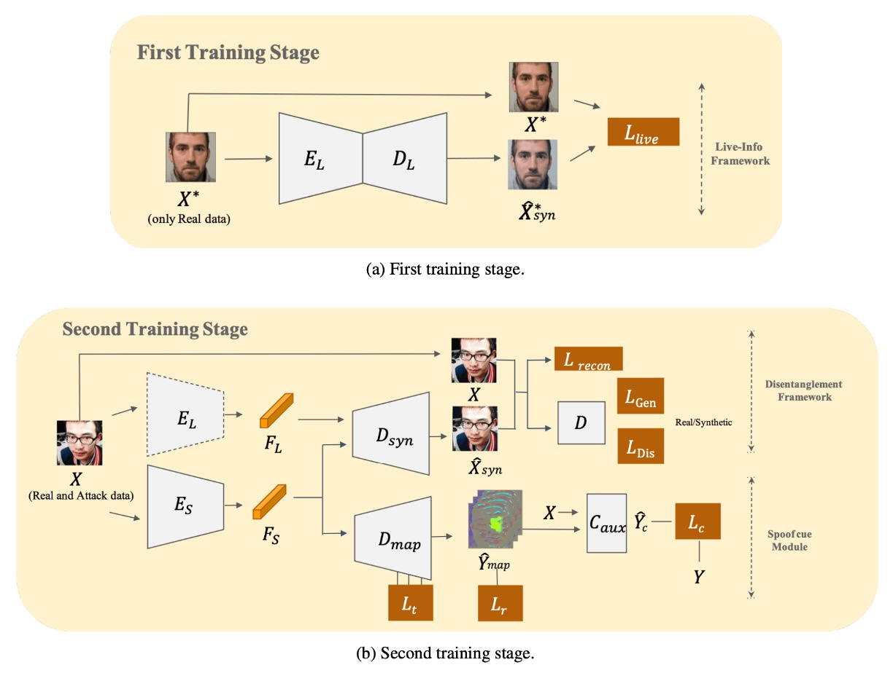
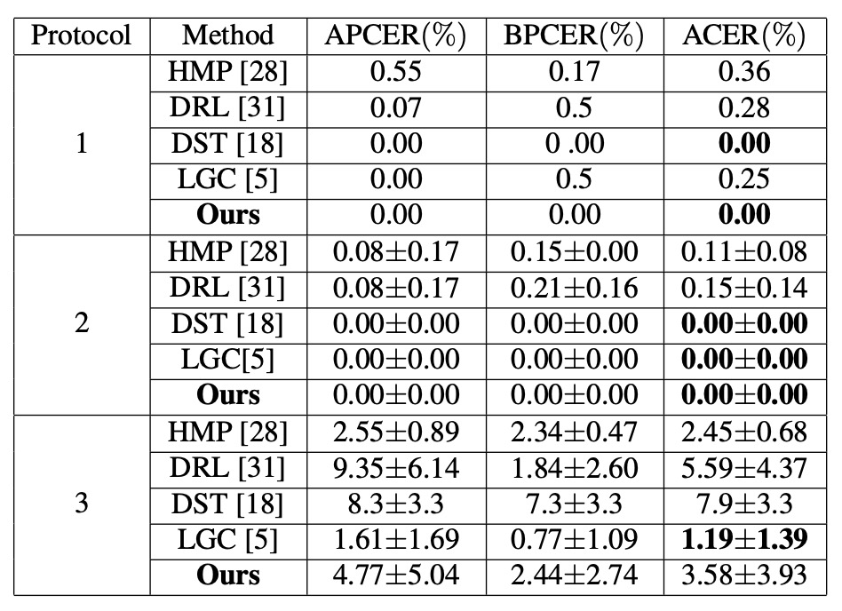

## 複解耦の術

[**Disentangled Representation with Dual-stage Feature Learning for Face Anti-spoofing**](https://arxiv.org/abs/2110.09157)

---

表現の解離（disentanglement）はますます多くの人が注目するテーマとなっている。

解離そのものについては、偽装特徴を抽出することだとおおむね共通理解がある。

では、偽装特徴以外の部分はどうなるのか？

## 問題の定義

多くの顔活体認識システムでは、モデルは一枚の画像から一つの事を判別しようとする：それは本物の顔か、偽装か？

しかしこの判断は、実は絡み合った信号の中から推測されているのだ：**顔の素材感、光の残留や圧縮痕跡。**

言い換えれば、ほぼ全ての混入し得る情報が混ざり合っている。

これがまさに表現解離が扱うべき核心である：

> **単に正誤を答えるだけでなく、結局あなたは何を見ているのかを明らかにすること。**

ここ数年で多くの研究が様々な解離戦略を提案してきており、私たちもいくつかの関連論文を検討してきた。

ある研究は潜在空間を活体特徴と内容特徴の二つに分ける手法を採用し、別の研究は spoof trace を多尺度残差として分解し偽装の残影を模擬しようとしている。しかしほぼ全ての手法は一つの仮定に基づいている：

> **単一ステージで切り分けと再構築を同時に完遂できる。**

だがこの仮定は合理的ではない。なぜなら物事は常にそんなに明瞭ではないからだ：

- 解離と分類目的が深く重なり合うと、モデルはしばしばショートカットを選ぶ傾向がある。
- 敵対的訓練は潜在空間の分離を促すものの、勾配の振動を引き起こし学習の不安定さを極端に増す。
- 補助監督（深度マップや rPPG など）を導入しても、全ての攻撃形式に有効とは限らない。

つまり、モデルに偽装を判別させているが、偽装の「文法」を安定して学習する方法は与えていない。

モデルは真偽を見分けることはできるが、その間の文法的差異を理解できず、大多数のサンプルは正しく分類しても、次の攻撃がどう変形するかは理解できない。**表現解離の理念は、実践面で構造の不安定さ、信号依存、未知の攻撃への予測不能性に悩まされている。**

そして本論文の著者はこう考えた：

> **段階的に学習したほうがいいのではないか。**

ゆっくり進めば、速くなる。

## 解決策

<figure style={{"width": "90%"}}>

</figure>

未知の攻撃に対して、単純な二値分類は到底不十分だ。

著者はここで「先に分け、後で解く」という方法を選び、モデルにまず「活体の原型」が持つ共通特徴を抽出させ、次に段階的に偽装に特有な特徴を剥ぎ取らせる。

上図のように、モデル全体は二段階で訓練を完遂する必要があり、詳細な処理方法を見てみよう。

### まず活体情報を学習

著者は最初に **Live-info Network** を構築し、自己符号化を行う。

- 入力：真顔サンプルのみ $x^\* \in P_X$
- エンコーダ $E_L$：活体特徴 $F_L$ を抽出
- デコーダ $D_L$：入力の再構築を試み、$\hat{x}^\*_{syn}$ を出力

モデルが「真顔」の本質を捉えるよう、以下の損失関数で再構築誤差を最小化する：

$$
\mathcal{L}_{Live}
= \mathbb{E}_{x^* \sim P_X} \Big[\big\|x^* - \hat{x}^*_{syn}\big\|_2^2\Big]
$$

この段階でモデルは攻撃顔には一切触れず、$E_L$ が抽出する活体特徴は相対的に「純粋」であり、全ての真顔間の共通変異を記述しつつ偽装信号の干渉を受けない。

このエンコーダは後続の段階で**固定重み**の活体情報抽出器として組み込まれる。

### 二重並列再構成

第 2 段階では偽装サンプルも訓練に加え、「二重並列再構成」する解離モジュールを形成する：

1. **Live-encoder $E_L$**

   - 第 1 段階で学習済みの重みをそのまま読み込み、活体特徴 $F_L$ を抽出。
   - 重みは凍結し更新せず、活体特徴表現が「汚染」されないようにする。

2. **Spoof-encoder $E_S$**

   - 偽装特徴 $F_S$ を専任で抽出。これは真顔には存在せず、目立たない攻撃信号を表す。

3. **再構成器 $D$**

   - $F_L$ と $F_S$ を融合した表現から入力画像の再構成 $\hat{x}_{syn}$ を試みる。

$D$ が完全な再構成を学習できるよう、同時に $E_S$ が「偽装差異」に注力するよう、**再構成損失**と**敵対的損失**を導入：

- **再構成損失**

  $$
  \mathcal{L}_{recon}
  = \mathbb{E}_{x \sim P_X} \Big[\big\|x - \hat{x}_{syn}\big\|_2^2\Big]
  $$

- **生成器損失**

  $$
  \mathcal{L}_{Gen}
  = \mathbb{E}_{x \sim P_X} \Big[(D(\hat{x}_{syn}) - 1)^2\Big]
  $$

- **識別器損失**

  $$
  \mathcal{L}_{Dis}
  = \mathbb{E}_{x \sim P_X} \Big[(D(x) - 1)^2 + (D(\hat{x}_{syn}))^2\Big]
  $$

ここで $D(\cdot)$ は識別器であり、$\hat{x}_{syn}$ が本物かどうかを区別する。

この敵対的枠組みにより、モデルは**真顔特徴 $F_L$** と **偽装特徴 $F_S$** の適切な分離・融合を同時に学習できる。

### 偽装の手がかり抽出

著者は $F_S$ に対し、U-Net 風のデコーダ $D_{map}$ を組み合わせ、偽装特徴を **spoof map** へ変換しようと試みる。

このマップで「真顔 vs 偽装」を最大限区別させるため、3 種の損失を導入：

1. **トリプレット損失**

   - 真顔同士の距離を縮め、真顔と偽装の距離を離すことを目的とする。
   - 真顔をアンカー $f_i^a$ とし、正例（真顔）$f_i^p$、負例（偽装）$f_i^n$ を選出し、通常トリプレット損失 $\mathcal{L}_t^{normal}$ と困難トリプレット損失 $\mathcal{L}_t^{hard}$ を算出し合算し $\mathcal{L}_t$ とする。

2. **真顔残影損失（$\mathcal{L}_r$）の最小化**

   - 理論的に真顔には明確な偽装パターンがないため、spoof map はゼロに近づける。

   $$
   \mathcal{L}_r
   = \mathbb{E}_{x \sim P_{live}} \Big[\big\|\hat{y}_{map}\big\|_1\Big]
   $$

3. **分類器補助損失（$\mathcal{L}_c$）**

   - spoof map $\hat{y}*{map}$ と元画像 $x$ を組み合わせ、補助分類器 $C*{aux}$ に入力し、真偽判定を行う。

   $$
   \mathcal{L}_c
   = \mathbb{E}_{(x,y)} \Big[ -y \cdot \log(\hat{y}_c) + (1-y)\cdot \log(1-\hat{y}_c) \Big]
   $$

最終的に損失関数は以下のように総合される：

$$
\mathcal{L}
= \lambda_1 \mathcal{L}_{recon}
+ \lambda_2 \mathcal{L}_{Gen}
+ \lambda_3 \mathcal{L}_t
+ \lambda_4 \mathcal{L}_r
+ \lambda_5 \mathcal{L}_c
$$

論文では重みを $\lambda_1=4,\ \lambda_2=1,\ \lambda_3=3,\ \lambda_4=5,\ \lambda_5=5$ と設定している。

### 訓練と推論

1. **訓練手順**

   - 第 1 段階：真顔サンプルのみで $E_L$ と $D_L$ を学習。
   - 第 2 段階：$E_L$ を凍結し、$E_S$、$D$、$D_{map}$ と共に訓練。敵対的損失、再構成損失、多重監督を通じ偽装特徴の解離を細かく行う。

2. **推論時**

   - $E_S$ と $D_{map}$ のみを用いて spoof map を生成し、その平均値を spoof スコアとして用いる。
   - スコアが閾値を超えれば攻撃と判定する。

GeForce GTX 1080 環境で、著者は **121.48±1.4 FPS** の推論速度を報告している。

以上の設計により、外部の補助信号（深度マップや rPPG など）に頼らず、訓練を「活体学習」と「偽装分離」の二段階に分けることで、未知の攻撃環境下でも安定した判定能力を維持できている。

## 討論

### 複数タイプの実験結果

上表は SiW-M における実験結果で、様々な攻撃タイプを含んでいる。本論文の手法は平均 ACER と EER において同種の研究より明確に優れており、平均値が低いだけでなく、**標準偏差も小さい**という安定性を示している。

次に、**MSU-MFSD, CASIA-MFSD, Replay-Attack** といった複数データセットでのテスト結果であるが、本手法も **98.0% AUC** の全体最高成績を達成しており、特に従来誤判しやすかった「印刷攻撃」シナリオでの改善が顕著である。

これらの結果から、二段階の解離戦略が、様々な材料や撮影手法による偽装顔に対しても均衡の取れた識別性能を維持できていることが読み取れる。

### 同タイプの実験結果

<figure style={{"width": "70%"}}>

</figure>

顔の表情、照明、撮影機器の変化に対しては、著者は SiW の 3 つのサブプロトコルで評価を行った：

1. **Protocol 1, 2**：DualStage は優れた性能を示し、一般的な姿勢や照明の差異をうまく処理できている。
2. **Protocol 3**：訓練データに攻撃タイプが 1 種類しか含まれていないため、モデルは多様な偽装特徴を十分に探索できず、ACER はやや高めの 3.58%となったが、依然として競合範囲内に収まっている。

これらの実験結果は、既知の攻撃手法による環境下で、DualStage が安定した「活体表現」を学習でき、基本的な環境変動にも対応できることを示している。

### Disentangled Features の可視化

解離された特徴を示すために、著者は「顔交換実験」を実施した。

真顔の live feature と偽装顔の spoof feature を入れ替え、対応する偽装顔や真顔を生成する方法である。

結果は、特徴を交換した後、真顔パターンに「縞模様やグレースケールの不均衡」などの偽装テクスチャが浮かび上がり、元の偽装顔は部分的に自然な肌色に戻ることを示した。

このことから、**spoof feature** が本フレームワークで「偽装の残影」を担い、攻撃パターン生成の鍵となっていることが分かる。

### Spoof Map の解析

最後に、解離された spoof feature が具体的にどのようなものかを調べるため、著者は U-Net 風のデコーダ $D_{map}$ を用いて検出マップを生成した。

真顔サンプルでは spoof map はほぼゼロに近く、偽装サンプルでは局所的に明瞭なハイライト領域（例えば画面端や口鼻周辺）を示す。

これは DualStage が「抽象的特徴」の解離に留まらず、画像空間においても可視化可能な手がかりを提供し、観察や分析を助けることを意味している。

### 消失実験

DualStage は多くの損失関数を用いているため、著者はそれらの影響を調べる消失実験を行い、他手法との比較も示した。

第 1 段階を除外した場合（w/o first stage）や敵対的損失を外した場合、いくつかの攻撃に対して性能が著しく低下した。さらにトリプレット損失を除くと、spoof map が真偽の区別能力を大幅に失う。

これらから、**「まず真顔のみ学習 + 敵対生成 + 複数トリプレット損失」** の組み合わせが本モデル設計の重要ポイントであることが明らかとなる。

## 結論

DualStage は派手ではない設計を提案した：

**表現の解離を 2 段階に分け、まず活体特徴を安定して学び、そこから偽装信号を剥ぎ取る。**

追加の深度情報や rPPG に依存せず、画像だけで判別力のある spoof map を生成し、複数公開データセットで強力なクロスタイプ汎化能力を示す。

これにより、多モーダル支援がなくとも十分に成果を出せる地位を確立した。

もちろん、弱点もある。攻撃パターンが極端に少ない状況（例：SiW Protocol 3）では性能が伸び悩む。今後は判別を邪魔する「無関係」とみなされる特徴断片の処理も検討すべきだろう。

だが方法論としては、まだ色褪せないメッセージを残している：

> **解離は一度にやろうと急ぐ必要はない。**

正しい順序さえ与えれば、モデルは徐々に学習できる。
