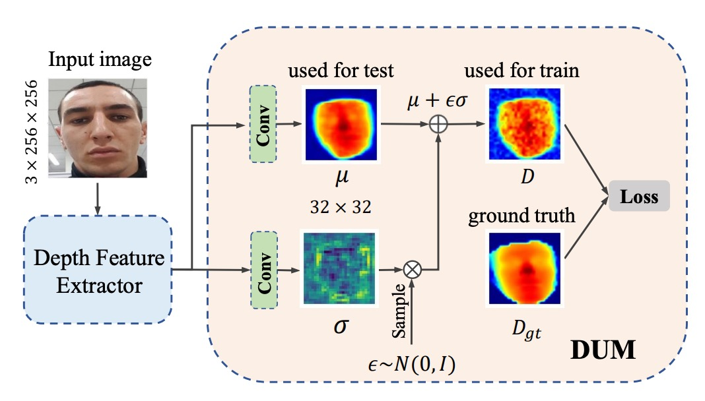
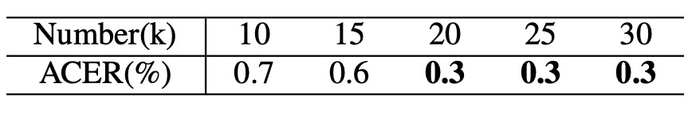
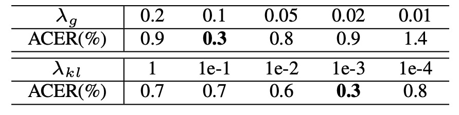

## 偽りの再構成の前夜

[**Dual Spoof Disentanglement Generation for Face Anti-spoofing with Depth Uncertainty Learning**](https://arxiv.org/abs/2112.00568)

---

見たことのない偽りは、見破ることが難しいのではなく、そもそもその姿を見たことがないのだ。

## 問題の定義

顔認識システムが現実世界での認証責任を担い始めるとき、認識精度はもはやリーダーボード上の単なる数値ではなく、一つのリスクの境界線となる。FAS（Face Anti-Spoofing）はその境界の門番として、近年では二値分類タスクから多様な変異に対応する一般化のゲームへと進化している。

しかし、多くの既存手法は未だに一つの根本的に解決されていない前提に囚われている：

> **データの限界により、モデルは未知の個体や攻撃パターンに対して総じて識別能力を欠いている。**

我々が使用する訓練データセットは、大抵閉鎖環境、固定された機器、少数の個体、そして限られた攻撃形式から来ている。

例えば、OULU-NPU には被験者が 20 名しかおらず、SiW では 90 名である。このようなデータ分布は、実際の運用環境において多様な機器、多国籍の人種、複雑な照明や攻撃技術に対応するためのモデルの支えにはならない。結果としてモデルは訓練サンプルに過剰適合し、未見の条件下での攻撃を効果的に識別できない。

「もっと多くのデータを集める」ことが当然の解決策となる。

しかし、画像変換技術を検討したとしても、多くは「顔を変えても個体は変わらない」ため、生成されるサンプルは元の個体に縛られてしまう。また、外部データを用いた合成プロセスは、著作権、アノテーション、人力、遅延などの実務的コストの問題に直面する。

さらに、生成モデルを導入してデータのボトルネックを解決しようとすると、別の問題も避けられない：

> **合成サンプルの品質のばらつきが、教師信号の安定性を妨げる可能性がある。**

特に深度画像を教師信号とするフレームワークにおいては、ぼやけや歪んだ画像が直接深度予測の精度に影響し、全体の学習過程の収束性や解釈性を失わせる。

これは二重の問題構造である：

- 新しい個体かつ既存の攻撃パターンを同時に持つ合成画像をどのように生成し、データの内的多様性を高めるか？
- それらの生成サンプルが深度教師付き訓練を逆に汚染しないようにし、主ネットワークに誤った視覚的手がかりを学ばせないようにするには？

本論文の著者はこの問題に真正面から取り組み、合成データの生成ロジックと訓練フローの双方から対応策を提示している。

次章へ進む前に、まずは原点に立ち返ろう：

> **本当に役に立つ FAS システムは、どれほど多くの偽りを見た上で「これは本物ではない」と言える能力を持つのか？**

## 問題解決

「データ不足」と「画像歪み」という二大問題を解決するために、著者は「生成的データ拡張」と「不確実性学習」という二つのアプローチを統合し、以下の二つのモジュール構造を構築した：

- **DSDG**（Dual Spoof Disentanglement Generation）
- **DUL**（Depth Uncertainty Learning）

### Dual Spoof Disentanglement Generation (DSDG)

<figure style={{"width": "90%"}}>

</figure>

DSDG の核心目標は、**外部データを使わずに、多様かつ対となるライブ／攻撃サンプルを自動生成すること**である。

著者は二つのエンコーダを持つ VAE（Variational Autoencoder）を用い、顔画像を「アイデンティティ特徴」と「攻撃特徴」に分解し、それらを再びデコーダに組み合わせて新たな対の画像を生成する。

この方法は、アイデンティティと攻撃パターンの両方のカバレッジを同時に拡張できる。

図 (a) に示すように、全体構造は二つのエンコーダと一つのデコーダ、加えて spoof 特徴とアイデンティティ特徴を分離するモジュールから成る。具体的な手順は以下の通り：

1. **二つのエンコーダによる特徴抽出**

   - **$\text{Enc}_s$** は攻撃画像 $I_{\text{spoof}}$ を入力し、「攻撃パターン特徴」$z^t_s$ と「アイデンティティ特徴」$z^i_s$ を分離。
   - **$\text{Enc}_l$** はライブ画像 $I_{\text{live}}$ をアイデンティティ特徴 $z^i_l$ にマッピング。

   それぞれのエンコーダは reparameterization trick により、平均 $\mu$ と標準偏差 $\sigma$ を出力し、

   $$
   z = \mu + \epsilon \sigma,\quad \epsilon \sim \mathcal{N}(0, I)
   $$

   として特徴ベクトルを得る。

   :::tip
   **Reparameterization trick** は [**Auto-Encoding Variational Bayes**](https://arxiv.org/abs/1312.6114) という論文に由来する。

   簡単に言うと、変分オートエンコーダ（VAE）における確率的なサンプリングを勾配の逆伝播に組み込めるようにする手法である。このトリックにより、VAE の訓練がより安定し、収束速度が向上する。
   :::

2. **再構成と分離**

   デコーダ $\text{Dec}$ は三つの特徴 $(z^t_s, z^i_s, z^i_l)$ を受け取り、再構成された $\hat{I}*{\text{spoof}}$ と $\hat{I}*{\text{live}}$ を生成する。

   攻撃特徴 $z^t_s$ に対しては spoof 分類器を付加し、交差エントロピー損失 ($L_{\text{cls}}$) で正しい攻撃タイプを予測するように訓練する。

   また、攻撃特徴 $(z^t_s)$ とアイデンティティ特徴 $(z^i_s)$ 間に「角度直交」制約 ($L_{\text{ort}}$) を設け、両者がベクトル空間で直交することを促し混同を防ぐ。

3. **分布整合と再構成損失**

   VAE の特徴分布学習のため、KL ダイバージェンス ($L_{\text{kl}}$) を用いて潜在分布を標準正規分布に近づける。

   また、L1 または L2 距離による再構成損失 ($L_{\text{rec}}$) により、再構成画像が入力画像に近づくようにする。

   さらに、MMD ($L_{\text{mmd}}$) とアイデンティティ特徴整合損失 ($L_{\text{pair}}$) によって、ライブと攻撃状態の同一個体のアイデンティティ空間分布を揃える。

全損失は以下の総目的関数にまとめられる：

$$
\mathcal{L} \;=\; L_{\text{kl}} + L_{\text{rec}} \;+\; \lambda_1 L_{\text{mmd}} \;+\; \lambda_2 L_{\text{pair}} \;+\; \lambda_3 L_{\text{ort}} \;+\; \lambda_4 L_{\text{cls}}
$$

VAE 風の学習が完了すると、図 (b) のように標準正規分布から多くの $(\hat{z}^t_s, \hat{z}^i_s)$ をサンプリングし、$\hat{z}^i_s$ をコピーして $\hat{z}^i_l$ とし（対のアイデンティティを保証）、デコーダに入力して新規合成サンプル $(\hat{I}*{\text{spoof}}, \hat{I}*{\text{live}})$ を生成する。

この過程は追加ラベルや外部データ不要で、新規アイデンティティかつ元の攻撃パターンを持つ大量の合成画像を「無から生み出す」ことが可能だ。

ただし VAE の性質上、合成画像はぼやけや局所的歪みが生じやすく、これらノイズを訓練に直接使うと深度教師信号が混乱する恐れがある。

そこで、次に説明する **Depth Uncertainty Learning** を導入する。

### Depth Uncertainty Learning (DUL)

<figure style={{"width": "70%"}}>

</figure>

合成サンプルの多様性に加え、深度教師信号への悪影響を抑えるため、不確実性表現機構を導入し、生成ノイズの影響をガウス分布で定量化し抑制する。

従来の深度教師は各画像ピクセルに固定の深度値を与えるが、合成画像の局所歪みは深度ラベルの信頼性を下げる。

著者は深度値をガウス分布 $\mathcal{N}(\mu_{i,j},,\sigma_{i,j}^2)$ とみなし、$\mu_{i,j}$ は学習可能な平均値、$\sigma_{i,j}$ は不確実性を示す。

学習時はサンプリング値

$$
d_{i,j} = \mu_{i,j} + \epsilon \sigma_{i,j}, \quad \epsilon \sim \mathcal{N}(0, I)
$$

を損失計算に用い、重パラメータ化によって不確実性を勾配で学習する。

Depth Uncertainty Module (DUM) は深度特徴マップに対し二つの畳み込み層を適用し、$\mu_{i,j}$ と $\sigma_{i,j}$ を出力。

さらに KL ダイバージェンスで $\mathcal{N}(\mu_{i,j}, \sigma_{i,j}^2)$ を実深度分布 $\mathcal{N}(\hat{\mu}_{i,j}, I)$ に整合させ、信頼できる深度に学習を収束させる。

実装上は既存の深度予測ネット（ResNet や CDCN など）に DUM を組み込むだけで、ピクセル単位で「平均＋不確実性」の深度を出力可能となる。

損失関数は主に平均二乗誤差 ($L_{\text{MSE}}$) を使い、加えて不確実性正則化のために $\lambda_{\text{kl}} L_{\text{kl}}$ を加える。

総合損失は以下のようになる：

$$
L_{\text{overall}} \;=\; L_{\text{MSE}} \;+\; \lambda_{\text{kl}} \, L_{\text{kl}} \;+\; \lambda_g \Bigl(L_{\text{MSE}}' + \lambda_{\text{kl}} L_{\text{kl}}'\Bigr),
$$

ここで $\lambda_g$ は「合成データ」の割合を制御するハイパーパラメータであり、実画像と生成画像の貢献をバランスさせる。

以上の二つの主要モジュールにより、著者は FAS の学習プロセスを「データ拡張」と「不確実性学習」という二重構造へと変換することに成功している。

## 議論

本章では、著者が多角的な実験および可視化を通じて体系的に議論を展開している。DSDG は VAE によって高い変異度のデータを生成し、DUM は不確実性によりノイズを抑制することで、複数シナリオ、多様な攻撃タイプ、異なるデータセット横断の実験にて有効性を実証している。

### アブレーション実験

著者は主要なハイパーパラメータとモジュール構成に関するアブレーションを実施。主な焦点は、アイデンティティ数の性能影響、生成画像の割合($r$)、および各損失関数（$L_{\text{mmd}}, L_{\text{pair}}, L_{\text{ort}}$）のアイデンティティ分離への寄与である。

1. **アイデンティティ数と一般化性能**

    

    <figure style={{"width": "60%"}}>
    
    </figure>
    

   OULU-NPU の Protocol 1 (P1)を例に、表はアイデンティティ数が 5 から 20 に増加するにつれて ACER が明確に低下することを示す。基礎データベースに多様な顔変異が含まれるほど、DSDG の強化効果がより安定的になることを示唆。

2. **生成画像の割合 $r$**

    

    <figure style={{"width": "70%"}}>
    
    </figure>
    

   訓練バッチ内の「オリジナル画像 : 生成画像」の比率を分析。$r=0.75$のときに最良の ACER を達成。

    

    <figure style={{"width": "70%"}}>
    
    </figure>
    

   生成画像数を 1 万から 3 万まで調整した結果、約 2 万枚がノイズ抑制と多様性のバランスに最適と判明。

3. **アイデンティティ分離損失の重要性**

    

    <figure style={{"width": "80%"}}>
    
    </figure>
    

   $L_{\text{mmd}}$, $L_{\text{pair}}$, $L_{\text{ort}}$ のいずれかを除去すると ACER が著しく悪化。三重のアイデンティティ制約が攻撃パターンと顔識別を正確に分離する上で重要であることを示す。

4. **ハイパーパラメータ $\lambda_{\text{kl}}$ と $\lambda_g$**

    

    <figure style={{"width": "70%"}}>
    
    </figure>
    

   KL 重み $\lambda_{\text{kl}}$ と生成データ割合 $\lambda_g$ の感度検証。広範囲で baseline を上回る ACER を示し、手法の超パラメータに対する頑健性と適用の柔軟性を示唆。

### Intra Testing

:::info
論文中の表は非常に大きいため、ここに掲載すると可読性が損なわれます。詳細については、原論文をご参照ください。
:::

OULU-NPU および SiW データセットを用い、モデルの同一ドメイン内識別能力を検証。

- **OULU-NPU（論文 Table X 参照）**：4 つのプロトコル全てで DSDG+DUM が最高性能を獲得。特に難易度の高い Protocol 4（光照射・攻撃種別・カメラなど複数未知変数の混在）にて顕著な強さを発揮。
- **SiW（論文 Table XI 参照）**：3 つのプロトコルで前半 2 つは最低 ACER を達成。Protocol 3 は最先端手法に若干劣るが、元の CDCN より優秀。

この結果は外部データなしで生成強化と深度不確実性統合が、多様な攻撃と環境変動に対して堅牢性をもたらすことを裏付ける。

### モデル分析と可視化

多彩な可視化により、生成画像の特徴、攻撃パターンの分離、深度不確実性の分布を示し、DSDG および DUM の内部動作理解を支援。

1. **生成画像**

    

    <figure style={{"width": "90%"}}>
    
    </figure>
    

   異なるアイデンティティ・同一攻撃パターンや同一アイデンティティ・多様攻撃パターンの比較図。DSDG はアイデンティティ拡張と攻撃痕跡保持を両立。

    

    <figure style={{"width": "90%"}}>
    
    </figure>
    

   攻撃多様な SiW-M では、3D マスク、メイク、部分攻撃の生成結果も示し、VAE の部分的歪みが制御可能であることを検証。

2. **攻撃パターン分離**

    

    <figure style={{"width": "90%"}}>
    
    </figure>
    

   同一アイデンティティで異なる spoof-type 特徴を置換した生成画像の比較。t-SNE で分類器と直交損失なしは攻撃クラスタが重複しやすく、有効化で明瞭にクラスタリング。

3. **深度不確実性**

    

    <figure style={{"width": "90%"}}>
    
    </figure>
    

   歪みのある領域で標準偏差が上昇（赤色領域）。モデルは判別困難なピクセルの重みを自動的に減らす。CDCN との比較で、DUM は真のエッジや反射を精密に捉え、境界が不鮮明なサンプルの判別性能を向上。

## 結論

DSDG は、追加のラベルや外部データなしで、アイデンティティと攻撃多様性を同時に拡張し、生成ノイズによる深度教師への悪影響を抑制する方法を示した。

ネットワーク構造の革新ではなく、データの文法と学習の安定性を補強するアプローチである。

論文発表当時は deepfake がまだ本格的に普及する前夜、Diffusion モデルも主流化前だったが、著者は「データ問題はデータだけで解決できない」ことを認識し、生成と不確実性の二つのモジュール戦略で一般化性能の限界を押し広げた。

もちろん限界もある：

- VAE を生成の骨格としたため、解像度や細部の安定性に制約がある。
- 深度依存設計により、非深度教師付きシナリオへの適用は難しい。
- spoof type への依存は依然残り、完全な無ラベル設定での性能低下が懸念される。

だがこれらは技術チェーン内での位置づけを妨げず、DSDG は教えてくれる：

> **データ多様性、教師信頼度、モデルの許容性は同時に考慮されねばならず、さもなければ強化はノイズの積み重ねに過ぎない。**

モデルは進化し攻撃は変化し、アルゴリズムは忘れ去られるだろう。

だが問題構造の分解を試み、点数競争だけを追わなかった者たちの影は、後続に道標を残すのだ。
