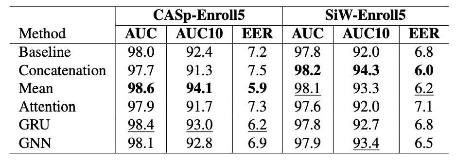

## 個人化の試み

[**A Personalized Benchmark for Face Anti-spoofing**](https://openaccess.thecvf.com/content/WACV2022W/MAP-A/papers/Belli_A_Personalized_Benchmark_for_Face_Anti-Spoofing_WACVW_2022_paper.pdf)

---

この論文は応用面に焦点を当てており、引用数は少ないですが、既存の FAS（顔認証詐欺防止）モデルに対して個人化されたベンチマークを提案しており、現在の社会で重要視されているプライバシーに関連する概念を取り入れています。それでは、詳しく見ていきましょう。

## 問題の定義

<figure style={{"width": "60%"}}>

</figure>

私たちはこれまでいくつかの FAS に関する論文を見てきました。

その中で一般的な作業の流れは、新しい画像を事前に訓練された FAS モデルに入力し、そのモデルがその画像がライブか詐欺かを判断するというものです。この過程では、モデルは画像の特徴をもとに判断を行います。

しかし、この論文の著者は「ユーザーの登録画像」に注目しました。

現在の顔認識モデルは「距離学習」に基づいた構造をしています。実際のアプリケーションでは、ユーザーは登録時に 1 枚（または複数枚）の写真を撮影し、それをシステムに保存します。後続の認証プロセスでは、これらの登録された写真を基に照合を行います。

では、なぜこれらの登録された写真も FAS モデルの参照として使用しないのでしょうか？

この論文の著者はこのアイデアを提案し、実験でその有効性を証明しました。

## 解決方法

### モデルアーキテクチャ

<figure style={{"width": "90%"}}>

</figure>

本研究では、シンプルで拡張性のある個人化された FAS アーキテクチャを提案しています。その中心的なアイデアは、ユーザーの登録段階での画像（Enrollment Set）を「個人のライブ参照」として扱い、特徴の集約メカニズムを使って現在のクエリ画像（Query）と比較することで、ライブ認識の信頼性を強化することです。全体の流れは上の図の通りで、次の 3 つの段階に分けられます。

1. **デュアルパス特徴抽出モジュール**：

   モデルは、クエリ画像と登録画像のそれぞれに対して独立した 2 つの CNN エンコーダを使用して特徴を抽出します。この設計は、情報の干渉を避け、実際の異なる画像ソース（クエリ撮影 vs 登録画像）の品質、環境、機器の差異に対応するために役立ちます。

   - クエリ画像 $I_q$ はエンコーダ $\phi_q$ を通じて特徴ベクトル $f_q \in \mathbb{R}^D$ に変換されます。
   - 登録画像 $\{I^i_e\}_{i=1}^N$ は別のエンコーダ $\phi_e$ によって、それぞれ $f^i_e$ にエンコードされます。

2. **登録特徴集約モジュール**：

   モデルは、複数の登録画像の特徴を 1 つの潜在ベクトル $f^{agg}_e$ に統合して、そのユーザーの個人化された代表とします。著者は、以下のようなさまざまな集約方法を探求しました。

   - **非パラメトリック手法**

     - **結合（Concatenation）**

       - $N$ 個の登録特徴を連結して、長さ $N \cdot D$ のベクトルにします。
       - 完全な情報を保持しますが、順序に敏感であり、順列不変性はありません。

     - **平均（Mean）**

       - $N$ 個の特徴の平均を取ります。
         $$
         f^{agg}_e = \frac{1}{N} \sum_{i=1}^N f^i_e
         $$
       - 単一のベクトルに圧縮され、順序不変性があります。
       - MLP を用いてクエリと登録の対応関係をモデル化します。

       ***

   - **シーケンスモデリング（GRU）**

     - 登録特徴は時間的なシーケンスとして扱われます（特に SiW のビデオフレームに適しています）。
     - GRU アルゴリズムを用いて再帰的に集約します：
       $$
       h_l^i = \text{GRU}(f_l^i, h_l^{i-1})
       $$
     - 最後の隠れ層状態を集約特徴 $f^{agg}_e = h_L^N$ として使用します。

     この方法は、登録特徴における**時間的変化**をモデリングするのに適しており、ポーズの変換や表情の変化などの連続的な情報をキャプチャできます。

     ***

   - **アテンション（Attention）**

     クエリと登録特徴に対して、キー・クエリ・バリューアテンションを使用します：

     $$
     f^{agg}_e = \text{Softmax} \left( \frac{QK^T}{\sqrt{M}} \right)V
     $$

     実際の方法は以下の通りです：

     - $Q = A_Q(f_q)$
     - $K_i = A_K(f^i_e)$, $V_i = A_V(f^i_e)$
     - $A_Q, A_K, A_V$ はすべて線形層です。

     この方法は、クエリと登録特徴間の**類似性**をモデリングするのに適しており、クエリと登録の対応関係を強化できます。

     ***

   - **グラフニューラルネットワーク（GNN）**

     クエリと登録特徴をグラフのノードとして扱います。

     - $N + 1$ 個のノード：クエリ + $N$ 個の登録。

     各 GNN 層は以下を実行します：

     1. 隣接行列 $A_l$ を計算します：ノード特徴間の距離関数 $\psi_l(f^i_l, f^j_l)$ に基づいて。
     2. グラフ畳み込みを行い、ノード特徴を更新します：
        $$
        f^{i}_{l+1} = \rho \left( \sum_{A_l \in \mathcal{A}_l} A_l f^i_l W_l \right)
        $$

     最終的に、クエリノードの特徴を分類入力として使用します。

     この方法は、登録特徴間の**相対関係**をモデリングするのに適しており、異なる登録画像間の類似性と差異をキャプチャできます。

     ***

   実験では、最もシンプルな平均法（mean operator）が逆に安定して優れたパフォーマンスを示しました。これは、モデルの基本構造を変更せずに、シンプルな集約戦略でも効果的に個人化を導入できることを示しています。

3. **特徴融合と分類モジュール**：

   最後に、クエリ特徴 $f_q$ と集約後の登録特徴 $f^{agg}_e$ を連結し、MLP に入力して分類します。モデルはエンドツーエンドで訓練され、両者の対応関係を学習し、クエリ画像の詐欺確率を予測します。

このアーキテクチャの最大の特徴は、その**高い拡張性とデプロイの容易さ**です。

登録特徴は登録段階で事前に計算され、埋め込みベクトルとして保存されるため、後続のクエリプロセスでは一度の前向き伝播だけで済み、計算負荷を減らすとともに、安全な暗号設計を取り入れることでユーザーのプライバシーを保護できます。将来的には、複数のモダリティ入力（例：RGB + Depth + IR）や他のバックボーンに拡張しても、スムーズに統合でき、非常に高い実務的な可能性を示しています。

### データセットの構築

提案されたモデルアーキテクチャの効果を検証するために、著者は既存の公開 FAS データセットを改造し、「ユーザー登録の対応関係」を備えた最初のパーソナライズ版を作成しました。これには以下のデータセットが含まれます：

- **CASp-Enroll**（CelebA-Spoof を改造）
- **SiW-Enroll**（SiW を改造）

このデータセットの変換プロセスは汎用性があり、サブジェクトメタデータを含む反欺瞞データセットに適用可能で、その核心となるロジックは以下の通りです：

- 元のデータセットでは、各データは 1 枚のクエリ画像とその詐欺ラベルで構成されます：
  $$
  d_i = (I_q^{(i)}, t_q^{(i)})
  $$
- パーソナライズデータセットには、対応する登録セットが追加され、同じユーザーの N 枚のライブ画像が含まれます：
  $$
  d_i = (I_q^{(i)}, t_q^{(i)}, \mathbf{e}^{(i)}), \quad \text{ここで } \mathbf{e}^{(i)} = (I^1_e, ..., I^N_e)
  $$
- 各ユーザーにユニークな登録を作成し、その登録をすべてのクエリサンプルに適用します。

### CelebA-Spoof-Enroll（CASp-EnrollN）

CelebA-Spoof は現在最大規模の一つであるライブ認識データセットで、10,000 人以上のユーザーと 60 万枚の画像が含まれています。CASp-Enroll を作成するために、著者は以下の戦略を採用しました：

- 固定の登録数 N（例えば N=5）を設定し、各ユーザーが統一された次元の参照セットを作成できるようにします。
- 各ユーザーをフィルタリングします：ライブサンプル数が N に達しない場合は除外します。
- 最初の N 枚のライブ画像を登録として指定し、残りのライブ+詐欺画像をクエリとして扱います。
- 登録選択はファイル名順で行い、ランダム要素を排除します。

このようなデータ分割ロジックにより、データの標準化が保たれ、実際の「事前登録 → 後続認証」のアプリケーションプロセスに適合します。

### SiW-Enroll（SiW-EnrollN）

SiW は高品質なビデオを基にした反欺瞞データセットで、元のデータは 165 人の被験者によって撮影された 4,478 本の短編動画から来ています。これをパーソナライズするために：

- 最初に Protocol 1 に基づいて train/test を分割し、過剰なサンプル重複を避けるために 10 フレームごとにサンプリングします。
- 各ユーザー × デバイスの組み合わせに対して、1 本の代表的な動画を選択し、その中から N 枚のフレームを平均して登録として使用します。
- 実際のデバイス操作シーンをシミュレートするために、動画は以下の条件を満たす必要があります：
  - 光源の変化なし
  - 姿勢の変化あり（登録の多様性を高めるため）
- その動画のすべてのフレームはクエリから排除され、情報漏洩を防ぎます。

この設計は、現実の「複数デバイスログイン」や「異なる撮影品質」のシーンをシミュレートしており、より挑戦的で現実的なテスト条件を提供します。

## 討論

### パーソナライズは本当に有効か？

実験結果は上の表の通りで、2 つのパーソナライズされたデータセット（**CASp-Enroll5** と **SiW-Enroll5**）において、登録情報を導入した後のモデルは、**すべてのバックボーン組み合わせにおいてベースラインを上回り**、パーソナライズメカニズムの明らかな効果を示しています。

- **CASp-Enroll5**では、パーソナライズ版は最高**+2.2%の AUC10 向上**を実現し、特に VGG16 や ResNet18 などの従来のアーキテクチャにおいて顕著な増加を見せました。
- **FeatherNet**は FAS 専用に設計された軽量モデルですが、パーソナライズ後も安定して進歩し、この手法は大きなモデルだけでなく、リソースに敏感なデプロイアーキテクチャにも有効であることを示しています。

一方、**SiW-Enroll5**の向上幅は小さく、その理由としては登録セットの構成が比較的単一で変動性が低いため、パーソナライズ参照情報の識別力が CASp-Enroll5 ほど豊富でないことが考えられます。

この結果は、最初の研究質問に対する明確な答えを提供します：

> **パーソナライズ参照データを加えることで、FAS の判断能力が本当に改善されるか？**

答えは「はい」です。

モデルアーキテクチャを変更せず、損失関数を変更することなく、同一ユーザーからの登録セットを提供するだけで、モデルはより識別力のある一致基準を学習できます。

:::tip
これは、既存の FAS システムでも、少数のライブデータを維持しながら、追加の偽造防止保障を得ることができ、広範な再訓練が不要であることを意味します。特にモバイルデバイスにデプロイされているシステムにとって魅力的です。
:::

### 最もシンプルな方法が最良？

<figure style={{"width": "70%"}}>

</figure>

著者は 5 つの異なる登録特徴の集約方法を評価しました。

図からわかる実験結果は次の通りです：

> **最も安定し、性能が高いのは、最もシンプルな平均（Mean）法でした。**

具体的に観察すると：

- **CASp-Enroll5**では、Mean 集約が最高の AUC と AUC10（98.6 / 94.1）を取得し、EER を最も低い値（5.9）に引き下げ、極めて高い総合性能を示しました。
- **SiW-Enroll5**では、Mean は最も高くはありませんが、最適値に近く、安定してトップ 3 に入りました。
- 一方、**Attention**の結果は予想外に低く、ベースラインを上回ることなく、SiW ではさらに悪化（EER が 7.1 に上昇）しました。
- GNN は一定の表現能力を示しましたが、CASp では非パラメトリック方法に劣り、その複雑さが同等の利益をもたらさなかったことがわかります。

これらの結果は、モデル設計における一般的な現象を再確認します：**複雑なメカニズムが必ずしも効果的ではない。** 特に、登録データの質と規模が限られている場合、シンプルな方法の方がより安定した一致ロジックを学習しやすいです。

:::tip
既存の FAS アーキテクチャにパーソナライズ機能を迅速に導入することが目的であれば、**Mean 集約戦略を優先して選択する**と、優れた性能を維持し、計算コストも極めて低く抑えられます。
:::

### 同じエンコーダを共用してはいけない？

<figure style={{"width": "70%"}}>

</figure>

この消失実験は、重要な問題に答えようとしています：**クエリ画像と登録画像は同じ特徴抽出器を共用できるか？**

直感的には、両者は顔画像であり、入力形式が同じであれば、同一の CNN エンコーダで処理できるはずですが、実験結果は明確で予想外の結論を示しました：

> **エンコーダを共用することは役に立たず、モデルの性能を著しく損なうことがわかりました。**

実験結果は上の表の通りで、クエリと登録画像を同じエンコーダに通して特徴を抽出した場合：

- **CASp-Enroll5**では、AUC10 が明らかに低下（94.1 から 90.8 に）、EER が急上昇して 13.7%となり、パーソナライズなしのベースラインよりも低くなりました。
- **SiW-Enroll5**では、さらに性能が大きく低下し、EER は 20.6%に達し、モデルがライブ/詐欺の判断にほとんど失敗していることを示しています。

対照的に、独立したエンコーダ設計は、元の高効率な性能を維持しました。

:::tip
登録とクエリのタスク役割は似ているものの、情報の性質が異なるため、独立した学習経路を保持すべきです。
:::

## 結論

本研究は、ユーザーの登録画像を参照として取り入れることで、FAS の認識プロセスに個体特性を組み込み、偽造攻撃の識別能力を効果的に向上させる新しいパーソナライズされた FAS のアプローチを提案しています。ベンチマークの構築から変換プロセス、集約戦略とモデル設計の評価まで、全体的な作業は明確で示唆に富んでおり、今後のユーザーごとの FAS システムの発展に向けた出発点を提供します。

:::tip
セキュリティと攻撃面の観点から見ると：

- **登録データの真実性と完全性が保証できない**：もし悪意のある人が登録段階で偽造やぼやけた画像をアップロードすると、システムは「誤ったライブ参照」を学習し、新たな攻撃面を形成する可能性があります。
- **データの偏りと公平性の問題は未検討**：現在の実験は演者と制御された撮影データに集中していますが、一般のユーザーや異なるグループ、シーンに適用できるかは今後の検証が必要です。

実用化に向けては、攻撃リスク評価、システム防止設計、個人情報保護法への対応など、より完全な検証と設計が必要です。
:::
