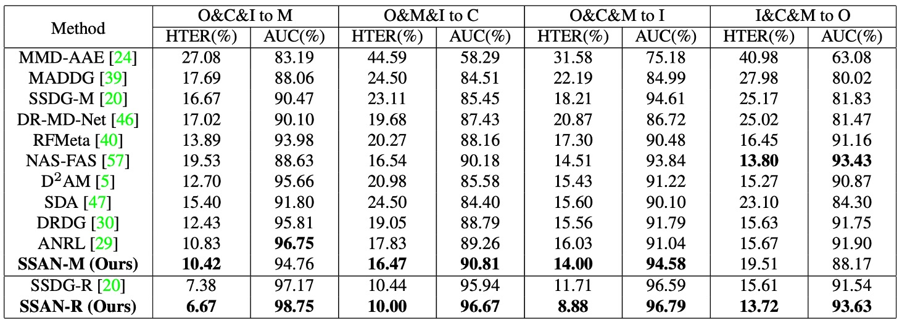

## スタイルの残像

[**Domain Generalization via Shuffled Style Assembly for Face Anti-Spoofing**](https://arxiv.org/abs/2203.05340)

---

今回は有名な論文を見ていきます。

この論文では「スタイル」の概念を導入し、コントラスト学習を用いて生体に関連する手がかりを強調し、スタイルを意識した DG 設計における重要な突破口を示しています。

## 問題定義

顔認証詐欺防止（Face Anti-Spoofing、FAS）は常に見えない戦争の中にあります。

従来の FAS 手法は、LBP や SIFT などの手作りの特徴量を頼りに、画像中のテクスチャーの細部を抽出していました。深層学習時代に入ってからは、CNN に基づいて生体と攻撃の二元分類器を訓練し、深度マップ、反射マップ、血流信号（rPPG）などのさまざまな補助情報を取り入れて入力の認識手がかりを豊かにしてきました。

しかし、これらの手法は安定した性能を発揮しながらも、主に「実験室の条件下」でのみ機能します。

一度、元のトレーニングデータの境界を超えると、性能が大きく低下します。特に異なるデバイス、異なる照明、異なる攻撃手法に直面すると、モデルの判断が不安定になり、誤認識が発生することがあります。

この現象は、**クロスドメイン一般化のジレンマ（Cross-Domain Generalization）**として説明され、その根源は主に次の 3 点に起因しています：

- **データの偏り**：トレーニングデータのカバレッジ範囲が狭く、すべての潜在的な変異をカバーできていない；
- **特徴量の過学習**：モデルがあるドメインの表面的な特徴を学習し、実際の生体の本質を学んでいない；
- **モデルの一般化構造の設計不足**：ほとんどのモデルは伝統的な CNN プロセスを引き継ぎ、サンプル間の微妙な差異を無視している。

一般化能力を改善するため、研究者たちは**ドメイン適応（Domain Adaptation、DA）**および**ドメイン一般化（Domain Generalization、DG）**に多くの労力を注いできました：

- DA 手法としては、MMD 最小化、対抗的アライメント、多判別器学習などがあり、異なるデータ分布間で共通の埋め込み空間を見つけることに取り組んでいます；
- DG は、ターゲットデータが関与しない状態で汎用的な表現を学習することを目指しており、特徴量の解耦（Disentangled Representation）やメタ学習（Meta-Learning）などの戦略が用いられています。

これらの手法は特定の設定でモデルの安定性を向上させましたが、より深い問題も明らかにしました：

> **「重要な特徴とは何か」の理解が未だ不完全である**。

FAS は画像分類タスクではなく、全体的な意味に依存するのではなく、細部に依存します。例えば、皮膚のテクスチャーの連続性、反射エリアの拡散具合、微細な脈動のリズム感などがそれに当たります。そして、これらはまさにスタイルと統計情報が持つ信号です。

ここで、**正規化層（Normalization Layers）**が重要な観察ポイントとなります：

- **バッチ正規化（Batch Normalization、BN）**は、サンプル間の全体統計に注目し、意味的一貫性を強化します；
- **インスタンス正規化（Instance Normalization、IN）**は、個別のサンプルに焦点を当て、ユニークなパターンやスタイルの特徴を捉えます。

両者はモデルの挙動に異なる方向性をもたらします。前者は安定性を追求し、後者は変異を捉えます。そして、FAS タスクにおいては、この微妙なバランスがしばしば無視されがちです。

現在のスタイル転送（Style Transfer）への試みは、大抵、訓練前のデータ増強の段階にとどまっており、モデルの学習プロセスに直接組み込むことができません。実際の環境でのスケールアップが難しいのです。

言い換えれば、統一的な視点、複数ドメインの検証、意味の区別が不足している現在、私たちは「モデルが重要でないスタイルを無視し、生体の本質に集中する方法」を模索している段階にあります。

この論文の著者はこの核心的なギャップに取り組もうとしています：

> **私たちはすでにスタイルがモデルを誤誘導することを知っていますが、逆にスタイルを使ってフェイクを暴露する鍵にできるのではないか？**

クロスドメインの問題はまだ解決されていませんが、スタイル分析の問題が急速に浮上してきています。

波乱が続く中、また新たな波が訪れます。

## 解決方法

<figure style={{"width": "90%"}}>

</figure>

モデルがラベルなしの未知のシーンで生体を安定して識別するためには、スタイルの違いに対抗するだけでなく、**スタイル空間の構造的再構築**が必要です。

本論文が提案する Shuffled Style Assembly Network（SSAN）は、このアプローチから出発し、**スタイルを操作可能、意味を調整可能、学習を比較可能**なクロスドメイン FAS フレームワークを設計しています。

その核心的な構造は上図に示されており、全体のプロセスを 3 つの段階に分けることができます：

1. **特徴の分解：画像を内容とスタイルに分解**
2. **スタイルの再構築：AdaIN を用いて自己組織化とシャッフル組み合わせ**
3. **コントラスト学習：スタイルの意味と生体ラベルを照らし合わせ、空間構造を調整**

### 内容とスタイルの二重ストリーム分解

入力画像はまず Feature Generator に送られ、このモジュールは低次元の意味とテクスチャ情報を抽出し、さらに 2 つの分岐に渡して処理を進めます：

- **内容分岐（Content Stream）**は Batch Normalization（BN）を使用して全体的な意味を抽出し、Gradient Reversal Layer（GRL）を通じて対抗的学習を行い、モデルが異なるドメインに不感応な表現を学習するようにします。

  対抗学習の目的関数は以下のようになります：

  $$
  \min_D \max_G \mathcal{L}_{adv}(G, D) = -\mathbb{E}_{(x, y) \sim (X, Y_D)} \sum_{i=1}^{M} \mathbf{1}_{[i = y]} \log D(G(x))
  $$

  - $G$：内容特徴生成器
  - $D$：ドメイン判別器
  - $Y_D$：データのドメインラベル集合
  - GRL を使用して勾配を逆転させ、$G$がクロスドメインで共有する意味的表現を学習するようにします

- **スタイル分岐（Style Stream）**は Instance Normalization（IN）を基にし、多層特徴マップから粗から細までのスタイル統計情報を抽出します。これには輝度、質感、テクスチャなどのスタイル要素が含まれており、後の組み立てで重要な役割を果たします。

### スタイルの再構築とシャッフル

内容特徴 $f_c$ とスタイル特徴 $f_s$ を取得した後、モデルは**Style Assembly Layer（SAL）**を通じてスタイルの再構築を行います。

SAL のコアは、Adaptive Instance Normalization（AdaIN）に基づいています：

$$
\text{AdaIN}(x, \gamma, \beta) = \gamma \cdot \frac{x - \mu(x)}{\sigma(x)} + \beta
$$

ここで、$\mu(x)$ と $\sigma(x)$ はチャネル統計量であり、$\gamma, \beta$ はスタイル入力 $f_s$ から MLP を通じて生成されたパラメータです。

全体の SAL の動作は次のように表されます：

$$
\begin{align*}
\gamma, \beta &= \text{MLP}[\text{GAP}(f_s)] \\
z &= \text{ReLU}[\text{AdaIN}(K_1 \otimes f_c, \gamma, \beta)] \\
\text{SAL}(f_c, f_s) &= \text{AdaIN}(K_2 \otimes z, \gamma, \beta) + f_c
\end{align*}
$$

ここで、$K_1$ と $K_2$ は 3×3 の畳み込みカーネルであり、最終的な出力は元の内容の残差と加算され、意味のメインストリームを保ちながらスタイル調性が導入されます。

変異性を導入するために、SSAN は 2 つの組み合わせ戦略を設計しました：

- **自己組み合わせ（Self-Assembly）**：

  $$
  S(x_i, x_i) = \text{SAL}(f_c(x_i), f_s(x_i))
  $$

  自身の内容とスタイルを組み合わせてアンカー特徴を構築

- **シャッフル組み合わせ（Shuffle-Assembly）**：

  $$
  S(x_i, x_i^*) = \text{SAL}(f_c(x_i), f_s(x_i^*)), \quad x_i^* \in \text{random}(1,\dots,N)
  $$

  他のサンプルのスタイルを自身の内容と組み合わせ、クロスドメインスタイル干渉を増加させ、識別困難な混合表現を作成

### スタイル空間におけるコントラスト学習

<figure style={{"width": "70%"}}>

</figure>

上の図のように、SSAN はコントラスト学習メカニズムを設計しており、モデルはスタイル空間で次のことを学習します：

- どのスタイルの変異が生体と関係ないか（無視するべき）
- どのスタイルの差異が攻撃特徴を持つか（強化すべき）

具体的には：

- **自己組み合わせ特徴** $a = S(x_i, x_i)$ をアンカーとして設定し、stop-gradient を使用して特徴空間での位置を固定；
- **シャッフル特徴** $b = S(x_i, x_i^*)$ をコントラストサンプルとして使用し、ラベルが一致するかどうかでコサイン類似度損失を計算：

$$
\text{Sim}(a, b) = -\frac{a}{\|a\|_2} \cdot \frac{b}{\|b\|_2}
$$

さらにコントラスト損失を定義します：

$$
\mathcal{L}_{contra} = \sum_{i=1}^N \text{Eq}(x_i, x_i^*) \cdot \text{Sim}(\text{stopgrad}(a), b)
$$

ここで：

$$
\text{Eq}(x_i, x_i^*) =
\begin{cases}
+1, & \text{label}(x_i) == \text{label}(x_i^*) \\
-1, & \text{otherwise}
\end{cases}
$$

これにより、モデルはスタイル空間で意味的な幾何学を学習します：似た生体特徴は近くに、異なるカテゴリのスタイルは遠くに配置されるべきであり、それがどのドメインから来たかに関わらずです。

### 全体損失

SSAN の最終的なトレーニング損失は次のように統合されます：

$$
\mathcal{L}_{overall} = \mathcal{L}_{cls} + \lambda_1 \cdot \mathcal{L}_{adv} + \lambda_2 \cdot \mathcal{L}_{contra}
$$

この三つの損失はそれぞれ次に対応します：

- **分類判断精度**
- **内容意味の対抗的アライメント**
- **スタイル空間における意味的分離**

この三重の張力により、モデルは意味的安定性とスタイルの多様性の境界の間でバランスを取ります。

画像からスタイルを分解し、スタイルから意味を分解し、意味から真偽を識別する。ここで SSAN はスタイルを除去する道を歩んでいるのではなく、**制御されたスタイル学習**戦略を取っているのです。

## 討論

### 他の方法との比較

<figure style={{"width": "90%"}}>

</figure>

通常通り、この論文では OCIM テストを使用してモデルのクロスドメイン一般化能力を検証しました。

このテストでは、OULU-NPU（O）、CASIA-MFSD（C）、Replay-Attack（I）、MSU-MFSD（M）の 4 つのデータセットを使用し、Leave-One-Out クロスバリデーションを行います。具体的な戦略としては、毎回 3 つのデータセットを訓練用、残りの 1 つをテスト用として選び、4 ラウンドのテストを実施します。

図の結果から以下のことが観察できます：

- SSAN は、すべての 4 つのテストにおいて相対的に高いパフォーマンスを維持しました；
- 一部のプロトコルでは、SSDG や CDCN などの過去の方法よりも明確に優れていました；
- 一部の方法は単一または二つのデータセットで良い結果を出しますが、OCIM テストでは明らかに性能が低下する一方で、SSAN はデータセットの組み合わせに対して一般化能力が高いことが示されました。

さらに、著者は SSAN-R（ResNet-18 をバックボーンに使用）の結果が同じテスト設定で SSDG-R を上回ったことを指摘しており、スタイル制御とコントラスト学習の設計が、意味とスタイル情報を統合するだけでなく、軽量なアーキテクチャの実用性を効果的に向上させることを示しています。

### 大規模テスト

著者は**12 の公開データセットを統合して**訓練およびテストデータを作成し、大規模な学習と推論のシナリオを構築しました。使用したデータセットは多様なフォーマット（画像とビデオ）を持ち、さまざまな攻撃タイプをカバーしています。詳細な構成は以下の表に示されています：

<figure style={{"width": "60%"}}>

</figure>

このベンチマークは 2 つのテストシナリオを定義しています：

- **プロトコル 1：Intra-Dataset 評価**

  - すべての 12 のデータセットを同時に訓練およびテストに使用；
  - 主にデータ量が豊富な場合のモデル学習能力をシミュレートするために使用されます。

- **プロトコル 2：Cross-Dataset 評価**

  - データセットは 2 つのグループに分けられます：
    - P1：\{D3, D4, D5, D10, D11, D12\}
    - P2：\{D1, D2, D6, D7, D8, D9\}
  - サブプロトコルは次の通りです：
    - プロトコル 2-1：P1 で訓練し、P2 でテスト
    - プロトコル 2-2：P2 で訓練し、P1 でテスト

  プロトコル 1 と比較して、この設定は未見の攻撃やシナリオを含んでおり、より挑戦的で実際のアプリケーションリスクに近いです。

---

以上の設定に基づいて、実験結果は次の通りです：

<figure style={{"width": "60%"}}>

</figure>

すべての方法は、それぞれの元の論文に基づくデフォルトの訓練フローと設定で実験を行いました。

結果から以下のことが観察できます：

- **SSAN は、全体的なパフォーマンスで他の方法を上回っています**。アーキテクチャの軽量性や一般化能力においても優れています；
- 一部の方法は学術的なベンチマークでは良い結果を出していましたが、今回の大規模で多様なデータソースのテストでは明らかに性能が低下しました；
- これは、従来のテストプロトコルと実際の展開環境との間に依然として大きなギャップがあることを示しています。

著者は、学術的なシーンで優れた FAS モデルが、実世界でも信頼できるとは限らないことを指摘しています。

本章の実験設計と比較は、この点に対応するものであり、SSAN がクロスドメイン、多変異、データ不均衡な条件下でも安定した識別能力を持つことを確認するためのものです。

### 特徴の視覚化

SSAN が学習した特徴空間の構造を深く観察するために、著者は t-SNE を使用して 3 種類の特徴を視覚化し、これらは上図に示された 3 つの投影図に対応します：

- **Content Features：クロスドメイン意味的一貫性**

  異なるデータセットから来た異なる生体および攻撃サンプルが含まれているにもかかわらず、内容特徴は投影空間内で依然として**密接に混合**して分布しています。これは、BN と対抗学習によってモデルが複数のドメインからの意味を統一の埋め込み空間に圧縮できていることを示しています。

  言い換えれば、**意味はデータソースによって左右されない**。これにより、後続のスタイル操作の安定した基盤が築かれました。

---

- **Style Features：スタイル情報の意味的境界**

  直接的な監視はないものの、スタイル特徴は t-SNE 空間内でおおまかな境界を示し、**生体と攻撃を区別**することができます。この境界は意味的内容に依存せず、サンプルのスタイルに関する統計的な違い（例：質感、照明、反射など）から来ています。

  この結果はコントラスト学習の重要性を確認します：**モデルがスタイル空間で生体に関連する信号を強化し、ドメインに関連する干渉を抑制する**ことを導いています。

---

- **Stylized Features：意味とスタイルの統合分類空間**

  内容特徴とスタイル特徴が組み合わされると、最終的なスタイライズド特徴は明確な分類境界を示します。テストサンプルが未知のデータセットから来ていても、**投影結果は明確にクラスタリングされ、生体と攻撃サンプルの分布は安定しています**。

  これは、SSAN がスタイル空間で学んだ戦略が有効であり、**スタイルの違いを解釈可能な分類基準に変換できる**ことを示しています。

---

この視覚化によって、SSAN が単純にデータ量やアーキテクチャの深さで効果を積み上げているのではなく、特徴レベルでスタイルと意味を分離し、監視と組み立てを組み合わせた埋め込み空間を作り上げていることがわかります。それは多ドメイン環境でも論理的一貫性を保つことができ、これこそが最も現実的な一般化能力の表れです。

## 結論

SSAN が提案したのは単なるアーキテクチャ名ではなく、「スタイル」を制御可能、学習可能、さらには変換可能な情報源として見るという明確な設計理念でした。

これは当時の FAS に関する論文ではあまり見られないアプローチです。多くのモデル設計は依然として「ドメインを整合させる」や「変異を平滑化する」ことに焦点を当てており、「スタイルの中で生体に有利な信号を抽出する」ことに重点を置いているわけではありません。

SSAN が行ったのは、逆のアプローチです：

- 明確に content と style の概念を区別し、この分解をサポートする実装アーキテクチャを提供；
- IN（Instance Normalization）を風格抽出の基礎として、BN の意味的安定性と対比させて一組の構造対比を形成；
- 風格重組と対比学習の訓練フローを設計し、風格差異を意味調整のレバレッジに変換；
- stop-gradient anchor メカニズムを使用して学習経路を制御し、風格変動が全体空間の安定性に影響を与えないようにする。

これらの設計は一見技巧の積み重ねに見えますが、実際には一致した内的論理を持っています。風格を消去するのではなく、選択的に風格を調整するというアプローチです。

近年、多くの複雑な風格制御戦略やデータ分布適応技術が提案されていますが、この論文が残した設計哲学は、再び読み返す価値があるものです。
