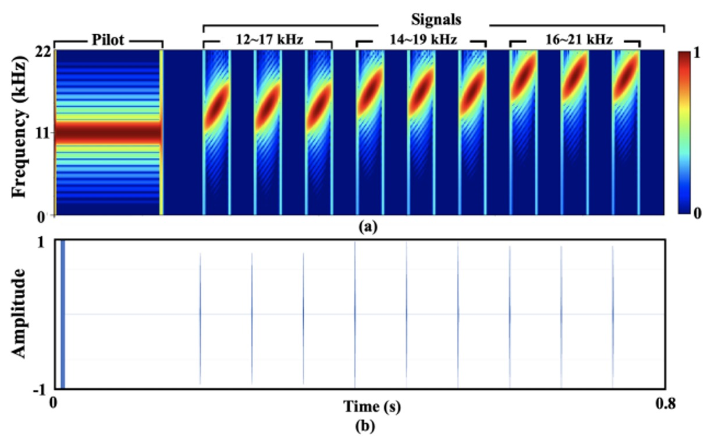
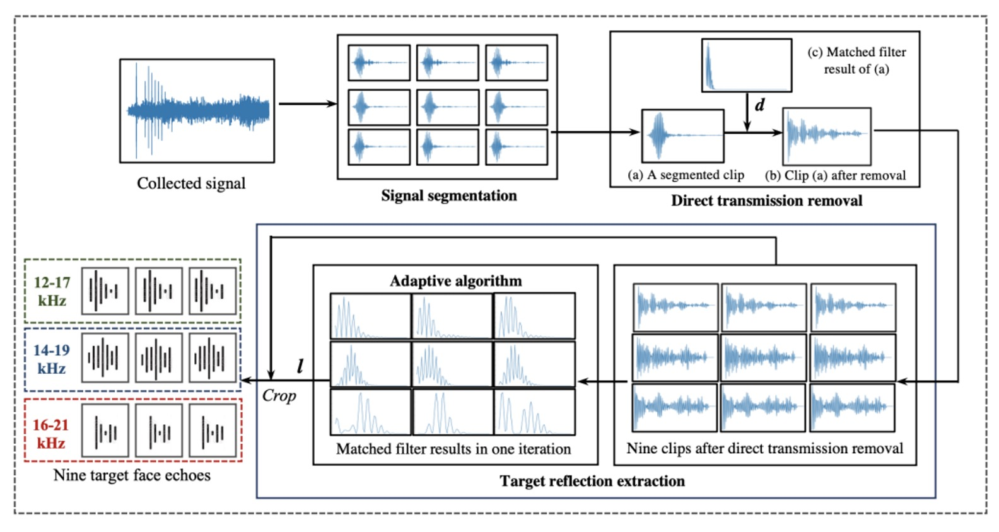
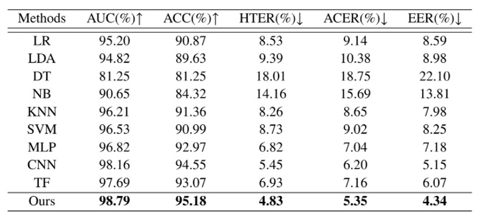

## 偽造のエコー

[**Beyond the Pixel World: A Novel Acoustic-Based Face Anti-Spoofing System for Smartphones**](https://drive.google.com/file/d/1ggyRAQgWdSSS-tVMJvxPE7QwNUXSBLqf/view)

音波技術が顔認証詐欺防止（FAS）の分野で利用されることは、あまり多くありません。

大体、年に一度か二度、引用回数が多い関連研究を見つけることができます。

## 問題の定義

FAS 技術の進化の歴史は、深く掘り下げる識別技術のようなものです。

私たちは、LBP の重ね合わせ、HOG の勾配、CNN 特徴マップ上の高周波のフリッカーを学び、rPPG の心拍信号から生命のリズムを探しました。偽造手法が進化するたびに、「生体証拠」を再定義する必要に迫られます。

しかし、変わらないことがあります：

- **どんなに特徴を強化し、モダリティを補完し、損失関数を混合しても、これらの方法は「見る」ことに過度に依存しています。**

よく見て、細かく見て、正確に見て。

しかし現実はどうでしょう？

カメラには指紋がついているかもしれませんし、光源が逆光で過曝しているかもしれません。使用者の顔も、アルゴリズムが求める角度に必ずしも一致しないことがあります。

さらに、ほぼすべての RGB ベースの識別システムは、いくつかの古典的な課題から逃れることができません：

- 新しいスマートフォンと古いモデル間のドメイングラップ；
- 室内光源と屋外の太陽光の間のスペクトル差；
- データ分布と推論条件の間のギャップ。

これらの問題を解決するために、ハードウェア強化に転向する人もいます。例えば、赤外線、深度モジュール、さらにはミリ波レーダーです。

しかし、これらのソリューションは高価です！

高価であり、展開が複雑で、最終的には識別のしきい値をアルゴリズムからコストやスペックに転嫁することにしかなりません。本当に汎用性のニーズに応えているわけではありません。

そこで、著者は異なる視点を提案します：

> **もし正確に見ることができないなら、聞いてみるのはどうでしょうか？**

スピーカーとマイクは、スマートフォンに無限に存在しており、追加のインストールも技術の普及も必要ありません。

そして、音は単なる情報の運び手ではなく、同時に探査機にもなり得ます。反射する音波の経路から顔の幾何学的情報を識別することができます：

- 一枚の紙、そのエコーは乾いて薄い；
- 一度再生された画面、その反射は歪んで不安定である；

本物の肉体だけが、密度に対応する音波のテクスチャを残します。

でも、これは本当に役立つのでしょうか？

## 問題の解決

システム設計に入る前に、著者は新しい音波データベースである**Echo-Spoof**を作成しました。

これは従来の FAS データベースとは全く異なります。従来のデータベースは画像を収集することが主な目的でしたが、Echo-Spoof は「音波」の反射信号を収集しています。

もし、スマートフォンの内蔵スピーカーとマイクだけで詐欺防止ができることを期待するなら、現実の世界でも有効であることを確認する必要があります。

そのため、著者は以下の三つの重要な要件を設定しました：

1. **音波ベース（Acoustic-based）**：
   従来の FAS データベースは顔写真やビデオを収集していましたが、Echo-Spoof は音波反射信号のみを収集しています。顔の曲線、輪郭、材質から幾何学的情報を抽出し、RGB を使用せず、ユーザーのプライバシーも漏れません。

2. **大規模（Large-scale）**：
   このデータベースは 30 人のボランティア（男女半々）から収集され、25 万件以上の音波信号を集めました。十分な規模でないと、現実のシーンで予測不可能な変数をカバーできません。

3. **高い多様性（High-diversity）**：
   現実の世界では、変化はあらゆる方向からやってきます：異なるスマートフォン、異なる距離、異なる音のレベル、異なる角度など。

   著者はこれらの条件を明確に規定し、ユーザーが実際にスマートフォンを使用する際によく遭遇するシーンを模倣しました。たとえば、「ユーザーとスマートフォンの距離は 25cm から 45cm」、「環境音量は 40dB、60dB、70dB の範囲で変動」または「顔の俯仰角度は-10°、0°、+10°」などです。

   これらの細かい点はデータ収集マニュアルに記載されており、Echo-Spoof が理想的な小規模なデータセットにとどまらないことを保証しています。

データ収集の過程は以下の図のようになっています：

<figure style={{"width": "70%"}}>

</figure>

著者はスマートフォンのイヤホン・スピーカーから設計した音波を発し、上部マイクで反射信号を録音します。もしそれが本物の顔であれば、波形の中には本物の顔の幾何学情報が含まれます。もしそれが紙やスクリーンの再生であれば、異なる歪んだ形態になります。

このようにして得られた大量の音波サンプルは、倫理審査（human ethics application）を経て正式に収集され、実験の安全性とプライバシーの規定に準拠しています。

### 変数の考慮

- **デバイス（Device）**：
  著者は、Samsung S9、Samsung S21、Samsung Edge Note、Xiaomi Redmi7 の 4 種類の Android スマートフォンを使用してデータを収集しました。異なるスマートフォンはスピーカーとマイクの製造に微妙な差異があり、追加の雑音分布を引き起こしやすいため、モデルのクロスデバイス安定性を検証するのに最適です。

- **距離（Distance）**：
  ユーザーが日常的にスマートフォンを使用する際、顔は通常画面から 25〜45cm の距離にあります。著者は、25cm、35cm、45cm で音波を収集し、距離が信号対雑音比（SNR）に与える影響を観察しました。

- **環境音（Ambient Noise）**：
  現実の生活では、静かなオフィスと賑やかなカフェは全く異なる世界です。著者は環境音を 40dB（静かな状態）、60dB（少し騒がしい）、70dB（かなり騒がしい）の 3 つのレベルで管理し、ノイズ検出アプリで基準に達しているかを監視しました。

- **ピッチ（Pitch）**：
  手持ちの角度も顔とスマートフォンの相対位置に影響を与える可能性があります。-10°、0°、+10° の俯仰角度が考慮されました。顔認識は現実では常に垂直のままで維持できるわけではなく、少しの角度変化の方がユーザーの実際の習慣に近いです。

このように精緻な設計を経て、Echo-Spoof は「規模」と「多様性」の面で高い基準を持っています。これにより、後のテスト段階では、異なるシナリオでの音波検出の安定性と耐干渉能力を効果的に評価することができます。

### 信号設計

Echo-FAS が日常のシーンで正常に動作するように、著者は以下の重要な考慮事項を提案しました：

1. **認識品質の向上**：
   線形変調周波数（FMCW、Frequency-Modulated Continuous Wave）を使用して顔の各領域から複数の反射音をキャプチャし、顔の幾何学的情報を抽出します。

2. **環境干渉の低減**：
   より高い周波数範囲（12〜21kHz）を活用し、一般的なノイズ周波数（8kHz 未満）との区別を行い、パイロットトーンを加えて同期し、デバイス間のタイミング差を排除します。

3. **ユーザー体験**：
   不快な音を避け、検出に十分なエネルギーを保持するようにします。著者は Hamming ウィンドウ関数を使用して不要な周波数成分を抑制し、音量を適切に調整することで「人間の耳で聞こえる確率」を最小限に抑えました。

最終的な設計は以下の図の通りです：

<figure style={{"width": "70%"}}>

</figure>

信号全体の長さは約 0.8 秒、サンプリングレートは 44.1kHz（ほとんどの Android デバイスでサポートされている典型的な値）です。

説明を簡単にするために、著者は信号に**11.025kHz のパイロットトーン**を加え、これを 9 つのチープ（線形周波数変調）と組み合わせて最終出力を生成しました。信号の周波数範囲は 12〜21kHz で、3 つの異なる周波数範囲（12〜17kHz、14〜19kHz、16〜21kHz）に細分され、それぞれが 3 回繰り返されます。

各チープの実際のサンプル数は 60 で、2 つのチープ間の間隔は 3000 サンプルで、これにより時間領域での重複を避けています。

### 信号分析

Echo-FAS は**FMCW**（Frequency-Modulated Continuous Wave）技術を採用しています。これはレーダーでよく使用される周波数変調技術で、元々は精密な距離計測に使用されていました。ここでは、顔の幾何学的情報を識別する音響スキャナーとして応用されています。

その原理は簡単に理解できます。顔の異なる部位（例えば鼻筋、唇、額）とスマートフォンのスピーカーとの距離は異なり、したがって音波はこれらの構造に遭遇した際、異なる時間遅延と位相変化を反射します。これらの微妙な差異を特定の周波数帯域内で正確に解析できれば、顔の輪郭特徴を識別できる情報として形成できます。

この能力の理論的な基礎を説明するために、著者は FMCW アーキテクチャにおける解像度計算の公式を引用しました：

$$
R_d
= \frac{v \cdot \delta T}{2}
= \frac{v \cdot \delta f}{2k}
= \frac{v}{2 \cdot BW}
= \frac{343 \text{m/s}}{2 \times 5000 \text{Hz}}
= 3.43 \text{cm}
$$

ここで、$v$は音速（約 343 m/s）、$BW$は周波数変調信号の帯域幅、$k$は周波数変化の傾斜を示します。

この公式から分かることは、顔の 2 点間の深さの差が 3.43cm を超えると、反射信号に識別可能な時間遅延が残るということです。この解像度は、鼻先と顎、額と頬などの主要な幾何学構造を区別するのに十分です。

この識別要求に基づいて、著者は 12〜21kHz の周波数範囲を選択しました。

この周波数帯には多くの利点があります：それはほとんどの環境ノイズの主要な周波数（通常は 8kHz 以下）よりも高く、また成人の可聴周波数の上限（約 15〜17kHz）に近いため、ユーザーの感知を効果的に低減できます。

しかし、周波数が高すぎるとスマートフォンのスピーカーの出力に制限が生じ、特に 21kHz を超えると信号が急激に減衰し、その後の特徴抽出に対する効果が低下します。そのため、この範囲は「聴覚性、抗ノイズ性、ハードウェア能力」の三者間でバランスを取ったものです。

信号が録音で正確に識別できるように、最初に 11.025kHz のパイロットトーンが追加されています。これは持続的で安定した純音波で、他の chirp 信号や環境ノイズと明確に区別されます。

録音内容との相関演算を通じて、モデルは信号の開始点を正確に位置決定し、異なるスマートフォンデバイス間のタイミング遅延を自動的に補正することができます。これは実際のデプロイメントで重要な安定性要因となります。

また、掃引信号の設計では、各 chirp の長さを 60 サンプル（約 1.4 ミリ秒）に設定し、その間に 3000 サンプルの間隔を設けています。

この設定は物理的および工学的な制約を考慮しています：

chirp が長すぎると、信号対雑音比を向上させることができますが、顔の反射と時間的に重複する可能性があります。たとえば、距離 30cm では音波の往復に約 1.7 ミリ秒かかり、サンプル数に換算すると 77 サンプルです。もし chirp の長さがこの値を超えると、反射と直達信号を区別するのが困難になります。

逆に、chirp 間隔が短すぎると、前の chirp から遠くの物体（例えば壁）から反射されたエコーが次の chirp の顔のエコー範囲に入ってしまい、混乱と干渉が発生する可能性があります。

実験結果は、3000 サンプル（約 68 ミリ秒）の間隔がこれらの問題を効果的に回避でき、全体的な検出時間が長すぎることなく、0.8 秒以内で信号が終了し、ユーザーが受け入れ可能な感知閾値内に収まることを示しました。

もちろん、周波数設計ができる限り人間の耳が感知できる範囲を避けるようにしているものの、特定の信号は 17kHz 以下に残り、特定のユーザーには聴覚的な干渉を引き起こす可能性があります。

そのため、著者は信号設計に Hamming ウィンドウを追加し、chirp の開始と終了が滑らかなエンベロープ形状を持つようにし、音の鋭さをさらに低減させました。また、各スマートフォンモデルに対して音量最適化テストも行い、「歪みなく十分な音量」を確保するようにしました。

調査によると、参加者の 90%以上が「ほとんど音を感じなかった」と回答しており、この設計の実際の適用可能性に対して良好な証拠を提供しています。

### 信号処理

もし、音の設計が言語であるなら、信号処理はその意味を理解することに相当します。

Echo-FAS では、録音された音は単なるエコーではなく、複合物です。それはスピーカーからの**直達信号**、顔からの**主エコー**、および環境の他の物体からの**背景反射**を同時に含んでいます。

信号処理の目的は、この音波の中から本当に顔の幾何学的輪郭を表す部分を抽出し、後続の識別モデルの入力として使用することです。

全体の処理フローは三つの段階に分かれています：

- **信号のセグメンテーション（segmentation）**
- **直達信号の除去（direct transmission removal）**
- **目標エコーの抽出（target reflection extraction）**

以下の図のようになります：

<figure style={{"width": "90%"}}>

</figure>

最初は**信号のセグメンテーション**です。

録音の開始点は安定していません。スピーカーとマイクはスマートフォン上で完全に同期していないため、著者は 11.025kHz のパイロットトーンを同期マーカーとして設計しました。録音内容との相互相関を通じて、システムは信号の正確な開始点を特定することができます。

開始点が決定された後、録音全体は九つのセグメントに分割され、それぞれが前述の九つの chirp に対応します。各セグメントには直達信号とさまざまなエコーが混在しており、これが粗い位置決めの第一歩です。

次に、**直達信号の除去**に進みます。

この信号はスピーカーから発信され、反射されずにマイクで直接受信された部分で、最短の伝達距離とほとんど減衰しないエネルギーを持ち、録音全体で最もピークが高いことがよくあります。これを除去するために、著者は元の chirp とのマッチングフィルタを使用して、この信号の開始位置を識別し、その前後のサンプルを削除して、顔や背景のエコーを含む可能性がある部分だけを残します。

最後に、重要な**顔のエコーの抽出**段階に入ります。

直達信号を除去した後、残る信号は壁やテーブルなどの遠くの物体からのエコーを含んでいる可能性がありますが、それらは遅れて現れ、比較的分散しています。一方、顔のエコーは最も近い距離にあり、各セグメントで「最も早く、最も集中して」現れます。以下の図のように：

<figure style={{"width": "80%"}}>

</figure>

そこで、著者は**適応型位置決めアルゴリズム**を提案しました。各録音セグメントでマッチドフィルター演算を行い、最もエネルギーが高いピークを見つけ、九つのセグメントのピーク位置を平均化して、時間的に「最も一貫しており、顔のエコーである可能性が高い」位置を特定します。このアルゴリズムは標準偏差が最小の平均点を繰り返し求め、安定した位置決めを保証します。その後、各セグメントでその位置以降の 60 サンプルを切り出し、最終的な顔の音響特徴として出力します。

これにより、各検出ごとに元の録音から九つの 60 サンプルの音波セグメントを抽出し、その後のモデルが真偽を判断する基準として使用します。この過程では追加のハードウェアや多チャンネル設計は必要なく、1 つのマイクとよく設計された音声で顔の音響構造をキャプチャすることができます。

### モデルアーキテクチャ

音声の問題が解決された後、次は私たちが馴染みのあるモデルアーキテクチャの話です。

下の図は、この識別プロセス全体を示しており、3 つの段階に分かれています：

- **前処理（Preprocessing）**
- **二分岐特徴抽出（Two-Branch Feature Extraction）**
- **交差融合決定（Cross-Attention Fusion）**

読者にとって、この部分は比較的簡単だと思われるので、順を追って見ていきましょう。

### 前処理

入力は、マイクで録音された原始的な音声信号です。

先ほど紹介した信号処理ステップを通じて、システムは同期処理、直達信号の除去を行い、録音全体から 9 つのエコーセグメントを抽出します。

### 二分岐アーキテクチャ

<figure style={{"width": "70%"}}>

</figure>

これらの 9 つのエコーは、それぞれ 2 つの平行かつ補完的なニューラルネットワーク分岐に送られ、2 種類の周波数特徴を解読します：

- **Global Frequency Branch（右側、Transformer 分岐）**：

  各信号を Fast Fourier Transform（FFT）で変換し、周波数領域に表現を移して、9 つのトークンを Transformer 構造に入力します。

  この分岐は、信号の全体的な周波数分布関係や長距離依存特徴をキャプチャすることに重点を置いています。Transformer はこれらの周波数スペクトルから顔の構造に関連する「周波数のパターン」を学習し、全体的な視点で特徴マップを構築します。

- **Local Frequency Branch（左側、CNN 分岐）**：

  もう一方では、各信号を Short-Time Fourier Transform（STFT）で変換し、時間–周波数図（スペクトログラム）に変換します。

  これらの画像は、音波の時間的な変調プロセスを保持しており、顔をスキャンする際に捕えることができる動的特徴を反映しています。これらの画像はその後、局所的なパターンや詳細な変化を捉えるのが得意な CNN ネットワークに送られ、「幾何学的な詳細なテクスチャ」を抽出する学習を行います。

---

この 2 つのルートは、それぞれ異なる建模上の利点を持っています：Transformer は全体的な周波数構造に焦点を当て、CNN は局所的な応答パターンに焦点を当てます。Echo-FAS では、これらは対立するものではなく、補完的に設計されています。

2 つの分岐はそれぞれ、全域特徴$f_1$、局所特徴$f_2$を出力します。

これらの 2 つの視点を真正面から対齐させるために、Echo-FAS は**双方向交差注意モジュール（Dual Cross-Attention Module）**を設計しました。上の図(d)のように、Cross-Attention モジュールは$f_1$が$f_2$に注目し、また$f_2$が$f_1$に注目するようにします。これにより、両者は互いに注目し、融合し、最終的に 2 組の特徴を結合して分類層に渡し、最終的な判断が行われます。

### 深さ選択

<figure style={{"width": "70%"}}>

</figure>

このアーキテクチャの設計が合理的かどうかを確認するために、著者は一連のアブレーション実験を行いました。

上の図に示されているように、Transformer ブロック数（右図）と CNN 層数（左図）が増加すると、システムの識別精度は徐々に向上しますが、ある深さで性能が安定します。最終的に、著者は 10 層の Transformer と 5 層の CNN を二分岐のバックボーンとして選択し、性能とリソース消費のバランスを取っています。

## 討論

### 跨身份識別能力

<figure style={{"width": "70%"}}>

</figure>

実際のシーンでは、FAS システムはすべてのユーザーを事前に認識することはできません。未知の顔に対しても正しく判断できる必要があります。したがって、最初の実験は最も重要な一般化の課題に焦点を当てています：**クロスアイデンティティ活体検出**。

上の表では、著者は Echo-FAS を 25 人のユーザーでトレーニングし、訓練データに一度も登場しなかった 5 人の被験者でテストしました。

結果として、Echo-FAS はこの設定でも**98.79%の AUC と 95.18%の ACC**を達成し、安定した優れたパフォーマンスを発揮しました。さらに、表には MLP、CNN、Transformer などの他の分類モデルの結果も示されていますが、これらは一定の認識性能を達成できるものの、全体的に Echo-FAS には大きく遅れを取っています。

これは、音波信号自体が非常に識別可能であることを再確認させるだけでなく、Echo-FAS アーキテクチャが「信号モデリング」と「情報整合」の面で優れていることを強調しています。

簡単に言えば、Echo-FAS はあなたの顔を見たことがなくても、**あなたが本物であることを音で聞き分けることができる**のです。

これは、音響を利用した活体識別能力の効率的なデモンストレーションであり、今後のデバイス間や攻撃種類のテストにおける一般化性能の自信の基盤を築いています。

### ユーザー習慣における安定性

<figure style={{"width": "85%"}}>

</figure>

すべての人がスマートフォンをまっすぐに持つわけではありません。

ある人は下を向いてスマホを操作し、ある人は横向きにロックを解除し、またある人はスマホを少し仰角で操作する習慣があります。これらの日常的な習慣は、従来の FAS システムでは「非理想的な姿勢」として扱われてきましたが、実際の世界ではこれらが標準的な状態です。

Echo-FAS の操作差異における安定性を検証するために、著者は「ユーザー仰角耐性テスト」を設計しました：

- **顔とスマートフォン間の角度（ピッチ）を-10°、0°、+10° の 3 つの設定に分け、それぞれに仰角、正対、俯角の最も一般的な使用シナリオを対応させ、各角度でモデルのテストを行いました。**

結果として、Echo-FAS はどの角度でも安定した高精度な認識性能を維持し、すべてのベースラインモデルにおいて最良のパフォーマンスを示しました。これは、Echo-FAS が固定された撮影姿勢に依存せず、その音波信号の幾何学的特徴のキャプチャ能力が、実際の使用過程での姿勢変化を十分にカバーできることを証明しています。

これはユーザーフレンドリーな保証です：**モデルに合わせて角度を調整する必要はなく、モデルは自分で調整してあなたを理解します。**

Echo-FAS が強調する「音波幾何学」は、技術的なアーキテクチャの言語にとどまらず、実際のインタラクションシーンでの安定性を追求する実践的なアプローチです。これにより、Echo-FAS は単にベンチマークで高得点を取るだけでなく、ユーザーの日常に溶け込むことができます。

### 多モーダル融合

多くの実際のアプリケーションシーンでは、ユーザーがどのスマートフォンを使用し、どのような光源の下で身分認証を行うかを予測することはできません。これにより、RGB を主とする FAS モデルはデバイスの異質性によりドメイングラップを生じ、性能が顕著に低下することがあります。

Echo-FAS の音響モダリティは、顔の構造を読み取るため、画像の外観に影響されることが少なく、より安定した信号源を提供します。

音声と画像の相補性を検証するために、著者は次のような多モーダル融合実験を設計しました：

<figure style={{"width": "85%"}}>

</figure>

各サンプルは 2 つの信号から構成されています：1 つは音波（Echo-FAS 提供の幾何学的特徴）、もう 1 つは顔の画像（RGB モダリティの外観特徴）です。

音声信号は Echo-FAS のバックボーンで特徴$f_A$を抽出し、画像は ImageNet で事前学習した ResNet18 で視覚特徴$f_V$を抽出し、両者は融合モジュールを通じて一緒に判断を行います。

実験では、4 台のスマートフォン（Samsung S9、S21、Edge Note、Redmi7）を使用してデータ収集を行い、毎回 3 台のデバイスを使ってトレーニングし、残りの 1 台をテスト領域として使用し、実際のデプロイメントでのデバイス間の一般化チャレンジをシミュレートしました。

実験結果は以下の表の通りです：

<figure style={{"width": "85%"}}>

</figure>

融合後のモデルは、すべてのテストシナリオにおいて RGB モデルを上回り、音声モダリティが RGB モデルの不足を成功裏に補完したことを証明しました。

撮影機器の変更や画像品質の不安定さに対して、Echo-FAS は構造的な信号を提供し、幾何学的特徴を意思決定ロジックに戻し、モデルが外観の細部に過度に依存することを減少させます。

## 結論

Echo-FAS は非常に実用的な FAS ソリューションを提供します。

追加のハードウェアは必要なく、信号は軽量で、推論も迅速に行え、日常のデバイスで即座に使用可能で、強力な認識安定性を示します。その優位性は、ユーザーが何も変更する必要がないことです：新しい習慣を学ぶ必要はなく、特別な角度や光源に依存せず、長い遅延を我慢する必要もありません。

基本的に、スマートフォンにマイクがあれば、それは動作します。

しかし、このシステムにはいくつかの制限もあります。

まず、立体的な偽顔（3D マスク）の複雑な素材と深さの層には対応できません。これは平面音波では解析が難しい次元です。次に、ハードウェア間の周波数応答差異を完全に排除することは依然として難しく、デバイス間の音響指紋がモデルの一般化に微妙な痕跡を残す可能性があります。フィルタリングや適応設計を行ったとしても、音はその機器に依存するため制約を受けます。

したがって、Echo-FAS の位置づけは、既存の方法を革新して取って代わることではなく、低依存、高補償、軽量な識別モダリティを提供することです。環境が制御できない、または画像が信頼できない状況で、別の可能性を示しています：

偽造の手がかりは、画像からだけでなく、音のエコーからも得られるのです。
