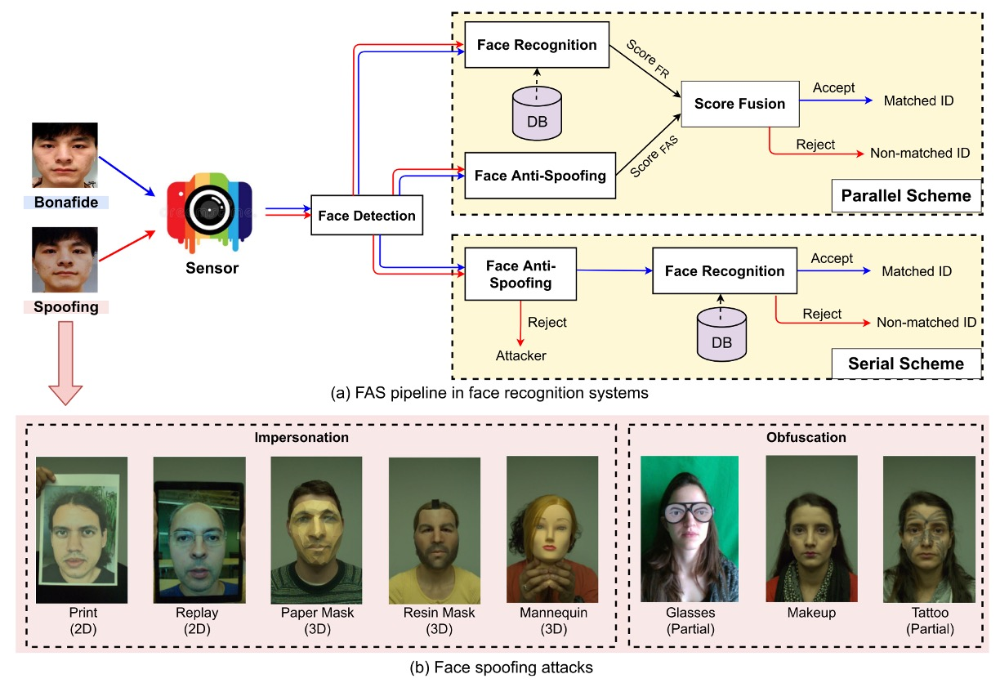
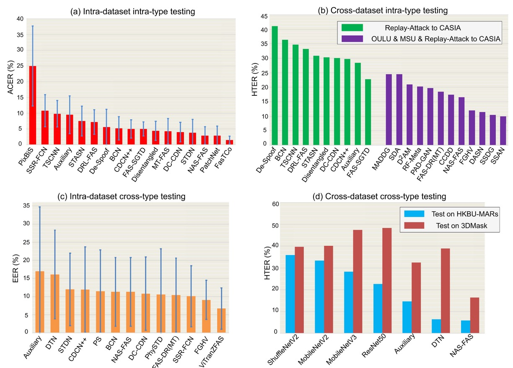
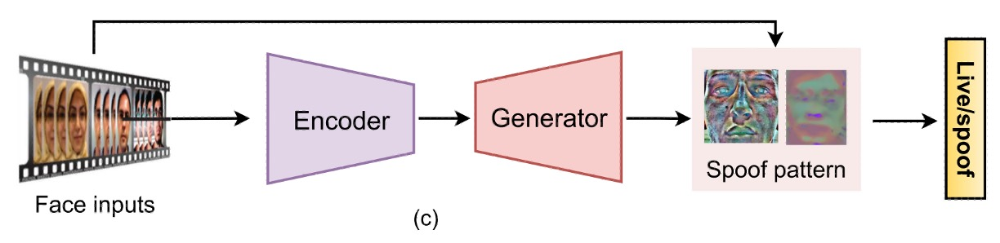

## 攻撃と防御の年代記

[**Deep Learning for Face Anti-Spoofing: A Survey**](https://ieeexplore.ieee.org/abstract/document/9925105)

---

過去のいくつかの論文を見た後、私たちは FAS の研究背景と発展の流れを大体理解しました。

ここでは、過去十数年のさまざまな方法を振り返りましょう。

:::tip
このレビュー論文には約 200 本の参考文献があり、興味のある読者はそれを取り出して読んでみてください。
:::

## FAS アーキテクチャ

すべての攻撃の第一歩は、センサーを欺くことです。

そのため、攻撃は大まかに次の 2 種類に分けることができます：

- **デジタル攻撃（Digital Manipulation）**：例えばディープフェイク（deepfake）や画像処理など、仮想領域での改造。
- **物理的提示攻撃（Physical Presentation Attacks）**：これは本論文の主な焦点で、実世界で物理的なメディアを使用してカメラを欺くことを目的としています。

一般的な攻撃のタイプと FAS システムの構築方法は、以下の図に示されています：

<figure style={{"width": "90%"}}>

</figure>

物理的提示攻撃から、さらに意図に応じて次のように区別できます：

- **なりすまし（Impersonation）**：他人を模倣する、例えば写真を持つ、または 3D マスクを着用し、システムに特定の人物だと認識させる。
- **隠蔽（Obfuscation）**：自分自身を隠す、例えば化粧、サングラス、ウィッグなどを使って、システムに自分を認識させなくする。

幾何学的構造に基づいて、さらに次のように区別できます：

- **2D 攻撃**：例えば平面の写真、スクリーンリプレイ映像、穴の開いた写真など。
- **3D 攻撃**：紙、石膏、シリコン、樹脂などの素材で作られた立体マスクを含む。これらの攻撃はよりリアルであり、挑戦的でもあります。

興味深いことに、顔全体を使った「正攻法」に加えて、「側面攻撃」とも言える**局所的攻撃**が多数登場しています。例えば、目元におかしな眼鏡をかける、頬にシールを貼るなど、部分的な領域を狙った攻撃であり、防御の難易度を高めています。

深層学習方法の発展に伴い、データセットの規模と複雑さも段階的に進化しています。

本論文では、次の三つの大きなトレンドをまとめています：

1. **大規模化**：例えば CelebA-Spoof、HiFiMask など、画像や映像の数が数十万に達し、訓練データが飽和しています。
2. **多様性の強化**：新しいデータセットは、一般的な印刷や再生攻撃だけでなく、詳細な分類型の 3D 攻撃、変動する照明、跨るシーン録画などのシナリオも導入しています。例えば SiW-M は 13 種類もの攻撃タイプを含んでいます。
3. **センサーのアップグレード**：単一の RGB カメラから、深度（Depth）、近赤外（NIR）、熱感（Thermal）、短波赤外（SWIR）などのモード、さらには光場カメラを使った記録にまで拡張されました。

### 深層学習方法の概要

<figure style={{"width": "90%"}}>
  
</figure>

上記の図は**FAS 方法分類ツリー**を示しており、センサーから始まり、各レベルで異なるモデル設計と一般化戦略へと展開しています。

センサー層からの分類は次の通りです：

- **商業用 RGB カメラ**：現在最も一般的なデバイスのタイプで、多くのスマートフォンやノート PC はこのタイプに分類されます。このデバイス用に開発された FAS 方法は、可視光単一モードでの偽造検出に重点を置いています。
- **高度なセンサー**：例えば NIR、深度、熱感、SWIR、光場カメラなど、より豊富な画像特徴を提供します。このタイプのデバイスに適用されるモデルは、跨るモード情報を組み合わせることで識別能力を向上させますが、開発と展開コストも増加します。

---

ほとんどのシナリオでは、RGB カメラしか利用できないため、私たちはこのモードでの FAS 方法に焦点を当てます。

- **一般的な深層学習方法**

  最も伝統的な二項分類の監視学習（例えば Binary Cross-Entropy）を使用したり、さらなるピクセル単位の監視（Pixel-wise Supervision）を行ったりして、モデルの局所的な spoof cue 学習能力を強調します。

  よく使われる補助設計として：

  - **補助監視**：中間特徴の監視や深層特徴の補助的な判断を導入。
  - **生成モデル**：GAN や再構成方法を使用して異常サンプルの識別能力を向上させます。

- **ハイブリッド方法**

  異なる監視構造を融合（例えば BCE +再構成損失）し、分類と局所的再構成能力を両立させ、偽造の手掛かりをよりよく捉えることを目指します。

- **一般化深層学習方法**

  このアプローチの核心目標は「**ドメイン一般化（Domain Generalization）**」であり、訓練シナリオ内でうまく動作するだけでなく、未知のデータ分布にも対応できることを目指します。
  主な技術分支は次の通りです：

  - **ドメイン適応**：目標データが少量の場合、モデルを微調整します。
  - **ドメイン一般化**：完全に目標データがない場合でも、一般化能力を保持する必要があります。
  - **フェデレーテッドラーニング**：複数の端末からの学習を統合し、プライバシーを保護しつつ一般化性能を向上させます。

:::tip
この時代にはまだ流行していなかった Vision Language Model（VLM）方法について、関連する方法については後でまた話します。
:::

### 評価指標

FAS タスクの評価は、2 つの主要な側面に焦点を当てています：

- **FAR（False Acceptance Rate）**：攻撃サンプルを誤って正規のユーザーと判定する割合。
- **FRR（False Rejection Rate）**：正規ユーザーを誤って攻撃サンプルと判定する割合。

これら 2 つのバランスを取るために、よく使われる総合指標には以下のものがあります：

- **HTER（Half Total Error Rate）**：FAR と FRR の平均値

  $$
  \text{HTER} = \frac{\text{FAR} + \text{FRR}}{2}
  $$

- **EER（Equal Error Rate）**：FAR と FRR が等しくなるときのエラー率（すなわち HTER のバランスポイントの値）、これはモデル性能の総合評価指標としてよく使われます。
- **AUC（Area Under Curve）**：ROC 曲線の下の面積を計算し、モデルが bonafide（正規）と spoof（攻撃）を区別する能力を反映します。値が 1 に近いほど良いとされます。

さらに、**ISO/IEC 30107-3**規格に基づき、以下の 3 つの誤分類指標が導入されつつあります：

- **APCER（Attack Presentation Classification Error Rate）**：攻撃サンプルが誤って bonafide と判定される割合。
- **BPCER（Bonafide Presentation Classification Error Rate）**：正規サンプルが誤って攻撃サンプルと判定される割合。
- **ACER（Average Classification Error Rate）**：APCER と BPCER の平均値

  $$
  \text{ACER} = \frac{\text{APCER} + \text{BPCER}}{2}
  $$

これらの指標は、モデルが異なる誤分類のシナリオにおける具体的な定量的根拠を提供し、特に実際の展開環境で誤判定のリスクを詳細に評価するのに役立ちます。

:::tip
HTER と ACER は同じものであり、単に名称をつけた機関が異なるだけです。
:::

### 評価プロトコル

<figure style={{"width": "90%"}}>
  
</figure>
<figcaption>4つの主流なテストプロトコルにおける、深層学習FAS方法の性能比較。</figcaption>

---

異なるプロトコル設定は、モデルが**実際のデプロイシナリオで直面する挑戦の程度**を反映しています。これらの設定は、モデルが「慣れた」状況から「未知」の状況に向けて成長する段階として見ることができます。一般的に、次の 4 つのテストプロトコルに分けられます：

1. **Intra-Dataset Intra-Type**

   同一データセット、同一タイプの攻撃。最も基本的な評価方法で、モデルは訓練とテストの両方で同じ分布のデータを使用します。

   OULU-NPU や SiW などのデータセットのデフォルトサブプロトコルに見られます。この状況ではドメインギャップが非常に小さいため、深層モデルが高精度を達成しやすい設定です。

   上図 (a) に示されているように、多くの方法は OULU-NPU の Protocol-4 テストで優れた性能を発揮し、ACER は通常 5％未満です。

   ***

2. **Cross-Dataset Intra-Type**

   訓練とテストのデータが**異なるデータセット**から来ており、攻撃タイプは同じですが、モデルのドメイン一般化能力をテストします。

   実際の「開発環境」と「実際のアプリケーションシナリオ」が一致しないという課題を模倣します。上図 (b) は Replay-Attack で訓練し、CASIA-MFSD でテストした結果を示しています。単一データセットで訓練した場合（緑色の柱）HTER は高くなる傾向があります。複数のデータセット（紫色の柱）を使用して訓練し、クロスドメイン学習法（例：SSDG, SSAN）を使用することで、一般化性能が大幅に向上することが確認できます。

   ***

3. **Intra-Dataset Cross-Type**

   Leave-one-type-out 設定を使用し、ある攻撃タイプが**テスト段階でのみ登場**し、訓練データには含まれていません。

   このプロトコルは、モデルが「未知の攻撃タイプ」にどれだけ対応できるかを検証するためのものです。上図 (c) は SiW-M のテスト結果を示しており、13 種類の攻撃タイプが含まれており、それぞれの難易度に差が大きいため、モデルの平均 EER は高く（約 10％）なることが分かりますが、標準偏差が大きいです。

   事前学習と転移学習を使用することで、例えば ViTranZFAS では EER を 6.7％に低減できます。

   ***

4. **Cross-Dataset Cross-Type**

   現在最も挑戦的な設定で、**データソースと攻撃タイプの両方を変更**します。

   訓練には OULU-NPU と SiW（主に 2D 攻撃）を使用し、テストには HKBU-MARs や CASIA-SURF 3DMask などの 3D マスクデータセットを使用します。上図 (d) は、現在の方法（例：NAS-FAS、DTN）がいくつかの低リアルな 3D マスクのみを検出でき、高精度なマテリアルを区別するのが難しいことを示しています。

   このプロトコルは、現実のデプロイシナリオで直面する未知のシナリオと複合攻撃の課題に最も近いものであり、今後の研究の重要な方向性となります。

---

各プロトコルの設計は、モデルの能力を徐々に引き上げるものです：
最も理想的な「閉じた訓練テスト」から、実世界の「開かれた未知シナリオ」へと、FAS システムがどのように成長し、未見の攻撃を識別する方法を学ぶかが、この防偽対抗戦の核心的課題です。

## RGB ベースの FAS

上図は、RGB カメラを基にした FAS 技術の進化の流れを整理したものです。

初期の手作り特徴量に依存していた時代から、マルチモーダル融合と一般化能力を強調する深層モデル設計へと進化しました。

RGB カメラはほとんどすべてのデバイスに標準装備されているため、このようなデバイス用に開発された防偽システムは、FAS 技術の実用化の主要な戦場となっています。

## ハイブリッド型方法

<figure style={{"width": "70%"}}>

</figure>

深層学習は分類や検出タスクで非常に強力ですが、FAS タスクの実際の状況は少し現実的です：

> **データ量が一般的に少なく、サンプル分布が頻繁に不均衡であるため、モデルの訓練は過学習に陥りやすい。**

このような状況で、いくつかの研究は伝統的な手作り特徴量と深層モデルを組み合わせる方向に転換しました。この「補完」アプローチにより、非テクスチャ特徴（光影の変化、心拍リズム、異常な動きなど）に対するモデルの感知の盲点を補おうとしています。

このアプローチは大きく分けて 3 つの方法に分類できます。

第一の方法は「**特徴量の前融合**」、すなわち、まず伝統的な方法で静的または動的な特徴を抽出し、それを深層モデルに入力して分類を行う方法です。よく使われる方法としては、multi-scale LBP や Weber descriptors を用いて細かいテクスチャを抽出する方法や、LBP と CNN を組み合わせてエッジや強度などの低レベル情報を保持する方法があります。

動的な手がかりを捕えることが目標であれば、dense optical flow を使って動きの軌跡を分析したり、rPPG を時系列データに変換して Vision Transformer に入力する手法もあります。さらに、輝度の変化を捕えたヒストグラムを使ってリプレイ攻撃を反制する研究もあります。

> **この方法の基本的なロジックは、モデルが学ぶべき特徴を先に準備しておいて、モデルの学習をサポートすることです。**

---

第二の方法は「**特徴量の後融合**」、こちらでは流れが逆になります。最初に深層モデルが特徴を抽出し、その後に手作りの特徴量を追加して補強します。例えば、PCA を使って VGG-face から不要な情報を取り除く方法や、直接 CNN の畳み込み層からカラー LBP を抽出し、統計的信号を強化しようとする方法があります。また、時系列特徴に LBP-TOP や optical flow を加えて時間的ダイナミクスの解像度を上げる方法もあります。

> **この方法の最大の課題は、CNN 特徴が層ごとに意味が変わるため、適切な融合層を選ぶ必要があり、これは経験と実験に依存し、標準的な答えがないことです。**

---

第三の方法は「**二流融合**」、すなわち手作り特徴と深層モデルをそれぞれ別々に走らせ、最終的に特徴層やスコア層で統合する方法です。

ここでの例はさらに多くあります。例えば、LBP と VGG16 の予測スコアをそのまま加算する方法や、HOG や LBP の特徴マップを使って CNN の下層学習方向を誘導する方法があります。さらに、1D CNN を使って輝度やぼやけた手がかりを融合し、特にリプレイ攻撃に対応する方法もあります。

> **この方法は、異なるモデルを組み合わせ、それぞれの専門性を活かして、最終的に結果を統合するものです。**

---

全体として、ハイブリッド方法の最大の利点は、純粋な深層モデルが苦手とする部分、特に微弱だが有意義な非テクスチャ特徴（顔の微光反射、心拍周期、カメラの動的ぼかしなど）を補える点です。データ量が不足しており、シーンに差異が大きい場合、この方法は追加的な安定性と柔軟性を提供します。

しかし、明確な制限もあります。例えば、手作り特徴は学習できず、専門家によるパラメータ調整が必要で、一般化能力が限られていることです。さらに、手作り特徴と深層特徴の間で意味的に不一致が生じることがあり、融合時に情報がぶつかり、モデルが迷子になることもあります。

## 従来型深層学習方法

ハイブリッド方法が存在する理由は、当時の深層モデルがまだ発展途上で、データが十分でなかったため、手作り特徴で場を支える必要があったからです。

しかし、CNN アーキテクチャが成熟し、大規模な防偽データセットが次々に公開されるようになると、FAS コミュニティは「データをもっと増やし、ネットワークを厚くし、監視を厳しくする」という全端学習のアプローチを受け入れ始めました。

この方法は、画像から**活体と偽造の違いを直接学習する**ことに重点を置き、学習できない外部の補助を捨て、入力から出力まで一貫して学習する方式で、現在の商用 RGB FAS の主流のアプローチとなっています。

形式はさまざまですが、これらの方法は大きく 2 つに分けられます：

- FAS を二項分類問題として扱う方法。
- ピクセルレベルの監視と生成的設計を使用して、モデルにより微細な spoof パターンを学ばせる方法。

### 二項分類監視

<figure style={{"width": "85%"}}>
  
</figure>

最も直感的な方法は、FAS を Bonafide と Spoof の二項分類問題として扱い、BCE Loss を損失関数として使用し、入力画像から直接ラベルを予測することです。

初期のネットワークでは、8 層 CNN、VGG16、ResNet18 がよく使用され、後には MobileNet ベースの軽量化アーキテクチャが登場しました。さらに、CNN と LSTM を組み合わせて、モデルが「複数のフレーム」の微細な動きを見られるようにし、例えばまばたきや頭の微動など、時間的な信号を判断基準に加えました。

モデルが誤認しにくくするために、損失関数も進化しています：

- **多分類への変更**：攻撃タイプのラベル（multi-class CE）を加え、モデルにリプレイ、印刷、3D マスクなど異なる spoof 手法を識別させ、二項分類問題を多分類問題に変換します。
- **対比学習**：Triplet や Contrastive Loss を使用し、同一クラスの特徴を近く、異なるクラスの特徴を遠く保つように学習させ、表現能力を強化します。

Focal Loss や非対称 Softmax などの設計も導入され、サンプル不均衡や spoof 分布の偏りに対応しています。

この設計の利点は、実装が簡単で収束が早いことですが、リスクもあります。最大のリスクは：

> **モデルが学んではいけないものを学んでしまうことです**。

例えば、スクリーンの枠、黒い縁、光の異常など「ヒント」を学んでしまうと、一時的には高い精度を出せますが、実際にはデータセットを記憶してしまい、一般化能力が低下し、少し注意を怠ると電子ゴミに成り果ててしまいます。

### ピクセル単位監視

モデルが誤ってヒントに頼る問題を解決するために、いくつかの研究はピクセル単位の監視信号を導入し、モデルが顔自体の物理的および材質的特徴にもっと焦点を当て、背景やデバイスから生じる雑音に頼らないようにしています。

---

- **(a) 補助タスク監視（Auxiliary Task Supervision）**

    

    <figure style={{"width": "85%"}}>
    
    </figure>
    

  この方法では、1 つまたは複数の補助ラベルを組み合わせます。いくつかの例を挙げると：

  - 擬似深度マップを使用して平面攻撃と実際の顔を区別する
  - バイナリマスクで spoof 領域の範囲を示す、またはさらに進んだ ternary map、rPPG、光反射マップなど

  これにより、モデルは認識と解釈の両方を学びます。（出力された画像は解釈結果として使用されます）

  DepthNet や CDCN は最初に深度マップを監視として使ったアーキテクチャです。FAS-SGTD は短期および長期の動作推定を加え、「どれだけ完璧に見せかけても、必ず見破られる」というリズム感を構築しようとしました。

  マスク系の方法は George & Marcel によって推進され、その後、注意モジュールが加わり、モデルの注意の偏り問題を解決した研究もあります。また、ternary mask を導入して背景の信号を排除し、モデルが重要な領域に集中できるようにした研究もあります。

  この方法の利点は明確です：

  > **解釈可能性が強く、空間的意味があり、マルチタスク学習をサポートしますが、同時にデータの品質に大きく依存します。**

  ほとんどのピクセルラベルは外部のモデルや手作業で構築されるため、品質が悪いと逆に誤解を招く可能性があります。

---

- **(b) 生成的監視（Generative Supervision）**

    

    <figure style={{"width": "85%"}}>
    
    </figure>
    

  直接的なラベリングの代わりに、モデル自身が異常を発見するという視点からアプローチする研究もあります。

  これらの方法は、主にオートエンコーダやエンコーダーデコーダー構造を採用し、モデルに bonafide 画像の再構築を試みさせ、再構築誤差を使って spoof の程度を判断します。

  また、spoof は「ノイズが加えられた入力」であると定義し、ノイズ推定から破綻を見つけようとする研究もあります。さらに進んだものでは、meta-teacher の概念を導入し、教師モデルが自動的にピクセル単位の監視を生成し、生徒モデルが spoof 特徴を学習する仕組みもあります。これはまるで内蔵の QA システムのようなものです。

  これらの方法の利点は：

  > **視覚化が強力で、解釈可能性があり、特にデータ駆動型の一般化学習に適しています。**

  しかし、欠点も少なくありません：訓練は不安定で、収束が遅く、時にはセンサー固有のノイズを学んでしまい、過学習のリスクを高めることがあります。

  :::tip
  例えば、モデルが iPhone の画像特性を学習し、その後、他のブランドのスマホで撮影された画像をすべて spoof と判断する場合などです。
  :::

---

これらの伝統的な深層学習方法から、FAS コミュニティは単純な分類精度に満足せず、モデルの解釈可能性、一般化能力、シーン適応性に注目し始めています。

## 一般化指向の深層学習方法

伝統的な深層学習方法の課題が「データが足りない」「モデルが誤ったヒントを信じすぎる」だとすれば、一般化指向の課題はさらに現実的です：

> **モデルは「見たことのある」シーンではうまく動作するが、カメラを変えたり、光源を変えたり、顔を変えたりすると、すぐに崩れてしまう。**

この「訓練はうまくいくが、実際の状況ではうまくいかない」という問題は、FAS 分野では特に深刻です。

:::tip
以前はオフィスで非常に良い結果が得られましたが、その後、コンビニの入り口にデプロイしたところ、モデルはすぐに誤動作しました。

このような状況は、アクセス制御、支払い、リモート認証などのアプリケーションでは明らかに受け入れられません。そのため、ますます多くの研究が FAS モデルの「**一般化能力**」に注目し始めています。
:::

一般化の課題は大きく分けて 2 種類に分けられます：

- 一つは環境の変動（unseen domains）から来るもの、例えば光照、センサー、背景ノイズなど；
- もう一つは攻撃タイプの未知性（unknown attacks）から来るもの、例えば、見たことのない 3D マスクや変形したカバーなどです。

これらの 2 つの問題は本質的に異なり、解決方法も異なります。それぞれについて詳しく見ていきましょう：

### 未知の環境への対応

<figure style={{"width": "85%"}}>
  
</figure>

データ分布が環境変動により偏ると、どんなに訓練が優れているモデルでも、安定した出力を保証することはできません。

このようなシーンでは、一般化戦略は主に次の 2 つのアプローチに分かれます：

- **ドメイン適応（Domain Adaptation）**
- **ドメイン一般化（Domain Generalization）**

これらの違いは、「目標環境のデータにアクセスできるかどうか」です。

---

- **ドメイン適応：行き先はわかっているから、少し調整するだけ**

  この方法では、モデルがどの環境にデプロイされるかを既に知っている、あるいは目標データが手に入ると仮定します。目的地がわかっているので、方向を事前に修正できます。

  一部の方法では、教師なしの調整を行います。例えば、Li らは MMD（最大平均差異）を使って、ソースとターゲットの特徴分布の違いを最小化し、または敵対的学習を使って、モデルがソースドメインを区別しにくくし、共通の特徴を学ばせます。

  半教師あり学習では、ターゲットドメインの少数サンプル（例えば各クラスに 3 サンプル）を仮定することで、モデルの性能を大幅に向上させることができます。しかし、この方法にも欠点があります。例えば、bonafide サンプルだけしかない場合、モデルが偏ってしまう可能性があります。

  より高度な設計では、multi-layer MMD やドメイン固有の正規化、知識蒸留など、ネットワークアーキテクチャ自体を調整しようとします。いくつかの研究では、フィルタープルーニングを行い、移行と同時にネットワークをスリム化する方法もあります。

  > **欠点は明白です：実際の環境では spoof サンプルがどのようなものかがわからないため、効果的なデータを収集するのが難しいことです。**

  ***

- **ドメイン一般化：行き先がわからないけど、どこでも通用するようにしたい**

  対照的に、ドメイン一般化の仮定はもっと厳格です。ターゲットドメインのデータが完全にない場合、複数のソースドメインを使って「すべての未来に対応できる」モデルを訓練するしかありません。これは AI の冒険者訓練キャンプのように聞こえますが、それが最近の研究のホットトピックになった理由です。

  方法は大きくいくつかに分類できます。最も基本的なものは敵対的学習で、ドメイン識別器を設計して特徴がソース情報を含まないように強制します。また、特徴の分離（feature disentanglement）を通じて、アイデンティティやカメラのノイズなどの干渉を取り除き、シーンを越えて生存できる spoof の表現を残す方法もあります。

  メタ学習アプローチは「ロールプレイ」的な精神を持っており、異なるソースドメインを異なるタスクとして訓練し、モデルが新しい環境に迅速に適応できる能力を身につけさせます。さらに、ドメインラベルを使用せず、クラスタリングを使って動的に擬似ドメインを生成する方法もあります。これは、一般化を内的な能力として育成する方法と言えるでしょう。

  さらに、Liu が提案した BIAN（バッチ + インスタンス適応型正規化）などの簡単で効果的な設計が、ドメインバイアスを取り除くために複数の正規化戦略を組み合わせています。この方法は意外にも良い結果をもたらしました。

  > **欠点は訓練が難しく、エッジサンプルに影響されやすく、全体的なパフォーマンスが低下する可能性があることです。**

### 未知の攻撃への対応

もう一つの挑戦は、攻撃手法の多様化です：

> **事前に異なる spoof タイプを準備できますが、攻撃者があなたが見たことのない方法を発明しないとは限りません。**

この時、「既知の攻撃だけを学ぶ」モデルは盲点が生まれ、誤判定を引き起こします。

そのため、未知の攻撃に対する対策も、閉じたセット（closed-set）思考から開かれたセット（open-set）思考へと変化し、主に次の 2 つのアプローチが登場しました：

1. **ゼロショット / フューショット学習（Zero / Few-Shot Learning）**
2. **異常検出（Anomaly Detection）**

---

- **ゼロショット / フューショット学習：見たことがないが、予感がある**

  ゼロショット学習の概念は、既知の spoof タイプから抽象的な特徴を学び、未見の攻撃に遭遇した際に「意味的に推測する」ことです。例えば、Liu らは Deep Tree Network（DTN）を提案し、spoof を分類し、ツリー状の意味構造を構築して、この構造を使って未知の攻撃タイプを判断します。

  フューショット学習はさらに実践的で、新しいサンプル（例えば 5 サンプル）をモデルに見せ、メタ学習を使ってモデルパラメータを素早く更新し、迅速に適応できるようにします。Qin の方法は、ゼロショットとフューショットの両方の利点を組み合わせ、動的な学習率機構を加えています。Perez-Cabo は連続的なフューショット学習機構を設計し、モデルはデータの成長に応じて更新され、古いタスクを忘れないようにします。

  このアプローチの共通の利点は迅速な反応と拡張性ですが、サンプルが極端に少ない場合やゼロの場合、混乱が生じる可能性があります。特に spoof 手法が非常にリアルに見える場合、モデルが識別するのは簡単ではありません。

  ***

- **異常検出（Anomaly Detection）：私はあなたを知らないので、信じません**

  異常検出は比較的単純で粗暴なアプローチです：bonafide だけを学習し、bonafide に似ていないものをすべて疑わしいと見なします。

  この方法は通常、one-class 訓練戦略を採用します。例えば、GMM、One-Class SVM、オートエンコーダの再構築誤差を使って「正常領域」を定義します。

  さらに進んだ設計では、特徴空間内で bonafide を 1 つのハイパースフィアに収束させ、球の外にある点が spoof である可能性があると判断します。また、George が提案した One-Class Contrastive Loss（OCCL）では、対比学習と後処理スコアを組み合わせ、異常点を識別する能力を強化します。

  この方法の利点は open-world に適しており、攻撃サンプルが不要な点です。ただし、欠点も明確です：

  > **spoof サンプルが bonafide に似すぎていると混乱を招き、分類の境界が明確に定義できないことです。**

## 多センサーを用いた深層学習方法

:::info
この論文では、近赤外線、熱画像、3D 深度センサーなど、進化したセンサーを使用した関連研究方法も取り上げています。これらの方法の利点は、より多くの生体特徴や環境変化をキャプチャし、モデルの精度と安定性を向上させることです。

しかし、実際の生活では RGB カメラが主流であるため、この部分の内容は省略します。

興味のある読者は、元の論文の関連章を参照してください。
:::

## 討論

深層学習技術の急速な進展により、FAS モデルは過去数年で大きな進歩を遂げました。

多くのベンチマークテスト（例：OULU、SiW、CASIA-SURF など）によると、既存のモデルは主要なプロトコルで安定して ACER < 5%、EER < 10%、HTER < 15%の水準に達しています。特に、精緻に設計されたアーキテクチャ（例：NAS-FAS、FAS-SGTD）や精密なピクセル単位の監視（pseudo depth、reflection map など）を組み合わせることで、2D および一部の 3D 攻撃に対する認識効果は良好です。

しかし、これらのデータは紙上の話に過ぎません。モデルが実験室を出て、実世界に出ると、多くの問題に直面することがわかります：

- 光源が変わると崩壊する。
- 攻撃方法が変わるとクラッシュする。
- データが少ないと自信満々に誤判定する。

たとえ一般化指向の設計（例：SSDG、SSAN、FGHV）がドメイン間の潜在能力を示したとしても、全体的に見て、FAS はまだ解決されていないタスクです。

本論文の著者は、以下の 5 つの側面から現在の課題と今後の研究の突破口をまとめています。

### アーキテクチャ設計、監視戦略とモデルの解釈性

現在の主流の方法は、依然として古典的な CNN アーキテクチャ（例：ResNet、MobileNet）と手作りの監視信号（例：depth map、mask）に大きく依存しています。これらの設定は安定していますが、データの多様性が高い実務のシナリオではうまく機能しないことが多いです。

今後は自動化メカニズムの導入を検討することができます：

- **AutoML**を使用して、異なるモダリティや時間条件下で最適なモデルアーキテクチャを探索する；
- RGB、Depth、NIR などの多モダリティ入力に対して、自動的に合理的な融合戦略を設計し、人為的な積み重ねを置き換える；
- 軽量モデル設計を組み合わせて、FAS をサーバー専用からスマートフォンや IoT に展開できるようにする；
- 解釈性を強化：Grad-CAM から spoof map、さらには自然言語生成による予測の説明を加え、モデルの判断プロセスをブラックボックスから脱却させる。

モデルが「なぜこの顔が偽物だと認定したのか」を説明できるようになることは、未来の信頼できる FAS システムにとって重要な一歩となります。

### 表現学習

FAS の本質は、実は表現学習の高度な応用です。問題は「違いをつかんだかどうか」ではなく、「つかんだ違いが本当に spoof に関連するものかどうか」です。

今後は次の方向に焦点を当てることができます：

- **転送学習**と大規模事前訓練モデル（例：ViT、SAM）を導入し、一般的な視覚知識を転送する；
- **特徴の分解**：アイデンティティ、光照、画質から spoof 専用の信号を分離する；
- **メトリック学習**（Triplet, Hypersphere Loss）を組み合わせ、bonafide と spoof の特徴分布を広げる；
- **自己監視学習**を利用して、ラベルなしのパッチから地域的な対比を学び、詳細な識別能力を構築する；
- より進んだ敵対的データ増強、例えば合成反射、微細な動きの歪み、極端な材質を使って、モデルが不慣れな攻撃に対しても判断できるようにする。

簡単に言えば、モデルに「あなたが活体でないのはわかっているだけでなく、どこが違うのかもわかっている」と学ばせることです。

### 実世界のオープンシナリオテスト

現在の FAS テストプロトコルはほとんどが「小規模、単因子、閉じた型」になっています。例えば、光源の変動だけをテストしたり、単一の spoof タイプだけをテストしたりします。しかし、現実のシーンでは変数が一つだけではなく、攻撃者自身も変わることがあります。

そのため、**実世界で使用できるオープンセットテストフレームワーク**を構築することが、新世代のモデル評価に必要な条件となるでしょう。

今後は以下の方向に発展できるでしょう：

- GrandTest やクロスプロトコルテスト：モデルが見たことのないドメイン+spoof に直面させる；
- 多モダリティ訓練：訓練時には RGB のみを使用し、推論時に RGB + Depth に直面したとき、モデルは一般化できるか？擬似モダリティを予測できるか？
- 多様な混合プロトコル：例えば、RGB-NIR-D のランダムな組み合わせ、センサーの不一致シーンを模擬する。

過去のテストがモデルを合格させることだったとすれば、今後のテストはモデルにエラーを起こさせることです。なぜなら、モデルが間違える場所でこそ、私たちは本当にそれが学んだことを知ることができるからです。

### 汎用的および統合型の攻撃検出

Deepfake、モーフィング、GAN 生成などのデジタル偽造攻撃が登場したことで、FAS の守備範囲は次第に拡大しています。今後の防偽タスクは、もはや「顔が本物かどうか」だけでなく、次のようになります：

> **この画像の出所、完全性、真実性は信頼できるか？**

これにより、FAS モデルは次の能力を持つ必要があります：

- **マルチタスク学習能力**を持ち、書類、商品、顔などの複数の領域から共通の spoof パターンを学習する；
- **ドメイン間知識統合**、実体 spoof（眼鏡、化粧）とデジタル spoof（StyleGAN、FaceSwap）を一緒にモデル化する；
- **敵対的攻撃防御**、物理的な敵対的眼鏡、ステッカー、特殊なパターンなどの擾乱手法を識別し抵抗する。

汎用 PAD（Presentation Attack Detection）は次の重要な転換点となり、FAS の商業化応用を実現するための最後の一歩となります。

### プライバシー保護下での訓練方法

GDPR などのプライバシー規制が進んだ現在、「データを集めて訓練する」という方法はますます難しくなっています。データを共有できず、ラベルを付けられない現実に直面して、モデル訓練は「データは動かさず、モデルを動かす」戦略に転換する必要があります。

現在注目されている方向には以下があります：

- **フェデレーティッドラーニング（Federated Learning）**：各クライアント端末で個別に訓練し、モデルパラメータを統合して、プライバシーと学習効果を両立させる；
- **ソースフリー学習（Source-Free Learning）**：モデルは公開され、データは封存され、デプロイ後に擬似ラベルで継続的に学習する；
- **プライベートデータ学習のリスク管理**：モデルがユーザーの特徴を記憶しないように、信頼できる去識別化を行う方法などは、FAS と AI セキュリティを結びつける新たな戦場となります。

「あなたが誰かを知らなくても、本物か偽物かを判断できるか」が、プライバシー時代における FAS の新たな課題です。

## 結論

過去の FAS は紙や携帯電話を防ぐためのものでした；現在の FAS はサーバーサイド生成、ドメイン間攻撃、偽装干渉と戦っています。この進化の過程で、私たちは分類モデルから生成モデルへ、閉じたセットからオープンセットへ、単一の監視からマルチタスク学習と自己監視最適化へと進んできました。

しかし、まだ十分ではありません。

FAS は攻撃者への第一線の防御でありながら、AI システムの最も脆弱な部分でもあります。未来の FAS には、モダリティを超えた理解、データ間学習、シーンを超えた生存能力を持つ統合型システムが必要です。それは、信頼性を判断し、戦略を調整し、リスクを認識し、未知の攻撃に直面したときに自己調整し適応する能力を持つべきです。

この分野の探求は続いており、今後の道のりは長いものです。
