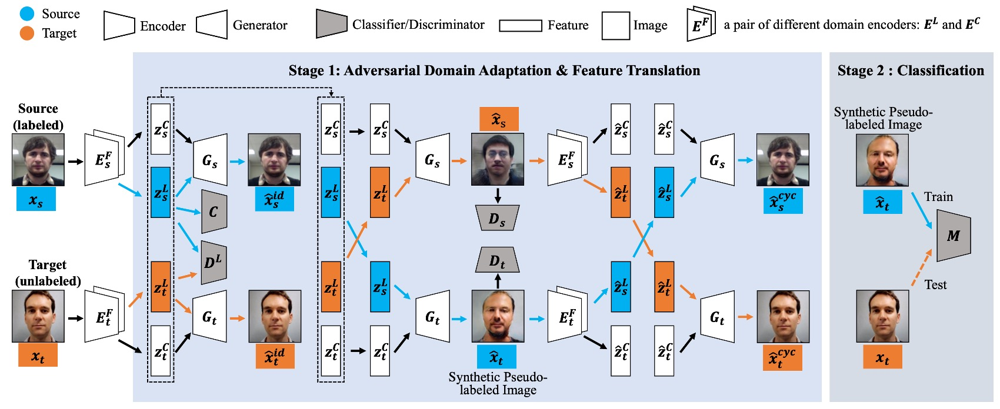
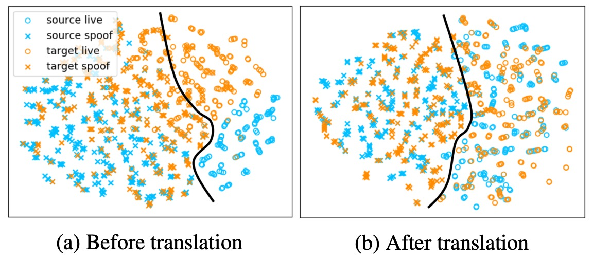

## スタイルの絡み合い

[**Cyclically Disentangled Feature Translation for Face Anti-spoofing**](https://arxiv.org/abs/2212.03651)

---

SSAN が FAS 領域に「スタイル」の概念を導入した後、多くの研究者がこの問題に注目し始めました。

その後、いくつかの研究が続き、この論文にも進展が見られます。

## 問題の定義

Face Anti-Spoofing（FAS）は単純な分類問題ではなく、活体認識技術の成否を左右する重要な分岐点です。

一方には、生身の顔があり、血肉と呼吸が存在します。もう一方には、高解像度の写真、再生されたビデオ、シリコン製の偽マスクがあります。

初期の方法は手作業で特徴を抽出するもので、例えば LBP、HOG、SIFT といった名前はかつて輝いていました。後に CNN に置き換えられ、ImageNet で事前訓練された VGG や ResNet から、より深く、広い構造へと進化しました。いくつかの方法は LSTM を使って時間的な要素を取り入れたり、材料学的な視点を導入したりしました。

しかし、方法がどう変わっても、解決されない問題があります：

> **データセットを変えると、モデルは役に立たなくなる。**

撮影装置、環境光源、文化的な背景が変わると、活体認識モデルはまるで乱れた羅針盤のように、正しい方向を指し示せません。

そこで、Domain Generalization（DG）が登場しました。私たちは、モデルに抽象的な「活体の意味」を学習させたいと考えていますが、DG の方法はしばしば複数のラベル付きドメインに基づいています。しかし、このようなリソースは実際のシナリオではあまり見かけません。

もう一つ、より実用的な設定は Unsupervised Domain Adaptation（UDA）で、これはラベル付きのソースデータとラベルなしのターゲットデータを使います。

UDA の方法は大きく分けて 3 種類です：

1. 特徴の整合性を取ることで、ソースとターゲットの分布差を最小化する。
2. 敵対的訓練を使って、ソースデータの特徴を隠す。
3. 画像変換を行い、ソースデータをターゲットデータに似せる。

これらはすべて有効ですが、いずれも次の問題を抱えています：

> **「意味とスタイルの絡み合いを本当に解きほぐしていない」**

これらの方法は通常、強制的な整合性や生成を行いますが、どんな方法でも、最終的にはどこかの段階で意味の完全性が犠牲になっています。

では、もし活体と非活体の違いが「意味」に由来し、ドメインの違いが「スタイルと背景」に由来すると認めるならば、ドメインの枠組みを真に変革するモデルを設計することができるのでしょうか？

## 解決策

<figure style={{"width": "90%"}}>

</figure>

この論文では、**Cyclically Disentangled Feature Translation Network**（以下、**CDFTN**）というアーキテクチャを提案しています。

図から伝わってくる圧迫感はすさまじいものです。一見複雑に見えますが、実際にもその通りです。

著者の目的は、真偽の顔分類を直接行うことではなく、まず「顔のさまざまな側面における潜在的特徴を解きほぐし」、それらを「異なるドメインの違いを越えて表現できる形に再構築する」ことです。

このプロセスは 2 つの段階に分かれます：

1. **第 1 段階：特徴の解きほぐし、ドメイン間変換、新しい画像の生成**
2. **第 2 段階：第 1 段階で生成された画像を使用して最終的な分類器を訓練する**

この方法の核心となる概念は、各顔を 2 つのサブスペースに分解することです：

- **活体空間（Liveness Space）**：活体と偽装の意味的特徴に対応（ドメインを越えた安定性を持つことを目指す）
- **内容空間（Content Space）**：デバイス、照明、背景など、ドメイン固有の情報を含む（干渉やノイズとして扱われる）

ここから、少し対抗学習の背景が必要となりますが、あなたがすでに GAN の達人であることを前提に、次を見ていきましょう。

## 第 1 段階

### 特徴の解きほぐしと対抗学習

まず、Encoder と Discriminator の対抗が行われます。各ドメイン（ソース／ターゲット）には 2 つのエンコーダが存在します：

- $E_L$：活体特徴を抽出するためのエンコーダ
- $E_C$：内容のスタイルを抽出するためのエンコーダ

$E_L$が活体判断に関連する情報に集中し、「どのドメインから来たか」の差異を隠すために、著者は**対抗学習**を用いて$E_L$に「ソースかターゲットかを判別できない」潜在ベクトル$z^L$を生成させます。その損失関数は次のように書けます：

$$
\min_{E_L} \max_{D_L} \mathcal{L}_{D_L} =
\mathbb{E}_{x^s \sim P_S}[\log D_L(E_L(x^s))] +
\mathbb{E}_{x^t \sim P_T}[\log(1 - D_L(E_L(x^t)))]
$$

ここで$D_L$は判別器で、入力された$z^L$がソースから来たのか、ターゲットから来たのかを判断します。$E_L$は$D_L$を「騙す」ようにして、両ドメインから抽出される活体特徴を区別できないようにします。

### 活体情報を保つ分類器

$E_L$が抽出する活体特徴が真偽の顔を正しく判別できることを保証するため、著者はソースドメインに分類器$C$を追加し、標準的なクロスエントロピー損失を使用して訓練しました：

$$
\mathcal{L}_{cls} = -\mathbb{E}_{(x^s, y^s)} [y^s \log C(E_L(x^s))]
$$

これにより、ソースから抽出された活体ベクトル$z^L$は、ドメイン情報を隠しながらも、「真顔/偽顔」を識別するための重要な要素を保持します。

### クロスドメイン生成とスタイルの再構築

この部分が**CDFTN**の売りです。

第 1 段階では、モデルは活体特徴を抽出するだけでなく、「異なるドメイン間で活体特徴と内容特徴を交換」することによって、新しい「偽ラベル画像」を生成しなければなりません。

このようにする理由は、実際のアプリケーションでは、ソースとターゲットに顕著な差異があることが多いため（例：カメラブランド、撮影環境、光源など）、ソースのデータだけで訓練すると、ターゲットに対して一般化できないからです。

このクロスドメイン再構築の方法を使うことで、モデルはさまざまなスタイルの潜在的な変化を「見る」ことができ、利用可能な訓練データを増やし、最終的に学習された活体判定のドメイン間の安定性を高めます。

まず、ソースとターゲットでそれぞれ次のように取得します：

$$
(z^L_s, z^C_s) = (E_L(x^s), E_C(x^s)), \quad
(z^L_t, z^C_t) = (E_L(x^t), E_C(x^t)).
$$

ここで$z^L$は「活体空間」で真偽顔判定に最も関連する特徴を表し、$z^C$は各ドメインで比較的独特なスタイル情報（例：デバイス影響、背景、光線特性など）を表します。

次に、上記の二つのドメインの潜在ベクトルを交換し、「偽ラベル画像」を生成します：

$$
\hat{x}^t = G_t(z^L_s, z^C_t), \quad
\hat{x}^s = G_s(z^L_t, z^C_s),
$$

ここで$G$は対応するデコーダーです。活体特徴$z^L$と内容特徴$z^C$を組み合わせて、ピクセル空間に復元します。言い換えれば、$\hat{x}^t$は「ソースの活体特徴」と「ターゲットドメインの内容スタイル」から合成された新しい画像であり、$\hat{x}^s$はその逆です。

この方法の意味は、もし元の真偽顔の意味（$z^L$によって）を保持し、スタイル面でターゲットドメインに近づけることができれば、「ターゲットに非常に似ているが、依然として真顔または偽顔の意味を持つ」追加の訓練画像を得ることができるということです。これらの画像は後で分類器に提供され、ターゲットドメインでより良い識別を学習するために使用されます。

$\hat{x}^s$と$\hat{x}^t$の品質（例えば、画面のリアルさや対応ドメインスタイルの一貫性）を保証するため、著者はピクセル層に画像判別器$D$も追加しています。この判別器は一般的な GAN と同様、どれが「本物の画像」で、どれが「特徴を交換して生成された画像」かを区別できるようにします。対応する敵対的損失は次のようになります：

$$
\mathcal{L}_{adv} =
\mathbb{E}_{x}[\log D(x)] +
\mathbb{E}_{\hat{x}}[\log(1 - D(\hat{x}))].
$$

もし判別器が生成された画像が「偽物だ」と認識できれば、それは生成品質に不足があることを意味します。したがって、ジェネレーター$G$は生成サンプルのリアリズムを高め、判別器$D$を「騙す」ようにします。このプロセスを通じて、$\hat{x}^s$と$\hat{x}^t$は見た目が本物の画像に近づき、各ドメインのスタイルにも一致するようになります。

### 一貫性損失

スタイル変換の過程で、**活体特徴**や**元画像内容**が混乱したり失われたりすることを防ぐために、著者はさらに 3 つの一貫性損失を追加して制約を強化し、交換後の画像が対応する「真/偽」の意味を失わず、不要なスタイルの歪みを生じないようにしています。

1. **再構築損失 $\mathcal{L}_{re}$**

   クロスドメイン交換を行わない場合（つまり、同じ画像の$z^L$と$z^C$を同じデコーダに戻す場合）、元の画像を再構築できるはずです。再構築誤差が高ければ、エンコーダまたはデコーダがその画像を正しく抽出または復元できていないことを示し、訓練中に罰せられる必要があります。

2. **周期的損失 $\mathcal{L}_{cyc}$**

   CycleGAN の概念を参考にして、$\hat{x}$（交換後の画像）を対応するエンコーダに再度渡し、$(z^L, z^C)$を抽出した後、元のドメインに戻して、「元の画像とできるだけ一致する」結果を再構築することを要求します。この「往復」のメカニズムは、クロスドメインプロセスで不可逆的な情報損失を防ぎます。

3. **潜在空間損失 $\mathcal{L}_{lat}$**

   主に、クロスドメイン交換後、活体特徴$z^L$が重大な変形を起こさないことを保証するために使用されます。例えば、「真顔」であった場合、クロスドメイン後に多重変換を経ても理論的には「真顔」の意味を保持すべきであり、スタイル交換やノイズ操作で破壊されてはいけません。この損失は、モデルが活体特徴を適当に変更せず、交換前後の意味の一貫性を維持するように制約します。

これらのステップを総合すると、閉ループの特徴翻訳プロセスが形成されます：**分解から交換、対抗学習と一貫性損失で補正して、最終的に「リアル感があり、真偽顔の意味を効果的に保持する」偽ラベル画像を得る**。これらの画像は、第二段階でさらに活用されます。

## 第二段階

第 1 段階が完了した後、著者は**生成構造全体を固定**し、前に生成された「偽ラベル画像」$\hat{x}^t$を使用して最終的な分類器$M$を訓練します。
文中では 2 種類の設計が比較されています：

- **LGSC（Feng et al., 2020）**：マルチタスク設計（分類 + 回帰 + トリプレット）。
- **ResNet-18**：二項分類のみ。

LGSC を使用する場合、最終的な損失は次のように書けます：

$$
\mathcal{L}_{stage2} = \alpha_1 \mathcal{L}_a + \alpha_2 \mathcal{L}_r + \alpha_3 \mathcal{L}_{tri},
$$

ResNet-18 を使用する場合、二項分類の部分のみが残ります。

---

これが最近読んだ中で最も複雑な論文の一つかもしれません。全体的に、CDFTN の核心となる考え方は：

1. **まず活体意味とドメインに関連する内容を解きほぐし**、対抗学習を用いて活体特徴のドメイン間一致性を保証する。
2. **次に 2 つのドメインの特徴を交換**し、クロスドメイン生成で「偽ラベル画像」を作り出す。
3. **最後にこれらの偽画像を補助データとして使い**、より堅牢な最終分類器の訓練を行う。

方法論としては、確かに複雑ですが、その出発点は非常に直感的です：同じ顔の「真/偽」判定はカメラブランドや光線条件などの差異に左右されるべきではない。したがって、まず「活体」の意味を抽出し、ドメインの違いを内容空間に帰し、その後クロスドメインシナリオでより一般化し、正確な活体検出を実現するのです。

## 討論

本論文は、クロスドメイン顔認識の状況下で、**単一ターゲットドメイン変換（SS2ST）** と **多ターゲットドメイン変換（SS2MT）** を通じて **CDFTN** の効果を検証しました。

著者は以下の 4 つの一般的なクロスドメイン FAS データセットを使用しました：

- **CASIA-MFSD** (C)
- **Replay-Attack** (I)
- **MSU-MFSD** (M)
- **Oulu-NPU** (O)

**単一ターゲットドメイン**の設定では、1 つのソース（全データを含む）と 1 つのターゲット（そのトレーニングセットを含む）を選んで実験を行いました。

そのため、12 のテストシナリオが考えられます：

- C → I, C → M, C → O
- I → C, I → M, I → O
- M → C, M → I, M → O
- O → C, O → I, O → M

**多ターゲットドメイン**の設定では、C, I, M, O の 4 つのデータセットから 1 つをソースとして選び、残りの 3 つをアンラベルターゲットとして使用しました。

全体で 4 つのシナリオがあります：

- C → I & M & O
- I → C & M & O
- M → C & I & O
- O → C & I & M

最後に、評価指標として著者は以下の 2 つの一般的な定量的指標を使用しました：

1. **HTER（Half Total Error Rate）**：

   $$
   \mathrm{HTER} = \frac{ \mathrm{FRR} + \mathrm{FAR} }{2},
   $$

   ここで、$\mathrm{FRR}$は誤拒否率、$\mathrm{FAR}$は誤受け入れ率です。

2. **AUC（Area Under the Curve）**：高いほど分類器が真顔と偽顔を区別する能力が高いことを示します。

### 他の方法との比較

著者は**CDFTN**を他のクロスドメイン学習法と比較し、その結果を上記の表に示しています：

- 全体的に、CDFTN はほとんどのクロスドメインテストシナリオで**HTER を大幅に低減し、AUC を向上させました**。
- 唯一、**CASIA → Oulu**のシナリオで、パフォーマンスの向上が顕著ではありませんでした。著者はその主な理由として、**Oulu**データセットには多くの攻撃手法（2 種類のプリンターと 2 種類のスクリーンデバイス）があり、元の画像の解像度が非常に高い（1920×1080）ため、縮小後にぼやけが生じたことを推測しています。

このように、単純にドメイン適応を行うだけではこのような顕著な効果は得られません。CDFTN は**特徴翻訳**を通じてターゲットドメインの特徴を効果的に抽出し、より一般化され、安定した活体表現を学習することができます。

### 多ターゲットドメイン特徴変換

<figure style={{"width": "70%"}}>

</figure>

著者は 3 つの異なる設定を比較しました：

1. **SS2ST**：単一ターゲットドメイン；
2. **SS2BT**：複数のターゲットドメインを直接「混合」して SS2ST として扱う；
3. **SS2MT**：各ターゲットドメインに対して個別にサブネットワークを学習し、ターゲットドメインの変換と生成画像を統合して使用する。

結果として、**SS2MT**は**SS2BT**に比べて明らかに優れており、**SS2ST**の平均的なパフォーマンスよりも良好でした。

これは、複数のサブドメインに直面した場合、単一のエンコーダを使用してすべてのターゲットを 1 つの整体として扱うと、ターゲットドメイン内の差異が大きすぎてパフォーマンスに影響を与えることを示しています。

SS2MT は各サブドメインを個別に学習することで、各サブドメインの活体特徴をより広範囲に取り込むことができ、全体的により安定した結果を得ることができます。さらに、SS2MT を使用することで、**1 回のトレーニングプロセス**で複数のターゲットドメインに対応できるため、全体的な効率も向上します。

### アブレーション実験

<figure style={{"width": "90%"}}>

</figure>

著者はさらに 4 つの主要設計を順に削除し、2 つの分類器（LGSC と ResNet-18）でテストしました。

結果から以下のことがわかります：

1. **$L_{cls}^L$**（ソースでの活体分類器のクロスエントロピー損失）を削除すると、パフォーマンスが低下し、$z^L_s$が活体判別能力を保持しなければ、モデルが本当に識別可能な活体特徴を抽出するのが難しくなることが示されています。
2. **$L_{cyc}$**（サイクル整合性）を削除すると、モデルは閉ループ翻訳の制約を失い、クロスドメインで意味的な漂流が発生しやすくなります。
3. **$L_{re}$**（自己再構築損失）を削除すると、モデルは元の画像を正確に復元する能力を失い、エンコーダとデコーダの基本的な制約を失います。この実験結果はパフォーマンスにかなり顕著な影響を与えることがわかります。
4. **$L_{lat}$**（潜在空間整合性）を削除すると、活体特徴が再構成過程で変形または失われる可能性が高まり、同様に結果が悪化します。

全体的に、これらの損失は完全なアーキテクチャにとって不可欠であることがわかります。特に**$L_{re}$**が最終的な効果に最も大きな影響を与え、次いで**$L_{lat}$**が重要です。

### 視覚化分析

<figure style={{"width": "70%"}}>

</figure>

上の図は、著者による**CDFTN**の視覚化分析です。t-SNE を使用して特徴空間を 2D に次元削減し、異なるドメインのサンプルを異なる色で示しました。

左側は特徴翻訳前、右側は特徴翻訳後の分布を示しており、特徴翻訳後は異なるドメインのサンプルがより重なり、決定境界がより明確になっていることがわかります。これはクロスドメインの特徴の差異が効果的に縮小されたことを示しています。

## 結論

FAS の研究の中で、「スタイル」という言葉の重要性は次第に増してきました。

最初は干渉因子として見なされていましたが、後に認識の一般化失敗の重要な解釈となり、さらにモデリングの明示的な次元として組み込まれ、スタイル（style）と意味（semantics）との関係がこれまでの方法論の核心を形成してきました。

そして、CDFTN はこの経路上の重要な節目となるものです。

それは単に意味とスタイルを解きほぐすだけでなく、さらに重要なのは、この解きほぐしを生成メカニズムの一部として転換し、クロスドメインの偽ラベルサンプルで分類器を訓練し、意味駆動型のスタイル再構築プロセスを構築しようとしています。

「ドメインシフトにどう対抗するか」という研究方向と比較すると、スタイルの存在をどう尊重し、モデルにそれと共存させる方法を学ばせることも重要な課題です。
