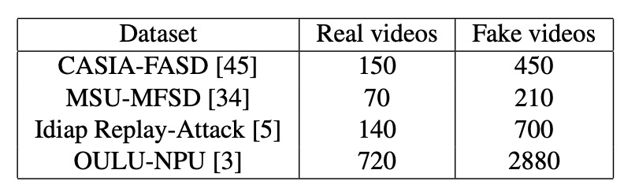
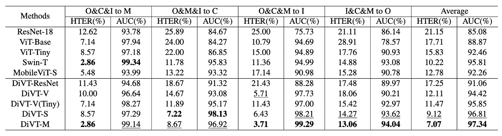
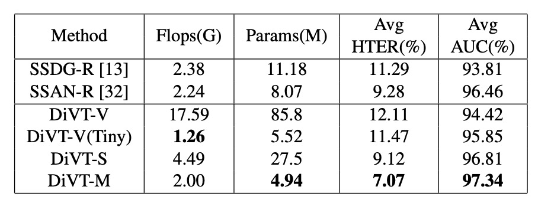

## オールスター選手権

[**Domain Invariant Vision Transformer Learning for Face Anti-spoofing**](https://openaccess.thecvf.com/content/WACV2023/papers/Liao_Domain_Invariant_Vision_Transformer_Learning_for_Face_Anti-Spoofing_WACV_2023_paper.pdf)

---

台湾の主要な大学が著者に名を連ねる論文を見かけることはめったにない。

台大、成大、清華、高師大……ん？ それに玉山銀行まで。

## 問題定義

前の章で Domain Generalization（DG）について多くを話しましたが、この論文はその概念を CNN アーキテクチャから Transformer に拡張する架け橋となります。

新しい時代のアーキテクチャは、先人の意志を引き継ぎ、さらに進化していきます。

現行の DG-FAS ソリューションを振り返ると、大きく 2 つの方向性に整理できます。

**1 つ目は、「真顔」をお互いに近づけることです。**

どのドメインから来たものであれ、真顔はある種の内的な「生体的」パターンを共有すべきです。特徴空間の中で、異なる世界からの本物のサンプルは、同じ意味的な塊に集約されます。このアプローチのキーは、異なるシーン間で安定したアンカーを確立することです。

**2 つ目は、「攻撃タイプ」を分割することです。**

異なる攻撃手法は異なる偽装戦略を持ち、視覚的な特徴も異なります。これらの特徴は学習過程で分離され、モデルが混乱し、誤判断しないようにします。

その結果、特徴空間は次のような形になります：

- 真顔は中心に集まり、整列の中心として機能します。
- 各種の偽顔は境界に散らばり、互いに区別されます。

実際の実装では、これらの手法の多くは依然として CNN アーキテクチャに基づいています。例えば、SSDG は単方向の敵対的学習を用いて真顔の特徴を安定させ、ANRL はノーマライゼーションの論理を変更してドメインシフトに対抗し、SSAN はスタイルとコンテンツを分離して跨ドメインのコントラスト学習を行っています。また、FGHV のような生成的手法もあり、高斯分布仮定を使って真実の顔に近づけています。

精緻な設計で効果的ではありますが、その背後には複雑な学習メカニズムと高いリソースコストがあります。

これらすべての努力の前提には共通の仮定があります：

> モデルは目標ドメインのデータを一切見たことがない。

この条件は厳しいものの、実際のアプリケーションに近いものです。現実の世界では、すべての変数を集め終わるのを待つことはありません。代わりに、これまで一度も見たことのない例外的な状況を突然投げかけ、その場でモデルに答えを出させます。

これこそ、なぜ Transformer に注目が集まっているのかという理由です。

CNN と比較して、Transformer は広い受容範囲と柔軟な関係モデル化能力を持ち、長距離の意味的変異が充満する跨ドメイン学習のシーンにおいて理論的に有利です。

しかし、現在 FAS に使用される Transformer の試みはまだ限られており、ViT を直接使用するものや、教師モデルとして使うもので、学生側は CNN に戻るものが多いです。ほとんどの設計は、ドメイン一般化に特化した調整を行っていません。

では、跨ドメイン一般化が可能な本物の Transformer を設計するには、どこから始めればよいのでしょうか？

## 解決策

この論文の核心となる主張は非常にシンプルです：

軽量で十分に賢い Transformer アーキテクチャを使って、「真実」を一つにまとめ、「攻撃」を分けることです。

### モデルアーキテクチャ

<figure style={{"width": "90%"}}>

</figure>

全体の方法は MobileViT をベースにしています。これは CNN と Transformer を組み合わせたハイブリッドアーキテクチャです。

:::tip
MobileViT を知らない？ 以前のノートを参考にしてください：

- [**[21.10] MobileViT: 設計変更による畳み込みカーネルの変更**](../../lightweight/2110-mobilevit/index.md)
  :::

MobileNet-v2 が最初のダウンサンプリングと特徴抽出を担当し、MobileViT ブロックは局所的な畳み込みと全域的な注意を接続して、モデルが顔の詳細と全体構造を同時に捉えることを可能にします。この設計は効率性と表現力を兼ね備え、リソース制限のあるシーンに適しています。

跨ドメイン一般化の第一歩は、「異なるシーンでの真顔」をモデルに共通認識させることです。

仮に、$K$個のドメインからなるデータセット$D_1, D_2, \ldots, D_K$があり、各データセットには真顔といくつかの攻撃サンプルが含まれているとします。

著者は、すべての真顔を次のように結合します：

$$
D_R = \bigcup_{k=1}^K D^\text{real}_k
$$

次に、Transformer バックボーンを使ってこれらのサンプルを特徴空間にマッピングし、一組の埋め込みベクトルを得ます：

$$
E_R = \pi(D_R)
$$

著者の方法は、原点$[0]^d$を真顔の中心として直接使用し、シンプルな$\ell_1$ノルム損失を設計して、これらの特徴を原点に向かって引き寄せます：

$$
\mathcal{L}_\text{DiC} = \frac{1}{N} \sum_{i=1}^N \mathbb{1}[x_i \in D_R] \cdot \|\pi(x_i)\|_1
$$

このアイデアは Center Loss に似ていますが、異なる点は、中心点を動的に更新する必要がないこと、また各クラスに対してセンターを割り当てる必要がないことです。この設定では、真顔は一つのクラスであり、攻撃には予測される数や種類がありません。

概念的には次の図のように、異なるドメインの真顔が空間の中心に集中し、攻撃サンプルは無視されます。

<figure style={{"width": "60%"}}>

</figure>

真顔を引き寄せた後、次のステップは偽顔を押し離すことです。

各攻撃タイプに対して、異なるドメインからのデータを 1 つのクラスにまとめます：

$$
D^c = \bigcup_{k=1}^K D^c_k, \quad c \in \{1, \ldots, C\}
$$

その後、分類ヘッドを追加して、入力サンプルを$C+1$のクラス分類（真顔 + 各種攻撃）に分類します。

ここでのクロスエントロピー損失は次の通りです：

$$
\mathcal{L}_\text{DiA} = -\frac{1}{N} \sum_{i=1}^N \sum_{c=0}^{C} \hat{y}^c_i \log y^c_i
$$

ここで$\hat{y}^c_i$は one-hot ラベル（c=0 は真顔を示す）、$y^c_i$はモデルが出力する各クラスの softmax 結果です。

この分類器の役割は、攻撃タイプを「識別する」だけでなく、潜在空間内で真偽サンプルの配置をさらに引き裂くことにあります。これにより、攻撃サンプルが互いに離れ、真顔と距離を保ちながら、跨ドメインでのデカップリング能力が強化されます。

最終的な損失関数は、両者の加重組み合わせです：

$$
\mathcal{L}_\text{total} = \mathcal{L}_\text{DiA} + \lambda \mathcal{L}_\text{DiC}
$$

推論段階では、分類ヘッドでの真顔に対する予測確率のみが出力として使用され、追加のモジュールは必要ありません。

全体の方法は、対抗的学習を導入することなく、スタイル分割や特徴生成に依存することなく、直感的な 2 つの目標関数と軽量化可能なアーキテクチャを使って、安定した効果的な一般化を実現します。

## 討論

著者は、4 つの一般的な FAS 公開データセット（CASIA-FASD、MSU-MFSD、Replay-Attack、OULU-NPU）を使用してテストを行いました。

これらのデータセットは、それぞれ異なる撮影装置、攻撃手法、照明条件からのものであり、明確なドメイン差異があり、汎化能力を評価するために代表的なテストシナリオとなります。

DG-FAS の慣例に従い、Replay-Attack と OULU-NPU の訓練とテストセットは分けて使用され、検証セットは使用しません。その他のデータセットはすべて実験に含まれています。

これらのデータセットに含まれる実際の画像と攻撃画像の数は以下の表にまとめられています。読者はまずこの表を見て、データの割合やデータ密度の違いを理解することをお勧めします。これが後のモデル間のパフォーマンス比較に役立ちます。

<figure style={{"width": "50%"}}>

</figure>

評価指標には 2 つの一般的な指標が使用されました：

- **HTER（Half Total Error Rate）**：低いほど良い。異なる種類の誤り間で良好なバランスを達成していることを示します。
- **AUC（Area Under the Curve）**：曲線下の面積、より高いほど安定していることを示します。

### 実装の詳細

すべての画像は MTCNN で整列と切り抜きが行われ、統一的に$256 \times 256$に調整されました。

モデルには**MobileViT-S**バージョンをバックボーンとして使用し、ImageNet-1K の事前学習を利用。オプティマイザーには Adam を使用し、学習率は$10^{-4}$、ウェイト減衰は$10^{-6}$に設定されています。2 つの損失関数のバランス係数 λ は 0.2 に設定されています。

### Leave-One-Out テスト結果

<figure style={{"width": "90%"}}>

</figure>

上表は、leave-one-out 設定でのパフォーマンスを示しています。この設定では、4 つのデータセットのうち 3 つを訓練データとして使用し、残りの 1 つをテストデータとして使用し、モデルが全く新しいドメインに遭遇する状況をシミュレートします。

ほとんどの手法はフレームベースであり、この論文の手法もその一つです。唯一の例外は**NAS-FAS**で、これは動画信号に基づいており、理論的に追加の時間的手がかりを持っています。

この厳しいテストにおいて、**DiVT はすべての設定で HTER が既存の SOTA 方法より優れており**、2 つのテスト組み合わせでは 3%以上の改善が見られました。

唯一の例外は、AUC 指標の I&C&M to O で、ここで NAS-FAS がわずかに勝りました。しかし、この方法は動画ベースであり、純粋な画像ベースの方法とは異なるレベルの比較です。

### 小サンプル設定

<figure style={{"width": "70%"}}>

</figure>

通常の leave-one-out 設定に加えて、著者は**限られた訓練データ設定**をテストしました。この設定では、MSU-MFSD と Replay-Attack のみを訓練データとして使用し、残りをテストデータとして使用します。

このような設定は、実際のデプロイ時のデータ制約に近いものです。

強化版のベースラインである SSDG-R や SSAN-R と比較すると、上表はほとんどのシナリオで DiVT が優位性を保っていることを示しており、特に AUC 指標で安定したパフォーマンスを発揮しています。いくつかの HTER 指標では若干劣っている部分もありますが、全体的には優れたドメインシフト耐性を示しています。

## 消融実験

次の分析では、3 つの問題に焦点を当てています：

1. 異なる Transformer アーキテクチャのパフォーマンス差はどの程度か？
2. 設計した 2 つの損失関数はどの程度効果があったのか？
3. 分類ロジックを変えた場合、結果は良くなるのか、それとも悪くなるのか？

### 異なるアーキテクチャの比較結果

<figure style={{"width": "90%"}}>

</figure>

結果は上表の通りです。上半分は、バイナリクロスエントロピー損失のみを使用した各アーキテクチャのパフォーマンスで、下半分は、設計した損失関数を組み合わせた結果です。

いくつかの重要な違いが見られます：

- Transformer アーキテクチャ（DiVT-V/S/M）は一般的に CNN（ResNet-18）より優れており、ドメイン間のタスクでは、全体的な注意力と長距離依存の特徴が局所的な畳み込みよりも有利であることが示されました。
- すべての Transformer の中で、**MobileViT（DiVT-M）が最も優れたパフォーマンス**を示しています。これにより、局所的特徴を保ちながら全体の関係を統合でき、モデルは小さく学習が速く、現実のシナリオに非常に適しています。
- ViT-Base は最も低いパフォーマンスを示しました。著者は、これは ViT が局所的なパターンのモデリング能力に欠けており、パラメータ数が多すぎて、データ規模が限られたタスクには適していない可能性があると推測しています。
- ViT-Tiny に変更すると、結果が改善され、これは「モデルのサイズはデータ規模に合わせるべきだ」ということをさらに証明しています。

MobileViT の成功はもう一つの事実を証明します：**畳み込みは無駄ではない、むしろ適切な場所で使うべきだ**ということです。

### 損失関数の組み合わせ効果

<figure style={{"width": "90%"}}>

</figure>

次に著者は、方法内の 2 つの主要な損失関数（DiC 損失と DiA 損失）の組み合わせをテストし、それぞれ単独使用、使用しない、同時使用の効果を比較しました。

観察結果として：

- **DiA（分類損失）が主な貢献者**で、AUC が平均約 3.7%向上しました。
- **DiC（真顔を近づけること）も安定的に向上し、約 1.3%の AUC 増加が見られました**。
- **両者を組み合わせた場合が最適**で、「空間集中」と「意味的分離」の戦略が相互に補完し、協調的に機能することが証明されました。

### 分類ロジックを変えると良くなるか？

<figure style={{"width": "90%"}}>

</figure>

著者は、分類タスク自体の設計が結果にどのように影響するかを探りました。バイナリ分類（真顔 vs 偽顔）に加えて、以下の設定もテストしました：

- ドメイン別分類（真顔 + 各ドメインの偽顔）
- 攻撃タイプ別分類（真顔 + 各種攻撃タイプ）
- ドメインと攻撃の組み合わせ分類

結論は明確です：**攻撃タイプ別分類が最も効果的**で、他の方法は過学習を引き起こしたり、曖昧にしたりする可能性が高くなります。

これは、DiVT 方法の「真顔を統一し、偽顔を分割する」という空間戦略が、従来のドメインラベルベースの設計よりも安定していることを検証するものです。

### adversarial loss を追加した場合？

一部の人は、なぜ SSDG や SSAN の adversarial loss を追加しなかったのかと尋ねるかもしれません。

実験の結果、adversarial loss を加えても顕著な効果は見られず、時にはわずかに悪化することもありました。推測される理由は次の通りです：

- DiVT の特徴空間はすでに十分に安定しており、追加の競争が必要ない
- Transformer における adversarial learning の最適な実践はまだ成熟していない

### 計算リソースの比較

<figure style={{"width": "70%"}}>

</figure>

最後に著者は、各モデルのパラメータ数と FLOPs を比較しました。結果、DiVT-M は性能と効率の間で最良のバランスを取っていることが示されました。

ViT-Tiny は FLOPs が少ないですが、パラメータ数が多く、MobileViT ほどの効果はありません。これにより、**DG-FAS に最適なアーキテクチャは軽いだけでなく、空間的な規則を捉える能力が必要であること**が示されています。

## 結論

このようなドメイン一般化を推進する手法は、もはや「モデルのパフォーマンス」だけでなく、「方法論」の選択問題になっています。

この論文は、対抗的な訓練の複雑な駆け引きには進んでおらず、視覚的な手がかりを強化するために合成データにも頼っていません。逆に、空間を直線的に引き、特徴座標系内でキャラクターを明確に配置するという、ほぼ幾何学的な抽象処理を選択しました。

技術的なレベルを超えて、この設計思想は現実のデプロイメントに対する感度も反映しています：

> **多モーダルを積み重ねるのではなく、重いアーキテクチャに頼るのでもなく。ちょうど十分で、リズムを保つことのできるその臨界点を見つけること**。

今後の課題は、ドメインと攻撃の交差次元がますます複雑になるでしょう。このようなシンプルで明快な表現戦略が、問題空間を再整理するための出発点となるかもしれません。
