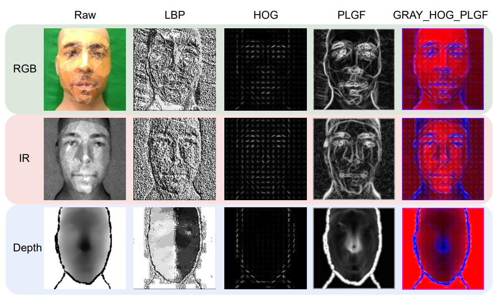

## 舉一反三

[**Rethinking Vision Transformer and Masked Autoencoder in Multimodal Face Anti-Spoofing**](https://arxiv.org/abs/2302.05744)

---

私たちはこれまで論文を見てきた中で、人顔認識システムがしばしば攻撃されることがあることを理解してきました。

高精度で使いやすいものの、人顔認識の核心的な問題は変わりません：画面上に映っている顔が人間なのか、それとも写真なのか、結局分からないのです。

## 問題の定義

過去 10 年間、LBP から CNN、単一モーダル RGB から多モーダル融合（RGB、IR、Depth など）に至るまで、私たちは顔認識における偽顔検出システムを構築してきました。しかし、手作りの特徴量や深層学習モデルが「新しい攻撃」や「未見のシーン」に直面すると、依然として一般化能力の壁にぶつかってしまいます。

この問題を解決するために、多モーダルが一つの解決策となりました。

特に高リスクなシーン（例えば顔認証決済や金庫のアクセス管理）では、RGB の映像だけでは情報が不足しがちです。IR、深度情報、さらには熱画像などが異なる次元の生体の手がかりを提供してくれるのです。

しかし、問題がまた発生します。

Vision Transformer（ViT）が登場したことで、多くの人がこれを FAS に適用しようとしています。その理由は簡単です：

- **ViT の長距離のモデリング能力、クロスモーダルの拡張性は、CNN の盲点を補うように見えます。**

そのため、微調整したり、追加のモジュールを加えてクロスモーダル能力を強化したりすることで、効果が見られることがあります。

ただし、私たちは本当にその本質を理解しているのでしょうか？

- **ViT は本当にこのような多モーダルタスクに適しているのでしょうか？**
- **なぜ、元々 ImageNet で素晴らしいパフォーマンスを発揮していた事前学習が、ここでは少し適応しきれていないのでしょうか？**
- **ImageNet を使わずに、独自に ViT を訓練する場合、どのようにすればオーバーフィッティングを避けることができるのでしょうか？**
- **モダリティ間の微妙な違い、ViT はそれを捉えていますか？**

著者の問題は、単なるモデル訓練戦略の最適化にとどまらず、もっと基本的な質問に戻ります：

> **私たちは本当に ViT を使って FAS を解決する方法を理解しているのでしょうか？**

## 解決策

問題の本質を理解した後、著者は ViT が多モーダル FAS においてどのように機能するかについて、3 つの重要な側面（入力データ形式、微調整戦略、事前学習方法）に対応する設計を提案しています。

順を追って見ていきましょう。

### 入力データ

ViT は全体のモデリングが得意ですが、局所的な細部に対する感度が欠けています。

FAS タスクにおいて、顔の真偽を識別するための重要な要素はしばしば微妙なエッジのテクスチャや高周波の詳細に隠れています。この時、CNN のように「小さな部分」を捉えるのが得意な特性が特に重要になります。

そのため、著者は ViT の盲点を補うために、3 つのクラシックな局所的特徴記述子を再利用しました：

- **LBP（Local Binary Pattern）**

  ピクセル間の強度差を使って二進法のエンコードを計算し、照明の変化に敏感ではなく、テクスチャの詳細を捉えるのが得意です。

  その式は次のようになります：

  $$
  \text{LBP} = \sum_{i=1}^{p} F(I_i - I_c) \cdot 2^{i-1}, \quad F(I) = \begin{cases}
  1 & I \ge 0 \\
  0 & \text{それ以外}
  \end{cases}
  $$

- **HOG（Histogram of Oriented Gradients）**

  エッジの方向分布を捉え、ブロック化された勾配統計ベクトルを使って画像構造を表現し、幾何学的および照明の変化に対するある程度の耐性があります。

- **PLGF（Pattern of Local Gravitational Force）**

  これは比較的マイナーですが、万有引力の法則にヒントを得て、局所的な引力分布を使ってエッジと輪郭の情報を強化し、ノイズや照明の変化に特に強いです。その式は次のようになります：

  $$
  \text{PLGF} = \arctan\left( \sqrt{ \left(\frac{I \times M_x}{I} \right)^2 + \left(\frac{I \times M_y}{I} \right)^2 } \right)
  $$

  ここで$M_x$、$M_y$は位置に基づいて設計された方向マスクで、物理的な引力分布を模倣しています。

具体的な視覚効果は次の図のようになります：

<figure style={{"width": "80%"}}>

</figure>

これら 3 つの特徴の視覚化効果を見ると、LBP の点状テクスチャ、HOG の方向分布、PLGF の輪郭再構築がそれぞれ異なる視点を提供しており、元のモダリティデータを補強するのに役立ちます。

著者はこれらの特徴を組み合わせ（例えば：GRAY + HOG + PLGF）て、ViT の 3 チャネル入力として使用することを試みました。このような手作りと深層特徴の組み合わせデザインは、多モーダル FAS において非常に効果的であることが示されています。

### モデルアーキテクチャ

<figure style={{"width": "90%"}}>

</figure>

この論文のコアとなるモデルアーキテクチャを詳しく見ていきましょう。

主幹は**事前訓練された ViT**で、全体の構造は**高い凍結、低い微調整**という意図的な設計がなされています：

- 最後の分類ヘッド$E_{\text{head}}$と、追加で挿入されたモジュール**AMA（Adaptive Multimodal Adapter）**のみが訓練に関与し、それ以外の ViT 構造は完全に元の形のまま保持されています。

AMA の役割は、元々単一モーダルしか扱えなかった ViT を、RGB、IR、Depth などの多モーダル入力を理解できるようにする「アダプター」です。

:::tip
アダプターの概念に不安がある場合は、以下の他の論文ノートを参照できます：

- [**[19.02] Adapter: パラメータ節約 96%**](../../model-tuning/1902-adapter/index.md)

:::

その構造設計は、上図に示された AMA モジュール内で 4 つのステージに分かれています：

1. **チャンネル圧縮 $\Theta↓$**

   各モーダルの入力トークンは、まず 1×1 の畳み込みを通して、元のチャンネル次元$D$を隠れ次元$D_0$に圧縮されます。この動作は、情報を濃縮し、後続のモーダル間での融合準備をするためです。

2. **局所モーダル融合 $\Theta_{2D}$**

   次に、圧縮された 3 つのモーダル特徴マップを再構築し、バッチ、チャンネル、高さ、幅の 3 次元空間に結合し、3×3 の 2D 畳み込みを通して空間融合を行います。このステップは、モーダル間の空間的な整列特性を十分に活用し、元の位置関係を維持したまま特徴を相互作用させます。

3. **動的モーダル重み $\Theta_{\text{Ada}} + \sigma$**

   異なるモーダルの寄与をシーンに応じて自動的に調整できるように、AMA は global average pooling（GAP）を使用して各モーダルのグローバル情報を抽出し、1×1 の畳み込みと Sigmoid 関数を通してモーダル重み$(w_{RGB}, w_{IR}, w_{Depth})$を出力します。これらの重みは、融合出力における各モーダルの影響力を調整します。

4. **チャンネル復元 $\Theta↑$**

   最後に、別の 1×1 畳み込みを通してチャンネル次元を$D_0$から$D$に拡張し、これらの融合されたモーダル特徴と処理されたクラストークンを組み合わせて、最終的に分類ヘッドに送るトークンベクトルシーケンスを作成します。

この設計にはいくつかの利点があります：

- **パラメータ効率が高い**：わずかなパラメータのみを微調整することで、オーバーフィッティングのリスクを低減
- **モーダル融合が精緻**：従来の単純な連結（concat）とは異なり、動的な加重と畳み込みによる融合を加えた
- **柔軟なモーダル組み合わせのサポート**：AMA は任意のモーダル組み合わせで動作可能（例えば、RGB+IR のみ）

言い換えれば、AMA は**低侵襲、高拡張性**のモーダル融合モジュールで、ViT の構造に特化して設計されています。これにより、凍結された ViT は底層を再訓練せずに、高次元の多モーダルな spoof（偽造）手がかりを処理できるようになります。

### 事前訓練方法

<figure style={{"width": "80%"}}>

</figure>

最後に、著者は ViT の事前訓練プロセスに新しいフレームワークを提案しています：**Modality-Asymmetric Masked AutoEncoder**、つまり本文のタイトルである M²A²E です。

従来の MAE は、画像をパッチに分割し、一部をランダムにマスクしてからモデルに復元させる方法ですが、多モーダルの状況では、これにいくつかの問題があります：

- すべてのモーダルのパッチがマスクされ、モデルは特定のモーダルに過度に依存しやすくなります
- モデルの目標は画像を復元することだけで、必ずしも活体判断のような「モーダル間の意味的関連」を助けるわけではありません

そこで、M²A²E はマスキングと復元のロジックを変更しました：

- 毎回ランダムに 1 つのモーダルを選んで入力として使用
- そのモーダルのトークンをマスク
- 同時にモデルには次のことを要求します：
  - マスクされたモーダルのパッチを復元（これは従来の MAE の部分）
  - 他のモーダルの完全な画像を復元（これが重要な革新点）

この設計は、モデルに「1 つのモーダルを使って他のモーダルの外観を予測する」ことを学ばせ、いわゆる「クロスモーダル再構築」を実現します。これには 2 つの大きな利点があります：

- モーダル間の意味的関連性をより強力にモデリングできる
- 「色の歪み」や「深度の欠落」といった spoof（偽造）の手がかりを捉えることができる

## 討論

### 実験結果

<figure style={{"width": "90%"}}>

</figure>

WMCA の実験では、著者は 2 つのシナリオを設計しました：

- 1 つはモデルがすでに攻撃タイプを見た場合（**seen protocol**）
- もう 1 つは全く新しい攻撃タイプ（**unseen protocol**）。

上の表は、これら 2 つのシナリオで**AMA と M²A²E がもたらす効果**をテストした結果を示しています。この表は 3 つの視点から解釈できます：

1. **AMA の役割は「強化器」**

   ベースラインの ViT と比較して、**AMA を追加した後のモデルは、すべてのモダリティ設定で ACER が顕著に低下**しました。元々 ViT は global な patch レベルの注意を処理するだけでしたが、AMA は局所的およびモダリティ間の相互作用を補完し、全体的な識別能力を向上させました。

2. **M²A²E の役割は「一般化器」**

   unseen 攻撃のテストシナリオでは、**M²A²E で事前訓練されたモデルが ImageNet で事前訓練されたバージョンよりも安定して**未知の spoof 攻撃に対応でき、特に IR と Depth モダリティで効果が顕著でした。これにより、M²A²E が移植可能な spoof 特徴表現を学習できたことが示されています。

3. **RGB+IR+Depth は最強のモダリティ組み合わせ**

   最後の三モダリティ組み合わせでは、AMA+M²A²E による ACER が**四モダリティの MCCNN モデルよりも優れている**ことが示されています。これは、適切なモダリティ選択とモジュール設計があれば、少ないセンサーでより良い結果を得ることができることを意味します。

:::tip
さらなる実験結果については、元の論文を参照してください。
:::

### ローカル特徴量は有用か？

ここでは、著者は IR モダリティに対していくつかの入力特徴量をテストしました：

- 単一特徴量：**LBP**, **HOG**, **PLGF**
- 組み合わせた入力：**HOG+PLGF**, **LBP+HOG+PLGF**, **GRAY+HOG+PLGF**

結果の主なポイントは次の通りです：

- **LBP が最も弱い**：どのモダリティでも、LBP のパフォーマンスは他の特徴量に遅れをとり、これは LBP があまりにも単純で、ViT の高次元モデリング要求をサポートするには不十分であるためと考えられます。
- **PLGF は安定して効果を発揮**：IR モダリティでは、PLGF を単独で使用するだけでも、元の入力を上回ることができることが示されました。
- **組み合わせが最強、特に GRAY+HOG+PLGF**：この組み合わせは IR モダリティで最良の結果を示し、**直接微調整するか、ConvAdapter を使った場合でも**、顕著に優れたパフォーマンスを示しました。

実験結果は、IR モダリティが光の変化に敏感であり、局所的なテクスチャと光照の不変性を補強する必要があることを示しています。これらのクラシックな手作り特徴量の組み合わせは、確かに ViT に有用な詳細を提供することができました。

### AMA は単なるパラメータ増加にすぎないか？

<figure style={{"width": "90%"}}>

</figure>

著者は、5 種類のアダプタ構造をテストし、どの設計が ViT-FAS に最適かを確認しました：

1. **バニラアダプタ**：主に全結合層（FC）
2. **ConvAdapter（単一モダリティ）**：FC の代わりに 2D 畳み込みを使用
3. **Multimodal ConvAdapter（圧縮版）**：異なるモダリティの特徴を融合し、2D 畳み込みを適用
4. **Multimodal ConvAdapter（全次元）**：出力次元にすべてのモダリティ積（D₀ × K）を保持
5. **Adaptive Multimodal Adapter（AMA）**

観察の主なポイントは次の通りです：

- **FC から Conv に変えることで顕著な改善が見られる**：局所的な受容野が ViT にとって強化され、干渉ではなく役立つことが示されています。
- **簡略化された Multimodal ConvAdapter は単一モダリティ版より優れている**：モダリティ融合が ViT 内で機能することが示されました。
- **全次元バージョンは逆にオーバーフィット**：高次元の融合が必ずしも良い結果を生むわけではないことが示されました。
- **AMA はこれらの方法の中で最もバランスが取れている**：モダリティ間の差異を保ちながら、異なる特徴源を効果的に加重しています。

したがって、結論として、ViT のモダリティ融合は畳み込みに依存していますが、無闇に次元を積み重ねてはいけません。AMA の加重融合方式が、現在の設計の中で最良の解決策であると言えます。

## 結論

論文ではよく Transformer が新しいタスクに適用される場面が見られますが、この論文の価値は、すぐにアーキテクチャを積み上げるのではなく、もっと基本的な問題に立ち返ったところです：

> **「ViT を Multimodal FAS に使用する場合、どのような特徴が必要なのか？」**

著者はこの問題を、入力の詳細設計、事前訓練のロジック、そして微調整の方法という 3 つの視点で捉えました。このアプローチは、データ量が限られ、攻撃のパターンが多様な FAS タスクにとって、特に価値のあるものであると言えます。
