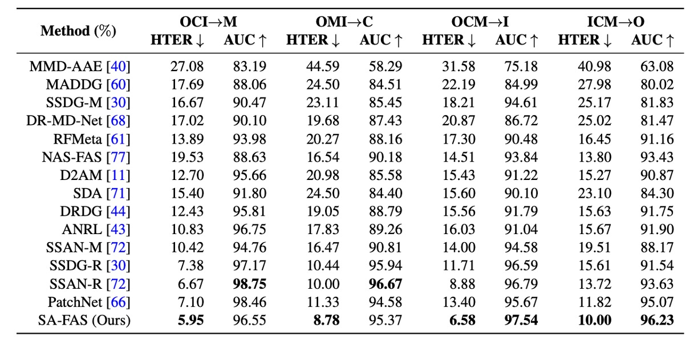

## 超平面の法則

[**Rethinking Domain Generalization for Face Anti-spoofing: Separability and Alignment**](https://arxiv.org/abs/2303.13662)

---

FAS（顔面偽造防止）という課題について、まずは Domain Generalization（DG）に基づいた解決策である SSDG を見ました。その後、適応型 DG の解決策である D²AM を見てきました。

では、DG は本当に正しい方向なのでしょうか？

:::tip
以前の論文をまだ読んでいない読者は、以下のノートを参考にできます：

- [**[20.04] SSDG: 安定した真実**](../2004-ssdg/index.md)
- [**[21.05] D²AM: 千界鍛魂術**](../2105-d2am/index.md)
  :::

## 問題の定義

DG は確かに良いアプローチですが、限界もあります。

まず、これまでの多くの手法は、理想的な前提に基づいて構築されていました：

> **「ドメインに影響されない特徴空間を学習できる。」**

これは聞こえは良いですが、実際にはうまくいかないことが多いです。

なぜなら、トレーニングデータのドメイン数は限られており、変動範囲も制限されているため、モデルはトレーニングデータの分布に過剰適合しやすくなります。実際のテストシナリオにおいて、異なるデバイス、解像度、光源などが登場すると、モデルは幻覚を起こすことになります。

さらに悪いことに：
異なるドメインからのデータを無理に同じ特徴空間に押し込めると、本来は分かれているべき live と spoof が混ざり合ってしまうことがあります。

この時、モデルはどのように判断するのでしょうか？
簡単です。それは、無関係な「誤った関連性」を学習することになります。例えば：

> **「低解像度は攻撃、高解像度は本物の人間だ。」**

しかし、ドメインを変えれば、この関連性はまったく意味をなさなくなり、その結果、大きな問題が発生します。

ドメイン不変性がうまくいかないのであれば、別のアプローチを考えましょう：

> **ドメイン信号を消すのではなく、「うまく活用」し、特徴空間を再設計する。**

## 解決策

SA-FAS の出発点は非常にシンプルです：

我々はもはやドメインの影響を排除しようとするのではなく、**これらの違いを正面から受け入れ、それらをうまく活用**し、特徴空間を再設計します。

この空間には、以下の二つの核心的な特性が求められます：

1. **可分性（Separability）**：live と spoof を明確に分け、異なるドメインにも構造を保たせる。
2. **整合性（Alignment）**：各ドメインの spoof 遷移は同じ方向に変化するべきである。

これらは矛盾しているように思えるかもしれません：分けるべきであり、かつ一致させるべき？

しかし、実際にはこれらは補完的な関係にあります：**分ける**ことでドメインに混乱させられることなく、**一致**させることで同じ境界で分類できるのです。

### 可分性

同じカテゴリ、同じドメインのデータが「集まる」ようにするために、SA-FAS は**Supervised Contrastive Learning（SupCon）**を採用しています。

この損失関数は次のように定義されます：

$$
\mathcal{L}_{\text{sep}} = \sum_{i=1}^{2b} -\frac{1}{|S(i)|} \sum_{j \in S(i)} \log \frac{\exp(z_i \cdot z_j / \tau)}{\sum_{t=1, t \ne i}^{2b} \exp(z_i \cdot z_t / \tau)}
$$

簡単に言うと：

- アンカー $z_i$ と同じラベル、同じドメインを持つサンプル集合 $S(i)$ を見つける
- これらの positive サンプルができるだけ近くなるように、他の negative サンプルはできるだけ遠くなるように
- 温度係数 $\tau$ を使って、コントラストの程度を調整

もしあなたが対比学習のノートを読んだことがあれば、これが非常に馴染み深いことに気づくでしょう：そうです、これは**InfoNCE の Supervised バージョン**であり、別名**Multi-positive InfoNCE**です。

:::tip
SupCon 損失の詳細な定義は次のリンクを参照できます：

- [**[20.04] Supervised Contrastive Learning**](https://arxiv.org/abs/2004.11362)
  :::

これが特徴空間に与える影響を理解するために、次の図を見てみましょう：

- **(a) ERM**：データが混在しており、live と spoof が分からない。分類器は誤って live を判定
- **(b) ERM + SupCon**：データはクラスタリングされているが、各ドメインの境界方向はまだ乱れている
- **(c) SA-FAS**：分けるだけでなく、遷移方向も一致しており、分類が安定している

### 整合性

分群だけでは不十分です。もし各ドメインがそれぞれ独自の境界方向を持っているなら、一般化は不可能です。

この問題を解決するために、SA-FAS は**Invariant Risk Minimization（IRM）**の概念を導入しました。

IRM の理想は次のようになります：

> **すべてのドメインに対して有効な分類器 $\beta^*$ が存在する。**

公式は次のようになります：

$$
\min_{\phi, \beta^*} \frac{1}{|E|} \sum_{e \in E} \mathcal{R}_e(\phi, \beta^*) \tag{IRM}
$$

$$
\text{s.t. } \beta^* \in \arg\min_{\beta} \mathcal{R}_e(\phi, \beta), \quad \forall e \in E
$$

しかし、この目標は理想的すぎて、ほとんどの場合、すべてのドメインに適した分類器を見つけることができないため、IRM は収束しにくいという問題があります。

### Projected Gradient IRM（PG-IRM）

そのため、著者は改良版として**PG-IRM**を提案しました。

核心的な論理は次の通りです：

> **各ドメインはまず、それぞれに最適な境界 $\beta_e$ を見つけ、徐々に全てのドメインを同じ方向に引き寄せる。**

これにより、問題は次のようになります：

$$
\min_{\phi, \{\beta_e\}} \frac{1}{|E|} \sum_{e \in E} \mathcal{R}_e(\phi, \beta_e) \tag{PG-IRM}
$$

そして、各$\beta_e$が他のドメインからあまりにも離れすぎないように「近接条件」を追加します：

$$
\forall e, \ \beta_e \in \Omega_e(\phi) \cap \Upsilon_\alpha(\beta_e)
$$

ここで：

- $\Omega_e(\phi)$ はそのドメインの最小損失解集合です。
- $\Upsilon_\alpha(\beta_e)$ は$\alpha$-近接集合で、超平面が互いに距離が遠くなりすぎないように制約します：

$$
\Upsilon_\alpha(\beta_e) = \left\{ \upsilon \mid \max_{e' \ne e} \min_{\beta_{e'} \in \Omega_{e'}(\phi)} \|\upsilon - \beta_{e'}\|_2 \le \alpha \cdot \max_{e' \ne e} \min_{\beta_{e'} \in \Omega_{e'}(\phi)} \|\beta_e - \beta_{e'}\|_2 \right\}
$$

---

整合の過程は次のように想像できます：

- **(a)** 元々の IRM は$\beta^*$を直接見つけようとしますが、解が見つからない場合があります。
- **(b)** PG-IRM では、各ドメインが自分に最適な$\beta_e$を見つけます。
- **(c)** 各ステップで$\beta_e$を「最も遠いドメイン」に近づけます。
- **(d)** 最終的に、すべての超平面の方向が一致し、整合が達成されます。

### α-adjacency が鍵

なぜ PG-IRM は成功するのに対し、IRM はしばしば解が得られないのでしょうか？

それは、PG-IRM が「すべてのドメインが完全に一致する必要はない」と要求しているのに対し、IRM は「すべてのドメインが完全に一致しなければならない」と要求しているからです。

この「一致」の概念が**α-adjacency**であり、以下の図に示されています：

<figure style={{"width": "70%"}}>

</figure>

各ドメインの超平面$\beta_e$が他の超平面と α 距離内に収まる限り、整合と見なされます。

この設計により、以下が保証されます：

- 各更新が合法である（集合が空でない）
- 簡単な線形補間を用いて投影を完了でき、解決できない状態に陥ることがない

---

最後に、この二つの損失を結合して、SA-FAS の総損失を形成します：

$$
\mathcal{L}_{\text{all}} = \mathcal{L}_{\text{align}} + \lambda \mathcal{L}_{\text{sep}}
$$

推論時には、すべてのドメインの分類器を平均化して、最終的な決定を行います：

$$
f(x) = \mathbb{E}_{e \in E}[\beta_e^T \phi(x)]
$$

実験によると、このように訓練されたモデルは非常に優れた一般化能力を持ち、各ドメインの分類器もほぼ一致しており、整合が成功したことを示しています。

## 討論

ここでは最も一般的な cross-domain 評価設定が採用されています：
4 つのデータセット（CASIA、Idiap Replay、MSU、Oulu）のうち、3 つを訓練に使用し、残りの 1 つをテスト対象として使用します。例えば：

- **OCI → M**：Oulu、CASIA、Idiap で訓練し、MSU でテスト
- **OMI → C**：Oulu、MSU、Idiap で訓練し、CASIA でテスト
- これを繰り返して、合計 4 つの方向があります。

これは実際、FAS の定番問題であり、テストセットに一度も登場しなかった条件下でもうまくいくかどうかの勝負です。

### 他の方法との比較

<figure style={{"width": "90%"}}>

</figure>

ここでは著者が SA-FAS と他の方法の結果を並べて、どれが最も優れているかを比較しています。

実験結果によると、SA-FAS はすべての cross-domain 設定で非常に優れたパフォーマンスを発揮しており、特に OCM→I 設定では、HTER が SOTA より 2.3%も向上し、相対誤差が 25%以上減少しました。

cross-domain FAS に挑戦したい場合、この表が現在見つかる最も厳しいスコアラインでしょう。

:::info
通常、モデルが報告するのは「最良のスナップショット」です。つまり、訓練過程で最も低いテストエラーを記録した瞬間のモデルです。それが第 16 エポックであったり、第 77 エポックであったりします。

この設定は確かに「モデルに優しい」ですが、リスクも隠れています：

- テストセットがない場合、最良のスナップショットを選べません（実際のアプリケーションではよくあることです）。
- 一部のモデルは訓練後期に急速に過学習し、数字は良くても一般化能力が低いことがあります。

著者はこれに対処するために、付録 B で「訓練後 10 エポックの平均」を結果として用いた別の実験を追加し、以下の結果を得ました：

> **ほとんどの方法の数字はかなり下がり、一般化に問題があることを示しています。**

しかし、SA-FAS は依然として 1 位であり、標準偏差が最小であることがわかりました。これにより、強さだけでなく、安定性も示されています。
:::

### 評価指標分析

<figure style={{"width": "90%"}}>

</figure>

著者は 2 つの独自の指標を定義しています：

- **$S_{sep}$**：特徴空間における live / spoof の中心ベクトルの分離度（遠いほど良い）
- **$S_{align}$**：分類器の方向と spoof→live の遷移方向の一致度（一致するほど良い）

各点は訓練スナップショットを示し、X 軸は指標、Y 軸は AUC スコアです。

上図の結果から、**両者は AUC と高い正の相関があることが示されています**。

- PG-IRM がある → $S_{align}$ ↑ → AUC ↑
- SupCon がある → $S_{sep}$ ↑ → AUC ↑

これにより、SA-FAS がデータで裏付けされた幾何学的設計であることがわかります。

### 特徴分布

OMI→C 設定において、著者は最後の層の特徴の UMAP 分布を描きました：

- 各点は live / spoof のサンプル
- 色はドメインを表し、破線は分類器の境界

観察結果：

- 境界は見たことがないドメイン（CASIA）で live/spoof を正確に分けることができる
- 異なる解像度のドメインは異なる分布を示すが、分類方向は一致している

これは「目に見える一般化」であり、ドメインを平坦化するのではなく、各ドメインが自然に同じ方向に分散することができることを示しています。

### DANN と SSDG の比較

<figure style={{"width": "90%"}}>

</figure>

DANN は domain-invariant な特徴を作ろうとしましたが、訓練セットではうまくいくものの、見たことのないドメインでは live/spoof の分布が崩れてしまいました。

SSDG は DANN より少し良く、spoof カテゴリの劣化方向は整列していますが、live データはまだ乱れており、ドメインギャップの問題を処理できていません。

## 結論

これまで私たちは、ドメインの影響を排除することを考えてきましたが、SA-FAS はより現実的な方向性を示しました：

> **ドメインが存在しないふりをするのではなく、ドメインを合理的に存在させる特徴空間を設計すること。**

一般化能力、安定性、そして解釈可能性において、SA-FAS は強力な答えを提供しています。
