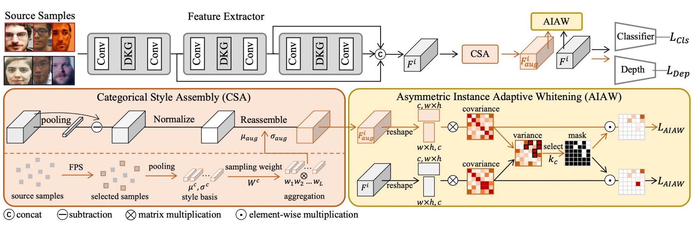
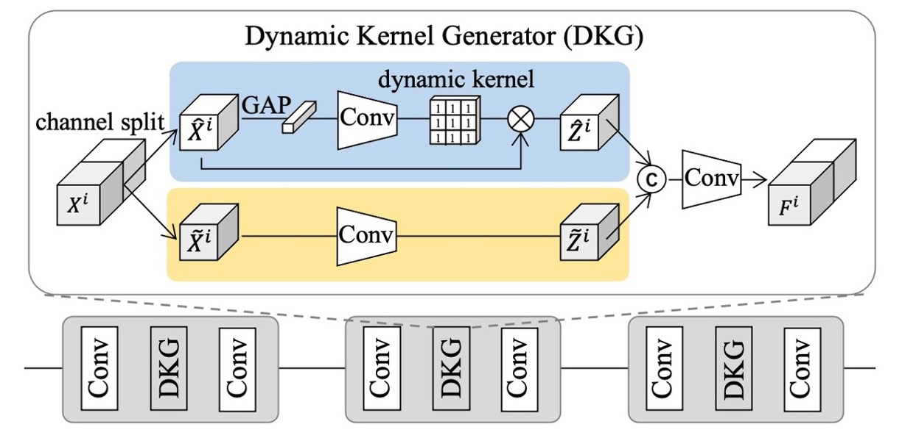
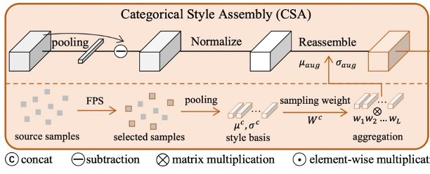
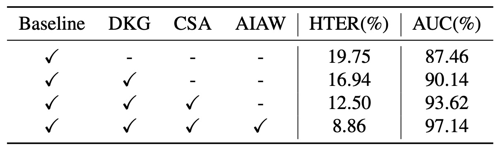

## スタイルの独白

[**Instance-Aware Domain Generalization for Face Anti-Spoofing**](https://arxiv.org/abs/2304.05640)

---

過去 10 年間、研究者たちは様々な方法を駆使して、真実と偽物の境界を描こうと試みてきました：

- LBP、SIFT、HOG などの手作り特徴量を用いて質感やテクスチャを識別；
- YCrCb 色空間やフーリエスペクトルで異常なパターンを探求；
- 時系列の微細な違いを分析し、まばたき、微小な動き、血流から本物の証拠を探し出そうとした；

そして、領域全体が CNN にバトンを渡し、分類器、深度マップ、反射マップ、rPPG などの補助的な監視方法が登場しました。

しかし、これらの方法は、シーン、デバイス、攻撃方法を変えるだけで効果が急激に低下し、展開が困難になることが多いのです。

## 問題の定義

モデルが未知のドメインに適応するために、研究者たちは **Domain Adaptation（DA）** と **Domain Generalization（DG）** の概念を導入しました。

特に DG では、対抗学習やメタ学習が主流の選択肢となり、「あなたがどこから来たとしても、私はあなたを見抜く」ための特徴表現を学習することを目的としています。

しかし、この道を歩むうちに、制限が明らかになってきました：

- ほとんどすべての方法が明確なドメインラベルに依存している；
- そしてこれらのラベルは、データセットの名前や撮影機器のモデルなど、時には人為的に指定された分類基準に過ぎません。

「これは Replay だ」と言っても、Replay の中には様々な照明や背景が含まれており、「これは Oulu だ」と言っても、どのようなスタイルサブグループが含まれているかを特定できる人はいません。

たとえラベルがあったとしても、これらの方法は **分布レベルで特徴を整列させる** ことしかできず、ある特徴チャネルがスタイルの痕跡を密かに保持していることを制御することができません。このように見えない信号は、新しいサンプルに対してモデルの失敗の盲点となりがちです。

もし、ドメインラベルに依存しないのであれば、「異物」をどのように識別することができるのでしょうか？

真実と偽物の間に、他にどんな境界が存在するのでしょうか？

## 問題の解決

<figure style={{"width": "90%"}}>

</figure>

この問題を解決するために、著者は新しいアーキテクチャを提案しました。これを次のように呼びます：

- **Instance-Aware Domain Generalization (IADG)**

このアーキテクチャの目的は、ドメインラベルに依存することなく、モデルが「インスタンスレベル」の特徴を学習し、未知のドメインでも安定したパフォーマンスを維持できるようにすることです。

IADG は主に 3 つのコアコンポーネントから成り立っています：

- **非対称インスタンス適応型ホワイトニング（AIAW）**
- **カテゴリカルスタイルアセンブリ（CSA）**
- **ダイナミックカーネルジェネレーター（DKG）**

それぞれのモジュールの設計を順番に詳しく見ていきましょう。

### Dynamic Kernel Generator

<figure style={{"width": "70%"}}>

</figure>

複数のソースドメインからのサンプルは、多くの場合、高度に多様であるため、単一の静的フィルターではすべてのインスタンスの特徴を満たすことができません。これを解決するために、著者は **DKG** を設計しました。このモジュールは「インスタンス適応型」の動的フィルターを自動生成し、静的フィルターと協力して、より包括的な個体認識特徴を取得し、その後のクロスドメイン一般化をサポートします。

DKG の構造は、「静的畳み込み分岐」と「動的畳み込み分岐」の 2 つの部分から成り立っています：

- 静的分岐（static convolution branch）は固定されたパラメータを持ち；
- 動的分岐（dynamic kernel branch）は、各サンプルの特徴に基づいて動的に畳み込みカーネルパラメータを生成します。

上図に示すように、$X_i$ と $F_i$ はそれぞれ、DKG の入力および出力特徴を表します。

トレーニング時、両分岐は同時に学習され、具体的なプロセスは次のようになります：

1. 入力特徴 $X_i$ をチャネル次元で二分し、それぞれ $\hat{X}_i$ と $\tilde{X}_i$ として記録；
2. **静的畳み込み分岐**：$\tilde{X}*i$ は静的畳み込みフィルター $f*{\theta_s}$ を通して $\tilde{Z}_i$ を得ます；
3. **動的畳み込み分岐**：$\hat{X}*i$ はグローバル平均プーリングと畳み込みブロック $f*{\theta_1}$ を通して、このインスタンスに関連する動的畳み込みカーネル $W_i$ を生成し、これを用いて $\hat{X}_i$ に畳み込みを行い、$\hat{Z}_i$ を得ます。

このように、静的および動的フィルターの共同作用により、モデルは各インスタンスに対してより柔軟な特徴表現を抽出できるようになります。

### Categorical Style Assembly

<figure style={{"width": "70%"}}>

</figure>

より広い特徴空間で「インスタンスレベル」のスタイル変動をシミュレートするために、著者は **CSA** を提案し、より豊富なスタイルのサンプルを生成します。以前に見た **AdaIN** もスタイル変換に使用されますが、そのスタイルのソースは「ランダム」であり、異なるカテゴリのサンプル間でのスタイル分布の違いを考慮していません。

:::tip
少し待って、もしかしたら読者の中には **AdaIN** とは何か分からない方がいるかもしれません。簡単に説明します：

**Adaptive Instance Normalization（AdaIN）** は、スタイル変換でよく使われる特徴整列手法で、元々は画像スタイル変換タスクに使用されていました。その基本的な考え方は次の通りです：

> **コンテンツ特徴の平均と標準偏差をターゲットスタイルの統計量に調整し、スタイルを注入・変換する** ことです。

具体的には、コンテンツ特徴 $x$ とスタイル特徴 $y$ に対して、AdaIN の計算式は次のようになります：

$$
\text{AdaIN}(x, y) = \sigma(y) \cdot \left( \frac{x - \mu(x)}{\sigma(x)} \right) + \mu(y)
$$

ここで：

- $\mu(x), \sigma(x)$ はコンテンツ特徴の平均と標準偏差；
- $\mu(y), \sigma(y)$ はスタイル特徴の統計量です。

この操作は、元々のコンテンツ特徴を正規化し、そこにスタイル特徴の統計特性を適用して特徴表現を調整します。**意味構造を変えずに、スタイル表現を再形成する** ことができます。

AdaIN はそのシンプルで効率的な特性により、スタイル変換やクロスドメイン一般化タスクで広く採用されており、特にスタイルの整列やデスタイリングが必要なアプリケーションで適しています。

:::

AdaIN の不足点に対して、CSA は次の 2 つの改善を行いました：

1. **多様性の考慮**：**Farthest Point Sampling（FPS）** を使用して、すべてのソースサンプルのスタイルから最も異なる $L$ 個の「基底スタイル」を反復的に選択し、主要な分布をカバーし、さらに主流のスタイルから遠い珍しいスタイルも含めるようにしています。また、各エポックで動的に更新され、トレーニングに応じてスタイル空間の変化に対応します。

2. **真 / 偽を分けて処理**：真顔（real）と偽顔（spoof）は異なるラベルを持っているため、任意に混ぜると誤ったラベルが付けられる可能性があります。この負の影響を避けるために、CSA は「同一カテゴリ」の場合にのみスタイルの組み合わせを行い、強化されたサンプルが真顔と偽顔を混同しないようにします。

上図を見ながら具体的なプロセスを説明します。まず、真顔と偽顔それぞれから $L$ 個の基底スタイルを選び、その平均 $\mu$ と分散 $\sigma^2$ をメモリバンク（memory bank）に保存します。これを $\mu^r_\mathrm{base}, \sigma^r_\mathrm{base}$ と $\mu^s_\mathrm{base}, \sigma^s_\mathrm{base}$ として記録します。

次に、同一カテゴリの元の特徴に対して「スタイルの線形結合」を行い、分布サンプリングの重みに基づいて新しい平均 $\mu_{\mathrm{aug}}$ と標準偏差 $\sigma_{\mathrm{aug}}$ を取得し、最終的なスタイル再構成特徴を生成します：

$$
F_{\mathrm{aug}}
= \sigma_{\mathrm{aug}}
\Bigl(
\frac{F_{\mathrm{org}} - \mu(F_{\mathrm{org}})}{\sigma(F_{\mathrm{org}})}
\Bigr)
+ \mu_{\mathrm{aug}}
$$

これにより、サンプルの元のカテゴリを変更することなく、スタイルの多様性を効果的に拡張でき、後続のホワイトニングプロセスをサポートすることができます。

### Asymmetric Instance Adaptive Whitening

<figure style={{"width": "70%"}}>

</figure>

各サンプルの特徴を「細かく整列」させるために、著者は特徴チャネル間の関連性にさらに注目しました。

過去の研究では、特徴の共分散行列がデータのスタイル情報を含んでいることが示されています。この情報をホワイトニングすれば、特定のドメインに依存したスタイルを弱めることができます。

しかし、単純に既存の **インスタンスホワイトニング** 方法を適用するだけでは、「有用な識別特徴」も一緒に削除されてしまい、FAS の性能に悪影響を与える可能性があります。

そのため、著者はインスタンスホワイトニングに「非対称」の概念を導入しました：真顔と偽顔では特徴分布のニーズが異なり、真顔にはより密接に、偽顔にはより緩やかに適用するべきだという考えです。

:::tip
**ホワイトニング（白化処理）** は、データ特徴の相関を除去（decorrelation）し、標準化（normalization）する方法で、統計学や深層学習の特徴前処理のステップでよく使用されます。その目的は、入力特徴 $x \in \mathbb{R}^d$ を変換した後、以下の特性を満たすベクトル $\hat{x}$ を得ることです：

- 平均がゼロ：$\mathbb{E}[\hat{x}] = 0$
- 共分散が単位行列：$\text{Cov}(\hat{x}) = I$

一般的なホワイトニングの式は次のようになります：

$$
\hat{x} = W (x - \mu)
$$

ここで $\mu$ は特徴の平均、$W$ はホワイトニング行列で、通常は特徴共分散行列 $\Sigma$ の特異値分解または主成分分析（PCA）を使用して計算されます：

$$
W = \Sigma^{-\frac{1}{2}} = U \Lambda^{-\frac{1}{2}} U^\top
$$

この変換は、各次元間の相関を除去し、また各特徴次元を同じスケールにするため、モデルの学習の安定性と一般化能力に役立ちます。

画像スタイル変換やクロスドメイン学習において、ホワイトニングは AdaIN の統計量置換に比べて、より強力なスタイル除去能力と意味の保持効果を提供できます。

:::

### 総体訓練と最適化

未知のドメインで安定したパフォーマンスを達成するために、分類器はさまざまな「スタイルの揺らぎ」にもかかわらず、真偽を正しく識別できなければなりません。

そのため、同一の入力サンプル $X_i$ に対して、著者は元の特徴 $F_{\mathrm{org}}^i$ と強化された特徴 $F_{\mathrm{aug}}^i$ を用いて、二項分類損失 $\mathcal{L}_{\mathrm{Cls}}$ を監視します：

$$
\mathcal{L}_{\mathrm{Cls}}
= - \sum_{D}
Y_{\mathrm{cls}}^i
\Bigl[
\log\bigl(\mathrm{Cls}(F_{\mathrm{org}}^i)\bigr)
+ \log\bigl(\mathrm{Cls}(F_{\mathrm{aug}}^i)\bigr)
\Bigr]
$$

ここで、$Y_{\mathrm{cls}}^i$ はデータセット $D$ 上のサンプル $i$ の二項ラベルです。

さらに、著者は先行研究を参考にし、深度推定器を使って追加の監視を行っています：真顔には深度マップを出力し、偽顔にはゼロマップを出力します。

深度損失関数 $\mathcal{L}_{\mathrm{Dep}}$ は次のように定義されます：

$$
\mathcal{L}_{\mathrm{Dep}}
= \sum_{D}
\Bigl\|
\mathrm{Dep}(F_{\mathrm{org}}^i) - Y_{\mathrm{dep}}^i
\Bigr\|_2^2
+
\Bigl\|
\mathrm{Dep}(F_{\mathrm{aug}}^i) - Y_{\mathrm{dep}}^i
\Bigr\|_2^2,
$$

ここで、$Y_{\mathrm{dep}}^i$ は深度ラベル（真顔は実際の深度、偽顔はゼロ）です。

これらを総合して、最終的な総損失関数 $\mathcal{L}_{\mathrm{total}}$ は次のように表されます：

$$
\mathcal{L}_{\mathrm{total}}
= \mathcal{L}_{\mathrm{Cls}}
+ \lambda \mathcal{L}_{\mathrm{Dep}}
+ \mathcal{L}_{\mathrm{AIAW}}.
$$

推論段階では、元の特徴分岐だけが必要で、強化操作は行いません。また、AIAW 損失は訓練時にのみ有効です。

これら 3 つのモジュール（DKG、CSA、AIAW）の組み合わせにより、IADG は「インスタンスレベル」でスタイルの干渉を弱め、粗雑なドメインラベルに依存せず、未知のドメインで安定したパフォーマンスを維持できます。

## 討論

従来の方法に従い、ここでも **Leave-One-Out** 実験設定を採用し、最後に各モジュールの貢献を解析する消融実験を行います。

### 現行手法との比較

<figure style={{"width": "90%"}}>

</figure>

実験結果は上表の通りです。従来の FAS 手法はクロスドメインタスクにおいて不安定なパフォーマンスを示し、ほとんどすべての**DG FAS**手法もまだ domain label に依存して粗い分布を合わせるため、汎化性能にボトルネックが存在します。

一方で、**IADG**はこのような粗いラベルに依存せず、インスタンスレベルでのスタイル抑制を通じて、4 種類のクロスデータセットシナリオでより良い HTER および AUC を達成し、ラベルのないアライメントの状況における本手法の優位性を強調しています。

### 消融実験

<figure style={{"width": "70%"}}>

</figure>

上表は消融実験の結果で、異なるモジュールの貢献を分析しています：

- ベースラインのみ使用した場合、19.75%の HTER と 87.46%の AUC が得られます
- **DKG**を追加すると、16.94% / 90.14%に改善
- さらに**CSA**を加えると、12.50% / 93.62%に進展
- 最後に**AIAW**を導入することで、8.86% / 97.14%に達成されました。

これらの 3 つのモジュールはお互いに補完し合い、統合することで最大の改善が得られました。

次に、異なるインスタンスホワイトニングの比較を見てみましょう：

<figure style={{"width": "70%"}}>

</figure>

実験結果から、IW や GIW などの手法はすべての共分散要素を平等に扱うため、重要な識別特徴を誤って傷つける可能性があることが分かります。ISW は若干改善されているものの、真の顔と偽の顔の分布特性の違いを依然として無視しています。

**AIAW** は真の顔と偽の顔に対して非対称的（asymmetric）な抑制を行い、元の特徴と強化された特徴を同時に制約することで、スタイル変動に対する耐性を強化しています。特に抑制比率 $k_r : k_s = 1 : 0.2$ で最適なパフォーマンスが得られます。

### 視覚化分析

<figure style={{"width": "90%"}}>

</figure>

最後に、IADG が特徴をどのように整列させるかを直感的に理解するために、t-SNE プロジェクションを見てみましょう。

上の図に示すように、従来のドメイン認識型の整列手法では、source データセット内で真偽サンプルを区別することができますが、decision boundary 付近でターゲットドメイン（target）のサンプルが混同していることが分かります。これに対し、IADG を使用した手法では、モデルは真偽の分界をより鮮明に構築しており、未見のターゲットドメインサンプルでも区別しやすくなっています。

インスタンス認識型の汎化によって、真の顔の特徴はより集中し、ドメインレベルのアライメントを採用した手法では緩やかで不安定なものになります。その理由は、著者が「データセット全体」の分布整列にとどまらず、各インスタンスのスタイルの弱化を行うことで、クロスドメイン汎化の統計的一貫性を促進しているからです。

## 結論

Face Anti-Spoofing の課題は決して「認識」ではなく、「変異への対抗」にあります。

そして、この変異は攻撃方法の刷新だけでなく、データ自体の断片化からも生じます：

> **異なる光源、デバイス、背景、文化、撮影時期、すべてのデータはそれぞれが独自のドメインである可能性がある。**

私たちはドメインラベルによってすべてを支配できると思っていましたが、実際には分類できない細部に潜んでいる差異がますます増えてきていることが証明されています。統一されたラベルを追い求めるよりも、各顔のスタイルノイズの中から不変の信号を抽出する方が賢明です。

全体を整列させることから個体を理解することへ；サンプルを分類することからスタイルを分解することへ。おそらく、私たちはまだスタイルの本質を完全には理解できていませんが、IADG は少なくとも「スタイルと共存する方法」を私たちに示してくれました。
