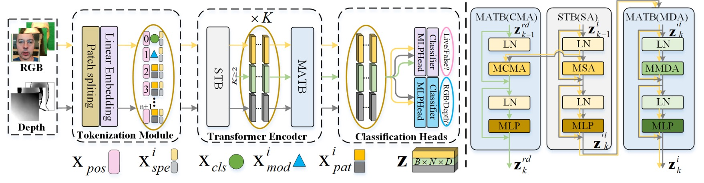
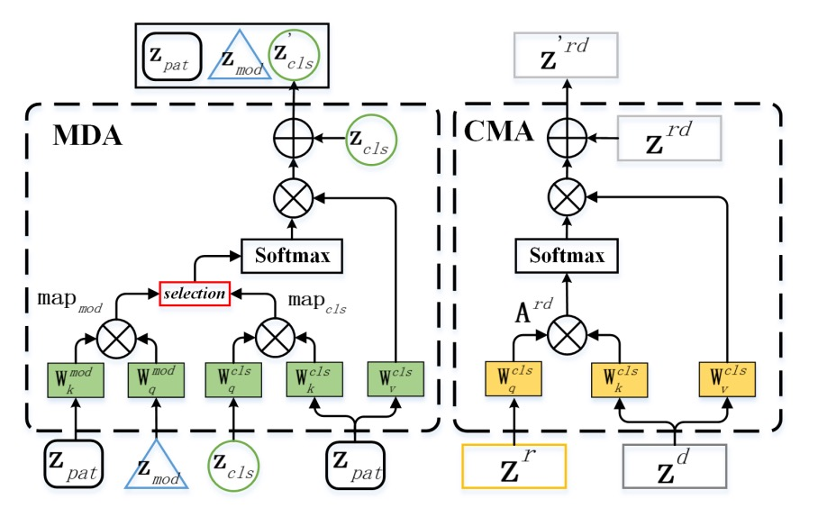
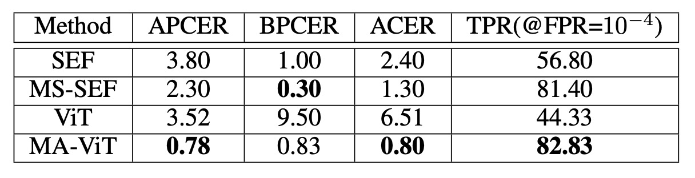
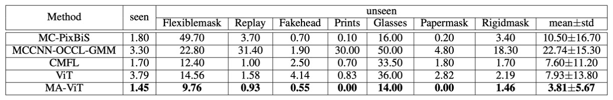

## 凡所有相，皆是虚妄

[**MA-ViT: Modality-Agnostic Vision Transformers for Face Anti-Spoofing**](https://arxiv.org/abs/2304.07549)

---

Face Anti-Spoofing（FAS）技術の本来の目的は、写真、動画、または立体マスクを使用して顔認識システムを欺く攻撃手法を防ぐことです。

これらの攻撃は「Presentation Attacks（PA）」と呼ばれ、顔認識技術が金融決済、スマートフォンのロック解除、自動通関などの分野で普及する中で、そのセキュリティも現代の生体認証システムにおいて避けられない試練となっています。

## 問題の定義

最初の FAS 方法は、ほとんどが RGB 視覚情報に依存して異常を検出していました。

しかし、攻防の駆け引きは止まることがなく、攻撃手法はますます現実的になり、センサー技術も多様化しています。私たちは、赤外線、深度、熱感知などのモダリティを導入し、「多光スペクトルの真実」を組み合わせようと試みました。

そのため、モデルアーキテクチャも進化を遂げました：halfway fusion（中層特徴の結合）から late fusion（決定段階での融合）へと、各戦略が「真偽の境界」をより確実に再構築しようとしています。

しかし、問題は静かに浮かび上がってきました。

Halfway fusion は、異なるモダリティの特徴間で相互学習を強化できますが、そのモデル設計は訓練とテストの段階で同一の入力モダリティがあると仮定しており、もしセンサーが欠ければ、予測全体が崩れる可能性があります。

Late fusion は、各モダリティの独立したチャネルを保持することで、モダリティが欠落しても推論が可能ですが、その代償としてパラメータが増加し、推論遅延が発生します。これはモバイル端末やエッジデバイスでのデプロイには不利です。

もっと根本的なボトルネックは、これらの多モダリティ手法が実は次の重要な命題を解決していないことです：

> **「我々は本当に「何が跨モダリティ共通の活体特徴なのか」を理解しているのか？」**

または、モデルは「顔の真偽」を学習しているのではなく、「モダリティの違い」をただ覚えているだけなのか？

そして、より過激な問題が浮かび上がります：もし訓練時に多モダリティの知識を使用し、テスト時には任意のモダリティの入力だけで十分であれば、「モダリティ非依存」の FAS システムを構築することはできるのでしょうか？そして、そのようなシステムは、軽量で高速かつ柔軟性を保ちながら、偽装攻撃に対する鋭い判断力を保持できるのでしょうか？

本論文の著者は、この問題について考察し、解決を試みています。

今回のアプローチは、モダリティを再度接続するのではなく、まずそれらを分解することです。

## 解決すべき問題

従来の halfway fusion および late fusion の手法は、モダリティの欠如によって簡単に中断されるだけでなく、計算負担とモデルの複雑さを引き起こすため、これらを改善する新しいアプローチが求められています。そこで、著者は「モダリティ非依存」のモデルを設計することを目指しています：

- 訓練段階では多モダリティの知識を吸収
- テスト段階では任意のモダリティで独立した予測が可能

### モデルアーキテクチャ

<figure style={{"width": "90%"}}>

</figure>

全体のアーキテクチャは上図のように、MA-ViT は単一の ViT バックボーンに基づいており、以下の 3 つの重要なモジュールを含んでいます：

1. **Multi-Modal Tokenization Module**（図の左側）
2. **Transformer Encoder**（中央の黄色と黒の矢印で示されています）
3. **Modal Shared Classification Heads**（右側の分類器）

従来の多分岐型融合設計とは異なり、MA-ViT の重要な革新は、すべてのモダリティデータが同じ ViT 構造を共有し、標準 Transformer Block（論文中では STB）と新たに導入された「モダリティ非依存型」Transformer Block（Modality-Agnostic Transformer Block、MATB）が交互にスタックされて、モダリティ非依存の特徴を抽出する点にあります。

上図の黄色い矢印は各モダリティが独立して STB を通過するルートを示し、黒灰色の矢印はその後 MATB（MDA）の処理フローに入ることを示しています。

---

MA-ViT の入力端では、RGB または Depth 画像はまず**Multi-Modal Tokenization Module**を通過します。

図の左側に示されているように、入力画像はパッチに分割され、ベクトルトークン（$x_\text{pat}$）に変換されます。これらのパッチトークンは 2 つの特別なトークンと組み合わせられます：

- **$x_\text{cls}$**：分類トークン、最終的に真偽予測タスクを担います。
- **$x_\text{mod}$**：モダリティトークン、入力の光譜特性をモデルが理解するためのガイドとして使用されます。

全体のシーケンスは位置埋め込み（$x_\text{pos}$）と光譜埋め込み（$x^i_\text{spe}$）で重み付けされ、初期の入力ベクトルを形成します：

$$
z^i_0 = [x_\text{cls} \| x^i_\text{mod} \| x^i_\text{pat}] + (x_\text{pos} + x^i_\text{spe})
$$

これらのトークンは後続の Transformer Encoder フローに進みます。

---

Transformer Encoder の各層は 2 つの部分で構成されています：

1. **STB（Standard Transformer Block）**
   各モダリティは独立して処理され、図の黄色と黒灰色の矢印で示されているように、単一モダリティ内の局所特徴と文脈を処理します。

2. **MATB（Modality-Agnostic Transformer Block）**
   STB に続く MATB は、2 つの注意機構に分かれています。具体的な実装の詳細は以下の図を参照してください：

   

    <figure style={{"width": "70%"}}>
    
    </figure>
    

   - **MDA：モダリティから逃れるため**

     **Modal-Disentangle Attention（MDA）** の任務は、モデルが過度にモダリティ特徴に依存するパッチを無視し、モダリティに依存せず、真偽識別に強く関連する手がかりに集中することを学ばせることです。

     図の左側に示されているように、MDA は最初にモダリティトークン（MOD）と各パッチトークンのドット積計算を通じてモダリティ間の関連度を計算します：

     $$
     \text{map}_\text{mod} = \frac{q_\text{mod} (k^\text{pat}_\text{mod})^T}{\sqrt{D/h}}
     $$

     次に、閾値関数 $\Gamma_\lambda(\cdot)$ を使用して、モダリティ関連性が強すぎるトークンをマスク行列 $M$ としてマークします。その後、CLS トークンの注意計算において、これらのトークンの関連値を極小化し、「接続を断つ」効果を得ます：

     $$
     \text{map}_\text{cls}' = \Gamma^0_M\left(\frac{q_\text{cls} (k^\text{pat}_\text{cls})^T}{\sqrt{D/h}}\right)
     $$

     最終的な注意結果はモダリティに依存しないパッチにのみ焦点を当てます：

     $$
     \text{MDA}(z^i) = \text{softmax}(\text{map}_\text{cls}') \cdot v^\text{pat}_\text{cls}
     $$

     これは「選択的忘却」のプロセスであり、モデルがすべてを記憶するのではなく、記憶すべき部分のみを記憶することを意味します。

     ***

   - **CMA：モダリティ間でお互いを照らすため**

     **Cross-Modal Attention（CMA）** の任務は、逆に異なるモダリティ間で交差注意機構を使用して、一つのモダリティが他のモダリティから情報を補完することです。

     図の右側に示されているように、RGB（$z^r$）と Depth（$z^d$）を例に取ると、CMA は$z^r$のクエリベクトル（$q_r$）が$z^d$のキー・バリューに注意を向けるようにします：

     $$
     A_{rd} = \text{softmax}\left( \frac{q_r k_d^T}{\sqrt{D/h}} \right), \quad \text{CMA}(z_r) = A_{rd} \cdot v_d
     $$

     逆も同様です。このステップにより、各モダリティは「異なる視点で世界を見る」ことができ、見えない特徴が他のモダリティの文脈を通じて補完されます。

### 損失設計

「テスト時に任意のモダリティで判定できる」という設計を実現するために、MA-ViT はモダリティ共有の分類器を採用し、CLS トークンが真偽を予測し、MOD トークンがモダリティを予測します。この 2 つの損失は共同で最適化されます：

$$
\begin{aligned}
L^i_\text{cls} &= \text{BCE}(\text{MLP}_\text{cls}(\text{LN}(z^i_{K, \text{cls}})), y_\text{cls}) \\
L^i_\text{mod} &= \text{BCE}(\text{MLP}_\text{mod}(\text{LN}(z^i_{K, \text{mod}})), y_\text{mod}) \\
L^i_\text{total} &= L^i_\text{cls} + L^{rd}_\text{cls} + L^i_\text{mod}
\end{aligned}
$$

このように設計された分類器は、モダリティが欠けている状況でも安定した判断を維持し、特定のモダリティが損傷してもシステム全体が失敗しないようにします。

## 討論

MA-ViT フレームワークの有効性を検証するため、著者は 2 種類の評価シナリオを設計しました：

1. **固定モダリティテスト**：テストモダリティが訓練モダリティと一致。
2. **柔軟モダリティテスト**：任意のモダリティで独立した推論が可能。

また、クロスデータセットテストと消失実験も含まれており、MA-ViT がモダリティ情報を分解し、転送する能力を段階的に検証しています。

### 固定モダリティシナリオ

従来の設定では、モデルは固定モダリティの条件で推論を行う必要があり、これは過去の方法との主な比較シナリオでもあります。

例えば、MmFA を使用して、ベースライン（MATB なしの ViT）と SEF/MS-SEF などの多モダリティ手法を比較します：

<figure style={{"width": "70%"}}>

</figure>

- ViT（融合なし）は伝統的な方法である SEF よりも劣っており、モダリティのガイドなしでは真偽の判定が難しいことが示されています。
- MATB を導入すると、TPR は 44.33％から 82.83％に、ACER は 6.51％から 0.80％に大幅に改善され、MS-SEF を超える結果を得ました。

これにより、Transformer がうまく機能しない理由は、モダリティの解構メカニズムが欠如しているためであることが示されます。

次に CeFA プロトコルの実験結果を見てみましょう：

<figure style={{"width": "70%"}}>

</figure>

プロトコル 1、2、4 の実験では、MA-ViT はそれぞれ ACER を 1.10％、0.10％、1.64％に低下させ、競合相手である Hulking、Super、BOBO を圧倒しました。

CeFA の課題は、モダリティと集団の変動が同時に存在することですが、MA-ViT はこの状況でも安定して一般化できることが示され、その高次元特徴の共有能力を証明しています。

最後に WMCA のパフォーマンスを確認します：

WMCA では、MA-ViT は従来のベストメソッドである CMFL（見たことがある: 1.70%、見たことがない: 7.60%）を打破し、「眼鏡」や「マスク」のような 3D 特徴混合攻撃において顕著な優位性を示しました。この種の攻撃は RGB や Depth だけでは異常を検出するのが難しいですが、MA-ViT はクロスモダリティ特徴を補完することで局所的な spoofing の痕跡を捉えることができます。

### クロスデータセットの一般化能力

<figure style={{"width": "70%"}}>

</figure>

WMCA テストセットにおいて、**MA-ViT の HTER は 20.63％で、SOTA メソッドの 24.54％を上回っています**。ViT の CMA を MDA に置き換えると、誤差は 27.97％から 24.84％に減少し、**MDA は一般化においてさらに貢献していることが示されました。**

これはモデル設計の初期の意図を裏付けるものであり、**モダリティの融合を追求するよりも、まずモダリティの偏見を処理する方が重要である**ということです。

### 柔軟モダリティシナリオ

<figure style={{"width": "80%"}}>

</figure>

これは MA-ViT の最も実用的な部分です。

モデルを再訓練することなく、MA-ViT は各モダリティで次のように推論結果を出します：

- **RGB**：11.43%（MS-SEF に比べて 9.57%低下）
- **Depth**：0.80%（MS-SEF に比べて 2.80%低下）
- **IR**：1.50%（MS-SEF に比べて 17.90%低下）

これにより、MATB はモデルが訓練過程でクロスモダリティの特徴を学習することを成功させ、単一モダリティのみが入力されても、「重みの中に隠された」多モダリティの知識を使って推論ができることが示されています。

## 結論

本研究で提案された MA-ViT は、純粋な Transformer アーキテクチャに基づく顔認証防止システムです。このシステムは、任意のモダリティの入力を処理するだけでなく、モダリティが不完全な場合でも安定した真偽の推論を行うことができます。

この能力の鍵は、モダリティの役割を再定義し、MATB モジュール内の 2 つの重要な注意メカニズムによって実現されます：

- **MDA**：モダリティの偏見を排除し、識別可能な活体特徴を保持；
- **CMA**：クロスモダリティの補完を行い、局所的な弱特徴の判別能力を強化。

その貢献は、単なるモデルアーキテクチャの改善にとどまらず、設計理念の転換でもあります：

> **「モダリティを記憶するのではなく、本質を見るべきだ。」**

真のモデルは、与えられた情報に依存するのではなく、「何が与えられても理解できる」能力を持つべきです。
