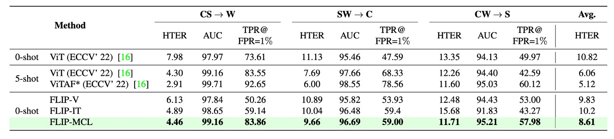
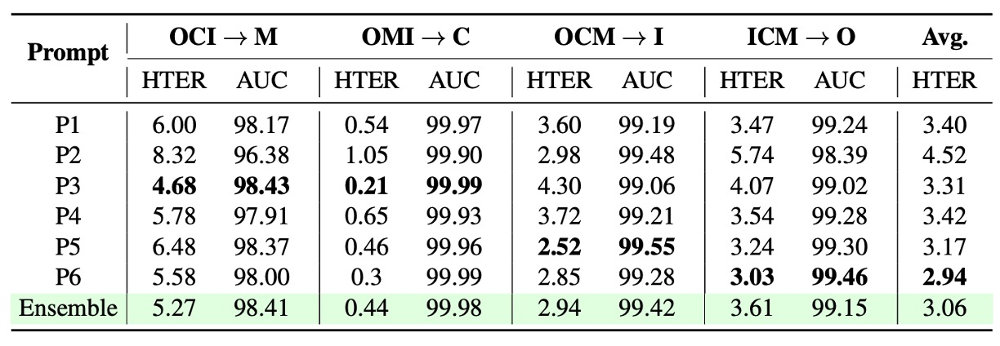

## 防御の呪文

[**FLIP: Cross-domain Face Anti-spoofing with Language Guidance**](https://arxiv.org/abs/2309.16649)

---

「これは本物だ！」

私は自然言語を崇高なる証として、モデルはそう語った。

## 問題の定義

空港、スマホ、入退室管理や様々な認証ポイントにおいて、顔はすでに最も一般的な識別符号となっている。

しかしながら、これらのシステムが頼る防偽モデル（FAS）は、デバイス間や攻撃形式、環境条件の違うテストにおいて予想外の脆弱性を示すことが多い：

- モデルは馴染みのあるデータ分布では良好に動作するが、一度訓練シーンから離れると著しく性能が低下する；
- カメラ解像度、照明条件、さらには攻撃手法の微調整によっても、モデルが偽物を本物と誤認することがある；

最後に、多くの手法はターゲットドメインのサンプルが得られることを仮定しているが、実際の運用ではそれは贅沢な期待である。次の攻撃がどこから、どんな方法で来るか誰も予測できないからだ。

同じ言葉を十数年聞き続けても、依然としてこの問題は解決できていない。

このことは我々に根本的な問い直しを迫る：

> **ラベルなし、未知のタイプを含むクロスドメイン環境下で、モデルは「生体（ライブネス）」を感知し続けられるのか？**

過去の試みは主に以下三つの戦略に沿って解答を探してきた：

- **無監督ドメイン適応（UDA）**：ラベルなしターゲットデータを用いて判別境界の一般化を図る；
- **少数ショット学習（Few-shot Learning）**：少数のターゲットラベル付きサンプルで素早く特徴を調整；
- **ドメイン一般化（Domain Generalization）**：複数のソースドメインから攻撃に依存しない識別特徴を学習しようとする。

しかしこれらは、多くの場合、モデルがターゲットドメインにアクセス可能であることや、攻撃タイプ、スタイルラベル、あるいは特殊モジュールなどの非自明な補助情報を頼っている。このため「ゼロショット転移」は理想的であるが同時に難題のままである。

本論文の著者はより大胆な発想を示した：

- もし事前学習済みの ViT を CLIP のようなマルチモーダルモデルに置き換えたら、自然にドメインを超えた一般化が可能になるのではないか？
- 言語自体が「スタイルに依存しない」記述補助となり得れば、モデルに意味論的レベルの防偽直感を導けるのではないか？
- 画像とテキストが単なるペアリングでなく、学習過程で「真実性」を共同でエンコードするならば、モデルは真実に対してより深い理解を持てるのではないか？

これらの問いは、単なるデータ構造の問題に留まらず、表現の意味論的深度の問題を内包している。モデルが学ぶべきは特徴そのものではなく、「記述」から顔の構成が真実か否かを認識する術なのである。

そして全ては一言から始まる：

> **_“This is not a spoof face.”_**

---

## 解決策

ちょっと待って、CLIP とは何かまだわからない？

では簡単に説明しよう：

ある画像と言葉のペアがあるとする。例えば、犬の画像と「かわいい子犬」というテキスト。

訓練バッチでは、CLIP は複数のこうしたペアを受け取る。画像エンコーダは ResNet や ViT で画像特徴を抽出し、テキストエンコーダは Transformer でテキスト特徴を得る。

その後、モデルは正しいペア（犬の画像と「かわいい子犬」）のコサイン類似度が最大となり、誤ったペア（犬の画像と「リンゴ」）の類似度が最小となるように学習する。

最終的に、4 億組もの画像テキストペアで学習を行う。

非常にシンプルなコンセプトでありながら、成果は抜群。この構造の成功が新時代の幕開けとなった。

:::tip
詳しい解説は以前の記事を参照：

- [**[21.03] CLIP: 次元の壁を打破する**](../../multimodality/2103-clip/index.md)
  :::

### モデル構造

<figure style={{"width": "90%"}}>

</figure>

上図は本論文の研究構造を示し、以下に対応する：

- **(a) FLIP-Vision**：CLIP のビジョンエンコーダ＋ MLP を単独使用したベースライン構造。
- **(b) FLIP-IT**：テキスト記述をクラス対応として導入し、コサイン類似度を分類基準とする。
- **(c) FLIP-MCL**：マルチモーダル正則化を加えた進化版で、より多角的に自己検証しながら一貫したクロスドメイン表現を学ぶ。

これは CLIP ベースのマルチモーダル対比学習構造である。次に、CLIP の知識を我々の課題にどう適用するかを見ていこう。

### FLIP-Vision

先ほど述べたように、CLIP は大規模なネット上の画像と言語データで事前学習されているため、分類、物体検出、画像分割など多くの自然画像タスクで優れた即時転移性能を示す。

しかしながら、FAS（顔防偽）タスクでは「非常に微細な」違い（紙の反射、スクリーンのテクスチャ、リプレイ歪みなど）を識別する必要があるため、CLIP の特徴を直接適用することは難しい。

そこで著者は FLIP-Vision（FLIP-V）をベースラインモデルとして提案し、極めてシンプルな変換戦略を採用した：

- CLIP の **画像エンコーダ（image encoder）** は保持する；
- テキストエンコーダは捨て、CLIP の ViT 構造のみで特徴抽出を行う；
- 最終の Transformer ブロックの **class token** 出力を取り出し、**多層パーセプトロン（MLP）** のヘッドに通して二値分類を行う；
- 標準的なクロスエントロピー損失を用いて、真顔と偽顔を識別するように訓練。

この設計は「言語蒸留後の視覚微調整」と見なせる。CLIP がマルチモーダル世界で獲得した強力な表現を引き継ぎつつ、言語の干渉を意図的に排除し、細部レベルでの視覚認識能力を集中して調整している。

訓練時には複数のソースドメインからバランスの取れた画像データを用い、様々なスタイルや攻撃パターン、撮影条件で判別基準を学習させている。

この過程は純粋な教師あり訓練であり、言語のヒントや意味的手がかりは一切導入されていない。

よって、FLIP-V は実際に次のことを証明しているに過ぎない：

> **言語を用いなくとも、CLIP の視覚バックボーンは従来の ViT よりも優れた一般化能力を持つ。**

### FLIP-Image-Text

FLIP-Vision の基本版は、CLIP の視覚エンコーダが FAS タスクに一定の転移能力を持つことを示したが、本質的には「視覚単一モーダル」の分類器である。

この設計は依然として「識別特徴」に基づく枠組みに留まり、CLIP の設計思想である「言語を視覚の誘導・判別基準にする」という点を活かし切れていない。

そこで著者は FLIP-IT の概念を導入した。

このバージョンの核心は、自然言語文を「意味のアンカー」として用い、学習過程で画像特徴とテキスト記述の整合度を直接比較し、単に画像同士の分類境界で学習しない点にある。

ここでは従来の MLP ヘッドによる真偽判別をやめ、各画像が「より類似した記述文を選ぶ」方式を採る。

具体的には、各クラス（real / spoof）を自然言語文で表現し、CLIP のテキストエンコーダでこれら文をベクトル $\vec{z}_r$ と $\vec{z}_s$ に変換。画像ベクトル $\vec{x}$ とのコサイン類似度を計算し、モデルの予測根拠とする。

つまりモデルは画像がどのテキスト文に「より似ているか」を判定するのである。

言語空間はラベル空間よりも「広範」であり、一つのクラスが多様な意味記述で表されうるため、言語レベルの抽象化を通じてドメイン間の変動に強い耐性を示す。

実験では真偽クラスを表す６つの文を用意し、下表のように設計した：

| Prompt No. | Real Prompts                       | Spoof Prompts                        |
| ---------- | ---------------------------------- | ------------------------------------ |
| P1         | This is an example of a real face  | This is an example of a spoof face   |
| P2         | This is a bonafide face            | This is an example of an attack face |
| P3         | This is a real face                | This is not a real face              |
| P4         | This is how a real face looks like | This is how a spoof face looks like  |
| P5         | A photo of a real face             | A photo of a spoof face              |
| P6         | This is not a spoof face           | A printout shown to be a spoof face  |

これらの文は様々な言語戦略の層を示す：

- 肯定的表現（例：P2「This is a bonafide face」）を強調するもの；
- 否定構造（例：P3「This is not a real face」）を用いるもの；
- 画像キャプション風（例：P5「A photo of a real face」）のもの；
- 意味的な皮肉に近い表現（例：P6「This is not a spoof face」）もある。

これらが「言語コンテキストプロンプトセット（context prompts）」を構成し、著者は６つのプロンプトを平均した埋め込み $\bar{z}$ を用いて、より安定的かつ一般化可能な言語表現を取得し、画像特徴と整合学習を行う。

この仕組みは実質的に、言語の多様性をモデル訓練における一種のデータ拡張手法とし、言語の多様化によってより堅牢な判別境界を学ばせることに他ならない。

### FLIP-Multimodal-Contrastive-Learning

これまでに、言語が「ラベル」から「分類器」へと変換され、FLIP-IT の構造がモデルを語義記述に直接整合させ、真偽を識別させる仕組みを見てきた。しかしこの整合は単一ペアの関係に基づいており、変異や不確実性に対する強靭さが不足している。

そこで著者は FLIP-MCL（FLIP-Multimodal Contrastive Learning）を提案した。

FLIP-MCL の核心は、対比学習（Contrastive Learning）を多モーダル構造に導入し、モデルに単なる対応関係だけでなく「不変」の部分を学習させることである。

訓練目標は以下の 3 つの損失関数に拡張される：

1. **分類損失 $L_{ce}$**：前節 FLIP-IT のコサイン類似度とクロスエントロピー損失を踏襲；
2. **画像間対比損失 $L_{simCLR}$**：異なる視点下での画像内容の一貫性認識を強化；
3. **画像と言語ペアの類似度一貫性 $L_{mse}$**：画像と言語の意味的コンテキストの安定化を促進。

---

まず simCLR 部分を説明する。

画像特徴学習には、古典的な simCLR 対比学習フレームワークを借用している。入力画像 $I$ に対し、ランダムに 2 つの視点変換（照明変化、マスキング、クロッピングなど）を施し、それぞれを $I^{v_1}$、$I^{v_2}$ とする。

続いて CLIP の画像エンコーダ $V$ により特徴を抽出：

$$
\vec{x}^{v_1} = \mathcal{V}(I^{v_1}), \quad \vec{x}^{v_2} = \mathcal{V}(I^{v_2})
$$

非線形の射影ヘッド $\mathcal{H}$ によって対比空間へ写像：

$$
\vec{h}_1 = \mathcal{H}(\vec{x}^{v_1}), \quad \vec{h}_2 = \mathcal{H}(\vec{x}^{v_2})
$$

最後に simCLR 対比損失 $L_{simCLR}$ を適用し、異なる視点から抽出した特徴が互いに近づくように学習する。

---

続いて MSE 部分である。

言語面において、FLIP-MCL は「文の多様性」から一貫した信号を抽出する。各クラスに複数の自然言語プロンプトがあり、その中からランダムに 2 つの文 $\vec{z}^{v_1}$、$\vec{z}^{v_2}$ を抽出し、画像の 2 視点の特徴とペアにする。

このとき、$(\vec{x}^{v_1}, \vec{z}^{v_1})$ と $(\vec{x}^{v_2}, \vec{z}^{v_2})$ のコサイン類似度を計算し、これらの類似度が近づくよう MSE 損失を適用：

$$
L_{mse} = \left(\text{sim}(\vec{x}^{v_1}, \vec{z}^{v_1}) - \text{sim}(\vec{x}^{v_2}, \vec{z}^{v_2})\right)^2
$$

これはモデルに対し、

> **どの視点を見ても、どの文を聞いても「それは真顔である」と感じるべきだ**

と教えているようなものである。

---

最終的に 3 つの目的関数を統合して総損失とする：

$$
L_{mcl} = L_{ce} + L_{simCLR} + L_{mse}
$$

推論段階では FLIP-IT と同様にコサイン類似度に基づく言語記述選択で予測を行い、言語駆動の分類プロセスを修正なしで実現している。

## 議論

本研究では 3 つのクロスドメイン評価プロトコルを用いた：

- **Protocol 1**：MSU-MFSD、CASIA-MFSD、Idiap Replay Attack、OULU-NPU の 4 つの古典データセットを用い、leave-one-domain-out により 1 つのデータセットをターゲットドメインに、残りを訓練ドメインに設定。
- **Protocol 2**：大規模な顔防偽データセット WMCA、CASIA-CeFA、CASIA-SURF を用い、同様の leave-one-out 戦略でクロスデバイス・複雑環境下での一般化性能を検証。
- **Protocol 3**：単一ソースから単一ターゲットへの訓練シナリオ。MCIO の 4 データセットから 12 組のペアテストを実施し、実務でのデータ制限状況を模擬。

評価指標は以下：

- Half-Total Error Rate（HTER、低いほど良い）
- ROC 曲線下面積（AUC、高いほど良い）
- FPR=1% 時の True Positive Rate（TPR、高いほど良い）

全実験は 5 回繰り返し平均結果を報告し、統計的安定性を確保。

### Protocol 1：MCIO 四領域

表から次の 3 点が読み取れる：

1. **FLIP-V（視覚微調整）** は多数のテストドメイン（特に C と O）で従来の ViT を上回り、多モーダル事前学習モデルが単一モーダル微調整でも良好な構造的一般化能力を持つことを示した。これは「完全微調整は ViT のクロスドメイン性能を損なう」という従来見解と対照的。

2. **FLIP-IT（言語監督）** は特にターゲットドメイン C、I、O で性能を向上させ、FPR=1% 時の TPR 指標で大幅改善を示し、少量データ下での言語ヒントによる意味レベル判別の強化を示唆。

3. **FLIP-MCL（多モーダル対比学習）** は最も安定かつ包括的な優位性を示し、3 つのターゲットドメインすべてで最低の HTER を達成。AUC と TPR でも既存の zero-shot 法を上回り、C と O ドメインでは ViTAF の five-shot 成績すら凌駕。

唯一、M ドメインのみやや性能低下したが、これは一部の真顔が誤って攻撃判定され、偽陰性が増加したためと推測される。

総じて、Protocol 1 の結果は本論文の主張を補強するものだ：言語記述と対比学習で導かれる多モーダル表現は未知ドメインでの識別性能を大幅に向上させ、ドメインシフトやデータ不足問題を効果的に緩和する。

### Protocol 2：WCS 三領域

Protocol 2 はさらに実験を拡大し、より大規模かつ環境条件が複雑な 3 つのデータセット：WMCA（W）、CASIA-CeFA（C）、CASIA-SURF（S）を用いている。これらのデータセットは千名以上の被験者、多様な攻撃タイプやセンサー構成を含み、実際の展開環境により近い。

表より、**FLIP-V** はこのプロトコルでも優れたゼロショット転移能力を示し、ベースラインの ViT と比較して HTER を明確に低減。平均改善幅は約 +1.5〜+3.5 ポイントで、CLIP-ViT の視覚特徴がデバイスや攻撃モードを跨いだ安定した一般化性を持つことを示す。

**FLIP-IT** は W と C の 2 つのターゲット領域で TPR\@FPR=1% をさらに向上させ、それぞれ +10.25 と +11.41 の伸びを見せた。ただし CW → S の場合には FLIP-V をやや下回り、これは対象ドメインの攻撃タイプや画像質感とテキストプロンプトの意味的期待に乖離があるため、画像とテキストの整合効果が弱まった可能性がある。

最も顕著な改善はやはり **FLIP-MCL** にあり、simCLR と画像・言語の一貫性学習を導入することで、3 つのターゲットドメイン全てで最良の HTER と TPR を獲得し、AUC も高水準を維持。多様なデータ分布下でも意味的に安定した識別特徴を獲得していることを証明した。

Protocol 1 と比較すると、このプロトコルにおけるドメインギャップは「センサー」および「顔の条件」という自然な多様性に起因し、撮影過程や言語ラベルの違いによるものではない。そのため結果は、**言語監督と対比学習がスタイル移行のみならず被験者や機器レベルの分布変化にも対応可能であることを示唆している。**

### Protocol 3：単一ソース → 単一ターゲット

Protocol 3 は極端かつ現実的なシナリオを模倣する。リソースが限られ、訓練データが単一ソースドメインのみであり、未知のターゲットドメインに直接推論を行う必要がある。

MSU-MFSD（M）、CASIA-MFSD（C）、Idiap Replay（I）、OULU-NPU（O）の 4 つのデータセットから計 12 組のクロスドメインタスクを設計し、データ不足とドメインシフトの複合的な圧力下でのモデルの一般化力を評価した。

結果は以下の通り：

まず、**FLIP-V** は最も基礎的な変種ながら、既存のゼロショット法の多くを上回り、平均 HTER が 3〜6 ポイント低下。多モーダル事前学習の視覚表現がかなり堅牢であることを示す。

一方、**FLIP-MCL** は特に顕著な改善を見せ、平均 HTER 改善幅は **+8.36** に達し、多くの高難度タスクで圧倒的優位を示す。例として：

- I → O の場合、HTER が **26%** も減少；
- C → O と M → C もそれぞれ **+25.7%**、**+11.2%** の顕著な向上；
- 一部（例：O → M）では最先端よりやや劣るが、全体として最良の平均パフォーマンスを維持。

この結果は多モーダル対比学習（FLIP-MCL）が、サンプル不足・文脈不整合・形態変化などの問題に対し強力な適応能力を持つことを裏付ける。simCLR は画像レベルで特徴の安定性を提供し、文の平均化と MSE 損失は意味レベルでの画像・言語整合性を保ち、単一ソース訓練でも安定したクロスドメイン判断ロジックを構築する。

総じて Protocol 3 の結果は、目標ドメインのサンプルが乏しい予備展開フェーズにおいても、高信頼の防偽性能を維持できる FLIP 架構の実用性を強調する。

### 事前学習戦略

<figure style={{"width": "90%"}}>

</figure>

初期化戦略がクロスドメイン防偽の一般化性能に与える影響を明らかにするため、著者は複数の ViT 初期化手法を比較。無からの訓練（事前学習なし）、自己教師あり事前学習（BeIT 等）、ImageNet 分類用事前学習モデル、CLIP のマルチモーダル事前学習重みを含む。

結果、**CLIP 初期化がすべてのクロスドメイン課題で最良の性能を示し、単一モーダルの強化ではなく画像と言語の共同整合による意味構造の恩恵が顕著であることを示した。これが FLIP 系列法の最適な出発点となっている。**

### テキストプロンプト設計

<figure style={{"width": "90%"}}>

</figure>

言語監督フレームワーク（FLIP-IT、FLIP-MCL 等）において、テキストプロンプトの文言設計は分類性能に明確な影響を及ぼす。

上図は複数のクロスドメインシナリオにおける異なる文言設計の性能差を示し、「単一の普遍的最適プロンプトは存在しない」こと、各シナリオが意味記述のスタイルに依存することを示す。

また単一文と複数文の平均化（プロンプトアンサンブル）の比較では、**複数文の埋め込み平均化がモデルの判断を安定化し、単一文の意味的偏りの影響を低減することが示された。**

これは言語監督が静的ラベルではなく、調整可能な意味空間パラメータとして扱うべきことを裏付ける。

### 複数損失の重み付け解析

<figure style={{"width": "70%"}}>

</figure>

FLIP-MCL は 3 つの損失関数（監督のクロスエントロピー、自監督の simCLR、画像・言語類似度一貫性の MSE）を同時に訓練する。各損失の寄与を検証するため重みを調整した結果を示す。

結果から、**いずれかの自監督損失（simCLR または MSE）を除外（重みを 0 に）すると性能低下が起き、これらが安定した特徴学習とクロスモーダル整合に重要であることが判明。**ただし自監督損失の重みを過剰に大きくすると分類目的が希釈され、精度低下を招く。

つまり三損失統合の肝は、各モジュール強化ではなく、**適切な比率で自監督と教師あり学習を統合し、意味的かつ視覚的一貫性学習を促す点にある。**

## 結論

従来の多くの手法が視覚特徴の積み重ねとデータセットの切り替えに留まる中、著者は新たな道を選んだ：

> **CLIP などのマルチモーダル基盤モデルを起点に、言語を意味的判断のアンカーとして導入する。**

さらに視覚と言語の対比学習フレームワークを積み重ね、意味的整合を核とした防偽戦略を構築した。

この選択がもたらす重要な示唆は：

1. **マルチモーダル事前学習モデルの表現は極めて強力なクロスドメイン潜在力を持つ。**

   画像エンコーダのみ微調整しても大幅に一般化性能を向上させ、これらモデルの意味空間構造は従来の ImageNet モデルより遥かに転移性が高い。

2. **言語は単なる補助注釈ではなく、学習可能な分類基準となる。**

   文に定義されたクラスコンテキストを通じて、「何がどのような真実か」を学び、単なる画素レベルの真偽判定を超える。

3. **マルチモーダル対比学習はより普遍的な正則化戦略を提供する。**

   ラベルや多様なサンプルが乏しい環境で、視覚的・意味的文脈の多重解釈を整合させ、極端なドメインシフト下でも安定性を高める。

FLIP-MCL は訓練時に追加の言語エンコーダを必要とし計算負荷は増すが、そのコストに見合う顕著な性能向上とクロスシーン適応力を実証した。

今後、より複合的かつ多元的なデータを扱う課題において、言語は深層モデルの一般化を支える重要な媒体となる可能性が高い。
