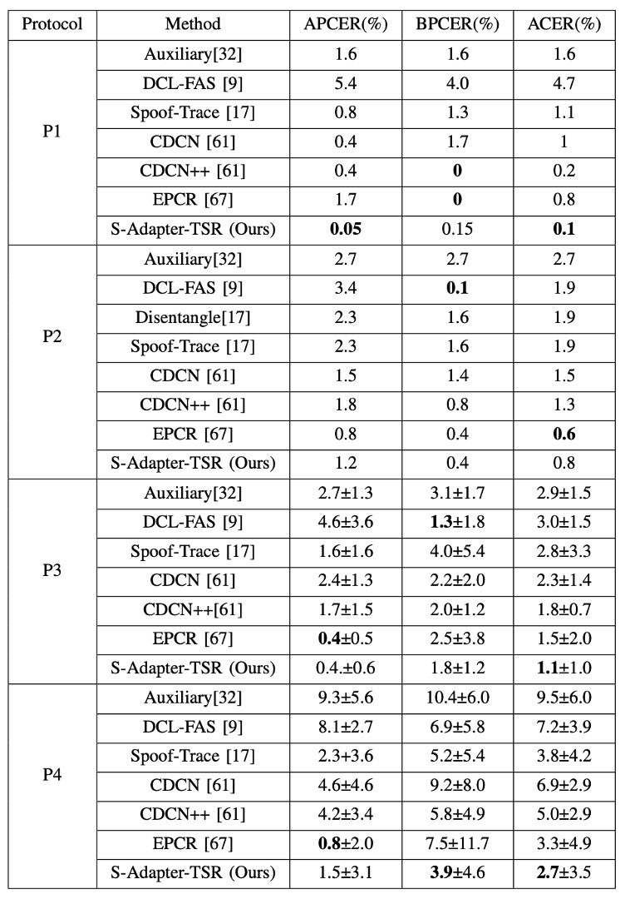
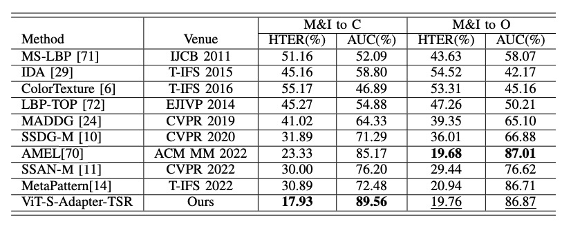

## 実際のノート

[**S-Adapter: Generalizing Vision Transformer for Face Anti-Spoofing with Statistical Tokens**](https://arxiv.org/abs/2309.04038)

---

Adapter は軽量なモデル調整方法で、通常は事前学習された Transformer モデルにいくつかの追加パラメータを加え、それらを特定のタスクに対して微調整します。これにより、モデル全体を再訓練することなく、タスクに特化した調整を行えます。

もし Transformer が近年の視覚的な主役ならば、Adapter はそのタスク間での役割を調整する器具と言えるでしょう。

:::tip
この概念に不慣れな方は、私たちの以前の論文ノートを参照できます：

- [**[19.02] Adapter: パラメータ節約 96%**](../../model-tuning/1902-adapter/index.md)
  :::

## 問題の定義

これまで見てきたように、FAS（Face Anti-Spoofing）のモデルがいかに難しいかはお分かりいただけたと思います。

単に「この顔が本物か偽物か」を判定するだけでなく、それを安定して判定しなければなりません。少なくとも、照明を変えたりカメラを変えたり、攻撃手法を変えたりした場合でも、モデルがすぐに崩れないことが求められます。

モデルが故障する原因は、通常、モデル自体が十分に強力でないからではなく、毎回訓練する際に慣れ親しんだ世界があまりにも小さすぎるからです。例えば、屋内で何千枚もの本物の顔の写真を撮影し、その後、ユーザーが太陽の下でスマホで顔認証を試みると、モデルがすぐに壊れてしまうような状況です。この時、いくら fine-tune しても、**domain shift（ドメインシフト）**の問題がある限り、モデルの汎化能力は失敗してしまいます。

そのため、さまざまな解決策が提案されています：対抗的学習を用いてスタイル変換を行ったり、メタ学習を用いて未知のシナリオをシミュレートしたり、真顔をより近づけ、偽顔を遠ざけたりする方法です。しかし、これらの方法の汎化能力は、特に**zero-shot**（ゼロショット）テストにおいて、少し足りない部分があり、問題は非常に顕著です。

その後、ViT（Vision Transformer）が登場し、みんなが期待していました。

なぜなら、Transformer のアテンションメカニズムは長距離情報を処理でき、構造も柔軟で、環境変動が強いタスクにはぴったりだと思われたからです。

しかし、問題はまた発生しました。

確かに、ImageNet の ViT の事前学習モデルを微調整すれば、CNN より少しは良い結果が得られるのですが、それでも「ほんの少し」の差に過ぎません。しかも、少数のサンプル（few-shot）やゼロショット（zero-shot）の条件では、ViT の汎化性能がいくつかの CNN ベースのベースラインよりも劣ることがあります。

その背後には、もっと根本的な問題があるかもしれません：

- **Transformer は遠くを見られるけれど、細かい部分を見られるのでしょうか？**
- **それは、肉眼では判別しにくい小さなテクスチャー、局所的な欠陥、または攻撃媒体が残した破綻を識別できるのでしょうか？**

あるいは、私たちがそれらの「スタイル以外のもの」を理解できると早すぎる前提を置いてしまっているのでしょうか？

## 解決策

ViT を FAS で使用する場合、最初のステップは通常、ImageNet で事前学習されたモデルを微調整することです。

しかし、もし高性能な GPU が 8 枚も手に入らなければ、ViT を使うのは難しいです。そこで、Adapter の方法を使って小さなモジュールを挿入し、特定のタスクに関連する層だけを訓練し、他の層はすべて凍結するというアイデアが生まれました。

この方法は Efficient Parameter Transfer Learning（EPTL）と呼ばれ、例えば Adapter、LoRA、Prompt-tuning などがこれに該当します。

ViT では、各ブロックを以下のように簡略化して記述できます（LayerNorm とショートカットは省略）：

$$
Y = W_i^{\text{MLP}}(W_i^{\text{MSA}}(X))
$$

ここで、$X$と$Y$は Transformer ブロックの入力トークンと出力トークンを表し、MSA は多頭自己注意層、MLP は多層パーセプトロンを示しています。Adapter を使用すると、各ブロックに小さなモジュールを加え、構造は次のようになります：

$$
Y = A_i^{\text{MLP}}(W_i^{\text{MLP}}(A_i^{\text{MSA}}(W_i^{\text{MSA}}(X))))
$$

ここで、$A_i^{\text{MSA}}$と$A_i^{\text{MLP}}$は挿入された Adapter です。元々の ViT の重み$W$はすべて凍結され、Adapter のパラメータだけが訓練されることで、「リソースを節約し、少しだけ変更する」目標が達成されます。

しかし、この Adapter のアーキテクチャは、自然言語処理タスクではうまく機能しますが、FAS には力不足です。

その理由は簡単に理解できます。通常の Adapter は線形層を使用しており、**空間構造の帰納的バイアス**が欠けています；

しかし、FAS タスクは逆に「**局所的な詳細**」を非常に重要視します。例えば、画質の欠陥、エッジのぼやけ、再構築ノイズなどは、グローバルトークンでは見分けることができません。

## モデルアーキテクチャ

<figure style={{"width": "90%"}}>

</figure>

Transformer が局所的なテクスチャ特徴を効果的に捉えられない問題を解決するために、著者は**S-Adapter**を提案しました。

そのインスピレーションは、従来のテクスチャ解析方法である Local Binary Pattern（LBP）から来ています。上の図(a)のように。

LBP の処理フローは、ピクセル値を直接分類するのではなく、まず局所的なテクスチャを抽出し、その後でヒストグラムを統計します。この統計的特徴は、照明の変化や素材の違いに対して高いロバスト性を持ち、初期の顔検出や生体認証タスクで広く使用されてきました。

S-Adapter のデザインは、このロジックを Transformer の世界に再解釈したものです：

> **ViT のトークンにも統計を学習させ、局所的なテクスチャから空間的な分布特徴を抽出する。**

全体の構造は以下の通りです：

<figure style={{"width": "90%"}}>

</figure>

モジュールは 2 つの段階に分かれています：**Token Map Extraction** と **Token Histogram Extraction**。

### Token Map Extraction

FAS シナリオにおいて、攻撃か否かを判断する鍵はしばしば局所的な細部に隠れています。

これらの細部は、再撮影時に生じるぼやけや、エッジの破綻、小さなテクスチャ異常などで、これらの特徴は Transformer の元々のグローバルな注意機構では捉えにくいものです。

しかし、ViT では自己注意を行う前に、入力されるトークンはすでに 1 次元のシーケンスにフラット化されており、空間的な構造を失っています。

そこで、**第一歩**として、著者はトークンの空間的な特性を復元するプロセスを設計しました：

- 入力トークン $X \in \mathbb{R}^{N_P \times C}$ を与え、ここで $N_P$ はパッチトークンの数（class トークンは除外）、$C$ は埋め込み次元；
- それを $X_R \in \mathbb{R}^{H \times W \times C}$ にリシェイプし、$H \times W = N_P$ とします；
- 次に、次元を置換（permute）して $X_M \in \mathbb{R}^{C \times H \times W}$ にし、$C$ チャネルの画像のような形になります。

その後、2D 畳み込み層 $W_\text{Conv}$ を使って局所的な特徴を抽出します：

$$
Z = W_{\text{Conv}}(X_M)
$$

このステップで、空間的な帰納的バイアスを再導入し、Transformer が持たない局所的なモデリング能力の弱点を補います。

モデルをさらに局所的な変化に敏感にするために、著者は中心差分（Center Difference, CD）操作を導入しました：

- 各トークン $Z_n$ について、その周囲の隣接トークン $P_n$ との差分を計算；
- 畳み込みカーネルの重み $\omega(p)$ で加重した合計を計算：

$$
Z^g_n = \sum_{p \in P_n} \omega(p) \cdot (Z_p - Z_n)
$$

これにより得られた $Z^g$ は、特に微妙なテクスチャの変化に対する細やかな局所的な勾配特徴をキャプチャします。

最終的に、元の特徴 $Z$ と勾配特徴 $Z^g$ を融合し、新しいトークンマップを形成します：

$$
Z^* = (1 - \theta) Z + \theta Z^g
$$

ここで、$\theta$ は二者の融合比率を制御します。これにより、ViT においても CNN のような局所的な特徴感度を導入できるようになります。

### Token Histogram Extraction

局所的特徴を加えたとしても、domain shift（異なるデバイスや照明条件による変動）は依然としてモデルの安定性を損なう可能性があります。

その理由は、局所的なピクセル値自体が環境要因によって干渉を受けやすいためです。

そこで第二段階として、著者はこれらの局所的特徴をさらに統計的に扱うことを決定し、各小領域での微分可能なヒストグラムを計算します。

直感的に言うと：

- 各パッチ内の特徴分布に対してソフトビンニングを行い；
- 単一のピクセル値ではなく、統計ベクトルを取得；
- モデルが局所領域の全体的な構造分布を学習できるようにし、跨ドメイン安定性を向上させます。

計算過程は以下の通りです：

まず、bin center $\mu$ と bin width $\gamma$ を定義し、ソフトビンヒストグラムは次のようになります：

$$
Z_{\text{Hist}}^{c,h,w}
= \frac{1}{JK} \sum_{j=1}^{J} \sum_{k=1}^{K} \exp \Bigl( -\gamma_c^2 (Z^*_{c,h+j,w+k} - \mu_c)^2 \Bigr)
$$

ここで：

- $J = K = 3$、すなわち 3x3 の畳み込みウィンドウ；
- ストライド = 1、パディング = 1、サイズが変わらないようにします。

このソフトビンニングにより、bin center に近い値が大きな貢献をし、遠い値は小さな貢献をすることで、微分可能な形になります。

さらに分解すると：

$$
Z_{\text{Hist}}^{c,h,w}
= \frac{1}{JK} \sum_{j=1}^{J} \sum_{k=1}^{K} \exp (-U_c^2)
$$

$$
U_c = \gamma_c (Z^*_{c,h+j,w+k} - \mu_c)
$$

ここで、$U_c$ は 2 層のピクセル単位 1x1 畳み込みで実現できます：

- 第一層 $W_{\text{Conv1}}$：重みは 1 に固定、バイアスは学習可能（$-\mu$に対応）；
- 第二層 $W_{\text{Conv2}}$：バイアスは 0 に固定、重みは学習可能（$\gamma$に対応）。

このような設計により、bin center と bin width は訓練によって自動的に調整されます。

最終的に、ヒストグラム結果 $Z_\text{Hist}$ は $N_P \times 8$ のトークンにリシェイプされ、$N_P \times 768$ に投影され、元のトークンと統合されます。

### Gram Matrix

深層学習の文脈では、画像特徴を大まかに二つのカテゴリに分けることができます：

- **Content**：タスクに関連する本質的な情報、例えばテクスチャの破綻、ぼやけたエッジ、再構成痕跡など；
- **Style**：画像撮影環境に関連するスタイルの特徴、例えば照明、彩度、色の偏り、ノイズの分布など。

過去には、これら二つの情報を分離するために、adversarial learning を使用した多くの手法が試みられました。しかし、そのような手法は不安定で収束しにくく、特に cross-domain タスクでは収束速度や安定性が課題となります。

本論文では、より直感的なアプローチを採用しています：**スタイルは Gram 行列で表現できることが分かっているので、直接 Gram 行列に正則化を施す。**

まず、著者はトークンマップ$Z \in \mathbb{R}^{C \times H \times W}$ の Gram 行列を次のように定義しました：

$$
G(Z)_{k,k'} = \frac{1}{CHW} \sum_{h=1}^H \sum_{w=1}^W Z_{k,h,w} \cdot Z_{k',h,w}
$$

ここで、$Z_{k,h,w}$は第$k$チャンネルの空間位置$(h,w)$の値です。そして、$G(Z)$は各チャンネル間の共分散構造を表し、画像の「スタイル」を示します。

著者の設計では、すべての画像スタイルが一致することを求めているのではなく、**bonafide（本物）サンプル間のスタイルの一貫性**のみを正則化しています。

このデザインには二つの利点があります：

1. 攻撃サンプルのスタイル表現に干渉しないため、正負サンプルの境界をぼかすことがありません；
2. 現実の仮定に合致します：**bonafide は「現実世界からの」一貫した分布であり、攻撃はどこからでも来る可能性がある。**

二つのドメインから来た bonafide トークンマップ、$Z_{D1}$と$Z_{D2}$が与えられた場合、スタイル正則化損失は次のように定義されます：

$$
\mathcal{L}_{\text{TSR}} = \left\| G(Z_{D1}) - G(Z_{D2}) \right\|_F^2
$$

これにより、二つの bonafide サンプルの Gram 行列の差異が小さいほど、スタイルが一致し、モデルがコンテンツ特徴に集中して学習できるようになります。

下図はこの設計ロジックです：

<figure style={{"width": "90%"}}>

</figure>

異なるドメインの bonafide サンプルをそのスタイルに整列させ、spoof 攻撃サンプルには追加の制約を加えず、識別性を保持します。

TSR に加えて、モデルは最終的に真偽を識別できる必要があるため、著者は一般的な BCE（バイナリ交差エントロピー）を使用しています：

$$
\mathcal{L}_{\text{BCE}} = - \left[ y \cdot \log(\hat{y}) + (1 - y) \cdot \log(1 - \hat{y}) \right]
$$

複数のドメインがある場合、すべての bonafide ドメインの組み合わせを平均します：

$$
\mathcal{L}_{\text{TSR}}^{\text{avg}} = \frac{1}{N} \sum_{(D_i, D_j)} \left\| G(Z_{D_i}) - G(Z_{D_j}) \right\|_F^2
$$

最終的な総損失は次のように計算されます：

$$
\mathcal{L}_{\text{total}} = \mathcal{L}_{\text{BCE}} + \lambda \cdot \mathcal{L}_{\text{TSR}}^{\text{avg}}
$$

ここで、$\lambda$は超パラメータで、スタイル正則化が全体の訓練に与える影響の程度を制御します。

## 討論

このセクションでは、S-Adapter のさまざまな実験設定での性能を見ていきます。

著者は四つの異なる評価タイプを行いました：

- Intra-Domain テスト（単一ドメイン内の訓練とテスト）
- Cross-Domain テスト（異なるドメイン間）
- Few-Shot Cross-Domain テスト（少量のターゲットデータ）
- Unseen Attack テスト（未見の攻撃タイプ）

使用されたデータセットには、CASIA-FASD、Replay Attack、MSU MFSD、OULU-NPU、SiW-M が含まれます。評価指標には、HTER、ACER、EER、AUC、FPR = 1%時の TPR が含まれます。

### Intra-Domain テスト

著者は OULU-NPU の 4 つの標準プロトコルにおいて、既存の方法と S-Adapter のパフォーマンスを比較しました。結果は以下の表の通りです：

<figure style={{"width": "60%"}}>

</figure>

表からわかるように、ACER という指標において、S-Adapter はほとんどのプロトコルで最良またはほぼ最良の結果を達成しています。これは、**統計的特徴と局所的な感知**の設計が、単一のデータセット内での訓練とテストであっても、真顔と偽顔の細部に対する分類器の感度を効果的に向上させることを意味しています。

しかし、Intra-Domain だけでは汎化能力を証明するには十分ではありません。

### Cross-Domain テスト

Cross-Domain テストには、クラシックな MICO プロトコル（CASIA-FASD、Replay-Attack、MSU-MFSD、OULU-NPU の 4 つのデータセットから 1 つを除外するテスト）が使用されました。

結果は以下の表の通りです：

<figure style={{"width": "90%"}}>

</figure>

HTER（半誤差率）や AUC（ROC 曲線下の面積）で見ると、**S-Adapter は四つの leave-one-out テストで ViT†ベースラインを全面的に上回り、近年の SoTA 手法である SSAN-R や MettaPattern なども凌駕しています**。

これは、前述の設計の核心を再確認させるものです：**ViT を単に微調整するだけでなく、FAS タスクの特性に合わせて局所的な識別力とスタイルの耐干渉能力を強化しています**。

### Limited Source Domains テスト

現実の状況では、クロスドメインデータセットを収集するのは容易ではありません。

そのため、著者は「2 つのソースデータセットのみで訓練した場合」（例えば MSU + Replay）に、モデルがクロスドメイン性能を維持できるかどうかをさらにテストしました。

結果は以下の表の通りです：

<figure style={{"width": "90%"}}>

</figure>

たとえ 2 つのソースしか使用しなくても、S-Adapter は「M&I to C」などのシナリオで**他の手法（AMEL など）を明らかに超え**、データ量が限られた状況でも良好なロバスト性を証明しました。

## アブレーション実験

最後に、著者は S-Adapter と TSR それぞれの貢献を具体的に検証するためにアブレーション実験を行いました。

### S-Adapter のコンポーネントの効果

まず、著者は異なるバージョンの S-Adapter を検証しました：

- **S-Adapter**（完全バージョン）
- **S-Adapter w/o hist**（ヒストグラム層を削除）
- **S-Adapter w/o hist(θ=0)**（ヒストグラムと勾配抽出を同時に削除）

実験結果は以下の図の通りです：

<figure style={{"width": "60%"}}>

</figure>

実験結果から以下のことがわかります：

- 完全版 S-Adapter は 4 つのクロスドメインシナリオで HTER が最良の結果を示しました；
- ヒストグラムを削除した（w/o hist）場合、パフォーマンスが明らかに低下；
- 勾配も削除した（θ=0）場合、パフォーマンスが最も低下。

これにより、**統計的特徴（ヒストグラム）と局所的勾配はクロスドメイン識別に実質的な貢献をしていることが証明されました**。

ただし、`C&I&M to O`という特異な状況では、勾配を加えることで HTER がわずかに増加しました。

著者は、OULU-NPU データセットの解像度が高く、I、C、M ソースの解像度が低いため、勾配特徴が解像度間で一致しない可能性があると推測しています。一方、ヒストグラム統計層はこのギャップを平滑化できるため、最終的に安定したパフォーマンスを維持しました。

### ヒストグラムがバニラアダプタに与える強化効果

ヒストグラムが一般的に有効であるかを検証するために、著者は標準的なバニラアダプタに CDC 層とヒストグラム層を追加しました。

結果は以下の通りです：

<figure style={{"width": "70%"}}>

</figure>

結果からわかるのは：

- CDC を追加すると HTER が低下（HTER は低いほど良い）；
- ヒストグラムを追加すると、HTER の低下幅がさらに顕著になります。

これは、「ヒストグラム特徴」という設計自体がクロスドメイン安定性の普遍的な増益を持っており、S-Adapter アーキテクチャに限定されないことを意味しています。

### TSR モジュールと λ 超パラメータ

次に、Token Style Regularization（TSR）のアブレーションを見てみましょう。

著者は λ 値を 0 から 1 まで設定し、HTER への影響を観察しました。結果は以下の通りです：

<figure style={{"width": "60%"}}>

</figure>

結果からわかるのは：

- λ > 0 の場合、HTER が一般的に低下し、TSR が有効であることを証明；
- λ が大きすぎる（例えば 0.5 以上）と、スタイルの整列が過度に強化され、分類性能に影響を与える；
- 一般的には λ = 0.1 あたりが推奨され、スタイル正則化と分類効果のバランスが取れます。

## 結論

この論文は、より深い ViT バックボーンを追求したり、複雑な対抗学習を使ってドメインシフトを逆転させようとするのではなく、比較的素朴で効果的なアプローチを選びました：

> **局所的なテクスチャと統計的特徴を再理解し、Vision Transformer に差異を感知させる。**

S-Adapter の各設計は、FAS タスクの最も根本的な二つの問題に直接アプローチしています：

- 局所的な詳細の識別
- クロス環境でのスタイル差異に対する耐干渉性

真に安定した汎化能力は、より複雑なネットワークを積み重ねることから来るのではなく、タスクの本質を理解し、洗練することから生まれます。著者は、完全なクロスドメインテストを通じて、自分の選択が偶然ではなく、広く適用可能な設計であることを証明しました。
