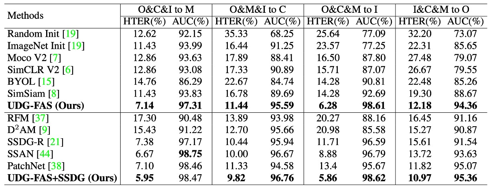
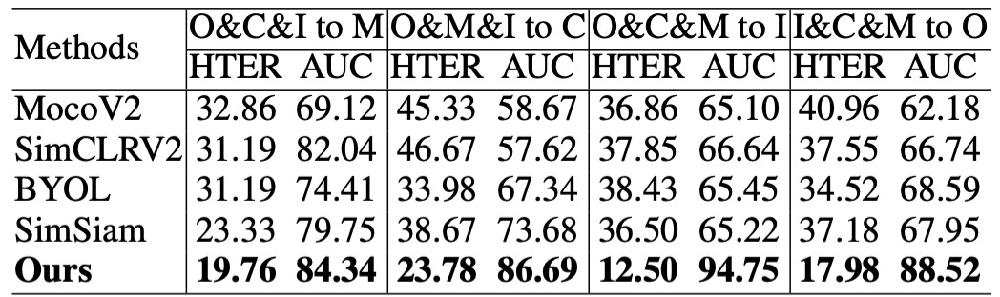
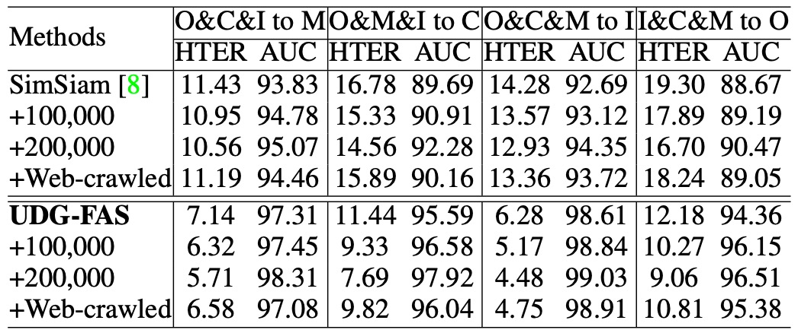

## スタイルの断片

[**Towards Unsupervised Domain Generalization for Face Anti-Spoofing**](https://openaccess.thecvf.com/content/ICCV2023/papers/Liu_Towards_Unsupervised_Domain_Generalization_for_Face_Anti-Spoofing_ICCV_2023_paper.pdf)

---

もしあなたが FAS のモデルをトレーニングするのが十分に難しいと感じているなら、ラベルなしのデータを与えて、ただ画像を見て物語を語らせるだけで、その状況は悪化し、理解不能にさえなります。

これが私たちが今直面しているシナリオです。

## 問題の定義

顔認識のためのフェイスアンチスプーフィング（FAS）は、顔認識システムの重要な防線として常に位置付けられてきましたが、次の 2 つの致命的な欠点があります：

- データの収集とラベリングにかかるコストが非常に高い
- モデルはシーンが変わるとすぐに無力になる

この部分については、私たちが数十本の論文を読んできた中で、おそらくあなたもすぐに口にできるでしょう。

ドメイン間（cross-dataset）の安定性を保つために、過去には様々なドメイン一般化（Domain Generalization）手法が提案されてきましたが、これらの方法には前提があります。それは、十分なラベル付きデータが必要だということです。

実際には、大量のデータを得ることができるかもしれませんが、それをラベル付けするための人力やリソースが足りないのが現実です。

そのため、最近では「無監督学習」に注目が集まり、「ラベルなし」問題を解決しようとしています。

対比学習には 2 つの大きな流派があります：MoCo と SimCLR です。

これらの対比学習手法は、一般的な画像タスクでは優れた結果を収めていますが、FAS に適用すると、そのパフォーマンスは予想通りにはいきません。「Real / Fake」という 2 クラスの FAS の場合、負のサンプルの定義が難しく、その結果、モデルはどちらを排除すべきか混乱してしまうことがよくあります。

同様に、BYOL や SimSiam は負のサンプルの依存を排除しようと試みていますが、FAS のデータではうまくいきません。なぜなら、顔にはアイデンティティバイアスやドメインバイアスが自然画像よりも豊富に含まれているからです。モデルは「偽の顔」を識別することを学んだと思っても、実際にはどのデータセットで誰の顔が撮影されたかを覚えているだけに過ぎないのです。

さらに困ったことに、多くの人々はあなたが ImageNet の事前学習されたバックボーンを持っていると仮定しています。しかし、ImageNet は「偽顔」と「本物の顔」の違いを教えてはくれません。「猫」や「犬」を区別するだけです。そのため、FAS でのゼロショットや少ないサンプル条件下で、モデルのパフォーマンスはどうしても限界を迎えます。

だから、問題は最初の原点に戻ります：

- **ラベルがなく、適切な事前学習データもない場合、モデルは何を学習するのでしょうか？**
- **アイデンティティとドメインのノイズがスプーフィングそのものより強い場合、どうやってモデルに「学ぶべきこと」を見せることができるのでしょうか？**

この論文の答えはこうです：まず、顔を分解しましょう！

## 解決策

UDG-FAS の全体的な設計は、次の核心的な目標に焦点を当てています：ラベルなしの前提で、アイデンティティとシーンの偏差を段階的に排除し、モデルが本質的なスプーフィングの手がかりに集中できるようにすること。

この目標は 3 つの戦略モジュールに分解されます：

1. **Split-Rotation-Merge (SRM)** を通じて、1 つの画像内でアイデンティティバイアスを排除
2. **同域隣接探索（In-domain NN）** によって、アイデンティティを越えた表現の差異を緩和
3. **クロスドメイン隣接探索（Cross-domain NN）** によって、データソース間のスタイルの偏移を処理

状況はいつものように複雑ですが、順を追って見ていきましょう。

### SRM モジュール

**Split-Rotation-Merge（SRM）** は、この研究でアイデンティティバイアスを排除するための重要なモジュールであり、活体識別に必要な局所的なスプーフィング手がかりを保持しつつ、モデルが顔の構造や個体差に依存することを弱めることを目指しています。

全体のプロセスは次の通りです：

まず、入力画像 $x_1$ は非破壊的なデータ拡張（例えば、明るさ調整、ミラー反転など）を施され、その後 $m \times m$ の局所ブロックに分割されます。各ブロック $x^p_1$ はランダムに回転され、元の顔の構造による対称性や空間配置の偏好を破壊し、モデルがアイデンティティに関連する信号に過剰に敏感にならないようにします。

次に、これらの局所ブロックはそれぞれエンコーダ $f$ を通じて対応する特徴ベクトルを生成します：

$$
e^p_1 = f(x^p_1)
$$

著者はこれらの局所ベクトルを直接使用して対比学習を行うのではなく、その中からランダムに $n$ 個のブロックを選び、その特徴の平均を計算して、アイデンティティに依存しない表現 $v_1$ を得ます：

$$
v_1 = \frac{1}{n} \sum_{p \in s} e^p_1
$$

ここで $s$ は選ばれたパッチインデックスのサブセットを示します。この設計の背後にある考えは、スプーフィングの手がかりは多くのブロックに分布している（例えば、テクスチャ、反射、印刷ノイズなど）一方、アイデンティティの特徴は異なる顔の領域で大きく変化するという点です。平均操作を通じて、ブロック間の不安定な変動をさらに排除することができます。

生成された局所的な表現 $v_1$ は、次にプロジェクター $g$ と予測器 $q$ を通じて、対比用のベクトル $p_1$ を生成します。

これに対応するもう一つの画像ビュー $x_2$ は、切り分けや回転を行わず、エンコーダ $f$ とプロジェクター $g$ を通じて、全体的な特徴ベクトル $z_2$ を得ます。

損失設計では、著者は SimSiam のコサイン類似度損失を採用し、同時にストップグラディエント機構を使用して、コラプスを防ぎ、安定した学習を行います：

$$
\mathcal{L}_{\text{SRM}}^i = \frac{1}{2} \cdot \text{dist}(p_1^i, \texttt{stopgrad}(z_2)) + \frac{1}{2} \cdot \text{dist}(p_2^i, \texttt{stopgrad}(z_1))
$$

ここで、$\text{dist}(\cdot)$ はコサイン距離です。対称性を保つために、学習過程では $x_1$ と $x_2$ の役割を交換して、双方向学習を行います。

全体として、SRM モジュールが実現するのは単なるデータ拡張ではなく、構造を解耦することを目的とした特徴変換プロセスです。これにより、モデルはスプーフィング情報を失うことなく、アイデンティティ構造を効果的に遮蔽し、より汎化可能な局所表現を構築できるようになります。

### インドメイン最寄りの隣接点

1 枚の画像でのアイデンティティの偏りを処理した後、UDG-FAS が次に直面する課題は、どのようにして複数のサンプルからなるデータセットで、アイデンティティ間の特徴拡散問題をさらに解消するかです。

SRM モジュールは、顔構造からのアイデンティティ信号を効果的に抑制できますが、実際の FAS タスクでは、大量のアイデンティティ間のサンプルで構成されたデータ分布に直面します。同じドメインからのサンプルであっても、モデルが学習する特徴はアイデンティティの違いによって分断され、引き伸ばされることがあり、意味的に一致するサンプルが正のサンプルとして認識されないことがあります。

このような「アイデンティティ間の同じカテゴリにおける特徴拡散問題」をさらに処理するために、著者は\*\*インドメイン最寄りの隣接点（IDNN）\*\*モジュールを設計し、補完的な対比機構として利用しています。

その核心的なアイデアは、ラベルなしの前提の下で、埋め込み空間の幾何学的近接性を利用し、意味的に一致するサンプルペアを推測し、それらを対比学習に組み込むことでクラス内の一致性を高めることです。

例えば、任意のサンプルの全体的な表現$z$について、同一のデータセット内のサポート集合$Q^{\text{in}}$内で最も近い隣接点を検索し、それを正のサンプルとして利用します：

$$
z_{\text{NN}} = \underset{k}{\arg\min} \, \| z - z_k^{q_{\text{in}}} \|_2
$$

ここで、検索はインドメインに限定されており、シーンの一貫性を保つことで検索誤差を減らし、ドメイン間の分布偏移を導入しないようにしています。

次に、検索された隣接点$z_{\text{NN}}$を対比損失に組み込み、SRM モジュールから得られた予測ベクトル$p^i$とマッチさせます：

$$
\mathcal{L}_{\text{IDNN}}^i = \frac{1}{2} \cdot \text{dist}(p_1^i, \texttt{stopgrad}(z_{\text{NN}})) + \frac{1}{2} \cdot \text{dist}(p_2^i, \texttt{stopgrad}(z_{\text{NN}}))
$$

ここでも、SimSiam 型のストップグラディエント設計を使用し、対称構造を維持し、コラプスを防いでいます。

IDNN モジュールの貢献は表現の区別を強化することではなく、逆に「同一カテゴリ内で埋め込み空間の離散度を低減すること」にあります。これにより、アイデンティティの変異によって引き離されていた正のサンプルが再び集まり、スプーフィングクラスの意味的密度を高めることができます。

また、検索操作が同一データソース内で行われるため、アイデンティティの違いを除けば、解像度、撮影条件、素材の反射などの環境要因は一貫性を持つため、IDNN は全体のアーキテクチャにおいて安定性と汎化価値を兼ね備えています。

このモジュールは、SRM が解決できなかったサンプル間の断片化を補完し、ドメイン自体の画像詳細を訓練手がかりとして保持することができます。

### クロスドメイン最寄りの隣接点

単一ドメイン内での隣接検索は、モデルが異なるアイデンティティでの活体意味を合わせるのに役立ちます。

しかし、実際のアプリケーションシナリオでは、FAS システムは多様なデバイスやシーンに展開されることが多く、その入力データは解像度、撮影機器、照明条件、背景スタイルなどの違いにより強いドメインギャップを示します。

これらのクロスドメイン要因により、モデルが学習する特徴分布は高度に異質になります。もし原始埋め込みを使ってクロスデータセットでの隣接点検索を行うと、意味的に誤った一致が生じ、異なるスプーフィングタイプのサンプルが間違って近づいてしまう可能性があります。

そのため、著者は最後にクロスドメイン最寄りの隣接点（CDNN）モジュールを導入し、対比学習の第 3 の正のサンプルパスとして利用しています。

異質分布の問題を解決するために、著者はまず各ドメインの特徴を標準化処理し、ゼロ平均と単位分散を持つ参照ガウス分布に変換します。ドメイン$d$からの任意のサンプルについて、その全体的な特徴$z$と結合された局所特徴$v$は次のように変換されます：

$$
\hat{z} = \frac{z - \mu_d}{\sqrt{\sigma_d^2 + \epsilon}}, \quad \hat{v} = \frac{v - \mu_d}{\sqrt{\sigma_d^2 + \epsilon}}
$$

ここで、$\mu_d, \sigma_d^2$はそのドメインの特徴の平均と分散を示し、$\epsilon$はゼロ除算を避けるために加えられる小さな定数です。

正規化後、サンプル間の類似度計算はもはや全体の表現だけに依存するのではなく、$\hat{z}$と$\hat{v}$の距離を結合して計算されます：

$$
\text{dist} = \| \hat{z}_i - \hat{z}_j \|_2 + \| \hat{v}_i - \hat{v}_j \|_2
$$

この設計は、スプーフィング情報の全体と局所の一貫性を同時に考慮しており、アイデンティティとスタイルが単一スケールで引き起こす誤導効果を効果的に低減します。

上記の検索プロセスを通じて、モデルはクロスドメインのサポートセット内で意味的に近いサンプル$z_{\text{NN}}$を見つけ、SimSiam 型の対比学習に組み込みます：

$$
\mathcal{L}_{\text{CDNN}}^i = \frac{1}{2} \cdot \text{dist}(p_1^i, \texttt{stopgrad}(z_{\text{NN}})) + \frac{1}{2} \cdot \text{dist}(p_2^i, \texttt{stopgrad}(z_{\text{NN}}))
$$

CDNN モジュールの設計目標は、単なるデータ拡張や多様性の補充にとどまらず、クロスシーン展開でのモデル意味崩壊現象を解決することです。

### 訓練目標の統合

上記の 3 つの損失項は最終的な目標関数として統合されます：

$$
\mathcal{L} = \mathcal{L}_{\text{SRM}} + \lambda_1 \cdot \mathcal{L}_{\text{IDNN}} + \lambda_2 \cdot \mathcal{L}_{\text{CDNN}}
$$

初期段階の隣接点マッチング誤差が訓練の不安定性を引き起こさないように、$\lambda_1$と$\lambda_2$は時間進行戦略を採用し、最初の$T_1$回の訓練中は 0 に設定し、その後徐々に有効化されることで、初期段階の表現が自発的に形成される過程を保持します。

UDG-FAS の設計は、ラベルなしのデータに依存せず、バックボーンアーキテクチャの革新を追求することなく、注目すべきは「信号フィルタリング」と「表現整列」という 2 つの核心的な問題に集中しています。これは対比学習の再パッケージではなく、FAS タスクにおける固有のデータ偏差に対するターゲットを絞った無監督解法です。

## 討論

提案された方法の異なるアプリケーションシナリオにおける一般化能力を総合的に評価するために、UDG-FAS 論文では 6 つの実験プロトコルを設計しました。

### プロトコル 1：少ないラベルの下でのクロスドメイン一般化能力

<figure style={{"width": "90%"}}>

</figure>

このプロトコルは、一般的な半教師あり学習シナリオに基づいて設計されており、モデルが複数のデータソースからの未ラベル画像を事前に取得し、ラベル付きデータの一部だけで微調整を行うことを前提としています。具体的には、モデルは 3 つのドメインで未ラベルデータを使って事前訓練を行い、その後、ターゲットドメインで異なる比率のラベル付きサンプル（5％から 100％）を用いて微調整を行い、最終的に未見のドメインでテストします。

実験結果は、UDG-FAS がより意味的構造のある初期化法として機能し、ImageNet の事前訓練やその他の無監督ベースラインと比較して優れていることを示しています。極端に少ないラベルの状況でも、事前訓練された特徴は優れた適応性を持ち、下流の分類タスクを効果的にサポートし、アイデンティティとドメインの偏りによる意味的な誤配置を軽減します。

さらに、UDG-FAS と既存の DG 手法（例えば、SSDG-R）を組み合わせることで、全体的なパフォーマンスをさらに向上させることができ、そのモジュール化された統合性と一般化の可能性を示しています。

### プロトコル 2：完全無ラベル条件での意味的品質検証

<figure style={{"width": "70%"}}>

</figure>

このプロトコルは、モデルが事前訓練で学習した特徴の品質を検証することを目的としています。微調整やラベル付きデータの影響を取り除き、kNN 分類器を使ってターゲットドメインでの認識能力を評価します。この設定は、特徴の意味的構造が十分に明確であるかどうか、モデルが未知のドメインでゼロパラメータ予測を行えるかどうかをテストするものです。

実験結果は、UDG-FAS が学習した表現は他の無監督手法を上回るだけでなく、完全無監督の状況でも、その事前訓練された特徴が、ラベル全体を使った微調整結果を超える分類能力を持つことを示しています。

これにより、良好に設計された事前学習メカニズムを使用すれば、ラベル信号に依存しなくても、モデルがスプーフィング現象に対する識別能力を持った意味空間を内部的に構築できることがわかります。

### プロトコル 3：大規模無ラベルデータにおける事前訓練性能の拡張性

<figure style={{"width": "70%"}}>

</figure>

このプロトコルは、利用可能な無ラベルデータの規模が大きく増加した場合に、モデルがその事前特徴空間を効果的に拡張できるかどうかを確認することを目的としています。実験では、著者は大規模な CelebA-Spoof の未ラベルデータと、インターネットから収集した実際の顔のサンプルを無監督事前訓練の補完ソースとして導入しました。

実験結果は、UDG-FAS がより多様なデータから性能の向上を安定的に得ることができ、データ量の増加に伴ってその増加傾向が続くことを示しています。他の手法と比較して、UDG-FAS はこのようなオープンソースデータから有用な信号を学習する能力に優れ、良好なデータ展開性とノイズ耐性を示しています。

無監督学習において、データ自体の多様性と構造品質が、精緻なラベルよりもモデルの表現の一般化能力を効果的に向上させることが分かります。

### プロトコル 4：データソースが制限された場合の一般化能力検証

<figure style={{"width": "70%"}}>

</figure>

このプロトコルは、より厳しい条件下で設定されており、無ラベルの事前訓練のために 2 つのデータセットのみを使用し、限られたデータソースでモデルが依然として安定した一般化能力を持つかどうかをテストします。テストデータは別の未見ドメインから取得され、クロスセット転送学習シナリオを形成します。

実験結果は、データソースが制限されている場合でも、UDG-FAS が既存の無監督および弱監督手法よりも安定して優れており、良好な**データ効率**と**意味的展開性**を示していることを示しました。また、アイデンティティとスタイルの二重の偏りを扱う際、その特徴空間の安定性は特に顕著であり、テストデータセットと訓練ソースが大きく異なる場合でも、意味的な一貫性を保ち続けます。

### プロトコル 5：データソースと攻撃タイプの両方に対する一般化チャレンジ

<figure style={{"width": "90%"}}>

</figure>

このプロトコルは、**ドメイン間**と**攻撃タイプ間**の両方の分布転送を組み合わせ、テストの難易度をさらに高めます。訓練段階では特定のデータセットといくつかの既知の攻撃タイプのみを使用して事前訓練と微調整を行い、テスト時には異なるドメインで**未見のスプーフィングタイプ**に直面します。

この設定では、モデルは既知の視覚的スタイルに依存することができず、スプーフィングの手がかり自体のパターンにも意味的なジャンプが存在します。実験結果は、UDG-FAS が安定して区別可能な表現空間を学習し、攻撃一般化に特化した強化手法を含む既存の多くの最先端手法を上回ることを示しています。

この結果は、特定の攻撃形式に未接触であった訓練段階でも、UDG-FAS が無監督事前訓練の過程でアイデンティティとスタイルの偏りを抑制することにより、**スプーフィングの意味的特徴の本質を内面化**できることを示しています。これは単なる攻撃タイプの記憶に留まらない結果です。

### プロトコル 6：未見の 3D 攻撃と大規模データにおける一般化テスト

<figure style={{"width": "70%"}}>

</figure>

このプロトコルは、最も挑戦的なシナリオの 1 つに焦点を当てています：**モデルが未見の 3D マスク攻撃サンプルを見たことがない状態で、その攻撃タイプに対しても一般化できるかどうか**をテストします。訓練段階では 3D スプーフィングを含まないデータが使用され、テスト段階では 3DMAD および HKBU-MARs などのデータセットで評価され、さらに大規模な CelebA-Spoof (CA)データセットで混合スプーフィング条件下でのモデルの安定性を検証します。

結果は、UDG-FAS が完全に未見のモード条件下でも安定した識別性能を維持し、多くの既存の強力なベースラインと一般化指向手法を上回ることを示しました。これは、モデルが特定のスプーフィング表面の手がかりに依存していないことを示しており、モード間で転送可能な表現構造を学習していることを意味します。

さらに、CA の大規模評価では、UDG-FAS が既存の手法を超える一般化能力を示し、無監督事前訓練戦略が実務での展開においてスケールの拡張性と未知の攻撃に対応する柔軟性を持っていることを再確認しました。

## 結論

UDG-FAS は、モデルアーキテクチャや訓練フローでの突破を求めているわけではなく、もっと根本的なレベルで問いを投げかけています：

> **もしラベルに依存しなければ、残るのは何か？**

この論文の答えは、表現そのものに戻ることです。

新しいバックボーンを提案することも、複雑な損失項を設計することもなく、いくつかの手順を通じて、モデルが無監督の条件下で、アイデンティティとスタイルのノイズを越える意味空間を構築できるようにします。

この研究の貢献は単に良い結果を提供することにとどまらず、新しい視点を提供しています：

> **監督情報が得られない場合、特徴設計の責任を分類器や正則化手法に押し付けることはできません。**

学習の初期段階で選択と制限を行い、モデルを正しい方向に導く必要があります。それではデータに何が正しいかを教えてもらうのを待つのではなく。

より長期的な視点から見ると、この種の方法は、従来の FAS 訓練フローでの「攻撃サンプル」に依存することを次第に取って代わるかもしれません。

結局のところ、活体かどうかの意味的境界は、単なる攻撃の表面のテクスチャだけでなく、アイデンティティを越え、モードを越え、データソースを越える意味的共鳴であるべきです。

そして、これが無監督学習の真の始まりかもしれません。
