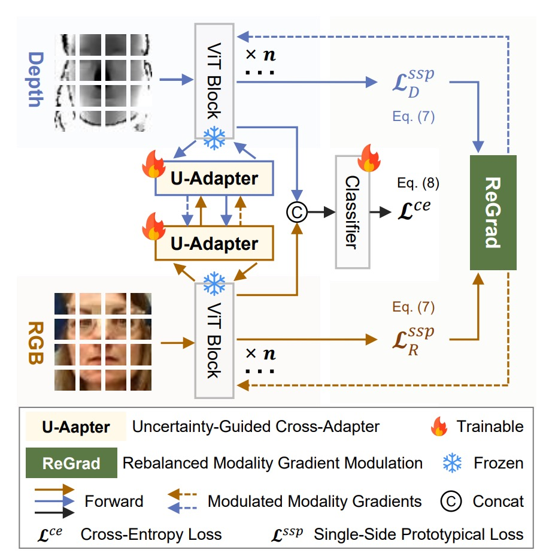
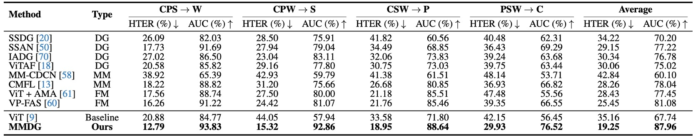
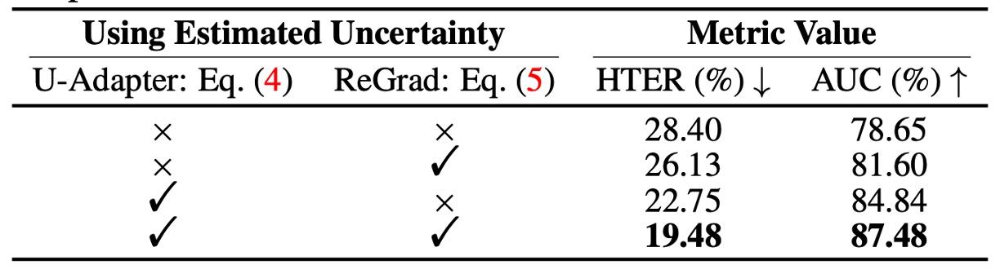

## 信頼管理学

[**Suppress and Rebalance: Towards Generalized Multi-Modal Face Anti-Spoofing**](https://arxiv.org/abs/2402.19298)

---

この論文が発表された時点で、コンピュータビジョン分野はすでに多モーダルアーキテクチャの時代となっていました。

しかし、FAS（顔認証詐欺防止）の問題は依然として存在し、ドメイン間の一般化は常に難題です。

## 問題の定義

RGB モデルは動作が速く、データセットの構築も比較的簡単です。他のモーダルの情報も悪くはなく、たとえば深度画像は立体構造を視覚化でき、赤外線は温度や材質の反射を感知することができ、顔が「本物か偽物か」を判断する上で非常に有益です。

しかし、なぜ多モーダルはほとんど使われていないのでしょうか？あるいは、使った結果、逆に一般化が悪化し、実際に使える場面がほとんどないのでしょうか？

著者は二つの重要な問題点を指摘しています：

- **Modality Unreliability（モーダルの信頼性の問題）**

  センサーが変われば、光源が変われば、ドメイン全体が変わってしまいます。特に IR（赤外線）や深度は、元々補強すべき情報が、逆に誤解を招く原因となることがあります。

  クロスモーダル融合で全てのモーダルの情報を一緒にすると、結果は半々で、互いに足を引っ張り合うこともあります。

- **Modality Imbalance（モーダルの不均衡）**

  モデルの訓練では、通常「最も早く学習できるモーダル」を自動的に選びますが、それは多くの場合 RGB です。

  他のモーダルの情報は学習されず、表面的には有用でも、実際にはしっかりと学習されていません。ターゲットドメインに入ったとき、RGB はもはや役に立たなくなり、他の遅いモーダルもまだ訓練されていないので、結局一緒に失敗してしまいます。

だからこそ、多モーダル FAS の難しさは「多さ」だけでなく、これらのモーダルが実際には平等でなく、信頼できないという点にあります。

そのため、この論文の著者は次のように述べています：

> **「信頼性の低い信号源」を同時に扱い、「偏らないモデル」を訓練する必要がある。**

これがこの論文の問題定義の核心です。

## 問題の解決

<figure style={{"width": "60%"}}>

</figure>

多モーダル FAS の問題を解決するために、著者は **MMDG**（Multi-Modal Dynamic Gradient）アーキテクチャを提案し、主に次の二つの機能を強調しています：

- **Suppress（信頼性の低いモーダルの抑制）**：クロスモーダル融合時に信頼性の低いモーダルにペナルティを与え、その影響を小さくします。
- **Rebalance（モーダル学習速度のバランス調整）**：訓練時にモーダル間の勾配を調整し、各モーダルが効果的に学習できるようにします。

上のアーキテクチャ図から見ると、各モーダル（RGB、深度、赤外線）はそれぞれ ViT バックボーンを持ち、専用の U-Adapter がクロスモーダル融合を担当します。

訓練時には、U-Adapter のみがファインチューニングされます。最後に ReGrad モジュールを通じて勾配の動的調整が行われ、各モーダルが効果的に学習できるようにし、どのモーダルも他のモーダルに足を引っ張られないようにします。

### U-Adapter

上の図のように、U-Adapter はこの方法の核心モジュールで、各 ViT ブロックの後に埋め込まれており、アダプターのみが微調整されます。その任務は次の通りです：

1. 各モーダルの「信頼性の低い」トークンを検出する（不確実性推定モジュール UEM を通じて）。
2. クロスモーダル融合時にこれらの信頼性の低いトークンの影響を低減し、その情報が他のモーダルを汚染しないようにする。

:::tip
もしアダプターの概念に不明な点があれば、以下の過去のノートを参考にしてください：

- [**[19.02] Adapter: パラメータ節約 96%**](../../model-tuning/1902-adapter/index.md)
  :::

### 不確実性推定モジュール

上の図(b)を参照し、信頼性の低い領域を見つけるために、著者は不確実性推定モジュールを導入しました：

- **Uncertainty Estimation Module（UEM）**。

このモジュールは、モンテカルロドロップアウト（MCD）技術を使用し、各 Multi-Head Self-Attention の後に複数回のランダムサンプリングを行い、各トークンの不確実性を推定します。

$T = \{x^{u1}_R, x^{u2}_R, ..., x^{ut}_R\}$ を MCD サンプリング結果とし、不確実性推定は次のように表されます：

$$
x^U_R = \text{Var}(T) \in \mathbb{R}^{B \times L \times 1}
$$

### クロスモーダル融合メカニズム

上図 (c) を参照すると、U-Adapter は単なる融合ではなく、**選択的に融合**を行います。

それは、他のモーダルからの「疑わしいトークン」を抑制し、誤解を拡散させないようにします。

深度モーダルを例にとると、その U-Adapter の融合プロセスは以下のようになります：

- クエリは別のモーダル（例えば RGB）からの $x^3_R$
- キーとバリューは自身の $x^3_D$ から
- 融合プロセスは RGB モーダルの不確実性 $x^U_R$ に基づいて調整されます

その式は次の通りです：

$$
A(x^U_R, x^3_R, x^3_D) =
\text{CDC} \left(
\text{Softmax} \left(
\frac{Q(x^3_R)K(x^3_D)^\top \odot U(x^U_R)}{\sqrt{n_k}}
\right) V(x^3_D)
\right)
$$

ここで：

- $Q(\cdot)$、$K(\cdot)$、$V(\cdot)$ はクエリ、キー、バリューの線形変換
- $U(x^U_R) = \exp(-r_e \cdot x^U_R \cdot \mathbf{I})$ は不確実性ペナルティの重みで、不確実なトークンほど影響力が小さくなる
- $\odot$ はハダマード積（要素ごとの積）
- $\text{CDC}(\cdot)$ は中央差分畳み込み（Central Difference Convolution）で、トークン間の局所的な違いを強化し、ViT の近隣感度の不足を補う

三つのモーダルの最終出力 $x^{\text{out}}_m$ は、二回のクロスモーダル融合と、ViT ブロック自体の残差接続を結合したものです：

$$
\begin{aligned}
x^{\text{out}}_R &= A(x^U_D, x^3_D, x^3_R) + A(x^U_I, x^3_I, x^3_R) + x^3_R + x^4_R \\
x^{\text{out}}_D &= A(x^U_R, x^3_R, x^3_D) + x^3_D + x^4_D \\
x^{\text{out}}_I &= A(x^U_R, x^3_R, x^3_I) + x^3_I + x^4_I
\end{aligned}
$$

ここで：

- $x^3_m$ は ViT ブロック内の LN 出力
- $x^4_m$ は ViT ブロック内の MLP 出力
- $x^U_m$ はモーダル $m$ に対応する不確実性推定

:::info
モーダル間の「相互誤解」を避けるため、著者は「深度（Depth）と IR（赤外線）は相互に融合しない」とし、それぞれが RGB からの情報のみを受け取るようにしています。
:::

### ReGrad

ReGrad の目標は非常にシンプルです：**遅いモーダルがもっと学習し、速いモーダルは少し学習する**ことです。

実際には、各モーダルの勾配方向は一致しないことがあり、場合によっては衝突します。

そこで著者は次のようにしました：

> **モーダルの速さと勾配の衝突の有無に基づいて、どの部分の勾配を保持し、どの部分を抑制するかを決定し、不確実性ペナルティを加えて影響力を調整します。**

以下は四つのケースに対応する処理方法です。図 4 の (b1)、(b2)、(c1)、(c2) に対応します：

$$
\text{ReGrad}_2(\mathbf{g}_i, \mathbf{g}_j) =
\begin{cases}
\mathbf{g}_i + \dfrac{\mathbf{g}_i \cdot \mathbf{g}_j}{\|\mathbf{g}_i\|^2} \mathbf{g}_i \cdot U(u_j), & \text{(b1) non-conflict, } j \text{ is faster} \\
\mathbf{g}_i + \left( \mathbf{g}_j - \dfrac{\mathbf{g}_i \cdot \mathbf{g}_j}{\|\mathbf{g}_i\|^2} \mathbf{g}_i \right) \cdot U(u_j), & \text{(b2) conflict, } j \text{ is faster} \\
\dfrac{\mathbf{g}_i \cdot \mathbf{g}_j}{\|\mathbf{g}_j\|^2} \mathbf{g}_j \cdot U(u_i) + \mathbf{g}_j, & \text{(c1) non-conflict, } i \text{ is faster} \\
\left( \mathbf{g}_i - \dfrac{\mathbf{g}_i \cdot \mathbf{g}_j}{\|\mathbf{g}_j\|^2} \mathbf{g}_j \right) \cdot U(u_i) + \mathbf{g}_j, & \text{(c2) conflict, } i \text{ is faster}
\end{cases}
$$

ここで：

- $\mathbf{g}_i$、$\mathbf{g}_j$ はモーダル $i$ と $j$ の逆伝播勾配ベクトル
- $u_i$、$u_j$ は各モーダルの不確実性（バッチレベル）
- $U(u)$ は不確実性ペナルティ関数で、$U(u) = \exp(-r \cdot u)$ と定義され、不安定なモーダルの勾配の影響力を抑制します

---

上記の式は一見難しそうに見えますが、実際には理解は簡単です：

- もしあなたが遅い方（$i$）であれば、$j$ から追加の助けを得て勾配が加わります
- もしあなたが速い方（$j$）であれば、助けを得るどころか、逆に抑制されます
- もし両者の学習方向が異なる（衝突）場合、まず**ベクトル投影**を行い、互いに害を及ぼさない部分のみを残します
- 最後に、不確実性ペナルティ因子 $U(u)$ を掛けて、**学習が速いが不安定な**モーダルの影響力を抑制します

### SSP Loss

勾配調整に加えて、MMDG はモーダルの内部的な凝集性に役立つロスを追加しました：

- **Single-Side Prototypical Loss（SSP）**。

まず、各モーダル $m$ において、各ドメイン $d$ のプロトタイプベクトルは次のように定義されます：

$$
\mathbf{p}_d^m = \frac{1}{N_d} \sum_{\mathbf{c}_m \in d} \mathbf{c}_m
$$

次に、SSP Loss は以下のように定義されます：

$$
L_{\text{ssp}}^m(\mathbf{c}_m, \mathbf{p}_{\text{dgt}}^m) =
- \log \frac{
\exp\left( -\text{ED}(\mathbf{c}_m, \mathbf{p}_{\text{dgt}}^m) \right)
}{
\sum_{d \in D} \exp\left( -\text{ED}(\mathbf{c}_m, \mathbf{p}_d^m) \right)
}
$$

このロスは、各サンプルが所属するドメインのプロトタイプに集約され、モーダル内部の識別性を強化します。

総合的に見ると、全体のロス関数は次のようになります：

$$
L_{\text{final}} = L_{\text{ce}} + \sum_{m \in \{R, D, I\}} \lambda \cdot L_{\text{ssp}}^m
$$

ここで、$L_{\text{ce}}$ は分類タスクの交差エントロピー損失、$\lambda$ は SSP の影響度を調整するための係数です。

## 討論

### 他の手法との比較

表の横軸はテストデータセット（unseen domain として扱われる）、縦軸は異なる手法で、以下を含みます：

- 従来の Domain Generalized 手法（SSDG、SSAN、IADG...）
- 多モーダル手法（CMFL、MM-CDCN）
- モーダル欠損に柔軟に対応する Flexible-modal 手法（ViT+AMA、VP-FAS）

テスト手法は、三つのデータセットを使って訓練し、一つをテスト、毎回 leave-one-out を行います。

実験結果は、MMDG の成績が全ての組み合わせで**最良**であることを示しています。多モーダルのベースラインを超えるだけでなく、SOTA の Flexible-modal 手法 VP-FAS とも少なくとも**6% HTER / AUC**の差をつけています。

これは非常に明確な信号です：

> **多モーダルは多ければ良いというものではなく、「どの情報を信頼し、どの情報を遮断すべきか」を知る融合戦略こそが、モデルが未知の新しい世界で生き残るための鍵となります。**

### 消融実験

<figure style={{"width": "80%"}}>

</figure>

各設計要素の貢献を示すために、著者は多くの消融実験を行いました。

実験結果は次のことを示しています：どの方法（DG または多モーダル）を使用しても、バックボーンを ViT + U-Adapter に変更するだけで性能が向上します：

- **元々 ViT を使用したベースラインモデル（例えば SSDG、IADG）**に U-Adapter を挿入すると、パフォーマンスが急上昇します。
- **特に派手な手法を加えなくても、ViT + U-Adapter + クロスエントロピーだけで、従来の DG 手法に勝つことができます**。

さらに ReGrad を加えると、全体のパフォーマンスは SOTA レベルに達し、次のことを示しています：

1. **U-Adapter 自体には「汎用性」があり、任意の ViT アーキテクチャに適用可能で、特に体力を選ばない**。
2. **融合だけでなく、信頼性の低い情報を選択的に無視することで、特徴空間がよりクリーンで安定したものになる**。

最後に著者は ReGrad の二つのバリエーション（衝突と非衝突の状況）を実験しましたが、全ての状況を起動したバージョンが最も効果的であることが示され、次のことがわかりました：

- 必要な時に抑制しなければ学習が不安定になる、干渉すべきでない時に干渉すると学習進行が妨げられる。
- 真の一般化の鍵は、硬直的なバランスではなく、動的に学習進行状況を判断することです。

### 不確実性メカニズムの効果

<figure style={{"width": "70%"}}>

</figure>

著者は U-Adapter と ReGrad の二つのモジュール内の不確実性を分解して、次のことを確認しました：

- **この不確実性推定メカニズムは本当に役立っているのか？**

結果は明らかです：

- U-Adapter 内の不確実性制御を取り除くと、パフォーマンスが低下する
- ReGrad 内の不確実性重みを取り除いても同様に性能が落ちる
- **両方を使用した場合、HTER と AUC は最も高く、3%以上の改善が見られる**

つまり、不確実性推定は確かにモデルが不安定な情報源を識別するのを助け、それらが他のモーダルを汚染しないように防ぎ、不安定なモーダルの影響力を抑制することができます。

下の図に示すように、MMDG は IR と深度モーダルの不確実な領域に焦点を合わせます。これらの領域は誤判定のリスクがありますが、モデルがそれを「推定し」、抑制することで全体の判断プロセスを誤らせません。

<figure style={{"width": "90%"}}>

</figure>

## 結論

多くの人々は、将来の多モーダルシステムは「全てを欲しい」という強化版モデルになると考えているかもしれません。

RGB が足りない？赤外線を追加；赤外線が足りない？深度を追加；最後に CLIP のような融合を加える！モーダルが多ければ多いほど安全なように思えるかもしれません。

しかし、この論文は私たちに次のことを教えてくれます：ドメインシフトが発生したときに、モデルが「どの情報を信頼し、どの情報を疑うべきか」を正しく判断できるかが、一般化できるかどうかの鍵となります。

MMDG の価値は、この「不確実性」の概念をモデル内部の一部に変換し、さらに勾配や融合メカニズムを使用して、「信頼するべきは誰か、抑制するべきは誰か」を判断するプロセスを設計した点にあります。
