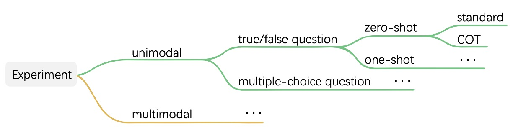
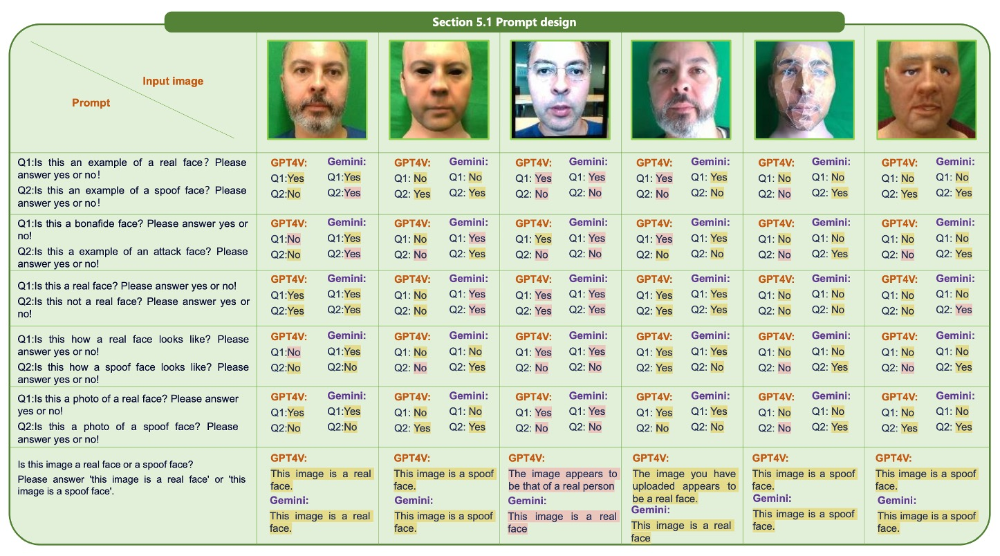

## 教えてください、なぜ？

[**SHIELD : An Evaluation Benchmark for Face Spoofing and Forgery Detection with Multimodal Large Language Models**](https://arxiv.org/abs/2402.04178)

---

この論文を開いたところ、100 ページあり、うっかり手が震えてしまいました。

よく見ると、大部分がデータセットの内容について書かれていました……ああ、問題ないですね。

## 問題の定義

Face Anti-Spoofing（FAS）と Face Forgery Detection（FFD）という 2 つのタスクは、簡単に言えば、次のような質問をしています：

> 「目の前にあるこの顔は、本物か、それとも罠か？」

前者は、写真やビデオ、3D マスクなどを使ってシステムに不正アクセスする（物理的攻撃）ことに関心があります。
後者は、GAN や Diffusion を使って偽の顔を合成する（デジタル攻撃）ことに関心があります。

---

FAS の初期は、手動の特徴量で真偽を判断していましたが、深層学習の登場により、CNN と大規模なデータセットが主流になりました（例：メタラーニングや少数ショット学習の方法）。

次に、Vision Transformers（ViTs）が空間的なパッチや時系列を扱い、まばたきや周期などの生理的信号を追加して認識精度を向上させました。

FFD に関しては、ほとんどの研究が二値分類タスクとして解決し、CNN を使って特徴を抽出して分類しています。見た目は正確ですが、実際には in-domain データセットにしか対応できず、データセットを変えると結果が崩れてしまいます。

偽造の痕跡をより細かく捉えるために、周波数領域分析、ノイズ特徴、局所空間学習などを使って強化する手法も登場しました。

しかし、現実世界での偽造手法の進化速度は予想以上に速く、固定された特徴だけでは追いつけません。

結局のところ、マルチモーダル大規模モデル（MLLM）の時代に突入しました。それでは、MLLM は状況を打開できるのでしょうか？

有名なアーキテクチャとしては、GPT-4V、Gemini、BLIP-2 などがあり、最近では画像とテキストのアライメント、記述生成、推論 QA などで広く応用されています……しかし：

- それらは「顔の真偽」を「理解できる」のでしょうか？
- 画像の中で不自然な部分を指摘でき、なぜそう判断したのか説明できるのでしょうか？
- 訓練なしで、見たことのない偽造画像を判断できるのでしょうか？

現時点では、**誰もこれを体系的に検証したことがありません。**

これは明らかに問題です！

そこで、論文の著者はこれを実行することに決め、新しいベンチマークを設計して、MLLM が FAS および FFD タスクでどのようにパフォーマンスを発揮するかを評価しました。

このタスクでは、もはや「この顔は本物か？」と単に尋ねるのではなく、さらに踏み込んで次のように尋ねます：

> **「この顔は本物に見えますか？理由を教えてください。」**

## 問題解決

この論文が試みることはシンプルですが、現時点では誰も行ったことがないことです：

- **マルチモーダル大規模モデル（MLLM）、例えば GPT-4V や Gemini を使って、それらが顔が偽造されているかどうかを見分け、さらに「なぜそう判断したのか」を教えてくれるかどうかを問うことです。**

しかし、正確に測定するためには、ただ画像を見せて「顔は本物か？」と聞くだけでは終わりません。

著者は、データ選定、タスク設計、質問の方法、モデルにどう思考させるかを考慮した完全なテストフレームワークを設計しました。これはプロンプトエンジニアリングではなく、もっと広範なタスク規格言語（task-level protocol）のようなものです。

データについては、以下のように 3 種類のテスト画像が用意されています：

<figure style={{"width": "90%"}}>

</figure>

- 行 1 は、FAS タスクでよく見られる物理的攻撃サンプルで、印刷された紙、スクリーン再生、剛性マスクや紙製マスクなどが含まれ、それぞれに RGB、深度、赤外線モダリティがあります。
- 行 2 は、Face Forgery Detection タスクで使われる代表的な偽造スタイルで、Deepfakes、Face2Face、FaceSwap、Nulltextures などがあります。
- 行 3 は、Stable Diffusion や InsightFace などの AIGC システムから生成された高精度な合成画像です。

これらの画像には元の顔がないため、全体が生成されており、一対一の対応関係はありません。これにより、判定がさらに難しくなります。

モデルがその理解能力を系統的に表現できるように、著者は判定タスクを二つのフォーマットに分けました：真偽問題と選択問題。

タスクの構造は以下の通りです：

<figure style={{"width": "90%"}}>

</figure>

真偽問題の例では、モデルに「これは本物の顔ですか？」とだけ質問され、選択問題では、四枚の画像から最も本物らしい顔を選びます。これらの質問は、ゼロショット、少数ショット、そして Chain-of-Thought（COT）を使って、モデルが答える前に理由を説明させるなど、さまざまなコンテキスト条件でテストされます。

この設計自体が、従来のモデル評価よりも繊細であり、著者はさらに一歩進んで、MA-COT（Multi-Attribute Chain of Thought）という推論メカニズムを提案しました。これにより、モデルは単に「画像を自由に説明する」のではなく、事前に定義された属性セットに基づいて分析を行います。

具体的には、モデルは「これは何か」を判断するだけでなく、「顔の輪郭が対称か」「紙の端があるか」「光と影が自然か」「目、耳、頭の動きが一貫しているか」などの属性について説明し、最後にそれらの中間的な記述に基づいて結論を出します。

これらの属性はタスクの種類によって異なり、完全な分類は以下の表に示されています：

<figure style={{"width": "70%"}}>

</figure>

以下は推論プロセスのより直感的な示意図です：

<figure style={{"width": "90%"}}>

</figure>

その動作方法は、まず画像の視覚信号を一連の属性記述に変換し、これらの記述とタスクの問題が一緒に MLLM に入力され、モデルが独自にその判断プロセスを組み立てます。このプロセスを、モデルに「考えるべきこと」を与えるようなものと考えることができます。記憶に頼ってパターンマッチングを行うのではなく。

なぜこんな回り道をするのでしょうか？

著者はモデルにこれらを学ばせるのではなく、「理解できるかどうか」をテストしたいのです。

データが新しい、スタイルが異なる、攻撃が見たことないものであれば、モデルは微調整なしで、記述に基づいて判断を下せるのでしょうか？これこそが本当の挑戦です。

ですので、著者は単に画像を並べて誰の精度が高いかを比較するのではなく、モデルが「この顔はちょっとおかしい」と認識できるか、そしてその理由を説明できるかを問いかけています。これは単なるベンチマークではなく、MLLM の理解能力をテストする「言語化されたタスク規範」の実験なのです。

## 討論

SHIELD の全体評価プロセスがモデルの理解能力を効果的に描写できるかどうかを検証するため、著者は現在公開されている代表的な 2 つのマルチモーダル大規模言語モデル（MLLM）：**GPT-4V** と **Gemini** を選び、API 呼び出し方式でテストを行いました。この 2 つのモデルは、視覚入力能力を持ち、一般的な画像とテキストのタスクを処理するように設計されているため、現在のこの分野で最も代表的な対照的な組み合わせとなっています。

実験設計において、著者は前述のタスク設計（真偽問題と選択問題）、テスト条件（ゼロショット、少数ショット）、およびプロンプト戦略（標準応答と COT）を組み合わせて、完全なテストマトリックスを構築し、さまざまな状況下での 2 つのモデルのパフォーマンスの違いを系統的に観察しました。このようなテスト方法は、モデルが「正しいかどうか」を確認するだけでなく、推論プロセスの安定性、誤り傾向、および応答構造の違いを明らかにします。

結果の表示において、異なるタイプのモデルの反応を比較しやすくするために、著者は応答結果に視覚的なマーキングを行いました：

- **正しい答えは黄色でマーキング**
- **誤答は赤でマーキング**
- **拒否回答や応答内容に特別な注意が必要な場合は青でマーキング**

このようなマーキング方法により、読者はモデルにとって挑戦的な問題がどれであるか、どのような状況でモデルが答えを拒否し、または推論過程で人間の直感と異なる論理的な流れが生じるかを一目で識別することができます。

### FAS テスト結果

Face Anti-Spoofing（FAS）タスクは SHIELD の中で最初に行った実験項目です。この部分は主に RGB を中心とした単一モーダルデータと、RGB、IR、深度画像で構成されたマルチモーダルデータを用いて、GPT-4V と Gemini の実際の攻撃の識別性能をテストしました。

正式にモデルテストを開始する前に、著者はまずプロンプト設計の探索を行いました。この部分の観察結果は以下の図に示されています：

<figure style={{"width": "90%"}}>

</figure>

実験の結果、異なる質問文がモデルの判断結果に顕著な影響を与えることが分かりました。

例えば：

- 「Is this image a real face?」このような聞き方ではモデルが「Yes」または「No」で答えることになり、良くない質問形式です。

逆に、モデルには「this image is a real face」または「this image is a spoof face」のような完全な文を直接出力させるべきです。これにより、モデルは問題をより明確に理解できるようになります。

また、真偽を単独で問うよりも、問題を選択肢としてまとめた方が精度が向上することが分かりました。この点は小さな違いのように見えますが、実際には現在の MLLM が文脈の細部に非常に敏感であることを示しており、プロンプト作成が単なる細部ではなく、モデルが性能を発揮できるための前提条件であることを意味しています。

次に、単一モーダルでのテストを見てみましょう：

- **真偽問題**

  :::tip
  以下の章では論文内に多くの画像が説明に使われていますが、いくつかの例を選んで示しています。その他は原論文をご覧ください。
  :::

  単一モーダルテストの最初のタスクは真偽問題で、モデルが単一の顔画像の真偽を判断する能力をテストします。

  GPT-4V と Gemini はどちらもゼロショットの状況で基本的な識別能力を示し、いくつかの実際の顔サンプルを正しく識別できましたが、紙製マスクや剛性マスクのシーンでは顕著な差異が見られました。以下の図に示します：

    

    <figure style={{"width": "90%"}}>
    
    </figure>
    

  Chain-of-Thought（COT）を導入した後、GPT-4V は画像の簡単な説明を行った後に判断を下す方法を取ります。これに対し、Gemini のパフォーマンスは比較的一貫しており、推論を積極的に行うことは少ないです。

  Replay と Print 攻撃は依然として主な失敗点です。このような攻撃は高解像度と自然なテクスチャを持っており、モデルを混乱させて真顔と誤認させることがあります。この問題は少数ショットを導入しても改善されませんでした。

  One-shot 条件では、既知の真顔をコンテキストとして加えることで明らかな改善が見られました。先験的知識は確かにモデルがタスク空間をより正確に理解するのに役立ちます。しかし、単一サンプルを提示するだけでは限界があり、特にテストサンプルと参照画像が非常に似ているが同じタイプではない場合には誤解を招くことがあります。

  また、COT の効果は二つのモデルで異なり、GPT-4V の回答は指導の下でより完全になり、Gemini は COT を導入してもその応答の長さや内容に大きな変化はなく、推論指示への従順度が低いことが示されました。

- **選択問題**

  次は複数画像を用いた選択問題です。このタスクでは、4 枚から 5 枚の画像の中でどれが本物の顔か、または攻撃タイプを判定する必要があります。このような問題では、モデルの全体的な比較能力と特徴分析能力が求められます。

  ゼロショットの状況では、GPT-4V は一部の偽造特徴を識別できるものの、Replay や Print の画像には依然として混乱が見られ、偽画像をよりリアルなサンプルとして誤判定することがありました。以下の図に示します：

    

    <figure style={{"width": "90%"}}>
    
    </figure>
    

  Gemini は簡単な問答では良好な結果を示しましたが、COT を導入すると細部の記述を行うことで判断が混乱し、最終的な評価に支障をきたしました。更に分析を進めると、GPT-4V は偽造特徴を察知できるものの、コンテキストの提示が欠けており、これらの特徴と攻撃タイプとの関連を正確に結びつけることができず、最終的に誤った判断をすることが多いことがわかりました。

  One-shot を導入した後、Replay と Print 攻撃の識別が顕著に改善されました。GPT-4V はより良い類推能力を持ち、以前の特徴と攻撃サンプルを関連付けて論理的に正しい選択を行いましたが、Gemini の回答は依然として断片的で、推論過程が途切れがちでした。

次に、マルチモーダルテスト（RGB + Depth + IR）を見てみましょう。

マルチモーダルテストの部分では、ゼロショットの状況でマルチモーダル情報を加えることで、両方のモデルは顔認識が容易になりました。ただし、GPT-4V はこのような入力で頻繁に安全機能を発動し、回答を拒否することが多くなりました。これは入力データの複雑さの増加と関係があり、また MLLM が高次元情報を処理する際の安全戦略が完全には成熟していないことを浮き彫りにしています。

選択問題に関して、複数画像およびマルチモーダル入力下で、両方のモデルの全体的なパフォーマンスは改善しましたが、GPT-4V は COT の指導下でより人間の期待に近い応答を示しました。ただし、サンプルが多すぎたり、情報が密すぎたりすると、Gemini は論理的な混乱を起こし、場合によってはタスクに無関係な回答を出力することがあります。

これらのテストは、プロンプト方法が適切に設計されていれば、MLLM はこのような構造化された判断タスクを処理できる能力を持っていることを示していますが、現在のところは安定性に欠ける部分もあります。

### FFD テスト結果

もし FAS が写真、スクリーン、マスクといった物理的攻撃を識別することに重点を置いているなら、face forgery detection（FFD）はまったく異なる挑戦を扱っています。

この攻撃形式は、最近の AIGC（人工知能生成コンテンツ）の進歩に伴い、ますます識別が難しくなっています。特に偽造された顔がもはや単なる顔の貼り付けではなく、画像全体が合成で再構築されるようになると、モデルの識別能力に対する要求も高まります。

この部分のテストロジックは前述の FAS と似ていますが、より細かいデジタル偽造に焦点を当てています。モデルは、それぞれの画像が本物の顔かどうかを答えるよう求められ、yes/no の形式で、その反応の違いを生成技術ごとに観察します。

結果から、いくつかの偽造手法が視覚的な痕跡を残していることが明らかに見て取れます。たとえば、局所的なぼやけ、不自然な対称性、光の反射異常などです。ほとんどの場合、モデルは正しく判断できます。しかし、生成されたサンプルが極めてリアルである場合、モデルの判断は明らかに困難になり、いくつかのケースでは拒否回答が現れることもあり、このタスクの複雑さがモデルのセキュリティ閾値を超えていることを示しています。

:::tip
論文内には単一モーダルおよびマルチモーダル、さらに真偽問題や選択問題を組み合わせたテストもありますが、ここでは詳述しません。
:::

## Unified Task テスト結果

前のセクションでは、GPT-4V と Gemini が FAS と Face Forgery Detection のタスクでどのようにパフォーマンスを発揮するかが検証されました。今回のセクションでは、これらの 2 つのタスクを統合して、実際のアプリケーションシナリオに近い unified detection タスクを構成しました：

> **モデルはもはや「どのタイプの攻撃か」とは言われず、同じ入力セット内で物理的攻撃（写真やマスクなど）とデジタル偽造（GAN や Diffusion 合成画像による）による顔の異常を同時に識別する必要があります。**

全体的に、GPT-4V と Gemini の間でこの統合タスクにおける差は明らかに広がりました。GPT-4V はほとんどの状況下で合理的かつ完全な回答を提供し、シンプルな問答や Chain-of-Thought（COT）推論を組み合わせた場合でも、安定した判断フローを保っています。

それに対して、Gemini の回答は一般的に短く、詳細な説明に欠けており、質問に対する応答方法や意味的な脈絡の把握が不十分です。いくつかのケースでは、Gemini は単文の応答のみを出し、ほとんど推論の軌跡が見られませんでした。

複数画像を同時に入力する状況を扱うため、著者は複数の画像を一つの画像として接続して、Gemini の入力制限を回避しました。しかし、この方法も画像構造の理解におけるモデルの困難さを露呈しました。Gemini は画像の境界を認識するのが難しく、異なるサブ画像の文脈を区別できず、物理的攻撃と合成攻撃のサンプルが混在して正しく区別できないことがわかりました。これにより、真顔サンプルを見つけ出すことがさらに難しくなります。

最後に、Diffusion 生成の顔画像は最も挑戦的なタイプであり、Gemini と GPT-4V のどちらもこのようなサンプルに対して顕著な混乱を見せました。特に、偽の顔がほぼ完璧な肌のテクスチャと自然な光の分布を持っている場合、モデルは表面的な画像だけで識別を行うのが非常に難しいです。これは、現在の MLLM が語彙的な判断や推論にある程度の能力を持っているものの、高度にリアルな視覚サンプルに直面すると、十分な詳細識別や説明能力が不足していることを示しています。

ただし、GPT-4V は一部のサンプルにおいて良好な理解の柔軟性を示しました。コンテキスト支援なしでも、GPT-4V は真顔サンプルを正確に指摘でき、COT と組み合わせた際の説明も合理的でした。これにより、曖昧な情報の中でも信頼できる判断の手がかりを整理できることが示されました。二元分類が難しいサンプルに対して、GPT-4V は正解を明確に示せない場合でも、複数の可能性のある選択肢をリストアップし、推論に基づいた証拠を提供する能力を示しました。

## MA-COT 実験結果

前のセクションでは、GPT-4V と Gemini の顔面攻撃検出タスクでの基本的なパフォーマンスが確認されました。

著者がここで主張するコアの設計は、MA-COT（Multi-Attribute Chain of Thought）というもので、これはマルチモーダルタスクに対して詳細な推論を行うフレームワークです。その目的は、モデルの判断を「全体の画像説明」型のブラックボックスモードから、属性ごとに分解する方法に変え、各推論ステップを説明可能で観察可能にすることです。

実験結果を見ると、MA-COT は GPT-4V に対して顕著な効果を示しました。

ゼロショットまたは標準 COT で判断に失敗した多くのサンプルが、属性分解の方法で誘導されると、GPT-4V はテクスチャの鮮明さ、エッジの一貫性、光沢の反射などの指標に基づいて、より論理的な推論を行い、最終的に正しい答えを見つけ出すことができました。このアプローチは、精度を高めるだけでなく、回答の説明可能性も向上させました。

それに対して、Gemini は MA-COT を導入しても顕著な進展は見られませんでした。その回答は依然として短く、形式が不安定で、多くの属性分析が最終的な判断を支えることができませんでした。推測するに、これは Gemini が段階的な推論能力に欠けていることが原因かもしれません。

## 結論

この論文が試みているのは、単純ですが重要な問題です：

> **既存のマルチモーダル大規模言語モデルは、「この顔は本当に問題があるのかどうか」を理解できるのでしょうか？**

SHIELD が提案する方法は、単なるベンチマークではなく、モデルに「なぜそう判断したのか」を伝えさせるためのテスト言語フレームワークのようなものです。その貢献は、最も正確なモデルを見つけることではなく、「モデルがどう考えているのか」を理解し始めるための方法を提供することにあります。将来的に、もし MLLM を顔のセキュリティタスクに使うのであれば、これが最も重要な出発点となるでしょう。
